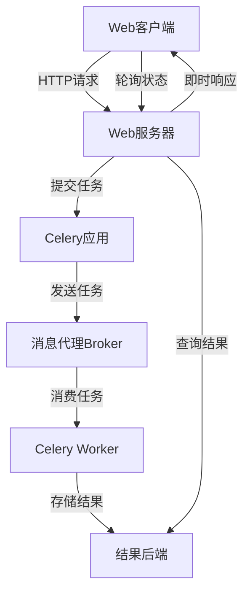

# Celery在Web应用中的集成

在现代Web应用开发中，处理耗时任务是一个常见的需求。将这些任务与主应用进程分离，通过消息队列异步处理，可以显著提高应用的响应性和用户体验。本章将详细介绍如何将Celery与主流Web框架集成，实现高效的异步任务处理。

## 1. Web框架集成概述

### 1.1 为什么需要在Web应用中使用Celery

在Web应用中使用Celery的主要优势包括：

1. **提高响应速度** - 避免长时间运行的任务阻塞HTTP请求
2. **增强可扩展性** - 可以独立扩展工作进程数量
3. **提高可靠性** - 通过重试机制处理临时故障
4. **优化资源利用** - 根据任务类型分配不同资源
5. **改善用户体验** - 提供任务状态反馈和进度更新

### 1.2 集成架构设计

在Web应用中集成Celery时，通常采用以下架构模式：



## 2. Flask集成

Flask作为一个轻量级Web框架，与Celery的集成相对简单直接。

### 2.1 基本集成配置

首先，我们需要在Flask应用中配置Celery实例：

```python
# app.py
from flask import Flask
from celery import Celery

app = Flask(__name__)
app.config['SECRET_KEY'] = 'your-secret-key'
# 配置Celery
app.config['CELERY_BROKER_URL'] = 'redis://localhost:6379/0'
app.config['CELERY_RESULT_BACKEND'] = 'redis://localhost:6379/0'

# 初始化Celery
celery = Celery(
    app.import_name,
    broker=app.config['CELERY_BROKER_URL'],
    backend=app.config['CELERY_RESULT_BACKEND']
)

# 更新Celery配置为Flask应用的配置
celery.conf.update(app.config)

# 可选：创建上下文任务基类
class ContextTask(celery.Task):
    def __call__(self, *args, **kwargs):
        with app.app_context():
            return self.run(*args, **kwargs)

celery.Task = ContextTask

# 定义任务
@celery.task()
def add_together(a, b):
    return a + b

@app.route('/')
def index():
    return 'Welcome to Flask-Celery Integration Example'

@app.route('/add/<int:a>/<int:b>')
def add_numbers(a, b):
    # 异步执行任务
    result = add_together.delay(a, b)
    # 返回任务ID，用于后续查询
    return f'Task submitted. Task ID: {result.id}'

@app.route('/result/<task_id>')
def get_result(task_id):
    result = add_together.AsyncResult(task_id)
    if result.ready():
        return f'Result: {result.get()}'
    else:
        return 'Task still processing...'

if __name__ == '__main__':
    app.run(debug=True)
```

### 2.2 使用工厂模式集成

对于更复杂的应用，推荐使用工厂模式来创建Flask和Celery实例：

```python
# extensions.py
from celery import Celery

# 创建Celery扩展实例
celery = Celery()

# app/__init__.py
from flask import Flask
from .extensions import celery

def create_app(config_name=None):
    app = Flask(__name__)
    
    # 加载配置
    if config_name == 'development':
        app.config.from_object('config.DevelopmentConfig')
    elif config_name == 'production':
        app.config.from_object('config.ProductionConfig')
    else:
        app.config.from_object('config.Config')
    
    # 初始化Celery
    celery.conf.update(app.config)
    
    # 导入蓝图
    from .main import main as main_blueprint
    app.register_blueprint(main_blueprint)
    
    return app

# config.py
class Config:
    SECRET_KEY = 'your-secret-key'
    CELERY_BROKER_URL = 'redis://localhost:6379/0'
    CELERY_RESULT_BACKEND = 'redis://localhost:6379/0'
    
class DevelopmentConfig(Config):
    DEBUG = True
    
class ProductionConfig(Config):
    DEBUG = False
    
# tasks.py
from .extensions import celery

@celery.task()
def long_running_task(data):
    # 任务逻辑
    import time
    time.sleep(10)  # 模拟长时间运行
    return f'Processed: {data}'
```

### 2.3 处理Flask应用上下文

在Celery任务中访问Flask应用上下文是一个常见需求，特别是当需要访问数据库或应用配置时：

```python
from flask import current_app
from .extensions import celery

@celery.task(bind=True, base=celery.Task)
def task_with_context(self, data):
    # 方法1: 直接使用应用上下文
    with current_app.app_context():
        # 现在可以访问current_app和数据库等
        app_config = current_app.config
        # 执行需要应用上下文的操作
        return f'Processed with context: {data}'

# 方法2: 使用自定义Task基类（如前面的ContextTask）
@celery.task()
def task_with_context_class(data):
    # 已经在__call__中自动创建了应用上下文
    app_config = current_app.config
    return f'Processed with context class: {data}'
```

## 3. Django集成

Django作为最流行的Python Web框架，与Celery有很好的集成支持。

### 3.1 基础配置

首先，在Django项目中安装Celery并进行基本配置：

```python
# myproject/celery.py
import os
from celery import Celery

# 设置Django的默认设置模块
def setup_celery():
    # 设置Django环境变量
    os.environ.setdefault('DJANGO_SETTINGS_MODULE', 'myproject.settings')
    
    # 创建Celery实例
    app = Celery('myproject')
    
    # 从Django的settings.py加载配置
    app.config_from_object('django.conf:settings', namespace='CELERY')
    
    # 自动发现任务模块
    app.autodiscover_tasks()
    
    return app

app = setup_celery()

# myproject/__init__.py
from .celery import app as celery_app

__all__ = ('celery_app',)

# myproject/settings.py
# Celery配置
CELERY_BROKER_URL = 'redis://localhost:6379/0'
CELERY_RESULT_BACKEND = 'redis://localhost:6379/0'
CELERY_ACCEPT_CONTENT = ['json']
CELERY_TASK_SERIALIZER = 'json'
CELERY_RESULT_SERIALIZER = 'json'
CELERY_TIMEZONE = 'Asia/Shanghai'
CELERY_ENABLE_UTC = True
```

### 3.2 在Django应用中定义任务

在Django应用中创建tasks.py文件来定义任务：

```python
# myapp/tasks.py
from myproject.celery import app
from myapp.models import MyModel
from django.core.mail import send_mail

@app.task
def process_model_instance(instance_id):
    """处理数据库模型实例的任务"""
    try:
        instance = MyModel.objects.get(id=instance_id)
        # 处理逻辑
        instance.processed = True
        instance.save()
        return f'Processed instance {instance_id}'
    except MyModel.DoesNotExist:
        return f'Instance {instance_id} does not exist'

@app.task(bind=True)
def send_notification_email(self, subject, message, recipient_list):
    """发送通知邮件的任务"""
    try:
        send_mail(
            subject,
            message,
            'from@example.com',
            recipient_list,
            fail_silently=False,
        )
        return f'Email sent to {recipient_list}'
    except Exception as exc:
        # 重试机制
        self.retry(exc=exc, countdown=60, max_retries=3)
```

### 3.3 在Django视图中使用Celery

在Django视图中调用Celery任务的示例：

```python
# myapp/views.py
from django.shortcuts import render, redirect
from django.http import JsonResponse
from .tasks import process_model_instance, send_notification_email


def submit_task(request):
    """提交任务的视图"""
    if request.method == 'POST':
        instance_id = request.POST.get('instance_id')
        # 异步执行任务
        task = process_model_instance.delay(instance_id)
        # 重定向到结果页面或返回任务ID
        return redirect('task_status', task_id=task.id)
    return render(request, 'submit_task.html')


def task_status(request, task_id):
    """显示任务状态的视图"""
    task = process_model_instance.AsyncResult(task_id)
    
    if task.ready():
        result = task.get()
        status = 'completed'
    else:
        result = None
        status = 'pending'
    
    return JsonResponse({
        'task_id': task_id,
        'status': status,
        'result': result
    })


def send_email_view(request):
    """发送邮件的视图"""
    if request.method == 'POST':
        subject = request.POST.get('subject')
        message = request.POST.get('message')
        email = request.POST.get('email')
        
        # 异步发送邮件
        task = send_notification_email.delay(subject, message, [email])
        
        return render(request, 'email_sent.html', {'task_id': task.id})
    return render(request, 'send_email.html')
```

## 4. FastAPI集成

FastAPI作为现代Python异步Web框架，与Celery的集成也非常便捷。

### 4.1 基本设置

以下是FastAPI与Celery集成的基本配置：

```python
# main.py
from fastapi import FastAPI, BackgroundTasks
from celery import Celery
import os

# 创建FastAPI应用
app = FastAPI(title="FastAPI Celery Integration")

# 配置Celery
celery = Celery(
    "tasks",
    broker=os.getenv("CELERY_BROKER_URL", "redis://localhost:6379/0"),
    backend=os.getenv("CELERY_RESULT_BACKEND", "redis://localhost:6379/0")
)

# 定义Celery任务
@celery.task(name="add_numbers")
def add_numbers(a: int, b: int) -> int:
    """简单的加法任务"""
    return a + b

@celery.task(name="process_data")
def process_data(data: dict) -> dict:
    """处理数据的任务"""
    # 模拟长时间处理
    import time
    time.sleep(5)
    return {"processed": True, "data": data}

# FastAPI端点
@app.post("/tasks/add/")
def add_task(a: int, b: int):
    """提交加法任务"""
    task = add_numbers.delay(a, b)
    return {"task_id": task.id, "status": "submitted"}

@app.get("/tasks/result/{task_id}")
def get_task_result(task_id: str):
    """获取任务结果"""
    task = add_numbers.AsyncResult(task_id)
    
    if task.ready():
        return {"task_id": task_id, "status": "completed", "result": task.get()}
    else:
        return {"task_id": task_id, "status": "pending"}

# 使用FastAPI的BackgroundTasks作为轻量级替代
@app.post("/background-tasks/")
def create_background_task(background_tasks: BackgroundTasks, data: dict):
    """使用FastAPI内置的后台任务（适合轻量级任务）"""
    # 注意：这不是Celery任务，而是FastAPI的内置功能
    background_tasks.add_task(process_data_in_background, data)
    return {"message": "Task added to background tasks"}

def process_data_in_background(data: dict):
    """在后台处理数据"""
    import time
    time.sleep(5)
    # 这里可以保存结果到数据库等
    return {"processed": True, "data": data}
```

### 4.2 FastAPI与Celery的异步协同

FastAPI原生支持异步，我们可以结合异步特性与Celery：

```python
# async_tasks.py
from fastapi import FastAPI, Depends
from sqlalchemy.ext.asyncio import AsyncSession
from celery import Celery
import os

app = FastAPI()

# 配置Celery
celery = Celery(
    "async_tasks",
    broker=os.getenv("CELERY_BROKER_URL", "redis://localhost:6379/0"),
    backend=os.getenv("CELERY_RESULT_BACKEND", "redis://localhost:6379/0")
)

# 数据库依赖（示例）
async def get_db():
    # 这里应该返回异步数据库会话
    pass

# 定义任务
@celery.task
def process_async_data(data_id: int) -> dict:
    """处理数据的Celery任务"""
    # 注意：Celery任务本身不能是异步的，但可以在其中调用同步代码
    # 模拟处理
    import time
    time.sleep(3)
    return {"processed": True, "data_id": data_id}

# 异步端点
@app.post("/submit-task/")
async def submit_task(data_id: int, db: AsyncSession = Depends(get_db)):
    """异步提交Celery任务"""
    # 在异步视图中可以进行异步数据库操作
    # 然后提交Celery任务
    task = process_async_data.delay(data_id)
    return {"task_id": task.id, "status": "submitted"}

@app.get("/task-status/{task_id}")
async def get_task_status(task_id: str):
    """异步获取任务状态"""
    task = process_async_data.AsyncResult(task_id)
    
    if task.ready():
        return {"task_id": task_id, "status": "completed", "result": task.get()}
    else:
        return {"task_id": task_id, "status": "pending"}
```

## 5. 其他框架集成

### 5.1 Tornado集成

Tornado是一个异步Web框架，与Celery的集成示例：

```python
# tornado_app.py
import tornado.ioloop
import tornado.web
from celery import Celery

# 配置Celery
celery = Celery(
    "tornado_tasks",
    broker="redis://localhost:6379/0",
    backend="redis://localhost:6379/0"
)

# 定义Celery任务
@celery.task
def process_tornado_data(data):
    """处理数据的任务"""
    import time
    time.sleep(3)
    return {"processed": True, "data": data}

# Tornado处理器
class MainHandler(tornado.web.RequestHandler):
    def get(self):
        self.write("Hello, Tornado with Celery!")

class TaskHandler(tornado.web.RequestHandler):
    def post(self):
        data = self.get_argument("data", "")
        task = process_tornado_data.delay(data)
        self.write({"task_id": task.id})

class ResultHandler(tornado.web.RequestHandler):
    def get(self, task_id):
        task = process_tornado_data.AsyncResult(task_id)
        if task.ready():
            self.write({"status": "done", "result": task.get()})
        else:
            self.write({"status": "processing"})

# 创建应用
application = tornado.web.Application([
    (r"/", MainHandler),
    (r"/task", TaskHandler),
    (r"/result/(.*)", ResultHandler),
])

if __name__ == "__main__":
    application.listen(8888)
    tornado.ioloop.IOLoop.current().start()
```

### 5.2 Pyramid集成

Pyramid框架与Celery的集成示例：

```python
# pyramid_app.py
from wsgiref.simple_server import make_server
from pyramid.config import Configurator
from pyramid.response import Response
from celery import Celery

# 配置Celery
celery = Celery(
    "pyramid_tasks",
    broker="redis://localhost:6379/0",
    backend="redis://localhost:6379/0"
)

# 定义任务
@celery.task
def pyramid_task(data):
    """Pyramid任务"""
    import time
    time.sleep(3)
    return {"processed": True, "data": data}

# Pyramid视图

def home(request):
    return Response("Pyramid with Celery Integration")

def submit_task(request):
    data = request.params.get("data", "")
    task = pyramid_task.delay(data)
    return Response(json_body={"task_id": task.id})

def task_result(request):
    task_id = request.matchdict['task_id']
    task = pyramid_task.AsyncResult(task_id)
    if task.ready():
        return Response(json_body={"status": "done", "result": task.get()})
    else:
        return Response(json_body={"status": "processing"})

# 配置Pyramid应用
if __name__ == '__main__':
    with Configurator() as config:
        config.add_route('home', '/')
        config.add_view(home, route_name='home')
        
        config.add_route('task', '/task')
        config.add_view(submit_task, route_name='task')
        
        config.add_route('result', '/result/{task_id}')
        config.add_view(task_result, route_name='result', renderer='json')
        
        app = config.make_wsgi_app()
    server = make_server('0.0.0.0', 6543, app)
    server.serve_forever()
```

## 6. 前端集成与任务状态展示

在Web应用中，向用户展示任务状态和进度是提升用户体验的重要部分。

### 6.1 使用AJAX轮询任务状态

使用JavaScript通过AJAX轮询来检查任务状态：

```javascript
// 使用Fetch API轮询任务状态
async function pollTaskStatus(taskId, updateCallback) {
    const url = `/tasks/result/${taskId}`;
    
    try {
        const response = await fetch(url);
        const data = await response.json();
        
        updateCallback(data);
        
        if (data.status === 'pending') {
            // 继续轮询
            setTimeout(() => pollTaskStatus(taskId, updateCallback), 1000);
        }
    } catch (error) {
        console.error('Error polling task status:', error);
        setTimeout(() => pollTaskStatus(taskId, updateCallback), 2000);
    }
}

// 更新UI的回调函数
function updateUI(data) {
    const statusElement = document.getElementById('task-status');
    const resultElement = document.getElementById('task-result');
    
    statusElement.textContent = `Status: ${data.status}`;
    
    if (data.status === 'completed') {
        resultElement.textContent = `Result: ${JSON.stringify(data.result)}`;
        // 停止轮询
    }
}

// 启动轮询
function monitorTask(taskId) {
    pollTaskStatus(taskId, updateUI);
}
```

### 6.2 使用WebSocket进行实时更新

对于需要更实时状态更新的应用，可以使用WebSocket：

```python
# 在Web服务器中设置WebSocket（以Flask为例使用Flask-SocketIO）
from flask import Flask, render_template
from flask_socketio import SocketIO
from .tasks import long_running_task
import time

app = Flask(__name__)
socketio = SocketIO(app, cors_allowed_origins="*")

@app.route('/')
def index():
    return render_template('index.html')

@app.route('/start-task')
def start_task():
    task = long_running_task.delay()
    # 启动一个后台任务来监控Celery任务并通过WebSocket发送更新
    socketio.start_background_task(monitor_task, task.id)
    return {'task_id': task.id}

# 更新Celery任务以支持进度报告
@long_running_task.task(bind=True)
def long_running_task(self, iterations=10):
    for i in range(iterations):
        # 更新任务状态
        self.update_state(
            state='PROGRESS',
            meta={'current': i, 'total': iterations, 'percent': (i/iterations)*100}
        )
        time.sleep(1)
    return {'current': iterations, 'total': iterations, 'percent': 100}

def monitor_task(task_id):
    task = long_running_task.AsyncResult(task_id)
    while not task.ready():
        if task.state == 'PROGRESS':
            socketio.emit('task_progress', task.info, room=request.sid)
        time.sleep(0.5)
    # 任务完成
    socketio.emit('task_complete', {'result': task.result}, room=request.sid)

if __name__ == '__main__':
    socketio.run(app)
```

对应的前端JavaScript：

```javascript
// 前端WebSocket代码
const socket = io();

// 连接事件
socket.on('connect', () => {
    console.log('Connected to server');
});

// 接收任务进度更新
socket.on('task_progress', (data) => {
    const progressBar = document.getElementById('progress-bar');
    const progressText = document.getElementById('progress-text');
    
    progressBar.value = data.percent;
    progressText.textContent = `${Math.round(data.percent)}% - ${data.current}/${data.total}`;
});

// 接收任务完成通知
socket.on('task_complete', (data) => {
    const statusElement = document.getElementById('task-status');
    statusElement.textContent = 'Task completed!';
    
    const resultElement = document.getElementById('task-result');
    resultElement.textContent = JSON.stringify(data.result);
});

// 开始任务
function startTask() {
    fetch('/start-task')
        .then(response => response.json())
        .then(data => {
            console.log('Task started with ID:', data.task_id);
        })
        .catch(error => console.error('Error starting task:', error));
}
```

## 7. 生产环境最佳实践

### 7.1 配置与部署建议

在生产环境中集成Celery时，有以下几点关键建议：

1. **使用专用的消息代理**
   - 生产环境应使用RabbitMQ或Redis Cluster
   - 确保消息代理有适当的持久化配置

2. **配置监控和日志**
   - 使用Flower监控Celery工作进程和任务
   - 配置集中式日志系统（如ELK、Graylog）

3. **工作进程优化**
   - 为不同类型的任务配置专用队列和工作进程
   - 根据CPU核心数调整工作进程数量
   - 配置适当的并发数和预取设置

4. **结果处理**
   - 及时清理过期结果
   - 对长时间运行的任务考虑禁用结果存储

### 7.2 容器化部署

使用Docker和Docker Compose部署集成了Celery的Web应用：

```yaml
# docker-compose.yml
version: '3'

services:
  web:
    build: .
    command: gunicorn myproject.wsgi:application --bind 0.0.0.0:8000
    volumes:
      - .:/app
    ports:
      - "8000:8000"
    depends_on:
      - redis
      - db
    environment:
      - CELERY_BROKER_URL=redis://redis:6379/0
      - CELERY_RESULT_BACKEND=redis://redis:6379/0

  worker:
    build: .
    command: celery -A myproject worker --loglevel=info
    volumes:
      - .:/app
    depends_on:
      - redis
      - db
    environment:
      - CELERY_BROKER_URL=redis://redis:6379/0
      - CELERY_RESULT_BACKEND=redis://redis:6379/0

  beat:
    build: .
    command: celery -A myproject beat --loglevel=info
    volumes:
      - .:/app
    depends_on:
      - redis
      - db
    environment:
      - CELERY_BROKER_URL=redis://redis:6379/0
      - CELERY_RESULT_BACKEND=redis://redis:6379/0

  redis:
    image: redis:alpine
    ports:
      - "6379:6379"

  db:
    image: postgres:13
    environment:
      - POSTGRES_DB=myproject
      - POSTGRES_USER=postgres
      - POSTGRES_PASSWORD=postgres
    ports:
      - "5432:5432"

  flower:
    build: .
    command: celery -A myproject flower
    ports:
      - "5555:5555"
    depends_on:
      - redis
    environment:
      - CELERY_BROKER_URL=redis://redis:6379/0
```

## 8. 集成案例：文件处理系统

下面是一个综合案例，展示如何在Web应用中集成Celery来处理文件上传和处理：

```python
# 文件处理应用示例（Flask + Celery）
from flask import Flask, request, jsonify, render_template, redirect, url_for
from werkzeug.utils import secure_filename
from celery import Celery
import os

app = Flask(__name__)
app.config['SECRET_KEY'] = 'supersecretkey'
app.config['UPLOAD_FOLDER'] = './uploads'
app.config['ALLOWED_EXTENSIONS'] = {'txt', 'pdf', 'doc', 'docx', 'csv', 'xlsx'}

# 确保上传文件夹存在
os.makedirs(app.config['UPLOAD_FOLDER'], exist_ok=True)

# 配置Celery
app.config['CELERY_BROKER_URL'] = 'redis://localhost:6379/0'
app.config['CELERY_RESULT_BACKEND'] = 'redis://localhost:6379/0'

celery = Celery(app.import_name, broker=app.config['CELERY_BROKER_URL'])
celery.conf.update(app.config)

# 辅助函数
def allowed_file(filename):
    return '.' in filename and \
           filename.rsplit('.', 1)[1].lower() in app.config['ALLOWED_EXTENSIONS']

# 定义Celery任务
@celery.task(bind=True)
def process_file(self, filepath, filename):
    """处理上传的文件"""
    # 更新任务状态为处理中
    self.update_state(state='PROCESSING', meta={'filename': filename, 'progress': 0})
    
    # 根据文件类型执行不同的处理
    file_ext = filename.rsplit('.', 1)[1].lower()
    
    # 模拟文件处理过程
    import time
    total_steps = 10
    results = {}
    
    # 步骤1: 读取文件
    time.sleep(1)
    self.update_state(state='PROCESSING', meta={
        'filename': filename,
        'progress': 10,
        'status': 'Reading file...'
    })
    results['read'] = 'File read successfully'
    
    # 步骤2: 解析文件内容（根据类型）
    time.sleep(1)
    self.update_state(state='PROCESSING', meta={
        'filename': filename,
        'progress': 30,
        'status': f'Parsing {file_ext} content...'
    })
    results['parsed'] = f'Content parsed as {file_ext}'
    
    # 步骤3: 处理数据
    time.sleep(2)
    self.update_state(state='PROCESSING', meta={
        'filename': filename,
        'progress': 70,
        'status': 'Processing data...'
    })
    results['processed'] = 'Data processed'
    
    # 步骤4: 生成结果
    time.sleep(1)
    self.update_state(state='PROCESSING', meta={
        'filename': filename,
        'progress': 90,
        'status': 'Generating results...'
    })
    
    # 完成处理
    time.sleep(0.5)
    results['completed'] = True
    results['filename'] = filename
    results['file_type'] = file_ext
    
    # 在实际应用中，这里可能会保存结果到数据库或生成输出文件
    
    return results

# Flask路由
@app.route('/')
def home():
    return render_template('upload.html')

@app.route('/upload', methods=['POST'])
def upload_file():
    # 检查是否有文件部分
    if 'file' not in request.files:
        return jsonify({'error': 'No file part'}), 400
    
    file = request.files['file']
    
    # 如果用户没有选择文件
    if file.filename == '':
        return jsonify({'error': 'No selected file'}), 400
    
    # 检查文件类型
    if file and allowed_file(file.filename):
        filename = secure_filename(file.filename)
        filepath = os.path.join(app.config['UPLOAD_FOLDER'], filename)
        file.save(filepath)
        
        # 提交文件处理任务
        task = process_file.delay(filepath, filename)
        
        # 重定向到任务状态页面
        return redirect(url_for('task_status', task_id=task.id))
    
    return jsonify({'error': 'File type not allowed'}), 400

@app.route('/status/<task_id>')
def task_status(task_id):
    return render_template('status.html', task_id=task_id)

@app.route('/api/status/<task_id>')
def api_task_status(task_id):
    task = process_file.AsyncResult(task_id)
    
    if task.state == 'PENDING':
        response = {
            'state': task.state,
            'status': 'Pending...'
        }
    elif task.state == 'PROCESSING':
        response = {
            'state': task.state,
            'status': task.info.get('status', 'Processing...'),
            'progress': task.info.get('progress', 0),
            'filename': task.info.get('filename', '')
        }
    elif task.state != 'FAILURE':
        response = {
            'state': task.state,
            'result': task.result
        }
    else:
        # 任务失败
        response = {
            'state': task.state,
            'error': str(task.result)
        }
    
    return jsonify(response)

if __name__ == '__main__':
    app.run(debug=True)
```

对应的前端HTML（upload.html）：

```html
<!DOCTYPE html>
<html>
<head>
    <title>File Upload with Celery Processing</title>
    <script src="https://code.jquery.com/jquery-3.6.0.min.js"></script>
</head>
<body>
    <h1>File Processing System</h1>
    <form id="upload-form" enctype="multipart/form-data">
        <input type="file" name="file" required>
        <button type="submit">Upload and Process</button>
    </form>
    
    <div id="message" style="margin-top: 20px;"></div>
    
    <script>
        $(document).ready(function() {
            $('#upload-form').on('submit', function(e) {
                e.preventDefault();
                
                var formData = new FormData(this);
                
                $.ajax({
                    url: '/upload',
                    type: 'POST',
                    data: formData,
                    contentType: false,
                    processData: false,
                    success: function(response) {
                        window.location.href = response.url; // 重定向到状态页面
                    },
                    error: function(xhr) {
                        $('#message').text('Error: ' + xhr.responseJSON.error);
                    }
                });
            });
        });
    </script>
</body>
</html>
```

状态页面（status.html）：

```html
<!DOCTYPE html>
<html>
<head>
    <title>Task Status</title>
    <script src="https://code.jquery.com/jquery-3.6.0.min.js"></script>
    <style>
        #progress-container {
            width: 100%;
            background-color: #f1f1f1;
            margin: 20px 0;
        }
        #progress-bar {
            width: 0%;
            height: 30px;
            background-color: #4CAF50;
            text-align: center;
            line-height: 30px;
            color: white;
        }
    </style>
</head>
<body>
    <h1>File Processing Status</h1>
    <div id="status"></div>
    <div id="progress-container">
        <div id="progress-bar">0%</div>
    </div>
    <div id="result"></div>
    
    <script>
        const taskId = "{{ task_id }}";
        
        function checkStatus() {
            $.getJSON(`/api/status/${taskId}`, function(data) {
                $('#status').text(`Status: ${data.state}`);
                
                if (data.state === 'PROCESSING') {
                    $('#progress-bar').width(`${data.progress}%`);
                    $('#progress-bar').text(`${data.progress}% - ${data.status}`);
                    setTimeout(checkStatus, 1000); // 继续轮询
                } else if (data.state === 'SUCCESS') {
                    $('#progress-bar').width('100%');
                    $('#progress-bar').text('100% - Completed');
                    $('#result').text('Result: ' + JSON.stringify(data.result));
                } else if (data.state === 'FAILURE') {
                    $('#status').css('color', 'red');
                    $('#result').text('Error: ' + data.error);
                }
            });
        }
        
        // 开始轮询
        checkStatus();
    </script>
</body>
</html>
```

## 9. 总结

本章详细介绍了如何将Celery与各种Web框架（Flask、Django、FastAPI、Tornado、Pyramid）集成，实现异步任务处理。我们学习了不同的集成模式、应用上下文管理、任务状态展示以及生产环境部署建议。

在Web应用中集成Celery可以显著提升应用性能和用户体验，特别是对于需要处理耗时操作的场景。通过合理的架构设计和最佳实践，我们可以构建出既高效又可靠的异步处理系统。

下一章，我们将探讨Celery的性能优化和最佳实践，帮助您进一步提升系统的性能和稳定性。