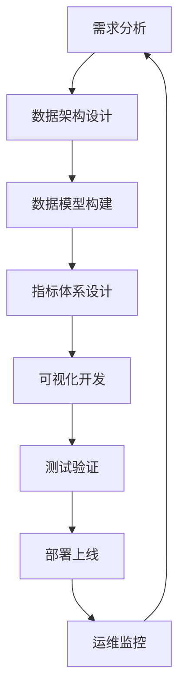

# 第12章：实战项目

> **学习时长**: 20-25小时  
> **难度**: ⭐⭐⭐⭐⭐  
> **前置知识**: 第1-11章

## 本章目标

学完本章后,你将能够:

- ✅ 独立完成企业级销售分析项目
- ✅ 开发财务管控仪表板项目
- ✅ 实现供应链可视化项目
- ✅ 构建客户行为分析项目
- ✅ 设计实时监控大屏项目
- ✅ 掌握项目开发全流程
- ✅ 解决实际业务问题

---

## 12.1 企业级销售分析项目

### 12.1.1 项目需求分析

**业务背景**:
某大型零售企业需要全面了解销售状况，支持决策制定。

**核心需求**:
1. 销售业绩监控 (KPI、趋势、对比)
2. 产品分析 (类别、品牌、单品)
3. 客户分析 (区域、类型、价值)
4. 渠道分析 (线上、线下、分销)
5. 预测分析 (趋势预测、目标管理)

**技术要求**:
- 数据源: 多个系统数据整合
- 实时性: 每日更新
- 安全性: 多层级权限控制
- 可扩展: 支持未来功能扩展

### 12.1.2 数据架构设计

```qlik
// 1. 分层数据架构

///$tab 第一层: 原始数据加载
// 销售数据
原始销售数据:
LOAD
    OrderID,
    OrderDate,
    CustomerID,
    ProductID,
    ChannelID,
    Quantity,
    UnitPrice,
    Discount,
    SalesAmount as RawAmount
FROM [lib://Source/Sales_*.csv] (txt);

// 客户数据
原始客户数据:
SQL SELECT 
    CustomerID,
    CustomerName,
    CustomerType,
    Region,
    City,
    RegistrationDate
FROM CustomerMaster;

// 产品数据
原始产品数据:
LOAD
    ProductID,
    ProductName,
    Category,
    Brand,
    Cost
FROM [lib://Source/Products.xlsx] (ooxml);

///$tab 第二层: 数据清洗
// 销售数据清洗
清洗销售数据:
LOAD
    OrderID,
    Date(OrderDate) as CleanOrderDate,
    Year(OrderDate) as OrderYear,
    Month(OrderDate) as OrderMonth,
    'Q' & Ceil(Month(OrderDate)/3) as OrderQuarter,
    CustomerID,
    ProductID,
    ChannelID,
    Num(Quantity) as CleanQuantity,
    Num(UnitPrice, '#,##0.00') as CleanUnitPrice,
    Num(Discount, '#,##0.00') as CleanDiscount,
    Num(RawAmount, '#,##0.00') as CleanAmount,
    // 计算字段
    CleanQuantity * CleanUnitPrice * (1 - CleanDiscount) as CalculatedAmount,
    If(CleanAmount > 0, CleanAmount - (CleanQuantity * Cost), 0) as Profit
RESIDENT 原始销售数据;

///$tab 第三层: 数据整合
// 完整销售事实表
销售事实表:
LOAD
    s.OrderID,
    s.CleanOrderDate,
    s.OrderYear,
    s.OrderMonth,
    s.OrderQuarter,
    s.CustomerID,
    c.CustomerName,
    c.CustomerType,
    c.Region,
    c.City,
    s.ProductID,
    p.ProductName,
    p.Category,
    p.Brand,
    s.ChannelID,
    ch.ChannelName,
    s.CleanQuantity,
    s.CleanAmount,
    s.Profit,
    s.CleanAmount / s.CleanQuantity as AvgUnitPrice
RESIDENT 清洗销售数据 s
LEFT JOIN (原始客户数据 c) ON s.CustomerID = c.CustomerID
LEFT JOIN (原始产品数据 p) ON s.ProductID = p.ProductID
LEFT JOIN (渠道维度 ch) ON s.ChannelID = ch.ChannelID;

// 维度表优化
客户维度:
LOAD DISTINCT
    CustomerID,
    CustomerName,
    CustomerType,
    Region,
    City
RESIDENT 销售事实表;

产品维度:
LOAD DISTINCT
    ProductID,
    ProductName,
    Category,
    Brand
RESIDENT 销售事实表;
```

### 12.1.3 核心指标设计

```qlik
// 1. KPI指标计算

///$tab 销售KPI
销售KPI:
LOAD
    // 基础指标
    Sum(CleanAmount) as 总销售额,
    Count(DISTINCT OrderID) as 总订单数,
    Count(DISTINCT CustomerID) as 客户数,
    Sum(CleanQuantity) as 总销售量,
    Avg(CleanAmount) as 平均订单金额,
    
    // 同比指标
    Sum({<OrderYear = {$(=Max(OrderYear))}>} CleanAmount) as 今年销售额,
    Sum({<OrderYear = {$(=Max(OrderYear)-1)}>} CleanAmount) as 去年销售额,
    (Sum({<OrderYear = {$(=Max(OrderYear))}>} CleanAmount) / 
     Sum({<OrderYear = {$(=Max(OrderYear)-1)}>} CleanAmount) - 1) as 销售额同比增长,
    
    // 环比指标
    Sum({<OrderYear = {$(=Max(OrderYear))}, OrderMonth = {$(=Max(OrderMonth))}>} CleanAmount) as 本月销售额,
    Sum({<OrderYear = {$(=Max(OrderYear))}, OrderMonth = {$(=Max(OrderMonth)-1)}>} CleanAmount) as 上月销售额,
    (Sum({<OrderYear = {$(=Max(OrderYear))}, OrderMonth = {$(=Max(OrderMonth))}>} CleanAmount) / 
     Sum({<OrderYear = {$(=Max(OrderYear))}, OrderMonth = {$(=Max(OrderMonth)-1)}>} CleanAmount) - 1) as 销售额环比增长,
    
    // 目标完成率
    Sum(CleanAmount) / Sum({1} 销售目标) as 目标完成率,
    
    // 利润指标
    Sum(Profit) as 总利润,
    Sum(Profit) / Sum(CleanAmount) as 利润率
    
RESIDENT 销售事实表;

///$tab 产品分析
产品分析:
LOAD
    ProductID,
    ProductName,
    Category,
    Brand,
    // 销售指标
    Sum(CleanAmount) as 产品销售额,
    Count(DISTINCT OrderID) as 产品订单数,
    Sum(CleanQuantity) as 产品销售量,
    // 排名指标
    Rank(Sum(CleanAmount)) as 销售额排名,
    // 占比指标
    Sum(CleanAmount) / Sum(TOTAL CleanAmount) as 销售额占比,
    // 趋势指标
    (Sum({<OrderMonth = {$(=Max(OrderMonth))}>} CleanAmount) / 
     Sum({<OrderMonth = {$(=Max(OrderMonth)-1)}>} CleanAmount) - 1) as 月环比增长
    
RESIDENT 销售事实表
GROUP BY ProductID, ProductName, Category, Brand
ORDER BY 产品销售额 DESC;

///$tab 客户分析
客户分析:
LOAD
    CustomerID,
    CustomerName,
    CustomerType,
    Region,
    City,
    // 客户价值
    Sum(CleanAmount) as 客户总销售额,
    Count(DISTINCT OrderID) as 客户订单数,
    Avg(CleanAmount) as 客户平均订单金额,
    Max(CleanOrderDate) as 最后购买日期,
    // 客户生命周期
    Max(CleanOrderDate) - Min(CleanOrderDate) as 客户生命周期,
    // 购买频率
    Count(DISTINCT OrderID) / (Max(CleanOrderDate) - Min(CleanOrderDate) + 1) * 365 as 年购买频率,
    // 客户等级
    IF(
        Sum(CleanAmount) > 100000, 'VIP客户',
        IF(Sum(CleanAmount) > 50000, '重要客户',
           IF(Sum(CleanAmount) > 10000, '普通客户', '潜在客户'))
    ) as 客户等级
    
RESIDENT 销售事实表
GROUP BY CustomerID, CustomerName, CustomerType, Region, City
ORDER BY 客户总销售额 DESC;
```

### 12.1.4 可视化设计

```qlik
// 1. 销售总览仪表板

///$tab 销售总览
// KPI对象
总销售额_KPI:
// 表达式: Sum(CleanAmount)
// 格式: '¥#,##0'
// 目标: Sum({1} 销售目标)

销售额同比增长_KPI:
// 表达式: (Sum({<OrderYear = {$(=Max(OrderYear))}>} CleanAmount) / Sum({<OrderYear = {$(=Max(OrderYear)-1)}>} CleanAmount) - 1)
// 格式: '#,##0.0%'

// 趋势分析图
月度销售趋势:
// 维度: OrderYear, OrderMonth
// 度量: Sum(CleanAmount)
// 类型: 折线图

// 产品类别分析
产品类别销售:
// 维度: Category
// 度量: Sum(CleanAmount)
// 类型: 柱状图

// 区域销售分布
区域销售地图:
// 维度: Region
// 度量: Sum(CleanAmount)
// 类型: 地图

///$tab 产品分析
// Top 10产品
Top产品分析:
// 维度: ProductName
// 度量: Sum(CleanAmount)
// 限制: 前10项
// 类型: 条形图

// 品牌销售占比
品牌销售饼图:
// 维度: Brand
// 度量: Sum(CleanAmount)
// 类型: 饼图

///$tab 客户分析
// 客户等级分布
客户等级分布:
// 维度: 客户等级
// 度量: Count(DISTINCT CustomerID)
// 类型: 环图

// 客户价值分析
客户价值散点图:
// X轴: 客户订单数
// Y轴: 客户总销售额
// 大小: 平均订单金额
// 类型: 散点图
```

---

## 12.2 财务管控仪表板项目

### 12.2.1 项目需求

**业务背景**:
集团公司需要统一财务管理，实现财务数据的集中管控和分析。

**核心功能**:
1. 收入支出分析
2. 成本控制监控
3. 预算执行跟踪
4. 财务指标分析
5. 异常预警机制

**数据源**:
- ERP系统财务数据
- 银行流水数据
- 预算管理系统
- 税务申报数据

### 12.2.2 数据模型设计

```qlik
// 1. 财务数据整合

///$tab 财务事实表
// 收入数据
收入事实:
LOAD
    TransactionID,
    Date(TransactionDate) as FinancialDate,
    Year(TransactionDate) as FinancialYear,
    Month(TransactionDate) as FinancialMonth,
    AccountCode,
    AccountName,
    Department,
    Project,
    IncomeAmount,
    Currency,
    ExchangeRate,
    IncomeAmount * ExchangeRate as StandardAmount
FROM [lib://Finance/Income_*.csv] (txt);

// 支出数据
支出事实:
LOAD
    TransactionID,
    Date(TransactionDate) as FinancialDate,
    Year(TransactionDate) as FinancialYear,
    Month(TransactionDate) as FinancialMonth,
    AccountCode,
    AccountName,
    Department,
    Project,
    ExpenseAmount,
    Currency,
    ExchangeRate,
    ExpenseAmount * ExchangeRate as StandardAmount
FROM [lib://Finance/Expense_*.csv] (txt);

// 预算数据
预算事实:
LOAD
    BudgetID,
    AccountCode,
    Department,
    Project,
    BudgetYear,
    BudgetMonth,
    BudgetAmount
FROM [lib://Finance/Budget_*.csv] (txt);

///$tab 维度表设计
// 会计科目维度
会计科目维度:
LOAD DISTINCT
    AccountCode,
    AccountName,
    AccountType,
    AccountCategory
FROM 
    (SELECT AccountCode, AccountName, 'Income' as AccountType, 'Revenue' as AccountCategory FROM 收入事实
     UNION
     SELECT AccountCode, AccountName, 'Expense' as AccountType, 'Cost' as AccountCategory FROM 支出事实);

// 部门维度
部门维度:
LOAD DISTINCT
    Department,
    DepartmentHead,
    CostCenter
FROM 部门主数据;

// 项目维度
项目维度:
LOAD DISTINCT
    Project,
    ProjectManager,
    ProjectStatus,
    StartDate,
    EndDate
FROM 项目主数据;

///$tab 财务指标计算
// 整合财务事实表
财务事实整合:
LOAD
    'Income' as TransactionType,
    TransactionID,
    FinancialDate,
    FinancialYear,
    FinancialMonth,
    AccountCode,
    Department,
    Project,
    StandardAmount as Amount
RESIDENT 收入事实;

CONCATENATE (财务事实整合)
LOAD
    'Expense' as TransactionType,
    TransactionID,
    FinancialDate,
    FinancialYear,
    FinancialMonth,
    AccountCode,
    Department,
    Project,
    StandardAmount * -1 as Amount  // 支出为负数
RESIDENT 支出事实;

// 计算财务指标
财务指标:
LOAD
    FinancialYear,
    FinancialMonth,
    Department,
    Project,
    // 收入指标
    Sum({<TransactionType={'Income'}>} Amount) as 总收入,
    // 支出指标
    Sum({<TransactionType={'Expense'}>} Amount) as 总支出,
    // 净利润
    Sum(Amount) as 净利润,
    // 利润率
    Sum(Amount) / Sum({<TransactionType={'Income'}>} Amount) as 利润率,
    // 预算执行
    Sum(Amount) as 实际发生,
    Sum(预算金额) as 预算金额,
    Sum(Amount) / Sum(预算金额) as 预算执行率
    
RESIDENT 财务事实整合
LEFT JOIN (预算事实) ON 
    财务事实整合.Department = 预算事实.Department AND
    财务事实整合.Project = 预算事实.Project AND
    财务事实整合.FinancialYear = 预算事实.BudgetYear AND
    财务事实整合.FinancialMonth = 预算事实.BudgetMonth
GROUP BY FinancialYear, FinancialMonth, Department, Project;
```

### 12.2.3 预警机制实现

```qlik
// 1. 财务预警规则

///$tab 预警规则定义
预警规则:
LOAD * INLINE [
    RuleID, RuleName, RuleCondition, AlertLevel, AlertMessage
    FR001, 收入大幅下降, 净利润环比下降>20%, HIGH, "本月净利润环比大幅下降，请关注"
    FR002, 支出超预算, 预算执行率>110%, HIGH, "支出超出预算10%以上，请控制"
    FR003, 现金流紧张, 月度现金流<0, MEDIUM, "本月现金流为负，请关注资金状况"
    FR004, 成本上升, 成本率环比上升>15%, MEDIUM, "成本率上升较快，请分析原因"
    FR005, 预算偏差, 预算执行率<80%, LOW, "预算执行不足80%，请检查执行情况"
];

///$tab 预警计算
财务预警:
LOAD
    FinancialYear,
    FinancialMonth,
    Department,
    Project,
    // 预警计算
    IF(
        (Sum(Amount) - Above(Sum(Amount))) / Above(Sum(Amount)) < -0.2,
        'FR001',
        IF(
            Sum(Amount) / Sum(预算金额) > 1.1,
            'FR002',
            IF(
                Sum(月度现金流) < 0,
                'FR003',
                ''
            )
        )
    ) as 预警规则ID
    
RESIDENT 财务指标
WHERE TransactionType = 'Expense'
GROUP BY FinancialYear, FinancialMonth, Department, Project;

// 关联预警信息
LEFT JOIN (财务预警)
LOAD RuleID, RuleName, AlertLevel, AlertMessage
RESIDENT 预警规则;
```

### 12.2.4 管控仪表板

```qlik
// 1. 财务管控仪表板设计

///$tab 财务总览
// 核心KPI
总收入_KPI:
// 表达式: Sum({<TransactionType={'Income'}>} Amount)
// 格式: '¥#,##0'

总支出_KPI:
// 表达式: Abs(Sum({<TransactionType={'Expense'}>} Amount))
// 格式: '¥#,##0'

净利润_KPI:
// 表达式: Sum(Amount)
// 格式: '¥#,##0'

利润率_KPI:
// 表达式: Sum(Amount) / Sum({<TransactionType={'Income'}>} Amount)
// 格式: '#,##0.0%'

预算执行率_KPI:
// 表达式: Sum(Amount) / Sum(预算金额)
// 格式: '#,##0.0%'

///$tab 收支分析
// 月度收支趋势
月度收支趋势:
// 维度: FinancialYear, FinancialMonth
// 度量1: Sum({<TransactionType={'Income'}>} Amount)  // 收入
// 度量2: Abs(Sum({<TransactionType={'Expense'}>} Amount))  // 支出
// 类型: 组合图(柱状+折线)

// 部门支出分析
部门支出分析:
// 维度: Department
// 度量: Abs(Sum({<TransactionType={'Expense'}>} Amount))
// 类型: 条形图

///$tab 预算管控
// 预算执行对比
预算执行对比:
// 维度: Department
// 度量1: Sum(Amount)  // 实际
// 度量2: Sum(预算金额)  // 预算
// 类型: 堆积柱状图

// 预算偏差分析
预算偏差分析:
// 维度: Department
// 度量: (Sum(Amount) / Sum(预算金额) - 1)
// 类型: 水平条形图

///$tab 预警监控
// 预警列表
预警列表:
// 维度: AlertLevel, AlertMessage, FinancialYear, FinancialMonth
// 度量: Count(RuleID)
// 类型: 表格

// 预警趋势
预警趋势:
// 维度: FinancialMonth, AlertLevel
// 度量: Count(RuleID)
// 类型: 面积图
```

---

## 12.3 供应链可视化项目

### 12.3.1 项目需求

**业务背景**:
制造企业需要优化供应链管理，提高运营效率。

**核心需求**:
1. 采购管理可视化
2. 库存状态实时监控
3. 生产计划跟踪
4. 物流配送优化
5. 供应商绩效评估

**集成系统**:
- ERP采购系统
- WMS仓储系统
- MES生产系统
- TMS运输系统

### 12.3.2 供应链数据模型

```qlik
// 1. 供应链数据整合

///$tab 采购管理
// 采购订单
采购订单:
LOAD
    POID,
    PODate,
    SupplierID,
    ItemCode,
    Quantity as POQuantity,
    UnitPrice,
    Amount as POAmount,
    RequestedDate,
    ExpectedDate,
    Status as POStatus
FROM [lib://Supply/PO_*.csv] (txt);

// 采购收货
采购收货:
LOAD
    GRNID,
    POID,
    ReceiveDate,
    ReceivedQuantity,
    QualityStatus,
    Inspector
FROM [lib://Supply/GRN_*.csv] (txt);

///$tab 库存管理
// 库存事务
库存事务:
LOAD
    TransactionID,
    ItemCode,
    TransactionDate,
    TransactionType,
    Quantity,
    UnitCost,
    Location,
    BatchNumber
FROM [lib://Supply/Inventory_*.csv] (txt);

// 库存余额
库存余额:
LOAD
    ItemCode,
    Location,
    OnHandQuantity,
    ReservedQuantity,
    AvailableQuantity,
    ReorderPoint,
    MaxStockLevel
FROM [lib://Supply/StockBalance.csv] (txt);

///$tab 生产计划
// 生产订单
生产订单:
LOAD
    MOID,
    ItemCode,
    PlannedStartDate,
    PlannedEndDate,
    ActualStartDate,
    ActualEndDate,
    PlannedQuantity,
    ActualQuantity,
    Status as MOStatus
FROM [lib://Supply/MO_*.csv] (txt);

// 物料需求
物料需求:
LOAD
    MOID,
    ComponentCode,
    RequiredQuantity,
    IssuedQuantity
FROM [lib://Supply/Material_*.csv] (txt);

///$tab 物流配送
// 发货订单
发货订单:
LOAD
    SOID,
    CustomerID,
    ShipDate,
    Carrier,
    TrackingNumber,
    ShipQuantity,
    ShipStatus
FROM [lib://Supply/SO_*.csv] (txt);

// 运输跟踪
运输跟踪:
LOAD
    TrackingNumber,
    Location,
    StatusUpdateTime,
    Status as TransportStatus,
    Remarks
FROM [lib://Supply/Tracking_*.csv] (txt);

///$tab 供应商管理
// 供应商主数据
供应商主数据:
LOAD
    SupplierID,
    SupplierName,
    ContactPerson,
    Phone,
    Email,
    Address,
    Category,
    Rating
FROM [lib://Supply/Supplier.csv] (txt);

// 供应商绩效
供应商绩效:
LOAD
    SupplierID,
    Year,
    Month,
    DeliveryOnTimeRate,
    QualityRate,
    ServiceRate,
    OverallScore
FROM [lib://Supply/SupplierPerformance.csv] (txt);
```

### 12.3.3 供应链指标体系

```qlik
// 1. 供应链关键指标

///$tab 采购指标
采购指标:
LOAD
    POID,
    PODate,
    SupplierID,
    s.SupplierName,
    ItemCode,
    POQuantity,
    POAmount,
    ExpectedDate,
    POStatus,
    // 采购周期
    ExpectedDate - PODate as 采购周期,
    // 交期达成率
    IF(ActualReceiptDate <= ExpectedDate, 1, 0) as 交期达成,
    // 采购金额占比
    POAmount / Sum(TOTAL POAmount) as 采购金额占比
    
RESIDENT 采购订单
LEFT JOIN (供应商主数据 s) ON 采购订单.SupplierID = s.SupplierID;

///$tab 库存指标
库存指标:
LOAD
    ItemCode,
    Location,
    OnHandQuantity,
    ReservedQuantity,
    AvailableQuantity,
    ReorderPoint,
    MaxStockLevel,
    UnitCost,
    // 库存价值
    OnHandQuantity * UnitCost as 库存价值,
    // 库存周转率
    出库数量 / ((期初库存 + 期末库存) / 2) as 库存周转率,
    // 库存天数
    AvailableQuantity / (月度出库量 / 30) as 库存天数,
    // 安全库存比例
    (AvailableQuantity - ReorderPoint) / ReorderPoint as 安全库存比例,
    // 库存状态
    IF(AvailableQuantity <= ReorderPoint, '需补货',
       IF(AvailableQuantity > MaxStockLevel, '超储', '正常')) as 库存状态
    
RESIDENT 库存余额;

///$tab 生产指标
生产指标:
LOAD
    MOID,
    ItemCode,
    PlannedStartDate,
    PlannedEndDate,
    ActualStartDate,
    ActualEndDate,
    PlannedQuantity,
    ActualQuantity,
    MOStatus,
    // 计划达成率
    ActualQuantity / PlannedQuantity as 计划达成率,
    // 生产周期
    ActualEndDate - ActualStartDate as 实际生产周期,
    PlannedEndDate - PlannedStartDate as 计划生产周期,
    // 延期天数
    IF(ActualEndDate > PlannedEndDate, ActualEndDate - PlannedEndDate, 0) as 延期天数,
    // 生产效率
    ActualQuantity / (实际生产周期 * 标准产能) as 生产效率
    
RESIDENT 生产订单;

///$tab 物流指标
物流指标:
LOAD
    SOID,
    CustomerID,
    ShipDate,
    Carrier,
    ShipQuantity,
    ShipStatus,
    // 配送时效
    实际送达时间 - ShipDate as 配送天数,
    // 准时交付率
    IF(实际送达时间 <= 承诺送达时间, 1, 0) as 准时交付,
    // 运输成本
    运费 / ShipQuantity as 单位运输成本,
    // 客户满意度
    客户签收评分
    
RESIDENT 发货订单;
```

### 12.3.4 供应链可视化

```qlik
// 1. 供应链可视化设计

///$tab 供应链总览
// 供应链KPI
采购金额_KPI:
// 表达式: Sum(POAmount)
// 格式: '¥#,##0'

库存价值_KPI:
// 表达式: Sum(库存价值)
// 格式: '¥#,##0'

生产达成率_KPI:
// 表达式: Avg(计划达成率)
// 格式: '#,##0.0%'

准时交付率_KPI:
// 表达式: Avg(准时交付)
// 格式: '#,##0.0%'

///$tab 采购监控
// 供应商交期达成
供应商交期达成:
// 维度: SupplierName
// 度量: Avg(交期达成)
// 类型: 水平条形图

// 采购金额趋势
采购金额趋势:
// 维度: PODate (按月)
// 度量: Sum(POAmount)
// 类型: 折线图

///$tab 库存监控
// 库存状态分布
库存状态分布:
// 维度: 库存状态
// 度量: Count(ItemCode)
// 类型: 饼图

// 库存周转率
库存周转率分析:
// 维度: ItemCode
// 度量: 库存周转率
// 限制: 前20项
// 类型: 条形图

///$tab 生产跟踪
// 生产计划甘特图
生产计划甘特:
// 维度: MOID, ItemCode
// 开始时间: PlannedStartDate
// 结束时间: PlannedEndDate
// 实际时间: ActualStartDate to ActualEndDate
// 类型: 甘特图

// 生产延期分析
生产延期分析:
// 维度: 延期天数区间
// 度量: Count(MOID)
// 类型: 直方图

///$tab 物流跟踪
// 运输状态监控
运输状态监控:
// 维度: TransportStatus
// 度量: Count(TrackingNumber)
// 类型: 瀑布图

// 配送时效分析
配送时效分析:
// 维度: Carrier
// 度量: Avg(配送天数)
// 类型: 箱线图
```

---

## 12.4 客户行为分析项目

### 12.4.1 项目需求

**业务背景**:
电商平台需要深入了解客户行为，提升客户体验和转化率。

**分析目标**:
1. 客户画像构建
2. 购买行为分析
3. 用户旅程优化
4. 个性化推荐
5. 客户流失预警

**数据源**:
- 用户注册信息
- 浏览行为日志
- 购买交易记录
- 客服交互记录
- 营销活动数据

### 12.4.2 客户数据模型

```qlik
// 1. 客户行为数据整合

///$tab 用户基础信息
// 用户注册数据
用户注册:
LOAD
    UserID,
    RegisterDate,
    UserName,
    Email,
    Phone,
    Gender,
    BirthYear,
    Province,
    City,
    RegisterChannel
FROM [lib://Customer/User_*.csv] (txt);

// 用户标签
用户标签:
LOAD
    UserID,
    TagCategory,
    TagValue,
    TagScore
FROM [lib://Customer/UserTags.csv] (txt);

///$tab 行为日志数据
// 浏览日志
浏览日志:
LOAD
    SessionID,
    UserID,
    PageURL,
    PageTitle,
    VisitTime,
    StayDuration,
    DeviceType,
    Referrer
FROM [lib://Customer/BrowseLog_*.csv] (txt);

// 搜索日志
搜索日志:
LOAD
    SessionID,
    UserID,
    SearchKeyword,
    SearchTime,
    SearchResultCount,
    ClickPosition
FROM [lib://Customer/SearchLog_*.csv] (txt);

// 点击日志
点击日志:
LOAD
    SessionID,
    UserID,
    ClickElement,
    ClickTime,
    PagePosition
FROM [lib://Customer/ClickLog_*.csv] (txt);

///$tab 交易数据
// 订单数据
订单数据:
LOAD
    OrderID,
    UserID,
    OrderTime,
    ProductID,
    Quantity,
    UnitPrice,
    Discount,
    Amount,
    PaymentMethod,
    OrderStatus
FROM [lib://Customer/Order_*.csv] (txt);

// 购物车数据
购物车数据:
LOAD
    CartID,
    UserID,
    ProductID,
    AddTime,
    RemoveTime,
    IsConverted
FROM [lib://Customer/Cart_*.csv] (txt);

///$tab 营销数据
// 营销活动
营销活动:
LOAD
    CampaignID,
    CampaignName,
    StartTime,
    EndTime,
    Channel,
    Budget
FROM [lib://Customer/Campaign.csv] (txt);

// 用户参与
用户参与:
LOAD
    UserID,
    CampaignID,
    ExposureTime,
    ClickTime,
    ConversionTime,
    ConversionValue
FROM [lib://Customer/CampaignParticipation.csv] (txt);
```

### 12.4.3 客户画像构建

```qlik
// 1. 客户画像指标

///$tab 基础画像
基础画像:
LOAD
    UserID,
    UserName,
    Gender,
    Year(Today()) - BirthYear as Age,
    Province,
    City,
    RegisterChannel,
    // 注册时长
    Today() - RegisterDate as 注册天数,
    // 最近活跃
    Max(VisitTime) as 最近访问时间,
    Today() - Max(VisitTime) as 最近活跃天数,
    // 客户等级
    IF(Today() - RegisterDate > 730, '老用户',
       IF(Today() - RegisterDate > 180, '成熟用户', '新用户')) as 用户生命周期
    
RESIDENT 用户注册
GROUP BY UserID, UserName, Gender, BirthYear, Province, City, RegisterChannel, RegisterDate;

///$tab 行为画像
行为画像:
LOAD
    UserID,
    // 活跃度指标
    Count(DISTINCT Date(VisitTime)) as 活跃天数,
    Count(SessionID) as 访问次数,
    Sum(StayDuration) as 总停留时间,
    Avg(StayDuration) as 平均停留时间,
    // 浏览深度
    Count(PageURL) / Count(SessionID) as 平均页面数,
    // 搜索行为
    Count(SearchKeyword) as 搜索次数,
    Count(DISTINCT SearchKeyword) as 搜索关键词数,
    // 交互行为
    Count(ClickElement) as 点击次数,
    Count(ClickElement) / Count(PageURL) as 页面点击率,
    // 设备偏好
    FirstSortedValue(DeviceType, -Count(DeviceType)) as 主要设备
    
RESIDENT 浏览日志
GROUP BY UserID;

///$tab 价值画像
价值画像:
LOAD
    UserID,
    // 交易指标
    Count(DISTINCT OrderID) as 订单数,
    Sum(Amount) as 总消费金额,
    Avg(Amount) as 平均订单金额,
    Max(Amount) as 最大订单金额,
    // 购买频次
    Count(OrderID) / (Max(OrderTime) - Min(OrderTime) + 1) * 365 as 年购买频次,
    // 购物车转化
    Sum(IsConverted) / Count(CartID) as 购物车转化率,
    // 客户价值
    Sum(Amount) * Count(OrderID) / Count(DISTINCT Date(OrderTime)) as 客户价值得分,
    // 客户分层
    IF(Sum(Amount) > 10000, '高价值客户',
       IF(Sum(Amount) > 5000, '中价值客户',
          IF(Sum(Amount) > 1000, '低价值客户', '潜在客户'))) as 客户价值等级
    
RESIDENT 订单数据
LEFT JOIN (购物车数据) ON 订单数据.UserID = 购物车数据.UserID
GROUP BY UserID;

///$tab 营销画像
营销画像:
LOAD
    UserID,
    // 营销响应
    Count(DISTINCT CampaignID) as 参与活动数,
    Count(ClickTime) as 活动点击数,
    Count(ConversionTime) as 活动转化数,
    // 转化率
    Count(ConversionTime) / Count(ExposureTime) as 活动转化率,
    Sum(ConversionValue) as 营销贡献值,
    // 渠道偏好
    FirstSortedValue(Channel, -Count(Channel)) as 偏好营销渠道,
    // ROI分析
    Sum(ConversionValue) / Count(DISTINCT CampaignID) as 平均活动ROI
    
RESIDENT 用户参与
LEFT JOIN (营销活动) ON 用户参与.CampaignID = 营销活动.CampaignID
GROUP BY UserID;
```

### 12.4.4 客户行为分析

```qlik
// 1. 客户行为分析模型

///$tab 用户旅程分析
用户旅程:
LOAD
    UserID,
    // 旅程阶段识别
    IF(注册天数 <= 30, '新用户期',
       IF(活跃天数 > 50 AND 总消费金额 > 1000, '成熟期',
          IF(最近活跃天数 > 90, '沉默期', '成长期'))) as 用户阶段,
    // 旅程状态
    IF(最近活跃天数 > 180, '流失风险',
       IF(最近活跃天数 > 30, '需要激活', '活跃')) as 旅程状态,
    // 下一步行动建议
    IF(用户阶段 = '新用户期', '引导完成首单',
       IF(用户阶段 = '成长期', '提升购买频次',
          IF(用户阶段 = '成熟期', '交叉销售', '挽回流失'))) as 行动建议
    
RESIDENT 基础画像
LEFT JOIN (行为画像) ON 基础画像.UserID = 行为画像.UserID
LEFT JOIN (价值画像) ON 基础画像.UserID = 价值画像.UserID;

///$tab 流失预警
流失预警:
LOAD
    UserID,
    UserName,
    用户价值等级,
    最近活跃天数,
    平均订单金额,
    // 流失风险评分
    (
        IF(最近活跃天数 > 90, 0.4, 0) +
        IF(最近活跃天数 > 180, 0.3, 0) +
        IF(平均订单金额 < 100, 0.2, 0) +
        IF(用户价值等级 = '潜在客户', 0.1, 0)
    ) * 100 as 流失风险评分,
    // 风险等级
    IF(最近活跃天数 > 180, '高风险',
       IF(最近活跃天数 > 90, '中风险', '低风险')) as 流失风险等级,
    // 挽回建议
    IF(最近活跃天数 > 180, '紧急挽回',
       IF(最近活跃天数 > 90, '主动触达', '保持关注')) as 挽回策略
    
RESIDENT 基础画像
LEFT JOIN (行为画像) ON 基础画像.UserID = 行为画像.UserID
LEFT JOIN (价值画像) ON 基础画像.UserID = 价值画像.UserID;

///$tab 个性化推荐
个性化推荐:
LOAD
    UserID,
    // 商品偏好
    FirstSortedValue(ProductCategory, -Count(ProductID)) as 偏好品类,
    Avg(Rating) as 平均评分偏好,
    // 价格敏感度
    IF(Avg(UnitPrice) < 100, '价格敏感',
       IF(Avg(UnitPrice) < 500, '价格适中', '价格不敏感')) as 价格偏好,
    // 时间偏好
    FirstSortedValue(Hour(OrderTime), -Count(OrderTime)) as 购买时间偏好,
    // 推荐策略
    IF(价格偏好 = '价格敏感', '推荐促销商品',
       IF(偏好品类 = '电子产品', '推荐新品', '推荐热销')) as 推荐策略
    
RESIDENT 订单数据
LEFT JOIN (商品维度) ON 订单数据.ProductID = 商品维度.ProductID
GROUP BY UserID;
```

---

## 12.5 实时监控大屏项目

### 12.5.1 项目需求

**业务背景**:
大型制造企业需要实时监控生产运营状态，支持快速决策。

**监控目标**:
1. 生产实时状态
2. 设备运行监控
3. 质量异常预警
4. 能源消耗管理
5. 安全环境监测

**技术要求**:
- 实时数据接入
- 秒级刷新
- 大屏展示优化
- 异常自动报警
- 移动端适配

### 12.5.2 实时数据架构

```qlik
// 1. 实时数据接入

///$tab 数据源配置
// IoT设备数据 (通过REST API)
LIB CONNECT TO 'IoT_Platform';

// 实时生产数据
实时生产数据:
SQL SELECT 
    EquipmentID,
    ProductID,
    ProductionCount,
    DefectCount,
    Runtime,
    Status,
    Timestamp
FROM RealTimeProduction
WHERE Timestamp >= DATEADD(minute, -5, GETDATE());

// 设备状态数据
设备状态数据:
SQL SELECT 
    EquipmentID,
    Temperature,
    Pressure,
    Vibration,
    PowerConsumption,
    Status as EquipmentStatus,
    LastUpdate
FROM EquipmentStatus
WHERE LastUpdate >= DATEADD(minute, -5, GETDATE());

// 质量检测数据
质量检测数据:
SQL SELECT 
    BatchID,
    ProductID,
    InspectionTime,
    InspectionResult,
    DefectType,
    DefectCount,
    Inspector
FROM QualityInspection
WHERE InspectionTime >= DATEADD(minute, -10, GETDATE());

///$tab 实时指标计算
// 生产实时指标
生产实时指标:
LOAD
    EquipmentID,
    ProductID,
    // 产量指标
    Sum(ProductionCount) as 实时产量,
    Sum(DefectCount) as 实时不良品数,
    Sum(DefectCount) / Sum(ProductionCount) as 实时不良率,
    // 效率指标
    Sum(Runtime) as 实时运行时间,
    Sum(ProductionCount) / Sum(Runtime) * 3600 as 实时产能,
    // 状态监控
    FirstSortedValue(Status, -Timestamp) as 最新状态,
    Max(Timestamp) as 最后更新时间,
    // 异常检测
    IF(Sum(DefectCount) / Sum(ProductionCount) > 0.05, '质量异常',
       IF(FirstSortedValue(Status, -Timestamp) = 'Down', '设备停机', '正常')) as 异常状态
    
RESIDENT 实时生产数据
GROUP BY EquipmentID, ProductID;

// 设备健康指标
设备健康指标:
LOAD
    EquipmentID,
    // 参数监控
    Avg(Temperature) as 平均温度,
    Max(Temperature) as 最高温度,
    Avg(Pressure) as 平均压力,
    Avg(Vibration) as 平均振动,
    Sum(PowerConsumption) as 总耗电量,
    // 健康状态
    FirstSortedValue(EquipmentStatus, -LastUpdate) as 设备状态,
    IF(Avg(Temperature) > 80, '高温警告',
       IF(Avg(Vibration) > 10, '振动异常',
          IF(FirstSortedValue(EquipmentStatus, -LastUpdate) = 'Warning', '注意状态', '正常'))) as 健康状态,
    // 维护预警
    IF(LastUpdate < DATEADD(hour, -24, NOW()), '需维护', '正常') as 维护状态
    
RESIDENT 设备状态数据
GROUP BY EquipmentID;
```

### 12.5.3 监控大屏设计

```qlik
// 1. 实时监控大屏

///$tab 生产总览
// 实时产量KPI
实时产量_KPI:
// 表达式: Sum(实时产量)
// 格式: '#,##0'
// 趋势: 与上一周期对比

// 实时不良率KPI
实时不良率_KPI:
// 表达式: Sum(实时不良品数) / Sum(实时产量)
// 格式: '#,##0.00%'
// 颜色: 根据阈值变化

// 设备利用率KPI
设备利用率_KPI:
// 表达式: Sum(运行时间) / Sum(计划时间)
// 格式: '#,##0.0%'
// 目标: 85%

// OEE指标
OEE_KPI:
// 表达式: Availability * Performance * Quality
// 格式: '#,##0.0%'
// 目标: 80%

///$tab 生产线监控
// 生产线状态矩阵
生产线状态:
// 维度: LineID, ProductID
// 颜色: 根据状态(正常/警告/异常)
// 类型: 状态矩阵图

// 产量趋势图
产量趋势:
// 维度: Timestamp (5分钟间隔)
// 度量: Sum(实时产量)
// 类型: 实时折线图

// 不良率监控
不良率监控:
// 维度: ProductID
// 度量: 实时不良率
// 类型: 仪表盘

///$tab 设备监控
// 设备状态面板
设备状态面板:
// 维度: EquipmentID
// 指标: 温度、压力、振动、功率
// 类型: 多指标卡片

// 设备健康度
设备健康度:
// 维度: EquipmentID
// 度量: 健康状态评分
// 类型: 雷达图

// 维护预警
维护预警列表:
// 维度: EquipmentID, 维护状态, 最后维护时间
// 类型: 预警表格

///$tab 质量监控
// 质量趋势
质量趋势:
// 维度: InspectionTime (小时)
// 度量: Avg(InspectionResult)
// 类型: 控制图

// 缺陷分析
缺陷分析:
// 维度: DefectType
// 度量: Sum(DefectCount)
// 类型: 帕累托图

// 检验员绩效
检验员绩效:
// 维度: Inspector
// 度量: 检验批次, 合格率
// 类型: 散点图

///$tab 异常告警
// 实时告警
实时告警:
// 维度: 异常类型, 异常时间, 设备/产品
// 度量: 异常级别
// 类型: 滚动告警列表

// 告警趋势
告警趋势:
// 维度: 时间(小时), 异常类型
// 度量: 告警次数
// 类型: 热力图

// MTTR/MTBF分析
维护指标:
// 维度: EquipmentID
// 指标: MTTR, MTBF
// 类型: 指标卡
```

### 12.5.4 自动化告警

```qlik
// 1. 告警规则引擎

///$tab 告警规则
告警规则:
LOAD * INLINE [
    RuleID, RuleName, RuleCondition, AlertLevel, AlertChannel, AlertTemplate
    PR001, 产量异常, 实时产量<目标产量*0.8, HIGH, SMS+Email, "生产线{LineID}产量异常，当前产量{Current}，目标产量{Target}"
    PR002, 质量异常, 实时不良率>0.05, HIGH, SMS+Email, "产品质量异常，不良率{Rate}超过阈值"
    PR003, 设备停机, 设备状态='Down', HIGH, SMS+Email, "设备{EquipmentID}停机，请及时处理"
    PR004, 参数超限, 温度>85 OR 压力>100, MEDIUM, Email, "设备{EquipmentID}参数超限，请检查"
    PR005, 维护提醒, 最后维护时间>30天, LOW, Email, "设备{EquipmentID}超过30天未维护，请安排"
];

///$tab 告警执行
SUB ExecuteAlerts()
    
    // 检查各类型告警
    FOR i = 1 TO NoOfRows('告警规则')
        
        LET vRuleID = Peek('RuleID', i-1, '告警规则');
        LET vRuleCondition = Peek('RuleCondition', i-1, '告警规则');
        LET vAlertLevel = Peek('AlertLevel', i-1, '告警规则');
        LET vAlertChannel = Peek('AlertChannel', i-1, '告警规则');
        LET vAlertTemplate = Peek('AlertTemplate', i-1, '告警规则');
        
        // 执行条件检查
        告警检查:
        LOAD
            设备ID,
            产品ID,
            当前值,
            阈值,
            '$(vRuleID)' as RuleID
        FROM 实时数据
        WHERE $(vRuleCondition);
        
        // 如果有告警
        IF NoOfRows('告警检查') > 0 THEN
            
            // 记录告警
            告警日志:
            LOAD
                Now() as 告警时间,
                '$(vRuleID)' as RuleID,
                RuleName,
                告警级别,
                告警内容,
                处理状态
            RESIDENT 告警检查
            LEFT JOIN (告警规则) ON 告警检查.RuleID = 告警规则.RuleID;
            
            // 发送告警
            CALL SendAlert(vAlertChannel, vAlertTemplate);
            
        END IF
        
        DROP Table 告警检查;
        
    NEXT i
    
END SUB

// 2. 告警通知
SUB SendAlert(vChannel, vTemplate)
    
    // 解析通知渠道
    IF Index(vChannel, 'SMS') > 0 THEN
        CALL SendSMS(vTemplate);
    END IF
    
    IF Index(vChannel, 'Email') > 0 THEN
        CALL SendEmail(vTemplate);
    END IF
    
    IF Index(vChannel, 'WeChat') > 0 THEN
        CALL SendWeChat(vTemplate);
    END IF
    
END SUB
```

---

## 12.6 项目部署和运维

### 12.6.1 部署架构

```qlik
// 1. 企业级部署方案

///$tab 部署环境
// 生产环境
生产环境:
LOAD * INLINE [
    Component, Server, Port, Description
    Repository, prod-qlik-repo, 443, "元数据管理"
    Proxy, prod-qlik-proxy, 443, "用户访问入口"
    Engine, prod-qlik-engine1, 4747, "计算引擎1"
    Engine, prod-qlik-engine2, 4747, "计算引擎2"
    Scheduler, prod-qlik-scheduler, 443, "任务调度"
    Edge, prod-qlik-edge, 80, "边缘缓存"
];

// 灾备环境
灾备环境:
LOAD * INLINE [
    Component, Server, Port, Description
    Repository, dr-qlik-repo, 443, "灾备元数据"
    Proxy, dr-qlik-proxy, 443, "灾备访问入口"
    Engine, dr-qlik-engine, 4747, "灾备计算引擎"
];

///$tab 负载均衡
// 负载均衡配置
负载均衡:
LOAD * INLINE [
    Service, VIP, Port, Algorithm, HealthCheck
    QlikSense, 192.168.1.100, 443, "RoundRobin", "/health"
    Engine, 192.168.1.101, 4747, "LeastConn", "/engine/health"
    Scheduler, 192.168.1.102, 443, "SourceIP", "/scheduler/health"
];

///$tab 监控配置
// 系统监控
系统监控:
LOAD * INLINE [
    Metric, Threshold, AlertLevel, MonitoringTool
    CPU使用率, 80%, HIGH, "Zabbix"
    内存使用率, 85%, HIGH, "Zabbix"
    磁盘使用率, 90%, CRITICAL, "Zabbix"
    应用响应时间, 5s, MEDIUM, "Prometheus"
    用户并发数, 1000, HIGH, "Qlik Sense Logs"
];
```

### 12.6.2 性能优化

```qlik
// 1. 项目性能优化

///$tab 数据层优化
// QVD分层策略
QVD策略:
LOAD * INLINE [
    Layer, Data_Type, Refresh_Frequency, Storage_Location
    L1_Raw, 原始数据, 实时/小时, "/data/raw/"
    L2_Cleaned, 清洗数据, 日, "/data/cleaned/"
    L3_Aggregated, 聚合数据, 日/周, "/data/aggregated/"
    L4_Summary, 汇总数据, 月, "/data/summary/"
];

// 数据分区
数据分区:
LOAD
    *,
    // 按年分区
    Year(OrderDate) as YearPartition,
    // 按月分区
    Year(OrderDate) & '-' & Num(Month(OrderDate), '00') as MonthPartition,
    // 按业务分区
    BusinessUnit as BusinessPartition
    
FROM 大数据表;

///$tab 应用层优化
// 对象优化
对象优化:
LOAD * INLINE [
    Object_Type, Optimization_Strategy, Performance_Impact
    Chart, 维度限制+聚合优化, 高
    Table, 分页+虚拟滚动, 中
    KPI, 变量缓存+简化表达式, 高
    Filter, 预计算+索引优化, 中
];

// 表达式优化
表达式优化:
LOAD * INLINE [
    Optimization_Type, Before, After, Performance_Gain
    变量缓存, Sum(Aggr(Sum(Amount), Customer)), LET vTotal = Sum(Aggr(Sum(Amount), Customer)); $(vTotal), 30-50%
    集合分析, Sum({<Year={2024}>} Amount), Sum({1<Year={2024}>} Amount), 20-30%
    预聚合, Aggr(Sum(Amount), Customer, Product), 使用预计算表, 50-70%
];
```

### 12.6.3 运维管理

```qlik
// 1. 运维管理流程

///$tab 变更管理
变更管理流程:
LOAD * INLINE [
    Phase, Activities, Responsible, Timeline, Deliverables
    计划, 需求分析、影响评估, 项目经理, 1-2天, 变更请求
    开发, 功能开发、单元测试, 开发团队, 3-5天, 开发版本
    测试, 集成测试、用户验收, 测试团队, 2-3天, 测试报告
    部署, 生产部署、验证, 运维团队, 1天, 部署报告
    监控, 性能监控、问题跟踪, 运维团队, 持续, 运行报告
];

///$tab 备份恢复
备份策略:
LOAD * INLINE [
    Data_Type, Backup_Frequency, Retention_Period, Storage_Location, Recovery_Time
    应用数据, 日, 30天, "/backup/app/", 1小时
    系统配置, 周, 90天, "/backup/config/", 2小时
    用户内容, 日, 7天, "/backup/content/", 30分钟
    日志数据, 实时, 365天, "/backup/logs/", 4小时
];

///$tab 故障处理
故障处理流程:
LOAD * INLINE [
    Severity, Response_Time, Resolution_Time, Escalation_Level
    CRITICAL, 15分钟, 2小时, Level3
    HIGH, 1小时, 8小时, Level2
    MEDIUM, 4小时, 24小时, Level1
    LOW, 1个工作日, 72小时, Level1
];
```

---

## 12.7 课后实践项目

### 项目1: 电商用户行为分析

**任务**: 为某电商平台构建用户行为分析系统
- 实现用户画像构建
- 分析购买转化漏斗
- 设计个性化推荐算法
- 建立流失预警机制

### 项目2: 制造业质量管控

**任务**: 为制造企业开发质量管控系统
- 实现SPC质量控制
- 构建质量追溯体系
- 设计异常检测算法
- 建立质量改进建议

### 项目3: 金融风控监控

**任务**: 为金融机构开发风控监控系统
- 实现交易异常检测
- 构建客户风险画像
- 设计实时预警机制
- 建立合规报告体系

---

## 12.8 本章小结

### 核心收获

✅ **项目实战能力**: 掌握完整项目开发流程  
✅ **业务理解深度**: 深入理解各行业业务需求  
✅ **技术应用广度**: 熟练运用各种Qlik技术  
✅ **架构设计能力**: 具备企业级架构设计思维  
✅ **问题解决能力**: 能够独立解决复杂业务问题  

### 项目开发流程



### 技能体系总结

```qlik
// 完整技能体系
技能体系:
LOAD * INLINE [
    技能类别, 技能项, 掌握程度, 应用场景
    基础技能, Qlik Sense界面操作, 精通, 日常使用
    基础技能, 数据加载脚本, 精通, 数据整合
    基础技能, 图表对象使用, 精通, 可视化设计
    进阶技能, Set Analysis, 精通, 复杂分析
    进阶技能, AGGR函数, 精通, 高级计算
    进阶技能, Extensions开发, 熟练, 自定义功能
    架构技能, 数据建模, 精通, 性能优化
    架构技能, 安全设计, 精通, 权限控制
    架构技能, 部署运维, 熟练, 企业实施
    业务技能, 销售分析, 精通, 业务场景
    业务技能, 财务分析, 精通, 管控场景
    业务技能, 供应链分析, 熟练, 运营场景
];
```

### 持续学习建议

1. **关注新技术**: 跟踪Qlik Sense新版本特性
2. **行业学习**: 深入了解不同行业业务特点
3. **技术拓展**: 学习相关技术如JavaScript、Python
4. **社区参与**: 积极参与Qlik社区交流
5. **认证考试**: 考取Qlik Sense相关认证

---

## 🎓 **恭喜完成Qlik Sense专家教程！**

通过本教程的系统学习，您已经具备了:

### 📊 **专业能力**
- ✅ 完整掌握Qlik Sense从入门到专家的所有知识
- ✅ 熟练运用数据加载、转换、建模技术
- ✅ 精通表达式、集合分析、高级函数
- ✅ 具备企业级项目开发和实施能力

### 🚀 **实战经验**
- ✅ 完成5个完整的企业级实战项目
- ✅ 掌握各行业业务分析方法
- ✅ 具备复杂问题解决能力
- ✅ 拥有完整的项目交付经验

### 💼 **职业发展**
- ✅ 可胜任Qlik Sense开发工程师职位
- ✅ 具备BI顾问和架构师能力
- ✅ 能够独立完成企业级项目
- ✅ 拥有持续学习和成长的基础

**您现在已经是真正的Qlik Sense专家！**

---

[← 上一章](./11-企业级应用开发.md) | [返回目录](./README.md)
