# 第2章：数据加载基础

> **学习时长**: 8-10小时  
> **难度**: ⭐⭐  
> **前置知识**: 第1章

## 本章目标

学完本章后,你将能够:

- ✅ 掌握Qlik Sense所有数据连接器的使用
- ✅ 熟练编写基础Load脚本
- ✅ 连接文件、数据库、Web API等数据源
- ✅ 理解数据加载编辑器的完整功能
- ✅ 进行数据预览和调试
- ✅ 实现数据质量检查
- ✅ 优化数据加载性能

---

## 2.1 数据连接器概述

### 2.1.1 Qlik Sense支持的数据源

**Qlik Sense可以连接几乎所有数据源**:

```
数据源分类:

📁 文件数据源
├─ Excel (.xlsx, .xls)
├─ CSV / TXT
├─ JSON
├─ XML
├─ QVD (Qlik数据文件)
├─ QVX
└─ Parquet

🗄️ 数据库
├─ SQL Server
├─ Oracle
├─ MySQL / MariaDB
├─ PostgreSQL
├─ SAP HANA
├─ MongoDB
├─ Teradata
└─ Amazon Redshift

☁️ 云数据源
├─ Salesforce
├─ Google Analytics
├─ Microsoft Dynamics
├─ Azure SQL
├─ Amazon S3
└─ Google BigQuery

🌐 Web数据源
├─ REST API
├─ SOAP Web Services
├─ OData
└─ SharePoint

📊 其他
├─ ODBC
├─ OLE DB
└─ Custom Connectors
```

### 2.1.2 数据连接器架构

**Qlik Sense连接器工作原理**:

```mermaid
graph LR
    A[数据源] --> B[连接器]
    B --> C[数据加载编辑器]
    C --> D[加载脚本]
    D --> E[数据转换]
    E --> F[关联引擎]
    F --> G[内存存储]
```



**连接器类型**:

1. **内置连接器**: Qlik原生支持
2. **ODBC/OLEDB**: 通用数据库连接
3. **自定义连接器**: Qlik Connector SDK开发

### 2.1.3 数据连接权限

**Desktop vs Enterprise**:

```
Qlik Sense Desktop:
└─ 本地文件系统访问
└─ ODBC数据源
└─ 受限的Web连接

Qlik Sense Enterprise:
├─ 数据连接库管理
├─ 集中式连接配置
├─ 完整的安全控制
└─ 所有连接器支持
```

---

## 2.2 文件数据源

### 2.2.1 Excel文件

**加载Excel文件的方法**:

**方法1: 数据管理器 (推荐初学者)**

1. 点击 **[添加数据]**
2. 选择文件位置
3. 浏览选择Excel文件
4. 选择工作表
5. 预览数据
6. 调整字段类型
7. 点击 **[添加数据]**

**方法2: 数据加载编辑器 (专业方式)**

```qlik
// 基础Excel加载
LOAD
    订单ID,
    订单日期,
    客户名称,
    产品名称,
    数量,
    单价,
    金额
FROM [lib://DataFiles/销售数据.xlsx]
(ooxml, embedded labels, table is Sheet1);
```

**高级Excel加载**:

```qlik
// 指定特定区域
LOAD
    *
FROM [lib://DataFiles/数据.xlsx]
(ooxml, embedded labels, table is Sheet1, range is 'A1:G100');

// 跳过行
LOAD
    *
FROM [lib://DataFiles/数据.xlsx]
(ooxml, no labels, header is 3 lines, table is Sheet1);

// 加载多个工作表
LOAD * FROM [lib://DataFiles/数据.xlsx]
(ooxml, embedded labels, table is 销售);

LOAD * FROM [lib://DataFiles/数据.xlsx]
(ooxml, embedded labels, table is 客户);

LOAD * FROM [lib://DataFiles/数据.xlsx]
(ooxml, embedded labels, table is 产品);
```

**处理Excel特殊情况**:

```qlik
// 处理日期格式
LOAD
    订单ID,
    Date(Floor(订单日期)) as 订单日期,  // 标准化日期
    客户名称,
    金额
FROM [lib://DataFiles/订单.xlsx]
(ooxml, embedded labels, table is Sheet1);

// 处理空值
LOAD
    订单ID,
    If(Len(Trim(客户名称))=0, '未知', 客户名称) as 客户名称,
    If(IsNull(金额), 0, 金额) as 金额
FROM [lib://DataFiles/订单.xlsx]
(ooxml, embedded labels, table is Sheet1);

// 过滤数据
LOAD
    *
FROM [lib://DataFiles/订单.xlsx]
(ooxml, embedded labels, table is Sheet1)
WHERE 金额 > 0 AND Not IsNull(订单日期);
```

### 2.2.2 CSV/文本文件

**基础CSV加载**:

```qlik
// 标准CSV (逗号分隔)
LOAD
    *
FROM [lib://DataFiles/customers.csv]
(txt, utf8, embedded labels, delimiter is ',', msq);

// Tab分隔
LOAD
    *
FROM [lib://DataFiles/data.txt]
(txt, utf8, embedded labels, delimiter is '\t', msq);

// 分号分隔
LOAD
    *
FROM [lib://DataFiles/data_eu.csv]
(txt, utf8, embedded labels, delimiter is ';', msq);

// 固定宽度
LOAD
    @1:10 as 客户ID,
    @11:40 as 客户名称,
    @41:50 as 城市
FROM [lib://DataFiles/fixed_width.txt]
(fix, utf8, no labels);
```

**处理编码问题**:

```qlik
// UTF-8编码 (推荐)
LOAD * FROM data.csv (txt, utf8, embedded labels);

// UTF-16
LOAD * FROM data.csv (txt, unicode, embedded labels);

// ANSI/GBK (中文)
LOAD * FROM data.csv (txt, codepage is 936, embedded labels);

// 自动检测
LOAD * FROM data.csv (txt, embedded labels);
```

**大文件优化**:

```qlik
// 缓冲加载(Buffer)
Buffer LOAD
    *
FROM [lib://DataFiles/large_file.csv]
(txt, utf8, embedded labels, delimiter is ',');

// 分批加载
FOR i = 1 to 10
    LOAD
        *
    FROM [lib://DataFiles/data_part$(i).csv]
    (txt, utf8, embedded labels);
NEXT i;
```

### 2.2.3 JSON文件

**加载JSON**:

```json
// sample.json
{
    "customers": [
        {
            "id": 1,
            "name": "张三",
            "orders": [
                {"orderId": "001", "amount": 100},
                {"orderId": "002", "amount": 200}
            ]
        },
        {
            "id": 2,
            "name": "李四",
            "orders": [
                {"orderId": "003", "amount": 150}
            ]
        }
    ]
}
```

**Qlik脚本**:

```qlik
// 加载JSON
LOAD
    id,
    name,
    orders
FROM [lib://DataFiles/sample.json]
(json);

// 展开嵌套结构
customers:
LOAD
    id as CustomerID,
    name as CustomerName
FROM [lib://DataFiles/sample.json]
(json) WHERE NOT IsNull(id);

orders:
LOAD
    id as CustomerID,
    orderId,
    amount
FROM [lib://DataFiles/sample.json]
(json) WHERE NOT IsNull(orderId);
```

### 2.2.4 XML文件

**XML示例**:

```xml
<!-- products.xml -->
<products>
    <product>
        <id>P001</id>
        <name>产品A</name>
        <price>100</price>
        <category>电子</category>
    </product>
    <product>
        <id>P002</id>
        <name>产品B</name>
        <price>200</price>
        <category>家电</category>
    </product>
</products>
```

**加载XML**:

```qlik
products:
LOAD
    id as ProductID,
    name as ProductName,
    price as Price,
    category as Category
FROM [lib://DataFiles/products.xml]
(XmlSimple, table is [products/product]);
```

### 2.2.5 QVD文件

**什么是QVD?**

QVD (QlikView Data) 是Qlik专有的高性能数据格式:

- ✅ 极快的读写速度
- ✅ 高压缩比 (通常10:1)
- ✅ 保留数据结构
- ✅ 增量加载基础

**创建QVD**:

```qlik
// 从数据源加载并保存为QVD
Sales:
LOAD
    *
FROM [lib://DataFiles/sales.csv]
(txt, utf8, embedded labels);

STORE Sales INTO [lib://QVD/sales.qvd] (qvd);

// 优化的QVD存储
LOAD
    OrderID,
    Date(OrderDate) as OrderDate,
    CustomerID,
    ProductID,
    Num(Quantity) as Quantity,
    Num(Amount, '#,##0.00') as Amount
FROM [lib://DataFiles/orders.csv]
(txt, utf8, embedded labels);

STORE Orders INTO [lib://QVD/orders.qvd] (qvd);
DROP Table Orders;
```

**使用QVD**:

```qlik
// 优化加载(无转换)
Sales:
LOAD * FROM [lib://QVD/sales.qvd] (qvd);

// 超优化加载(最快)
Sales:
LOAD
    OrderID,
    OrderDate,
    CustomerID,
    Amount
FROM [lib://QVD/sales.qvd] (qvd);

// 增量加载
LET vLastLoad = Date(Floor(QvdCreateTime('[lib://QVD/sales.qvd]')));

// 加载历史数据
Sales:
LOAD * FROM [lib://QVD/sales.qvd] (qvd);

// 追加新数据
CONCATENATE (Sales)
LOAD *
FROM [lib://DataFiles/sales.csv]
(txt, utf8, embedded labels)
WHERE OrderDate > '$(vLastLoad)';

// 保存更新的QVD
STORE Sales INTO [lib://QVD/sales.qvd] (qvd);
```

---

## 2.3 数据库连接

### 2.3.1 SQL Server连接

**创建数据连接**:

1. **在QMC中创建连接** (Enterprise):
   - 连接名称: `SQL_Server_Production`
   - 类型: SQL Server
   - 服务器: `server.company.com`
   - 数据库: `SalesDB`
   - 认证: Windows/SQL Server

2. **在Desktop中使用ODBC**:

**ODBC配置**:

```powershell
# Windows ODBC数据源管理器
# 控制面板 → 管理工具 → ODBC数据源(64位)
# 添加系统DSN → SQL Server
```

**Load脚本**:

```qlik
LIB CONNECT TO 'SQL_Server_Production';

// 加载整表
Sales:
SQL SELECT
    OrderID,
    OrderDate,
    CustomerID,
    ProductID,
    Quantity,
    Amount
FROM dbo.Sales;

// 使用WHERE子句
Sales:
SQL SELECT *
FROM dbo.Sales
WHERE OrderDate >= '2024-01-01';

// JOIN多表
Orders:
SQL SELECT
    o.OrderID,
    o.OrderDate,
    c.CustomerName,
    p.ProductName,
    od.Quantity,
    od.Amount
FROM Orders o
INNER JOIN Customers c ON o.CustomerID = c.CustomerID
INNER JOIN OrderDetails od ON o.OrderID = od.OrderID
INNER JOIN Products p ON od.ProductID = p.ProductID;

// 使用参数
LET vStartDate = '2024-01-01';
LET vEndDate = '2024-12-31';

Sales:
SQL SELECT *
FROM dbo.Sales
WHERE OrderDate BETWEEN '$(vStartDate)' AND '$(vEndDate)';
```

**性能优化**:

```qlik
// ❌ 不推荐: 加载后过滤
Sales:
SQL SELECT * FROM Sales;  // 加载全部
WHERE OrderDate >= '2024-01-01';  // Qlik端过滤

// ✅ 推荐: 数据库端过滤
Sales:
SQL SELECT *
FROM Sales
WHERE OrderDate >= '2024-01-01';  // 数据库端过滤

// ✅ 最佳: 先存QVD,再使用QVD
// 第一次全量加载
Sales:
SQL SELECT * FROM Sales;
STORE Sales INTO [lib://QVD/sales.qvd] (qvd);
DROP Table Sales;

// 后续使用QVD
Sales:
LOAD * FROM [lib://QVD/sales.qvd] (qvd);
```

### 2.3.2 MySQL连接

```qlik
LIB CONNECT TO 'MySQL_Connection';

// 基础查询
Products:
SQL SELECT
    product_id,
    product_name,
    category,
    price
FROM products;

// 处理UTF-8中文
SET CharacterSet='utf8mb4';

Products:
SQL SELECT * FROM products;
```

### 2.3.3 Oracle连接

```qlik
LIB CONNECT TO 'Oracle_DB';

// Oracle特定语法
Sales:
SQL SELECT
    order_id,
    TO_CHAR(order_date, 'YYYY-MM-DD') as order_date,
    customer_id,
    amount
FROM sales
WHERE order_date >= TO_DATE('2024-01-01', 'YYYY-MM-DD');
```

### 2.3.4 PostgreSQL连接

```qlik
LIB CONNECT TO 'PostgreSQL_DB';

Customers:
SQL SELECT
    customer_id::TEXT as customer_id,
    customer_name,
    city,
    country
FROM customers;
```

---

## 2.4 Web数据源

### 2.4.1 REST API连接

**创建REST连接**:

```qlik
// REST Connector配置
LIB CONNECT TO 'REST_API';

// GET请求
RestConnectorMasterTable:
SQL SELECT
    "id",
    "name",
    "email"
FROM JSON (wrap on) "root"
WITH CONNECTION (
    URL "https://api.example.com/users"
);

// 带认证
RestConnectorMasterTable:
SQL SELECT *
FROM JSON
WITH CONNECTION (
    URL "https://api.example.com/data",
    HTTPHEADER "Authorization" "Bearer YOUR_TOKEN"
);

// POST请求
RestConnectorMasterTable:
SQL SELECT *
FROM JSON
WITH CONNECTION (
    URL "https://api.example.com/query",
    HTTPMETHOD "POST",
    BODY "{"query":"data"}",
    HTTPHEADER "Content-Type" "application/json"
);
```

**处理分页**:

```qlik
// 循环获取所有页
LET vPage = 1;
LET vHasMore = 1;

DO WHILE vHasMore = 1
    
    RestConnectorMasterTable:
    SQL SELECT
        "id",
        "name",
        "data"
    FROM JSON
    WITH CONNECTION (
        URL "https://api.example.com/data?page=$(vPage)"
    );
    
    LET vRecordCount = NoOfRows('RestConnectorMasterTable');
    
    IF vRecordCount = 0 THEN
        LET vHasMore = 0;
    ELSE
        LET vPage = vPage + 1;
    END IF
    
LOOP
```

### 2.4.2 Web文件加载

```qlik
// 从URL加载CSV
LOAD *
FROM [https://example.com/data/sales.csv]
(txt, utf8, embedded labels, delimiter is ',');

// 从Web加载Excel
LOAD *
FROM [https://example.com/data/report.xlsx]
(ooxml, embedded labels, table is Sheet1);
```

---

## 2.5 数据加载编辑器详解

### 2.5.1 界面布局

```
数据加载编辑器界面:

┌─────────────────────────────────────────────┐
│  文件 编辑 查看 调试 帮助                    │
├──────┬──────────────────────────────────────┤
│      │  // 主部分 - 脚本编辑区              │
│ 数据 │  LOAD                                │
│ 连接 │      OrderID,                        │
│      │      OrderDate,                      │
│ 选择 │      Amount                          │
│ 脚本 │  FROM [lib://Data/sales.csv]        │
│      │  (txt, utf8, embedded labels);      │
│ 变量 │                                      │
│      │                                      │
│ 表   │                                      │
├──────┴──────────────────────────────────────┤
│  ▶ 加载数据    调试    进度条               │
└─────────────────────────────────────────────┘
```

### 2.5.2 脚本结构

**标准脚本结构**:

```qlik
///$tab Main
// ========================================
// 主脚本
// 作者: [姓名]
// 日期: 2024-01-15
// 描述: 销售数据分析应用
// ========================================

///$tab 变量设置
// 设置变量
SET ThousandSep=',';
SET DecimalSep='.';
SET MoneyThousandSep=',';
SET MoneyDecimalSep='.';
SET MoneyFormat='¥#,##0.00;-¥#,##0.00';
SET TimeFormat='h:mm:ss';
SET DateFormat='YYYY-MM-DD';
SET TimestampFormat='YYYY-MM-DD hh:mm:ss[.fff]';

// 自定义变量
LET vToday = Date(Today());
LET vYesterday = Date(Today()-1);
LET vDataPath = 'lib://DataFiles';

///$tab 数据加载
// 加载销售数据
Sales:
LOAD
    OrderID,
    Date(OrderDate) as OrderDate,
    CustomerID,
    ProductID,
    Quantity,
    Amount
FROM [$(vDataPath)/sales.csv]
(txt, utf8, embedded labels);

// 加载客户数据
Customers:
LOAD
    CustomerID,
    CustomerName,
    City,
    Country
FROM [$(vDataPath)/customers.csv]
(txt, utf8, embedded labels);

///$tab 数据转换
// 数据清洗和转换
// (见第5章详细内容)

///$tab 日历表
// 创建日历维度
// (见后续章节)

///$tab 退出脚本
// 脚本结束
EXIT SCRIPT;
```

### 2.5.3 脚本调试

**调试技术**:

```qlik
// 1. 使用TRACE输出
TRACE 开始加载销售数据;
Sales:
LOAD * FROM sales.csv;
TRACE 销售数据加载完成, 行数: $(NoOfRows('Sales'));

// 2. 限制行数测试
Sales:
LOAD * FROM sales.csv (txt, utf8, embedded labels)
WHERE RecNo() <= 1000;  // 仅加载前1000行

// 3. 断点调试
// 在脚本中右键 → 切换断点
// 然后点击"调试"按钮

// 4. 查看加载进度
TRACE ===== 开始加载 =====;
FOR Each vFile in FileList('$(vDataPath)/*.csv')
    TRACE 加载文件: $(vFile);
    LOAD * FROM [$(vFile)] (txt, utf8, embedded labels);
NEXT

// 5. 错误处理
Sales:
LOAD * FROM sales.csv;

IF ScriptError THEN
    TRACE 错误: 无法加载销售数据;
    TRACE 错误代码: $(ScriptErrorCount);
    EXIT SCRIPT;
END IF
```

---

## 2.6 数据预览与验证

### 2.6.1 数据预览

**在加载过程中预览**:

```qlik
// 加载数据
Sales:
LOAD *
FROM [lib://Data/sales.csv]
(txt, utf8, embedded labels);

// 预览表
// 方法1: 脚本中添加
NullAsValue *;
SET NullValue = '<NULL>';

// 方法2: 数据模型查看器
// 加载后自动可以查看
```

### 2.6.2 数据质量检查

```qlik
///$tab 数据质量检查

// 1. 检查空值
QualityCheck_NullValues:
LOAD
    'Sales' as TableName,
    'OrderID' as FieldName,
    Count(*) as TotalRows,
    Sum(If(Len(Trim(OrderID))=0, 1, 0)) as NullCount
RESIDENT Sales;

// 2. 检查重复
QualityCheck_Duplicates:
LOAD
    OrderID,
    Count(*) as DuplicateCount
RESIDENT Sales
GROUP BY OrderID
HAVING Count(*) > 1;

// 3. 检查数据范围
QualityCheck_Range:
LOAD
    Min(OrderDate) as MinDate,
    Max(OrderDate) as MaxDate,
    Min(Amount) as MinAmount,
    Max(Amount) as MaxAmount,
    Avg(Amount) as AvgAmount
RESIDENT Sales;

// 4. 检查数据类型
QualityCheck_DataTypes:
LOAD
    OrderID,
    OrderDate,
    If(IsNum(Amount), 'Number', 'Not Number') as AmountType
RESIDENT Sales
WHERE If(IsNum(Amount), 0, 1) = 1;  // 仅显示错误的

// 输出检查结果到日志
TRACE ===== 数据质量检查 =====;
FOR i = 0 TO NoOfRows('QualityCheck_NullValues')-1
    LET vTableName = Peek('TableName', i, 'QualityCheck_NullValues');
    LET vFieldName = Peek('FieldName', i, 'QualityCheck_NullValues');
    LET vNullCount = Peek('NullCount', i, 'QualityCheck_NullValues');
    TRACE 表: $(vTableName), 字段: $(vFieldName), 空值: $(vNullCount);
NEXT
```

---

## 2.7 性能优化

### 2.7.1 加载性能优化

```qlik
// ❌ 低效
LOAD * FROM large_table.csv;  // 加载所有列

// ✅ 高效
LOAD
    OrderID,
    OrderDate,
    Amount  // 仅加载需要的列
FROM large_table.csv;

// ❌ 低效: 多次读取同一数据源
Sales:
LOAD * FROM data.csv;

Products:
LOAD DISTINCT ProductID FROM data.csv;

// ✅ 高效: 一次读取,多次使用
TempData:
LOAD * FROM data.csv;

Sales:
LOAD * RESIDENT TempData;

Products:
LOAD DISTINCT ProductID RESIDENT TempData;

DROP Table TempData;
```

### 2.7.2 使用Buffer

```qlik
// Buffer会缓存数据,下次加载时直接从缓存读取
Buffer (Incremental) LOAD
    *
FROM [lib://Data/large_file.csv]
(txt, utf8, embedded labels);

// Buffer有效期设置
Buffer (Stale after 7 days) LOAD
    *
FROM data.csv;
```

---

## 2.8 实验:综合数据加载

### 实验1: 多源数据整合

**目标**: 从Excel、CSV、数据库加载数据并整合

**数据准备**:

创建以下文件:

**orders.xlsx**:
```
OrderID | OrderDate  | CustomerID | Amount
001     | 2024-01-01 | C001       | 1000
002     | 2024-01-02 | C002       | 1500
```

**customers.csv**:
```
CustomerID,CustomerName,City
C001,张三,北京
C002,李四,上海
```

**Qlik脚本**:

```qlik
///$tab 订单数据
Orders:
LOAD
    OrderID,
    Date(OrderDate) as OrderDate,
    CustomerID,
    Num(Amount) as Amount
FROM [lib://Data/orders.xlsx]
(ooxml, embedded labels, table is Sheet1);

///$tab 客户数据
Customers:
LOAD
    CustomerID,
    CustomerName,
    City
FROM [lib://Data/customers.csv]
(txt, utf8, embedded labels);

///$tab 数据整合
// Qlik会自动关联CustomerID字段
// 无需手动JOIN

///$tab 验证
TRACE 订单数: $(NoOfRows('Orders'));
TRACE 客户数: $(NoOfRows('Customers'));
```

### 实验2: 增量加载

```qlik
///$tab 增量加载设置

// 检查QVD是否存在
IF NOT IsNull(QvdCreateTime('[lib://QVD/sales.qvd]')) THEN
    
    // 获取上次加载时间
    LET vLastLoadDate = Date(QvdCreateTime('[lib://QVD/sales.qvd]'), 'YYYY-MM-DD');
    
    // 加载历史数据
    Sales:
    LOAD * FROM [lib://QVD/sales.qvd] (qvd);
    
    // 追加新数据
    CONCATENATE (Sales)
    LOAD *
    FROM [lib://Data/sales.csv]
    (txt, utf8, embedded labels)
    WHERE OrderDate > '$(vLastLoadDate)';
    
ELSE
    // 第一次加载全部数据
    Sales:
    LOAD *
    FROM [lib://Data/sales.csv]
    (txt, utf8, embedded labels);
    
END IF

// 保存更新的QVD
STORE Sales INTO [lib://QVD/sales.qvd] (qvd);
```

---

## 2.9 课后练习

### 练习1: 多格式数据加载

**任务**:
1. 加载Excel文件 (products.xlsx)
2. 加载CSV文件 (sales.csv)
3. 确保数据关联正确
4. 创建简单可视化验证数据

### 练习2: 数据质量检查

**任务**:
编写脚本检查:
1. 空值数量
2. 重复记录
3. 数据类型错误
4. 日期范围

### 练习3: QVD优化

**任务**:
1. 将CSV数据转换为QVD
2. 实现增量加载
3. 对比加载时间差异

---

## 2.10 本章小结

### 核心知识点

✅ **数据连接器**: 文件、数据库、Web API

✅ **Load语法**: 基础加载语句结构

✅ **数据源类型**:
- Excel: ooxml
- CSV: txt
- JSON/XML: json/XmlSimple
- QVD: qvd

✅ **性能优化**:
- 使用QVD
- 仅加载需要的列
- 数据库端过滤
- Buffer缓存

✅ **数据质量**: 预览、验证、检查

### 关键语法

```qlik
// Excel
LOAD * FROM file.xlsx
(ooxml, embedded labels, table is Sheet1);

// CSV
LOAD * FROM file.csv
(txt, utf8, embedded labels, delimiter is ',');

// SQL
SQL SELECT * FROM table WHERE condition;

// QVD
LOAD * FROM file.qvd (qvd);
STORE table INTO file.qvd (qvd);
```

### 最佳实践

1. **先QVD后分析**: 原始数据→QVD→应用
2. **数据验证**: 每次加载后检查数据质量
3. **脚本注释**: 清晰的注释和文档
4. **版本控制**: 重要脚本保存多版本
5. **增量加载**: 大数据集使用增量

### 下一章预告

**第3章 - 数据模型设计**,将学习:
- 🌟 星型模型设计
- 🔗 数据关联原理
- 🔄 复合键与合成键
- 🚫 循环引用处理
- ⚡ 模型优化

---

[← 上一章](./1-Qlik_Sense概述与环境搭建.md) | [返回目录](./README.md) | [下一章: 数据模型设计 →](./3-数据模型设计.md)
