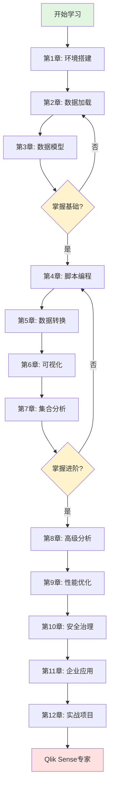

# Qlik Sense 从0入门到专家

> **完整学习路径**: 从零基础到专业商业智能分析师  
> **学习时长**: 100-120小时  
> **难度评级**: ⭐⭐⭐⭐⭐  
> **适用人群**: 数据分析师、BI开发者、业务分析师、数据科学家

---

## 📚 课程简介

本教程是一套完整的Qlik Sense学习体系，从零基础入门到企业级BI解决方案开发。通过深入的理论讲解、丰富的实战案例和完整的代码示例，帮助你成为Qlik Sense专家。

### 🎯 课程特色

- ✅ **零基础友好**: 从最基础的概念开始，逐步深入
- ✅ **理论+实践**: 每个知识点都配有详细示例和实验
- ✅ **企业级实战**: 真实业务场景的完整项目案例
- ✅ **代码可运行**: 所有示例代码可直接使用
- ✅ **深度讲解**: 不仅讲"怎么做"，更讲"为什么"
- ✅ **最佳实践**: 涵盖性能优化、设计模式、企业架构

---

## 📖 课程大纲

### 🌟 入门篇 (第1-3章)

#### [第1章: Qlik Sense概述与环境搭建](./1-Qlik_Sense概述与环境搭建.md)
**学习时长**: 6-8小时 | **难度**: ⭐

- Qlik Sense简介与核心概念
- 关联引擎与内存计算原理
- Qlik Sense vs Qlik View vs Power BI
- 架构组件详解
- Desktop/Enterprise版本安装
- 云版本(SaaS)使用指南
- 第一个App创建
- 界面导航与基本操作

#### [第2章: 数据加载基础](./2-数据加载基础.md)
**学习时长**: 8-10小时 | **难度**: ⭐⭐

- 数据连接器全解析
- 文件数据源(Excel, CSV, JSON, XML)
- 数据库连接(SQL Server, Oracle, MySQL)
- Web数据源与REST API
- 数据加载编辑器详解
- 基础Load语句
- 数据预览与调试
- 数据质量检查

#### [第3章: 数据模型设计](./3-数据模型设计.md)
**学习时长**: 10-12小时 | **难度**: ⭐⭐⭐

- 星型模型与雪花模型
- 关联数据模型原理
- 自动关联与手动关联
- 复合键与合成键
- 数据岛问题解决
- 循环引用处理
- 模型优化最佳实践
- 数据模型查看器使用

---

### 🔥 进阶篇 (第4-7章)

#### [第4章: 脚本编程深入](./4-脚本编程深入.md)
**学习时长**: 12-15小时 | **难度**: ⭐⭐⭐⭐

- Load脚本语法详解
- 变量与参数化
- 条件语句与循环
- 子程序与函数
- 增量加载技术
- QVD文件优化
- 脚本调试技巧
- 性能优化策略

#### [第5章: 数据转换与清洗](./5-数据转换与清洗.md)
**学习时长**: 10-12小时 | **难度**: ⭐⭐⭐

- 数据清洗技术
- 字符串处理函数
- 日期时间处理
- 数值计算与格式化
- 数据透视与逆透视
- 交叉表处理
- 层次结构构建
- 数据质量规则

#### [第6章: 可视化设计](./6-可视化设计.md)
**学习时长**: 12-15小时 | **难度**: ⭐⭐⭐

- 图表类型全解析
- 条形图、折线图、饼图
- 散点图、地图、仪表盘
- 表格与透视表
- KPI对象设计
- 自定义可视化
- 颜色与样式设计
- 响应式布局

#### [第7章: 表达式与集合分析](./7-表达式与集合分析.md)
**学习时长**: 15-18小时 | **难度**: ⭐⭐⭐⭐⭐

- 聚合函数详解(Sum, Count, Avg等)
- 集合分析语法与原理
- 集合标识符与修饰符
- 高级集合表达式
- 时间智能分析
- 同比、环比计算
- 累计计算
- 排名与TopN分析

---

### 💼 专家篇 (第8-10章)

#### [第8章: 高级分析技术](./8-高级分析技术.md)
**学习时长**: 12-15小时 | **难度**: ⭐⭐⭐⭐⭐

- 变量与书签应用
- 选择与状态管理
- 替代维度与度量
- 计算维度高级应用
- 嵌套聚合
- AGGR函数深度解析
- P()和E()函数
- 高级图表交互

#### [第9章: 性能优化与架构](./9-性能优化与架构.md)
**学习时长**: 10-12小时 | **难度**: ⭐⭐⭐⭐

- 性能监控与诊断
- 数据模型优化
- 脚本性能优化
- 前端渲染优化
- 内存管理策略
- 大数据量处理
- 分布式架构设计
- 缓存策略

#### [第10章: 安全与治理](./10-安全与治理.md)
**学习时长**: 8-10小时 | **难度**: ⭐⭐⭐⭐

- Section Access数据安全
- 行级、列级权限
- 用户管理与认证
- 权限管理最佳实践
- 数据治理策略
- 审计与合规
- 版本控制
- 部署流程

---

### 🚀 实战篇 (第11-12章)

#### [第11章: 企业级应用开发](./11-企业级应用开发.md)
**学习时长**: 15-18小时 | **难度**: ⭐⭐⭐⭐⭐

- NPrinting报表集成
- Qlik Sense Extensions开发
- Mashup API应用
- Qlik Engine API
- 自动化与调度
- 多环境部署
- CI/CD实践
- 监控与运维

#### [第12章: 实战项目](./12-实战项目.md)
**学习时长**: 20-25小时 | **难度**: ⭐⭐⭐⭐⭐

- **项目1**: 销售分析仪表板
- **项目2**: 财务报表系统
- **项目3**: 供应链可视化
- **项目4**: 客户行为分析
- **项目5**: 实时监控大屏
- 完整开发流程
- 最佳实践总结
- 案例分析与优化

---

## 🎓 学习路径



---

## 💡 学习建议

### 初学者路线 (0-3个月)

**Week 1-2**: 第1-2章
- 安装配置Qlik Sense Desktop
- 熟悉界面和基本操作
- 掌握基础数据加载

**Week 3-4**: 第3章
- 理解关联数据模型
- 练习构建星型模型
- 掌握模型优化技巧

**Week 5-8**: 第4-5章
- 深入学习脚本编程
- 掌握数据转换技术
- 完成数据清洗项目

**Week 9-12**: 第6-7章
- 精通各类可视化
- 深度理解集合分析
- 构建完整仪表板

### 进阶路线 (3-6个月)

**Month 4**: 第8-9章
- 高级分析技术
- 性能优化实践
- 企业级架构设计

**Month 5**: 第10-11章
- 安全与治理
- 企业应用开发
- API集成开发

**Month 6**: 第12章
- 完成5个实战项目
- 总结最佳实践
- 准备认证考试

---

## 📁 项目结构

```
bi/qlik_sense/
├── README.md                           # 本文件
├── 1-Qlik_Sense概述与环境搭建.md
├── 2-数据加载基础.md
├── 3-数据模型设计.md
├── 4-脚本编程深入.md
├── 5-数据转换与清洗.md
├── 6-可视化设计.md
├── 7-表达式与集合分析.md
├── 8-高级分析技术.md
├── 9-性能优化与架构.md
├── 10-安全与治理.md
├── 11-企业级应用开发.md
├── 12-实战项目.md
└── code/                               # 代码示例目录
    ├── chapter01/                      # 第1章代码
    │   ├── first_app.qvf
    │   └── data/
    ├── chapter02/                      # 第2章代码
    │   ├── load_excel.qvs
    │   ├── load_database.qvs
    │   └── sample_data/
    ├── chapter03/                      # 第3章代码
    ├── chapter04/                      # 第4章代码
    ├── chapter05/                      # 第5章代码
    ├── chapter06/                      # 第6章代码
    ├── chapter07/                      # 第7章代码
    ├── chapter08/                      # 第8章代码
    ├── chapter09/                      # 第9章代码
    ├── chapter10/                      # 第10章代码
    ├── chapter11/                      # 第11章代码
    └── chapter12/                      # 第12章项目代码
        ├── sales_dashboard/
        ├── finance_report/
        ├── supply_chain/
        ├── customer_analytics/
        └── realtime_monitor/
```

---

## 🛠️ 环境要求

### 软件要求

**Qlik Sense Desktop** (学习推荐)
- 操作系统: Windows 10/11 (64位)
- 内存: 最低8GB, 推荐16GB+
- 硬盘: 至少10GB可用空间
- 下载: [Qlik官网](https://www.qlik.com/us/trial/download-qlik-sense)

**Qlik Sense Enterprise** (企业环境)
- Windows Server 2016+
- 内存: 32GB+ (根据用户数)
- 数据库: PostgreSQL/SQL Server

**Qlik Sense Cloud** (SaaS版本)
- 浏览器: Chrome/Edge/Firefox最新版
- 网络: 稳定互联网连接

### 数据准备

本教程提供完整的示例数据集:
- 销售数据 (Sales_Data.xlsx)
- 客户数据 (Customers.csv)
- 产品信息 (Products.json)
- 订单明细 (Orders.csv)
- 地理维度 (Geography.xlsx)

---

## 📚 推荐资源

### 官方资源

- **Qlik官方文档**: https://help.qlik.com
- **Qlik Sense帮助**: https://help.qlik.com/sense
- **Qlik Community**: https://community.qlik.com
- **Qlik Branch**: https://branch.qlik.com (扩展与示例)

### 学习资源

- **Qlik Continuous Classroom**: 官方在线培训
- **YouTube**: Qlik官方频道
- **Qlik Design Blog**: 设计最佳实践
- **Qlik Quick Intelligence**: 技巧与窍门

### 认证考试

- **Qlik Sense Business Analyst Certification**
- **Qlik Sense Data Architect Certification**
- **Qlik Sense System Administrator Certification**

---

## 🎯 学习目标

完成本教程后，你将能够:

### 初级目标 (第1-3章)
- ✅ 独立安装和配置Qlik Sense环境
- ✅ 连接各类数据源并加载数据
- ✅ 设计规范的星型数据模型
- ✅ 创建基础的数据可视化

### 中级目标 (第4-7章)
- ✅ 编写高效的数据加载脚本
- ✅ 实现复杂的数据转换
- ✅ 设计专业的可视化仪表板
- ✅ 熟练使用集合分析

### 高级目标 (第8-10章)
- ✅ 开发企业级BI应用
- ✅ 优化应用性能
- ✅ 实施数据安全策略
- ✅ 设计可扩展的架构

### 专家目标 (第11-12章)
- ✅ 开发自定义扩展
- ✅ 集成外部系统
- ✅ 实施完整的BI解决方案
- ✅ 建立最佳实践体系

---

## 💼 职业发展

### 职业路径

**初级 BI分析师**
- 数据加载与清洗
- 基础报表开发
- 用户支持

**中级 BI开发工程师**
- 复杂仪表板开发
- 数据模型设计
- 性能优化

**高级 BI架构师**
- 企业BI架构设计
- 技术选型与评估
- 团队技术指导

**BI项目经理/顾问**
- 项目规划与管理
- 需求分析与设计
- 客户咨询服务

### 薪资范围 (仅供参考)

- 初级BI分析师: 8K-15K
- 中级BI开发: 15K-25K
- 高级BI架构师: 25K-40K
- BI项目经理: 30K-50K+

---

## 📖 使用说明

### 如何使用本教程

1. **按顺序学习**: 建议从第1章开始，循序渐进
2. **动手实践**: 每个示例都要亲自操作
3. **完成练习**: 每章末尾的练习题必做
4. **项目实战**: 第12章的项目至少完成3个
5. **笔记总结**: 记录关键点和个人心得

### 代码运行方式

1. **打开Qlik Sense Desktop**
2. **导入示例App**: 从code目录加载.qvf文件
3. **运行脚本**: 在数据加载编辑器中执行.qvs脚本
4. **查看效果**: 在工作表中查看可视化结果

### 学习建议

- ⏰ **每天2-3小时**: 持续学习比突击更有效
- 📝 **做笔记**: 记录重点和疑问
- 💬 **交流讨论**: 加入Qlik社区
- 🔄 **反复练习**: 熟能生巧
- 🎯 **项目驱动**: 以实际项目为目标

---

## 🤝 贡献与反馈

### 问题反馈

如果发现教程中的错误或有改进建议:
- 提交Issue
- 发送邮件
- 社区讨论

### 内容更新

本教程会持续更新:
- 新功能补充
- 案例扩展
- 最佳实践更新

---

## 📄 许可证

本教程采用 [CC BY-NC-SA 4.0](https://creativecommons.org/licenses/by-nc-sa/4.0/) 许可证

---

## 🎉 开始学习

准备好了吗？让我们从 [第1章: Qlik Sense概述与环境搭建](./1-Qlik_Sense概述与环境搭建.md) 开始你的Qlik Sense专家之路！

**记住**: 成为专家需要时间和努力，但每一步都值得！💪

---

**最后更新**: 2024年  
**作者**: Qlik Sense Expert Team  
**版本**: 1.0.0

---

[开始第1章 →](./1-Qlik_Sense概述与环境搭建.md)
