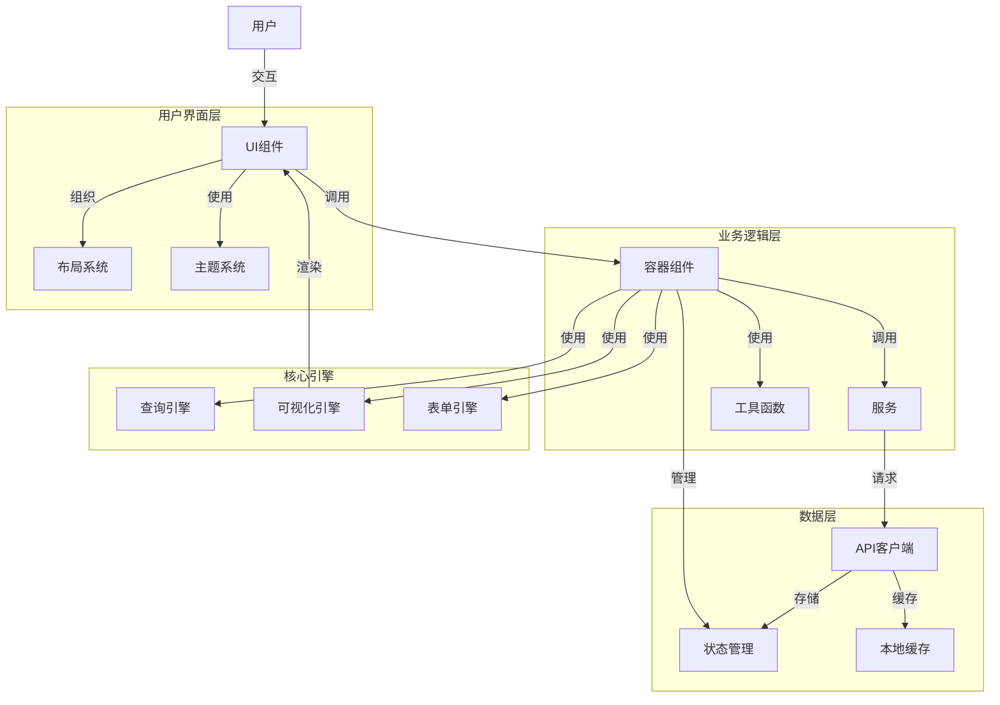
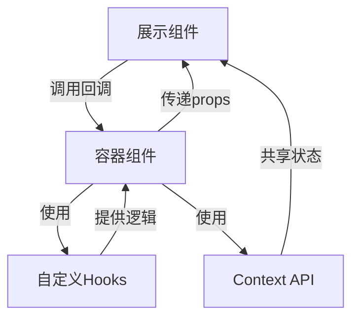
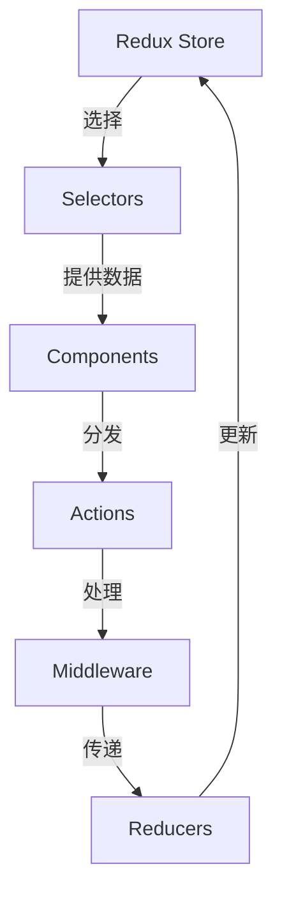
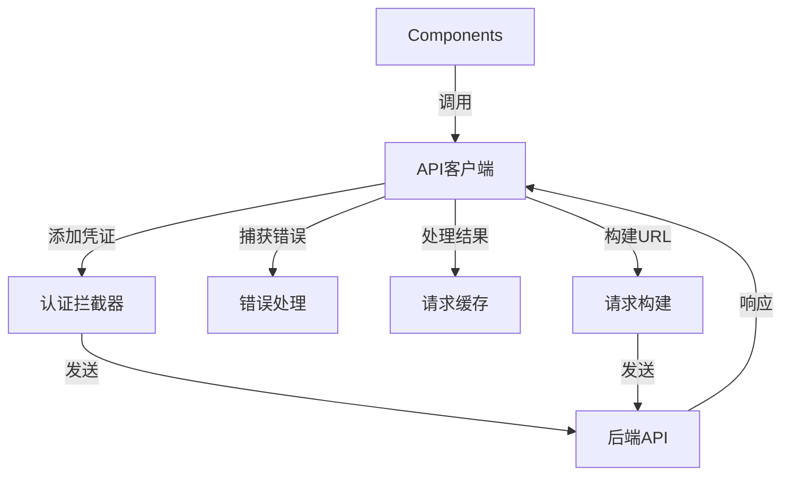
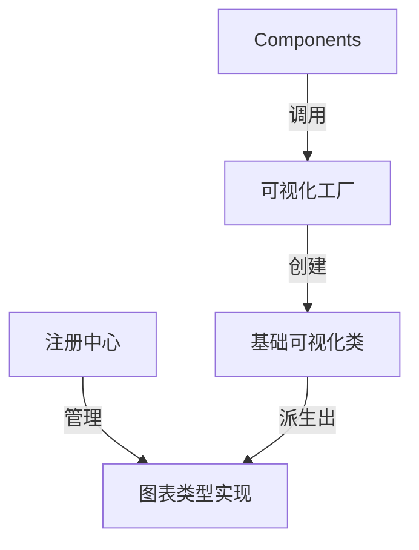
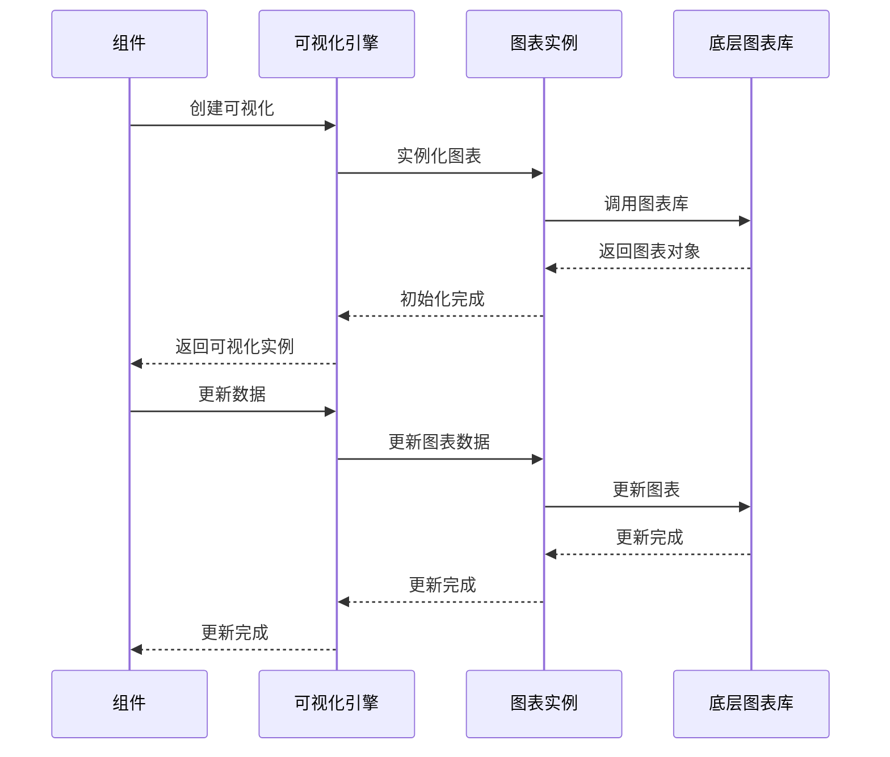
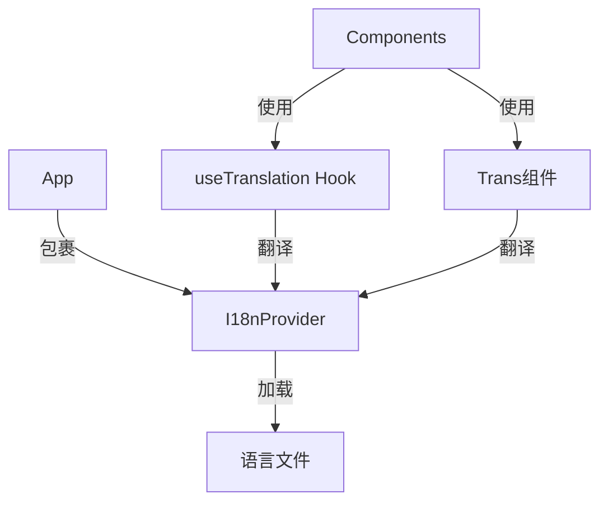
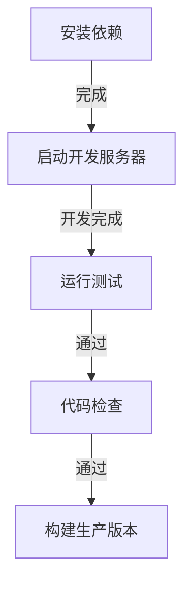

# Superset前端架构与技术实现

## 1. 前端架构概览

Superset的前端采用现代化的单页应用(SPA)架构，基于React和TypeScript构建。整体架构设计遵循组件化、模块化和可扩展性原则，支持丰富的数据可视化功能和良好的用户体验。

### 1.1 架构分层



## 2. 核心技术栈

| 技术/库 | 版本 | 用途 | 关键特性 |
|--------|-----|-----|--------|
| React | ~17.0 | UI库 | 组件化、虚拟DOM |
| TypeScript | ~4.5 | 类型系统 | 类型安全、代码提示 |
| Ant Design | ~4.19 | UI组件库 | 丰富的现成组件 |
| Redux | ~4.1 | 状态管理 | 全局状态、单向数据流 |
| React Router | ~6.2 | 路由管理 | 前端路由、导航 |
| Chart.js | ~3.7 | 图表库 | 基础图表渲染 |
| D3.js | ~7.3 | 数据可视化 | 复杂可视化实现 |
| ECharts | ~5.4 | 图表库 | 高级图表支持 |
| Webpack | ~5.67 | 构建工具 | 模块打包、代码分割 |
| Jest | ~28.0 | 测试框架 | 单元测试、集成测试 |

## 3. 前端目录结构

```plaintext
/superset-frontend
├── /src
│   ├── /assets          # 静态资源
│   ├── /components      # 通用UI组件
│   ├── /connectors      # Redux连接器
│   ├── /dashboard       # 仪表板相关代码
│   ├── /explore         # 探索视图相关代码
│   ├── /filters         # 过滤器组件
│   ├── /locales         # 国际化文件
│   ├── /mocks           # 模拟数据
│   ├── /queries         # 查询相关代码
│   ├── /redux           # Redux相关代码
│   ├── /services        # API服务
│   ├── /sql_lab         # SQL Lab相关代码
│   ├── /types           # TypeScript类型定义
│   ├── /utils           # 工具函数
│   ├── /visualizations  # 可视化组件
│   ├── /views           # 页面视图
│   ├── App.tsx          # 应用入口组件
│   └── index.tsx        # 应用入口文件
├── /public              # 公共资源
├── /scripts             # 构建脚本
├── /tests               # 测试文件
├── package.json         # 项目配置
├── tsconfig.json        # TypeScript配置
└── webpack.config.js    # Webpack配置
```

## 4. 核心组件系统

### 4.1 组件分类

Superset的前端组件可以分为以下几类：

1. **基础UI组件**：按钮、输入框、下拉菜单等基础交互元素
2. **布局组件**：网格、卡片、面板等页面布局元素
3. **数据展示组件**：表格、列表、详情展示等
4. **可视化组件**：各类图表实现
5. **表单组件**：复杂表单、配置面板等
6. **容器组件**：页面级组件，组织和管理子组件

### 4.2 组件设计模式



## 5. 状态管理

### 5.1 Redux架构

Superset使用Redux进行全局状态管理，主要包括：



### 5.2 主要Redux模块

- **dashboard**：仪表板状态管理
- **explore**：探索视图状态管理
- **sqlLab**：SQL Lab状态管理
- **users**：用户状态管理
- **datasets**：数据集状态管理
- **visualizations**：可视化状态管理
- **filters**：过滤器状态管理

### 5.3 异步操作处理

Superset使用Redux Thunk中间件处理异步操作：

```javascript
// 异步Action示例
export const fetchDashboard = (id) => async (dispatch) => {
  dispatch({ type: 'DASHBOARD_FETCH_START' });
  try {
    const response = await dashboardService.getDashboard(id);
    dispatch({ type: 'DASHBOARD_FETCH_SUCCESS', payload: response });
    return response;
  } catch (error) {
    dispatch({ type: 'DASHBOARD_FETCH_ERROR', payload: error });
    throw error;
  }
};
```

## 6. API通信

### 6.1 API客户端设计

Superset前端使用封装的API客户端与后端通信：



### 6.2 API服务封装

API服务按照功能模块进行组织：

- `dashboardService`: 仪表板相关API
- `chartService`: 图表相关API
- `datasetService`: 数据集相关API
- `userService`: 用户相关API
- `databaseService`: 数据库相关API
- `sqlLabService`: SQL Lab相关API

## 7. 可视化引擎

### 7.1 可视化框架架构



### 7.2 图表类型体系

Superset支持多种图表类型，主要分类：

1. **基础图表**：柱状图、折线图、饼图等
2. **高级图表**：热力图、箱线图、桑基图等
3. **地理可视化**：地图、气泡图等
4. **特殊图表**：透视表、表格等
5. **自定义图表**：通过插件系统扩展

### 7.3 可视化渲染流程



## 8. 主题系统

### 8.1 主题架构

Superset实现了可定制的主题系统，支持：

- 浅色/深色主题切换
- 品牌色定制
- 组件样式覆盖
- 响应式设计

### 8.2 主题配置

主题配置主要包括：

- 颜色系统
- 字体系统
- 间距系统
- 边框和阴影
- 动画效果

## 9. 国际化

### 9.1 i18n架构

Superset支持多语言国际化，使用react-i18next库实现：



### 9.2 支持的语言

- 英语（默认）
- 中文（简体）
- 法语
- 德语
- 西班牙语
- 日语
- 等等

## 10. 前端构建流程

### 10.1 构建系统

Superset使用Webpack进行前端构建：

- 代码分割
- 按需加载
- 资源优化
- 环境变量管理
- 开发服务器

### 10.2 开发工作流



## 11. 前端测试策略

### 11.1 测试类型

- 单元测试：组件、工具函数测试
- 集成测试：组件交互测试
- E2E测试：端到端测试

### 11.2 测试工具

- Jest：测试运行器
- React Testing Library：组件测试
- Cypress：E2E测试

## 12. 性能优化

### 12.1 优化策略

- 代码分割和懒加载
- 组件虚拟化
- 数据缓存
- 减少重渲染
- 资源优化

### 12.2 性能监控

- 页面加载时间
- 组件渲染性能
- 内存使用
- API请求性能

## 13. 总结

Superset的前端架构是一个现代化、模块化、可扩展的React应用架构。它采用了组件化设计、Redux状态管理、TypeScript类型系统等现代前端技术，为用户提供了丰富而强大的数据可视化功能。理解和掌握这个架构对于扩展和自定义Superset前端功能至关重要。在后续章节中，我们将深入探讨如何基于这个架构进行自定义开发和功能扩展。