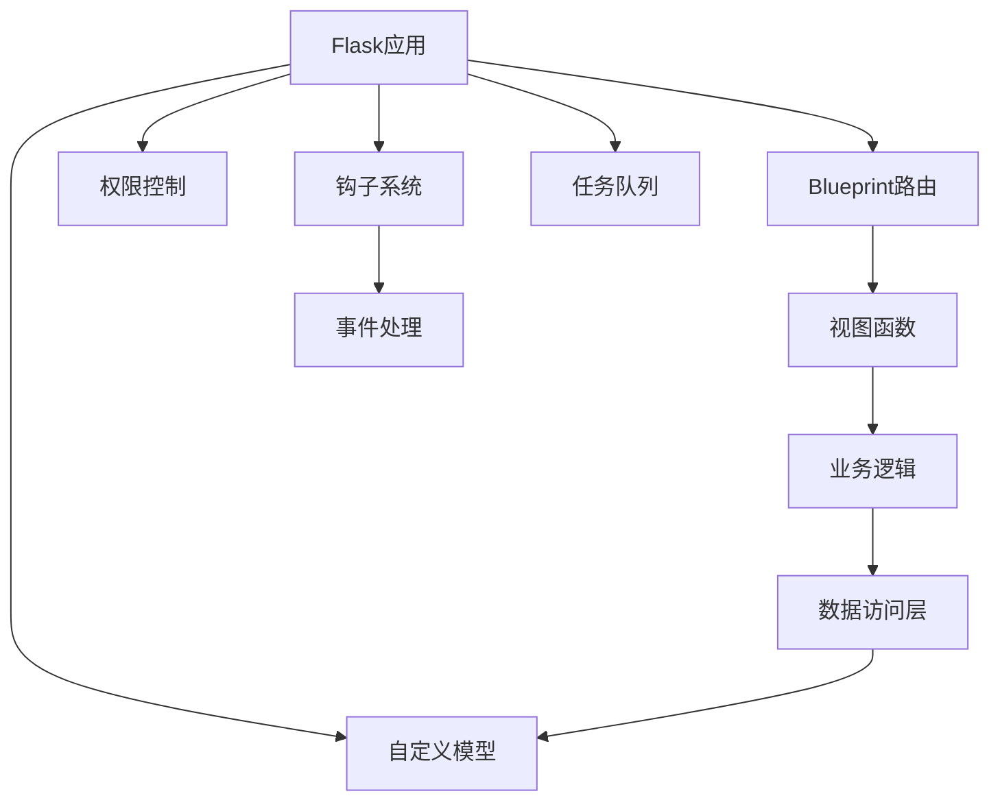

# Superset后端功能扩展与自定义API

## 1. 后端扩展概述

### 1.1 扩展类型

在Superset中，我们可以通过以下几种方式扩展后端功能：

- **自定义API端点**：添加新的RESTful API接口
- **ORM模型扩展**：创建新的数据模型或扩展现有模型
- **安全与权限扩展**：自定义认证、授权和访问控制
- **数据处理扩展**：自定义SQL解析器、数据转换器
- **事件钩子**：在特定事件触发时执行自定义逻辑
- **命令扩展**：添加新的CLI命令
- **任务队列扩展**：创建自定义异步任务

### 1.2 扩展架构



## 2. 自定义API开发

### 2.1 创建API蓝图

在Superset中，我们可以通过创建Flask蓝图(Blueprint)来添加自定义API端点。推荐的做法是创建一个新的模块来组织我们的API扩展。

```python
# superset/extensions/my_api/blueprint.py
from flask import Blueprint
from flask_appbuilder import expose
from superset.extensions.my_api.views import MyApiView

# 创建蓝图
my_api_bp = Blueprint('my_api', __name__)

# 注册视图
class MyApiRestApi(MyApiView):
    resource_name = 'my_resource'
    # 添加路由
    @expose('/custom_endpoint/')
    def custom_endpoint(self):
        return self.json_response({'message': 'This is a custom API endpoint'})

# 在应用中注册蓝图
def init_app(app):
    my_api_bp.add_url_rule(
        '/api/v1/my_resource/custom_endpoint',
        view_func=MyApiRestApi.as_view('custom_endpoint')
    )
    app.register_blueprint(my_api_bp)
```

### 2.2 使用Flask-AppBuilder创建REST API

Superset使用Flask-AppBuilder作为其API框架，我们可以继承`BaseApi`类来快速创建RESTful API：

```python
# superset/extensions/my_api/api.py
from flask import g
from flask_appbuilder.api import BaseApi, expose, protect, safe

from superset.extensions.my_api.schemas import MyResourceSchema
from superset.extensions.my_api.services import MyResourceService
from superset.security import has_access

class MyApi(BaseApi):
    resource_name = 'my_resource'
    allow_browser_login = True
    openapi_spec_tag = 'My Custom API'
    service = MyResourceService()
    resource_schema = MyResourceSchema()
    resource_list_schema = MyResourceSchema(many=True)

    @expose('/', methods=['GET'])
    @protect()
    @safe()
    @has_access
    def get_resources(self):
        """获取资源列表
        --- 
        get:
          description: >-
            获取我的自定义资源列表
          responses:
            200:
              description: 资源列表
              content:
                application/json:
                  schema:
                    type: array
                    items: MyResourceSchema
        """
        try:
            resources = self.service.get_resources()
            return self.response(200, result=resources)
        except Exception as e:
            return self.response(400, message=str(e))

    @expose('/', methods=['POST'])
    @protect()
    @safe()
    @has_access
    def create_resource(self):
        """创建新资源
        --- 
        post:
          description: >-
            创建新的自定义资源
          requestBody:
            required: true
            content:
              application/json:
                schema: MyResourceSchema
          responses:
            201:
              description: 资源创建成功
              content:
                application/json:
                  schema: MyResourceSchema
            400:
              description: 无效的请求
        """
        try:
            item = self.validate_post()
            resource = self.service.create_resource(item)
            return self.response(201, result=resource)
        except Exception as e:
            return self.response(400, message=str(e))

    @expose('/<int:pk>', methods=['GET'])
    @protect()
    @safe()
    @has_access
    def get_resource(self, pk):
        """获取单个资源
        --- 
        get:
          description: >-
            根据ID获取单个资源
          parameters:
          - in: path
            name: pk
            schema:
              type: integer
            required: true
            description: 资源ID
          responses:
            200:
              description: 资源详情
              content:
                application/json:
                  schema: MyResourceSchema
            404:
              description: 资源不存在
        """
        try:
            resource = self.service.get_resource(pk)
            if not resource:
                return self.response(404, message='Resource not found')
            return self.response(200, result=resource)
        except Exception as e:
            return self.response(400, message=str(e))

    @expose('/<int:pk>', methods=['PUT'])
    @protect()
    @safe()
    @has_access
    def update_resource(self, pk):
        """更新资源
        --- 
        put:
          description: >-
            更新指定资源
          parameters:
          - in: path
            name: pk
            schema:
              type: integer
            required: true
            description: 资源ID
          requestBody:
            required: true
            content:
              application/json:
                schema: MyResourceSchema
          responses:
            200:
              description: 资源更新成功
              content:
                application/json:
                  schema: MyResourceSchema
            404:
              description: 资源不存在
        """
        try:
            item = self.validate_put()
            resource = self.service.update_resource(pk, item)
            if not resource:
                return self.response(404, message='Resource not found')
            return self.response(200, result=resource)
        except Exception as e:
            return self.response(400, message=str(e))

    @expose('/<int:pk>', methods=['DELETE'])
    @protect()
    @safe()
    @has_access
    def delete_resource(self, pk):
        """删除资源
        --- 
        delete:
          description: >-
            删除指定资源
          parameters:
          - in: path
            name: pk
            schema:
              type: integer
            required: true
            description: 资源ID
          responses:
            200:
              description: 资源删除成功
            404:
              description: 资源不存在
        """
        try:
            success = self.service.delete_resource(pk)
            if not success:
                return self.response(404, message='Resource not found')
            return self.response(200, message='Resource deleted successfully')
        except Exception as e:
            return self.response(400, message=str(e))
```

### 2.3 数据验证与序列化

使用Marshmallow进行数据验证和序列化：

```python
# superset/extensions/my_api/schemas.py
from marshmallow import Schema, fields, validate

class MyResourceSchema(Schema):
    id = fields.Integer(dump_only=True)
    name = fields.String(required=True, validate=validate.Length(min=1, max=100))
    description = fields.String(validate=validate.Length(max=500))
    value = fields.Float()
    is_active = fields.Boolean(default=True)
    created_at = fields.DateTime(dump_only=True)
    updated_at = fields.DateTime(dump_only=True)
    
    class Meta:
        strict = True
```

## 3. 数据模型扩展

### 3.1 创建新模型

我们可以创建新的SQLAlchemy模型来存储自定义数据：

```python
# superset/extensions/my_api/models.py
from datetime import datetime
from sqlalchemy import Column, Integer, String, Float, Boolean, DateTime, ForeignKey
from sqlalchemy.ext.declarative import declarative_base
from sqlalchemy.orm import relationship

from superset import db

Base = declarative_base()

class MyResource(Base):
    __tablename__ = 'my_resources'
    
    id = Column(Integer, primary_key=True)
    name = Column(String(100), nullable=False)
    description = Column(String(500))
    value = Column(Float)
    is_active = Column(Boolean, default=True)
    created_at = Column(DateTime, default=datetime.utcnow)
    updated_at = Column(DateTime, default=datetime.utcnow, onupdate=datetime.utcnow)
    
    # 外键关系示例
    user_id = Column(Integer, ForeignKey('ab_user.id'))
    user = relationship('User')
    
    def __repr__(self):
        return f'<MyResource(id={self.id}, name="{self.name}")>'
```

### 3.2 创建数据库迁移

使用Alembic创建数据库迁移：

```bash
# 生成迁移脚本
superset db upgrade

# 创建新的迁移
superset db revision -m "Add MyResource model"
```

编辑生成的迁移脚本：

```python
"""Add MyResource model

Revision ID: 1234abcd
Revises: previous_revision
Create Date: 2023-07-01 12:00:00.000000

"""
from alembic import op
import sqlalchemy as sa


# revision identifiers, used by Alembic.
revision = '1234abcd'
down_revision = 'previous_revision'
branch_labels = None
depends_on = None


def upgrade() -> None:
    # 创建my_resources表
    op.create_table('my_resources',
        sa.Column('id', sa.Integer(), nullable=False),
        sa.Column('name', sa.String(length=100), nullable=False),
        sa.Column('description', sa.String(length=500), nullable=True),
        sa.Column('value', sa.Float(), nullable=True),
        sa.Column('is_active', sa.Boolean(), nullable=True, default=True),
        sa.Column('created_at', sa.DateTime(), nullable=True, default=sa.func.current_timestamp()),
        sa.Column('updated_at', sa.DateTime(), nullable=True, default=sa.func.current_timestamp(), onupdate=sa.func.current_timestamp()),
        sa.Column('user_id', sa.Integer(), nullable=True),
        sa.ForeignKeyConstraint(['user_id'], ['ab_user.id'], ),
        sa.PrimaryKeyConstraint('id')
    )


def downgrade() -> None:
    # 删除my_resources表
    op.drop_table('my_resources')
```

执行迁移：

```bash
superset db upgrade
```

## 4. 业务逻辑服务层

为了保持代码的可维护性，我们应该创建服务层来封装业务逻辑：

```python
# superset/extensions/my_api/services.py
from typing import List, Optional, Dict, Any
from superset.extensions.my_api.models import MyResource
from superset import db

class MyResourceService:
    def get_resources(self) -> List[Dict[str, Any]]:
        """获取所有资源"""
        resources = db.session.query(MyResource).filter(MyResource.is_active == True).all()
        return [self._to_dict(r) for r in resources]
    
    def get_resource(self, resource_id: int) -> Optional[Dict[str, Any]]:
        """根据ID获取单个资源"""
        resource = db.session.query(MyResource).filter(
            MyResource.id == resource_id,
            MyResource.is_active == True
        ).first()
        
        return self._to_dict(resource) if resource else None
    
    def create_resource(self, data: Dict[str, Any]) -> Dict[str, Any]:
        """创建新资源"""
        resource = MyResource(**data)
        db.session.add(resource)
        db.session.commit()
        db.session.refresh(resource)
        return self._to_dict(resource)
    
    def update_resource(self, resource_id: int, data: Dict[str, Any]) -> Optional[Dict[str, Any]]:
        """更新资源"""
        resource = db.session.query(MyResource).filter(
            MyResource.id == resource_id,
            MyResource.is_active == True
        ).first()
        
        if not resource:
            return None
        
        # 更新资源字段
        for key, value in data.items():
            if hasattr(resource, key):
                setattr(resource, key, value)
        
        db.session.commit()
        db.session.refresh(resource)
        return self._to_dict(resource)
    
    def delete_resource(self, resource_id: int) -> bool:
        """删除资源（软删除）"""
        resource = db.session.query(MyResource).filter(
            MyResource.id == resource_id,
            MyResource.is_active == True
        ).first()
        
        if not resource:
            return False
        
        # 使用软删除
        resource.is_active = False
        db.session.commit()
        return True
    
    def _to_dict(self, resource: MyResource) -> Dict[str, Any]:
        """将模型实例转换为字典"""
        return {
            'id': resource.id,
            'name': resource.name,
            'description': resource.description,
            'value': resource.value,
            'is_active': resource.is_active,
            'created_at': resource.created_at.isoformat() if resource.created_at else None,
            'updated_at': resource.updated_at.isoformat() if resource.updated_at else None,
            'user_id': resource.user_id
        }
```

## 5. 权限与访问控制

### 5.1 创建自定义权限

在Superset中，我们可以创建自定义权限并与角色关联：

```python
# superset/extensions/my_api/security.py
from superset.security import SupersetSecurityManager
from superset.models.core import Database
from superset.extensions.my_api.models import MyResource

class CustomSecurityManager(SupersetSecurityManager):
    def __init__(self, appbuilder):
        super().__init__(appbuilder)
        # 添加自定义权限
        self.add_custom_permissions()
    
    def add_custom_permissions(self):
        """添加自定义权限"""
        # 资源权限
        self.add_permission_view_menu('my_resource', 'can_list', 'MyResourceModelView')
        self.add_permission_view_menu('my_resource', 'can_show', 'MyResourceModelView')
        self.add_permission_view_menu('my_resource', 'can_add', 'MyResourceModelView')
        self.add_permission_view_menu('my_resource', 'can_edit', 'MyResourceModelView')
        self.add_permission_view_menu('my_resource', 'can_delete', 'MyResourceModelView')
        
        # 为管理员角色添加权限
        admin_role = self.find_role('Admin')
        if admin_role:
            for perm in ['can_list', 'can_show', 'can_add', 'can_edit', 'can_delete']:
                self.add_permission_role(admin_role, self.find_permission_view_menu('my_resource', perm))
```

### 5.2 在API中使用权限控制

在API中使用`@has_access`装饰器控制权限：

```python
from flask_appbuilder.api import expose, protect, safe
from superset.security import has_access

class MyApi(BaseApi):
    @expose('/', methods=['GET'])
    @protect()
    @safe()
    @has_access('can_list', 'MyResourceModelView')
    def get_resources(self):
        # 业务逻辑
        pass
```

## 6. 钩子系统扩展

### 6.1 使用Flask钩子

```python
# superset/extensions/my_api/hooks.py
from flask import g, request
from superset.app import SupersetApp


def register_hooks(app: SupersetApp):
    """注册钩子函数"""
    
    @app.before_request
    def before_request_hook():
        """请求前钩子"""
        # 获取当前用户
        if hasattr(g, 'user'):
            app.logger.info(f"Request from user: {g.user.username}")
        
    @app.after_request
    def after_request_hook(response):
        """请求后钩子"""
        # 添加自定义响应头
        response.headers['X-Custom-Header'] = 'My Custom Value'
        return response
    
    @app.teardown_request
    def teardown_request_hook(exception):
        """请求结束钩子"""
        if exception:
            app.logger.error(f"Request error: {str(exception)}")
```

### 6.2 使用Superset自定义钩子

Superset提供了许多自定义钩子点，我们可以通过扩展相应的类来修改行为：

```python
# superset/extensions/my_api/superset_hooks.py
from superset.charts.commands.create import CreateChartCommand
from superset.charts.commands.exceptions import ChartCreateFailedError
from superset.extensions.my_api.services import MyResourceService

class CustomCreateChartCommand(CreateChartCommand):
    """自定义图表创建命令"""
    
    def __init__(self, data):
        super().__init__(data)
        self.resource_service = MyResourceService()
    
    def _post_add(self):
        """创建图表后执行的操作"""
        try:
            # 在图表创建后执行自定义操作
            self.resource_service.create_resource({
                'name': f'Chart-{self.chart.id}',
                'description': f'Created for chart {self.chart.slice_name}',
                'value': 1.0
            })
        except Exception as e:
            raise ChartCreateFailedError(str(e)) from e
```

## 7. 自定义命令行工具

使用Click创建自定义命令：

```python
# superset/extensions/my_api/cli.py
import click
from superset import create_app, db
from superset.extensions.my_api.models import MyResource


def register_commands(cli):
    """注册自定义命令"""
    
    @cli.group()
    def my_resource():
        """管理自定义资源"""
        pass
    
    @my_resource.command()
    @click.argument('name')
    @click.option('--description', '-d', help='资源描述')
    @click.option('--value', '-v', type=float, help='资源值')
    def create(name, description='', value=0.0):
        """创建新的资源"""
        app = create_app()
        with app.app_context():
            resource = MyResource(
                name=name,
                description=description,
                value=value
            )
            db.session.add(resource)
            db.session.commit()
            click.echo(f'Created resource with ID: {resource.id}')
    
    @my_resource.command()
    @click.option('--active-only', '-a', is_flag=True, help='只显示激活的资源')
    def list(active_only=False):
        """列出所有资源"""
        app = create_app()
        with app.app_context():
            query = db.session.query(MyResource)
            if active_only:
                query = query.filter(MyResource.is_active == True)
            
            resources = query.all()
            if not resources:
                click.echo('No resources found')
                return
            
            for resource in resources:
                status = 'Active' if resource.is_active else 'Inactive'
                click.echo(f'ID: {resource.id}, Name: {resource.name}, Status: {status}, Value: {resource.value}')
```

在应用初始化时注册命令：

```python
# superset/cli/main.py
from superset.extensions.my_api.cli import register_commands

# 在cli创建后注册自定义命令
register_commands(cli)
```

## 8. 任务队列扩展

### 8.1 创建自定义异步任务

使用Celery创建自定义任务：

```python
# superset/extensions/my_api/tasks.py
from celery import Celery
from superset import create_app
from superset.extensions.my_api.services import MyResourceService
import time

app = create_app()
cache = app.extensions['cache']


@celery_app.task(bind=True, trail=True)
def process_long_running_task(self, resource_id, iterations=100):
    """处理长时间运行的任务"""
    try:
        with app.app_context():
            service = MyResourceService()
            resource = service.get_resource(resource_id)
            
            if not resource:
                raise Exception(f"Resource {resource_id} not found")
            
            # 更新任务状态
            self.update_state(state='PROCESSING', meta={
                'resource_id': resource_id,
                'progress': 0,
                'status': 'Starting processing'
            })
            
            # 模拟长时间运行的任务
            for i in range(iterations):
                # 执行一些处理
                time.sleep(0.1)
                
                # 更新进度
                progress = (i + 1) / iterations * 100
                self.update_state(state='PROCESSING', meta={
                    'resource_id': resource_id,
                    'progress': progress,
                    'status': f'Processing {i+1}/{iterations}'
                })
            
            # 更新资源值
            service.update_resource(resource_id, {'value': resource['value'] * 2})
            
            return {
                'resource_id': resource_id,
                'progress': 100,
                'status': 'Processing completed',
                'result': 'Success'
            }
    
    except Exception as e:
        self.update_state(state='FAILURE', meta={
            'resource_id': resource_id,
            'progress': 0,
            'status': 'Processing failed',
            'error': str(e)
        })
        raise
```

### 8.2 创建任务API端点

```python
# 在MyApi类中添加任务相关端点

@expose('/<int:pk>/process', methods=['POST'])
@protect()
@safe()
@has_access
async def process_resource(self, pk):
    """异步处理资源
    --- 
    post:
      description: >-
        异步处理指定资源
      parameters:
      - in: path
        name: pk
        schema:
          type: integer
        required: true
        description: 资源ID
      responses:
        202:
          description: 任务已接受
          content:
            application/json:
              schema:
                type: object
                properties:
                  task_id:
                    type: string
                  status:
                    type: string
    """
    from superset.extensions.my_api.tasks import process_long_running_task
    
    task = process_long_running_task.apply_async(args=[pk])
    
    return self.response(
        202, 
        task_id=task.id, 
        status='Task accepted and is being processed'
    )

@expose('/tasks/<task_id>', methods=['GET'])
@protect()
@safe()
@has_access
async def get_task_status(self, task_id):
    """获取任务状态
    --- 
    get:
      description: >-
        获取任务执行状态
      parameters:
      - in: path
        name: task_id
        schema:
          type: string
        required: true
        description: 任务ID
      responses:
        200:
          description: 任务状态
          content:
            application/json:
              schema:
                type: object
                properties:
                  task_id:
                    type: string
                  status:
                    type: string
                  progress:
                    type: number
                  result:
                    type: object
    """
    from superset.extensions.my_api.tasks import process_long_running_task
    
    task = process_long_running_task.AsyncResult(task_id)
    
    if task.state == 'PENDING':
        response = {
            'task_id': task_id,
            'status': 'Pending...',
            'progress': 0
        }
    elif task.state != 'FAILURE':
        response = {
            'task_id': task_id,
            'status': task.state,
            **task.info
        }
    else:
        # 任务失败
        response = {
            'task_id': task_id,
            'status': 'Failed',
            'error': str(task.info)
        }
    
    return self.response(200, **response)
```

## 9. 缓存系统扩展

### 9.1 使用Redis缓存

```python
# superset/extensions/my_api/cache.py
from flask_caching import Cache
from superset import app

# 创建自定义缓存实例
custom_cache = Cache(config={
    'CACHE_TYPE': 'redis',
    'CACHE_REDIS_URL': app.config.get('REDIS_URL', 'redis://localhost:6379/1'),
    'CACHE_KEY_PREFIX': 'my_custom_api_'
})


def init_custom_cache(app):
    """初始化自定义缓存"""
    custom_cache.init_app(app)


def cache_key_wrapper(prefix, **kwargs):
    """生成缓存键"""
    key_parts = [prefix]
    for k, v in sorted(kwargs.items()):
        key_parts.append(f"{k}:{v}")
    return ":".join(key_parts)
```

### 9.2 在服务层中使用缓存

```python
# 修改MyResourceService以使用缓存
from superset.extensions.my_api.cache import custom_cache, cache_key_wrapper

class MyResourceService:
    @custom_cache.memoize(timeout=300)
    def get_resource(self, resource_id: int) -> Optional[Dict[str, Any]]:
        """根据ID获取单个资源（带缓存）"""
        # 实现逻辑保持不变
        pass
    
    @custom_cache.cached(timeout=600, key_prefix=lambda: cache_key_wrapper('resources_list'))
    def get_resources(self) -> List[Dict[str, Any]]:
        """获取所有资源（带缓存）"""
        # 实现逻辑保持不变
        pass
    
    def create_resource(self, data: Dict[str, Any]) -> Dict[str, Any]:
        """创建新资源并清除缓存"""
        resource = MyResource(**data)
        db.session.add(resource)
        db.session.commit()
        db.session.refresh(resource)
        
        # 清除相关缓存
        custom_cache.delete_memoized(self.get_resources)
        
        return self._to_dict(resource)
```

## 10. 集成第三方服务

### 10.1 创建服务集成类

```python
# superset/extensions/my_api/services/external_service.py
import requests
from requests.auth import HTTPBasicAuth
import logging
from typing import Dict, Any, Optional

logger = logging.getLogger(__name__)


class ExternalServiceClient:
    """第三方服务客户端"""
    
    def __init__(self, base_url: str, username: str = None, password: str = None, api_key: str = None):
        self.base_url = base_url.rstrip('/')
        self.username = username
        self.password = password
        self.api_key = api_key
        self.session = requests.Session()
        
        # 设置认证方式
        if api_key:
            self.session.headers.update({'Authorization': f'Bearer {api_key}'})
        elif username and password:
            self.auth = HTTPBasicAuth(username, password)
        else:
            self.auth = None
    
    def _make_request(self, endpoint: str, method: str = 'GET', **kwargs) -> Dict[str, Any]:
        """发送HTTP请求"""
        url = f"{self.base_url}/{endpoint.lstrip('/')}"
        
        try:
            response = self.session.request(method, url, auth=self.auth, **kwargs)
            response.raise_for_status()
            return response.json()
        except requests.exceptions.RequestException as e:
            logger.error(f"Error calling external service: {str(e)}")
            raise
    
    def get_data(self, endpoint: str, params: Optional[Dict[str, Any]] = None) -> Dict[str, Any]:
        """发送GET请求"""
        return self._make_request(endpoint, 'GET', params=params)
    
    def post_data(self, endpoint: str, data: Dict[str, Any]) -> Dict[str, Any]:
        """发送POST请求"""
        return self._make_request(endpoint, 'POST', json=data)
```

### 10.2 在API中使用外部服务

```python
# superset/extensions/my_api/api.py
from superset import app
from superset.extensions.my_api.services.external_service import ExternalServiceClient

class MyApi(BaseApi):
    @expose('/external_data', methods=['GET'])
    @protect()
    @safe()
    @has_access
    def get_external_data(self):
        """获取外部服务数据
        --- 
        get:
          description: >-
            从外部服务获取数据
          responses:
            200:
              description: 外部服务数据
              content:
                application/json:
                  schema:
                    type: object
            502:
              description: 外部服务错误
        """
        try:
            # 从配置中获取服务信息
            service_config = app.config.get('EXTERNAL_SERVICE_CONFIG', {})
            client = ExternalServiceClient(
                base_url=service_config.get('BASE_URL'),
                api_key=service_config.get('API_KEY')
            )
            
            # 获取外部数据
            data = client.get_data('api/data')
            
            # 可选：将数据保存到本地数据库
            # service = MyResourceService()
            # for item in data.get('items', []):
            #     service.create_resource(item)
            
            return self.response(200, result=data)
        except Exception as e:
            logger.error(f"Error getting external data: {str(e)}")
            return self.response(502, message=f'External service error: {str(e)}')
```

## 11. 测试策略

### 11.1 单元测试

使用pytest创建单元测试：

```python
# tests/extensions/my_api/test_services.py
import pytest
from unittest.mock import patch, MagicMock
from superset.extensions.my_api.services import MyResourceService


@pytest.fixture
@patch('superset.extensions.my_api.services.db')
def service(db_mock):
    return MyResourceService()


def test_get_resources(service, db_mock):
    """测试获取资源列表"""
    # 创建模拟数据
    mock_resource = MagicMock()
    mock_resource.id = 1
    mock_resource.name = "Test Resource"
    mock_resource.description = "Test Description"
    mock_resource.value = 10.5
    mock_resource.is_active = True
    mock_resource.created_at = None
    mock_resource.updated_at = None
    mock_resource.user_id = 1
    
    # 配置模拟查询
    db_mock.session.query.return_value.filter.return_value.all.return_value = [mock_resource]
    
    # 调用方法
    resources = service.get_resources()
    
    # 验证结果
    assert len(resources) == 1
    assert resources[0]['id'] == 1
    assert resources[0]['name'] == "Test Resource"
```

### 11.2 API集成测试

```python
# tests/extensions/my_api/test_api.py
import pytest
from flask import url_for
from superset.extensions.my_api.models import MyResource


@pytest.mark.usefixtures('app')
class TestMyApi:
    def test_get_resources(self, client, session, regular_user):
        """测试获取资源列表API"""
        # 创建测试数据
        resource = MyResource(
            name="Test Resource",
            description="Test Description",
            value=10.5,
            user_id=regular_user.id
        )
        session.add(resource)
        session.commit()
        
        # 发送请求
        response = client.get(
            url_for('MyApi.get_resources'),
            headers={'Authorization': f'Bearer {self.get_user_token(client, regular_user)}'}
        )
        
        # 验证结果
        assert response.status_code == 200
        data = response.get_json()
        assert 'result' in data
        assert len(data['result']) == 1
```

## 12. 最佳实践

### 12.1 代码组织

- **模块化设计**：将功能组织为独立模块，避免紧密耦合
- **关注点分离**：API层、服务层、数据访问层职责明确
- **配置外部化**：敏感信息和配置参数通过环境变量或配置文件管理

### 12.2 安全性

- **输入验证**：所有用户输入必须经过严格验证
- **权限控制**：使用装饰器确保API访问权限
- **SQL注入防护**：使用参数化查询，避免直接拼接SQL
- **密码存储**：使用bcrypt等安全哈希算法存储密码

### 12.3 性能优化

- **使用缓存**：缓存频繁访问的数据
- **异步处理**：长时间运行的任务使用Celery异步处理
- **数据库索引**：为常用查询字段添加适当索引
- **分页查询**：大数据集分页返回，避免一次返回过多数据

### 12.4 可维护性

- **详细文档**：为API添加OpenAPI规范文档
- **日志记录**：记录关键操作和错误信息
- **异常处理**：全局异常处理，提供友好错误信息
- **测试覆盖**：编写单元测试和集成测试，确保代码质量

通过本指南，您应该能够成功地扩展Superset后端功能并创建自定义API。遵循这些最佳实践，可以确保您的扩展与Superset的核心设计保持一致，并且易于维护和升级。