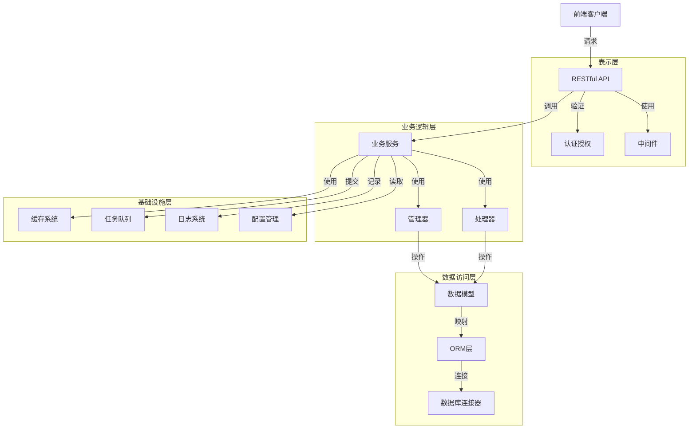
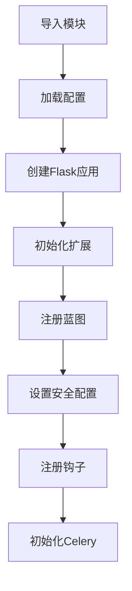
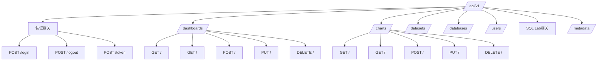
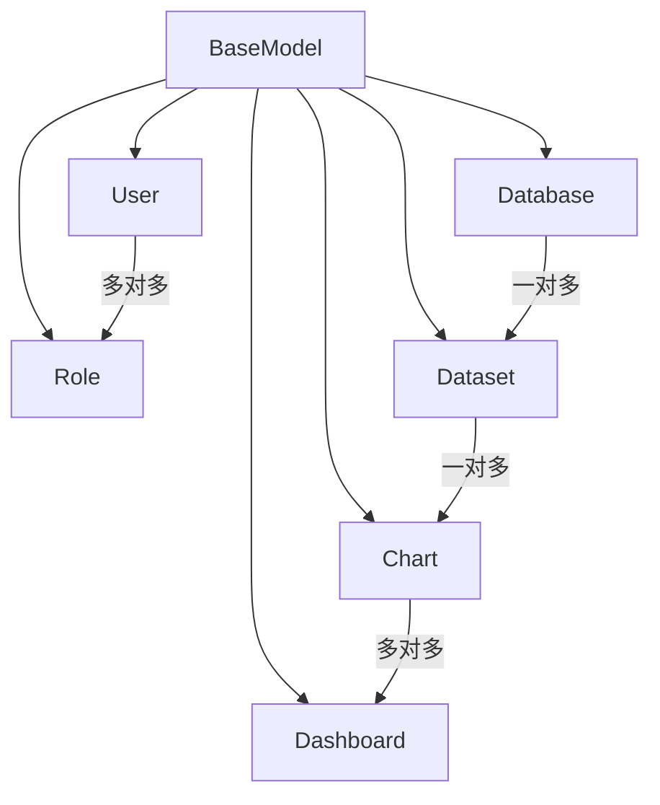
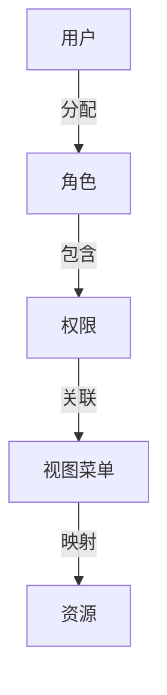
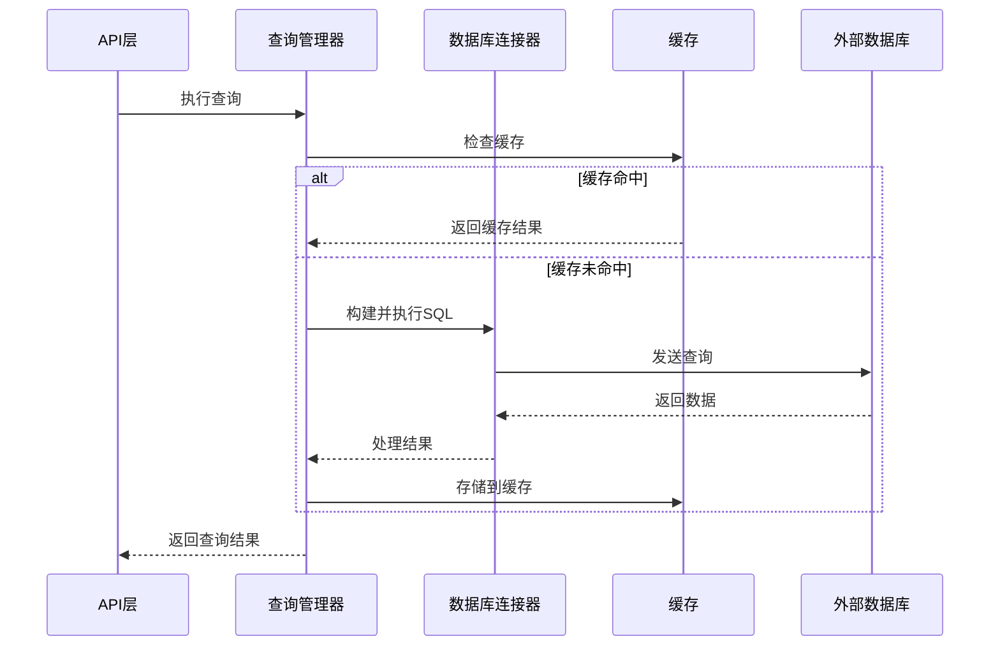
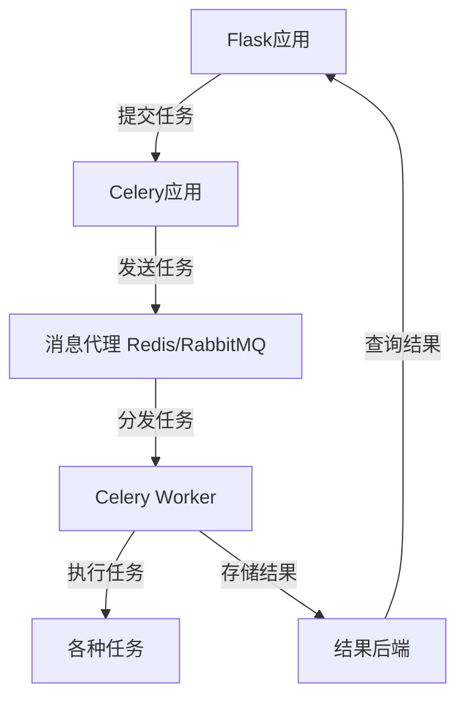

# Superset后端架构与API设计

## 1. 后端架构概览

Superset的后端基于Python Flask框架构建，采用多层架构设计，实现了高度模块化和可扩展性。后端系统主要负责数据访问、业务逻辑处理、用户认证授权、API服务等核心功能。

### 1.1 架构分层



## 2. 核心技术栈

| 技术/框架 | 版本 | 用途 | 关键特性 |
|--------|-----|-----|--------|
| Python | >= 3.9 | 开发语言 | 动态类型、丰富的库 |
| Flask | ~2.0 | Web框架 | 轻量级、可扩展 |
| Flask-AppBuilder | ~4.0 | 管理后台框架 | 用户管理、权限控制 |
| SQLAlchemy | ~1.4 | ORM框架 | 数据库抽象、查询构建 |
| Pandas | ~1.4 | 数据处理 | 高效数据操作 |
| PyArrow | ~8.0 | 数据序列化 | 内存数据格式 |
| Celery | ~5.2 | 任务队列 | 异步任务处理 |
| Redis | >= 3.2 | 缓存/消息代理 | 高性能键值存储 |
| Marshmallow | ~3.15 | 数据序列化 | API数据验证 |
| Gunicorn | ~20.1 | WSGI服务器 | 生产环境部署 |

## 3. 后端目录结构

```plaintext
/superset
├── /assets            # 静态资源
├── /commands          # CLI命令
├── /common            # 通用工具和类
├── /config            # 配置相关
├── /connectors        # 数据库连接器
├── /dashboards        # 仪表板相关代码
├── /datasets          # 数据集相关代码
├── /events            # 事件系统
├── /explore           # 探索视图相关代码
├── /filters           # 过滤器相关代码
├── /migrations        # 数据库迁移脚本
├── /models            # 数据模型
├── /queries           # 查询相关代码
├── /security          # 安全相关代码
├── /sql_lab           # SQL Lab相关代码
├── /tasks             # Celery任务
├── /templates         # Jinja2模板
├── /utils             # 工具函数
├── /views             # Flask视图
├── /viz               # 可视化相关代码
├── __init__.py        # 包初始化
├── app.py             # Flask应用创建
├── celery_app.py      # Celery应用配置
└── wsgi.py            # WSGI入口
```

## 4. Flask应用架构

### 4.1 应用初始化流程



### 4.2 核心初始化代码

```python
# app.py中的应用初始化示例
def create_app(config=None, testing=False):
    app = Flask(__name__)
    
    # 加载配置
    if config:
        app.config.from_object(config)
    else:
        app.config.from_envvar('SUPERSET_CONFIG_PATH')
    
    # 初始化扩展
    db.init_app(app)
    cache.init_app(app)
    
    # 注册蓝图
    app.register_blueprint(frontend_bp)
    app.register_blueprint(api_bp, url_prefix='/api/v1')
    
    # 设置安全配置
    security_manager.init_app(app)
    
    # 注册钩子
    app.before_request(before_request)
    
    return app
```

## 5. 路由系统

### 5.1 路由组织

Superset使用Flask蓝图组织路由，主要包括：

- `frontend_bp`: 前端页面路由
- `api_bp`: RESTful API路由
- `sqllab_bp`: SQL Lab相关路由
- `static_bp`: 静态文件路由

### 5.2 API路由设计

API路由遵循RESTful设计原则，主要路由前缀为`/api/v1`：



## 6. API设计

### 6.1 API设计原则

- **RESTful规范**：遵循资源导向设计
- **版本控制**：通过URL前缀控制版本
- **统一响应格式**：统一的错误处理和响应结构
- **认证授权**：JWT或session-based认证
- **数据验证**：请求数据验证
- **文档化**：Swagger/OpenAPI文档

### 6.2 API响应格式

```json
{
  "jsonrpc": "2.0",
  "id": "1",
  "result": { /* 响应数据 */ },
  "error": null
}
```

### 6.3 示例API实现

```python
# API路由示例
@api_bp.route('/dashboards/<int:dashboard_id>', methods=['GET'])
@has_access_api
@statsd.gauge('dashboards.get')
def get_dashboard(dashboard_id):
    dashboard = Dashboard.get_by_id(dashboard_id)
    if not dashboard:
        return json_error_response('Dashboard not found', status_code=404)
    
    # 权限检查
    if not security_manager.can_access('can_show', 'Dashboard', dashboard_id):
        return json_error_response('Access Denied', status_code=403)
    
    # 构建响应
    return json_success_response(
        DashboardSchema().dump(dashboard)
    )
```

## 7. 数据库访问层

### 7.1 SQLAlchemy ORM

Superset使用SQLAlchemy作为ORM框架，定义了丰富的数据模型：



### 7.2 数据模型定义示例

```python
# models/dashboard.py示例
class Dashboard(Model, AuditMixinNullable):
    __tablename__ = "dashboards"
    
    id = Column(Integer, primary_key=True)
    dashboard_title = Column(String(500), nullable=False)
    slug = Column(String(250), nullable=False, unique=True)
    position_json = Column(String(1000))
    json_metadata = Column(String(10000))
    published = Column(Boolean, default=False, nullable=False)
    
    # 关系
    slices = relationship(
        "Slice",
        secondary=association_table,
        back_populates="dashboards"
    )
    
    # 方法
    @classmethod
    def get_by_id(cls, pk):
        return cls.query.filter_by(id=pk).first()
```

## 8. 认证与授权

### 8.1 安全架构



### 8.2 认证机制

Superset支持多种认证方式：

- **数据库认证**：默认，使用内部数据库存储用户信息
- **LDAP认证**：企业LDAP/Active Directory集成
- **OAuth认证**：Google、GitHub、OAuth通用等
- **JWT认证**：API认证
- **SAML认证**：企业SSO集成

### 8.3 授权机制

基于Flask-AppBuilder的RBAC实现：

```python
# 权限装饰器示例
@has_access_api
def protected_api():
    # 只有授权用户可以访问
    pass
    
@has_access
@has_access_permission("can_edit")
def protected_resource():
    # 只有具有特定权限的用户可以访问
    pass
```

## 9. 查询执行引擎

### 9.1 查询执行流程



### 9.2 SQL生成器

Superset包含强大的SQL生成器，可以根据用户配置自动生成SQL查询：

```python
# 查询生成示例
def get_sqla_query(datasource, **kwargs):
    # 获取数据源
    table = datasource.get_sqla_table()
    
    # 构建查询
    query = table.select()
    
    # 添加过滤器
    if 'filters' in kwargs:
        for filter in kwargs['filters']:
            query = query.filter(build_filter_condition(filter))
    
    # 添加排序
    if 'orderby' in kwargs:
        query = query.order_by(build_orderby(kwargs['orderby']))
    
    # 添加分页
    if 'page_size' in kwargs and kwargs['page_size'] > 0:
        page = kwargs.get('page', 0)
        query = query.limit(kwargs['page_size']).offset(page * kwargs['page_size'])
    
    return query
```

## 10. 任务队列

### 10.1 Celery集成

Superset使用Celery进行异步任务处理：



### 10.2 主要任务类型

- **报表生成**：异步生成PDF/PNG报表
- **查询执行**：长时间运行的查询
- **缓存预热**：预加载缓存
- **告警检测**：监控数据并触发告警
- **数据导出**：大量数据导出

## 11. 缓存系统

### 11.1 多级缓存

Superset实现了多级缓存策略：

- **浏览器缓存**：静态资源缓存
- **应用缓存**：Flask-Cache，存储在Redis/Memcached
- **查询缓存**：结果集缓存

### 11.2 缓存配置

```python
# 缓存配置示例
CACHE_CONFIG = {
    'CACHE_TYPE': 'RedisCache',
    'CACHE_REDIS_URL': 'redis://localhost:6379/0',
    'CACHE_DEFAULT_TIMEOUT': 300,
    'CACHE_KEY_PREFIX': 'superset:'
}

# 查询缓存配置
DATA_CACHE_CONFIG = {
    'CACHE_TYPE': 'RedisCache',
    'CACHE_REDIS_URL': 'redis://localhost:6379/1',
    'CACHE_DEFAULT_TIMEOUT': 86400,  # 24小时
    'CACHE_KEY_PREFIX': 'superset_data:'
}
```

## 12. 中间件和钩子

### 12.1 常用中间件

- **请求日志中间件**：记录请求信息
- **性能监控中间件**：统计请求耗时
- **错误处理中间件**：统一错误处理
- **CORS中间件**：跨域资源共享

### 12.2 Flask钩子

```python
# 请求钩子示例
@app.before_request
def before_request():
    # 请求前处理
    g.start_time = time.time()
    
@app.after_request
def after_request(response):
    # 请求后处理
    if hasattr(g, 'start_time'):
        duration = time.time() - g.start_time
        app.logger.info(f'Request took {duration:.2f}s')
    return response
    
@app.teardown_request
def teardown_request(exception):
    # 请求结束处理
    if exception:
        app.logger.error(f'Request exception: {exception}')
```

## 13. 配置管理

### 13.1 配置加载顺序

1. 默认配置 (`superset/config.py`)
2. 环境变量
3. 自定义配置文件 (`superset_config.py`)

### 13.2 主要配置类别

- **安全配置**：认证、权限、CSRF等
- **数据库配置**：连接信息、池配置等
- **缓存配置**：类型、URL、超时等
- **特性标志**：功能开关
- **性能配置**：超时、限制等

## 14. 日志系统

### 14.1 日志配置

```python
# 日志配置示例
LOGGING_CONFIG = {
    'version': 1,
    'disable_existing_loggers': False,
    'formatters': {
        'standard': {
            'format': '%(asctime)s:%(levelname)s:%(name)s:%(message)s'
        },
    },
    'handlers': {
        'console': {
            'class': 'logging.StreamHandler',
            'formatter': 'standard',
        },
        'file': {
            'class': 'logging.handlers.RotatingFileHandler',
            'filename': '/path/to/superset.log',
            'formatter': 'standard',
            'maxBytes': 1024 * 1024 * 10,  # 10MB
            'backupCount': 5,
        },
    },
    'loggers': {
        'superset': {
            'handlers': ['console', 'file'],
            'level': 'INFO',
        },
    },
}
```

## 15. 总结

Superset的后端架构是一个成熟、可扩展的Python Web应用架构。它基于Flask框架，采用多层架构设计，实现了强大的API服务、数据访问、认证授权等功能。理解和掌握这个架构对于进行Superset的二次开发和功能扩展至关重要。在后续章节中，我们将深入探讨Superset的插件系统和二次开发实践。