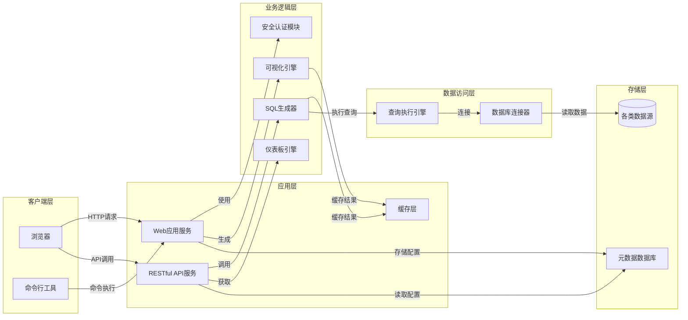
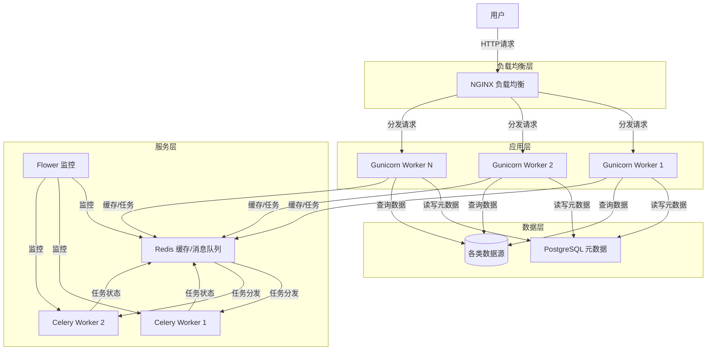

# Superset架构概览与技术栈介绍

## 1. Superset简介

Apache Superset（前身为Caravel）是一个功能强大的开源BI（商业智能）工具，由Airbnb开发并捐赠给Apache基金会。它提供了直观的可视化界面，支持丰富的图表类型和数据源，让用户能够轻松创建交互式数据可视化和仪表板。

### 1.1 Superset的核心价值

- **开源免费**：Apache基金会维护的开源项目，企业可以免费使用并进行二次开发
- **强大的可视化能力**：支持多种图表类型，包括但不限于柱状图、折线图、饼图、地图等
- **数据源中立**：支持几乎所有主流的关系型数据库和部分NoSQL数据库
- **高度可扩展**：插件化架构设计，支持自定义图表、数据源和功能扩展
- **直观易用**：用户友好的界面，降低数据分析门槛

## 2. Superset整体架构

Superset采用典型的前后端分离架构，整体架构由以下几个核心部分组成：

### 2.1 架构特点

1. **前后端分离**：前端使用React框架构建，后端使用Python Flask框架
2. **微服务友好**：各组件间通过API交互，便于独立部署和扩展
3. **可插拔设计**：数据源连接器、图表类型等都采用插件化设计
4. **多级缓存**：支持查询结果缓存，提高性能
5. **扩展性强**：支持自定义插件和功能扩展

## 3. 技术栈详解

### 3.1 后端技术栈

| 技术/框架 | 版本要求 | 用途 | 备注 |
|---------|---------|-----|------|
| Python | >= 3.9 | 主要开发语言 | 官方推荐使用Python 3.9+ |
| Flask | ~2.0 | Web框架 | 提供HTTP服务和API |
| Flask-AppBuilder | ~4.0 | 管理后台框架 | 提供用户认证、权限管理等功能 |
| SQLAlchemy | ~1.4 | ORM框架 | 数据库交互 |
| Pandas | ~1.4 | 数据处理 | 用于处理查询结果 |
| PyArrow | ~8.0 | 内存数据格式 | 高效数据处理 |
| Celery | ~5.2 | 任务队列 | 异步任务处理 |
| Redis | >= 3.2 | 缓存/消息代理 | 可选配置 |

### 3.2 前端技术栈

| 技术/框架 | 版本要求 | 用途 | 备注 |
|---------|---------|-----|------|
| React | ~17.0 | UI框架 | 构建用户界面 |
| TypeScript | ~4.5 | JavaScript超集 | 类型系统 |
| Ant Design | ~4.19 | UI组件库 | 提供现成组件 |
| Redux | ~4.1 | 状态管理 | 管理前端状态 |
| Chart.js | ~3.7 | 图表库 | 基础图表 |
| D3.js | ~7.3 | 数据可视化库 | 复杂可视化 |
| ECharts | ~5.4 | 图表库 | 部分图表使用 |
| Webpack | ~5.67 | 模块打包工具 | 前端构建 |

### 3.3 存储技术栈

| 技术 | 用途 | 备注 |
|-----|-----|------|
| PostgreSQL | 元数据存储 | 推荐的主要元数据库 |
| MySQL | 元数据存储 | 可选的元数据库 |
| SQLite | 元数据存储 | 开发环境使用 |
| Redis | 缓存/会话存储 | 提高性能 |

### 3.4 支持的数据源

Superset支持多种数据源，以下是部分主要支持的数据源：

| 数据源类型 | 支持状态 | 备注 |
|----------|---------|-----|
| PostgreSQL | 完全支持 | 推荐使用 |
| MySQL/MariaDB | 完全支持 | 常用关系型数据库 |
| SQLite | 完全支持 | 开发环境 |
| Oracle | 完全支持 | 企业级数据库 |
| SQL Server | 完全支持 | Microsoft产品 |
| Presto | 完全支持 | 分布式查询引擎 |
| Druid | 完全支持 | 实时分析数据库 |
| BigQuery | 完全支持 | Google云服务 |
| Redshift | 完全支持 | AWS云服务 |
| Snowflake | 完全支持 | 云数据仓库 |
| ClickHouse | 完全支持 | 列式数据库 |
| Spark SQL | 完全支持 | 大数据分析 |

## 4. 部署架构

### 4.1 典型部署架构

### 4.2 扩展性考虑

- **水平扩展**：可以通过增加Gunicorn和Celery worker的数量来水平扩展
- **垂直扩展**：可以为PostgreSQL和Redis分配更多资源来提升性能
- **容器化部署**：支持Docker容器化部署，便于在Kubernetes等平台上管理

## 5. Superset版本演进

### 5.1 主要版本里程碑

| 版本 | 发布时间 | 主要特性 |
|-----|---------|--------|
| 0.28.0 | 2019年3月 | 引入Apache孵化器 |
| 1.0.0 | 2021年1月 | 首个稳定版，正式毕业 |
| 2.0.0 | 2022年5月 | 前端重构，支持更多图表类型 |
| 3.0.0 | 2023年9月 | 性能优化，新的数据源连接器 |
| 4.0.0 | 2024年Q1 | 预计将有更多现代化特性 |

## 6. 总结

Superset采用现代化的前后端分离架构，基于Python Flask和React构建，具有高度的可扩展性和灵活性。其插件化设计使得用户可以根据自身需求进行定制和扩展，同时其丰富的数据源支持使其能够适用于各种数据分析场景。

在后续章节中，我们将深入探讨Superset的核心概念、数据模型、前后端架构实现以及如何进行二次开发和扩展。