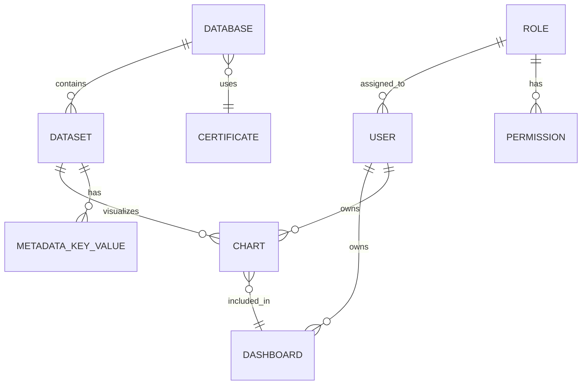
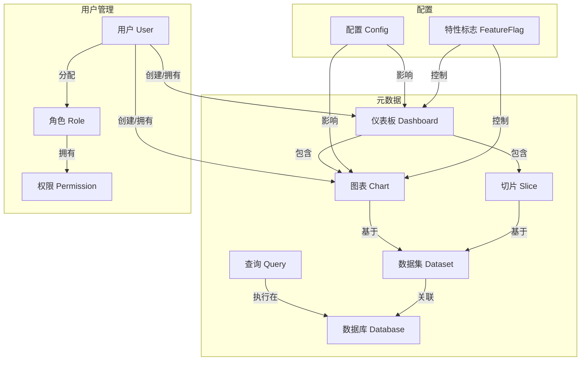
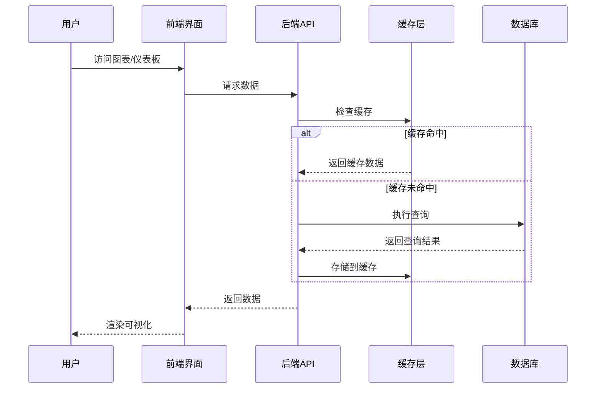
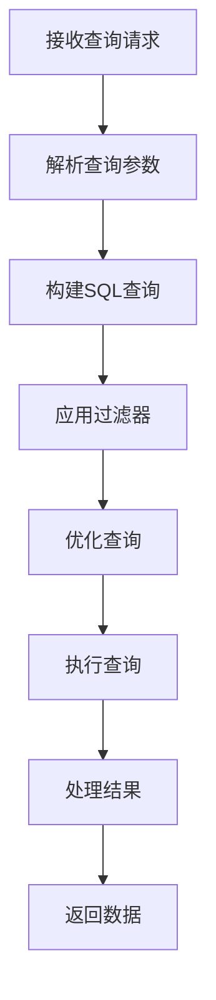

# Superset核心概念与数据模型详解

## 1. Superset核心概念

### 1.1 数据源 (Data Source)

数据源是Superset与外部数据存储系统的连接配置。每个数据源定义了如何连接到特定的数据库，并提供了该数据库中的表和视图信息。

**关键特性：**
- 支持多种数据库类型
- 可配置连接参数和凭证
- 可设置数据访问权限
- 支持自定义SQL查询

### 1.2 数据集 (Dataset)

数据集是基于数据源创建的具体数据集合，通常对应数据库中的表、视图或自定义SQL查询结果。数据集定义了可用于可视化的数据结构。

**关键特性：**
- 定义数据结构和字段类型
- 支持计算字段和表达式
- 可设置默认过滤器
- 关联到特定的数据源

### 1.3 图表 (Chart)

图表是Superset的核心可视化组件，用于将数据以图形方式呈现。Superset支持多种图表类型，从简单的柱状图到复杂的地理空间可视化。

**关键特性：**
- 基于数据集创建
- 可配置维度和指标
- 支持自定义样式和交互
- 可导出为多种格式

### 1.4 仪表板 (Dashboard)

仪表板是图表的集合，可以组织和展示多个相关的可视化。用户可以在仪表板中添加、排列和配置多个图表，并设置全局过滤器。

**关键特性：**
- 包含多个图表
- 支持全局过滤器
- 可自定义布局
- 支持权限控制和共享

### 1.5 切片 (Slice)

在Superset的早期版本中，Slice是指单个可视化组件，现在已逐步被Chart概念替代，但在一些API和代码中仍有使用。

### 1.6 SQL编辑器 (SQL Lab)

SQL编辑器是一个功能强大的工具，允许用户编写、执行SQL查询并可视化结果。

**关键特性：**
- 语法高亮和自动补全
- 查询执行和结果可视化
- 查询历史和收藏
- 支持多语句和参数化查询

### 1.7 数据库连接 (Database)

数据库连接定义了Superset如何连接到外部数据库系统，包括连接字符串、凭证和其他配置。

### 1.8 用户和角色 (User & Role)

Superset实现了基于角色的访问控制(RBAC)，用户可以被分配不同的角色，每个角色有特定的权限。

## 2. 核心数据模型关系

### 2.1 数据模型概览

### 2.2 主要实体关系图

## 3. 详细数据模型

### 3.1 Database (数据库)

Database模型定义了Superset如何连接到外部数据库系统。

**主要字段：**
- `id`: 唯一标识符
- `database_name`: 数据库名称
- `sqlalchemy_uri`: SQLAlchemy连接URI
- `engine`: 数据库引擎类型
- `cache_timeout`: 缓存超时时间
- `expose_in_sqllab`: 是否在SQL Lab中显示
- `allow_run_async`: 是否允许异步查询

**核心关系：**
- 一对多：Database -> Dataset
- 一对多：Database -> SQL Table

### 3.2 Dataset (数据集)

Dataset模型表示一个可用于可视化的数据集合。

**主要字段：**
- `id`: 唯一标识符
- `database_id`: 关联的数据库ID
- `table_name`: 表名
- `schema`: 数据库模式
- `sql`: 自定义SQL查询
- `description`: 描述
- `is_sqllab_view`: 是否为SQL Lab视图

**核心关系：**
- 多对一：Dataset -> Database
- 一对多：Dataset -> Chart

### 3.3 Chart (图表)

Chart模型表示单个可视化组件。

**主要字段：**
- `id`: 唯一标识符
- `slice_name`: 图表名称（兼容旧版本）
- `viz_type`: 可视化类型
- `dataset_id`: 关联的数据集ID
- `params`: 图表参数（JSON格式）
- `cache_timeout`: 缓存超时时间

**核心关系：**
- 多对一：Chart -> Dataset
- 多对多：Chart -> Dashboard

### 3.4 Dashboard (仪表板)

Dashboard模型表示图表的集合。

**主要字段：**
- `id`: 唯一标识符
- `dashboard_title`: 仪表板标题
- `slug`: URL友好标识符
- `position_json`: 位置配置（JSON格式）
- `json_metadata`: 元数据（JSON格式）
- `published`: 是否发布

**核心关系：**
- 多对多：Dashboard -> Chart
- 多对一：Dashboard -> User (所有者)

### 3.5 User (用户)

User模型基于Flask-AppBuilder，定义了系统用户。

**主要字段：**
- `id`: 唯一标识符
- `username`: 用户名
- `first_name`: 名
- `last_name`: 姓
- `email`: 电子邮件
- `active`: 是否激活
- `last_login`: 最后登录时间

**核心关系：**
- 多对多：User -> Role
- 一对多：User -> Dashboard
- 一对多：User -> Chart

### 3.6 Role (角色)

Role模型定义了用户角色，用于权限管理。

**主要字段：**
- `id`: 唯一标识符
- `name`: 角色名称
- `description`: 描述

**核心关系：**
- 多对多：Role -> User
- 多对多：Role -> Permission

### 3.7 Permission (权限)

Permission模型定义了具体的权限。

**主要字段：**
- `id`: 唯一标识符
- `name`: 权限名称
- `permission_view_menu`: 权限视图菜单

**核心关系：**
- 多对多：Permission -> Role

### 3.8 Query (查询)

Query模型记录了SQL Lab中执行的查询。

**主要字段：**
- `id`: 唯一标识符
- `database_id`: 数据库ID
- `sql`: SQL查询语句
- `user_id`: 用户ID
- `start_time`: 开始时间
- `end_time`: 结束时间
- `status`: 状态
- `rows`: 返回行数
- `error_message`: 错误信息

## 4. 配置模型

### 4.1 Config (配置)

Superset使用多种配置方式：
- 配置文件 (`superset_config.py`)
- 环境变量
- 数据库配置

**主要配置类别：**
- 安全配置
- 缓存配置
- 数据库配置
- 特性标志
- 认证配置

### 4.2 FeatureFlag (特性标志)

特性标志用于控制功能的启用/禁用。

**常见特性标志：**
- `DASHBOARD_NATIVE_FILTERS`: 启用原生过滤器
- `DASHBOARD_CROSS_FILTERS`: 启用跨过滤器
- `ENABLE_TEMPLATE_PROCESSING`: 启用模板处理
- `ALERT_REPORTS`: 启用警报和报告

## 5. 数据流模型

### 5.1 数据请求流程

当用户查看图表或仪表板时，数据请求的典型流程如下：

### 5.2 查询执行流程

SQL查询的执行流程：

## 6. 权限模型

### 6.1 RBAC权限体系

Superset实现了基于角色的访问控制(RBAC)，主要包括：

**默认角色：**
- `Admin`: 管理员，完全访问权限
- `Alpha`: 可以访问所有数据源，但只能修改自己创建的对象
- `Gamma`: 有限访问权限，只能访问特定的数据源
- `Public`: 公共访问，只读权限
- `sql_lab`: 可以访问SQL Lab

### 6.2 权限粒度

Superset的权限控制可以精确到：
- 数据源级别
- 数据集级别
- 仪表板级别
- 功能级别（如SQL Lab访问）

## 7. 总结

Superset的数据模型设计灵活而强大，通过清晰的实体关系支持复杂的BI场景。理解这些核心概念和数据模型对于二次开发和扩展Superset功能至关重要。在后续章节中，我们将深入探讨如何利用这些模型进行自定义开发和功能扩展。