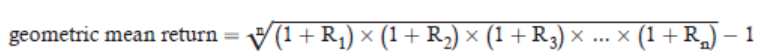

## MODULE 1.1: INTEREST RATES AND RETURN MEASUREMENT
```
Interpret interest rates as required rates of return, available online.将利率解释为所需的回报率、折现率或机会成本，并在网上找到相关信息。discount rates, or opportunity costs and explain an interest rate as the sum of a real risk-free rate and premiums that compensate investors for bearing distinct types of risk.解释利率作为实际无风险利率和补偿投资者承担不同类型风险的溢价之和。

```

```
Interest rates measure the time value of money, although risk differences in financial securities lead to differences in their equilibrium interest rates. 利率衡量的是货币的时间价值，尽管金融证券的风险差异导致了它们均衡利率的不同。 Equilibrium interest rates are the required rate of return for a particular investment, in the sense that the market rate of return is the return that investors and savers require to get them to willingly lend their funds. 均衡利率是特定投资的所需回报率，也就是说，市场回报率是投资者和储蓄者为了使他们愿意出借资金而要求的回报。Interest rates are also referred to as discount rates and, in fact, the terms are often used interchangeably.利率也被称为折现率，实际上，这两个术语经常被交替使用。If an individual can borrow funds at an interest rate of 10%, then that individual should discount payments to be made in the future at that rate to get their equivalent value in current dollars or other currencies.如果个人可以以10%的利率借款，那么这个人应该以那个利率折现未来将支付的款项，以获得它们在当前美元或其他货币中的等值价值。Finally, we can also view interest rates as the opportunity cost of current consumption.最后，我们还可以将利率视为当前消费的机会成本。 If the market rate of interest on 1-year securities is 5%, earning an additional 5% is the opportunity forgone when current consumption is chosen rather than saving (postponing consumption).
如果1年期证券的市场利率是5%，那么选择当前消费而不是储蓄（推迟消费）时，放弃的是额外赚取5%的机会。
```

```
The real risk-free rate of interest is a theoretical rate on a ingle-period loan that contains no expectation of inflation and zero probability of default. 实际无风险利率是一个理论上的单期贷款利率，其中不包含通货膨胀的预期，且违约概率为零。What the real risk-free rate represents in economic terms is time preference, the degree to which current consumption is preferred to equal future consumption.从经济学的角度来看，实际无风险利率代表的是时间偏好，即当前消费相对于同等未来消费的偏好程度。
```

```
When we speak of a real rate of return, we are referring to an investor’s increase in purchasing power (after adjusting for inflation). 当我们谈论实际回报率时，我们指的是投资者的购买力增加（经通货膨胀调整后）。Because expected inflation in future periods is not zero, the rates we observe on U.S. Treasury bills (T-bills), for example, are essentially risk-free rates, but not real rates of return. 由于未来期间的预期通货膨胀率不为零，例如，我们观察到的美国国库券（T-bills）的利率本质上是无风险利率，但不是实际回报率。T-bill rates are nominal risk-free rates because they contain an inflation premium. T-bill的利率是名义无风险利率，因为它们包含了通货膨胀溢价。This is the relation:这是它们之间的关系：
(1 + nominal risk-free rate) = (1 + real risk-free rate)(1 + expected inflation rate)
(1 + 名义无风险利率) = (1 + 实际无风险利率) × (1 + 预期通货膨胀率)
Often, including in many parts of the CFA curriculum, this relation is approximated as follows:
在许多情况下，包括CFA课程的许多部分，这个关系可以近似为以下形式：
nominal risk-free rate ≈ real risk-free rate + expected inflation rate
名义无风险利率 ≈ 实际无风险利率 + 预期通货膨胀率
Securities may have one or more types of risk, and each added risk increases the required rate of return. 
证券可能存在一种或多种风险，每增加一种风险都会增加所需的回报率。
These types of risks are as follows:
这些风险类型如下：
Default risk. 
违约风险。
This is the risk that a borrower will not make the promised payments in a timely manner.
这是借款人未能按时履行承诺支付的风险。
Liquidity risk. 
 流动性风险
This is the risk of receiving less than fair value for an investment if it must be sold quickly for cash.
这是如果必须快速出售投资以获得现金，则可能以低于公平价值的价格获得投资的风险
Maturity risk. 
到期风险
As we will see in the Fixed Income topic area, the prices of longer term bonds are more volatile than those of shorter-term bonds. 
正如我们将要在固定收益主题区域看到的，长期债券的价格比短期债券的价格更波动
Longer-maturity bonds have more maturity risk than shorter-term bonds and require a maturity risk premium.
长期债券的到期风险比短期债券更高，并需要一个到期风险溢价
```

```
Each of these risk factors is associated with a risk premium that we add to the nominal risk-free rate to adjust for greater default risk, less liquidity, and longer maturity relative to a liquid, short-term, default risk-free rate such as that on T-bills.
这些每种风险因素都与我们添加的名义无风险利率相关的风险溢价相关，我们将其添加到名义无风险利率中，以调整更大的违约风险、较少的流动性以及相对于T-bills等流动性高、短期、无违约风险的利率的更长的到期期限。
We can write the following:
我们可以写出以下内容：
```


### 1.1.2 : Calculate and interpret different approaches to return measurement over time and describe their appropriate uses.

Holding period return (HPR) is simply the percentage increase in the value of an
investment over a given period:持有期回报（HPR）简单来说就是在一定时期内投资价值的百分比增长：
For example, a stock that pays a dividend during a holding period has an HPR for
that period equal to:例如，在持有期间支付股息的股票在该期间的HPR等于：
If a stock is valued at €20 at the beginning of the period, pays €1 in dividends over the period, and at the end of the period is valued at €22, the HPR is:如果股票在期初的价值为€20，期间支付了€1的股息，并且在期末的价值为€22，则HPR为：
HPR = (22 + 1) / 20 − 1 = 0.15 = 15%
Returns over multiple periods reflect compounding. 跨多个期间的回报反映了复利 
For example, given HPRs for Years 1, 2, and 3, the HPR for the entire three-year period is:例如，给定第1年、第2年和第3年的HPR，整个三年期间的HPR为
Later in this reading, we will see that a return over multiple years is typically stated as an annualized return rather than an HPR.稍后在本阅读材料中，我们将看到，跨多年的回报通常以年化回报而非HPR来表示。

Average Returns 平均回报 
The arithmetic mean return is the simple average of a series of periodic returns. 算术平均回报是一系列定期回报的简单平均值. It has the statistical property of being an unbiased estimator of the true mean of the underlying distribution of returns:它具有作为回报基础分布真实均值无偏估计量的统计属性：

The geometric mean return is a compound rate.几何平均回报是一种复合率 When periodic rates of return vary from period to period, the geometric mean return will have a value less than the arithmetic mean return:当定期回报率在各个期间变化时，几何平均回报的值将小于算术平均回报
For example, for returns Rt over three annual periods, the geometric mean return is calculated as the following example shows 例如，对于三个年度期间的回报Rt，几何平均回报的计算如下例所示