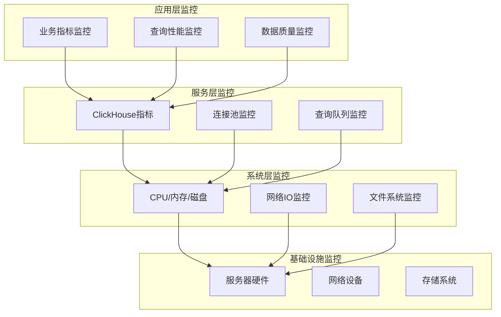

# Day 9: ClickHouse 监控和运维全攻略

## 学习目标 🎯
- 掌握ClickHouse监控体系设计和实施
- 学会使用系统表进行性能监控
- 掌握Prometheus + Grafana监控方案
- 理解日志管理和分析技巧
- 学会配置告警和故障处理
- 掌握运维最佳实践和自动化
- 了解容量规划和性能调优

## 为什么Day 9学监控和运维？ 🤔

经过前8天的学习：
- ✅ Day 1-3: 环境搭建到云端部署 - 基础设施
- ✅ Day 4-6: SQL语法到查询优化 - 核心技能
- ✅ Day 7-8: 数据操作到集群管理 - 分布式能力

现在学习**监控和运维**，这是ClickHouse生产环境稳定运行的关键！

### 学习路径回顾
```
基础篇(1-3) → 技能篇(4-6) → 进阶篇(7-8) → 运维篇(9-11) → 实战篇(12-14)
```

## 知识要点 📚

### 1. ClickHouse监控体系概览

#### 1.1 监控层次架构



#### 1.2 监控指标分类

| 监控类型 | 关键指标 | 监控频率 | 告警阈值 |
|----------|----------|----------|----------|
| **性能指标** | QPS、响应时间、吞吐量 | 1分钟 | 根据业务需求 |
| **资源指标** | CPU、内存、磁盘、网络 | 30秒 | >80%使用率 |
| **可用性指标** | 服务状态、连接数、错误率 | 30秒 | >5%错误率 |
| **业务指标** | 数据延迟、数据量、质量 | 5分钟 | 根据SLA |

### 2. ClickHouse系统表监控

#### 2.1 核心系统表

**query_log - 查询日志表**：
```sql
-- 查看慢查询
SELECT 
    query_start_time,
    query_duration_ms,
    read_rows,
    read_bytes,
    result_rows,
    memory_usage,
    query
FROM system.query_log 
WHERE event_date = today()
  AND type = 'QueryFinish'
  AND query_duration_ms > 10000
ORDER BY query_duration_ms DESC
LIMIT 10;

-- 查询错误统计
SELECT 
    toStartOfHour(event_time) as hour,
    count() as error_count,
    uniq(query) as unique_queries,
    groupArray(exception) as errors
FROM system.query_log 
WHERE event_date = today()
  AND type = 'ExceptionWhileProcessing'
GROUP BY hour
ORDER BY hour DESC;
```

**metric_log - 指标日志表**：
```sql
-- 系统资源使用趋势
SELECT 
    toStartOfMinute(event_time) as minute,
    avg(CurrentMetric_Query) as avg_queries,
    avg(CurrentMetric_TCPConnection) as avg_connections,
    avg(CurrentMetric_MemoryTracking) as avg_memory
FROM system.metric_log 
WHERE event_date = today()
  AND event_time >= now() - INTERVAL 1 HOUR
GROUP BY minute
ORDER BY minute DESC
LIMIT 60;
```

**parts - 数据分区表**：
```sql
-- 表存储分析
SELECT 
    database,
    table,
    count() as part_count,
    sum(rows) as total_rows,
    formatReadableSize(sum(data_compressed_bytes)) as compressed_size,
    formatReadableSize(sum(data_uncompressed_bytes)) as uncompressed_size,
    round(avg(compression_ratio), 2) as avg_compression_ratio
FROM system.parts 
WHERE active = 1
GROUP BY database, table
ORDER BY total_rows DESC;

-- 分区大小分布
SELECT 
    table,
    partition,
    rows,
    formatReadableSize(data_compressed_bytes) as size,
    compression_ratio,
    modification_time
FROM system.parts 
WHERE database = 'default'
  AND active = 1
ORDER BY data_compressed_bytes DESC
LIMIT 20;
```

#### 2.2 自定义监控视图

```sql
-- 创建性能监控视图
CREATE VIEW performance_overview AS
SELECT 
    toStartOfMinute(event_time) as time_window,
    count() as query_count,
    avg(query_duration_ms) as avg_duration,
    quantile(0.95)(query_duration_ms) as p95_duration,
    sum(read_rows) as total_rows_read,
    sum(read_bytes) as total_bytes_read,
    sum(result_rows) as total_rows_returned
FROM system.query_log 
WHERE type = 'QueryFinish'
  AND event_date >= today() - 7
GROUP BY time_window
ORDER BY time_window DESC;

-- 创建错误监控视图
CREATE VIEW error_monitoring AS
SELECT 
    toStartOfHour(event_time) as hour,
    count() as error_count,
    uniq(query) as unique_error_queries,
    groupArray(DISTINCT exception) as error_types,
    groupArray(user) as affected_users
FROM system.query_log 
WHERE type IN ('ExceptionBeforeStart', 'ExceptionWhileProcessing')
  AND event_date >= today() - 7
GROUP BY hour
ORDER BY hour DESC;
```

### 3. Prometheus + Grafana监控方案

#### 3.1 Prometheus配置

**ClickHouse Exporter配置**：
```yaml
# clickhouse-exporter.yml
global:
  scrape_interval: 15s
  evaluation_interval: 15s

rule_files:
  - "clickhouse_rules.yml"

scrape_configs:
  - job_name: 'clickhouse'
    static_configs:
      - targets: ['localhost:8123']
    metrics_path: '/metrics'
    scrape_interval: 30s
    params:
      query: 
        - 'SELECT * FROM system.metrics'
        - 'SELECT * FROM system.events'
        - 'SELECT * FROM system.asynchronous_metrics'

  - job_name: 'clickhouse-query-log'
    static_configs:
      - targets: ['localhost:8123']
    metrics_path: '/query'
    scrape_interval: 60s
    params:
      query: 
        - |
          SELECT 
            'clickhouse_queries_total' as metric,
            toString(count()) as value,
            'type=' || type as labels
          FROM system.query_log 
          WHERE event_time >= now() - INTERVAL 1 MINUTE
          GROUP BY type
```

**告警规则配置**：
```yaml
# clickhouse_rules.yml
groups:
- name: clickhouse
  rules:
  - alert: ClickHouseDown
    expr: up{job="clickhouse"} == 0
    for: 1m
    labels:
      severity: critical
    annotations:
      summary: "ClickHouse instance is down"
      description: "ClickHouse {{ $labels.instance }} has been down for more than 1 minute"

  - alert: ClickHouseHighQueryDuration
    expr: clickhouse_query_duration_95percentile > 10000
    for: 5m
    labels:
      severity: warning
    annotations:
      summary: "ClickHouse high query duration"
      description: "95th percentile query duration is {{ $value }}ms"

  - alert: ClickHouseHighMemoryUsage
    expr: clickhouse_memory_usage_ratio > 0.9
    for: 5m
    labels:
      severity: warning
    annotations:
      summary: "ClickHouse high memory usage"
      description: "Memory usage is {{ $value }}%"

  - alert: ClickHouseHighDiskUsage
    expr: clickhouse_disk_usage_ratio > 0.85
    for: 10m
    labels:
      severity: warning
    annotations:
      summary: "ClickHouse high disk usage"
      description: "Disk usage is {{ $value }}%"

  - alert: ClickHouseReplicationLag
    expr: clickhouse_replica_delay_seconds > 300
    for: 5m
    labels:
      severity: warning
    annotations:
      summary: "ClickHouse replication lag"
      description: "Replica {{ $labels.replica }} is lagging by {{ $value }} seconds"
```

#### 3.2 Grafana仪表板

**主要监控面板**：
```json
{
  "dashboard": {
    "title": "ClickHouse 监控仪表板",
    "panels": [
      {
        "title": "查询性能",
        "type": "graph",
        "targets": [
          {
            "query": "rate(clickhouse_queries_total[5m])",
            "legend": "QPS"
          },
          {
            "query": "clickhouse_query_duration_95percentile",
            "legend": "P95 Duration"
          }
        ]
      },
      {
        "title": "系统资源",
        "type": "graph", 
        "targets": [
          {
            "query": "clickhouse_cpu_usage_ratio * 100",
            "legend": "CPU %"
          },
          {
            "query": "clickhouse_memory_usage_ratio * 100",
            "legend": "Memory %"
          }
        ]
      },
      {
        "title": "磁盘IO",
        "type": "graph",
        "targets": [
          {
            "query": "rate(clickhouse_disk_read_bytes[5m])",
            "legend": "Read Bytes/s"
          },
          {
            "query": "rate(clickhouse_disk_write_bytes[5m])",
            "legend": "Write Bytes/s"
          }
        ]
      }
    ]
  }
}
```

### 4. 日志管理和分析

#### 4.1 ClickHouse日志配置

**日志级别和输出配置**：
```xml
<!-- config.xml -->
<logger>
    <level>information</level>
    <log>/var/log/clickhouse-server/clickhouse-server.log</log>
    <errorlog>/var/log/clickhouse-server/clickhouse-server.err.log</errorlog>
    <size>1000M</size>
    <count>10</count>
    <flush_interval_milliseconds>3000</flush_interval_milliseconds>
</logger>

<!-- 查询日志配置 -->
<query_log>
    <database>system</database>
    <table>query_log</table>
    <flush_interval_milliseconds>7500</flush_interval_milliseconds>
    <max_size_rows>1048576</max_size_rows>
    <reserved_size_rows>8192</reserved_size_rows>
    <buffer_size_rows_flush_threshold>524288</buffer_size_rows_flush_threshold>
</query_log>

<!-- 指标日志配置 -->
<metric_log>
    <database>system</database>
    <table>metric_log</table>
    <flush_interval_milliseconds>7500</flush_interval_milliseconds>
    <collect_interval_milliseconds>1000</collect_interval_milliseconds>
</metric_log>
```

#### 4.2 日志分析查询

**错误日志分析**：
```sql
-- 分析错误模式
SELECT 
    toStartOfHour(event_time) as hour,
    count() as error_count,
    exception,
    groupArray(DISTINCT user) as affected_users,
    groupArray(DISTINCT initial_address) as source_ips
FROM system.query_log 
WHERE event_date >= today() - 1
  AND type = 'ExceptionWhileProcessing'
  AND exception != ''
GROUP BY hour, exception
ORDER BY hour DESC, error_count DESC;

-- 慢查询分析
SELECT 
    query_duration_ms,
    read_rows,
    read_bytes,
    memory_usage,
    user,
    initial_address,
    substring(query, 1, 100) as query_preview
FROM system.query_log 
WHERE event_date = today()
  AND type = 'QueryFinish'
  AND query_duration_ms > 30000
ORDER BY query_duration_ms DESC
LIMIT 20;
```

**用户行为分析**：
```sql
-- 用户查询统计
SELECT 
    user,
    count() as query_count,
    avg(query_duration_ms) as avg_duration,
    sum(read_rows) as total_rows_read,
    formatReadableSize(sum(read_bytes)) as total_bytes_read,
    count() / (24 * 60) as queries_per_minute
FROM system.query_log 
WHERE event_date = today()
  AND type = 'QueryFinish'
GROUP BY user
ORDER BY query_count DESC;
```

### 5. 性能监控和优化

#### 5.1 关键性能指标(KPIs)

**查询性能指标**：
```sql
-- 实时查询性能统计
SELECT 
    toStartOfMinute(now()) as current_time,
    count() as current_queries,
    avg(elapsed) as avg_elapsed_time,
    sum(read_rows) as rows_per_second,
    formatReadableSize(sum(read_bytes)) as bytes_per_second
FROM system.processes 
WHERE query != '';

-- 历史性能趋势
SELECT 
    toStartOfHour(event_time) as hour,
    count() as queries_per_hour,
    avg(query_duration_ms) as avg_duration_ms,
    quantile(0.50)(query_duration_ms) as median_duration,
    quantile(0.95)(query_duration_ms) as p95_duration,
    quantile(0.99)(query_duration_ms) as p99_duration
FROM system.query_log 
WHERE event_date >= today() - 7
  AND type = 'QueryFinish'
GROUP BY hour
ORDER BY hour DESC;
```

**资源使用监控**：
```sql
-- 内存使用统计
SELECT 
    formatReadableSize(total_memory) as total_memory,
    formatReadableSize(free_memory) as free_memory,
    round((total_memory - free_memory) * 100.0 / total_memory, 2) as memory_usage_percent,
    formatReadableSize(MemoryTracking) as query_memory
FROM system.asynchronous_metrics
WHERE metric IN ('MemoryTotal', 'MemoryAvailable', 'MemoryTracking');

-- 磁盘使用分析
SELECT 
    database,
    formatReadableSize(sum(bytes_on_disk)) as disk_usage,
    sum(rows) as total_rows,
    count() as part_count
FROM system.parts 
WHERE active = 1
GROUP BY database
ORDER BY sum(bytes_on_disk) DESC;
```

#### 5.2 性能瓶颈识别

**查询瓶颈分析**：
```sql
-- 识别资源消耗最大的查询
SELECT 
    normalizeQuery(query) as normalized_query,
    count() as execution_count,
    avg(query_duration_ms) as avg_duration,
    sum(read_rows) as total_rows_read,
    sum(read_bytes) as total_bytes_read,
    avg(memory_usage) as avg_memory_usage
FROM system.query_log 
WHERE event_date >= today() - 1
  AND type = 'QueryFinish'
  AND query_duration_ms > 1000
GROUP BY normalized_query
ORDER BY avg_duration DESC
LIMIT 10;

-- 表访问热度分析
SELECT 
    concat(database, '.', table) as full_table_name,
    count() as access_count,
    sum(read_rows) as total_rows_read,
    avg(query_duration_ms) as avg_query_time
FROM (
    SELECT 
        database,
        table,
        read_rows,
        query_duration_ms
    FROM system.query_log 
    ARRAY JOIN tables.database as database, tables.name as table
    WHERE event_date >= today() - 1
      AND type = 'QueryFinish'
) 
GROUP BY full_table_name
ORDER BY access_count DESC
LIMIT 20;
```

### 6. 告警配置和故障处理

#### 6.1 告警配置策略

**分级告警体系**：

| 告警级别 | 响应时间 | 通知方式 | 处理策略 |
|----------|----------|----------|----------|
| **Critical** | 立即 | 电话+短信+邮件 | 立即处理 |
| **Warning** | 15分钟内 | 短信+邮件 | 优先处理 |
| **Info** | 1小时内 | 邮件 | 计划处理 |

**告警规则示例**：
```sql
-- 服务可用性告警
CREATE TABLE alert_rules (
    rule_name String,
    metric_query String,
    threshold Float64,
    operator String,
    severity String,
    description String
) ENGINE = Memory;

INSERT INTO alert_rules VALUES
('service_down', 'SELECT count() FROM system.processes', 0, '=', 'critical', 'ClickHouse服务不可用'),
('high_query_duration', 'SELECT quantile(0.95)(query_duration_ms) FROM system.query_log WHERE event_time >= now() - 300', 10000, '>', 'warning', '查询响应时间过长'),
('high_memory_usage', 'SELECT (total_memory - free_memory) / total_memory FROM system.asynchronous_metrics WHERE metric = \'MemoryTotal\'', 0.9, '>', 'warning', '内存使用率过高'),
('replica_lag', 'SELECT max(absolute_delay) FROM system.replicas', 300, '>', 'warning', '副本同步延迟');
```

#### 6.2 自动化告警脚本

**告警检查脚本**：
```bash
#!/bin/bash
# ClickHouse 告警检查脚本

CLICKHOUSE_HOST="localhost"
CLICKHOUSE_PORT="8123"
ALERT_WEBHOOK="https://hooks.slack.com/your-webhook"

# 检查服务状态
check_service_status() {
    result=$(curl -s "http://$CLICKHOUSE_HOST:$CLICKHOUSE_PORT/" || echo "FAILED")
    if [[ "$result" == "FAILED" ]]; then
        send_alert "CRITICAL" "ClickHouse服务不可用" "$CLICKHOUSE_HOST:$CLICKHOUSE_PORT"
        return 1
    fi
    return 0
}

# 检查查询性能
check_query_performance() {
    query="SELECT quantile(0.95)(query_duration_ms) FROM system.query_log WHERE event_time >= now() - INTERVAL 5 MINUTE AND type = 'QueryFinish'"
    result=$(curl -s "http://$CLICKHOUSE_HOST:$CLICKHOUSE_PORT/" -d "query=$query" | head -1)
    
    if (( $(echo "$result > 10000" | bc -l) )); then
        send_alert "WARNING" "查询性能告警" "P95响应时间: ${result}ms"
    fi
}

# 发送告警
send_alert() {
    local severity=$1
    local title=$2
    local message=$3
    
    curl -X POST -H 'Content-type: application/json' \
        --data "{\"text\":\"[$severity] $title: $message\"}" \
        $ALERT_WEBHOOK
}

# 主程序
main() {
    echo "$(date): 开始ClickHouse健康检查"
    
    if check_service_status; then
        check_query_performance
    fi
    
    echo "$(date): 健康检查完成"
}

main "$@"
```

### 7. 运维最佳实践

#### 7.1 日常运维检查清单

**每日检查项目**：
- ✅ 服务可用性和响应时间
- ✅ 查询错误率和慢查询
- ✅ 资源使用率(CPU/内存/磁盘)
- ✅ 副本同步状态
- ✅ 数据完整性检查
- ✅ 备份任务执行状态

**每周检查项目**：
- ✅ 性能趋势分析
- ✅ 容量规划评估
- ✅ 日志文件清理
- ✅ 系统更新检查
- ✅ 监控指标回顾
- ✅ 告警规则优化

#### 7.2 自动化运维脚本

**自动清理脚本**：
```sql
-- 清理过期日志
ALTER TABLE system.query_log DELETE WHERE event_date < today() - 30;
ALTER TABLE system.metric_log DELETE WHERE event_date < today() - 7;

-- 优化表性能
OPTIMIZE TABLE system.query_log FINAL;
OPTIMIZE TABLE system.metric_log FINAL;

-- 清理临时文件
SYSTEM DROP FILESYSTEM CACHE;
```

**健康检查报告**：
```sql
-- 生成每日健康报告
SELECT 
    'ClickHouse 健康报告' as report_title,
    today() as report_date,
    hostName() as server_name,
    version() as version,
    uptime() as uptime_seconds,
    (
        SELECT count() 
        FROM system.query_log 
        WHERE event_date = today() 
          AND type = 'QueryFinish'
    ) as daily_queries,
    (
        SELECT count() 
        FROM system.query_log 
        WHERE event_date = today() 
          AND type = 'ExceptionWhileProcessing'
    ) as daily_errors,
    (
        SELECT formatReadableSize(sum(bytes_on_disk))
        FROM system.parts 
        WHERE active = 1
    ) as total_data_size;
```

## 实践练习 🛠️

### 练习1：设置基础监控
1. 配置查询日志记录
2. 创建性能监控视图
3. 设置基本告警规则

### 练习2：Prometheus集成
1. 安装ClickHouse Exporter
2. 配置Prometheus采集
3. 创建Grafana仪表板

### 练习3：故障模拟
1. 模拟高负载场景
2. 触发告警机制
3. 验证故障恢复流程

## 常见问题 ❓

### Q1: 如何选择合适的监控指标？
**A**: 监控指标选择原则：
- 关注业务关键指标(QPS、响应时间)
- 监控资源使用情况(CPU、内存、磁盘)
- 跟踪错误率和可用性
- 根据实际使用场景调整

### Q2: 告警频率过高怎么办？
**A**: 告警优化策略：
- 调整告警阈值避免误报
- 设置告警抑制和聚合规则
- 使用趋势分析而非瞬时值
- 建立告警升级机制

### Q3: 如何处理历史监控数据？
**A**: 数据保留策略：
- 设置合理的数据保留期限
- 对历史数据进行聚合压缩
- 定期清理过期数据
- 重要数据长期归档存储

## 今日总结 📋

今天我们全面学习了：
- ✅ ClickHouse监控体系设计和实施
- ✅ 系统表使用和性能分析
- ✅ Prometheus + Grafana监控方案
- ✅ 日志管理和错误分析
- ✅ 告警配置和故障处理
- ✅ 运维最佳实践和自动化

**下一步**: Day 10 - 性能优化，深入学习ClickHouse性能调优技巧

---
*学习进度: Day 9/14 完成* 🎉 