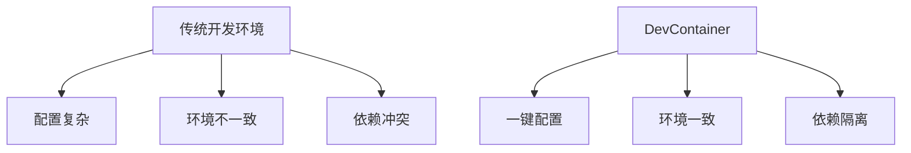

# 第1章：DevContainer基础概念

## 1.1 什么是DevContainer？

**DevContainer（Development Container）**是微软推出的一个标准，用于定义和配置可重复的开发环境。它允许开发者将整个开发环境（包括工具、依赖、配置）打包到容器中，确保在任何机器上都能获得一致的开发体验。

### 核心概念

- **容器化开发**：将开发环境容器化，与宿主机环境隔离
- **环境一致性**：无论使用什么机器，开发环境完全一致
- **快速启动**：新开发者可以快速获得完整的开发环境
- **版本控制**：开发环境配置可以像代码一样进行版本管理

## 1.2 为什么需要DevContainer？

### 传统开发环境的痛点

1. **环境配置复杂**：每个新成员需要花费数小时配置环境
2. **依赖冲突**：不同项目可能需要不同版本的依赖
3. **操作系统差异**：Windows、macOS、Linux环境差异导致问题
4. **团队协作困难**："在我机器上能运行"的问题

### DevContainer的优势



## 1.3 DevContainer的工作原理

### 基本架构

```
宿主机系统 (Windows/macOS/Linux)
    ↓
Docker引擎
    ↓
DevContainer容器
    ├── 开发工具 (VSCode, Git, 等)
    ├── 编程语言环境 (Node.js, Python, 等)
    ├── 项目依赖
    └── 配置文件
```

### 工作流程

1. **定义环境**：通过 `.devcontainer/devcontainer.json` 文件定义环境
2. **构建镜像**：Docker根据配置构建或拉取镜像
3. **启动容器**：VSCode或其他支持DevContainer的IDE启动容器
4. **开发工作**：在容器内进行开发，文件通过卷映射与宿主机同步

## 1.4 核心组件

### 1. devcontainer.json

这是DevContainer的核心配置文件，定义了：

- 基础镜像或Dockerfile
- 开发工具和扩展
- 端口映射和卷映射
- 环境变量
- 启动命令

### 2. Dockerfile

可选组件，用于自定义构建开发环境镜像：

```dockerfile
FROM node:18-alpine

# 安装系统依赖
RUN apk add --no-cache git

# 设置工作目录
WORKDIR /workspace

# 复制项目文件
COPY package.json .
RUN npm install
```

### 3. 开发容器特性

- **文件同步**：宿主机文件与容器实时同步
- **终端访问**：可以在容器内运行命令
- **端口转发**：容器内服务可以访问到宿主机
- **扩展支持**：VSCode扩展可以在容器内运行

## 1.5 适用场景

### 理想使用场景

1. **团队协作项目**：确保所有成员环境一致
2. **开源项目贡献**：降低贡献者门槛
3. **多语言项目**：不同语言环境隔离
4. **教学和培训**：快速提供标准环境
5. **CI/CD集成**：开发环境与生产环境一致

### 可能不适合的场景

1. **性能敏感应用**：容器化可能有轻微性能开销
2. **硬件相关开发**：需要直接访问硬件的场景
3. **大型二进制文件**：频繁的Docker镜像构建可能耗时

## 1.6 技术栈支持

### 支持的IDE

- **Visual Studio Code**（官方支持）
- **GitHub Codespaces**（云端DevContainer）
- **JetBrains IDE**（通过插件支持）
- **其他支持容器化的编辑器**

### 支持的语言和框架

- **前端**：React, Vue, Angular, Node.js
- **后端**：Python, Java, Go, Rust, .NET
- **数据科学**：Jupyter, R, Python数据科学栈
- **移动开发**：Flutter, React Native
- **基础设施**：Terraform, Ansible, Kubernetes

## 1.7 快速体验

让我们创建一个最简单的DevContainer来体验一下：

### 步骤1：创建项目结构

```bash
mkdir my-first-devcontainer
cd my-first-devcontainer
mkdir .devcontainer
```

### 步骤2：创建devcontainer.json

```json
{
    "name": "My First DevContainer",
    "image": "mcr.microsoft.com/devcontainers/base:ubuntu",
    "features": {
        "ghcr.io/devcontainers/features/node:1": {}
    },
    "customizations": {
        "vscode": {
            "extensions": [
                "ms-vscode.vscode-node-azure-pack"
            ]
        }
    }
}
```

### 步骤3：在VSCode中打开

1. 安装"Dev Containers"扩展
2. 打开项目文件夹
3. 按`Ctrl+Shift+P`，选择"Dev Containers: Reopen in Container"
4. 等待容器构建和启动

## 1.8 本章总结

本章我们学习了：

- DevContainer的基本概念和优势
- 传统开发环境的痛点
- DevContainer的工作原理和架构
- 核心组件：devcontainer.json、Dockerfile
- 适用场景和技术栈支持

在下一章中，我们将深入学习devcontainer.json配置文件的详细用法。

---

**思考题**：
1. 你的当前开发环境存在哪些痛点？
2. 你认为DevContainer能解决你工作中的哪些问题？
3. 尝试创建一个简单的DevContainer环境，体验一下快速启动的感觉。

**下一章**：[第2章：配置文件详解](./02-配置文件详解.md)