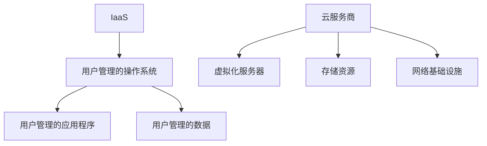
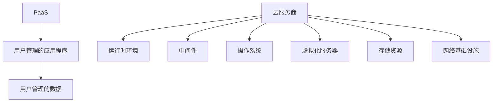
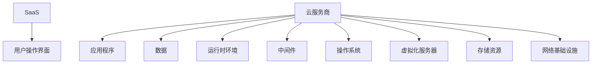
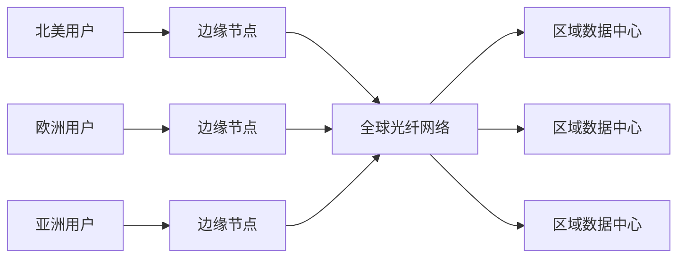
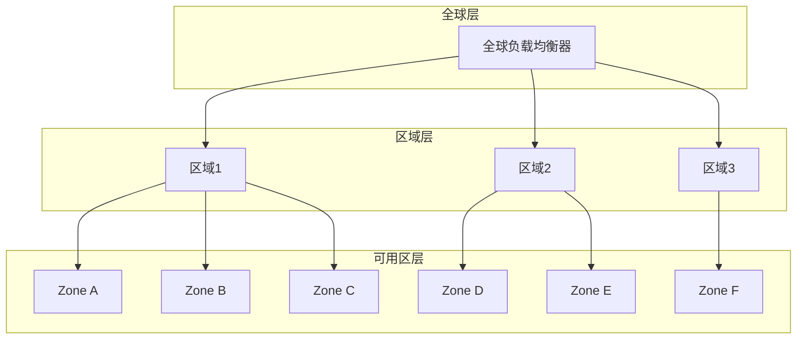
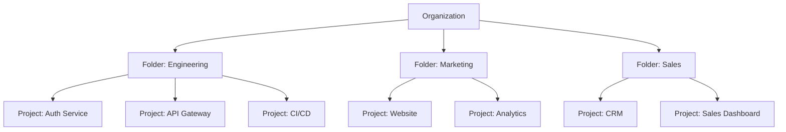
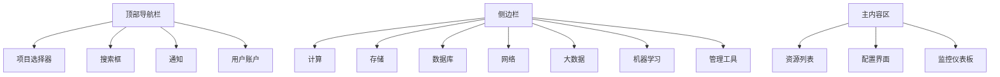

# 第1章：GCP基础概念与平台介绍

## 📚 本章导学

Google Cloud Platform (GCP) 是Google提供的云计算服务平台，为开发者提供了一系列强大、灵活的云服务。本章将为您介绍GCP的基础概念、平台架构以及核心管理功能，为后续深入学习各服务打下坚实基础。

### 🎯 学习目标

完成本章学习后，您将能够：

- 理解云计算的基本概念和服务模型
- 掌握GCP的全球基础设施和核心优势
- 学会管理GCP项目、账户和资源
- 了解GCP的计费模型和成本控制方法
- 熟悉使用Google Cloud Console和Cloud Shell

### 📖 本章内容概览

1. [云计算基础](#1-云计算基础)
2. [GCP全球基础设施](#2-gcp全球基础设施)
3. [账户与项目管理](#3-账户与项目管理)
4. [计费与成本管理](#4-计费与成本管理)
5. [Google Cloud Console与工具](#5-google-cloud-console与工具)
6. [实验：创建第一个GCP资源](#6-实验创建第一个gcp资源)

---

## 1. 云计算基础

### 1.1 什么是云计算

云计算是通过互联网提供计算资源（如服务器、存储、数据库、网络、软件等）的服务模式。与传统IT基础设施相比，云计算具有以下特点：

**✅ 云计算的核心优势**

| 特性 | 传统IT | 云计算 |
|------|--------|--------|
| **成本模式** | 前期资本支出(CAPEX) | 按需付费(OPEX) |
| **扩展性** | 受限于物理硬件 | 弹性伸缩，按需扩展 |
| **部署速度** | 数周至数月 | 分钟级部署 |
| **维护管理** | 自行负责全栈维护 | 云服务提供商负责基础设施 |
| **可靠性** | 单点故障风险高 | 多区域容灾，高可用性 |

### 1.2 云服务模型

云计算通常分为三种服务模型，理解这些模型有助于选择合适的服务类型：

#### IaaS (Infrastructure as a Service)

**基础设施即服务**：提供基础的计算、存储、网络资源。

- **典型代表**：Compute Engine, Cloud Storage, VPC网络
- **适用场景**：需要完全控制底层基础设施的应用
- **优势**：灵活性高，可自定义操作系统和配置



#### PaaS (Platform as a Service)

**平台即服务**：提供应用开发和部署平台，无需管理底层基础设施。

- **典型代表**：App Engine, Cloud Run
- **适用场景**：快速开发部署应用，不关注底层设施
- **优势**：开发效率高，自动扩缩容，内置服务



#### SaaS (Software as a Service)

**软件即服务**：提供可直接使用的软件应用。

- **典型代表**：Google Workspace, Gmail
- **适用场景**：直接使用成熟的软件解决方案
- **优势**：无需开发，即开即用，按需付费



### 1.3 部署模型

云计算的部署方式包括：

| 模型 | 描述 | 典型场景 |
|------|------|----------|
| **公有云** | 资源由第三方云服务商提供，多租户共享 | 公网应用，Web服务 |
| **私有云** | 资源专为单一组织构建，可本地或托管 | 敏感数据，特殊合规要求 |
| **混合云** | 结合公有云和私有云，数据和应用可流动 | 平衡成本与安全 |
| **多云** | 使用多个云服务商，避免供应商锁定 | 高可用性，最佳服务选择 |

GCP主要提供公有云服务，但支持与私有云构建混合云架构。

---

## 2. GCP全球基础设施

### 2.1 全球网络架构

Google拥有全球最大、最先进的网络基础设施之一，这是GCP的核心竞争力。

#### 全球光纤网络

- **私有光纤网络**：Google投资建设了全球性的光纤网络
- **海底电缆**：拥有多条跨洲海底电缆，连接各大洲
- **边缘节点**：全球200+边缘节点和POP（Points of Presence）



#### 地理分布

GCP的基础设施按以下层次组织：

**区域(Region)**：地理上的区域，包含多个可用区
- 全球40+个区域（持续增长中）
- 每个区域是独立的故障域
- 资源部署在特定区域内

**可用区(Zone)**：区域内的数据中心
- 每个区域包含3个或更多可用区
- 可用区之间有低延迟、高带宽连接
- 提供高可用性和灾难恢复能力

**边缘位置(Edge Location)**：
- 全球200+边缘位置
- 提供低延迟访问
- 用于缓存和内容分发

### 2.2 可用性与持续性

GCP通过多层次架构确保服务高可用性：



#### 服务等级协议(SLA)

不同服务提供不同的SLA保证：

| 服务类型 | SLA保证 | 典型可用性 |
|----------|---------|------------|
| **多区域资源** | 最高级别 | 99.99%+ |
| **区域资源** | 高级别 | 99.95%+ |
| **可用区资源** | 标准级别 | 99.5%+ |

---

## 3. 账户与项目管理

### 3.1 Google Cloud账户

要使用GCP，您需要一个Google Cloud账户：

**账户类型**：
- **免费试用账户**：$300免费额度，90天有效期
- **付费账户**：绑定信用卡，按实际使用付费
- **企业账户**：高级支持功能，批量折扣

**创建账户**：

1. 访问 [cloud.google.com](https://cloud.google.com)
2. 点击"开始免费使用"
3. 使用Google账户登录或创建新账户
4. 填写个人信息和付款信息
5. 验证身份并接受服务条款

### 3.2 项目管理

项目是GCP中的核心组织单元，所有资源都隶属于某个项目。

**项目特点**：
- 每个项目有唯一的ID
- 项目是计费和权限管理的边界
- 项目间资源默认隔离

**创建项目**：

1. 登录Google Cloud Console
2. 在顶部导航栏点击项目选择器
3. 点击"新建项目"
4. 填写项目名称
5. 选择计费账户（可选，稍后关联）
6. 点击"创建"

### 3.3 项目最佳实践

#### 命名规范

良好的项目命名有助于组织管理：

```
推荐格式：
- [环境]-[团队]-[应用/服务] 
  示例: dev-infra-cicd, prod-data-analytics

- [环境]-[项目简称]-[部门]
  示例: test-hr-payroll, prod-finance-billing
```

#### 项目组织模式

根据团队规模和需求选择适合的组织模式：

**小团队模式**：
- 按环境分离：dev-project, test-project, prod-project
- 优点：简单清晰，权限管理容易
- 缺点：资源利用率可能不高

**中大型团队模式**：
- 按功能/服务分离：user-service-project, order-service-project
- 优点：资源隔离性好，成本分配清晰
- 缺点：跨项目资源访问需要额外配置

**企业模式**：
- 使用组织(Organization)和文件夹(Folder)结构化
- 按业务部门或产品线组织
- 优点：层次化管理，适合大型组织



---

## 4. 计费与成本管理

### 4.1 计费模型

GCP采用按使用付费(Pay-as-you-go)的计费模型：

**计费原则**：
- 仅对实际使用的资源付费
- 按秒/分钟级别精确计费（大部分服务）
- 无长期合同约束，可随时取消

**计费周期**：
- 每月生成账单
- 可设置预算提醒
- 支持多种支付方式

### 4.2 免费额度

GCP提供多层免费额度，帮助用户免费入门：

#### 始终免费(Always Free)额度

| 服务 | 免费额度 | 说明 |
|------|----------|------|
| **Compute Engine** | 1个e2-micro实例/月 | 限定区域：us-west1, us-central1, us-east1 |
| **Cloud Storage** | 5GB标准存储 | 地区级存储 |
| **Cloud Functions** | 200万次调用/月 | 包括400,000 GB-秒计算时间 |
| **BigQuery** | 10GB存储/月 | 1TB查询/月 |
| **Cloud Pub/Sub** | 10GB消息/月 | |
| **Stackdriver Logging** | 50GB日志/月 | |

#### 试用免费额度

- 新用户注册获得$300免费额度
- 有效期90天
- 可用于大部分GCP服务
- 需要绑定信用卡验证身份

### 4.3 定价模型

不同服务有不同的定价模式：

#### 计算服务定价

| 服务 | 定价模式 | 示例 |
|------|----------|------|
| **Compute Engine** | 按秒计费 | e2-medium: $0.05/小时 |
| **App Engine** | 按实例小时数 | $0.05/实例小时 + 网络费用 |
| **Cloud Run** | 按请求数和CPU时间 | $0.40/百万请求 + CPU时间费用 |
| **Cloud Functions** | 按调用次数和计算时间 | $0.40/百万调用 + GB-秒费用 |

#### 存储服务定价

| 服务 | 存储类别 | 定价（示例） | 适用场景 |
|------|----------|--------------|----------|
| **Cloud Storage** | 标准存储 | $0.020/GB/月 | 频繁访问数据 |
| **Cloud Storage** | 近线存储 | $0.010/GB/月 | 不频繁访问数据 |
| **Cloud Storage** | 冷线存储 | $0.004/GB/月 | 归档数据 |
| **Cloud Storage** | 归档存储 | $0.0012/GB/月 | 长期归档 |

#### 网络服务定价

- **出站流量**：前1GB/月免费，后续按区域分级收费
- **入站流量**：通常免费（特定情况除外）
- **负载均衡**：按使用时间和数据传输收费

### 4.4 成本优化策略

#### 计算资源优化

1. **选择合适的机器类型**
   - 预定义机器类型 vs 自定义机器类型
   - E2系列（性价比高）vs N2系列（性能高）

2. **利用折扣选项**
   - **持续使用折扣**：自动应用，使用时间越长折扣越高
   - **承诺使用折扣**：承诺1-3年使用量，最高可节省70%

3. **抢占式实例**
   - 价格可低至常规实例的80%
   - 可被随时抢占，适用于容错工作负载

#### 存储优化

1. **选择合适的存储类别**
   - 根据数据访问频率选择存储类别
   - 设置生命周期策略自动迁移数据

2. **数据压缩和去重**
   - 压缩存储数据
   - 使用高效数据格式（如Parquet而非JSON）

3. **定期清理**
   - 删除不需要的数据和快照
   - 定期审查存储使用情况

---

## 5. Google Cloud Console与工具

### 5.1 Google Cloud Console

Google Cloud Console是管理GCP资源的Web界面，提供直观的图形化操作体验。

#### 主要功能

- **资源管理**：创建、配置、监控和管理所有GCP资源
- **计费管理**：查看账单、设置预算和支付方式
- **IAM管理**：配置用户权限和访问控制
- **API管理**：启用和管理各种API
- **监控和日志**：查看资源性能指标和日志

#### 界面导航



### 5.2 Cloud Shell

Cloud Shell是内置在Google Cloud Console中的交互式shell环境，预装了Google Cloud SDK和其他工具。

#### 主要特性

- **临时VM实例**：5GB永久存储，每次会话持续1小时
- **预装工具**：gcloud CLI, kubectl, Docker等
- **代码编辑器**：内置基于Web的代码编辑器
- **语言运行时**：支持Node.js, Python, Go, Java等

#### 常用命令

```bash
# 身份认证
gcloud auth login
gcloud config set project [PROJECT_ID]

# 计算资源管理
gcloud compute instances list
gcloud compute instances create [INSTANCE_NAME]

# Kubernetes集群管理
gcloud container clusters create [CLUSTER_NAME]
gcloud container clusters get-credentials [CLUSTER_NAME]

# 存储管理
gsutil mb gs://[BUCKET_NAME]
gsutil cp [FILE] gs://[BUCKET_NAME]/

# 部署应用
gcloud app deploy
gcloud run deploy --image gcr.io/[PROJECT_ID]/[IMAGE] --platform managed
```

### 5.3 Google Cloud SDK

Google Cloud SDK是命令行工具集，提供对GCP服务的完整管理能力。

#### 安装SDK

**Linux/macOS**:
```bash
curl https://sdk.cloud.google.com | bash
exec -l $SHELL
```

**Windows**:
```powershell
(New-Object Net.WebClient).DownloadFile("https://dl.google.com/dl/cloudsdk/channels/rapid/GoogleCloudSDKInstaller.exe", "$env:Temp\GoogleCloudSDKInstaller.exe")
& $env:Temp\GoogleCloudSDKInstaller.exe
```

#### 初始化SDK

```bash
gcloud init
```

初始化过程将：
1. 登录您的Google账户
2. 选择现有项目或创建新项目
3. 设置默认区域和可用区

### 5.4 其他开发工具

#### Cloud Code for VS Code

- 在VS Code中直接开发GCP应用
- 集成调试、部署和监控功能
- 支持Kubernetes应用开发

#### 移动应用

- **Google Cloud Console App**：移动设备管理GCP资源
- **Cloud Shell App**：在移动设备上使用Cloud Shell

---

## 6. 实验：创建第一个GCP资源

让我们通过实际操作创建第一个GCP资源，巩固本章所学知识。

### 实验目标

通过本实验，您将：
1. 创建一个新的GCP项目
2. 使用Cloud Console部署一个简单的虚拟机
3. 使用gcloud CLI管理该虚拟机
4. 监控资源使用情况

### 前提条件

- Google账户（Gmail或Google Workspace账户）
- 信用卡（用于免费额度验证，不会立即产生费用）

### 实验步骤

#### 步骤1：创建新项目

1. 登录 [Google Cloud Console](https://console.cloud.google.com/)
2. 在顶部导航栏点击项目选择器
3. 点击"新建项目"
4. 输入项目名称：`my-first-gcp-project`
5. 选择计费账户（如果没有，系统会引导您创建）
6. 点击"创建"

#### 步骤2：启用Compute Engine API

1. 在Cloud Console中，点击左侧导航菜单 → "API和服务" → "库"
2. 搜索"Compute Engine API"
3. 点击"Compute Engine API"结果
4. 点击"启用"按钮

#### 步骤3：创建虚拟机实例

1. 导航到"Compute Engine" → "虚拟机实例"
2. 点击"创建实例"
3. 配置实例：
   - **名称**：`first-vm`
   - **区域和可用区**：选择默认值（或离您最近的区域）
   - **机器系列**：E2
   - **机器类型**：e2-micro（符合免费额度）
   - **引导磁盘**：选择"更改"，选择"Debian GNU/Linux 11"
   - **防火墙**：勾选"允许HTTP流量"和"允许HTTPS流量"
4. 点击"创建"

等待几分钟，虚拟机将创建完成。

#### 步骤4：通过Cloud Shell连接虚拟机

1. 在Cloud Console顶部工具栏中点击Cloud Shell图标（👤）
2. 在Cloud Shell中，设置项目：
   ```bash
   gcloud config set project my-first-gcp-project
   ```

3. 连接到虚拟机：
   ```bash
   gcloud compute ssh first-vm
   ```

4. 在虚拟机中执行一些基本命令：
   ```bash
   # 查看系统信息
   uname -a
   
   # 查看磁盘使用情况
   df -h
   
   # 安装一个简单的Web服务器
   sudo apt-get update
   sudo apt-get install -y nginx
   sudo systemctl start nginx
   
   # 查看Web服务器状态
   sudo systemctl status nginx
   
   # 退出虚拟机
   exit
   ```

#### 步骤5：测试Web服务器

1. 在Cloud Shell中，获取虚拟机的外部IP地址：
   ```bash
   gcloud compute instances describe first-vm \
     --format='get(networkInterfaces[0].accessConfigs[0].natIP)'
   ```

2. 在Cloud Shell中使用curl测试Web服务器：
   ```bash
   curl [外部IP地址]
   ```

#### 步骤6：监控资源使用

1. 在Cloud Console中，导航到"监控" → "资源"
2. 点击虚拟机名称查看指标
3. 查看CPU使用率、磁盘使用率等指标

#### 步骤7：清理资源（避免产生费用）

完成实验后，请删除创建的资源：

1. 在Cloud Console中，导航回"Compute Engine" → "虚拟机实例"
2. 勾选创建的虚拟机
3. 点击"删除"
4. 在弹出的对话框中确认删除

### 实验拓展

如果您想继续探索，可以尝试：

1. **创建快照**：在删除虚拟机前创建磁盘快照
2. **调整实例大小**：尝试修改虚拟机的机器类型
3. **使用启动脚本**：在创建实例时添加启动脚本自动安装软件
4. **探索计费**：查看账单和预算设置

### 实验总结

通过这个实验，您已经：
- 成功创建了第一个GCP项目和资源
- 使用了Cloud Console和gcloud CLI
- 部署和测试了一个简单的Web服务器
- 了解了基本的资源监控和清理方法

这是您GCP学习之旅的重要第一步！

---

## 📚 本章小结

本章我们学习了：

1. **云计算基础概念**：服务模型(IaaS, PaaS, SaaS)和部署模型
2. **GCP全球基础设施**：区域、可用区和边缘网络
3. **账户与项目管理**：项目创建、组织结构和最佳实践
4. **计费与成本管理**：计费模型、免费额度和成本优化策略
5. **GCP管理工具**：Cloud Console、Cloud Shell和gcloud CLI
6. **实践操作**：通过实验创建了第一个GCP虚拟机实例

### 🎯 关键知识点回顾

- **项目**是GCP的核心组织单元，所有资源都隶属于项目
- GCP采用**按使用付费**的计费模型，提供多种免费额度
- **区域**和**可用区**是GCP地理分布的基础架构，确保高可用性
- **Cloud Console**提供图形化管理界面，**gcloud CLI**提供命令行管理能力
- **成本优化**需要从资源选择、折扣选项和存储类别等多方面考虑

### 🚀 下一步

完成本章学习后，您可以：
1. 深入熟悉GCP管理界面和工具
2. 探索GCP免费额度内的其他服务
3. 继续学习下一章"核心计算服务详解"
4. 尝试完成[基本计算示例](./code/basic-compute/)中的更多实验

---

## 📖 延伸阅读

- [Google Cloud Platform 免费额度](https://cloud.google.com/free)
- [Google Cloud SDK 文档](https://cloud.google.com/sdk/docs)
- [GCP 资源层次结构](https://cloud.google.com/docs/resource-hierarchy)
- [GCP 定价计算器](https://cloud.google.com/products/calculator)

---

**💡 提示：持续学习GCP的最佳方式是理论与实践相结合。建议在理解概念的基础上，多动手操作实际资源。**