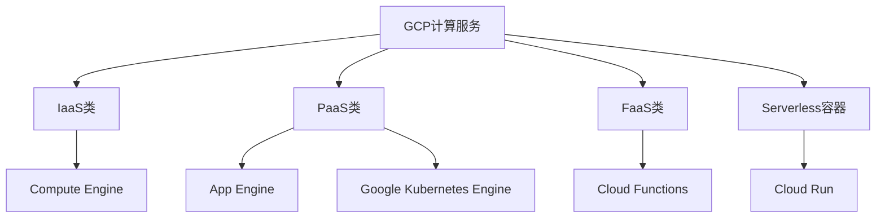
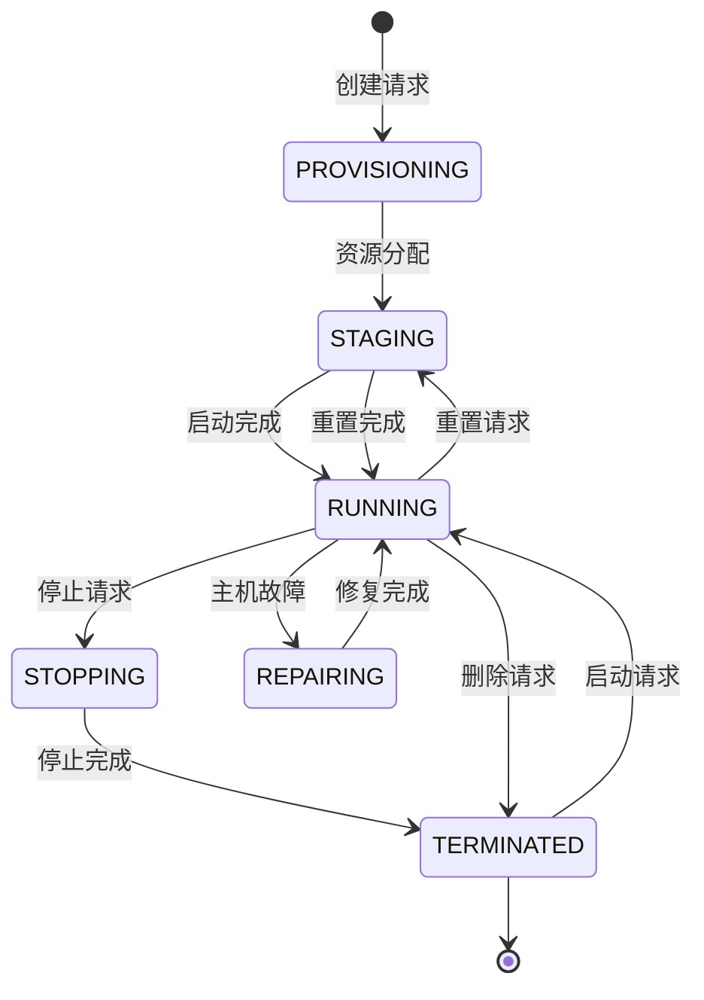
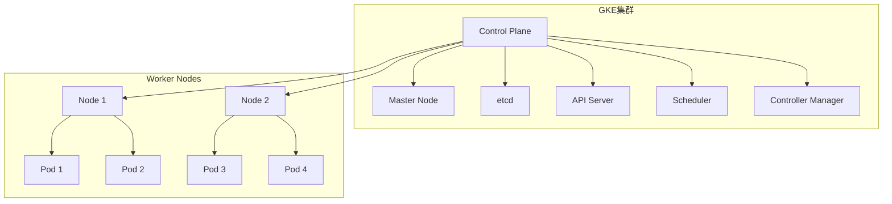
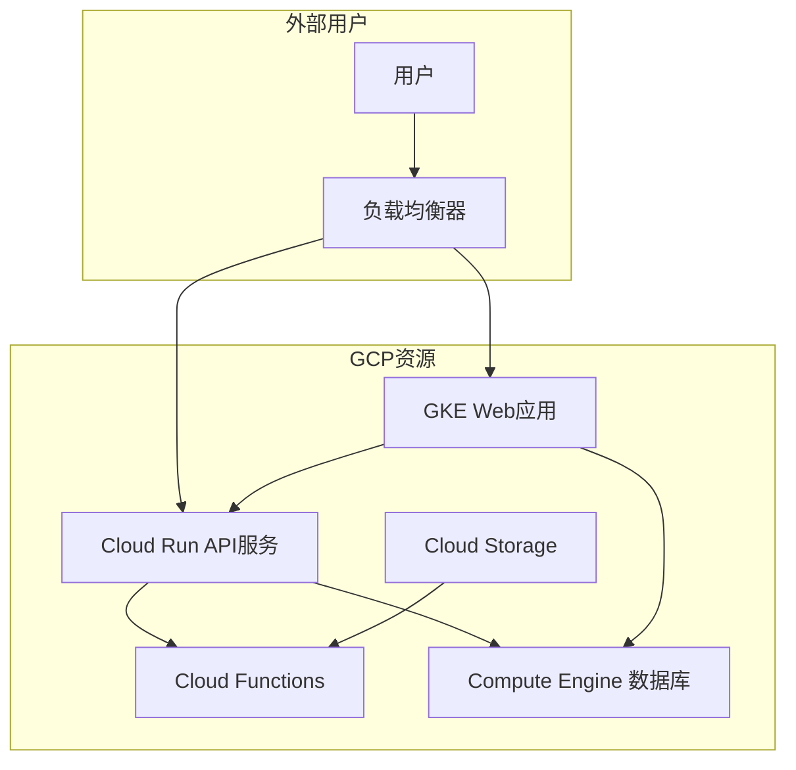

# 第2章：核心计算服务详解

## 📚 本章导学

Google Cloud Platform提供了多种计算服务，满足不同规模和类型的应用需求。本章将深入探讨GCP的核心计算服务，帮助您理解各种服务的特性、使用场景和最佳实践。

### 🎯 学习目标

完成本章学习后，您将能够：

- 理解GCP主要计算服务的特点和应用场景
- 掌握Compute Engine虚拟机的创建、配置和管理
- 学会使用Google Kubernetes Engine(GKE)部署容器化应用
- 了解Cloud Run无服务器容器服务的使用方法
- 掌握Cloud Functions事件驱动函数开发
- 能够根据应用需求选择合适的计算服务

### 📖 本章内容概览

1. [GCP计算服务概览](#1-gcp计算服务概览)
2. [Compute Engine详解](#2-compute-engine详解)
3. [Google Kubernetes Engine(GKE)](#3-google-kubernetes-enginegke)
4. [Cloud Run无服务器容器](#4-cloud-run无服务器容器)
5. [Cloud Functions事件驱动函数](#5-cloud-functions事件驱动函数)
6. [实验：部署多服务应用](#6-实验部署多服务应用)

---

## 1. GCP计算服务概览

### 1.1 计算服务分类

GCP提供了丰富的计算服务，可以根据不同需求选择：



### 1.2 服务选择指南

如何根据应用需求选择合适的计算服务：

| 服务类型 | 控制级别 | 扩展性 | 适用场景 |
|----------|----------|--------|----------|
| **Compute Engine** | 完全控制 | 手动/自动 | 传统应用，需要完全控制基础设施 |
| **Google Kubernetes Engine** | 容器级别 | 自动扩展 | 容器化应用，微服务架构 |
| **App Engine** | 应用级别 | 自动扩展 | Web应用，快速部署，无运维需求 |
| **Cloud Run** | 容器级别 | 自动扩展 | 轻量级容器，事件驱动 |
| **Cloud Functions** | 函数级别 | 完全无服务器 | 事件驱动，轻量级处理逻辑 |

### 1.3 计算服务对比

让我们详细比较各种计算服务的核心特性：

| 特性 | Compute Engine | GKE | Cloud Run | Cloud Functions |
|------|----------------|-----|-----------|-----------------|
| **启动时间** | 分钟级 | 分钟级 | 秒级 | 毫秒级 |
| **缩放方式** | 手动/自动 | 自动 | 自动 | 自动 |
| **计费方式** | 按运行时间 | 按集群和节点 | 按请求和处理时间 | 按调用次数和执行时间 |
| **语言支持** | 任何语言 | 容器化应用 | 容器化应用 | 特定运行时 |
| **访问方式** | SSH, RDP | kubectl, API | HTTP请求 | 事件触发 |
| **适用负载** | 持续运行 | 长期运行 | 间歇性运行 | 短期处理 |

---

## 2. Compute Engine详解

### 2.1 Compute Engine基础

Compute Engine是GCP的基础IaaS服务，提供可定制的虚拟机。

#### 核心特性

- **完全控制**：可以完全控制操作系统和软件配置
- **高性能**：使用Google自研硬件和网络
- **灵活性**：支持多种机器类型和自定义配置
- **全球覆盖**：可在全球任何区域部署虚拟机
- **集成性**：与GCP其他服务深度集成

#### 机器类型

Compute Engine提供多种机器类型以满足不同需求：

| 系列 | 特点 | 适用场景 |
|------|------|----------|
| **E2系列** | 成本优化，AMD处理器 | 通用工作负载，开发测试 |
| **N2系列** | 平衡性能，Intel最新处理器 | 企业应用，数据库 |
| **N2D系列** | 平衡性能，AMD处理器 | 企业应用，数据库 |
| **C2系列** | 计算优化 | 高性能计算，渲染 |
| **M2系列** | 内存优化 | 内存密集型应用，大数据 |
| **A2系列** | 加速器优化 | AI/ML训练，推理 |

#### 预定义vs自定义机器类型

**预定义机器类型**：
- 标准化配置，易于选择
- 常见组合：e2-medium, n1-standard-4
- 性能和价格已优化

**自定义机器类型**：
- 精确匹配需求，避免资源浪费
- 可自定义vCPU数量和内存大小
- 每vCPU必须配至少0.9GB内存（某些系列最低0.6GB）

```bash
# 创建自定义机器类型的实例
gcloud compute instances create custom-vm \
  --machine-type "custom-6-24576" \  # 6 vCPU, 24GB内存
  --zone "us-central1-a"
```

### 2.2 实例生命周期管理

#### 实例状态



#### 实例操作

```bash
# 创建实例
gcloud compute instances create my-instance \
  --image-family debian-11 \
  --image-project debian-cloud \
  --machine-type e2-medium \
  --zone us-central1-a \
  --tags http-server,https-server

# 连接实例
gcloud compute ssh my-instance --zone us-central1-a

# 查看实例列表
gcloud compute instances list

# 停止实例
gcloud compute instances stop my-instance --zone us-central1-a

# 启动实例
gcloud compute instances start my-instance --zone us-central1-a

# 重置实例
gcloud compute instances reset my-instance --zone us-central1-a

# 删除实例
gcloud compute instances delete my-instance --zone us-central1-a
```

### 2.3 实例高级配置

#### 元数据

实例元数据分为两类：

**项目级元数据**：
- 应用于项目中所有实例
- 常用于SSH密钥、默认值等全局配置

**实例级元数据**：
- 仅应用于特定实例
- 常用于启动脚本、配置参数等

```bash
# 创建实例时设置元数据
gcloud compute instances create my-instance \
  --metadata startup-script='#!/bin/bash\napt-get update\napt-get install -y nginx'

# 添加或更新元数据
gcloud compute instances add-metadata my-instance \
  --metadata-from-file startup-script=setup.sh

# 查看实例元数据
gcloud compute instances describe my-instance \
  --format='flattened(metadata)'
```

#### 启动脚本

启动脚本在实例启动时自动执行，可用于：

- 安装软件包
- 配置服务
- 初始化应用数据

```bash
#!/bin/bash
# startup-script.sh

# 更新系统
apt-get update -y

# 安装nginx
apt-get install -y nginx

# 创建自定义页面
cat <<EOF > /var/www/html/index.html
<!DOCTYPE html>
<html>
<head><title>Auto-configured by startup script</title></head>
<body>
<h1>Hello from instance $(hostname)</h1>
<p>IP address: $(curl -s ifconfig.me)</p>
<p>Started at $(date)</p>
</body>
</html>
EOF

# 启动nginx服务
systemctl enable nginx
systemctl start nginx
```

### 2.4 实例组与负载均衡

#### 实例组

实例组是多个实例的集合，便于统一管理：

**非托管实例组**：
- 可以包含不同机器类型的实例
- 手动添加/移除实例

**托管实例组**：
- 实例配置一致
- 自动替换不健康的实例
- 支持自动扩缩容

```bash
# 创建实例模板
gcloud compute instance-templates create webapp-template \
  --machine-type e2-medium \
  --image-family debian-11 \
  --image-project debian-cloud \
  --tags http-server \
  --metadata startup-script='#!/bin/bash\napt-get update\napt-get install -y nginx'

# 创建托管实例组
gcloud compute instance-groups managed create webapp-group \
  --template webapp-template \
  --size 3 \
  --zone us-central1-a

# 设置自动扩缩容
gcloud compute instance-groups managed set-autoscaling webapp-group \
  --zone us-central1-a \
  --max-num-replicas 10 \
  --target-cpu-utilization 0.75
```

#### 负载均衡

GCP提供多种负载均衡器：

| 负载均衡器类型 | 适用场景 |
|---------------|----------|
| **全局外部HTTP(S)负载均衡** | 全球内容分发，HTTP/HTTPS应用 |
| **区域外部HTTP(S)负载均衡** | 区域内容分发，成本优化 |
| **外部TCP/UDP负载均衡** | 非HTTP流量，游戏，IoT |
| **内部TCP/UDP负载均衡** | 内部服务流量分布 |
| **内部HTTP(S)负载均衡** | 内部Web应用，微服务 |

---

## 3. Google Kubernetes Engine(GKE)

### 3.1 Kubernetes基础

Kubernetes是一个开源的容器编排系统，用于自动化部署、扩展和管理容器化应用。

#### 核心概念

- **Pod**：最小的部署单元，包含一个或多个容器
- **Deployment**：管理Pod的副本数量和更新策略
- **Service**：为Pod提供稳定的网络访问接口
- **Namespace**：逻辑隔离不同环境的资源



### 3.2 GKE集群管理

#### 集群类型

GKE提供两种集群类型：

**标准集群**：
- 完全控制底层节点
- 可以自定义节点配置
- 适合需要特定配置的场景

**Autopilot集群**：
- Google管理节点基础设施
- 按Pod使用付费
- 自动优化资源分配和安全性

#### 创建集群

```bash
# 创建标准GKE集群
gcloud container clusters create my-cluster \
  --region us-central1 \
  --num-nodes 3 \
  --node-locations us-central1-a,us-central1-b,us-central1-c

# 创建Autopilot GKE集群
gcloud container clusters create-auto my-autopilot-cluster \
  --region us-central1

# 获取集群凭证
gcloud container clusters get-credentials my-cluster \
  --region us-central1
```

#### 节点池管理

节点池是具有相同配置的节点集合：

```bash
# 创建节点池
gcloud container node-pools create high-memory-pool \
  --cluster my-cluster \
  --region us-central1 \
  --machine-type n2-highmem-4 \
  --num-nodes 2

# 查看节点池
gcloud container node-pools list \
  --cluster my-cluster \
  --region us-central1

# 调整节点池大小
gcloud container clusters resize my-cluster \
  --region us-central1 \
  --node-pool high-memory-pool \
  --num-nodes 3
```

### 3.3 应用部署与管理

#### 部署应用

使用Deployment部署应用：

```yaml
# deployment.yaml
apiVersion: apps/v1
kind: Deployment
metadata:
  name: webapp-deployment
  labels:
    app: webapp
spec:
  replicas: 3
  selector:
    matchLabels:
      app: webapp
  template:
    metadata:
      labels:
        app: webapp
    spec:
      containers:
      - name: webapp
        image: gcr.io/PROJECT_ID/webapp:latest
        ports:
        - containerPort: 8080
        env:
        - name: DATABASE_URL
          valueFrom:
            secretKeyRef:
              name: db-secret
              key: url
        resources:
          requests:
            cpu: 100m
            memory: 128Mi
          limits:
            cpu: 500m
            memory: 512Mi
```

```bash
# 部署应用
kubectl apply -f deployment.yaml

# 查看部署状态
kubectl get deployments
kubectl get pods

# 查看详细信息
kubectl describe deployment webapp-deployment
```

#### 暴露服务

使用Service暴露应用：

```yaml
# service.yaml
apiVersion: v1
kind: Service
metadata:
  name: webapp-service
spec:
  selector:
    app: webapp
  type: ClusterIP  # ClusterIP, NodePort, LoadBalancer
  ports:
    - protocol: TCP
      port: 80
      targetPort: 8080
```

```bash
# 创建服务
kubectl apply -f service.yaml

# 查看服务
kubectl get services

# 查看端点
kubectl get endpoints webapp-service
```

### 3.4 高级功能

#### 自动扩缩容

GKE支持多种自动扩缩容方式：

```yaml
# hpa.yaml - 水平Pod自动扩缩容
apiVersion: autoscaling/v2
kind: HorizontalPodAutoscaler
metadata:
  name: webapp-hpa
spec:
  scaleTargetRef:
    apiVersion: apps/v1
    kind: Deployment
    name: webapp-deployment
  minReplicas: 3
  maxReplicas: 10
  metrics:
  - type: Resource
    resource:
      name: cpu
      target:
        type: Utilization
        averageUtilization: 70
  - type: Resource
    resource:
      name: memory
      target:
        type: Utilization
        averageUtilization: 80
```

```bash
# 应用HPA
kubectl apply -f hpa.yaml

# 查看HPA状态
kubectl get hpa
```

#### 集群自动扩缩容

```bash
# 启用集群自动扩缩容
gcloud container clusters update my-cluster \
  --region us-central1 \
  --enable-autoscaling \
  --min-nodes 1 \
  --max-nodes 10 \
  --autoscaling-profile balanced
```

---

## 4. Cloud Run无服务器容器

### 4.1 Cloud Run基础

Cloud Run是GCP的无服务器容器计算服务，让您能够运行容器而无需管理底层基础设施。

#### 核心特性

- **无服务器**：无需管理服务器或集群
- **自动扩缩容**：从0到N实例自动扩展
- **按使用付费**：仅对实际请求处理时间付费
- **容器友好**：支持任何容器化应用
- **流量管理**：支持逐步流量切换

#### 使用场景

Cloud Run特别适合以下场景：

- **Web API和微服务**
- **事件驱动的后台任务**
- **数据处理和转换**
- **CI/CD流水线中的任务**
- **低流量到中流量的Web应用**

### 4.2 部署Cloud Run服务

#### 容器化应用

创建一个简单的Web应用：

```dockerfile
# Dockerfile
FROM node:18-alpine

WORKDIR /app

COPY package*.json ./
RUN npm ci --only=production

COPY . .

EXPOSE 8080

CMD ["node", "server.js"]
```

```javascript
// server.js
const express = require('express');
const app = express();
const port = process.env.PORT || 8080;

app.get('/', (req, res) => {
  const name = process.env.NAME || 'World';
  res.send(`Hello ${name}!`);
});

app.listen(port, () => {
  console.log(`Server listening on port ${port}`);
});
```

#### 构建和部署

```bash
# 设置项目变量
export PROJECT_ID=$(gcloud config get-value project)
export SERVICE_NAME=helloworld-nodejs

# 构建容器镜像
gcloud builds submit \
  --tag gcr.io/${PROJECT_ID}/${SERVICE_NAME}:v1 \
  .

# 部署到Cloud Run
gcloud run deploy ${SERVICE_NAME} \
  --image gcr.io/${PROJECT_ID}/${SERVICE_NAME}:v1 \
  --platform managed \
  --region us-central1 \
  --allow-unauthenticated \
  --max-instances 10
```

### 4.3 Cloud Run配置

#### 服务配置选项

```bash
# 更新服务配置
gcloud run services update ${SERVICE_NAME} \
  --region us-central1 \
  --memory 512Mi \
  --cpu 1 \
  --timeout 5m \
  --min-instances 0 \
  --max-instances 100 \
  --concurrency 80 \
  --set-env-vars NAME=CloudRun

# 查看服务详情
gcloud run services describe ${SERVICE_NAME} \
  --region us-central1 \
  --format='table(spec.template.spec.containers[0].image, status.url)'
```

#### 环境变量与密钥

```bash
# 设置环境变量
gcloud run services update ${SERVICE_NAME} \
  --region us-central1 \
  --set-env-vars NODE_ENV=production,API_KEY=my-secret-key

# 使用Secret Manager中的密钥
gcloud run services update ${SERVICE_NAME} \
  --region us-central1 \
  --set-secrets=DB_PASSWORD=my-db-secret:latest
```

### 4.4 流量管理

#### 流量分配

Cloud Run支持在多个版本之间分配流量：

```bash
# 部署新版本
gcloud run deploy ${SERVICE_NAME} \
  --image gcr.io/${PROJECT_ID}/${SERVICE_NAME}:v2 \
  --region us-central1 \
  --no-traffic

# 分配流量到新版本
gcloud run services update-traffic ${SERVICE_NAME} \
  --region us-central1 \
  --to-revisions ${SERVICE_NAME}-v1=90,${SERVICE_NAME}-v2=10
```

#### 逐步流量切换

```bash
# 设置自动逐步流量分配
gcloud run services update-traffic ${SERVICE_NAME} \
  --region us-central1 \
  --to-revisions ${SERVICE_NAME}-v2=100 \
  -- gradual
```

---

## 5. Cloud Functions事件驱动函数

### 5.1 Cloud Functions基础

Cloud Functions是GCP的事件驱动、无服务器计算平台，让您能够运行代码而无需管理服务器。

#### 核心特性

- **事件驱动**：响应云服务事件触发
- **自动扩缩容**：根据负载自动调整资源
- **按调用付费**：仅对实际调用次数和执行时间付费
- **语言支持**：Node.js, Python, Go, Java, .NET, Ruby
- **多触发器**：HTTP、Pub/Sub、Firestore、Cloud Storage等

#### 使用场景

Cloud Functions非常适合：

- **Webhooks和HTTP API**
- **数据处理和转换**
- **IoT数据处理**
- **文件上传处理**
- **实时数据库触发器**

### 5.2 函数类型与触发器

#### 函数类型

Cloud Functions支持两种函数类型：

```javascript
// HTTP函数 - 通过HTTP请求触发
exports.httpFunction = (req, res) => {
  res.send('Hello from HTTP Cloud Function!');
};

// 后台函数 - 通过事件触发
exports.backgroundFunction = (event, context) => {
  const message = event.data;
  console.log(`Received message: ${message}`);
  return 'Success';
};
```

#### 常见触发器

| 触发器类型 | 事件示例 | 使用场景 |
|------------|----------|----------|
| **HTTP** | HTTP请求 | Web API，Webhook |
| **Pub/Sub** | 消息发布 | 异步消息处理 |
| **Cloud Storage** | 文件上传/删除 | 图像处理，数据分析 |
| **Firestore** | 文档创建/更新/删除 | 数据同步，业务逻辑 |
| **Firebase Auth** | 用户创建/删除 | 用户管理，欢迎邮件 |

### 5.3 函数开发与部署

#### Node.js示例

```javascript
// index.js
const functions = require('@google-cloud/functions-framework');

// HTTP函数示例
functions.http('helloHttp', (req, res) => {
  const name = req.query.name || 'World';
  res.send(`Hello ${name}!`);
});

// Pub/Sub函数示例
functions.cloudEvent('helloPubSub', (cloudEvent) => {
  const base64name = cloudEvent.data.message.data;
  const name = Buffer.from(base64name, 'base64').toString();
  console.log(`Hello ${name}!`);
});

// Cloud Storage函数示例
functions.cloudEvent('helloGCS', (cloudEvent) => {
  const file = cloudEvent.subject;
  console.log(`File created: ${file}`);
});
```

```json
// package.json
{
  "name": "gcf-hello",
  "version": "0.0.1",
  "dependencies": {
    "@google-cloud/functions-framework": "^3.0.0"
  }
}
```

#### 部署函数

```bash
# 部署HTTP函数
gcloud functions deploy helloHttp \
  --runtime nodejs18 \
  --trigger-http \
  --allow-unauthenticated \
  --region us-central1

# 部署Pub/Sub函数
gcloud functions deploy helloPubSub \
  --runtime nodejs18 \
  --trigger-topic my-topic \
  --region us-central1

# 部署Cloud Storage函数
gcloud functions deploy helloGCS \
  --runtime nodejs18 \
  --trigger-resource my-bucket \
  --trigger-event google.storage.object.finalize \
  --region us-central1
```

### 5.4 高级功能

#### 环境配置

```bash
# 部署时设置环境变量
gcloud functions deploy helloHttp \
  --runtime nodejs18 \
  --trigger-http \
  --set-env-vars NODE_ENV=production,API_KEY=my-key \
  --region us-central1

# 使用Secret Manager中的密钥
gcloud functions deploy helloHttp \
  --runtime nodejs18 \
  --trigger-http \
  --set-secrets DB_PASSWORD=my-db-secret:latest \
  --region us-central1
```

#### 资源配置

```bash
# 部署时配置资源
gcloud functions deploy helloHttp \
  --runtime nodejs18 \
  --trigger-http \
  --memory 512MB \
  --timeout 60s \
  --max-instances 10 \
  --region us-central1
```

---

## 6. 实验：部署多服务应用

让我们通过一个综合实验，实践本章学习的多种计算服务。

### 实验目标

通过本实验，您将：

1. 使用Compute Engine部署数据库服务器
2. 使用GKE部署容器化Web应用
3. 使用Cloud Run部署API服务
4. 使用Cloud Functions处理文件上传事件
5. 配置服务间通信和负载均衡

### 实验架构

我们将部署一个简单的博客系统，包含以下组件：



### 前提条件

- 已创建GCP项目和计费账户
- 已安装gcloud CLI和kubectl
- 已启用必要的GCP API

### 实验步骤

#### 步骤1：创建数据库服务器

使用Compute Engine创建PostgreSQL数据库服务器：

```bash
# 设置变量
export PROJECT_ID=$(gcloud config get-value project)
export ZONE=us-central1-a

# 创建数据库实例
gcloud compute instances create blog-db \
  --machine-type e2-medium \
  --image-family debian-11 \
  --image-project debian-cloud \
  --tags db-server \
  --zone ${ZONE} \
  --metadata startup-script='#!/bin/bash
    apt-get update
    apt-get install -y postgresql postgresql-contrib
    sudo -u postgres createdb blogdb
    sudo -u postgres psql -c "CREATE USER bloguser WITH PASSWORD \\"blogpassword\\";"
    sudo -u postgres psql -c "GRANT ALL PRIVILEGES ON DATABASE blogdb TO bloguser;"
    echo "host all all 0.0.0.0/0 md5" >> /etc/postgresql/13/main/pg_hba.conf
    echo "listen_addresses = '\''*'\''" >> /etc/postgresql/13/main/postgresql.conf
    systemctl restart postgresql
  '

# 创建防火墙规则
gcloud compute firewall-rules create allow-db \
  --allow tcp:5432 \
  --source-tags web-server \
  --description "Allow PostgreSQL access from web servers"

# 获取数据库实例IP
export DB_IP=$(gcloud compute instances describe blog-db \
  --zone ${ZONE} \
  --format='get(networkInterfaces[0].networkIP)')

echo "Database IP: ${DB_IP}"
```

#### 步骤2：创建GKE集群并部署Web应用

```bash
# 创建GKE集群
gcloud container clusters create blog-cluster \
  --region us-central1 \
  --num-nodes 2

# 获取集群凭证
gcloud container clusters get-credentials blog-cluster \
  --region us-central1

# 创建命名空间
kubectl create namespace blog

# 创建数据库连接配置
cat <<EOF > db-config.yaml
apiVersion: v1
kind: ConfigMap
metadata:
  name: db-config
  namespace: blog
data:
  DB_HOST: "${DB_IP}"
  DB_NAME: "blogdb"
  DB_USER: "bloguser"
EOF

kubectl apply -f db-config.yaml

# 创建数据库密码Secret
kubectl create secret generic db-secret \
  --from-literal=DB_PASSWORD="blogpassword" \
  --namespace=blog
```

创建Web应用Deployment：

```yaml
# web-app.yaml
apiVersion: apps/v1
kind: Deployment
metadata:
  name: blog-webapp
  namespace: blog
  labels:
    app: blog-webapp
spec:
  replicas: 2
  selector:
    matchLabels:
      app: blog-webapp
  template:
    metadata:
      labels:
        app: blog-webapp
    spec:
      containers:
      - name: blog-webapp
        image: gcr.io/${PROJECT_ID}/blog-webapp:v1
        ports:
        - containerPort: 8080
        envFrom:
        - configMapRef:
            name: db-config
        - secretRef:
            name: db-secret
        resources:
          requests:
            cpu: 100m
            memory: 128Mi
          limits:
            cpu: 500m
            memory: 512Mi
---
apiVersion: v1
kind: Service
metadata:
  name: blog-webapp-service
  namespace: blog
spec:
  selector:
    app: blog-webapp
  type: ClusterIP
  ports:
  - protocol: TCP
    port: 80
    targetPort: 8080
EOF

kubectl apply -f web-app.yaml
```

#### 步骤3：创建Cloud Run API服务

```bash
# 创建API服务目录
mkdir -p blog-api
cd blog-api

# 创建简单API应用
cat <<EOF > index.js
const express = require('express');
const { Pool } = require('pg');
const app = express();
app.use(express.json());

const pool = new Pool({
  host: process.env.DB_HOST,
  database: process.env.DB_NAME,
  user: process.env.DB_USER,
  password: process.env.DB_PASSWORD,
  port: 5432,
});

app.get('/api/posts', async (req, res) => {
  try {
    const result = await pool.query('SELECT * FROM posts ORDER BY created_at DESC');
    res.json(result.rows);
  } catch (err) {
    console.error(err);
    res.status(500).json({ error: 'Database error' });
  }
});

app.post('/api/posts', async (req, res) => {
  const { title, content } = req.body;
  try {
    const result = await pool.query(
      'INSERT INTO posts (title, content) VALUES ($1, $2) RETURNING *',
      [title, content]
    );
    res.status(201).json(result.rows[0]);
  } catch (err) {
    console.error(err);
    res.status(500).json({ error: 'Database error' });
  }
});

const port = process.env.PORT || 8080;
app.listen(port, () => {
  console.log(\`API server listening on port \${port}\`);
});
EOF

cat <<EOF > package.json
{
  "name": "blog-api",
  "version": "1.0.0",
  "dependencies": {
    "express": "^4.17.1",
    "pg": "^8.7.1"
  }
}
EOF

cat <<EOF > Dockerfile
FROM node:18-alpine
WORKDIR /app
COPY package*.json ./
RUN npm install
COPY . .
EXPOSE 8080
CMD ["node", "index.js"]
EOF

# 构建和部署
gcloud builds submit \
  --tag gcr.io/${PROJECT_ID}/blog-api:v1 .

gcloud run deploy blog-api \
  --image gcr.io/${PROJECT_ID}/blog-api:v1 \
  --platform managed \
  --region us-central1 \
  --allow-unauthenticated \
  --set-env-vars DB_HOST=${DB_IP},DB_NAME=blogdb,DB_USER=bloguser \
  --set-secrets DB_PASSWORD=db-secret:latest
```

#### 步骤4：创建Cloud Functions处理文件上传

```bash
# 创建函数目录
mkdir -p image-processor
cd image-processor

cat <<EOF > index.js
const { Storage } = require('@google-cloud/storage');
const sharp = require('sharp');
const storage = new Storage();

exports.processImage = async (event, context) => {
  const filename = event.name;
  const bucketName = event.bucket;
  const bucket = storage.bucket(bucketName);
  
  // 检查是否是图片文件
  if (!filename.match(/\.(jpg|jpeg|png|gif)$/i)) {
    console.log('Not an image file, skipping');
    return;
  }
  
  const tempFilePath = `/tmp/${filename}`;
  const thumbnailFilename = `thumbnails/${filename}`;
  
  // 下载原文件
  await bucket.file(filename).download({destination: tempFilePath});
  
  // 生成缩略图
  await sharp(tempFilePath)
    .resize(300, 300)
    .toBuffer()
    .then(buffer => {
      return bucket.file(thumbnailFilename).save(buffer);
    });
  
  console.log(`Thumbnail created: ${thumbnailFilename}`);
};
EOF

cat <<EOF > package.json
{
  "name": "image-processor",
  "version": "1.0.0",
  "dependencies": {
    "@google-cloud/storage": "^5.8.5",
    "sharp": "^0.29.3"
  }
}
EOF

# 创建存储桶
gsutil mb gs://${PROJECT_ID}-blog-images

# 部署函数
gcloud functions deploy processImage \
  --runtime nodejs18 \
  --trigger-resource ${PROJECT_ID}-blog-images \
  --trigger-event google.storage.object.finalize \
  --region us-central1
```

#### 步骤5：创建全局负载均衡器

```bash
# 获取Cloud Run服务URL
API_URL=$(gcloud run services describe blog-api \
  --region us-central1 \
  --format='value(status.url)')

# 创建负载均衡器配置
cat <<EOF > lb-config.yaml
apiVersion: v1
kind: Service
metadata:
  name: blog-frontend-lb
  namespace: blog
  annotations:
    cloud.google.com/load-balancer-type: "Global"
spec:
  selector:
    app: blog-webapp
  type: LoadBalancer
  ports:
  - port: 80
    targetPort: 8080
---
apiVersion: networking.gke.io/v1beta1
kind: FrontendConfig
metadata:
  name: blog-frontend-config
  namespace: blog
spec:
  redirectToHttps:
    enabled: true
---
apiVersion: networking.gke.io/v1
kind: ManagedCertificate
metadata:
  name: blog-ssl-cert
  namespace: blog
spec:
  domains:
    - blog.example.com
---
apiVersion: networking.k8s.io/v1
kind: Ingress
metadata:
  name: blog-ingress
  namespace: blog
  annotations:
    kubernetes.io/ingress.global-static-ip-name: "blog-static-ip"
    networking.gke.io/managed-certificates: "blog-ssl-cert"
    networking.gke.io/v1beta1.FrontendConfig: "blog-frontend-config"
spec:
  rules:
  - host: blog.example.com
    http:
      paths:
      - path: /api/*
        backend:
          serviceName: blog-api
          servicePort: 80
      - path: /*
        backend:
          serviceName: blog-frontend-lb
          servicePort: 80
EOF

kubectl apply -f lb-config.yaml
```

#### 步骤6：测试应用

```bash
# 检查所有服务状态
kubectl get pods -n blog
kubectl get services -n blog
gcloud run services describe blog-api --region us-central1

# 获取负载均衡器IP
kubectl get ingress blog-ingress -n blog -o yaml

# 测试API
curl ${API_URL}/api/posts

# 上传图片测试处理函数
echo "Hello World" > test.txt
gsutil cp test.txt gs://${PROJECT_ID}-blog-images/
gsutil ls gs://${PROJECT_ID}-blog-images/thumbnails/
```

#### 步骤7：清理资源

```bash
# 删除GKE资源
kubectl delete namespace blog
gcloud container clusters delete blog-cluster --region us-central1

# 删除Cloud Run服务
gcloud run services delete blog-api --region us-central1

# 删除Cloud Functions
gcloud functions delete processImage --region us-central1

# 删除存储桶
gsutil rm -r gs://${PROJECT_ID}-blog-images

# 删除Compute Engine实例
gcloud compute instances delete blog-db --zone ${ZONE}
gcloud compute firewall-rules delete allow-db
```

### 实验总结

通过这个综合实验，您已经：

1. **使用Compute Engine** 创建了数据库服务器
2. **使用GKE** 部署了容器化Web应用
3. **使用Cloud Run** 部署了API服务
4. **使用Cloud Functions** 创建了事件驱动的图片处理服务
5. **配置了负载均衡** 实现服务间通信

这个实验展示了GCP各种计算服务如何协同工作，构建完整的应用架构。

---

## 📚 本章小结

本章我们学习了：

1. **GCP计算服务概览**：各种服务的特点和适用场景
2. **Compute Engine详解**：虚拟机创建、配置和管理
3. **Google Kubernetes Engine(GKE)**：容器编排和应用部署
4. **Cloud Run无服务器容器**：无服务器容器化应用
5. **Cloud Functions事件驱动函数**：事件驱动代码执行
6. **综合实验**：多服务架构实战

### 🎯 关键知识点回顾

- **Compute Engine** 提供完全控制的虚拟机，适合需要自定义配置的场景
- **GKE** 是托管Kubernetes服务，适合容器化应用和微服务架构
- **Cloud Run** 是无服务器容器服务，适合轻量级容器和事件驱动应用
- **Cloud Functions** 是事件驱动函数服务，适合简单业务逻辑和数据处理
- **选择计算服务** 需要考虑应用类型、运维需求、扩展性和成本等因素

### 🚀 下一步

完成本章学习后，您可以：

1. 深入实践各种计算服务的高级功能
2. 探索服务间的集成和通信模式
3. 继续学习下一章"存储与数据库服务"
4. 尝试完成[基本计算示例](./code/basic-compute/)、[GKE集群示例](./code/gke-cluster/)和[Cloud Run应用示例](./code/cloud-run-app/)中的更多实验

---

## 📖 延伸阅读

- [Compute Engine 文档](https://cloud.google.com/compute/docs)
- [Google Kubernetes Engine 文档](https://cloud.google.com/kubernetes-engine/docs)
- [Cloud Run 文档](https://cloud.google.com/run/docs)
- [Cloud Functions 文档](https://cloud.google.com/functions/docs)
- [GCP 计算产品选择指南](https://cloud.google.com/products/compute)

---

**💡 提示：在实际项目中，往往需要结合多种计算服务。理解各服务的优缺点，根据具体需求选择最适合的服务，是云架构设计的关键。**