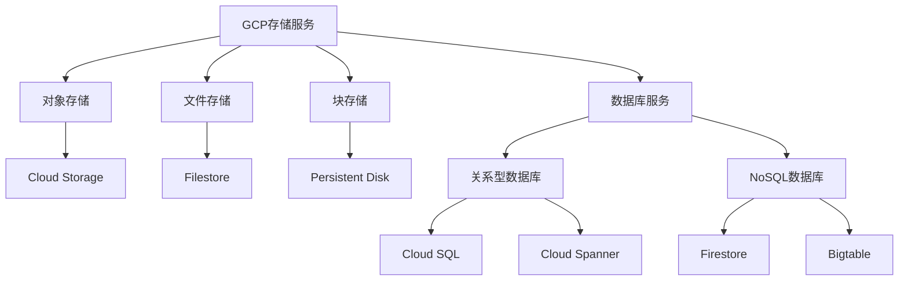
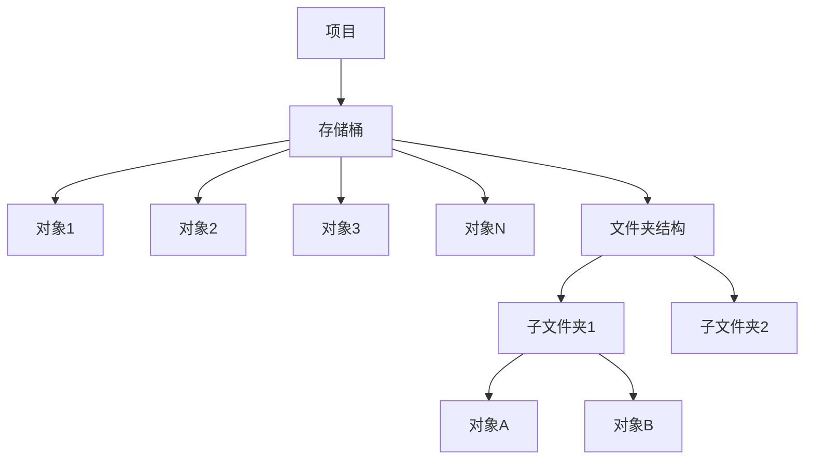
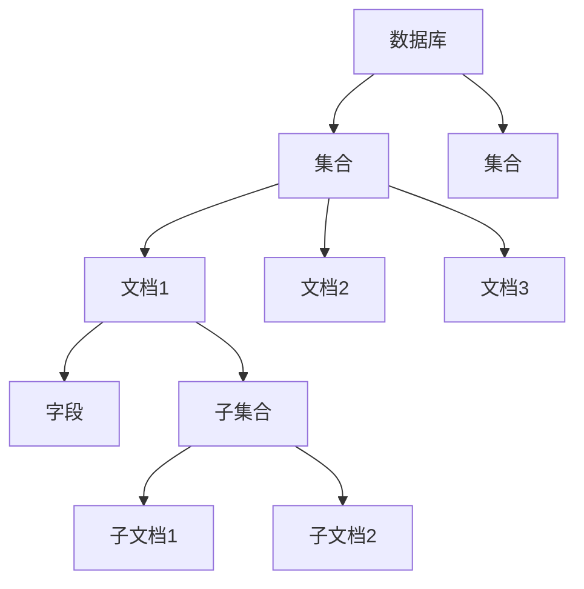
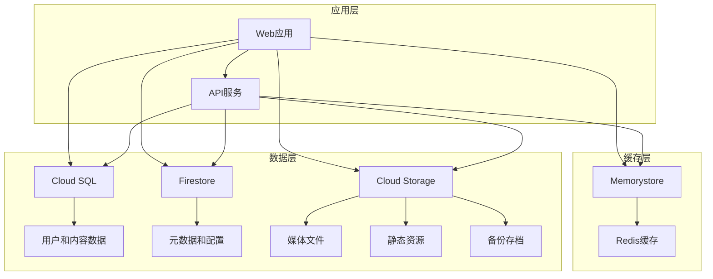

# 第3章：存储与数据库服务

## 📚 本章导学

数据和存储是任何应用程序的核心组件。Google Cloud Platform提供了丰富的存储和数据库服务，满足不同规模、性能和一致性需求的应用场景。本章将详细介绍GCP的存储和数据库服务，帮助您选择最适合的解决方案。

### 🎯 学习目标

完成本章学习后，您将能够：

- 理解GCP存储服务的分类和适用场景
- 掌握Cloud Storage的使用方法和最佳实践
- 学会选择和使用合适的GCP数据库服务
- 掌握数据迁移和备份恢复策略
- 了解数据安全性和合规性管理
- 能够根据应用需求设计合理的存储架构

### 📖 本章内容概览

1. [GCP存储服务概览](#1-gcp存储服务概览)
2. [Cloud Storage详解](#2-cloud-storage详解)
3. [Cloud SQL与Cloud Spanner](#3-cloud-sql与cloud-spanner)
4. [NoSQL与大数据存储](#4-nosql与大数据存储)
5. [数据迁移与管理](#5-数据迁移与管理)
6. [实验：构建多层数据架构](#6-实验构建多层数据架构)

---

## 1. GCP存储服务概览

### 1.1 存储服务分类

GCP提供了多种存储服务，可以根据数据类型、访问模式、一致性需求等因素进行选择：



### 1.2 存储选择指南

如何根据不同需求选择合适的存储服务：

| 服务类型 | 数据模型 | 适用场景 | 特性 |
|----------|----------|----------|------|
| **Cloud Storage** | 对象存储 | 非结构化数据，内容分发 | 高可用性，全球分发 |
| **Persistent Disk** | 块存储 | 虚拟机存储，数据库存储 | 低延迟，高性能 |
| **Filestore** | 文件存储 | 共享文件系统，应用数据 | NFS协议，易于集成 |
| **Cloud SQL** | 关系型数据库 | 事务性数据，传统应用 | MySQL, PostgreSQL, SQL Server |
| **Cloud Spanner** | 分布式关系型 | 大规模事务性数据 | 全球一致性，水平扩展 |
| **Firestore** | 文档数据库 | 实时同步，移动应用 | 实时监听，离线支持 |
| **Bigtable** | 宽列存储 | 大规模时序数据 | 高吞吐量，低延迟 |

### 1.3 性能与成本考虑

选择存储服务时需要平衡性能和成本：

| 存储类别 | 性能 | 成本 | 适用场景 |
|----------|------|------|----------|
| **高频访问存储** | 最高 | 最高 | 频繁访问的活跃数据 |
| **标准存储** | 高 | 中等 | 常规访问数据 |
| **近线存储** | 中等 | 低 | 不频繁访问数据 |
| **冷线存储** | 低 | 很低 | 归档数据，偶尔访问 |
| **归档存储** | 最低 | 最低 | 长期归档，极少访问 |

---

## 2. Cloud Storage详解

### 2.1 Cloud Storage基础

Cloud Storage是GCP的对象存储服务，适用于存储和访问任何类型的数据。

#### 核心特性

- **高可用性**：99.999999999%(11个9)持久性保证
- **全球扩展**：可在全球多个位置存储数据
- **多种存储类别**：根据访问频率优化成本
- **统一命名空间**：全球唯一的对象名称
- **强大的安全性**：加密、身份验证、访问控制

#### 存储桶与对象

Cloud Storage的基本数据模型：



**存储桶**：
- 存储桶是Cloud Storage的基本容器
- 全局唯一命名
- 包含对象和文件夹结构

**对象**：
- 对象是存储的基本单元
- 包含数据和元数据
- 大小可从几字节到5TB

### 2.2 存储类别

Cloud Storage提供多种存储类别以满足不同需求：

#### 标准存储(Standard)

- **适用场景**：频繁访问的数据
- **特点**：低延迟，高可用性
- **价格**：较高
- **使用案例**：Web内容、媒体流、交互式工作负载

```bash
# 创建标准存储桶
gsutil mb -l us-central1 -p your-project-id gs://standard-bucket
```

#### 近线存储(Nearline)

- **适用场景**：每月访问少于一次的数据
- **特点**：低存储成本，访问费用稍高
- **使用案例**：数据备份、长期归档

```bash
# 创建近线存储桶
gsutil mb -l us-central1 -p your-project-id -c nearline gs://nearline-bucket
```

#### 冷线存储(Coldline)

- **适用场景**：每季度访问少于一次的数据
- **特点**：更低的存储成本，更高的访问费用
- **使用案例**：灾难恢复、合规性数据存储

#### 归档存储(Archive)

- **适用场景**：每年访问少于一次的数据
- **特点**：最低的存储成本，最高的访问费用和恢复时间
- **使用案例**：长期数字保存、合规性归档

### 2.3 存储位置和访问控制

#### 存储位置类型

Cloud Storage支持多种存储位置：

| 位置类型 | 描述 | 示例 |
|----------|------|------|
| **多区域** | 数据在多个地理位置冗余存储 | `us`, `europe`, `asia` |
| **双区域** | 数据在两个特定区域冗余存储 | `us-central1`, `europe-west1` |
| **单区域** | 数据在单个区域存储 | `us-central1`, `europe-west1` |
| **区域级** | 类似单区域，但具有不同的持久性保证 | `us-central1` |

```bash
# 创建不同位置的存储桶
gsutil mb -l us -p your-project-id gs://multi-regional-bucket
gsutil mb -l US-CENTRAL1 -p your-project-id gs://regional-bucket
gsutil mb -l NAM4 -p your-project-id gs://dual-regional-bucket
```

#### 访问控制模型

Cloud Storage提供两种访问控制模型：

**统一资源级访问**（IAM）：
- 基于IAM权限的访问控制
- 推荐的新方式
- 提供更细粒度的权限控制

**细粒度访问控制**（ACL）：
- 基于对象的访问控制列表
- 传统方式
- 更适合需要精细对象级控制的场景

```bash
# 使用IAM权限授予访问权限
gsutil iam ch user:example@example.com:objectViewer gs://your-bucket

# 使用ACL授予访问权限
gsutil acl ch -u example@example.com:R gs://your-bucket
```

### 2.4 高级功能

#### 生命周期管理

自动管理对象生命周期，优化成本：

```json
{
  "lifecycle": {
    "rule": [
      {
        "action": {"type": "Delete"},
        "condition": {
          "age": 365,
          "isLive": true
        }
      },
      {
        "action": {"type": "SetStorageClass", "storageClass": "COLDLINE"},
        "condition": {
          "age": 90,
          "matchesStorageClass": ["STANDARD", "NEARLINE"]
        }
      }
    ]
  }
}
```

```bash
# 应用生命周期策略
gsutil lifecycle set lifecycle.json gs://your-bucket
```

#### 对象版本控制

启用对象版本控制以保护数据免受意外删除或覆盖：

```bash
# 启用版本控制
gsutil versioning set on gs://your-bucket

# 禁用版本控制
gsutil versioning set off gs://your-bucket
```

#### 对象锁定

实现不可变存储（WORM）以满足合规性要求：

```bash
# 启用对象锁定（无法禁用）
gsutil retention set 30d gs://your-bucket

# 设置事件保留时间
gsutil retention event set gs://your-bucket/object-name
```

---

## 3. Cloud SQL与Cloud Spanner

### 3.1 Cloud SQL详解

Cloud SQL是GCP的托管关系型数据库服务，支持MySQL、PostgreSQL和SQL Server。

#### 核心特性

- **完全托管**：自动备份、补丁、高可用性配置
- **高可用性**：主从复制，自动故障转移
- **自动备份**：时间点恢复能力
- **扩展性**：垂直扩展和只读副本
- **安全性**：网络隔离、数据加密、访问控制

#### 数据库引擎支持

| 引擎 | 版本支持 | 适用场景 |
|------|----------|----------|
| **MySQL** | 5.6, 5.7, 8.0 | Web应用，通用数据存储 |
| **PostgreSQL** | 9.6, 10, 11, 12, 13, 14 | 高级查询，数据分析 |
| **SQL Server** | 2017, 2019 | 企业应用，Windows生态 |

#### 创建Cloud SQL实例

```bash
# 创建MySQL实例
gcloud sql instances create my-mysql-instance \
  --database-version=MYSQL_8_0 \
  --tier=db-n1-standard-2 \
  --region=us-central1 \
  --storage-size=100GB \
  --storage-type=SSD \
  --backup-start-time=02:00

# 创建PostgreSQL实例
gcloud sql instances create my-postgres-instance \
  --database-version=POSTGRES_14 \
  --tier=db-n1-standard-2 \
  --region=us-central1 \
  --storage-size=100GB \
  --storage-type=SSD \
  --backup-start-time=03:00
```

#### 高可用性配置

```bash
# 启用高可用性（创建实例时）
gcloud sql instances create my-ha-instance \
  --tier=db-n1-standard-2 \
  --region=us-central1 \
  --availability-type=REGIONAL

# 现有实例启用高可用性
gcloud sql instances patch my-instance \
  --availability-type=REGIONAL
```

#### 只读副本

```bash
# 创建只读副本
gcloud sql instances create my-replica \
  --master-instance-name=my-mysql-instance \
  --tier=db-n1-standard-2 \
  --region=us-central1

# 列出实例及其副本
gcloud sql instances list --filter='masterInstanceName=my-mysql-instance'
```

### 3.2 Cloud Spanner详解

Cloud Spanner是GCP的全球分布式关系型数据库，提供强一致性和水平扩展能力。

#### 核心特性

- **全球分布**：数据可在全球多个区域复制
- **强一致性**：外部一致性保证
- **水平扩展**：自动分片和负载均衡
- **SQL接口**：熟悉的关系型数据库接口
- **ACID事务**：完整的事务支持

#### 使用场景

Cloud Spanner特别适合：

- 全球分布式应用
- 金融交易系统
- 实时分析工作负载
- 需要强一致性的高并发应用

#### 创建Cloud Spanner实例

```bash
# 创建Spanner实例
gcloud spanner instances create my-spanner-instance \
  --config=regional-us-central1 \
  --description="My Spanner Instance" \
  --nodes=3

# 创建数据库
gcloud spanner databases create my-database \
  --instance=my-spanner-instance

# 创建表
gcloud spanner databases ddl update my-database \
  --instance=my-spanner-instance \
  --ddl="CREATE TABLE Singers (
    SingerId INT64 NOT NULL,
    FirstName STRING(1024),
    LastName STRING(1024),
    SingerInfo BYTES(MAX),
  ) PRIMARY KEY (SingerId)"
```

#### 数据操作

```bash
# 插入数据
gcloud spanner rows insert \
  --instance=my-spanner-instance \
  --database=my-database \
  --table=Singers \
  --data='SingerId=1,FirstName=Marc,LastName=Richards'

# 查询数据
gcloud spanner databases execute-sql my-database \
  --instance=my-spanner-instance \
  --sql="SELECT * FROM Singers WHERE SingerId = 1"
```

---

## 4. NoSQL与大数据存储

### 4.1 Firestore详解

Firestore是GCP的NoSQL文档数据库，专为移动和Web应用设计，提供实时数据同步和离线支持。

#### 核心特性

- **实时监听**：数据变更自动推送给客户端
- **离线支持**：应用可在离线状态下继续工作
- **自动扩展**：无需管理服务器或分片
- **安全规则**：细粒度的数据访问控制
- **多区域复制**：数据在多个区域自动复制

#### 数据模型

Firestore使用文档-集合数据模型：



#### 创建和配置Firestore

```bash
# 创建Firestore数据库
gcloud firestore databases create \
  --region=us-central1 \
  --type=Native

# 设置索引
cat > firestore.indexes.json <<EOF
{
  "indexes": [
    {
      "collectionGroup": "posts",
      "queryScope": "COLLECTION",
      "fields": [
        {
          "fieldPath": "author",
          "order": "ASCENDING"
        },
        {
          "fieldPath": "timestamp",
          "order": "DESCENDING"
        }
      ]
    }
  ],
  "fieldOverrides": []
}
EOF

gcloud firestore indexes composite create \
  --database=your-database-id \
  --collection-group=posts \
  --field-config=field=author,order=ASCENDING \
  --field-config=field=timestamp,order=DESCENDING
```

### 4.2 Bigtable详解

Bigtable是GCP的宽列NoSQL数据库，专为大规模数据设计，提供高吞吐量和低延迟。

#### 核心特性

- **高性能**：低延迟读写操作
- **大规模**：PB级数据存储能力
- **高可用性**：自动复制和故障转移
- **灵活的Schema**：动态列族设计
- **Hadoop兼容**：与Hadoop生态系统集成

#### 使用场景

Bigtable特别适合：

- 时间序列数据
- IoT数据分析
- 金融数据分析
- 实时分析系统
- 地理空间数据

#### 创建Bigtable实例

```bash
# 创建Bigtable实例
gcloud bigtable instances create my-bt-instance \
  --cluster=bt-cluster \
  --cluster-zone=us-central1-a \
  --display-name="My Bigtable Instance" \
  --instance-type=DEVELOPMENT \
  --description="Development instance"

# 创建表
cbt -instance=my-bt-instance createtable my-table

# 创建列族
cbt -instance=my-bt-instance createfamily my-table cf1
cbt -instance=my-bt-instance createfamily my-table cf2
```

#### 数据操作

```bash
# 插入数据
cbt -instance=my-bt-instance set my-table r1 cf1:col1=value1
cbt -instance=my-bt-instance set my-table r1 cf2:col2=value2

# 读取数据
cbt -instance=my-bt-instance read my-table

# 删除数据
cbt -instance=my-bt-instance deleterow my-table r1
```

---

## 5. 数据迁移与管理

### 5.1 数据迁移策略

将数据迁移到GCP时，需要根据数据类型、大小和迁移窗口选择合适的策略：

#### 迁移工具选择

| 工具 | 适用场景 | 特点 |
|------|----------|------|
| **Storage Transfer Service** | 对象存储迁移 | 定期传输，自动调度 |
| **Transfer Appliance** | 大规模物理迁移 | PB级数据，离线传输 |
| **Database Migration Service** | 数据库迁移 | 持续复制，最小停机时间 |
| **gsutil** | 简单对象迁移 | 命令行工具，适合小规模数据 |
| **Dataflow** | 复杂数据转换 | ETL处理，数据转换 |

#### 迁移步骤

1. **评估阶段**
   - 识别数据类型和大小
   - 评估网络带宽和迁移时间
   - 选择合适的迁移工具
   - 规划迁移窗口和回滚策略

2. **准备阶段**
   - 设置源和目标存储
   - 配置网络连接
   - 测试小规模迁移
   - 准备监控和告警

3. **执行阶段**
   - 开始初始数据传输
   - 监控传输进度和错误
   - 执行增量同步
   - 执行最终切换

4. **验证阶段**
   - 验证数据完整性和一致性
   - 测试应用程序功能
   - 监控性能指标
   - 清理旧环境资源

### 5.2 备份与恢复

#### Cloud Storage备份

```bash
# 创建备份脚本
cat > backup.sh <<EOF
#!/bin/bash
DATE=\$(date +%Y%m%d)
BUCKET=gs://my-backup-bucket
SOURCE_DIR=/path/to/important/data

# 创建压缩备份
tar -czf /tmp/backup-\${DATE}.tar.gz \$SOURCE_DIR

# 上传到Cloud Storage
gsutil cp /tmp/backup-\${DATE}.tar.gz \$BUCKET/backups/

# 设置生命周期规则（保留30天）
gsutil lifecycle set lifecycle.json \$BUCKET

echo "Backup completed: \$BUCKET/backups/backup-\${DATE}.tar.gz"
EOF

chmod +x backup.sh

# 创建生命周期配置
cat > lifecycle.json <<EOF
{
  "rule": [
    {
      "action": {"type": "Delete"},
      "condition": {
        "age": 30
      }
    }
  ]
}
EOF
```

#### Cloud SQL备份

```bash
# 创建按需备份
gcloud sql backups create \
  --instance=my-mysql-instance \
  --description="Manual backup before deployment"

# 列出备份
gcloud sql backups list --instance=my-mysql-instance

# 恢复备份
gcloud sql backups restore BACKUP_ID \
  --restore-instance=my-restored-instance
```

### 5.3 数据安全管理

#### 加密策略

```bash
# 创建客户管理的加密密钥
gcloud kms keyrings create my-key-ring --location=us-central1
gcloud kms keys create my-key --keyring=my-key-ring \
  --location=us-central1 --purpose=encryption

# 使用客户管理的密钥创建存储桶
gsutil kms encryption -k projects/my-project/locations/us-central1/keyRings/my-key-ring/cryptoKeys/my-key \
  gs://my-encrypted-bucket
```

#### 访问控制

```bash
# 设置IAM策略
gsutil iam ch serviceAccount:my-service-account@my-project.iam.gserviceaccount.com:objectViewer \
  gs://my-sensitive-data-bucket

# 设置统一的存储桶策略
cat > bucket-policy.json <<EOF
{
  "bindings": [
    {
      "role": "roles/storage.objectViewer",
      "members": [
        "serviceAccount:data-reader@my-project.iam.gserviceaccount.com"
      ]
    },
    {
      "role": "roles/storage.objectAdmin",
      "members": [
        "serviceAccount:data-admin@my-project.iam.gserviceaccount.com"
      ]
    }
  ]
}
EOF

gsutil iam set bucket-policy.json gs://my-secured-bucket
```

---

## 6. 实验：构建多层数据架构

让我们通过一个综合实验，实践本章学习的存储和数据库服务。

### 实验目标

通过本实验，您将：

1. 使用Cloud Storage构建多层级存储系统
2. 部署Cloud SQL数据库并配置高可用性
3. 使用Firestore存储应用元数据
4. 设置自动数据备份和生命周期管理
5. 配置数据访问控制和安全性

### 实验架构

我们将构建一个博客系统的多层数据架构：



### 前提条件

- 已创建GCP项目和计费账户
- 已启用必要的GCP API
- 已安装gcloud CLI

### 实验步骤

#### 步骤1：创建Cloud Storage多层级存储

```bash
# 设置变量
export PROJECT_ID=$(gcloud config get-value project)

# 创建标准存储桶（用于频繁访问的媒体文件）
gsutil mb -l us-central1 -p ${PROJECT_ID} gs://blog-media-standard

# 创建近线存储桶（用于不频繁访问的历史数据）
gsutil mb -l us-central1 -p ${PROJECT_ID} -c nearline gs://blog-media-nearline

# 创建冷线存储桶（用于长期归档数据）
gsutil mb -l us-central1 -p ${PROJECT_ID} -c coldline gs://blog-media-coldline

# 创建备份存储桶
gsutil mb -l us-central1 -p ${PROJECT_ID} gs://blog-backups

# 设置标准存储桶的生命周期策略
cat > standard-lifecycle.json <<EOF
{
  "lifecycle": {
    "rule": [
      {
        "action": {"type": "SetStorageClass", "storageClass": "NEARLINE"},
        "condition": {
          "age": 30,
          "matchesStorageClass": ["STANDARD"]
        }
      },
      {
        "action": {"type": "SetStorageClass", "storageClass": "COLDLINE"},
        "condition": {
          "age": 90,
          "matchesStorageClass": ["NEARLINE"]
        }
      }
    ]
  }
}
EOF

gsutil lifecycle set standard-lifecycle.json gs://blog-media-standard

# 设置备份存储桶的生命周期策略
cat > backup-lifecycle.json <<EOF
{
  "lifecycle": {
    "rule": [
      {
        "action": {"type": "Delete"},
        "condition": {
          "age": 365,
          "isLive": true
        }
      }
    ]
  }
}
EOF

gsutil lifecycle set backup-lifecycle.json gs://blog-backups

# 启用版本控制保护媒体文件
gsutil versioning set on gs://blog-media-standard
gsutil versioning set on gs://blog-media-nearline
```

#### 步骤2：部署Cloud SQL数据库

```bash
# 创建MySQL数据库实例（主实例）
gcloud sql instances create blog-db-primary \
  --database-version=MYSQL_8_0 \
  --tier=db-n1-standard-2 \
  --region=us-central1 \
  --storage-size=100GB \
  --storage-type=SSD \
  --backup-start-time=02:00 \
  --retained-backups-count=7 \
  --enable-bin-log \
  --availability-type=REGIONAL

# 创建只读副本
gcloud sql instances create blog-db-replica \
  --master-instance-name=blog-db-primary \
  --tier=db-n1-standard-1 \
  --region=us-central1

# 创建数据库
gcloud sql databases create blog_db --instance blog-db-primary

# 创建数据库用户
gcloud sql users create blog_user --instance blog-db-primary --password=secure_password

# 导入示例数据
wget https://example.com/blog_dump.sql
gcloud sql import sql blog_db gs://bucket-name/blog_dump.sql --instance blog-db-primary
```

#### 步骤3：设置Firestore数据库

```bash
# 创建Firestore数据库
gcloud firestore databases create \
  --region=us-central1 \
  --type=Native

# 创建集合和文档
cat > init_firestore.py <<EOF
from google.cloud import firestore

# 初始化Firestore客户端
db = firestore.Client()

# 创建用户集合和示例用户
users_ref = db.collection(u'users')
users_ref.add({
    u'name': u'John Doe',
    u'email': u'john.doe@example.com',
    u'role': u'editor',
    u'created_at': firestore.SERVER_TIMESTAMP
})

# 创建配置集合和示例配置
config_ref = db.collection(u'config')
config_ref.document(u'site_settings').set({
    u'site_name': u'My Blog',
    u'theme': u'default',
    u'language': u'en',
    u'max_upload_size': 10485760,  # 10MB
    u'updated_at': firestore.SERVER_TIMESTAMP
})

print("Firestore initialized successfully")
EOF

python init_firestore.py
```

#### 步骤4：配置数据访问控制

```bash
# 创建服务账户
gcloud iam service-accounts create blog-app \
  --display-name="Blog Application Service Account"

# 授予Cloud Storage访问权限
gsutil iam ch serviceAccount:blog-app@${PROJECT_ID}.iam.gserviceaccount.com:objectViewer \
  gs://blog-media-standard
gsutil iam ch serviceAccount:blog-app@${PROJECT_ID}.iam.gserviceaccount.com:objectViewer \
  gs://blog-media-nearline

# 授予Cloud SQL访问权限
gcloud sql users set-password blog-app --instance blog-db-primary \
  --password=secure_app_password --host='%'

# 授予Firestore访问权限
gcloud projects add-iam-policy-binding ${PROJECT_ID} \
  --member="serviceAccount:blog-app@${PROJECT_ID}.iam.gserviceaccount.com" \
  --role="roles/datastore.user"
```

#### 步骤5：设置自动备份和监控

```bash
# 创建数据备份脚本
cat > backup_data.sh <<EOF
#!/bin/bash

PROJECT_ID=\$(gcloud config get-value project)
DATE=\$(date +%Y%m%d_%H%M%S)

echo "Starting backup process at \$(date)"

# 备份Cloud SQL数据库
echo "Creating Cloud SQL backup..."
gcloud sql backups create --instance blog-db-primary \
  --description "Scheduled backup on \${DATE}"

# 备份Cloud Storage中的关键数据
echo "Archiving important files to backup bucket..."
gsutil -m cp -r gs://blog-media-standard/uploads/\${DATE} gs://blog-backups/

# 备份Firestore数据
echo "Exporting Firestore data..."
gcloud firestore export gs://blog-backups/firestore-\${DATE} \
  --async

echo "Backup process completed"
EOF

chmod +x backup_data.sh

# 创建Cloud Scheduler作业执行定期备份
gcloud scheduler jobs create http blog-backup-job \
  --schedule="0 2 * * *" \
  --http-method=POST \
  --uri=https://us-central1-${PROJECT_ID}.cloudfunctions.net/backupData \
  --time-zone="America/New_York" \
  --description="Daily blog data backup"

# 创建监控告警
gcloud monitoring alert-policies create \
  --notification-channels=[EMAIL_NOTIFICATION_CHANNEL_ID] \
  --condition-display-name="Cloud SQL storage usage high" \
  --condition-filter='metric.type="cloudsql.googleapis.com/database/storage/usage" AND resource.type="cloudsql_database"' \
  --condition-threshold-value=80 \
  --condition-threshold-comparison=COMPARISON_GT \
  --condition-duration=300s
```

#### 步骤6：创建数据访问应用程序

```javascript
// app.js - Node.js应用程序示例
const express = require('express');
const { Storage } = require('@google-cloud/storage');
const { Firestore } = require('@google-cloud/firestore');
const mysql = require('mysql2/promise');
const app = express();

// 初始化GCP客户端
const storage = new Storage();
const firestore = new Firestore();
const mediaBucket = storage.bucket('blog-media-standard');

// 数据库连接配置
const dbConfig = {
  host: process.env.DB_HOST || 'localhost',
  user: process.env.DB_USER || 'blog_user',
  password: process.env.DB_PASSWORD,
  database: 'blog_db'
};

// 获取文章列表
app.get('/api/posts', async (req, res) => {
  try {
    const connection = await mysql.createConnection(dbConfig);
    const [rows] = await connection.execute(
      'SELECT p.*, u.name as author_name FROM posts p JOIN users u ON p.author_id = u.id ORDER BY p.created_at DESC'
    );
    await connection.end();
    res.json(rows);
  } catch (error) {
    console.error('Error fetching posts:', error);
    res.status(500).json({ error: 'Database error' });
  }
});

// 上传媒体文件
app.post('/api/upload', async (req, res) => {
  try {
    if (!req.files || Object.keys(req.files).length === 0) {
      return res.status(400).json({ error: 'No files were uploaded.' });
    }

    const uploadedFile = req.files.file;
    const fileName = `${Date.now()}-${uploadedFile.name}`;
    const file = mediaBucket.file(fileName);

    await file.save(uploadedFile.data, {
      metadata: { contentType: uploadedFile.mimetype },
      resumable: false
    });

    const fileUrl = `https://storage.googleapis.com/${mediaBucket.name}/${fileName}`;
    res.json({ url: fileUrl });
  } catch (error) {
    console.error('Error uploading file:', error);
    res.status(500).json({ error: 'Upload error' });
  }
});

// 获取站点配置
app.get('/api/config', async (req, res) => {
  try {
    const doc = await firestore.collection('config').doc('site_settings').get();
    if (!doc.exists) {
      return res.status(404).json({ error: 'Configuration not found' });
    }
    res.json(doc.data());
  } catch (error) {
    console.error('Error fetching config:', error);
    res.status(500).json({ error: 'Firestore error' });
  }
});

const PORT = process.env.PORT || 8080;
app.listen(PORT, () => {
  console.log(`Blog API server listening on port ${PORT}`);
});
```

#### 步骤7：测试和验证

```bash
# 测试Cloud Storage
echo "Test content" > test.txt
gsutil cp test.txt gs://blog-media-standard/
gsutil ls gs://blog-media-standard/

# 测试Cloud SQL连接
gcloud sql connect blog-db-primary --user=blog_user

# 测试Firestore
python -c "
from google.cloud import firestore
db = firestore.Client()
docs = db.collection(u'config').stream()
for doc in docs:
    print(f'{doc.id} => {doc.to_dict()}')
"

# 检查备份策略
gsutil lifecycle get gs://blog-media-standard
gcloud sql backups list --instance blog-db-primary
```

#### 步骤8：清理资源

```bash
# 删除Cloud SQL实例
gcloud sql instances delete blog-db-primary --cascade
gcloud sql instances delete blog-db-replica

# 删除存储桶
gsutil -m rm -r gs://blog-media-standard
gsutil -m rm -r gs://blog-media-nearline
gsutil -m rm -r gs://blog-media-coldline
gsutil -m rm -r gs://blog-backups

# 删除Firestore数据库（不可逆，谨慎操作）
gcloud firestore databases delete --instance=default

# 删除服务账户
gcloud iam service-accounts delete blog-app@${PROJECT_ID}.iam.gserviceaccount.com
```

### 实验总结

通过这个实验，您已经：

1. **构建了多层级存储系统**，使用不同存储类别优化成本
2. **部署了高可用Cloud SQL数据库**，配置了只读副本和自动备份
3. **设置了Firestore数据库**，存储应用元数据和配置信息
4. **配置了访问控制**，确保数据安全性
5. **实现了自动备份策略**，保护关键数据

这个实验展示了如何根据数据特性和访问模式，选择合适的GCP存储服务构建完整的数据架构。

---

## 📚 本章小结

本章我们学习了：

1. **GCP存储服务概览**：不同存储服务的特点和适用场景
2. **Cloud Storage详解**：对象存储、生命周期管理和访问控制
3. **Cloud SQL与Cloud Spanner**：关系型数据库服务
4. **NoSQL与大数据存储**：Firestore和Bigtable
5. **数据迁移与管理**：数据迁移策略、备份恢复和安全管理
6. **综合实验**：构建多层数据架构

### 🎯 关键知识点回顾

- **Cloud Storage** 是对象存储服务，适合非结构化数据和多层级存储
- **Cloud SQL** 是托管关系型数据库，支持MySQL、PostgreSQL和SQL Server
- **Cloud Spanner** 是全球分布式关系型数据库，提供强一致性和水平扩展
- **Firestore** 是文档数据库，专为实时应用和移动应用设计
- **Bigtable** 是宽列NoSQL数据库，适合大规模时序数据
- **数据迁移** 需要根据数据特性和迁移窗口选择合适的策略和工具

### 🚀 下一步

完成本章学习后，您可以：

1. 深入实践各种存储服务的高级功能
2. 探索数据分析和机器学习服务的集成
3. 继续学习下一章"网络与安全服务"
4. 尝试完成[存储桶示例](./code/storage-buckets/)和[数据库示例](./code/database-setup/)中的更多实验

---

## 📖 延伸阅读

- [Cloud Storage 文档](https://cloud.google.com/storage/docs)
- [Cloud SQL 文档](https://cloud.google.com/sql/docs)
- [Cloud Spanner 文档](https://cloud.google.com/spanner/docs)
- [Firestore 文档](https://cloud.google.com/firestore/docs)
- [Bigtable 文档](https://cloud.google.com/bigtable/docs)

---

**💡 提示：设计数据架构时，需要综合考虑数据类型、访问模式、一致性要求、成本和安全性等因素。没有一种存储方案适合所有场景，合理选择和组合不同服务是关键。**