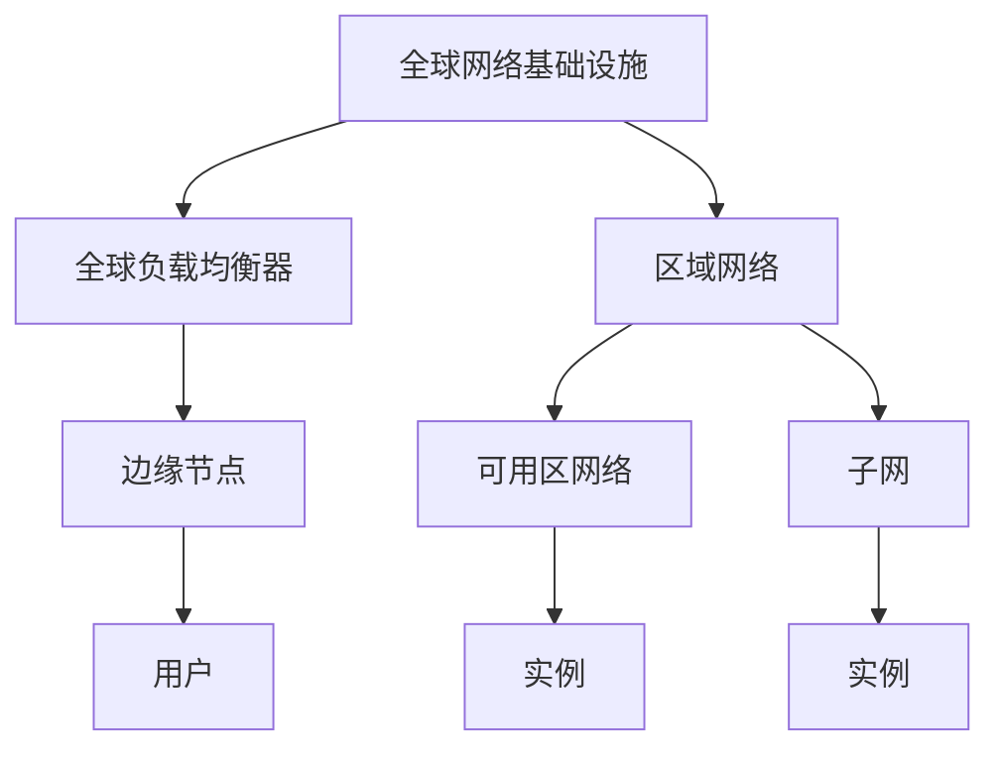
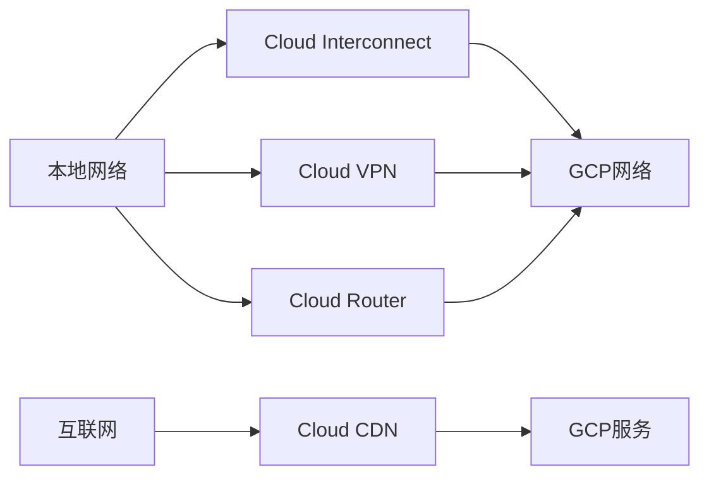
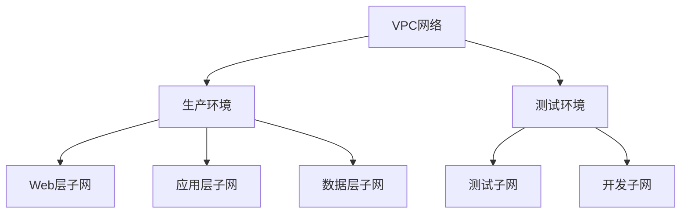
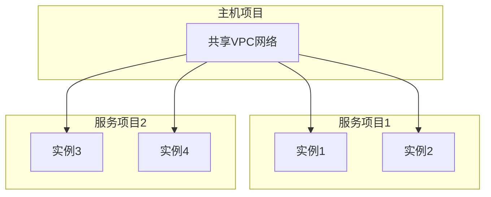
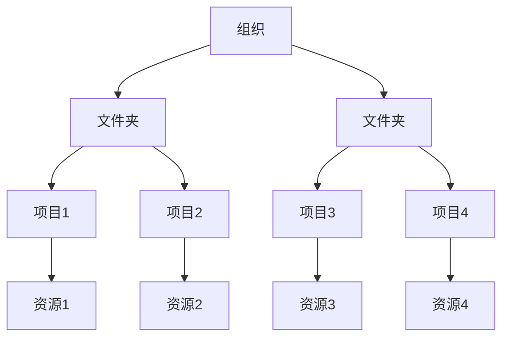
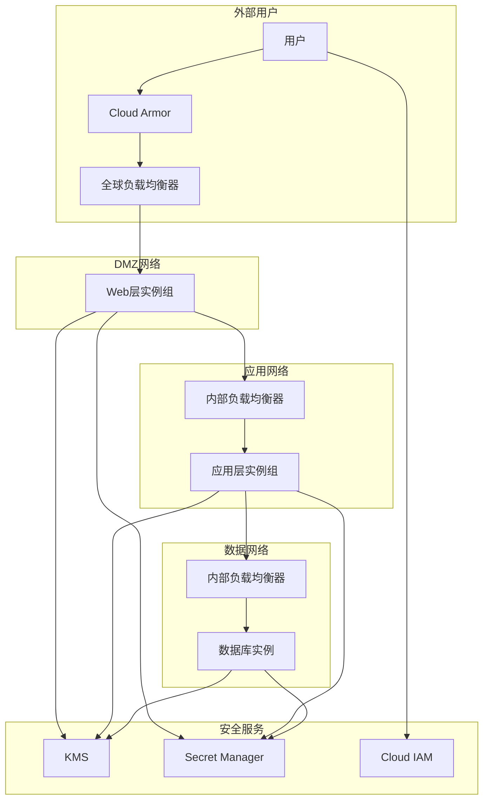

# 第4章：网络与安全服务

## 📚 本章导学

网络和安全是云基础设施的基础，确保应用程序的高可用性、高性能和数据保护。Google Cloud Platform提供了强大的网络和安全服务，帮助您构建安全可靠的应用架构。本章将详细介绍GCP的网络架构、安全服务和最佳实践。

### 🎯 学习目标

完成本章学习后，您将能够：

- 理解GCP网络架构和VPC网络的核心概念
- 掌握VPC网络的创建、配置和管理
- 学会使用负载均衡器优化应用性能和可用性
- 了解GCP安全服务的功能和配置方法
- 掌握身份和访问管理(IAM)的最佳实践
- 能够设计和实现安全的云应用架构

### 📖 本章内容概览

1. [GCP网络架构基础](#1-gcp网络架构基础)
2. [VPC网络详解](#2-vpc网络详解)
3. [负载均衡与CDN](#3-负载均衡与cdn)
4. [身份和访问管理(IAM)](##4-身份和访问管理iam)
5. [安全服务与合规性](#5-安全服务与合规性)
6. [实验：构建安全高可用架构](#6-实验构建安全高可用架构)

---

## 1. GCP网络架构基础

### 1.1 GCP网络模型

GCP采用了软件定义网络(SDN)架构，提供了灵活、高性能的网络服务。

#### 核心特性

- **全局VPC网络**：单个网络可跨越多个区域
- **软件定义**：通过软件控制网络行为，无需物理配置
- **高性能**：使用Google全球光纤网络，低延迟高带宽
- **自动扩展**：网络随基础设施自动扩展
- **安全性**：内置防火墙和隔离机制

#### 网络层次结构



### 1.2 IP地址管理

GCP提供了多种IP地址类型：

| IP类型 | 范围 | 使用方式 | 适用场景 |
|--------|------|----------|----------|
| **内部IP地址** | RFC 1918私有地址 | 自动分配或静态指定 | 实例间通信 |
| **外部临时IP** | 公共IP池 | 自动分配 | 临时需要外网访问 |
| **外部静态IP** | 公共IP池 | 预留并绑定 | 需要稳定公网IP的服务 |
| **全局静态IP** | 公共IP池 | 全球负载均衡 | 全球访问的入口点 |

### 1.3 网络性能与连接性

#### 网络性能特点

- **低延迟**：Google全球网络提供跨洲低延迟连接
- **高带宽**：实例间可达10Gbps或更高带宽
- **多路径**：多条冗余网络路径确保可靠性
- **全球覆盖**：200+边缘节点和POP点

#### 连接类型



| 连接类型 | 特点 | 适用场景 |
|----------|------|----------|
| **Cloud Interconnect** | 专用物理连接，高带宽 | 大规模数据传输，低延迟要求 |
| **Cloud VPN** | 通过公共互联网建立隧道 | 中小规模连接，灵活部署 |
| **Cloud Router** | 动态路由，BGP协议 | 复杂网络拓扑，多连接管理 |
| **Cloud CDN** | 内容分发网络，全球边缘缓存 | 静态内容分发，降低延迟 |

---

## 2. VPC网络详解

### 2.1 VPC网络基础

Virtual Private Cloud(VPC)是GCP的网络基础，提供了逻辑隔离的网络环境。

#### 核心概念

- **网络**：全局资源，可跨越多个区域
- **子网**：区域性资源，划分IP地址范围
- **防火墙规则**：控制实例间和外部流量
- **路由**：定义流量路径和目的地

#### 网络模式

GCP提供两种网络模式：

| 模式 | 特点 | 适用场景 |
|------|------|----------|
| **自动模式VPC** | 每个区域自动创建子网 | 快速开始，简单配置 |
| **自定义模式VPC** | 手动创建和管理子网 | 精确控制，企业环境 |

```bash
# 创建自动模式VPC网络
gcloud compute networks create auto-vpc-network --subnet-mode=auto

# 创建自定义模式VPC网络
gcloud compute networks create custom-vpc-network --subnet-mode=custom
```

### 2.2 子网管理

子网是VPC网络的区域性组成部分，定义了IP地址范围。

#### 子网配置

```bash
# 创建自定义子网
gcloud compute networks subnets create custom-subnet-us-central1 \
  --network=custom-vpc-network \
  --region=us-central1 \
  --range=10.0.0.0/24 \
  --secondary-range pod-range=10.1.0.0/24,services-range=10.2.0.0/24

# 列出子网
gcloud compute networks subnets list --network=custom-vpc-network

# 修改子网
gcloud compute networks subnets expand-ip-range custom-subnet-us-central1 \
  --network=custom-vpc-network \
  --region=us-central1 \
  --prefix-length=20
```

#### 子网最佳实践

1. **规划IP地址空间**：预留足够的地址空间用于扩展
2. **分离生产与非生产环境**：使用不同网络或子网隔离
3. **使用分层子网设计**：根据功能和安全级别划分
4. **考虑未来增长**：预留IP地址范围用于未来扩展



### 2.3 防火墙规则

防火墙规则控制流入和流出VPC网络的流量。

#### 防火墙规则组成

每个防火墙规则包含以下元素：

- **方向**：入站(INGRESS)或出站(EGRESS)
- **优先级**：数值越小，优先级越高
- **动作**：允许(allow)或拒绝(deny)
- **匹配条件**：源/目标IP、协议、端口
- **目标**：应用到所有实例或特定实例

#### 常见防火墙规则配置

```bash
# 允许HTTP流量
gcloud compute firewall-rules create allow-http \
  --network custom-vpc-network \
  --allow tcp:80 \
  --source-ranges 0.0.0.0/0 \
  --description "Allow HTTP traffic"

# 允许特定IP的SSH访问
gcloud compute firewall-rules create allow-ssh \
  --network custom-vpc-network \
  --allow tcp:22 \
  --source-ranges 203.0.113.0/24 \
  --description "Allow SSH from specific IP"

# 允许内部实例间通信
gcloud compute firewall-rules create allow-internal \
  --network custom-vpc-network \
  --allow tcp,udp,icmp \
  --source-ranges 10.0.0.0/8 \
  --description "Allow internal communication"

# 拒绝特定端口的流量
gcloud compute firewall-rules create deny-database \
  --network custom-vpc-network \
  --priority 1000 \
  --deny tcp:3306 \
  --source-ranges 0.0.0.0/0 \
  --description "Deny direct database access"
```

#### 防火墙规则最佳实践

1. **最小权限原则**：只允许必要的流量
2. **分层防御**：网络层、子网层和实例层防火墙
3. **使用网络标签**：精确控制实例的访问权限
4. **定期审查规则**：移除不再需要的规则

### 2.4 高级网络功能

#### 路由管理

GCP路由定义了流量的路径和目的地。

```bash
# 创建自定义路由
gcloud compute routes create custom-route \
  --network custom-vpc-network \
  --destination-range=192.168.0.0/16 \
  --next-hop-gateway=default-internet-gateway \
  --description "Route to on-premises network"

# 创建VPN隧道路由
gcloud compute routes create vpn-route \
  --network custom-vpc-network \
  --destination-range=192.168.1.0/24 \
  --next-hop-vpn-tunnel=my-vpn-tunnel \
  --description "Route to on-premises via VPN"
```

#### 共享VPC

共享VPC允许一个项目（主机项目）中的VPC网络与其他项目（服务项目）共享。



```bash
# 启用共享VPC
gcloud services enable compute.googleapis.com --project host-project
gcloud services enable compute.googleapis.com --project service-project

# 设置共享VPC主机项目
gcloud compute shared-vpc enable host-project

# 将服务项目关联到主机项目
gcloud compute shared-vpc associated-projects add service-project \
  --host-project host-project

# 在共享VPC中创建子网
gcloud compute networks subnets create shared-subnet \
  --network shared-vpc-network \
  --region us-central1 \
  --range 10.0.0.0/24 \
  --project host-project
```

---

## 3. 负载均衡与CDN

### 3.1 负载均衡器类型

GCP提供多种负载均衡器，满足不同应用场景的需求：

| 负载均衡器类型 | 适用场景 | 特点 |
|---------------|----------|------|
| **全局外部HTTP(S)负载均衡** | 全球Web应用 | 全球CDN，高级路由，SSL终止 |
| **区域外部HTTP(S)负载均衡** | 区域Web应用 | 低成本，简单配置 |
| **外部TCP/UDP负载均衡** | 非HTTP流量 | 游戏服务器，IoT，数据库 |
| **内部TCP/UDP负载均衡** | 内部服务 | 微服务架构，内部API |
| **内部HTTP(S)负载均衡** | 内部Web服务 | 内部Web应用，微服务 |

### 3.2 全局外部HTTP(S)负载均衡

全局外部负载均衡器提供全球流量分发和高级路由功能。

#### 核心特性

- **全球CDN**：内置全球内容分发网络
- **高级路由**：基于URL、主机、头信息等路由
- **SSL终止**：自动SSL证书管理和终止
- **健康检查**：后端实例健康监控
- **会话保持**：基于Cookie的会话亲和性

#### 创建全局负载均衡器

```bash
# 创建健康检查
gcloud compute health-checks create http webapp-health-check \
  --port 80 \
  --check-interval 5s \
  --timeout 5s \
  --healthy-threshold 2 \
  --unhealthy-threshold 2

# 创建后端服务
gcloud compute backend-services create webapp-backend \
  --protocol HTTP \
  --port-name http \
  --health-checks webapp-health-check \
  --global

# 将实例组添加到后端服务
gcloud compute backend-services add-backend webapp-backend \
  --instance-group webapp-instance-group \
  --instance-zone us-central1-a \
  --global

# 创建URL映射
gcloud compute url-maps create webapp-map \
  --default-service webapp-backend

# 创建目标HTTP代理
gcloud compute target-http-proxies create webapp-http-proxy \
  --url-map webapp-map

# 创建转发规则
gcloud compute forwarding-rules create webapp-http-rule \
  --address 192.0.2.1 \
  --global \
  --target-http-proxy webapp-http-proxy \
  --ports 80
```

### 3.3 内部负载均衡

内部负载均衡器用于在VPC网络内部分配流量。

#### 创建内部负载均衡器

```bash
# 创建内部健康检查
gcloud compute health-checks create http internal-health-check \
  --port 80 \
  --check-interval 5s \
  --timeout 5s \
  --healthy-threshold 2 \
  --unhealthy-threshold 2

# 创建内部后端服务
gcloud compute backend-services create internal-backend \
  --protocol HTTP \
  --port-name http \
  --health-checks internal-health-check \
  --region us-central1

# 将实例组添加到内部后端
gcloud compute backend-services add-backend internal-backend \
  --instance-group webapp-instance-group \
  --instance-zone us-central1-a \
  --region us-central1

# 创建内部转发规则
gcloud compute forwarding-rules create internal-http-rule \
  --load-balancing-scheme INTERNAL \
  --address 10.0.0.10 \
  --subnet custom-subnet-us-central1 \
  --backend-service internal-backend \
  --ports 80 \
  --region us-central1
```

### 3.4 Cloud CDN

Cloud CDN是GCP的内容分发网络，通过全球边缘节点缓存内容，提高访问速度。

#### 启用Cloud CDN

```bash
# 创建启用了CDN的后端服务
gcloud compute backend-services create webapp-backend \
  --protocol HTTP \
  --port-name http \
  --health-checks webapp-health-check \
  --enable-cdn \
  --cache-mode=CACHE_ALL_STATIC \
  --global

# 配置缓存密钥
gcloud compute backend-services edit webapp-backend \
  --global

# 配置缓存键策略
# 在打开的编辑器中添加以下内容：
# cdnPolicy:
#   cacheKeyPolicy:
#     includeHost: true
#     includeProtocol: false
#     includeQueryString: true

# 创建负缓存规则（不缓存特定内容）
gcloud compute backend-services add-negative-caching-policy webapp-backend \
  --code=404 \
  --ttl=60s \
  --global
```

---

## 4. 身份和访问管理(IAM)

### 4.1 IAM基础

Identity and Access Management (IAM)是GCP的核心安全服务，控制用户和服务对资源的访问权限。

#### IAM核心概念

- **身份**：用户、服务账户、Google群组、G Suite/Cloud Identity域
- **权限**：执行特定操作的能力
- **角色**：权限的集合
- **资源层次结构**：组织、文件夹、项目、资源



### 4.2 IAM角色类型

GCP提供了三种角色类型：

#### 基础角色

| 角色 | 权限 | 适用场景 |
|------|------|----------|
| **roles/owner** | 所有权限 | 完全控制 |
| **roles/editor** | 大部分权限 | 日常运维 |
| **roles/viewer** | 只读权限 | 审查和监控 |

#### 预定义角色

预定义角色针对特定服务或功能提供了适当的权限集：

```bash
# 查看所有可用的预定义角色
gcloud iam roles list

# 查看特定角色的权限
gcloud iam roles describe roles/compute.instanceAdmin

# 常用预定义角色
gcloud projects add-iam-policy-binding my-project \
  --member="user:alice@example.com" \
  --role="roles/compute.instanceAdmin"

gcloud projects add-iam-policy-binding my-project \
  --member="user:bob@example.com" \
  --role="roles/storage.objectAdmin"

gcloud projects add-iam-policy-binding my-project \
  --member="user:charlie@example.com" \
  --role="roles/cloudsql.editor"
```

#### 自定义角色

当预定义角色不能满足需求时，可以创建自定义角色：

```bash
# 创建自定义角色
gcloud iam roles create customInstanceManager \
  --project=my-project \
  --title="Custom Instance Manager" \
  --description="Custom role for managing specific instances" \
  --permissions="compute.instances.get,compute.instances.start,compute.instances.stop,compute.instances.restart,compute.instances.setTags"

# 将自定义角色分配给用户
gcloud projects add-iam-policy-binding my-project \
  --member="user:david@example.com" \
  --role="projects/my-project/roles/customInstanceManager"
```

### 4.3 服务账户

服务账户是应用程序的专用账户，用于程序化访问GCP资源。

#### 创建和管理服务账户

```bash
# 创建服务账户
gcloud iam service-accounts create my-app-service-account \
  --display-name="My Application Service Account" \
  --description="Service account for my application"

# 列出服务账户
gcloud iam service-accounts list

# 为服务账户分配角色
gcloud projects add-iam-policy-binding my-project \
  --member="serviceAccount:my-app-service-account@my-project.iam.gserviceaccount.com" \
  --role="roles/storage.objectViewer"

# 创建服务账户密钥（不推荐，更推荐使用附加服务账户）
gcloud iam service-accounts keys create ~/my-key.json \
  --iam-account=my-app-service-account@my-project.iam.gserviceaccount.com

# 附加服务账户到实例（推荐方式）
gcloud compute instances create my-instance \
  --service-account=my-app-service-account@my-project.iam.gserviceaccount.com \
  --scopes=storage-ro
```

#### 服务账户最佳实践

1. **最小权限原则**：仅授予服务账户执行其功能所需的最小权限
2. **环境隔离**：为不同环境（开发、测试、生产）使用不同的服务账户
3. **定期轮换密钥**：如果使用密钥，定期轮换以提高安全性
4. **监控使用情况**：定期审查服务账户的使用情况，移除不再需要的权限

---

## 5. 安全服务与合规性

### 5.1 安全服务概览

GCP提供了多种安全服务，帮助保护云资源和应用：

| 服务 | 功能 | 适用场景 |
|------|------|----------|
| **Cloud Armor** | WAF和DDoS保护 | Web应用安全 |
| **Security Command Center** | 安全威胁检测和响应 | 全面安全管理 |
| **Key Management Service (KMS)** | 密钥管理 | 加密密钥生命周期管理 |
| **Secret Manager** | 密钥存储 | 敏感信息存储 |
| **Cloud Identity-Aware Proxy** | 应用级访问控制 | 零信任架构 |

### 5.2 Cloud Armor WAF

Cloud Armor提供Web应用防火墙(WAF)和DDoS保护功能。

#### 创建安全策略

```bash
# 创建安全策略
gcloud compute security-policies create my-app-security-policy \
  --description="Security policy for my web application"

# 添加预配置WAF规则（例如，阻止SQL注入）
gcloud compute security-policies rules create 1000 \
  --security-policy=my-app-security-policy \
  --description="Block SQL injection attempts" \
  --expression="evaluatePreconfiguredExpr('sqli-stable')" \
  --action="deny-403"

# 添加自定义规则（例如，阻止可疑IP）
gcloud compute security-policies rules create 2000 \
  --security-policy=my-app-security-policy \
  --description="Block suspicious IP addresses" \
  --expression="request.headers['x-forwarded-for'].contains('192.0.2.')" \
  --action="deny-403"

# 速率限制规则
gcloud compute security-policies rules create 3000 \
  --security-policy=my-app-security-policy \
  --description="Rate limiting for API" \
  --expression="request.path.startsWith('/api/')" \
  --action="rate-ban-429" \
  --rate-limit-threshold-count=20 \
  --rate-limit-threshold-interval-sec=60 \
  --conform-action="allow"

# 将安全策略附加到后端服务
gcloud compute backend-services update webapp-backend \
  --security-policy=my-app-security-policy \
  --global
```

### 5.3 Key Management Service (KMS)

KMS提供云原生的密钥管理服务，用于加密数据的密钥生成、存储和管理。

#### 创建和管理密钥

```bash
# 创建密钥环
gcloud kms keyrings create my-key-ring \
  --location=us-central1

# 创建对称加密密钥
gcloud kms keys create my-encryption-key \
  --keyring=my-key-ring \
  --location=us-central1 \
  --purpose=encryption

# 创建非对称密钥（用于签名）
gcloud kms keys create my-signing-key \
  --keyring=my-key-ring \
  --location=us-central1 \
  --purpose=asymmetric-signing \
  --algorithm=rsa-sign-pkcs1-sha256

# 使用密钥加密数据
echo "Sensitive data" | gcloud kms encrypt \
  --plaintext-file=- \
  --ciphertext-file=- \
  --location=us-central1 \
  --keyring=my-key-ring \
  --key=my-encryption-key > encrypted.data

# 使用密钥解密数据
gcloud kms decrypt \
  --ciphertext-file=encrypted.data \
  --plaintext-file=- \
  --location=us-central1 \
  --keyring=my-key-ring \
  --key=my-encryption-key
```

#### 密钥版本和轮换

```bash
# 查看密钥版本
gcloud kms keys versions list \
  --keyring=my-key-ring \
  --location=us-central1 \
  --key=my-encryption-key

# 创建新密钥版本（手动轮换）
gcloud kms keys versions create \
  --keyring=my-key-ring \
  --location=us-central1 \
  --key=my-encryption-key

# 设置自动轮换策略
gcloud kms keys update my-encryption-key \
  --keyring=my-key-ring \
  --location=us-central1 \
  --rotation-period=90d \
  --next-rotation-time=2023-12-01T00:00:00Z
```

### 5.4 Secret Manager

Secret Manager是GCP的密钥存储服务，安全地存储API密钥、密码、证书等敏感信息。

#### 创建和管理密钥

```bash
# 启用Secret Manager API
gcloud services enable secretmanager.googleapis.com

# 创建密钥
echo -n "my-database-password" | gcloud secrets create database-password \
  --replication-policy="automatic" \
  --data-file=-

# 创建带有版本的密钥
gcloud secrets versions add database-password \
  --data-file=/path/to/password.txt

# 列出所有密钥
gcloud secrets list

# 访问密钥值
gcloud secrets versions access latest --secret="database-password"

# 授予服务账户访问密钥的权限
gcloud secrets add-iam-policy-binding database-password \
  --member="serviceAccount:my-app@my-project.iam.gserviceaccount.com" \
  --role="roles/secretmanager.secretAccessor"
```

### 5.5 合规性与认证

#### GCP合规性认证

GCP通过了多种国际和行业的合规性认证：

| 认证 | 范围 | 适用场景 |
|------|------|----------|
| **ISO 27001** | 信息安全管理体系 | 企业安全标准 |
| **ISO 27017** | 云安全 | 云环境安全 |
| **ISO 27018** | 云中个人身份信息 | 隐私保护 |
| **SOC 1/2/3** | 财务报告和运营控制 | 财务和运营审计 |
| **HIPAA** | 医疗信息 | 医疗保健行业 |
| **PCI DSS** | 支付卡行业 | 金融服务 |
| **FedRAMP** | 联邦政府 | 政府机构 |

#### 资源位置和组织策略

```bash
# 设置资源位置约束（限制资源创建位置）
gcloud resource-manager org-policies deny --organization=ORGANIZATION_ID \
  --constraint=constraints/gcp.resourceLocations \
  --allowed-values=US,EU

# 设置外部IP访问限制
gcloud resource-manager org-policies deny --organization=ORGANIZATION_ID \
  --constraint=constraints/compute.vmExternalIpAccess \
  --allowed-values=192.0.2.0/24,198.51.100.0/24

# 设置要求的信任镜像
gcloud resource-manager org-policies deny --organization=ORGANIZATION_ID \
  --constraint=constraints/compute.trustedImageProjects \
  --allowed-values=projects/trusted-images-project
```

---

## 6. 实验：构建安全高可用架构

让我们通过一个综合实验，实践本章学习的网络和安全服务。

### 实验目标

通过本实验，您将：

1. 设计并实施多层VPC网络架构
2. 配置负载均衡器实现高可用性
3. 实施安全组和防火墙规则
4. 配置IAM权限和服务账户
5. 部署安全服务保护应用

### 实验架构

我们将构建一个多层应用的安全高可用架构：



### 前提条件

- 已创建GCP项目和计费账户
- 已启用必要的GCP API
- 已安装gcloud CLI

### 实验步骤

#### 步骤1：创建VPC网络架构

```bash
# 设置变量
export PROJECT_ID=$(gcloud config get-value project)
export ORG_ID=$(gcloud organizations list --format="value(ID)")

# 创建自定义模式VPC网络
gcloud compute networks create secure-app-network \
  --subnet-mode=custom \
  --description="Secure application network"

# 创建Web层子网（DMZ）
gcloud compute networks subnets create web-subnet \
  --network=secure-app-network \
  --range=10.1.0.0/24 \
  --region=us-central1 \
  --description="Web tier subnet (DMZ)"

# 创建应用层子网
gcloud compute networks subnets create app-subnet \
  --network=secure-app-network \
  --range=10.2.0.0/24 \
  --region=us-central1 \
  --description="Application tier subnet"

# 创建数据库子网
gcloud compute networks subnets create db-subnet \
  --network=secure-app-network \
  --range=10.3.0.0/24 \
  --region=us-central1 \
  --description="Database tier subnet"
```

#### 步骤2：配置防火墙规则

```bash
# 允许SSH从特定IP访问所有子网
gcloud compute firewall-rules create allow-ssh \
  --network=secure-app-network \
  --allow tcp:22 \
  --source-ranges 203.0.113.0/24 \
  --description="Allow SSH from specific IP"

# 允许内部流量（应用层到数据库层）
gcloud compute firewall-rules create allow-app-to-db \
  --network=secure-app-network \
  --allow tcp:3306 \
  --source-tags app-server \
  --target-tags db-server \
  --description="Allow application servers to access database"

# 允许Web层到应用层的流量
gcloud compute firewall-rules create allow-web-to-app \
  --network=secure-app-network \
  --allow tcp:8080 \
  --source-tags web-server \
  --target-tags app-server \
  --description="Allow web servers to access application servers"

# 允许外部到Web层的HTTP/HTTPS流量
gcloud compute firewall-rules create allow-external-to-web \
  --network=secure-app-network \
  --allow tcp:80,tcp:443 \
  --source-ranges 0.0.0.0/0 \
  --target-tags web-server \
  --description="Allow external HTTP/HTTPS to web servers"

# 拒绝直接访问数据库层
gcloud compute firewall-rules create deny-direct-db-access \
  --network=secure-app-network \
  --priority 1000 \
  --deny tcp:3306 \
  --source-ranges 0.0.0.0/0 \
  --target-tags db-server \
  --description="Deny direct database access from external"
```

#### 步骤3：创建服务账户和权限

```bash
# 创建Web服务器服务账户
gcloud iam service-accounts create web-server-sa \
  --display-name="Web Server Service Account"

# 创建应用服务器服务账户
gcloud iam service-accounts create app-server-sa \
  --display-name="Application Server Service Account"

# 创建数据库服务账户
gcloud iam service-accounts create db-server-sa \
  --display-name="Database Server Service Account"

# 授予Web服务器服务账户访问KMS密钥的权限
gcloud kms keyrings create app-keyring --location=global
gcloud kms keys create app-encryption-key \
  --keyring=app-keyring \
  --location=global \
  --purpose=encryption

gcloud kms keys add-iam-policy-binding app-encryption-key \
  --keyring=app-keyring \
  --location=global \
  --member="serviceAccount:web-server-sa@${PROJECT_ID}.iam.gserviceaccount.com" \
  --role="roles/cloudkms.cryptoKeyEncrypterDecrypter"

# 授予应用服务器服务账户访问Secret Manager的权限
gcloud services enable secretmanager.googleapis.com

echo "app-database-password" | gcloud secrets create app-db-password \
  --replication-policy="automatic" \
  --data-file=-

gcloud secrets add-iam-policy-binding app-db-password \
  --member="serviceAccount:app-server-sa@${PROJECT_ID}.iam.gserviceaccount.com" \
  --role="roles/secretmanager.secretAccessor"
```

#### 步骤4：创建实例组

```bash
# 创建Web服务器模板
gcloud compute instance-templates create web-server-template \
  --machine-type=e2-medium \
  --network=secure-app-network \
  --subnet=web-subnet \
  --tags=web-server \
  --service-account=web-server-sa@${PROJECT_ID}.iam.gserviceaccount.com \
  --image-family=debian-11 \
  --image-project=debian-cloud \
  --metadata=startup-script='#! /bin/bash
    apt-get update
    apt-get install -y apache2
    systemctl enable apache2
    systemctl start apache2
    echo "<h1>Web Server $(hostname)</h1>" > /var/www/html/index.html
  '

# 创建Web服务器实例组
gcloud compute instance-groups managed create web-server-group \
  --base-instance-name web-server \
  --size 2 \
  --template web-server-template \
  --zone us-central1-a

# 创建应用服务器模板
gcloud compute instance-templates create app-server-template \
  --machine-type=e2-medium \
  --network=secure-app-network \
  --subnet=app-subnet \
  --tags=app-server \
  --service-account=app-server-sa@${PROJECT_ID}.iam.gserviceaccount.com \
  --image-family=debian-11 \
  --image-project=debian-cloud \
  --metadata=startup-script='#! /bin/bash
    apt-get update
    apt-get install -y python3 python3-pip
    pip3 install flask
    cat > /app/app.py <<EOF
from flask import Flask, jsonify
import os
app = Flask(__name__)

@app.route('/api/health')
def health():
    return jsonify({"status": "healthy", "server": os.uname()[1]})

if __name__ == '__main__':
    app.run(host="0.0.0.0", port=8080)
EOF
    mkdir -p /app
    cd /app
    python3 app.py &
  '

# 创建应用服务器实例组
gcloud compute instance-groups managed create app-server-group \
  --base-instance-name app-server \
  --size 2 \
  --template app-server-template \
  --zone us-central1-a

# 创建数据库实例
gcloud compute instances create database-server \
  --machine-type=e2-medium \
  --network=secure-app-network \
  --subnet=db-subnet \
  --tags=db-server \
  --service-account=db-server-sa@${PROJECT_ID}.iam.gserviceaccount.com \
  --image-family=debian-11 \
  --image-project=debian-cloud \
  --metadata=startup-script='#! /bin/bash
    apt-get update
    apt-get install -y mariadb-server
    systemctl enable mariadb
    systemctl start mariadb
    mysql -e "CREATE USER app_user IDENTIFIED BY \"secure_password\";"
    mysql -e "CREATE DATABASE app_db;"
    mysql -e "GRANT ALL PRIVILEGES ON app_db.* TO app_user;"
    mysql -e "FLUSH PRIVILEGES;"
  '
```

#### 步骤5：配置负载均衡器

```bash
# 创建健康检查
gcloud compute health-checks create http web-health-check \
  --port 80 \
  --check-interval 5s \
  --timeout 5s \
  --healthy-threshold 2 \
  --unhealthy-threshold 2

gcloud compute health-checks create http app-health-check \
  --port 8080 \
  --request-path=/api/health \
  --check-interval 5s \
  --timeout 5s \
  --healthy-threshold 2 \
  --unhealthy-threshold 2

# 创建Web层内部负载均衡器
gcloud compute backend-services create web-backend \
  --protocol HTTP \
  --port-name http \
  --health-checks web-health-check \
  --region us-central1

gcloud compute backend-services add-backend web-backend \
  --instance-group web-server-group \
  --instance-zone us-central1-a \
  --region us-central1

# 创建Web层内部转发规则
gcloud compute forwarding-rules create web-internal-lb \
  --load-balancing-scheme INTERNAL \
  --network=secure-app-network \
  --subnet=web-subnet \
  --address=10.1.0.10 \
  --backend-service web-backend \
  --ports 80 \
  --region us-central1

# 创建应用层内部负载均衡器
gcloud compute backend-services create app-backend \
  --protocol HTTP \
  --port-name http \
  --health-checks app-health-check \
  --region us-central1

gcloud compute backend-services add-backend app-backend \
  --instance-group app-server-group \
  --instance-zone us-central1-a \
  --region us-central1

# 创建应用层内部转发规则
gcloud compute forwarding-rules create app-internal-lb \
  --load-balancing-scheme INTERNAL \
  --network=secure-app-network \
  --subnet=app-subnet \
  --address=10.2.0.10 \
  --backend-service app-backend \
  --ports 8080 \
  --region us-central1

# 创建全局外部负载均衡器
gcloud compute backend-services create web-backend-global \
  --protocol HTTP \
  --port-name http \
  --health-checks web-health-check \
  --global

gcloud compute backend-services add-backend web-backend-global \
  --instance-group web-server-group \
  --instance-zone us-central1-a \
  --global

# 创建URL映射
gcloud compute url-maps create web-url-map \
  --default-service web-backend-global

# 创建目标HTTP代理
gcloud compute target-http-proxies create web-http-proxy \
  --url-map web-url-map

# 创建全局转发规则
gcloud compute forwarding-rules create web-forwarding-rule \
  --address 0.0.0.0 \
  --target-http-proxy web-http-proxy \
  --ports 80 \
  --global
```

#### 步骤6：配置Cloud Armor安全策略

```bash
# 创建安全策略
gcloud compute security-policies create web-security-policy \
  --description="Web application security policy"

# 启用预配置WAF规则
gcloud compute security-policies rules create 1000 \
  --security-policy=web-security-policy \
  --expression="evaluatePreconfiguredExpr('xss-stable')" \
  --action="deny-403" \
  --description="Block XSS attacks"

# 添加速率限制
gcloud compute security-policies rules create 2000 \
  --security-policy=web-security-policy \
  --expression="request.path.startsWith('/')" \
  --action="rate-ban-429" \
  --rate-limit-threshold-count=100 \
  --rate-limit-threshold-interval-sec=60 \
  --conform-action="allow" \
  --description="Rate limiting for all requests"

# 将安全策略附加到后端服务
gcloud compute backend-services update web-backend-global \
  --security-policy=web-security-policy \
  --global
```

#### 步骤7：测试架构

```bash
# 获取全局外部IP地址
EXTERNAL_IP=$(gcloud compute forwarding-rules describe web-forwarding-rule \
  --global --format="get(IPAddress)")

echo "External IP: $EXTERNAL_IP"

# 测试外部访问
curl http://$EXTERNAL_IP

# 测试健康检查
gcloud compute backend-services get-health web-backend-global \
  --global

# 测试内部负载均衡器
# SSH到Web服务器
gcloud compute ssh web-server-000001 --zone us-central1-a --command="curl http://10.2.0.10/api/health"

# 测试安全策略（模拟XSS攻击）
curl "http://$EXTERNAL_IP/?search=<script>alert('xss')</script>" -i
```

#### 步骤8：清理资源

```bash
# 删除负载均衡器
gcloud compute forwarding-rules delete web-forwarding-rule --global
gcloud compute target-http-proxies delete web-http-proxy
gcloud compute url-maps delete web-url-map
gcloud compute backend-services delete web-backend-global --global

# 删除内部负载均衡器
gcloud compute forwarding-rules delete app-internal-lb --region us-central1
gcloud compute backend-services delete app-backend --region us-central1

gcloud compute forwarding-rules delete web-internal-lb --region us-central1
gcloud compute backend-services delete web-backend --region us-central1

# 删除健康检查
gcloud compute health-checks delete web-health-check
gcloud compute health-checks delete app-health-check

# 删除实例组
gcloud compute instance-groups managed delete web-server-group --zone us-central1-a
gcloud compute instance-groups managed delete app-server-group --zone us-central1-a

# 删除实例模板
gcloud compute instance-templates delete web-server-template
gcloud compute instance-templates delete app-server-template

# 删除实例
gcloud compute instances delete database-server --zone us-central1-a

# 删除防火墙规则
gcloud compute firewall-rules delete allow-ssh
gcloud compute firewall-rules delete allow-app-to-db
gcloud compute firewall-rules delete allow-web-to-app
gcloud compute firewall-rules delete allow-external-to-web
gcloud compute firewall-rules delete deny-direct-db-access

# 删除安全策略
gcloud compute security-policies delete web-security-policy

# 删除子网
gcloud compute networks subnets delete web-subnet --region us-central1
gcloud compute networks subnets delete app-subnet --region us-central1
gcloud compute networks subnets delete db-subnet --region us-central1

# 删除VPC网络
gcloud compute networks delete secure-app-network

# 删除服务账户
gcloud iam service-accounts delete web-server-sa@${PROJECT_ID}.iam.gserviceaccount.com
gcloud iam service-accounts delete app-server-sa@${PROJECT_ID}.iam.gserviceaccount.com
gcloud iam service-accounts delete db-server-sa@${PROJECT_ID}.iam.gserviceaccount.com

# 删除密钥和密钥
gcloud secrets delete app-db-password
gcloud kms keys delete app-encryption-key --keyring=app-keyring --location=global
gcloud kms keyrings delete app-keyring --location=global
```

### 实验总结

通过这个实验，您已经：

1. **设计并实施了多层VPC网络架构**，实现了网络隔离和安全分层
2. **配置了负载均衡器**，提高了应用的可用性和性能
3. **实施了安全组和防火墙规则**，限制了不必要的访问
4. **配置了IAM权限和服务账户**，实现了最小权限原则
5. **部署了安全服务**，包括Cloud Armor、KMS和Secret Manager

这个实验展示了如何结合GCP的网络和安全服务，构建企业级的安全高可用架构。

---

## 📚 本章小结

本章我们学习了：

1. **GCP网络架构基础**：网络模型、IP地址管理和连接性
2. **VPC网络详解**：VPC网络、子网、防火墙规则和高级功能
3. **负载均衡与CDN**：不同类型负载均衡器和Cloud CDN
4. **身份和访问管理(IAM)**：IAM角色、服务账户和最佳实践
5. **安全服务与合规性**：Cloud Armor、KMS、Secret Manager和合规性
6. **综合实验**：构建安全高可用架构

### 🎯 关键知识点回顾

- **VPC网络**是GCP网络基础，支持全局网络和子网划分
- **防火墙规则**控制网络流量，遵循最小权限原则
- **负载均衡器**提高应用可用性和性能，有不同类型适应不同场景
- **IAM**是GCP的安全基础，通过角色和权限管理资源访问
- **服务账户**用于应用程序访问GCP资源，推荐使用而非密钥
- **安全服务**如Cloud Armor、KMS和Secret Manager提供了额外的安全层

### 🚀 下一步

完成本章学习后，您可以：

1. 深入实践网络和安全服务的高级功能
2. 探索网络优化和安全监控工具
3. 继续学习下一章"数据与机器学习服务"
4. 尝试完成[VPC网络示例](./code/vpc-network/)中的更多实验

---

## 📖 延伸阅读

- [VPC 网络文档](https://cloud.google.com/vpc/docs)
- [负载均衡文档](https://cloud.google.com/load-balancing/docs)
- [Cloud Armor 文档](https://cloud.google.com/armor/docs)
- [IAM 文档](https://cloud.google.com/iam/docs)
- [KMS 文档](https://cloud.google.com/kms/docs)

---

**💡 提示：安全是云架构的核心要素。设计网络和安全架构时，应遵循深度防御原则，从网络层、应用层到数据层实施多层次保护。定期审查和更新安全策略是保持系统安全的关键。**