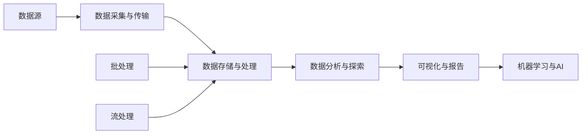
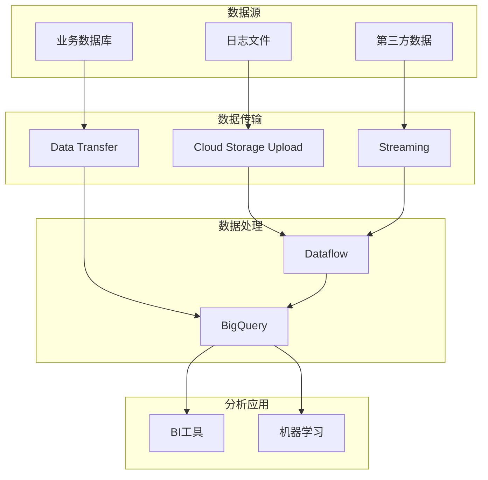
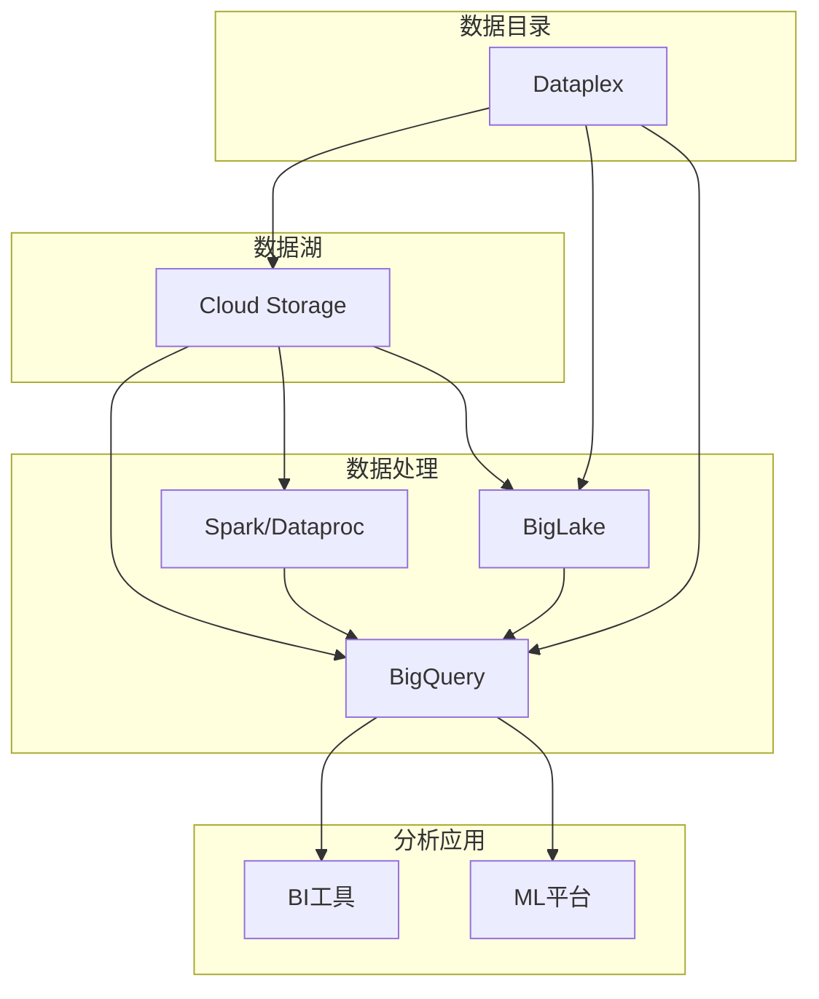
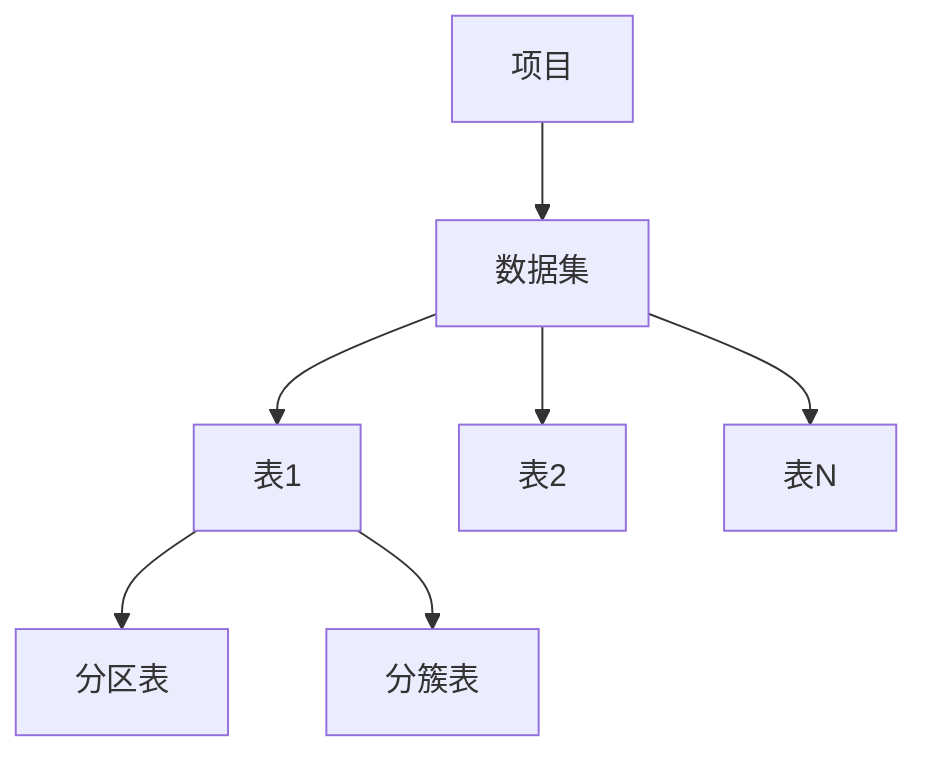
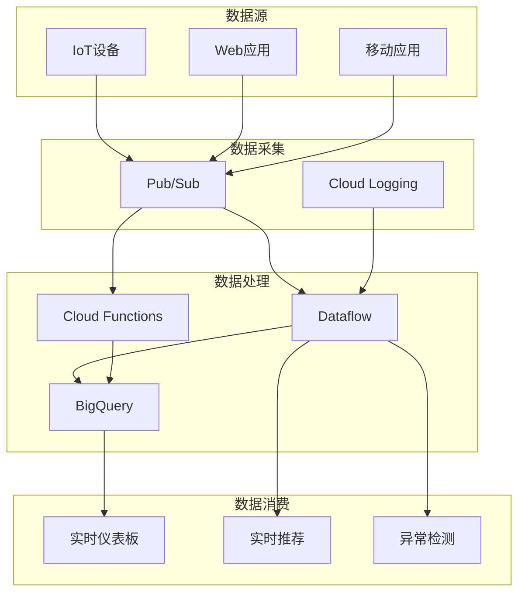
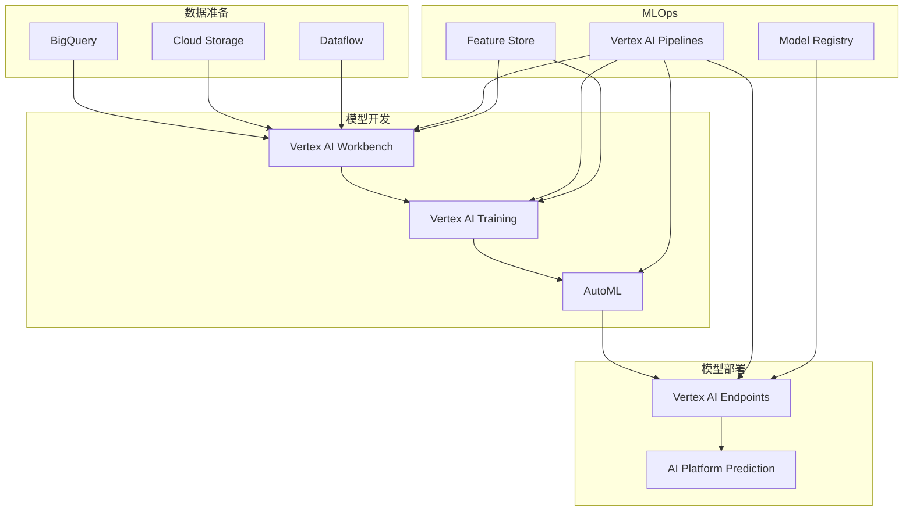
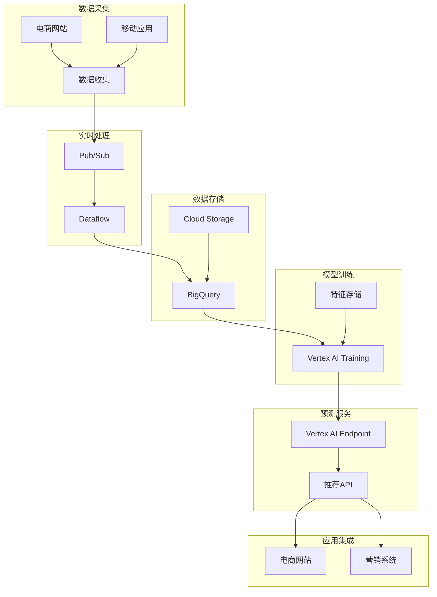

# 第5章：数据与机器学习服务

## 📚 本章导学

数据分析和机器学习是Google Cloud Platform的核心优势领域。GCP提供了全面的数据处理、分析和机器学习平台，帮助企业从数据中获取洞察，构建智能应用。本章将详细介绍GCP的数据分析和机器学习服务，帮助您构建端到端的数据驱动解决方案。

### 🎯 学习目标

完成本章学习后，您将能够：

- 理解GCP数据分析平台的架构和组件
- 掌握BigQuery数据仓库的使用方法和优化技巧
- 学会使用数据流处理服务（Dataflow, Pub/Sub）
- 了解GCP机器学习平台的核心功能和工具
- 掌握模型训练、部署和管理的完整流程
- 能够设计和实现数据驱动的AI解决方案

### 📖 本章内容概览

1. [GCP数据分析平台概览](#1-gcp数据分析平台概览)
2. [BigQuery数据仓库](#2-bigquery数据仓库)
3. [实时数据处理](#3-实时数据处理)
4. [GCP机器学习平台](#4-gcp机器学习平台)
5. [模型部署与管理](#5-模型部署与管理)
6. [实验：构建数据驱动AI应用](#6-实验构建数据驱动ai应用)

---

## 1. GCP数据分析平台概览

### 1.1 数据处理生命周期

GCP提供了完整的数据处理生命周期支持，从数据采集到洞察生成：



### 1.2 核心数据分析服务

GCP数据分析平台包含多种核心服务：

| 服务类别 | 核心服务 | 主要功能 | 适用场景 |
|----------|----------|----------|----------|
| **数据仓库** | BigQuery | PB级数据仓库，SQL查询 | 大数据分析，商业智能 |
| **数据湖** | Cloud Storage | 大规模对象存储 | 原始数据，非结构化数据 |
| **批处理** | Dataflow, Dataproc | 大规模数据处理 | ETL，复杂分析 |
| **流处理** | Dataflow, Pub/Sub | 实时数据处理 | 实时分析，事件驱动 |
| **数据集成** | Data Fusion | ETL/ELT工具 | 数据管道构建 |
| **BI与可视化** | Looker, Data Studio | 数据可视化 | 仪表板，报告 |

### 1.3 数据分析架构模式

常见的数据分析架构模式：

#### 传统数据仓库架构



#### 现代数据湖屋架构



---

## 2. BigQuery数据仓库

### 2.1 BigQuery基础

BigQuery是GCP的全托管、无服务器数据仓库，专为大规模数据分析设计。

#### 核心特性

- **无服务器架构**：无需管理基础设施
- **高性能查询**：使用列式存储和分布式处理
- **可扩展性**：可处理PB级数据，自动扩展
- **SQL支持**：标准SQL和旧版SQL
- **成本灵活**：按存储量和查询扫描量计费
- **集成性**：与GCP其他服务深度集成

#### 数据模型

BigQuery使用基于表的数据模型：



- **项目**：顶级容器，包含数据集
- **数据集**：表的集合，可设置访问控制
- **表**：数据的结构化集合，支持分区和分簇

### 2.2 数据操作

#### 创建数据集和表

```sql
-- 创建数据集
CREATE SCHEMA my_project.analytics_dataset
OPTIONS(
  location="US",
  description="Analytics dataset for web traffic"
);

-- 创建表
CREATE TABLE my_project.analytics_dataset.web_traffic (
  user_id STRING,
  page_url STRING,
  timestamp TIMESTAMP,
  session_id STRING,
  referrer STRING,
  user_agent STRUCT<
    browser STRING,
    os STRING,
    device STRING
  >
)
OPTIONS(
  description="Web traffic data"
);

-- 创建分区表（按时间分区）
CREATE TABLE my_project.analytics_dataset.web_traffic_partitioned (
  user_id STRING,
  page_url STRING,
  session_id STRING,
  referrer STRING,
  user_agent STRUCT<
    browser STRING,
    os STRING,
    device STRING
  >
)
PARTITION BY DATE(timestamp)
OPTIONS(
  description="Partitioned web traffic data by date"
);

-- 创建分簇表
CREATE TABLE my_project.analytics_dataset.web_traffic_clustered (
  user_id STRING,
  page_url STRING,
  timestamp TIMESTAMP,
  session_id STRING,
  referrer STRING
)
PARTITION BY DATE(timestamp)
CLUSTER BY user_id, session_id
OPTIONS(
  description="Clustered web traffic data"
);
```

#### 数据导入和导出

```bash
# 从本地文件导入
bq load \
  --source_format=CSV \
  my_project.analytics_dataset.web_traffic \
  ./data/web_traffic.csv \
  ./schema/web_traffic_schema.json

# 从Cloud Storage导入
bq load \
  --source_format=PARQUET \
  my_project.analytics_dataset.web_traffic \
  gs://my-bucket/data/web_traffic.parquet

# 导出数据到Cloud Storage
bq extract \
  --destination_format=CSV \
  my_project.analytics_dataset.web_traffic \
  gs://my-bucket/exports/web_traffic_*.csv
```

#### 查询优化技巧

```sql
-- 使用分区表过滤数据
SELECT
  user_id,
  page_url,
  timestamp
FROM
  my_project.analytics_dataset.web_traffic_partitioned
WHERE
  DATE(timestamp) BETWEEN "2023-01-01" AND "2023-01-31";

-- 使用分簇优化查询
SELECT
  user_id,
  COUNT(*) AS page_views
FROM
  my_project.analytics_dataset.web_traffic_clustered
WHERE
  DATE(timestamp) = "2023-01-15"
  AND user_id = "user123"
GROUP BY
  user_id;

-- 使用嵌套和重复字段
SELECT
  page_url,
  user_agent.browser,
  user_agent.os,
  user_agent.device
FROM
  my_project.analytics_dataset.web_traffic;

-- 使用窗口函数
SELECT
  user_id,
  page_url,
  timestamp,
  ROW_NUMBER() OVER (PARTITION BY user_id ORDER BY timestamp DESC) as rank
FROM
  my_project.analytics_dataset.web_traffic;

-- 使用近似聚合函数提高性能
SELECT
  APPROX_COUNT_DISTINCT(user_id) as distinct_users,
  APPROX_QUANTILES(timestamp, 10) as percentile_timestamps
FROM
  my_project.analytics_dataset.web_traffic;
```

### 2.3 高级功能

#### 存储过程和用户定义函数(UDF)

```sql
-- 创建存储过程
CREATE PROCEDURE my_project.analytics_dataset.sp_populate_sessions()
BEGIN
  -- 插入或更新会话数据
  MERGE my_project.analytics_dataset.web_sessions T
  USING (
    SELECT
      session_id,
      MIN(timestamp) as start_time,
      MAX(timestamp) as end_time,
      COUNT(*) as page_views
    FROM my_project.analytics_dataset.web_traffic
    WHERE DATE(timestamp) = CURRENT_DATE()
    GROUP BY session_id
  ) S
  ON T.session_id = S.session_id
  WHEN MATCHED THEN
    UPDATE SET
      T.start_time = S.start_time,
      T.end_time = S.end_time,
      T.page_views = S.page_views
  WHEN NOT MATCHED THEN
    INSERT (session_id, start_time, end_time, page_views)
    VALUES (S.session_id, S.start_time, S.end_time, S.page_views);
END;

-- 执行存储过程
CALL my_project.analytics_dataset.sp_populate_sessions();

-- 创建UDF
CREATE TEMP FUNCTION classify_session(page_views INT64)
RETURNS STRING
LANGUAGE js AS """
  if (page_views < 5) {
    return 'short';
  } else if (page_views < 20) {
    return 'medium';
  } else {
    return 'long';
  }
""";

-- 使用UDF
SELECT
  session_id,
  page_views,
  classify_session(page_views) as session_type
FROM
  my_project.analytics_dataset.web_sessions;
```

#### 外部数据源

```sql
-- 创建外部表指向Cloud Storage中的数据
CREATE EXTERNAL TABLE my_project.analytics_dataset.external_logs (
  timestamp TIMESTAMP,
  log_level STRING,
  message STRING
)
OPTIONS (
  format = "JSON",
  uris = ["gs://my-bucket/logs/*.json"]
);

-- 查询外部表
SELECT
  DATE(timestamp) as log_date,
  log_level,
  COUNT(*) as log_count
FROM
  my_project.analytics_dataset.external_logs
GROUP BY
  log_date,
  log_level
ORDER BY
  log_date,
  log_level;
```

---

## 3. 实时数据处理

### 3.1 实时数据架构

GCP提供了完整的实时数据处理解决方案：



### 3.2 Pub/Sub消息服务

Pub/Sub是GCP的托管消息服务，用于实时数据流处理。

#### 核心特性

- **消息传递**：可靠的消息传递和持久化
- **拉取和推送**：支持两种消息传递模式
- **过滤**：服务器端消息过滤
- **重放**：消息重放能力
- **全球分布**：全球消息分发

#### 创建和使用Pub/Sub

```bash
# 创建主题
gcloud pubsub topics create user-events

# 创建订阅
gcloud pubsub subscriptions create user-events-sub \
  --topic=user-events \
  --ack-deadline=60

# 发布消息
gcloud pubsub topics publish user-events \
  --message='{"user_id": "12345", "action": "page_view", "timestamp": "2023-01-01T12:00:00Z"}'

# 拉取消息
gcloud pubsub subscriptions pull user-events-sub --auto-ack --limit=10
```

#### 使用客户端库

```python
# publisher.py - 消息发布者
import json
from google.cloud import pubsub_v1

publisher = pubsub_v1.PublisherClient()
topic_name = "projects/your-project-id/topics/user-events"

def publish_user_event(user_id, action):
    # 创建消息
    message = {
        "user_id": user_id,
        "action": action,
        "timestamp": datetime.utcnow().isoformat() + "Z"
    }
    
    # 编码并发布消息
    data = json.dumps(message).encode("utf-8")
    future = publisher.publish(topic_name, data=data)
    print(f"Published message ID: {future.result()}")

# 发布用户事件
publish_user_event("user123", "page_view")
publish_user_event("user123", "add_to_cart")
```

```python
# subscriber.py - 消息订阅者
from concurrent.futures import TimeoutError
from google.cloud import pubsub_v1

subscriber = pubsub_v1.SubscriberClient()
subscription_name = "projects/your-project-id/subscriptions/user-events-sub"

def callback(message):
    print(f"Received message: {message.data}")
    # 处理消息
    user_event = json.loads(message.data.decode("utf-8"))
    print(f"User {user_event['user_id']} performed {user_event['action']}")
    
    # 确认消息处理完成
    message.ack()

# 订阅消息
streaming_pull_future = subscriber.subscribe(subscription_name, callback=callback)
print(f"Listening for messages on {subscription_name}..")

try:
    streaming_pull_future.result(timeout=timeout)
except TimeoutError:
    streaming_pull_future.cancel()
```

### 3.3 Dataflow数据流处理

Dataflow是GCP的托管数据流处理服务，基于Apache Beam构建。

#### 核心特性

- **统一模型**：批处理和流处理统一API
- **自动扩展**：根据负载自动调整资源
- **托管服务**：无需管理基础设施
- **精确一次**：确保数据处理的精确性
- **监控集成**：与Cloud Monitoring集成

#### Dataflow流水线示例

```python
# dataflow_pipeline.py
import apache_beam as beam
from apache_beam.options.pipeline_options import PipelineOptions
from apache_beam.options.pipeline_options import StandardOptions
import json

# 定义处理函数
class ParseEventFn(beam.DoFn):
    def process(self, element):
        event = json.loads(element.decode('utf-8'))
        return [(event['user_id'], 1)]

class ExtractAndCountUserEvents(beam.PTransform):
    def expand(self, pcoll):
        return (
            pcoll
            | 'ParseEvent' >> beam.ParDo(ParseEventFn())
            | 'CountPerUser' >> beam.CombinePerKey(sum)
        )

# 运行流水线
def run_pipeline():
    pipeline_options = PipelineOptions([
        '--project=your-project-id',
        '--region=us-central1',
        '--temp_location=gs://your-bucket/temp/',
        '--staging_location=gs://your-bucket/staging/',
        '--runner=DataflowRunner',
        '--job_name=user-events-analysis'
    ])
    
    pipeline_options.view_as(StandardOptions).streaming = True
    
    with beam.Pipeline(options=pipeline_options) as p:
        # 从Pub/Sub读取消息
        events = (
            p
            | 'ReadFromPubSub' >> beam.io.ReadFromPubSub(
                subscription='projects/your-project-id/subscriptions/user-events-sub'
            )
            | 'ExtractAndCount' >> ExtractAndCountUserEvents()
            | 'WriteToBigQuery' >> beam.io.WriteToBigQuery(
                table='your-project:analytics.user_events_count',
                schema='user_id:STRING, event_count:INTEGER',
                write_disposition=beam.io.BigQueryDisposition.WRITE_APPEND,
                create_disposition=beam.io.BigQueryDisposition.CREATE_IF_NEEDED
            )
        )

if __name__ == '__main__':
    run_pipeline()
```

#### 运行Dataflow作业

```bash
# 本地运行（用于测试）
python dataflow_pipeline.py --runner=DirectRunner

# 提交到Dataflow运行
python dataflow_pipeline.py --runner=DataflowRunner --project=your-project-id

# 使用模板创建作业
gcloud dataflow jobs run user-events-analysis \
  --gcs-location gs://your-bucket/templates/dataflow_pipeline \
  --region us-central1 \
  --parameters input_subscription=projects/your-project-id/subscriptions/user-events-sub
```

---

## 4. GCP机器学习平台

### 4.1 机器学习服务概览

GCP提供了全面的机器学习平台，覆盖模型开发生命周期的各个阶段：



### 4.2 Vertex AI平台

Vertex AI是GCP的统一机器学习平台，集成了各种ML工具和服务。

#### 核心组件

- **Vertex AI Workbench**：托管的Jupyter笔记本环境
- **Vertex AI Training**：自定义模型训练服务
- **Vertex AI Prediction**：模型预测和推理服务
- **AutoML**：自动模型训练服务
- **Vertex AI Pipelines**：ML工作流编排
- **Feature Store**：特征存储和管理
- **Model Registry**：模型版本和生命周期管理

#### 创建自定义模型训练作业

```python
# train_model.py - 自定义模型训练代码
import argparse
import os
import tensorflow as tf
from google.cloud import storage

def parse_args():
    parser = argparse.ArgumentParser()
    parser.add_argument('--model-dir', required=True)
    parser.add_argument('--epochs', type=int, default=10)
    parser.add_argument('--batch-size', type=int, default=32)
    return parser.parse_args()

def download_data(args):
    """从Cloud Storage下载数据集"""
    client = storage.Client()
    bucket = client.get_bucket('your-bucket')
    
    # 下载训练数据
    blob = bucket.blob('data/train.csv')
    blob.download_to_filename('/tmp/train.csv')
    
    # 下载测试数据
    blob = bucket.blob('data/test.csv')
    blob.download_to_filename('/tmp/test.csv')

def build_model():
    """构建Keras模型"""
    model = tf.keras.Sequential([
        tf.keras.layers.Dense(128, activation='relu', input_shape=(784,)),
        tf.keras.layers.Dropout(0.2),
        tf.keras.layers.Dense(10, activation='softmax')
    ])
    
    model.compile(
        optimizer='adam',
        loss='sparse_categorical_crossentropy',
        metrics=['accuracy']
    )
    
    return model

def train_model(model, args):
    """训练模型"""
    # 加载数据（示例）
    # 这里应该实现实际的数据加载和预处理逻辑
    
    # 训练模型
    history = model.fit(
        # train_data, train_labels,
        validation_data=(# val_data, val_labels),
        epochs=args.epochs,
        batch_size=args.batch_size
    )
    
    return history

def save_model(model, model_dir):
    """保存模型"""
    # 创建本地模型目录
    os.makedirs(model_dir, exist_ok=True)
    
    # 保存为TensorFlow SavedModel格式
    tf.saved_model.save(model, model_dir)

def main():
    args = parse_args()
    
    # 下载数据
    download_data(args)
    
    # 构建模型
    model = build_model()
    
    # 训练模型
    history = train_model(model, args)
    
    # 保存模型
    save_model(model, args.model_dir)
    
    # 将模型上传到GCS
    model_gcs_path = args.model_dir.replace('gs://', '')
    bucket_name, object_prefix = model_gcs_path.split('/', 1)
    storage_client = storage.Client()
    bucket = storage_client.bucket(bucket_name)
    
    for local_file in tf.io.gfile.glob(f'{args.model_dir}/**/*'):
        if tf.io.gfile.isdir(local_file):
            continue
        
        relative_path = local_file.replace(args.model_dir + '/', '')
        blob = bucket.blob(f'{object_prefix}/{relative_path}')
        blob.upload_from_filename(local_file)

if __name__ == '__main__':
    main()
```

#### 提交训练作业

```python
# submit_training_job.py - 提交Vertex AI训练作业
from google.cloud import aiplatform

def submit_custom_training_job():
    aiplatform.init(
        project='your-project-id',
        location='us-central1',
        staging_bucket='gs://your-bucket/staging'
    )
    
    job = aiplatform.CustomTrainingJob(
        display_name='mnist-classifier',
        script_path='train_model.py',
        container_uri='gcr.io/cloud-aiplatform/training/tf-cpu.2-8:latest',
        requirements=['tensorflow==2.8.0'],
        args=[
            '--model-dir', 'gs://your-bucket/models/mnist_classifier'
        ]
    )
    
    # 提交训练作业
    model = job.run(
        replica_count=1,
        machine_type='n1-standard-4',
        sync=True
    )
    
    return model

if __name__ == '__main__':
    model = submit_custom_training_job()
    print(f"Model deployed at: {model.resource_name}")
```

### 4.3 AutoML服务

AutoML允许非ML专家构建高质量的自定义机器学习模型。

#### 使用AutoML Vision进行图像分类

```python
# automl_vision.py
from google.cloud import aiplatform
from google.cloud import vision

def create_dataset():
    """创建AutoML Vision数据集"""
    client = vision.AutoMlClient()
    
    # 定义数据集
    dataset = client.create_dataset(
        parent=f"projects/your-project-id/locations/us-central1",
        dataset={
            "display_name": "product_images",
            "image_classification_dataset_metadata": {}
        }
    )
    
    print(f"Dataset created: {dataset.name}")
    return dataset

def import_data(dataset):
    """导入数据到数据集"""
    client = vision.AutoMlClient()
    
    # 导入数据
    response = client.import_data(
        name=dataset.name,
        input_config={
            "gcs_source": {
                "uris": [
                    "gs://your-bucket/product-images/data.csv"
                ]
            }
        }
    )
    
    print(f"Data import started: {response.operation.name}")

def train_model(dataset):
    """训练AutoML模型"""
    client = vision.AutoMlClient()
    
    # 定义模型
    model = client.create_model(
        parent=f"projects/your-project-id/locations/us-central1",
        model={
            "display_name": "product_classification",
            "dataset_id": dataset.name.split('/')[-1],
            "image_classification_model_metadata": {
                "train_budget": 8,  # 训练时间（节点小时）
            }
        }
    )
    
    print(f"Model training started: {model.operation.name}")
    return model

def deploy_model(model):
    """部署模型用于预测"""
    client = vision.AutoMlClient()
    
    # 部署模型
    response = client.deploy_model(
        name=model.name
    )
    
    print(f"Model deployment started: {response.operation.name}")

def predict_image(image_path, model_id):
    """使用模型进行预测"""
    client = vision.ImageAnnotatorClient()
    
    # 读取图像
    with open(image_path, "rb") as image_file:
        content = image_file.read()
    
    image = vision.Image(content=content)
    
    # 进行预测
    response = client.image_annotation(
        image=image,
        features=[{"type_": vision.Feature.Type.LABEL_DETECTION}],
        model_id=model_id
    )
    
    # 输出预测结果
    for label in response.label_annotations:
        print(f"Label: {label.description}, Score: {label.score}")

if __name__ == '__main__':
    # 创建数据集
    dataset = create_dataset()
    
    # 导入数据
    import_data(dataset)
    
    # 训练模型（通常需要数小时）
    model = train_model(dataset)
    
    # 部署模型
    deploy_model(model)
    
    # 使用模型预测
    predict_image('test_image.jpg', 'model_id')
```

---

## 5. 模型部署与管理

### 5.1 模型部署选项

GCP提供了多种模型部署选项，适应不同需求：

| 部署方式 | 选项 | 特点 | 适用场景 |
|----------|------|------|----------|
| **Vertex AI Endpoint** | 预测服务 | 托管API，自动扩展 | 生产环境推理 |
| **AI Platform Prediction** | 传统预测服务 | 成熟稳定，版本兼容 | 传统ML工作流 |
| **Containerized模型** | 自定义容器 | 完全控制，自定义依赖 | 特殊运行时需求 |
| **Edge deployment** | 边缘设备 | 本地推理，低延迟 | IoT，实时应用 |
| **Web服务** | 自定义Web服务 | 灵活自定义，轻量级 | 简单模型，API服务 |

### 5.2 Vertex AI Endpoint部署

#### 部署模型到Vertex AI Endpoint

```python
# deploy_model.py
from google.cloud import aiplatform
from google.protobuf import json_format
from google.protobuf.struct_pb2 import Value

def deploy_model():
    # 初始化Vertex AI
    aiplatform.init(
        project='your-project-id',
        location='us-central1',
        staging_bucket='gs://your-bucket/staging'
    )
    
    # 上传模型
    model = aiplatform.Model.upload(
        display_name='mnist-classifier',
        artifact_uri='gs://your-bucket/models/mnist_classifier',
        serving_container_image_uri='gcr.io/cloud-aiplatform/prediction/tf2-cpu.2-8:latest'
    )
    
    # 创建端点
    endpoint = aiplatform.Endpoint.create(
        display_name='mnist-classifier-endpoint'
    )
    
    # 部署模型到端点
    deployed_model = model.deploy(
        endpoint=endpoint,
        deployed_model_display_name='mnist-classifier-deployed',
        machine_type='n1-standard-2',
        min_replica_count=1,
        max_replica_count=5
    )
    
    return endpoint

def make_prediction(endpoint, instances):
    """使用部署的模型进行预测"""
    response = endpoint.predict(instances=instances)
    return response.predictions

if __name__ == '__main__':
    # 部署模型
    endpoint = deploy_model()
    
    # 进行预测
    instances = [{"image": "base64_encoded_image_data"}]
    predictions = make_prediction(endpoint, instances)
    print(predictions)
```

### 5.3 模型监控和管理

#### 设置模型监控

```python
# model_monitoring.py
from google.cloud import aiplatform
from google.cloud import aiplatform_v1beta1

def configure_model_monitoring(endpoint_id, model_id):
    """配置模型监控"""
    aiplatform.init(project='your-project-id', location='us-central1')
    
    # 获取端点
    endpoint = aiplatform.Endpoint(endpoint_id)
    
    # 配置监控作业
    monitoring_job = aiplatform_v1beta1.ModelDeploymentMonitoringJob(
        display_name='mnist-classifier-monitoring',
        endpoint=endpoint.resource_name,
        monitoring_interval_quantum='3600s',  # 每小时检查一次
        alert_config=aiplatform_v1beta1.ModelDeploymentMonitoringJob.AlertConfig(
            email_alerts=['admin@example.com']
        ),
        objective_configs=[
            aiplatform_v1beta1.ModelDeploymentMonitoringJob.ObjectiveConfig(
                target_sample_rate=0.5,  # 采样50%的预测请求
                training_dataset='gs://your-bucket/data/training_data.csv'
            )
        ],
        log_sampling_rate=0.1  # 采样10%的日志
    )
    
    # 创建监控作业
    monitoring_job = aiplatform_v1beta1.JobServiceClient().create_model_deployment_monitoring_job(
        parent=f'projects/your-project-id/locations/us-central1',
        model_deployment_monitoring_job=monitoring_job
    )
    
    print(f"Model monitoring job created: {monitoring_job.name}")

if __name__ == '__main__':
    configure_model_monitoring(
        endpoint_id='your-endpoint-id',
        model_id='your-model-id'
    )
```

---

## 6. 实验：构建数据驱动AI应用

让我们通过一个综合实验，实践本章学习的数据分析和机器学习服务。

### 实验目标

通过本实验，您将：

1. 构建实时数据采集和处理管道
2. 使用BigQuery进行数据分析和存储
3. 训练机器学习模型进行用户行为预测
4. 部署模型并提供实时预测服务
5. 实现端到端的数据驱动AI应用

### 实验架构

我们将构建一个电商推荐系统，包含实时数据处理和机器学习预测：



### 前提条件

- 已创建GCP项目和计费账户
- 已启用必要的GCP API
- 已安装Python和Google Cloud SDK
- 准备示例电商数据

### 实验步骤

#### 步骤1：设置数据基础设施

```bash
# 设置项目
export PROJECT_ID=$(gcloud config get-value project)
export REGION=us-central1

# 创建BigQuery数据集
bq mk --dataset $PROJECT_ID:ecommerce_data

# 创建Cloud Storage存储桶
gsutil mb -l $REGION gs://${PROJECT_ID}-ecommerce-data

# 创建Pub/Sub主题和订阅
gcloud pubsub topics create user-events
gcloud pubsub subscriptions create user-events-sub --topic=user-events

# 上传示例数据到Cloud Storage
mkdir -p data
cat > data/products.csv <<EOF
product_id,product_name,category,price,description
1001,Smartphone Pro,Electronics,799.99,Latest smartphone with advanced features
1002,Laptop Ultra,Electronics,1299.99,High-performance laptop for professionals
1003,Wireless Earbuds,Electronics,199.99,Premium wireless earbuds with noise cancellation
1004,Smart Watch,Electronics,349.99,Advanced fitness tracking smartwatch
1005,Tablet Plus,Electronics,599.99,Portable tablet for work and entertainment
EOF

gsutil cp data/products.csv gs://${PROJECT_ID}-ecommerce-data/data/

# 创建BigQuery表并导入数据
bq load \
  --source_format=CSV \
  --field_delim="," \
  --skip_leading_rows=1 \
  $PROJECT_ID:ecommerce_data.products \
  gs://${PROJECT_ID}-ecommerce-data/data/products.csv \
  product_id:STRING,product_name:STRING,category:STRING,price:FLOAT,description:STRING
```

#### 步骤2：创建实时数据处理管道

```python
# setup_dataflow_pipeline.py
import os
import argparse
import json
import apache_beam as beam
from apache_beam.options.pipeline_options import PipelineOptions, StandardOptions
from apache_beam.io.gcp.bigquery import WriteToBigQuery
from google.cloud import bigquery
from google.cloud import storage

class ParseUserEvent(beam.DoFn):
    def process(self, element):
        """解析用户事件消息"""
        try:
            event = json.loads(element.decode('utf-8'))
            return [event]
        except Exception as e:
            print(f"Error parsing event: {e}")
            return []

class EnrichWithProductInfo(beam.DoFn):
    """使用产品信息丰富用户事件"""
    def process(self, event):
        # 这里简化处理，实际应该查询产品信息
        if 'product_id' in event:
            # 模拟产品信息查询
            product_info = {
                'product_name': f'Product {event["product_id"]}',
                'category': 'Electronics'
            }
            event.update(product_info)
        return [event]

def create_dataflow_pipeline():
    parser = argparse.ArgumentParser()
    parser.add_argument('--project', required=True)
    parser.add_argument('--region', required=True)
    parser.add_argument('--temp_location', required=True)
    parser.add_argument('--runner', default='DataflowRunner')
    
    known_args, pipeline_args = parser.parse_known_args()
    
    pipeline_options = PipelineOptions(pipeline_args)
    pipeline_options.view_as(StandardOptions).streaming = True
    
    with beam.Pipeline(options=pipeline_options) as p:
        events = (
            p
            | 'ReadFromPubSub' >> beam.io.ReadFromPubSub(
                subscription=f'projects/{known_args.project}/subscriptions/user-events-sub'
            )
            | 'ParseEvent' >> beam.ParDo(ParseUserEvent())
            | 'EnrichWithProductInfo' >> beam.ParDo(EnrichWithProductInfo())
            | 'WriteToBigQuery' >> WriteToBigQuery(
                table=f'{known_args.project}:ecommerce_data.user_events',
                schema='event_id:STRING,user_id:STRING,event_type:STRING,timestamp:TIMESTAMP,product_id:STRING,product_name:STRING,category:STRING',
                write_disposition=beam.io.BigQueryDisposition.WRITE_APPEND,
                create_disposition=beam.io.BigQueryDisposition.CREATE_IF_NEEDED
            )
        )

if __name__ == '__main__':
    create_dataflow_pipeline()
```

#### 步骤3：创建特征工程

```sql
-- create_features.sql - BigQuery特征工程SQL
-- 创建用户行为特征表
CREATE OR REPLACE TABLE ecommerce_data.user_features
OPTIONS(
  description="User behavior features for recommendation"
)
AS
SELECT
  user_id,
  COUNT(DISTINCT session_id) as session_count,
  COUNT(DISTINCT product_id) as unique_products_viewed,
  COUNT(*) as total_events,
  SUM(CASE WHEN event_type = 'purchase' THEN 1 ELSE 0 END) as purchase_count,
  SUM(CASE WHEN event_type = 'add_to_cart' THEN 1 ELSE 0 END) as cart_add_count,
  SUM(CASE WHEN event_type = 'view' THEN 1 ELSE 0 END) as view_count,
  APPROX_COUNT_DISTINCT(category) as unique_categories_viewed,
  DATE_DIFF(CURRENT_DATE(), MAX(DATE(timestamp)), DAY) as days_since_last_activity,
  -- 用户偏好特征
  ARRAY_AGG(DISTINCT category ORDER BY COUNT(*) DESC LIMIT 3) as top_categories,
  -- 价格偏好
  AVG(product.price) as avg_price_viewed,
  MAX(product.price) as max_price_viewed,
  MIN(product.price) as min_price_viewed
FROM
  ecommerce_data.user_events AS events
LEFT JOIN
  ecommerce_data.products AS product
ON events.product_id = product.product_id
WHERE
  event_type IN ('view', 'add_to_cart', 'purchase')
GROUP BY
  user_id;

-- 创建产品关联特征表
CREATE OR REPLACE TABLE ecommerce_data.product_affinity
OPTIONS(
  description="Product affinity matrix for collaborative filtering"
)
AS
SELECT
  p1.product_id as product_a,
  p2.product_id as product_b,
  COUNT(*) as co_view_count,
  COUNT(DISTINCT e.user_id) as unique_users
FROM
  (SELECT user_id, product_id FROM ecommerce_data.user_events WHERE event_type = 'view') AS p1
JOIN
  (SELECT user_id, product_id FROM ecommerce_data.user_events WHERE event_type = 'view') AS p2
ON
  p1.user_id = p2.user_id AND p1.product_id < p2.product_id
JOIN
  ecommerce_data.user_events AS e
ON
  p1.user_id = e.user_id AND p1.product_id = e.product_id
GROUP BY
  p1.product_id, p2.product_id
HAVING
  unique_users >= 10
ORDER BY
  unique_users DESC;
```

#### 步骤4：训练推荐模型

```python
# train_recommendation_model.py
import argparse
import os
import json
import pandas as pd
import tensorflow as tf
from google.cloud import bigquery
from google.cloud import storage

def load_data_from_bq(project_id, dataset_id):
    """从BigQuery加载训练数据"""
    client = bigquery.Client(project=project_id)
    
    # 查询训练数据
    query = f"""
    SELECT
      user_id,
      product_id,
      CASE 
        WHEN event_type = 'purchase' THEN 1.0
        WHEN event_type = 'add_to_cart' THEN 0.7
        WHEN event_type = 'view' THEN 0.3
        ELSE 0.0
      END as interaction_score,
      TIMESTAMP_DIFF(CURRENT_TIMESTAMP(), timestamp, HOUR) as recency_hours
    FROM
      `{project_id}.{dataset_id}.user_events`
    WHERE
      event_type IN ('view', 'add_to_cart', 'purchase')
      AND timestamp >= TIMESTAMP_SUB(CURRENT_TIMESTAMP(), INTERVAL 90 DAY)
    ORDER BY
      user_id, product_id
    """
    
    # 执行查询并获取结果
    df = client.query(query).to_dataframe()
    return df

def preprocess_data(df):
    """数据预处理"""
    # 获取用户和产品ID映射
    user_ids = df['user_id'].unique()
    product_ids = df['product_id'].unique()
    
    user_id_map = {id: i for i, id in enumerate(user_ids)}
    product_id_map = {id: i for i, id in enumerate(product_ids)}
    
    # 添加索引列
    df['user_idx'] = df['user_id'].map(user_id_map)
    df['product_idx'] = df['product_id'].map(product_id_map)
    
    # 归一化交互分数
    df['normalized_score'] = df['interaction_score'] / df['interaction_score'].max()
    
    return df, user_id_map, product_id_map

def create_model(num_users, num_products, embedding_dim=50):
    """创建推荐模型"""
    # 用户嵌入
    user_input = tf.keras.layers.Input(shape=(1,), name='user_input')
    user_embedding = tf.keras.layers.Embedding(
        num_users, 
        embedding_dim, 
        name='user_embedding'
    )(user_input)
    user_vec = tf.keras.layers.Flatten(name='user_flatten')(user_embedding)
    
    # 产品嵌入
    product_input = tf.keras.layers.Input(shape=(1,), name='product_input')
    product_embedding = tf.keras.layers.Embedding(
        num_products, 
        embedding_dim, 
        name='product_embedding'
    )(product_input)
    product_vec = tf.keras.layers.Flatten(name='product_flatten')(product_embedding)
    
    # 合并向量
    concat = tf.keras.layers.Concatenate()([user_vec, product_vec])
    
    # 全连接层
    dense1 = tf.keras.layers.Dense(128, activation='relu')(concat)
    dropout = tf.keras.layers.Dropout(0.2)(dense1)
    dense2 = tf.keras.layers.Dense(64, activation='relu')(dropout)
    
    # 输出层
    output = tf.keras.layers.Dense(1, activation='sigmoid', name='output')(dense2)
    
    # 创建模型
    model = tf.keras.Model(
        inputs=[user_input, product_input], 
        outputs=output
    )
    
    # 编译模型
    model.compile(
        optimizer='adam',
        loss='binary_crossentropy',
        metrics=['accuracy', tf.keras.metrics.AUC()]
    )
    
    return model

def train_model(project_id, dataset_id, model_dir):
    """训练推荐模型"""
    # 加载数据
    df = load_data_from_bq(project_id, dataset_id)
    print(f"Loaded {len(df)} interactions")
    
    # 数据预处理
    df, user_id_map, product_id_map = preprocess_data(df)
    
    # 创建模型
    num_users = len(user_id_map)
    num_products = len(product_id_map)
    model = create_model(num_users, num_products)
    model.summary()
    
    # 准备训练数据
    train_inputs = [
        df['user_idx'].values,
        df['product_idx'].values
    ]
    train_targets = df['normalized_score'].values
    
    # 训练模型
    history = model.fit(
        train_inputs, 
        train_targets,
        epochs=10,
        batch_size=128,
        validation_split=0.2,
        verbose=1
    )
    
    # 保存模型
    os.makedirs(model_dir, exist_ok=True)
    model.save(model_dir)
    
    # 保存映射表
    with open(os.path.join(model_dir, 'user_id_map.json'), 'w') as f:
        json.dump(user_id_map, f)
    
    with open(os.path.join(model_dir, 'product_id_map.json'), 'w') as f:
        json.dump(product_id_map, f)
    
    print(f"Model saved to {model_dir}")
    
    return model, history

def main():
    parser = argparse.ArgumentParser()
    parser.add_argument('--project-id', required=True)
    parser.add_argument('--dataset-id', default='ecommerce_data')
    parser.add_argument('--model-dir', required=True)
    
    args = parser.parse_args()
    
    # 训练模型
    model, history = train_model(
        args.project_id,
        args.dataset_id,
        args.model_dir
    )
    
    # 上传模型到GCS
    storage_client = storage.Client()
    bucket_name, prefix = args.model_dir.replace('gs://', '').split('/', 1)
    bucket = storage_client.bucket(bucket_name)
    
    for local_file in tf.io.gfile.glob(f'{args.model_dir}/**/*'):
        if tf.io.gfile.isdir(local_file):
            continue
            
        relative_path = local_file.replace(args.model_dir + '/', '')
        blob = bucket.blob(f'{prefix}/{relative_path}')
        blob.upload_from_filename(local_file)

if __name__ == '__main__':
    main()
```

#### 步骤5：部署预测服务

```python
# recommendation_api.py - 推荐API服务
import os
import json
import numpy as np
import tensorflow as tf
from flask import Flask, request, jsonify
from google.cloud import bigquery, storage

app = Flask(__name__)

# 全局变量，用于加载模型和映射表
model = None
user_id_map = None
product_id_map = None
reverse_product_id_map = None
bq_client = None

def load_model(model_dir):
    """加载推荐模型"""
    global model, user_id_map, product_id_map, reverse_product_id_map
    
    # 加载模型
    model = tf.keras.models.load_model(model_dir)
    
    # 加载ID映射表
    with open(os.path.join(model_dir, 'user_id_map.json'), 'r') as f:
        user_id_map = json.load(f)
    
    with open(os.path.join(model_dir, 'product_id_map.json'), 'r') as f:
        product_id_map = json.load(f)
    
    # 创建产品ID反向映射
    reverse_product_id_map = {v: k for k, v in product_id_map.items()}
    
    print(f"Model loaded from {model_dir}")

def get_user_features(user_id):
    """获取用户特征"""
    query = f"""
    SELECT *
    FROM `{os.environ.get('PROJECT_ID')}.ecommerce_data.user_features`
    WHERE user_id = @user_id
    """
    
    job_config = bigquery.QueryJobConfig(
        query_parameters=[
            bigquery.ScalarQueryParameter("user_id", "STRING", user_id)
        ]
    )
    
    result = bq_client.query(query, job_config=job_config).to_dataframe()
    
    if len(result) == 0:
        return {}
    
    return result.iloc[0].to_dict()

def recommend_products(user_id, num_recommendations=10):
    """为用户推荐产品"""
    global model, user_id_map, product_id_map, reverse_product_id_map
    
    # 检查用户是否存在
    if user_id not in user_id_map:
        # 为新用户返回热门产品
        query = f"""
        SELECT product_id, COUNT(*) as view_count
        FROM `{os.environ.get('PROJECT_ID')}.ecommerce_data.user_events`
        WHERE event_type = 'view'
        GROUP BY product_id
        ORDER BY view_count DESC
        LIMIT {num_recommendations}
        """
        
        result = bq_client.query(query).to_dataframe()
        return result['product_id'].tolist()
    
    # 获取用户索引
    user_idx = user_id_map[user_id]
    
    # 生成所有产品的预测分数
    product_indices = np.arange(len(product_id_map))
    user_indices = np.full(len(product_id_map), user_idx)
    
    # 批量预测
    predictions = model.predict([user_indices, product_indices])
    
    # 获取推荐产品（排除用户已经交互过的产品）
    query = f"""
    SELECT DISTINCT product_id
    FROM `{os.environ.get('PROJECT_ID')}.ecommerce_data.user_events`
    WHERE user_id = @user_id
    """
    
    job_config = bigquery.QueryJobConfig(
        query_parameters=[
            bigquery.ScalarQueryParameter("user_id", "STRING", user_id)
        ]
    )
    
    interacted_products = set(
        bq_client.query(query, job_config=job_config).to_dataframe()['product_id'].tolist()
    )
    
    # 按预测分数排序并过滤
    product_scores = list(zip(product_indices, predictions.flatten()))
    product_scores.sort(key=lambda x: x[1], reverse=True)
    
    recommendations = []
    for product_idx, score in product_scores:
        product_id = reverse_product_id_map[product_idx]
        if product_id not in interacted_products:
            recommendations.append(product_id)
            if len(recommendations) >= num_recommendations:
                break
    
    return recommendations

@app.route('/health')
def health_check():
    """健康检查端点"""
    return jsonify({"status": "healthy"})

@app.route('/recommend/<user_id>')
def get_recommendations(user_id):
    """获取用户推荐"""
    try:
        num_recommendations = request.args.get('count', 10, type=int)
        recommendations = recommend_products(user_id, num_recommendations)
        
        # 获取推荐产品的详细信息
        if not recommendations:
            return jsonify({"recommendations": []})
        
        product_ids_str = ",".join([f"'{pid}'" for pid in recommendations])
        query = f"""
        SELECT *
        FROM `{os.environ.get('PROJECT_ID')}.ecommerce_data.products`
        WHERE product_id IN ({product_ids_str})
        """
        
        products = bq_client.query(query).to_dataframe().to_dict('records')
        
        return jsonify({
            "user_id": user_id,
            "recommendations": products
        })
    
    except Exception as e:
        return jsonify({"error": str(e)}), 500

@app.route('/event', methods=['POST'])
def log_event():
    """记录用户事件"""
    try:
        event_data = request.json
        
        # 在生产环境中，这里应该将事件发送到Pub/Sub
        # 但为了简化，我们直接插入BigQuery
        
        table_id = f"{os.environ.get('PROJECT_ID')}.ecommerce_data.user_events"
        rows_to_insert = [event_data]
        
        errors = bq_client.insert_rows_json(table_id, rows_to_insert)
        
        if not errors:
            return jsonify({"status": "success"})
        else:
            return jsonify({"errors": errors}), 400
    
    except Exception as e:
        return jsonify({"error": str(e)}), 500

if __name__ == '__main__':
    # 加载模型
    model_dir = os.environ.get('MODEL_DIR', 'gs://your-project-model-bucket/recommendation_model')
    load_model(model_dir)
    
    # 初始化BigQuery客户端
    bq_client = bigquery.Client()
    
    # 启动Flask应用
    app.run(host='0.0.0.0', port=int(os.environ.get('PORT', 8080)))
```

#### 步骤6：部署应用到Cloud Run

```bash
# 创建requirements.txt
cat > requirements.txt <<EOF
flask==2.2.2
google-cloud-bigquery==3.6.0
google-cloud-storage==2.5.0
tensorflow==2.10.0
pandas==1.5.0
numpy==1.23.3
EOF

# 创建Dockerfile
cat > Dockerfile <<EOF
FROM python:3.9-slim

WORKDIR /app

COPY requirements.txt .
RUN pip install --no-cache-dir -r requirements.txt

COPY . .

EXPOSE 8080

CMD ["python", "recommendation_api.py"]
EOF

# 训练模型
python train_recommendation_model.py \
  --project-id=$PROJECT_ID \
  --model-dir=gs://${PROJECT_ID}-ecommerce-data/models/recommendation_model

# 构建和部署Docker镜像
export IMAGE_URI="gcr.io/${PROJECT_ID}/ecommerce-recommendation:latest"
gcloud builds submit --tag ${IMAGE_URI}

# 部署到Cloud Run
gcloud run deploy ecommerce-recommendation \
  --image ${IMAGE_URI} \
  --platform managed \
  --region $REGION \
  --allow-unauthenticated \
  --memory=2Gi \
  --cpu=1 \
  --set-env-vars "PROJECT_ID=${PROJECT_ID},MODEL_DIR=gs://${PROJECT_ID}-ecommerce-data/models/recommendation_model"

# 获取服务URL
SERVICE_URL=$(gcloud run services describe ecommerce-recommendation \
  --region $REGION \
  --format='value(status.url)')

echo "Recommendation service deployed at: $SERVICE_URL"
```

#### 步骤7：测试系统

```bash
# 测试健康检查
curl $SERVICE_URL/health

# 测试推荐API
curl "$SERVICE_URL/recommend/user123?count=5"

# 模拟用户事件
curl -X POST "$SERVICE_URL/event" \
  -H "Content-Type: application/json" \
  -d '{
    "user_id": "user123",
    "product_id": "1001",
    "event_type": "view",
    "timestamp": "2023-01-01T12:00:00Z"
  }'

# 创建简单前端应用进行测试
mkdir -p frontend
cat > frontend/index.html <<EOF
<!DOCTYPE html>
<html>
<head>
    <title>E-commerce Recommendation Demo</title>
    <style>
        body { font-family: Arial, sans-serif; max-width: 1200px; margin: 0 auto; padding: 20px; }
        .product-grid { display: grid; grid-template-columns: repeat(auto-fill, minmax(300px, 1fr)); gap: 20px; }
        .product { border: 1px solid #ddd; padding: 15px; border-radius: 8px; }
        .product img { width: 100%; height: 200px; object-fit: cover; }
        .product h3 { margin-top: 0; }
        .product p { color: #666; }
        .price { font-weight: bold; color: #e74c3c; }
        button { background-color: #3498db; color: white; border: none; padding: 8px 12px; border-radius: 4px; cursor: pointer; }
    </style>
</head>
<body>
    <h1>E-commerce Recommendation Demo</h1>
    <div id="user-id">User ID: <input type="text" id="userId" value="user123"></div>
    <button id="getRecommendations">Get Recommendations</button>
    <div id="recommendations" class="product-grid"></div>

    <h2>All Products</h2>
    <div id="products" class="product-grid"></div>

    <script>
        const SERVICE_URL = '$SERVICE_URL';
        
        document.getElementById('getRecommendations').addEventListener('click', async () => {
            const userId = document.getElementById('userId').value;
            try {
                const response = await fetch(`${SERVICE_URL}/recommend/${userId}`);
                const data = await response.json();
                
                const recommendationsDiv = document.getElementById('recommendations');
                recommendationsDiv.innerHTML = '';
                
                data.recommendations.forEach(product => {
                    const productDiv = document.createElement('div');
                    productDiv.className = 'product';
                    productDiv.innerHTML = \`
                        <h3>\${product.product_name}</h3>
                        <p>Category: \${product.category}</p>
                        <p class="price">$\${product.price}</p>
                        <p>\${product.description}</p>
                        <button onclick="logEvent('\${userId}', '\${product.product_id}', 'view')">View</button>
                        <button onclick="logEvent('\${userId}', '\${product.product_id}', 'add_to_cart')">Add to Cart</button>
                    \`;
                    recommendationsDiv.appendChild(productDiv);
                });
            } catch (error) {
                console.error('Error fetching recommendations:', error);
                alert('Failed to fetch recommendations');
            }
        });
        
        async function logEvent(userId, productId, eventType) {
            try {
                await fetch(\`\${SERVICE_URL}/event\`, {
                    method: 'POST',
                    headers: {
                        'Content-Type': 'application/json'
                    },
                    body: JSON.stringify({
                        user_id: userId,
                        product_id: productId,
                        event_type: eventType,
                        timestamp: new Date().toISOString()
                    })
                });
                console.log(\`Event logged: \${eventType} for product \${productId}\`);
            } catch (error) {
                console.error('Error logging event:', error);
            }
        }
        
        // 加载所有产品
        (async () => {
            try {
                // 这里应该有一个产品列表API，但我们简化处理
                const products = [
                    {product_id: "1001", product_name: "Smartphone Pro", category: "Electronics", price: 799.99, description: "Latest smartphone with advanced features"},
                    {product_id: "1002", product_name: "Laptop Ultra", category: "Electronics", price: 1299.99, description: "High-performance laptop for professionals"},
                    {product_id: "1003", product_name: "Wireless Earbuds", category: "Electronics", price: 199.99, description: "Premium wireless earbuds with noise cancellation"},
                    {product_id: "1004", product_name: "Smart Watch", category: "Electronics", price: 349.99, description: "Advanced fitness tracking smartwatch"},
                    {product_id: "1005", product_name: "Tablet Plus", category: "Electronics", price: 599.99, description: "Portable tablet for work and entertainment"}
                ];
                
                const productsDiv = document.getElementById('products');
                
                products.forEach(product => {
                    const productDiv = document.createElement('div');
                    productDiv.className = 'product';
                    productDiv.innerHTML = \`
                        <h3>\${product.product_name}</h3>
                        <p>Category: \${product.category}</p>
                        <p class="price">$\${product.price}</p>
                        <p>\${product.description}</p>
                        <button onclick="logEvent('\${document.getElementById('userId').value}', '\${product.product_id}', 'view')">View</button>
                        <button onclick="logEvent('\${document.getElementById('userId').value}', '\${product.product_id}', 'add_to_cart')">Add to Cart</button>
                    \`;
                    productsDiv.appendChild(productDiv);
                });
            } catch (error) {
                console.error('Error loading products:', error);
            }
        })();
    </script>
</body>
</html>
EOF

# 部署前端应用
gsutil cp -r frontend/* gs://${PROJECT_ID}-ecommerce-data/frontend/
gsutil web config set -m index.html -e 404.html gs://${PROJECT_ID}-ecommerce-data/frontend/

# 设置网站配置
gsutil iam ch allUsers:objectViewer gs://${PROJECT_ID}-ecommerce-data/frontend

# 获取前端URL
echo "Frontend deployed at: https://storage.googleapis.com/${PROJECT_ID}-ecommerce-data/frontend/index.html"
```

#### 步骤8：清理资源

```bash
# 删除Cloud Run服务
gcloud run services delete ecommerce-recommendation --region $REGION

# 删除Pub/Sub资源
gcloud pubsub subscriptions delete user-events-sub
gcloud pubsub topics delete user-events

# 删除Dataflow作业
gcloud dataflow jobs list --region $REGION
gcloud dataflow jobs delete [JOB_ID] --region $REGION

# 删除BigQuery数据集
bq rm -r -f $PROJECT_ID:ecommerce_data

# 删除存储桶
gsutil -m rm -r gs://${PROJECT_ID}-ecommerce-data
```

### 实验总结

通过这个实验，您已经：

1. **构建了实时数据采集和处理管道**，使用Pub/Sub和Dataflow
2. **使用BigQuery进行数据分析和存储**，创建了特征工程流程
3. **训练了机器学习模型**，实现了产品推荐系统
4. **部署了模型并提供实时预测服务**，使用Cloud Run
5. **实现了端到端的数据驱动AI应用**，包括数据采集、处理、分析和推荐

这个实验展示了如何结合GCP的数据分析和机器学习服务，构建完整的数据驱动AI应用。

---

## 📚 本章小结

本章我们学习了：

1. **GCP数据分析平台概览**：数据生命周期和核心服务
2. **BigQuery数据仓库**：数据模型、操作和高级功能
3. **实时数据处理**：Pub/Sub消息服务和Dataflow数据流处理
4. **GCP机器学习平台**：Vertex AI平台和AutoML服务
5. **模型部署与管理**：模型部署选项和监控管理
6. **综合实验**：构建数据驱动AI应用

### 🎯 关键知识点回顾

- **BigQuery** 是全托管数据仓库，适合大规模数据分析和商业智能
- **Pub/Sub** 是消息服务，用于实时数据采集和事件驱动架构
- **Dataflow** 是数据流处理服务，基于Apache Beam，支持批处理和流处理
- **Vertex AI** 是统一机器学习平台，覆盖模型开发、训练和部署全流程
- **AutoML** 使非ML专家也能构建高质量的自定义机器学习模型
- **模型监控和管理** 是MLOps的重要组成部分，确保模型在生产环境中的性能

### 🚀 下一步

完成本章学习后，您可以：

1. 深入实践大数据分析和机器学习的高级功能
2. 探索MLOps和模型生命周期管理
3. 继续学习下一章"企业级应用与最佳实践"
4. 尝试完成[大数据分析示例](./code/bigquery-analysis/)和[机器学习管道示例](./code/ml-pipeline/)中的更多实验

---

## 📖 延伸阅读

- [BigQuery 文档](https://cloud.google.com/bigquery/docs)
- [Dataflow 文档](https://cloud.google.com/dataflow/docs)
- [Pub/Sub 文档](https://cloud.google.com/pubsub/docs)
- [Vertex AI 文档](https://cloud.google.com/vertex-ai/docs)
- [AutoML 文档](https://cloud.google.com/automl/docs)

---

**💡 提示：数据驱动AI应用的成功关键在于高质量的数据和特征工程。投入足够的时间在数据准备和特征工程上，往往比选择复杂的模型更有价值。**