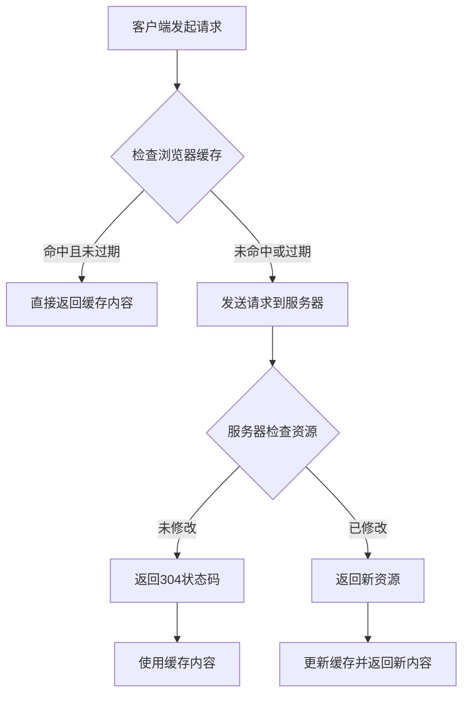

# 第7章 HTTP 缓存机制详解

## 7.1 缓存基础概念

### 7.1.1 什么是HTTP缓存
HTTP缓存是一种临时存储机制，用于保存之前请求和响应的数据副本。当客户端再次请求相同资源时，可以直接使用缓存中的副本，而无需向服务器重新发送请求。

### 7.1.2 缓存的优势
1. **减少延迟**：从本地缓存获取资源比从远程服务器获取更快
2. **降低带宽消耗**：避免重复传输相同数据
3. **减轻服务器负载**：减少服务器处理请求数量
4. **提高用户体验**：页面加载速度更快

### 7.1.3 缓存类型
1. **私有缓存**：特定用户专用，如浏览器缓存
2. **共享缓存**：多个用户共享，如代理服务器缓存
3. **网关缓存**：位于网络边缘的缓存，如CDN

## 7.2 缓存工作原理

### 7.2.1 缓存决策流程


### 7.2.2 缓存键的构成
缓存键通常由以下元素组成：
- 请求方法（GET、POST等）
- 请求URL
- Host头部
- 其他Vary指定的头部

## 7.3 缓存控制头部

### 7.3.1 Cache-Control头部
Cache-Control是最主要的缓存控制头部，可以出现在请求和响应中。

#### 响应中的Cache-Control指令：
- `public`：响应可以被任何缓存存储
- `private`：响应只能被单个用户缓存，不能被共享缓存存储
- `no-cache`：缓存需要在使用前向服务器验证
- `no-store`：禁止缓存存储任何关于请求或响应的信息
- `max-age=<seconds>`：资源最大新鲜时间（秒）
- `s-maxage=<seconds>`：覆盖max-age，仅适用于共享缓存
- `must-revalidate`：缓存过期后必须向服务器验证
- `proxy-revalidate`：类似must-revalidate，但仅适用于共享缓存

#### 请求中的Cache-Control指令：
- `no-cache`：不接受缓存的响应
- `no-store`：不存储请求或响应的任何部分
- `max-age=<seconds>`：客户端愿意接受的响应最大年龄
- `max-stale=<seconds>`：客户端愿意接受过期不超过指定秒数的响应
- `min-fresh=<seconds>`：客户端希望响应至少在指定秒数内保持新鲜

### 7.3.2 Expires头部
Expires头部指定了响应被认为过期的具体日期和时间。它是HTTP/1.0的遗留机制，在HTTP/1.1中被Cache-Control的max-age指令取代。

### 7.3.3 Pragma头部
Pragma头部主要用于向后兼容HTTP/1.0缓存，其no-cache指令与Cache-Control: no-cache具有相同的效果。

## 7.4 条件请求

### 7.4.1 Last-Modified和If-Modified-Since
Last-Modified响应头部指示资源最后修改的时间。客户端可以在后续请求中使用If-Modified-Since头部发送这个时间，服务器会比较资源的最后修改时间，如果没有变化则返回304状态码。

### 7.4.2 ETag和If-None-Match
ETag（实体标签）是一个唯一标识符，用于验证资源是否发生变化。服务器在响应中发送ETag头部，客户端在后续请求中使用If-None-Match头部发送ETag值，服务器通过比较ETag来决定是否返回304状态码。

### 7.4.3 强ETag vs 弱ETag
- **强ETag**：保证资源的每个字节都相同
- **弱ETag**：以W/开头，只保证资源语义上相等

## 7.5 Vary头部

### 7.5.1 Vary的作用
Vary头部告诉缓存如何匹配未来的请求头部，以决定是否可以使用缓存的响应。

### 7.5.2 常见的Vary值
- `Accept`：基于内容协商的Accept头部
- `Accept-Encoding`：基于压缩编码
- `Accept-Language`：基于语言偏好
- `User-Agent`：基于客户端类型

## 7.6 缓存验证

### 7.6.1 新鲜度检查
缓存通过比较资源的年龄与新鲜寿命来判断是否新鲜：
```
年龄 = max(0, now - Date_value + (now - request_time))
新鲜寿命 = max(0, (Expires_value - Date_value)) 或 max-age值
```

### 7.6.2 验证模型
1. **端到端重新验证**：客户端直接向源服务器验证
2. **层次化重新验证**：通过缓存链逐级验证

## 7.7 缓存失效策略

### 7.7.1 主动失效
通过明确的缓存清除命令或API调用来移除缓存项。

### 7.7.2 被动失效
缓存项自然过期或在需要空间时被替换算法移除。

## 7.8 缓存替换算法

### 7.8.1 LRU（最近最少使用）
移除最近最少访问的缓存项。

### 7.8.2 LFU（最不经常使用）
移除访问频率最低的缓存项。

### 7.8.3 FIFO（先进先出）
移除最早进入缓存的项。

## 7.9 实际应用案例

### 7.9.1 静态资源缓存
对于CSS、JS、图片等静态资源，通常设置较长的缓存时间，并使用版本号或内容哈希来实现缓存破坏。

### 7.9.2 API响应缓存
REST API可以根据资源的更新频率设置适当的缓存策略，结合ETag实现高效的条件请求。

### 7.9.3 动态内容缓存
对于个性化内容，需要仔细设计缓存策略，可能需要使用私有缓存或禁用缓存。

## 7.10 缓存调试技巧

### 7.10.1 浏览器开发者工具
使用浏览器的Network面板查看缓存相关的响应头部和状态码。

### 7.10.2 缓存测试工具
使用curl等工具发送带有特定缓存头部的请求来测试缓存行为。

### 7.10.3 日志分析
通过分析服务器日志来了解缓存命中率和效率。

## 7.11 最佳实践

### 7.11.1 合理设置缓存时间
- 静态资源：长时间缓存（数月到数年）
- 半静态资源：中等时间缓存（数小时到数天）
- 动态资源：短时间缓存或不缓存

### 7.11.2 使用缓存破坏技术
通过在资源URL中添加版本号或内容哈希来强制客户端获取新资源。

### 7.11.3 监控缓存效果
定期监控缓存命中率、带宽节省等指标，优化缓存策略。

## 7.12 常见问题与解决方案

### 7.12.1 缓存穿透
问题：查询不存在的数据导致大量请求直达数据库
解决方案：使用布隆过滤器或缓存空值

### 7.12.2 缓存雪崩
问题：大量缓存同时过期导致数据库压力骤增
解决方案：设置随机过期时间、使用互斥锁

### 7.12.3 缓存击穿
问题：热点数据过期瞬间大量请求直达数据库
解决方案：使用互斥锁或永不过期策略

## 7.13 总结

HTTP缓存是Web性能优化的重要手段，合理使用可以显著提升用户体验和系统性能。理解缓存的工作原理、掌握各种缓存控制机制、并根据具体场景制定合适的缓存策略是每个Web开发者必备的技能。

在实际应用中，需要综合考虑资源类型、更新频率、用户需求等因素，制定最优的缓存方案。同时要注意监控缓存效果，及时调整策略以适应业务发展需要。