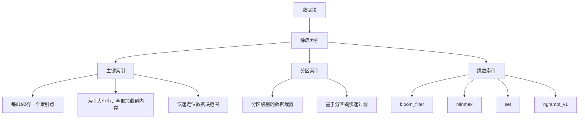

# Day 6: ClickHouse 查询优化与索引深度实战

## 学习目标 🎯
- 理解ClickHouse的索引机制和查询执行原理
- 掌握查询优化的策略和技巧
- 学会分析查询性能和瓶颈诊断
- 掌握索引设计和优化方法
- 了解查询计划分析和系统表监控

## 为什么Day 6学查询优化？ 🤔

经过前5天的学习：
- ✅ Day 1: 环境搭建 - 工具就绪
- ✅ Day 2: 理论基础 - 架构理解
- ✅ Day 3: 云端部署 - 生产环境
- ✅ Day 4: SQL语法 - 操作掌握
- ✅ Day 5: 表引擎 - 存储优化

现在学习**查询优化**，这是发挥ClickHouse性能潜力的关键！

### 学习路径回顾
```
Day 1: 环境搭建 ✅ → Day 2: 理论基础 ✅ → Day 3: 云端部署 ✅ → Day 4: SQL语法 ✅ → Day 5: 表引擎 ✅ → Day 6: 查询优化
```

## 知识要点 📚

### 1. ClickHouse索引机制深度解析

#### 1.1 稀疏索引原理

ClickHouse使用**稀疏索引**，这是其高性能的核心之一。



**稀疏索引特点**：
- **索引粒度**: 默认每8192行创建一个索引标记
- **内存占用小**: 整个索引加载到内存中
- **查询效率高**: 快速定位到包含目标数据的块
- **写入友好**: 插入数据时索引维护成本低

#### 1.2 主键索引（Primary Key Index）

```sql
-- 主键索引示例
CREATE TABLE user_events (
    user_id UInt32,
    event_time DateTime,
    event_type LowCardinality(String),
    page_url String,
    session_id String
) ENGINE = MergeTree()
ORDER BY (user_id, event_time)        -- 排序键
PRIMARY KEY (user_id, event_time)     -- 主键索引
PARTITION BY toYYYYMM(event_time);

-- 主键索引工作原理
-- 1. 数据按(user_id, event_time)排序存储
-- 2. 每8192行创建一个索引标记：(min_user_id, min_event_time)
-- 3. 查询时根据索引快速定位数据块范围
```

**主键选择原则**：
- **高频查询列**: 放在主键前面
- **基数适中**: 避免过高或过低基数
- **组合优化**: 考虑查询模式设计组合主键
- **长度限制**: 主键不宜过长（建议≤4列）

#### 1.3 分区索引（Partition Index）

```sql
-- 分区索引示例
CREATE TABLE sales_data (
    order_id UInt64,
    order_date Date,
    customer_id UInt32,
    amount Decimal(10, 2),
    region LowCardinality(String)
) ENGINE = MergeTree()
ORDER BY (customer_id, order_date)
PARTITION BY toYYYYMM(order_date);     -- 按月分区

-- 分区查询优化
-- ✅ 好的查询 - 会进行分区裁剪
SELECT sum(amount) 
FROM sales_data 
WHERE order_date >= '2024-01-01' AND order_date < '2024-02-01';

-- ❌ 差的查询 - 扫描所有分区
SELECT sum(amount) 
FROM sales_data 
WHERE customer_id = 12345;
```

**分区设计原则**：
- **查询模式**: 根据最常见的查询维度分区
- **分区数量**: 控制在合理范围（建议<1000个分区）
- **数据分布**: 每个分区大小相对均衡
- **生命周期**: 便于过期数据管理

### 2. 跳数索引（Skip Indexes）

跳数索引是ClickHouse提供的二级索引，用于进一步优化查询性能。

#### 2.1 MinMax索引

```sql
-- MinMax索引 - 存储每个数据块的最小值和最大值
ALTER TABLE user_events 
ADD INDEX idx_event_time_minmax event_time TYPE minmax GRANULARITY 4;

-- 优化查询示例
SELECT count() 
FROM user_events 
WHERE event_time >= '2024-01-01 10:00:00' 
  AND event_time <= '2024-01-01 11:00:00';
-- MinMax索引快速跳过不包含目标时间范围的数据块
```

#### 2.2 Set索引

```sql
-- Set索引 - 存储每个数据块中的唯一值集合
ALTER TABLE user_events 
ADD INDEX idx_event_type_set event_type TYPE set(100) GRANULARITY 4;

-- 优化IN查询
SELECT count() 
FROM user_events 
WHERE event_type IN ('login', 'purchase', 'logout');
-- Set索引快速判断数据块是否包含目标值
```

#### 2.3 Bloom Filter索引

```sql
-- Bloom Filter索引 - 概率性数据结构，用于快速判断元素是否存在
ALTER TABLE user_events 
ADD INDEX idx_session_bloom session_id TYPE bloom_filter() GRANULARITY 4;

-- 优化等值查询
SELECT * 
FROM user_events 
WHERE session_id = 'session_12345';
-- Bloom Filter快速排除肯定不包含目标值的数据块
```

#### 2.4 N-gram Bloom Filter索引

```sql
-- N-gram Bloom Filter - 用于字符串模糊匹配
ALTER TABLE user_events 
ADD INDEX idx_url_ngram page_url TYPE ngrambf_v1(4, 1024, 3, 0) GRANULARITY 4;

-- 优化LIKE查询
SELECT count() 
FROM user_events 
WHERE page_url LIKE '%product%';
-- N-gram索引加速字符串模式匹配
```

### 3. 查询优化策略

#### 3.1 查询执行计划分析

```sql
-- 查看查询执行计划
EXPLAIN PLAN 
SELECT 
    user_id,
    count() as event_count,
    uniq(session_id) as sessions
FROM user_events 
WHERE event_time >= '2024-01-01' 
  AND event_time < '2024-01-02'
  AND event_type = 'page_view'
GROUP BY user_id 
ORDER BY event_count DESC 
LIMIT 100;

-- 详细执行计划
EXPLAIN PIPELINE 
SELECT user_id, count() 
FROM user_events 
WHERE user_id BETWEEN 1000 AND 2000 
GROUP BY user_id;

-- 查看实际执行统计
EXPLAIN ANALYZE 
SELECT avg(user_id) 
FROM user_events 
WHERE event_time >= today() - INTERVAL 1 DAY;
```

#### 3.2 WHERE条件优化

```sql
-- ✅ 优化的WHERE条件顺序
SELECT * FROM user_events 
WHERE user_id = 12345              -- 主键条件放前面
  AND event_time >= '2024-01-01'   -- 分区条件
  AND event_type = 'purchase'      -- 其他过滤条件
  AND page_url LIKE '%checkout%';

-- ❌ 低效的WHERE条件
SELECT * FROM user_events 
WHERE page_url LIKE '%checkout%'   -- 模糊匹配放前面（低效）
  AND user_id = 12345;

-- ✅ 利用索引的范围查询
SELECT * FROM user_events 
WHERE user_id BETWEEN 1000 AND 2000 
  AND event_time >= '2024-01-01';

-- ❌ 避免使用函数破坏索引
SELECT * FROM user_events 
WHERE toYear(event_time) = 2024;   -- 破坏索引

-- ✅ 改写为范围查询
SELECT * FROM user_events 
WHERE event_time >= '2024-01-01' 
  AND event_time < '2025-01-01';
```

#### 3.3 JOIN优化策略

```sql
-- ✅ 小表在右边的JOIN
SELECT u.name, count() as events
FROM user_events e
JOIN users u ON e.user_id = u.user_id    -- users表较小，放右边
WHERE e.event_time >= today()
GROUP BY u.name;

-- ✅ 使用ANY JOIN减少重复
SELECT u.name, e.last_login
FROM users u
ANY LEFT JOIN (
    SELECT user_id, max(event_time) as last_login
    FROM user_events 
    WHERE event_type = 'login'
    GROUP BY user_id
) e ON u.user_id = e.user_id;

-- ✅ 分布式表的GLOBAL JOIN
SELECT *
FROM distributed_events e
GLOBAL JOIN dimension_table d ON e.category_id = d.id;
```

#### 3.4 GROUP BY优化

```sql
-- ✅ 按ORDER BY列分组（利用预排序）
SELECT user_id, count()
FROM user_events 
GROUP BY user_id              -- user_id是ORDER BY的第一列
ORDER BY user_id;

-- ✅ 使用低基数字段分组
SELECT event_type, count()
FROM user_events 
GROUP BY event_type           -- event_type是LowCardinality类型
ORDER BY count() DESC;

-- ✅ 预聚合优化
-- 使用SummingMergeTree预聚合日常指标
CREATE TABLE daily_user_stats (
    date Date,
    user_id UInt32,
    event_count UInt64,
    session_count UInt64
) ENGINE = SummingMergeTree((event_count, session_count))
ORDER BY (date, user_id);

-- 查询预聚合表而不是原始数据
SELECT date, sum(event_count) as total_events
FROM daily_user_stats 
WHERE date >= '2024-01-01'
GROUP BY date;
```

### 4. 性能监控与诊断

#### 4.1 系统表监控

```sql
-- 查询性能监控
SELECT 
    query,
    query_duration_ms,
    read_rows,
    read_bytes,
    memory_usage,
    query_start_time
FROM system.query_log 
WHERE type = 'QueryFinish'
  AND query_duration_ms > 1000  -- 查找慢查询
ORDER BY query_duration_ms DESC 
LIMIT 10;

-- 表的读写统计
SELECT 
    database,
    table,
    sum(rows_read) as total_rows_read,
    sum(bytes_read) as total_bytes_read,
    count() as query_count
FROM system.query_log 
WHERE type = 'QueryFinish'
  AND event_date >= today() - 1
GROUP BY database, table
ORDER BY total_bytes_read DESC;

-- 分区性能分析
SELECT 
    table,
    partition,
    rows,
    bytes_on_disk,
    primary_key_bytes_in_memory,
    marks
FROM system.parts 
WHERE active = 1
  AND table = 'user_events'
ORDER BY bytes_on_disk DESC;
```

#### 4.2 查询资源使用分析

```sql
-- CPU使用分析
SELECT 
    query,
    ProfileEvents['RealTimeMicroseconds'] / 1000000 as real_time_sec,
    ProfileEvents['UserTimeMicroseconds'] / 1000000 as user_time_sec,
    ProfileEvents['SystemTimeMicroseconds'] / 1000000 as system_time_sec,
    ProfileEvents['SoftPageFaults'] as soft_page_faults
FROM system.query_log 
WHERE type = 'QueryFinish'
  AND query_duration_ms > 5000
ORDER BY real_time_sec DESC
LIMIT 5;

-- 内存使用分析
SELECT 
    query,
    memory_usage,
    peak_memory_usage,
    read_rows,
    round(peak_memory_usage / read_rows, 2) as memory_per_row
FROM system.query_log 
WHERE type = 'QueryFinish'
  AND read_rows > 0
ORDER BY peak_memory_usage DESC
LIMIT 10;

-- I/O性能分析
SELECT 
    query,
    ProfileEvents['ReadBufferFromFileDescriptorRead'] as file_reads,
    ProfileEvents['ReadBufferFromFileDescriptorReadBytes'] as bytes_read_from_disk,
    ProfileEvents['CompressedReadBufferBlocks'] as compressed_blocks_read,
    ProfileEvents['CompressedReadBufferBytes'] as compressed_bytes_read
FROM system.query_log 
WHERE type = 'QueryFinish'
  AND query_start_time >= now() - INTERVAL 1 HOUR
ORDER BY bytes_read_from_disk DESC;
```

#### 4.3 实时性能监控

```sql
-- 当前正在执行的查询
SELECT 
    query_id,
    user,
    query,
    elapsed,
    read_rows,
    memory_usage,
    thread_ids
FROM system.processes 
WHERE query != ''
ORDER BY elapsed DESC;

-- 系统指标监控
SELECT 
    metric,
    value,
    description
FROM system.metrics 
WHERE metric IN (
    'Query',
    'InsertQuery', 
    'SelectQuery',
    'MemoryTracking',
    'BackgroundPoolTask'
);

-- 异步指标监控
SELECT 
    metric,
    value
FROM system.asynchronous_metrics 
WHERE metric IN (
    'jemalloc.resident',
    'jemalloc.active', 
    'jemalloc.mapped',
    'MaxPartCountForPartition',
    'ReplicasMaxQueueSize'
);
```

### 5. 索引设计最佳实践

#### 5.1 主键设计原则

```sql
-- ✅ 好的主键设计
CREATE TABLE web_analytics (
    user_id UInt32,           -- 高频查询字段
    event_time DateTime,      -- 时间范围查询
    event_type LowCardinality(String),
    page_url String
) ENGINE = MergeTree()
ORDER BY (user_id, event_time, event_type)  -- 查询模式驱动的排序
PRIMARY KEY (user_id, event_time);          -- 主键是ORDER BY的前缀

-- ❌ 差的主键设计
CREATE TABLE bad_example (
    id UInt64,                -- 自增ID作为主键（通常不是查询条件）
    timestamp DateTime,
    data String
) ENGINE = MergeTree()
ORDER BY id                   -- 与查询模式不匹配
PRIMARY KEY id;
```

#### 5.2 跳数索引使用指南

```sql
-- 创建综合示例表
CREATE TABLE ecommerce_events (
    event_id UInt64,
    user_id UInt32,
    event_time DateTime,
    event_type LowCardinality(String),
    product_id Nullable(UInt32),
    category_id UInt32,
    price Decimal(10, 2),
    session_id String,
    user_agent String,
    ip_address IPv4
) ENGINE = MergeTree()
ORDER BY (user_id, event_time)
PARTITION BY toYYYYMM(event_time)
PRIMARY KEY (user_id, event_time)

-- 添加针对性的跳数索引
-- 1. 时间范围查询优化
INDEX idx_time_minmax event_time TYPE minmax GRANULARITY 4

-- 2. 分类查询优化  
INDEX idx_category_set category_id TYPE set(1000) GRANULARITY 4

-- 3. 会话查询优化
INDEX idx_session_bloom session_id TYPE bloom_filter() GRANULARITY 4

-- 4. 用户代理字符串搜索优化
INDEX idx_ua_ngram user_agent TYPE ngrambf_v1(4, 1024, 3, 0) GRANULARITY 4

-- 5. 价格范围查询优化
INDEX idx_price_minmax price TYPE minmax GRANULARITY 4;
```

### 6. 查询优化实战技巧

#### 6.1 复杂分析查询优化

```sql
-- 复杂的用户行为分析查询优化

-- ❌ 未优化版本
SELECT 
    user_id,
    count() as total_events,
    uniq(session_id) as sessions,
    uniq(toDate(event_time)) as active_days,
    sum(if(event_type = 'purchase', price, 0)) as total_spent,
    avg(if(event_type = 'page_view', 1, 0)) as page_view_rate
FROM ecommerce_events 
WHERE event_time >= '2024-01-01' 
  AND event_time < '2024-02-01'
GROUP BY user_id
HAVING total_events > 10
ORDER BY total_spent DESC
LIMIT 1000;

-- ✅ 优化版本 - 使用物化视图预聚合
CREATE MATERIALIZED VIEW user_monthly_stats
ENGINE = SummingMergeTree((total_events, sessions, active_days, total_spent))
ORDER BY (month, user_id)
AS SELECT 
    toYYYYMM(event_time) as month,
    user_id,
    count() as total_events,
    uniq(session_id) as sessions,
    uniq(toDate(event_time)) as active_days,
    sum(if(event_type = 'purchase', price, 0)) as total_spent
FROM ecommerce_events 
GROUP BY month, user_id;

-- 查询优化后的物化视图
SELECT 
    user_id,
    sum(total_events) as total_events,
    sum(sessions) as sessions,
    sum(active_days) as active_days,
    sum(total_spent) as total_spent
FROM user_monthly_stats 
WHERE month = 202401  -- 2024年1月
GROUP BY user_id
HAVING total_events > 10
ORDER BY total_spent DESC
LIMIT 1000;
```

#### 6.2 时间序列查询优化

```sql
-- 时间序列聚合优化

-- ✅ 利用分区和排序键的时间查询
SELECT 
    toStartOfHour(event_time) as hour,
    count() as events,
    uniq(user_id) as unique_users,
    sum(price) as revenue
FROM ecommerce_events 
WHERE event_time >= '2024-01-01 00:00:00'
  AND event_time < '2024-01-02 00:00:00'  -- 精确时间范围
  AND event_type = 'purchase'
GROUP BY hour
ORDER BY hour;

-- ✅ 使用采样加速大数据集分析
SELECT 
    toStartOfDay(event_time) as date,
    count() * 10 as estimated_events,  -- 乘以采样率倒数
    uniq(user_id) * 10 as estimated_users
FROM ecommerce_events SAMPLE 0.1      -- 10%采样
WHERE event_time >= '2024-01-01'
  AND event_time < '2024-02-01'
GROUP BY date
ORDER BY date;
```

#### 6.3 大表JOIN优化

```sql
-- 大表JOIN优化策略

-- 创建用户维度表
CREATE TABLE users (
    user_id UInt32,
    name String,
    email String,
    registration_date Date,
    country LowCardinality(String),
    age_group LowCardinality(String)
) ENGINE = MergeTree()
ORDER BY user_id;

-- ✅ 优化的JOIN查询
SELECT 
    u.country,
    u.age_group,
    count() as events,
    uniq(e.user_id) as active_users,
    sum(e.price) as revenue
FROM ecommerce_events e
ANY LEFT JOIN users u ON e.user_id = u.user_id  -- ANY JOIN避免重复
WHERE e.event_time >= '2024-01-01'
  AND e.event_type = 'purchase'
  AND u.country = 'China'  -- 维度表过滤条件
GROUP BY u.country, u.age_group
ORDER BY revenue DESC;

-- ✅ 使用字典优化小维度表JOIN
CREATE DICTIONARY user_dict (
    user_id UInt32,
    country String,
    age_group String
) PRIMARY KEY user_id
SOURCE(CLICKHOUSE(TABLE 'users'))
LAYOUT(HASHED())
LIFETIME(3600);

-- 使用字典查询（比JOIN更快）
SELECT 
    dictGet('user_dict', 'country', user_id) as country,
    dictGet('user_dict', 'age_group', user_id) as age_group,
    count() as events,
    sum(price) as revenue
FROM ecommerce_events 
WHERE event_time >= '2024-01-01'
  AND event_type = 'purchase'
  AND dictGet('user_dict', 'country', user_id) = 'China'
GROUP BY country, age_group;
```

## 实践练习 🛠️

### 练习1：索引效果对比测试

```sql
-- 创建测试表（无索引）
CREATE TABLE test_no_index (
    id UInt64,
    user_id UInt32,
    timestamp DateTime,
    event_type String,
    url String,
    amount Decimal(10, 2)
) ENGINE = MergeTree()
ORDER BY id;

-- 创建测试表（有索引）
CREATE TABLE test_with_index (
    id UInt64,
    user_id UInt32,
    timestamp DateTime,
    event_type String,
    url String,
    amount Decimal(10, 2)
) ENGINE = MergeTree()
ORDER BY (user_id, timestamp)
PRIMARY KEY (user_id, timestamp)
PARTITION BY toYYYYMM(timestamp)
INDEX idx_event_set event_type TYPE set(100) GRANULARITY 4
INDEX idx_amount_minmax amount TYPE minmax GRANULARITY 4
INDEX idx_url_bloom url TYPE bloom_filter() GRANULARITY 4;

-- 插入相同的测试数据并对比查询性能
```

### 练习2：慢查询诊断和优化

```sql
-- 诊断慢查询
WITH slow_queries AS (
    SELECT 
        query,
        query_duration_ms,
        read_rows,
        read_bytes,
        memory_usage,
        query_start_time
    FROM system.query_log 
    WHERE type = 'QueryFinish'
      AND query_duration_ms > 5000  -- 查找超过5秒的查询
      AND event_date >= today() - 1
)
SELECT 
    left(query, 100) as query_preview,
    avg(query_duration_ms) as avg_duration,
    max(query_duration_ms) as max_duration,
    avg(read_rows) as avg_rows_read,
    count() as execution_count
FROM slow_queries
GROUP BY query_preview
ORDER BY avg_duration DESC;

-- 分析具体查询的执行细节
EXPLAIN ANALYZE 
SELECT /* 你的慢查询 */;
```

### 练习3：构建高性能分析仪表盘

运行day6的示例文件：
```bash
clickhouse-client < day6/examples/optimization-demo.sql
```

## 最佳实践总结 💡

### 1. 索引设计
- **主键优先**: 根据查询模式设计主键
- **合理长度**: 主键不宜过长（建议≤4列）
- **跳数索引**: 针对性添加二级索引
- **定期维护**: 监控索引效果，及时调整

### 2. 查询编写
- **WHERE顺序**: 主键条件 → 分区条件 → 其他条件
- **避免函数**: 不在WHERE中使用函数破坏索引
- **预聚合**: 使用物化视图预计算常用指标
- **采样查询**: 大数据集使用SAMPLE加速探索性分析

### 3. 性能监控
- **系统表**: 定期检查system.query_log
- **慢查询**: 建立慢查询监控和告警
- **资源使用**: 监控CPU、内存、I/O使用情况
- **索引效果**: 分析索引命中率和效果

### 4. 运维优化
- **分区管理**: 及时清理过期分区
- **合并监控**: 关注后台合并性能
- **存储优化**: 合理配置存储分层
- **集群平衡**: 保持集群负载均衡

## 常见问题 ❓

### Q1: 为什么添加了索引查询还是很慢？
**A**: 可能原因：
- 索引类型不匹配查询模式
- 查询条件没有利用索引顺序
- 数据倾斜导致某些分区过大
- 需要等待后台合并完成

### Q2: 如何选择合适的跳数索引？
**A**: 选择指南：
- **MinMax**: 数值范围查询
- **Set**: IN查询，集合查询
- **Bloom Filter**: 等值查询，字符串查询
- **N-gram**: LIKE模糊匹配

### Q3: 主键和ORDER BY可以不同吗？
**A**: 
- 可以不同，但主键必须是ORDER BY的前缀
- 主键用于索引，ORDER BY用于数据排序
- 通常建议主键就是ORDER BY的前几列

### Q4: 什么时候使用SAMPLE采样？
**A**: 适用场景：
- 探索性数据分析
- 大数据集的近似计算
- 仪表盘快速响应
- A/B测试分析

## 今日总结 📋

今天我们深入学习了：
- ✅ ClickHouse索引机制原理
- ✅ 主键、分区、跳数索引设计
- ✅ 查询优化策略和技巧
- ✅ 性能监控和诊断方法
- ✅ 实战优化案例分析

**下一步**: Day 7 - 数据导入导出，掌握ClickHouse的数据集成能力

---
*学习进度: Day 6/14 完成* 🎉 