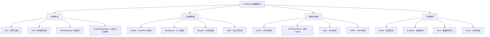

# Day 7: ClickHouse 数据导入导出全攻略

## 学习目标 🎯
- 掌握ClickHouse多种数据格式的导入导出
- 学会与各种外部数据源集成
- 理解批量数据处理和实时数据流
- 掌握数据迁移和同步策略
- 学会性能优化和最佳实践

## 为什么Day 7学数据导入导出？ 🤔

经过前6天的学习：
- ✅ Day 1: 环境搭建 - 基础设施就绪
- ✅ Day 2: 理论基础 - 架构原理清晰
- ✅ Day 3: 云端部署 - 生产环境就绪
- ✅ Day 4: SQL语法 - 基础操作熟练
- ✅ Day 5: 表引擎 - 存储机制掌握
- ✅ Day 6: 查询优化 - 性能调优精通

现在学习**数据导入导出**，这是ClickHouse实际应用的核心技能！

### 学习路径回顾
```
Day 1: 环境搭建 ✅ → Day 2: 理论基础 ✅ → Day 3: 云端部署 ✅ → Day 4: SQL语法 ✅ → Day 5: 表引擎 ✅ → Day 6: 查询优化 ✅ → Day 7: 数据导入导出
```

## 知识要点 📚

### 1. 数据导入导出概览

#### 1.1 支持的数据格式

ClickHouse支持丰富的数据格式，满足各种场景需求。



#### 1.2 数据导入导出方式

| 方式 | 用途 | 性能 | 适用场景 |
|------|------|------|----------|
| INSERT语句 | 小批量插入 | 中等 | 应用程序集成 |
| clickhouse-client | 命令行导入 | 高 | 批量数据迁移 |
| HTTP接口 | RESTful API | 高 | Web应用集成 |
| 文件导入 | 大文件处理 | 最高 | 数据仓库ETL |
| 流式导入 | 实时数据 | 高 | 实时分析 |
| 表引擎集成 | 直接连接 | 最高 | 数据湖集成 |

### 2. 文件格式导入导出

#### 2.1 CSV格式处理

```sql
-- 创建测试表
CREATE TABLE user_analytics (
    user_id UInt32,
    event_date Date,
    page_views UInt32,
    session_duration UInt32,
    country String,
    device_type String,
    revenue Decimal(10, 2)
) ENGINE = MergeTree()
ORDER BY (user_id, event_date)
PARTITION BY toYYYYMM(event_date);

-- 从CSV文件导入
-- clickhouse-client --query="INSERT INTO user_analytics FORMAT CSV" < data.csv

-- 或者使用INFILE语法（需要file()函数）
INSERT INTO user_analytics 
SELECT * FROM file('data/user_analytics.csv', 'CSV', 
    'user_id UInt32, event_date Date, page_views UInt32, 
     session_duration UInt32, country String, device_type String, revenue Decimal(10, 2)');

-- 导出到CSV
SELECT * FROM user_analytics 
WHERE event_date >= '2024-01-01'
FORMAT CSV
INTO OUTFILE 'export_data.csv';

-- 带头部的CSV导出
SELECT 'user_id', 'event_date', 'page_views', 'session_duration', 'country', 'device_type', 'revenue'
UNION ALL
SELECT toString(user_id), toString(event_date), toString(page_views), 
       toString(session_duration), country, device_type, toString(revenue)
FROM user_analytics 
FORMAT CSV;
```

#### 2.2 JSON格式处理

```sql
-- JSON格式导入
INSERT INTO user_analytics FORMAT JSONEachRow
{"user_id": 1001, "event_date": "2024-01-01", "page_views": 25, "session_duration": 1800, "country": "China", "device_type": "mobile", "revenue": 99.99}
{"user_id": 1002, "event_date": "2024-01-01", "page_views": 15, "session_duration": 1200, "country": "USA", "device_type": "desktop", "revenue": 149.99}

-- 从JSON文件导入
INSERT INTO user_analytics 
SELECT * FROM file('data/events.json', 'JSONEachRow', 
    'user_id UInt32, event_date Date, page_views UInt32, 
     session_duration UInt32, country String, device_type String, revenue Decimal(10, 2)');

-- 导出为JSON
SELECT * FROM user_analytics 
WHERE country = 'China'
FORMAT JSONEachRow;

-- 嵌套JSON处理
SELECT 
    JSONExtractUInt(raw_data, 'user_id') as user_id,
    JSONExtractString(raw_data, 'country') as country,
    JSONExtractFloat(raw_data, 'revenue') as revenue
FROM (
    SELECT '{"user_id": 1001, "country": "China", "revenue": 99.99}' as raw_data
);
```

#### 2.3 Parquet格式处理

```sql
-- Parquet是高效的列式存储格式
-- 导入Parquet文件
INSERT INTO user_analytics 
SELECT * FROM file('data/analytics.parquet', 'Parquet');

-- 导出为Parquet格式
SELECT * FROM user_analytics 
FORMAT Parquet 
INTO OUTFILE 'analytics_export.parquet';

-- Parquet格式特别适合大数据场景
-- 查看Parquet文件结构
SELECT * FROM file('data/analytics.parquet', 'Parquet') LIMIT 5;
```

### 3. 数据库集成

#### 3.1 MySQL集成

```sql
-- 创建MySQL表引擎连接
CREATE TABLE mysql_users (
    id UInt32,
    name String,
    email String,
    created_at DateTime,
    status String
) ENGINE = MySQL('mysql_host:3306', 'database_name', 'users', 'username', 'password');

-- 从MySQL导入数据到ClickHouse
INSERT INTO user_analytics 
SELECT 
    id as user_id,
    toDate(created_at) as event_date,
    0 as page_views,
    0 as session_duration,
    'Unknown' as country,
    'Unknown' as device_type,
    0.00 as revenue
FROM mysql_users 
WHERE status = 'active';

-- 使用MySQL函数进行复杂转换
CREATE TABLE mysql_orders (
    order_id UInt32,
    user_id UInt32,
    amount Decimal(10, 2),
    order_date DateTime,
    status String
) ENGINE = MySQL('mysql_host:3306', 'ecommerce', 'orders', 'user', 'pass');

-- 聚合MySQL数据导入
INSERT INTO user_analytics 
SELECT 
    user_id,
    toDate(order_date) as event_date,
    count() as page_views,
    0 as session_duration,
    'Unknown' as country,
    'Unknown' as device_type,
    sum(amount) as revenue
FROM mysql_orders 
WHERE order_date >= '2024-01-01'
GROUP BY user_id, toDate(order_date);
```

#### 3.2 PostgreSQL集成

```sql
-- PostgreSQL表引擎
CREATE TABLE postgres_events (
    event_id UInt64,
    user_id UInt32,
    event_type String,
    event_time DateTime,
    properties String
) ENGINE = PostgreSQL('postgres_host:5432', 'analytics', 'events', 'username', 'password');

-- 从PostgreSQL导入JSON数据
INSERT INTO user_analytics 
SELECT 
    user_id,
    toDate(event_time) as event_date,
    JSONExtractUInt(properties, 'page_views') as page_views,
    JSONExtractUInt(properties, 'session_duration') as session_duration,
    JSONExtractString(properties, 'country') as country,
    JSONExtractString(properties, 'device_type') as device_type,
    JSONExtractFloat(properties, 'revenue') as revenue
FROM postgres_events 
WHERE event_type = 'user_summary';
```

#### 3.3 MongoDB集成（通过外部工具）

```bash
# 使用mongoexport导出数据
mongoexport --host mongodb_host:27017 \
    --db analytics \
    --collection user_events \
    --type json \
    --out events.json

# 转换为ClickHouse可读格式
cat events.json | jq -c '{
    user_id: .user_id,
    event_date: .event_date,
    page_views: .page_views,
    session_duration: .session_duration,
    country: .country,
    device_type: .device_type,
    revenue: .revenue
}' > events_formatted.json

# 导入到ClickHouse
clickhouse-client --query="INSERT INTO user_analytics FORMAT JSONEachRow" < events_formatted.json
```

### 4. 流式数据处理

#### 4.1 Kafka集成

```sql
-- 创建Kafka表引擎
CREATE TABLE kafka_events (
    user_id UInt32,
    event_time DateTime,
    event_type String,
    page_url String,
    session_id String,
    properties String
) ENGINE = Kafka()
SETTINGS 
    kafka_broker_list = 'kafka_host:9092',
    kafka_topic_list = 'user_events',
    kafka_group_name = 'clickhouse_consumer',
    kafka_format = 'JSONEachRow',
    kafka_num_consumers = 3,
    kafka_max_block_size = 1048576;

-- 创建物化视图实现实时ETL
CREATE MATERIALIZED VIEW kafka_to_analytics AS
SELECT 
    user_id,
    toDate(event_time) as event_date,
    countIf(event_type = 'page_view') as page_views,
    maxIf(toUInt32(JSONExtractInt(properties, 'session_duration')), 
          event_type = 'session_end') as session_duration,
    any(JSONExtractString(properties, 'country')) as country,
    any(JSONExtractString(properties, 'device_type')) as device_type,
    sumIf(JSONExtractFloat(properties, 'amount'), 
          event_type = 'purchase') as revenue
FROM kafka_events 
GROUP BY user_id, toDate(event_time);

-- 目标表
CREATE TABLE real_time_analytics (
    user_id UInt32,
    event_date Date,
    page_views UInt32,
    session_duration UInt32,
    country String,
    device_type String,
    revenue Decimal(10, 2)
) ENGINE = SummingMergeTree((page_views, session_duration, revenue))
ORDER BY (user_id, event_date)
PARTITION BY toYYYYMM(event_date);

-- 创建物化视图写入目标表
CREATE MATERIALIZED VIEW kafka_consumer_mv TO real_time_analytics AS
SELECT 
    user_id,
    event_date,
    page_views,
    session_duration,
    country,
    device_type,
    revenue
FROM kafka_to_analytics;
```

#### 4.2 实时数据流处理

```sql
-- 创建Buffer表优化写入性能
CREATE TABLE analytics_buffer AS real_time_analytics
ENGINE = Buffer(currentDatabase(), real_time_analytics, 16, 10, 100, 10000, 1000000, 10000000, 100000000);

-- 应用程序写入Buffer表
INSERT INTO analytics_buffer VALUES
(1001, '2024-01-01', 10, 300, 'China', 'mobile', 50.00),
(1002, '2024-01-01', 15, 450, 'USA', 'desktop', 75.00);

-- 定期刷新Buffer
OPTIMIZE TABLE analytics_buffer;

-- 实时监控流式数据
SELECT 
    toStartOfMinute(now()) as minute,
    count() as events_per_minute,
    uniq(user_id) as unique_users,
    sum(revenue) as total_revenue
FROM analytics_buffer 
WHERE event_date = today()
GROUP BY minute
ORDER BY minute DESC
LIMIT 10;
```

### 5. 大数据集成

#### 5.1 HDFS集成

```sql
-- 从HDFS读取数据
INSERT INTO user_analytics 
SELECT * FROM hdfs('hdfs://namenode:9000/data/analytics/*.parquet', 'Parquet',
    'user_id UInt32, event_date Date, page_views UInt32, 
     session_duration UInt32, country String, device_type String, revenue Decimal(10, 2)');

-- 导出数据到HDFS
INSERT INTO FUNCTION hdfs('hdfs://namenode:9000/export/analytics_export.parquet', 'Parquet',
    'user_id UInt32, event_date Date, page_views UInt32, 
     session_duration UInt32, country String, device_type String, revenue Decimal(10, 2)')
SELECT * FROM user_analytics 
WHERE event_date >= '2024-01-01';
```

#### 5.2 S3集成

```sql
-- 从S3读取数据
INSERT INTO user_analytics 
SELECT * FROM s3('https://s3.amazonaws.com/my-bucket/data/*.csv', 'CSV',
    'user_id UInt32, event_date Date, page_views UInt32, 
     session_duration UInt32, country String, device_type String, revenue Decimal(10, 2)');

-- 导出到S3
INSERT INTO FUNCTION s3('https://s3.amazonaws.com/my-bucket/export/analytics.parquet', 
    'access_key', 'secret_key', 'Parquet',
    'user_id UInt32, event_date Date, page_views UInt32, 
     session_duration UInt32, country String, device_type String, revenue Decimal(10, 2)')
SELECT * FROM user_analytics;

-- 分区导出到S3
INSERT INTO FUNCTION s3('https://s3.amazonaws.com/my-bucket/export/year={year}/month={month}/data.parquet', 
    'access_key', 'secret_key', 'Parquet',
    'user_id UInt32, event_date Date, page_views UInt32, 
     session_duration UInt32, country String, device_type String, revenue Decimal(10, 2)')
SELECT 
    user_id, event_date, page_views, session_duration, country, device_type, revenue,
    toYear(event_date) as year,
    toMonth(event_date) as month
FROM user_analytics;
```

### 6. 性能优化技巧

#### 6.1 批量导入优化

```sql
-- 优化导入性能的设置
SET max_insert_block_size = 1048576;          -- 增加插入块大小
SET min_insert_block_size_rows = 1048576;     -- 最小插入行数
SET min_insert_block_size_bytes = 268435456;  -- 最小插入字节数
SET max_threads = 16;                         -- 增加并行线程数

-- 禁用同步写入加速导入
SET insert_quorum = 0;
SET insert_quorum_timeout = 0;

-- 批量导入大文件
INSERT INTO user_analytics 
SELECT * FROM file('/path/to/large_file.csv', 'CSV',
    'user_id UInt32, event_date Date, page_views UInt32, 
     session_duration UInt32, country String, device_type String, revenue Decimal(10, 2)')
SETTINGS 
    max_threads = 16,
    max_insert_block_size = 1048576;
```

#### 6.2 并行导入策略

```bash
#!/bin/bash
# 并行导入多个文件

# 分割大文件
split -l 1000000 large_data.csv data_chunk_

# 并行导入
for file in data_chunk_*; do
    clickhouse-client --query="INSERT INTO user_analytics FORMAT CSV" < "$file" &
done

# 等待所有任务完成
wait

echo "所有文件导入完成"
```

#### 6.3 内存优化

```sql
-- 内存优化设置
SET max_memory_usage = 20000000000;           -- 20GB内存限制
SET max_bytes_before_external_group_by = 10000000000;  -- 外部GROUP BY阈值
SET max_bytes_before_external_sort = 10000000000;      -- 外部排序阈值

-- 使用LIMIT优化大数据导出
SELECT * FROM huge_table 
WHERE event_date >= '2024-01-01'
ORDER BY user_id, event_date
LIMIT 10000000, 1000000  -- 分页导出
FORMAT Parquet;
```

### 7. 数据验证和监控

#### 7.1 数据质量检查

```sql
-- 导入后数据验证
SELECT 
    'Data Quality Report' as report_type,
    count() as total_rows,
    count(DISTINCT user_id) as unique_users,
    min(event_date) as min_date,
    max(event_date) as max_date,
    countIf(user_id = 0) as invalid_user_ids,
    countIf(event_date < '2020-01-01') as invalid_dates,
    countIf(revenue < 0) as negative_revenue,
    round(avg(revenue), 2) as avg_revenue
FROM user_analytics;

-- 数据完整性检查
WITH 
    expected_count AS (
        SELECT count() as cnt FROM source_table
    ),
    actual_count AS (
        SELECT count() as cnt FROM user_analytics
    )
SELECT 
    expected_count.cnt as expected_rows,
    actual_count.cnt as actual_rows,
    actual_count.cnt / expected_count.cnt as completion_rate
FROM expected_count, actual_count;
```

#### 7.2 导入监控

```sql
-- 监控导入进度
SELECT 
    table,
    partition,
    rows,
    bytes_on_disk,
    modification_time
FROM system.parts 
WHERE table = 'user_analytics' 
  AND modification_time >= now() - INTERVAL 1 HOUR
ORDER BY modification_time DESC;

-- 查看当前导入任务
SELECT 
    query_id,
    user,
    query,
    elapsed,
    read_rows,
    read_bytes,
    written_rows,
    written_bytes
FROM system.processes 
WHERE query LIKE '%INSERT%'
  AND query LIKE '%user_analytics%';
```

### 8. 错误处理和恢复

#### 8.1 错误处理策略

```sql
-- 设置错误容忍度
SET input_format_allow_errors_num = 1000;     -- 允许1000个错误
SET input_format_allow_errors_ratio = 0.01;   -- 允许1%的错误率

-- 跳过错误行导入
INSERT INTO user_analytics 
SELECT * FROM file('data_with_errors.csv', 'CSV',
    'user_id UInt32, event_date Date, page_views UInt32, 
     session_duration UInt32, country String, device_type String, revenue Decimal(10, 2)')
SETTINGS 
    input_format_allow_errors_num = 100,
    input_format_allow_errors_ratio = 0.05;

-- 记录错误信息
CREATE TABLE import_errors (
    timestamp DateTime DEFAULT now(),
    table_name String,
    error_message String,
    row_content String
) ENGINE = Log;
```

#### 8.2 数据备份和恢复

```sql
-- 创建备份表
CREATE TABLE user_analytics_backup AS user_analytics;

-- 增量备份
INSERT INTO user_analytics_backup 
SELECT * FROM user_analytics 
WHERE event_date >= today() - INTERVAL 1 DAY;

-- 导出备份
SELECT * FROM user_analytics_backup 
FORMAT Native 
INTO OUTFILE 'backup_20240101.native';

-- 从备份恢复
INSERT INTO user_analytics 
SELECT * FROM file('backup_20240101.native', 'Native',
    'user_id UInt32, event_date Date, page_views UInt32, 
     session_duration UInt32, country String, device_type String, revenue Decimal(10, 2)');
```

## 实践练习 🛠️

### 练习1：多格式数据导入

```sql
-- 创建综合测试表
CREATE TABLE multi_format_test (
    id UInt32,
    name String,
    timestamp DateTime,
    value Float64,
    tags Array(String)
) ENGINE = MergeTree()
ORDER BY id;

-- 测试不同格式导入
-- CSV格式
INSERT INTO multi_format_test FORMAT CSV
1,"Alice","2024-01-01 10:00:00",99.5,"['tag1','tag2']"
2,"Bob","2024-01-01 11:00:00",87.3,"['tag3']"

-- JSON格式  
INSERT INTO multi_format_test FORMAT JSONEachRow
{"id": 3, "name": "Charlie", "timestamp": "2024-01-01 12:00:00", "value": 95.7, "tags": ["tag4", "tag5"]}

-- TSV格式
INSERT INTO multi_format_test FORMAT TSV
4	David	2024-01-01 13:00:00	92.1	['tag6']
```

### 练习2：实时数据流模拟

运行day7的示例文件：
```bash
clickhouse-client < day7/examples/import-export-demo.sql
```

### 练习3：性能测试

```sql
-- 创建大数据量测试
INSERT INTO user_analytics 
SELECT 
    number % 100000 + 1 as user_id,
    toDate('2024-01-01') + toIntervalDay(number % 365) as event_date,
    (number % 50) + 1 as page_views,
    (number % 3600) + 300 as session_duration,
    ['China', 'USA', 'Japan', 'Germany', 'UK'][number % 5 + 1] as country,
    ['mobile', 'desktop', 'tablet'][number % 3 + 1] as device_type,
    round((number % 1000) * 0.99, 2) as revenue
FROM numbers(10000000);

-- 测试导出性能
SELECT count() FROM user_analytics;
SELECT * FROM user_analytics FORMAT Parquet INTO OUTFILE 'performance_test.parquet';
```

## 最佳实践总结 💡

### 1. 格式选择
- **CSV**: 简单文本数据，易于处理
- **JSON**: 半结构化数据，灵活性好
- **Parquet**: 大数据量，高压缩比
- **Native**: ClickHouse间迁移，性能最佳

### 2. 性能优化
- **批量导入**: 使用大的block_size
- **并行处理**: 多线程/多进程导入
- **内存管理**: 合理设置内存限制
- **网络优化**: 压缩传输，本地处理

### 3. 数据质量
- **预验证**: 导入前检查数据格式
- **容错机制**: 设置合理的错误容忍度
- **监控告警**: 实时监控导入状态
- **备份策略**: 重要数据及时备份

### 4. 运维管理
- **分区策略**: 按时间分区便于管理
- **清理机制**: 定期清理过期数据
- **权限控制**: 严格的数据访问权限
- **文档记录**: 完整的数据血缘关系

## 常见问题 ❓

### Q1: 导入大文件时内存不足怎么办？
**A**: 解决方案：
- 分割大文件为小文件并行导入
- 增加max_memory_usage设置
- 使用流式导入方式
- 启用外部排序和分组

### Q2: 如何处理脏数据？
**A**: 处理策略：
- 设置input_format_allow_errors_*参数
- 预处理清洗数据
- 使用Nullable类型处理缺失值
- 建立数据质量监控

### Q3: 实时导入延迟高怎么优化？
**A**: 优化方法：
- 使用Buffer表缓冲小批量写入
- 调整Kafka消费者数量
- 优化网络和磁盘I/O
- 合理设计分区策略

### Q4: 如何选择最适合的数据格式？
**A**: 选择指南：
- **数据量小**: CSV/JSON
- **数据量大**: Parquet/ORC
- **实时流**: JSONEachRow
- **ClickHouse间**: Native

## 今日总结 📋

今天我们全面学习了：
- ✅ 多种数据格式的导入导出
- ✅ 数据库和外部系统集成
- ✅ 流式数据和实时处理
- ✅ 性能优化和最佳实践
- ✅ 错误处理和监控方案

**下一步**: Day 8 - 集群管理与高可用，学习ClickHouse的分布式部署

---
*学习进度: Day 7/14 完成* 🎉 