# Day 3: 阿里云ClickHouse集群部署

## 学习目标 🎯
- 掌握阿里云基础设施部署
- 理解Terraform Infrastructure as Code
- 学会ClickHouse集群在云端的部署和配置
- 掌握云端ClickHouse集群的监控和维护

## 为什么第3天就学云端部署？ 🤔

学习顺序的设计考虑：

1. **Day 1**: 环境搭建 - 有了可用的环境
2. **Day 2**: 理论基础 - 理解了核心概念
3. **Day 3**: 云端部署 - 学会生产级部署

这样的安排让你在理论基础之上，立即体验生产环境级别的部署，对实际工作更有帮助。

### 学习路径回顾
```
Day 1: 环境搭建 ✅ → Day 2: 理论基础 ✅ → Day 3: 云端部署
```

## 知识要点 📚

### 1. 阿里云基础概念

#### 核心组件
- **ECS (Elastic Compute Service)**: 弹性计算服务
- **VPC (Virtual Private Cloud)**: 专有网络
- **SLB (Server Load Balancer)**: 负载均衡器
- **EIP (Elastic IP)**: 弹性公网IP
- **RAM (Resource Access Management)**: 访问控制

#### 网络架构
```
Internet
    |
   SLB (负载均衡器)
    |
   VPC (专有网络)
    |
 VSwitch (交换机)
    |
+---+---+---+
|   |   |   |
N1  N2  N3  ZK
```

### 2. Terraform基础

#### 什么是Terraform？
- **Infrastructure as Code (IaC)**: 基础设施即代码
- **声明式配置**: 描述所需的最终状态
- **状态管理**: 跟踪实际基础设施状态
- **计划和应用**: 预览变更后执行

#### Terraform工作流

```mermaid
graph LR
    A[编写配置] --> B[terraform init]
    B --> C[terraform plan]
    C --> D[terraform apply]
    D --> E[基础设施创建]
    E --> F[terraform destroy]
```


#### 核心概念
- **Provider**: 云服务提供商接口
- **Resource**: 基础设施资源
- **Data Source**: 查询现有资源
- **Variable**: 输入变量
- **Output**: 输出值

### 3. ClickHouse集群架构设计

#### 集群拓扑
```
负载均衡器 (SLB)
├── ClickHouse Node 1 (Shard 1, Replica 1)
├── ClickHouse Node 2 (Shard 2, Replica 1)  
├── ClickHouse Node 3 (Shard 1, Replica 2)
└── ZooKeeper Node (协调服务)
```

#### 分片和副本策略
- **2个分片**: 数据水平分割，提高查询并行度
- **1个副本**: 数据冗余，提供高可用性
- **ZooKeeper**: 副本同步协调

### 4. 安全配置

#### 网络安全
- **安全组规则**: 限制端口访问
- **VPC隔离**: 内网通信
- **SSH密钥**: 安全的远程访问

#### 访问控制
- **用户认证**: ClickHouse用户密码
- **网络限制**: IP白名单
- **加密传输**: TLS/SSL配置

## 实践操作 🛠️

### 1. 环境准备

#### 1.1 安装Terraform
```powershell
# Download Terraform
# https://www.terraform.io/downloads.html

# Verify installation
terraform version
```

#### 1.2 配置阿里云访问
```powershell
# Check AccessKey file
Get-Content C:\Users\mingbo\aliyun\AccessKey.csv

# Set environment variables (automatic)
.\infrastructure\terraform\setup_aliyun.ps1 -Action plan
```

### 2. SSH密钥生成

#### 2.1 生成密钥对
```powershell
# Generate SSH key pair
.\infrastructure\terraform\generate-ssh-key.ps1

# Check generated files
ls infrastructure\terraform\clickhouse_key*
```

#### 2.2 密钥安全
- 私钥：`clickhouse_key` (严格保密)
- 公钥：`clickhouse_key.pub` (用于服务器)

### 3. 基础设施部署

#### 3.1 初始化Terraform
```powershell
cd infrastructure\terraform
terraform init
```

#### 3.2 查看执行计划
```powershell
terraform plan
```

#### 3.3 应用配置
```powershell
terraform apply
```

#### 3.4 查看输出
```powershell
terraform output
terraform output -json
```

### 4. 集群验证

#### 4.1 连接测试
```powershell
# Get connection information
terraform output ssh_commands

# SSH connection example
ssh -i clickhouse_key ubuntu@<public_ip>
```

#### 4.2 ClickHouse测试
```sql
-- 检查版本
SELECT version();

-- 检查集群状态
SELECT * FROM system.clusters;

-- 检查副本状态
SELECT * FROM system.replicas;

-- 创建测试表
CREATE TABLE test_distributed ON CLUSTER clickhouse_cluster AS test_table
ENGINE = Distributed(clickhouse_cluster, default, test_table, cityHash64(id));
```

#### 4.3 性能测试
```bash
# 连接负载均衡器
clickhouse-client --host=<load_balancer_ip> --port=9000

# 执行性能测试
clickhouse-benchmark --host=<load_balancer_ip> --queries=1000 --concurrency=10
```

## 监控和维护 📊

### 1. 系统监控

#### 1.1 服务状态检查
```bash
# ClickHouse服务状态
sudo systemctl status clickhouse-server

# ZooKeeper服务状态  
sudo systemctl status zookeeper

# 端口监听检查
netstat -tulpn | grep -E "(8123|9000|2181)"
```

#### 1.2 资源监控
```bash
# CPU和内存使用
htop

# 磁盘使用
df -h
du -sh /data/clickhouse/

# 网络连接
ss -tunlp
```

### 2. 日志分析

#### 2.1 ClickHouse日志
```bash
# 服务日志
sudo tail -f /var/log/clickhouse-server/clickhouse-server.log

# 错误日志
sudo tail -f /var/log/clickhouse-server/clickhouse-server.err.log
```

#### 2.2 ZooKeeper日志
```bash
# ZooKeeper日志
sudo tail -f /opt/zookeeper/logs/zookeeper.log
```

### 3. 备份策略

#### 3.1 数据备份
```sql
-- 创建备份
BACKUP TABLE test_table TO Disk('backups', 'backup_20231201.zip');

-- 恢复备份
RESTORE TABLE test_table FROM Disk('backups', 'backup_20231201.zip');
```

#### 3.2 配置备份
```bash
# 备份配置文件
sudo cp -r /etc/clickhouse-server/ /backup/config/$(date +%Y%m%d)/
```

## 故障排除 🔧

### 1. 常见问题

#### 1.1 连接问题
- **症状**: 无法连接到ClickHouse
- **检查**: 安全组、服务状态、网络配置
- **解决**: 开放端口、重启服务

#### 1.2 集群同步问题
- **症状**: 副本数据不一致
- **检查**: ZooKeeper连接、网络延迟
- **解决**: 重新同步副本

#### 1.3 性能问题
- **症状**: 查询缓慢
- **检查**: 系统资源、查询计划
- **解决**: 优化配置、添加索引

### 2. 健康检查脚本

#### 2.1 自动化检查
```bash
# ClickHouse健康检查
/usr/local/bin/clickhouse-health-check.sh

# ZooKeeper健康检查
/usr/local/bin/zookeeper-health-check.sh
```

## 成本优化 💰

### 1. 资源优化

#### 1.1 实例规格选择
- **开发环境**: ecs.t6-c2m1.large (2核2G)
- **测试环境**: ecs.c6.large (2核4G)
- **生产环境**: ecs.c6.xlarge (4核8G)

#### 1.2 存储优化
- **系统盘**: 高效云盘 40GB
- **数据盘**: 高效云盘 100GB-1TB
- **备份**: 对象存储OSS

### 2. 网络优化

#### 2.1 带宽配置
- **按使用流量**: 适合测试环境
- **固定带宽**: 适合生产环境
- **共享带宽**: 多实例场景

## 安全最佳实践 🔒

### 1. 访问控制

#### 1.1 最小权限原则
- **RAM用户**: 分配最小必需权限
- **临时凭证**: 使用STS临时访问
- **密钥轮换**: 定期更换AccessKey

#### 1.2 网络隔离
- **VPC**: 使用专有网络
- **安全组**: 严格的端口规则
- **白名单**: IP访问限制

### 2. 数据保护

#### 2.1 加密
- **传输加密**: TLS/SSL
- **存储加密**: 云盘加密
- **备份加密**: 加密备份文件

#### 2.2 审计
- **访问日志**: 记录所有访问
- **操作审计**: ActionTrail
- **配置监控**: Config规则

## 扩展阅读 📖

### 1. 官方文档
- [阿里云ECS文档](https://help.aliyun.com/product/25365.html)
- [Terraform阿里云Provider](https://registry.terraform.io/providers/aliyun/alicloud/latest/docs)
- [ClickHouse集群配置](https://clickhouse.com/docs/en/engines/table-engines/mergetree-family/replication)

### 2. 最佳实践
- [阿里云架构最佳实践](https://help.aliyun.com/document_detail/102444.html)
- [ClickHouse性能调优](https://clickhouse.com/docs/en/operations/performance-optimization/)

## 作业练习 📝

### 1. 基础练习
1. 完成阿里云ClickHouse集群部署
2. 验证集群功能正常
3. 执行性能测试

### 2. 进阶练习
1. 配置集群监控
2. 实施数据备份策略
3. 模拟故障恢复

### 3. 思考题
1. 如何设计高可用的ClickHouse集群？
2. 云端部署相比本地部署有什么优势？
3. 如何在成本和性能之间找到平衡？

## 总结 📋

今天我们学习了：
- ✅ 阿里云基础设施概念
- ✅ Terraform Infrastructure as Code
- ✅ ClickHouse集群云端部署
- ✅ 监控维护和故障排除
- ✅ 安全最佳实践

**下一步**: Day 9 - ClickHouse性能优化和调优

---
*学习进度: Day 8/14 完成* 🎉