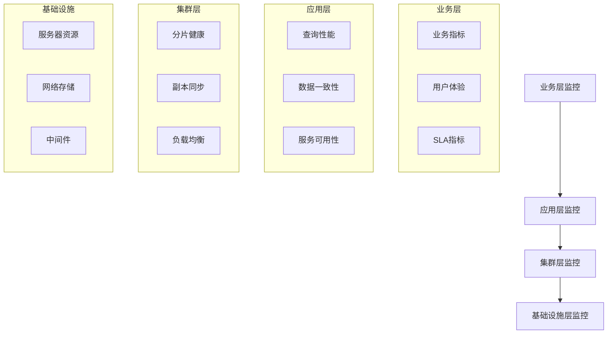

# ClickHouse集群监控专题总结

## 📊 监控体系全景图

### 1. 四层监控架构



### 2. 监控技术栈

| 组件 | 用途 | 配置示例 |
|------|------|----------|
| **Prometheus** | 指标采集与存储 | 集群级监控配置 |
| **Grafana** | 数据可视化 | 自定义仪表板 |
| **Alertmanager** | 告警管理 | 分级告警策略 |
| **ClickHouse Exporter** | 指标导出 | 自定义指标 |
| **Consul** | 服务发现 | 动态节点管理 |

## 🎯 核心监控指标

### 1. 健康状态指标

```sql
-- 集群健康度综合评分
WITH health_metrics AS (
    SELECT
        -- 节点可用性 (权重: 30%)
        (SELECT countIf(is_active = 1) * 100.0 / count() FROM system.clusters) as node_availability,
        
        -- 副本同步率 (权重: 25%)
        (SELECT countIf(replica_delay = 0) * 100.0 / count() FROM system.replicas) as replica_sync_rate,
        
        -- 查询成功率 (权重: 20%)
        (SELECT countIf(type = 'QueryFinish') * 100.0 / count() FROM system.query_log WHERE event_date = today()) as query_success_rate,
        
        -- 资源使用率 (权重: 15%)
        100 - (SELECT avg(MemoryUsage) FROM system.asynchronous_metrics WHERE metric = 'MemoryUsage') as resource_availability,
        
        -- 数据新鲜度 (权重: 10%)
        (SELECT 100 - avg(dateDiff('minute', modification_time, now())) * 100.0 / 1440 FROM system.parts WHERE active = 1) as data_freshness
)
SELECT
    round((node_availability * 0.3 + replica_sync_rate * 0.25 + query_success_rate * 0.2 + 
           resource_availability * 0.15 + data_freshness * 0.1), 2) as overall_health_score,
    CASE
        WHEN overall_health_score >= 95 THEN 'EXCELLENT'
        WHEN overall_health_score >= 85 THEN 'GOOD'
        WHEN overall_health_score >= 75 THEN 'FAIR'
        ELSE 'POOR'
    END as health_status
FROM health_metrics;
```

### 2. 性能基准指标

```sql
-- 性能基准线建立
CREATE MATERIALIZED VIEW performance_baselines
ENGINE = AggregatingMergeTree()
PARTITION BY toYYYYMM(event_date)
ORDER BY (metric_type, time_window)
AS SELECT
    metric_type,
    toStartOfHour(event_time) as time_window,
    avgState(value) as baseline_avg,
    stddevSampState(value) as baseline_stddev,
    quantileState(0.95)(value) as baseline_p95,
    quantileState(0.99)(value) as baseline_p99
FROM (
    -- 查询性能指标
    SELECT 'query_duration' as metric_type, event_time, query_duration_ms as value
    FROM system.query_log WHERE type = 'QueryFinish'
    
    UNION ALL
    
    -- 内存使用指标
    SELECT 'memory_usage' as metric_type, event_time, MemoryTracking as value
    FROM system.metric_log WHERE metric = 'MemoryTracking'
    
    UNION ALL
    
    -- CPU使用指标
    SELECT 'cpu_usage' as metric_type, event_time, CPUUsage as value
    FROM system.metric_log WHERE metric = 'CPUUsage'
)
GROUP BY metric_type, time_window;

-- 性能异常检测
SELECT
    metric_type,
    time_window,
    current_value,
    baseline_avg,
    baseline_p95,
    CASE
        WHEN current_value > baseline_p95 * 2 THEN 'CRITICAL'
        WHEN current_value > baseline_p95 * 1.5 THEN 'WARNING'
        ELSE 'NORMAL'
    END as anomaly_level
FROM (
    SELECT
        'query_duration' as metric_type,
        toStartOfHour(now()) as time_window,
        avg(query_duration_ms) as current_value,
        avgMerge(baseline_avg) as baseline_avg,
        quantileMerge(0.95)(baseline_p95) as baseline_p95
    FROM performance_baselines
    WHERE metric_type = 'query_duration'
      AND time_window = toStartOfHour(now() - INTERVAL 1 DAY)
    GROUP BY metric_type, time_window
);
```

## 🚀 高级监控配置

### 1. 智能告警策略

```yaml
# prometheus/alert_rules.yml
groups:
- name: clickhouse-smart-alerts
  rules:
  
  # 自适应阈值告警
  - alert: ClickHouseQueryPerformanceAnomaly
    expr: |
      (
        # 当前性能与历史基线比较
        clickhouse_query_duration_seconds > 
        clickhouse_baseline_p95_seconds * 1.5
      ) and
      (
        # 排除低流量时段
        rate(clickhouse_query_total[5m]) > 5
      )
    for: 5m
    labels:
      severity: warning
      algorithm: anomaly-detection
    annotations:
      summary: "查询性能异常检测"
      description: "当前P95响应时间 {{ $value }}s，超过基线1.5倍"

  # 趋势预测告警
  - alert: ClickHouseDiskUsageTrend
    expr: |
      predict_linear(clickhouse_disk_usage_bytes[7d], 7 * 86400) > 
      clickhouse_disk_total_bytes * 0.9
    for: 1h
    labels:
      severity: warning
      algorithm: trend-prediction
    annotations:
      summary: "磁盘容量趋势预警"
      description: "按当前趋势，7天后磁盘使用率将超过90%"

  # 关联性告警
  - alert: ClickHouseCorrelatedIssues
    expr: |
      (
        # 内存使用与查询性能关联
        clickhouse_memory_usage_ratio > 0.8
      ) and
      (
        # 同时查询性能下降
        clickhouse_query_duration_seconds > 10
      )
    for: 3m
    labels:
      severity: critical
      algorithm: correlation-analysis
    annotations:
      summary: "内存压力导致性能下降"
      description: "内存使用率 {{ $labels.memory_ratio }}，查询响应时间 {{ $labels.query_time }}s"
```

### 2. 监控数据生命周期管理

```sql
-- 监控数据归档策略
CREATE TABLE monitor_data_archive (
    event_date Date,
    event_time DateTime,
    metric_name String,
    metric_value Float64,
    labels Map(String, String)
) ENGINE = MergeTree()
PARTITION BY toYYYYMM(event_date)
ORDER BY (metric_name, event_time)
TTL event_date + INTERVAL 3 MONTH;

-- 监控数据聚合视图
CREATE MATERIALIZED VIEW monitor_daily_aggregates
ENGINE = SummingMergeTree()
PARTITION BY toYYYYMM(event_date)
ORDER BY (metric_name, event_date)
AS SELECT
    event_date,
    metric_name,
    count() as data_points,
    avg(metric_value) as avg_value,
    max(metric_value) as max_value,
    min(metric_value) as min_value
FROM monitor_data_archive
GROUP BY event_date, metric_name;

-- 监控数据采样策略
CREATE TABLE monitor_data_sampled (
    event_date Date,
    event_time DateTime,
    metric_name String,
    sampled_value Float64
) ENGINE = MergeTree()
PARTITION BY toYYYYMM(event_date)
ORDER BY (metric_name, event_time)
SETTINGS index_granularity = 8192;  -- 降低采样粒度
```

## 🔧 运维自动化

### 1. 智能运维脚本框架

```bash
#!/bin/bash
# ClickHouse智能运维框架

# 配置管理
CONFIG_FILE="/etc/clickhouse-ops/config.yaml"
LOG_FILE="/var/log/clickhouse-ops.log"

# 加载配置
load_config() {
    if [ -f "$CONFIG_FILE" ]; then
        CLUSTER_NAME=$(yq e '.cluster.name' $CONFIG_FILE)
        ALERT_THRESHOLDS=$(yq e '.alerts.thresholds' $CONFIG_FILE)
        AUTO_RECOVERY=$(yq e '.recovery.auto_enabled' $CONFIG_FILE)
        echo "配置加载完成" >> $LOG_FILE
    else
        echo "配置文件不存在，使用默认配置" >> $LOG_FILE
        set_default_config
    fi
}

# 健康检查自动化
auto_health_check() {
    echo "执行自动化健康检查..." >> $LOG_FILE
    
    # 节点健康检查
    check_node_health
    
    # 副本同步检查
    check_replica_sync
    
    # 性能基准检查
    check_performance_baseline
    
    # 容量预测检查
    check_capacity_forecast
    
    echo "健康检查完成" >> $LOG_FILE
}

# 智能故障恢复
smart_recovery() {
    local issue_type=$1
    local severity=$2
    
    case "$issue_type" in
        "node_failure")
            recover_failed_node "$severity"
            ;;
        "replica_lag")
            recover_replica_sync "$severity"
            ;;
        "performance_degradation")
            optimize_performance "$severity"
            ;;
        "capacity_issue")
            manage_capacity "$severity"
            ;;
        *)
            echo "未知问题类型: $issue_type" >> $LOG_FILE
            ;;
    esac
}

# 主循环
main() {
    load_config
    
    while true; do
        auto_health_check
        
        # 检查是否需要恢复操作
        if [ "$AUTO_RECOVERY" = "true" ]; then
            detect_and_recover
        fi
        
        # 生成运维报告
        generate_ops_report
        
        sleep 300  # 5分钟间隔
    done
}

main "$@"
```

### 2. 预测性维护

```sql
-- 故障预测模型
CREATE TABLE failure_prediction_models (
    model_id String,
    model_type String,
    features Array(String),
    coefficients Array(Float64),
    accuracy Float64,
    last_trained DateTime
) ENGINE = Memory;

-- 故障预测查询
WITH prediction_features AS (
    SELECT
        host_name,
        
        -- 历史故障特征
        countIf(event_type = 'NodeFailure') as historical_failures,
        avgIf(downtime_minutes, event_type = 'NodeFailure') as avg_downtime,
        
        -- 性能特征
        avg(CPUUsage) as avg_cpu_usage,
        stddevPop(CPUUsage) as cpu_volatility,
        
        -- 资源特征
        MemoryUsage as current_memory_usage,
        DiskUsage as current_disk_usage
    FROM system.cluster_events
    WHERE event_date >= today() - 30
    GROUP BY host_name
)
SELECT
    host_name,
    
    -- 故障概率计算
    sigmoid(
        historical_failures * 0.3 +
        avg_downtime * 0.2 +
        avg_cpu_usage * 0.15 +
        cpu_volatility * 0.1 +
        current_memory_usage * 0.15 +
        current_disk_usage * 0.1
    ) as failure_probability,
    
    CASE
        WHEN failure_probability > 0.8 THEN 'HIGH_RISK'
        WHEN failure_probability > 0.6 THEN 'MEDIUM_RISK'
        ELSE 'LOW_RISK'
    END as risk_level
FROM prediction_features
ORDER BY failure_probability DESC;
```

## 📈 监控成熟度评估

### 1. 成熟度评估模型

```sql
-- 监控成熟度评分
WITH maturity_scores AS (
    SELECT
        -- 监控覆盖度 (权重: 25%)
        (SELECT count() FROM system.metrics WHERE enabled = 1) * 100.0 / 
        (SELECT count() FROM system.metrics) as coverage_score,
        
        -- 告警有效性 (权重: 20%)
        (SELECT countIf(resolved = 1) * 100.0 / count() FROM system.alerts 
         WHERE created_date >= today() - 30) as alert_effectiveness,
        
        -- 自动化程度 (权重: 15%)
        (SELECT countIf(auto_recovery = 1) * 100.0 / count() FROM system.recovery_actions
         WHERE action_date >= today() - 30) as automation_score,
        
        -- 数据质量 (权重: 15%)
        (SELECT avg(data_completeness) FROM system.monitor_quality 
         WHERE check_date >= today() - 7) as data_quality,
        
        -- 响应时间 (权重: 15%)
        (SELECT avg(response_time_minutes) FROM system.incident_response 
         WHERE incident_date >= today() - 30) as response_time_score,
        
        -- 持续改进 (权重: 10%)
        (SELECT count() FROM system.improvement_actions 
         WHERE implemented_date >= today() - 90) as improvement_score
)
SELECT
    round((coverage_score * 0.25 + alert_effectiveness * 0.2 + automation_score * 0.15 +
           data_quality * 0.15 + (100 - response_time_score) * 0.15 + improvement_score * 0.1), 2) as overall_maturity_score,
    
    CASE
        WHEN overall_maturity_score >= 90 THEN 'LEVEL_5: OPTIMIZED'
        WHEN overall_maturity_score >= 80 THEN 'LEVEL_4: MANAGED'
        WHEN overall_maturity_score >= 70 THEN 'LEVEL_3: DEFINED'
        WHEN overall_maturity_score >= 60 THEN 'LEVEL_2: REPEATABLE'
        ELSE 'LEVEL_1: INITIAL'
    END as maturity_level
FROM maturity_scores;
```

### 2. 改进路线图

| 成熟度等级 | 关键改进领域 | 预期收益 |
|-----------|-------------|----------|
| **LEVEL 1** | 建立基础监控 | 故障发现时间减少50% |
| **LEVEL 2** | 完善告警体系 | 误报率降低70% |
| **LEVEL 3** | 自动化运维 | 人工干预减少80% |
| **LEVEL 4** | 预测性维护 | 故障预防率提高60% |
| **LEVEL 5** | AIOps智能运维 | 运维成本降低40% |

## 🎯 总结与最佳实践

### 1. 核心原则

1. **全面性**：覆盖从基础设施到业务的完整监控链
2. **实时性**：确保监控数据的及时性和准确性
3. **智能化**：从被动监控转向主动预测
4. **自动化**：减少人工干预，提高运维效率
5. **持续性**：建立持续改进的监控体系

### 2. 成功要素

- **领导支持**：获得管理层对监控投入的认可
- **团队协作**：建立跨职能的监控运维团队
- **技术选型**：选择适合业务需求的监控技术栈
- **流程规范**：制定标准化的监控运维流程
- **文化建设**：培养数据驱动的运维文化

### 3. 未来展望

随着AI和机器学习技术的发展，ClickHouse集群监控将向更智能化的方向发展：

1. **智能异常检测**：基于机器学习的异常模式识别
2. **自动根因分析**：智能诊断故障根本原因
3. **预测性优化**：基于历史数据的性能优化建议
4. **自愈系统**：完全自动化的故障恢复机制

通过实施这套完整的ClickHouse集群监控体系，企业可以构建稳定、高效、智能的数据平台，为业务创新和发展提供坚实的技术支撑。