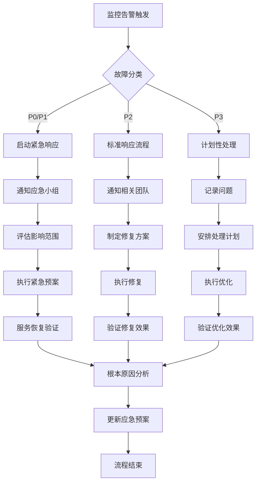

# ClickHouse集群故障处理与应急预案

## 1. 故障分类与响应流程

### 1.1 故障严重程度分类

| 严重程度 | 影响范围 | 响应时间 | 处理目标 |
|----------|----------|----------|----------|
| **P0 - 灾难性** | 整个集群不可用，数据丢失风险 | <15分钟 | 立即恢复服务，防止数据丢失 |
| **P1 - 严重** | 多个分片故障，业务严重受影响 | <30分钟 | 快速恢复核心业务 |
| **P2 - 重要** | 单个分片故障，部分业务受影响 | <2小时 | 恢复正常服务 |
| **P3 - 一般** | 性能下降，不影响核心业务 | <4小时 | 优化性能 |

### 1.2 故障响应流程



## 2. 常见故障场景与处理方案

### 2.1 节点故障处理

**场景1：单个节点宕机**
```bash
# 1. 确认节点状态
ssh <故障节点> "systemctl status clickhouse-server"

# 2. 检查服务日志
ssh <故障节点> "tail -100 /var/log/clickhouse-server/clickhouse-server.log"

# 3. 尝试重启服务
ssh <故障节点> "systemctl restart clickhouse-server"

# 4. 监控重启过程
sleep 30
ssh <故障节点> "systemctl is-active clickhouse-server"

# 5. 检查副本同步状态
clickhouse-client --query="
SELECT 
    database, table, replica_name, replica_delay, is_active
FROM system.replicas 
WHERE host_name = '<故障节点>'"

# 6. 如果重启失败，启用备用节点
# 修改集群配置，将流量切换到备用节点
```

**场景2：多个节点同时故障**
```bash
# 紧急处理步骤
# 1. 立即通知所有相关人员
send_emergency_alert "多个ClickHouse节点故障"

# 2. 评估影响范围
clickhouse-client --query="
SELECT 
    shard_num,
    countIf(is_active = 1) as active_nodes,
    count() as total_nodes,
    CASE 
        WHEN active_nodes = 0 THEN 'CRITICAL'
        WHEN active_nodes < total_nodes/2 THEN 'SEVERE' 
        ELSE 'DEGRADED'
    END as status
FROM system.clusters 
WHERE cluster = 'production'
GROUP BY shard_num"

# 3. 优先恢复核心业务分片
# 检查核心业务表所在分片
clickhouse-client --query="
SELECT DISTINCT shard_num
FROM system.parts 
WHERE database = 'core_business' AND active = 1"

# 4. 执行分片级故障转移
# 修改分布式表配置，排除故障分片
```

### 2.2 副本同步问题处理

**场景1：副本延迟过高**
```sql
-- 1. 识别延迟副本
SELECT 
    database,
    table, 
    replica_name,
    replica_delay,
    queue_size,
    is_readonly,
    is_session_expired
FROM system.replicas
WHERE replica_delay > 300
ORDER BY replica_delay DESC;

-- 2. 分析延迟原因
-- 检查网络延迟
ping -c 10 <延迟副本IP>

-- 检查磁盘IO
ssh <延迟副本> "iostat -x 1 10"

-- 检查ZooKeeper连接
ssh <延迟副本> "netstat -an | grep 2181"

-- 3. 执行同步修复
-- 强制同步副本
SYSTEM SYNC REPLICA <database>.<table>;

-- 如果同步失败，重建副本
-- 从健康副本复制数据
```

**场景2：副本数据不一致**
```sql
-- 1. 检查数据一致性
SELECT 
    database,
    table,
    replica_name,
    parts_count,
    rows_count,
    bytes_count
FROM (
    SELECT 
        database,
        table,
        replica_name,
        count() as parts_count,
        sum(rows) as rows_count,
        sum(bytes) as bytes_count
    FROM clusterAllReplicas('production', system.parts)
    WHERE active = 1
    GROUP BY database, table, replica_name
)
ORDER BY database, table, replica_name;

-- 2. 识别不一致的表
WITH replica_stats AS (
    SELECT 
        database,
        table,
        replica_name,
        sum(rows) as total_rows
    FROM clusterAllReplicas('production', system.parts)
    WHERE active = 1
    GROUP BY database, table, replica_name
)
SELECT 
    database,
    table,
    max(total_rows) - min(total_rows) as row_difference,
    count(DISTINCT total_rows) as unique_row_counts
FROM replica_stats
GROUP BY database, table
HAVING row_difference > 0;

-- 3. 修复数据不一致
-- 方法1：重新同步副本
SYSTEM SYNC REPLICA <database>.<table>;

-- 方法2：手动修复数据
-- 从健康副本导出数据，导入到问题副本
```

### 2.3 ZooKeeper相关问题处理

**场景1：ZooKeeper连接中断**
```bash
# 1. 检查ZooKeeper集群状态
zkCli.sh -server <zk_host:port> ls /

# 2. 检查ClickHouse与ZooKeeper连接
clickhouse-client --query="
SELECT 
    name,
    value,
    description
FROM system.zookeeper
WHERE path = '/'
LIMIT 10"

# 3. 重启ZooKeeper连接
SYSTEM RESTART REPLICAS;

# 4. 如果ZooKeeper集群故障，启用本地模式
# 修改配置使用本地元数据存储
```

**场景2：ZooKeeper节点数据损坏**
```bash
# 1. 备份ZooKeeper数据
zk_backup.sh --backup-dir /backup/zk-$(date +%Y%m%d)

# 2. 检查数据完整性
zk_data_check.sh --zk-host <zk_host>

# 3. 修复损坏节点
# 从备份恢复数据
zk_restore.sh --backup-file /backup/zk-latest/backup.zk

# 4. 重启ZooKeeper服务
systemctl restart zookeeper
```

## 3. 性能问题处理

### 3.1 查询性能下降

**诊断步骤**：
```sql
-- 1. 识别慢查询
SELECT 
    query_start_time,
    query_duration_ms,
    read_rows,
    read_bytes,
    memory_usage,
    user,
    initial_address,
    substring(query, 1, 200) as query_preview
FROM system.query_log
WHERE event_date = today()
  AND type = 'QueryFinish'
  AND query_duration_ms > 10000
ORDER BY query_duration_ms DESC
LIMIT 20;

-- 2. 分析查询执行计划
EXPLAIN 
SELECT ...  -- 替换为实际慢查询

-- 3. 检查系统资源
SELECT 
    metric,
    value,
    event_time
FROM system.metric_log
WHERE event_date = today()
  AND metric IN ('CPUUsage', 'MemoryUsage', 'DiskUsage')
ORDER BY event_time DESC
LIMIT 30;

-- 4. 检查表统计信息
SELECT 
    database,
    table,
    sum(rows) as total_rows,
    formatReadableSize(sum(bytes)) as total_size,
    uniq(partition) as partition_count
FROM system.parts
WHERE active = 1
GROUP BY database, table
ORDER BY total_rows DESC
LIMIT 20;
```

**优化措施**：
```sql
-- 1. 创建合适的索引
ALTER TABLE <table> ADD INDEX <index_name> (<columns>) TYPE <type>;

-- 2. 优化表结构
OPTIMIZE TABLE <table> FINAL;

-- 3. 调整查询设置
-- 增加内存限制
SET max_memory_usage = 10000000000;

-- 4. 数据分区优化
-- 检查分区策略
SELECT 
    partition,
    count() as part_count,
    sum(rows) as total_rows
FROM system.parts
WHERE database = '<db>' AND table = '<table>' AND active = 1
GROUP BY partition
ORDER BY total_rows DESC;
```

### 3.2 内存使用过高

**诊断与处理**：
```sql
-- 1. 检查内存使用情况
SELECT 
    metric,
    value,
    formatReadableSize(value) as readable_size
FROM system.asynchronous_metrics
WHERE metric LIKE '%Memory%'
ORDER BY value DESC
LIMIT 10;

-- 2. 识别内存消耗大的查询
SELECT 
    query_start_time,
    query_duration_ms,
    memory_usage,
    read_rows,
    user,
    substring(query, 1, 100) as query_preview
FROM system.query_log
WHERE event_date = today()
  AND memory_usage > 1000000000  -- 1GB
ORDER BY memory_usage DESC
LIMIT 20;

-- 3. 检查缓存效率
SELECT 
    MarkCacheHits,
    MarkCacheMisses,
    round(MarkCacheHits * 100.0 / (MarkCacheHits + MarkCacheMisses), 2) as hit_rate
FROM system.events
WHERE event = 'MarkCache';
```

**内存优化措施**：
```sql
-- 1. 调整内存配置
-- 修改配置文件增加内存限制
<max_memory_usage>10000000000</max_memory_usage>
<max_bytes_before_external_group_by>5000000000</max_bytes_before_external_group_by>

-- 2. 优化查询内存使用
-- 使用更高效的数据类型
-- 避免大表全表扫描
-- 使用合适的聚合函数

-- 3. 清理缓存
SYSTEM DROP MARK CACHE;
SYSTEM DROP UNCOMPRESSED CACHE;
```

## 4. 数据恢复与备份

### 4.1 数据备份策略

**全量备份**：
```bash
#!/bin/bash
# ClickHouse全量备份脚本

BACKUP_DIR="/backup/clickhouse/full-$(date +%Y%m%d)"
LOG_FILE="/var/log/clickhouse-backup.log"

# 创建备份目录
mkdir -p $BACKUP_DIR

# 执行全量备份
clickhouse-backup create \
    --config /etc/clickhouse-backup/config.yml \
    full_backup_$(date +%Y%m%d) \
    >> $LOG_FILE 2>&1

# 验证备份完整性
clickhouse-backup list \
    --config /etc/clickhouse-backup/config.yml \
    >> $LOG_FILE

# 上传到远程存储（可选）
rsync -av $BACKUP_DIR/ backup-server:/clickhouse-backups/

# 清理旧备份（保留最近7天）
find /backup/clickhouse/ -name "full-*" -type d -mtime +7 -exec rm -rf {} \;

echo "全量备份完成: $(date)" >> $LOG_FILE
```

**增量备份**：
```bash
#!/bin/bash
# ClickHouse增量备份脚本

BACKUP_DIR="/backup/clickhouse/incremental-$(date +%Y%m%d-%H%M)"
LOG_FILE="/var/log/clickhouse-backup.log"

# 创建备份目录
mkdir -p $BACKUP_DIR

# 执行增量备份
clickhouse-backup create \
    --config /etc/clickhouse-backup/config.yml \
    --incremental \
    incremental_backup_$(date +%Y%m%d-%H%M) \
    >> $LOG_FILE 2>&1

# 验证备份
clickhouse-backup list \
    --config /etc/clickhouse-backup/config.yml \
    >> $LOG_FILE

echo "增量备份完成: $(date)" >> $LOG_FILE
```

### 4.2 数据恢复流程

**全量恢复**：
```bash
#!/bin/bash
# ClickHouse数据恢复脚本

BACKUP_NAME="full_backup_20231201"
LOG_FILE="/var/log/clickhouse-restore.log"

# 停止ClickHouse服务（生产环境谨慎使用）
systemctl stop clickhouse-server

# 执行恢复
clickhouse-backup restore \
    --config /etc/clickhouse-backup/config.yml \
    $BACKUP_NAME \
    >> $LOG_FILE 2>&1

# 启动ClickHouse服务
systemctl start clickhouse-server

# 等待服务启动
sleep 30

# 验证恢复结果
clickhouse-client --query="
SELECT 
    database,
    count() as table_count,
    sum(rows) as total_rows
FROM system.tables 
WHERE database NOT IN ('system')
GROUP BY database"

echo "数据恢复完成: $(date)" >> $LOG_FILE
```

**表级恢复**：
```sql
-- 从备份恢复特定表
-- 方法1：使用ATTACH TABLE
ATTACH TABLE database.table_name FROM '/backup/path/table_name/';

-- 方法2：使用INSERT SELECT
-- 先从备份导出数据
clickhouse-client --query="SELECT * FROM database.table_name" --format Native > backup_data.bin

-- 然后导入到新表
clickhouse-client --query="INSERT INTO database.table_name FORMAT Native" < backup_data.bin
```

## 5. 应急预案与演练

### 5.1 应急预案制定

**关键要素**：
- 应急联系人清单
- 故障分类标准
- 处理流程文档
- 恢复时间目标(RTO)
- 数据恢复点目标(RPO)

**应急联系人矩阵**：
| 角色 | 姓名 | 电话 | 邮箱 | 职责 |
|------|------|------|------|------|
| 应急负责人 | 张三 | 138****1234 | zhangsan@company.com | 总体协调 |
| 技术负责人 | 李四 | 139****5678 | lisi@company.com | 技术决策 |
| DBA | 王五 | 136****9012 | wangwu@company.com | 数据库操作 |
| 运维 | 赵六 | 137****3456 | zhaoliu@company.com | 基础设施 |

### 5.2 定期演练计划

**演练类型**：
1. **桌面演练**：讨论应急流程，不实际操作
2. **功能演练**：测试特定功能恢复
3. **全流程演练**：模拟真实故障场景

**演练脚本示例**：
```bash
#!/bin/bash
# ClickHouse故障演练脚本

echo "开始ClickHouse故障演练: $(date)"

# 模拟节点故障
NODE_TO_FAIL="clickhouse-node-3"
echo "模拟节点 $NODE_TO_FAIL 故障..."

# 停止节点服务
ssh $NODE_TO_FAIL "systemctl stop clickhouse-server"

# 等待监控告警触发
sleep 120

# 验证应急响应
# 1. 检查告警是否触发
# 2. 检查应急小组是否收到通知
# 3. 验证故障处理流程

# 执行恢复操作
echo "执行恢复操作..."
ssh $NODE_TO_FAIL "systemctl start clickhouse-server"

# 验证恢复结果
sleep 60
clickhouse-client --query="
SELECT 
    shard_num,
    host_name,
    is_active
FROM system.clusters 
WHERE cluster = 'production'"

echo "故障演练完成: $(date)"

# 生成演练报告
echo "生成演练报告..."
# 记录演练过程、发现的问题、改进建议
```

## 6. 监控改进与持续优化

### 6.1 监控指标优化

基于故障经验，优化监控指标：
```sql
-- 新增关键监控指标
-- 1. 业务连续性指标
CREATE VIEW business_continuity_metrics AS
SELECT 
    toStartOfMinute(now()) as timestamp,
    
    -- 服务可用性
    (SELECT count() FROM system.clusters WHERE is_active = 1) * 100.0 / 
    (SELECT count() FROM system.clusters) as cluster_availability,
    
    -- 数据一致性
    (SELECT count() FROM system.replicas WHERE replica_delay = 0) * 100.0 / 
    (SELECT count() FROM system.replicas) as data_consistency,
    
    -- 查询成功率
    (SELECT count() FROM system.query_log WHERE type = 'QueryFinish') * 100.0 / 
    (SELECT count() FROM system.query_log WHERE type IN ('QueryFinish', 'ExceptionWhileProcessing')) as query_success_rate
;

-- 2. 性能基线监控
CREATE MATERIALIZED VIEW performance_baseline
ENGINE = AggregatingMergeTree()
PARTITION BY toYYYYMM(event_date)
ORDER BY (metric_name, event_date)
AS SELECT
    metric_name,
    event_date,
    avgState(value) as avg_value,
    stddevSampState(value) as stddev_value,
    quantileState(0.95)(value) as p95_value
FROM (
    SELECT 
        'query_duration' as metric_name,
        event_date,
        query_duration_ms as value
    FROM system.query_log
    WHERE type = 'QueryFinish'
    
    UNION ALL
    
    SELECT 
        'memory_usage' as metric_name,
        event_date,
        MemoryTracking as value
    FROM system.metric_log
    WHERE metric = 'MemoryTracking'
)
GROUP BY metric_name, event_date;
```

### 6.2 自动化故障处理

**自愈脚本**：
```bash
#!/bin/bash
# ClickHouse自愈脚本

# 监控节点健康状态
check_node_health() {
    local node=$1
    local max_retries=3
    local retry_count=0
    
    while [ $retry_count -lt $max_retries ]; do
        if ssh $node "systemctl is-active clickhouse-server" | grep -q "active"; then
            echo "节点 $node 健康"
            return 0
        fi
        
        echo "节点 $node 异常，尝试重启..."
        ssh $node "systemctl restart clickhouse-server"
        sleep 30
        
        ((retry_count++))
    done
    
    echo "节点 $node 重启失败，需要人工干预"
    send_alert "CRITICAL" "节点 $node 故障" "自动重启失败"
    return 1
}

# 主自愈循环
while true; do
    # 检查所有节点
    for node in $(clickhouse-client --query="SELECT host_address FROM system.clusters WHERE cluster = 'production'"); do
        check_node_health "$node"
    done
    
    # 检查副本同步
    check_replica_sync
    
    # 检查磁盘空间
    check_disk_space
    
    sleep 300  # 5分钟检查一次

done
```

通过实施这套完整的故障处理体系，可以确保ClickHouse集群在遇到各种故障时能够快速、有效地恢复，最大限度减少业务影响。