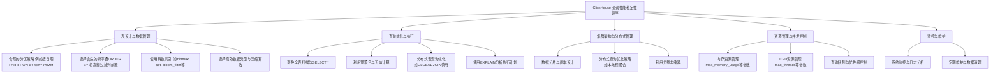

在大规模数据场景下，ClickHouse 要保证查询性能的稳定性，需要从数据表设计、查询优化、集群架构、资源管理以及监控维护等多个维度进行综合考虑和优化。以下是关键策略的概述：

下面是这些策略的详细说明：

### 一、表设计与数据管理
1.  **分区与索引策略**：
    *   **合理分区**：根据查询模式（如时间范围）设计分区键，常用 `PARTITION BY` 子句，避免过多或过少分区，以加速数据裁剪。
    *   **精心设计排序键（ORDER BY）**：作为主键索引的基础，应将高频过滤字段（如时间戳）置于前列，以利用**稀疏索引**快速定位数据块（Granule）。
    *   **使用跳数索引（Data Skipping Indexes）**：为高基数列添加布隆过滤器索引 (`bloom_filter`)，为枚举列使用 `set` 索引，为范围查询字段配置 `minmax` 索引，从而在查询时跳过不必要的数据块。

2.  **选择高效的数据类型和压缩算法**：使用紧凑的数据类型（如 `UInt8` 替代 `UInt64` 存储小范围整数）和高效的压缩算法（如 `ZSTD` 或 `LZ4`），减少存储空间占用和磁盘 I/O 压力，提升查询速度。

### 二、查询优化与执行
1.  **编写高效查询**：
    *   避免 `SELECT *`，仅查询需要的列。
    *   尽量将条件过滤写在索引列上，充分利用分区键和主键索引。
    *   谨慎使用 `JOIN`，尤其是大表关联。必要时使用 `GLOBAL JOIN` 广播小表，或通过 `ANY` 修饰符避免笛卡尔积爆炸。

2.  **利用预聚合与近似计算**：
    *   使用 `SummingMergeTree` 或 `AggregatingMergeTree` 表引擎预计算常用聚合指标。
    *   对精确度要求不高的场景，使用 `uniqCombined` (近似去重)、`quantileTDigest` (近似分位数) 等函数，大幅降低内存消耗和计算时间。

3.  **分析执行计划**：使用 `EXPLAIN` 语句查看查询执行计划，确保查询已正确使用索引（如显示 `Index...used`），并关注是否存在全表扫描 (`Full Scan`) 或高耗时的排序 (`Sorting`) 操作。

### 三、集群架构与分布式管理
1.  **数据分片与副本设计**：
    *   根据数据量和查询负载，设计合理的**分片（Shard）和副本（Replica）策略**。分片键应选择高基数列（如`user_id`），使数据均匀分布，避免倾斜。
    *   使用 `Distributed` 表引擎作为查询入口，实现跨分片的分布式查询。

2.  **优化分布式查询**：
    *   利用**本地预聚合**：通过调整 `distributed_aggregation_memory_efficient` 等参数，先在每个分片本地进行聚合，再汇总结果，减少网络传输。
    *   控制网络流量：使用数据压缩（如 `LZ4`）减少节点间传输的数据量。

3.  **负载均衡**：在客户端与集群之间部署负载均衡器（如 `chproxy`），将查询请求均匀分发到各个节点，避免单点过热。

### 四、资源管理与并发控制
1.  **内存资源管理**：
    *   设置查询内存限制 `max_memory_usage`，防止单个复杂查询耗尽内存。
    *   为允许大规模 `GROUP BY` 或 `ORDER BY` 操作使用磁盘，调整 `max_bytes_before_external_group_by` 和 `max_bytes_before_external_sort` 参数。

2.  **CPU与并发控制**：
    *   调整 `max_threads` 参数控制单个查询的并行度。
    *   通过 `max_concurrent_queries` 限制总并发查询数，并利用**资源组（Resource Groups）** 和优先级设置 (`priority`)，实现资源隔离和重要查询的优先调度。

### 五、监控与维护
1.  **系统监控**：
    *   监控关键指标：使用 `Prometheus` + `Grafana` 监控 **CPU使用率、内存占用、磁盘I/O、ZooKeeper健康状况**以及查询队列长度 (`max_waiting_queries`)。
    *   分析查询日志：定期检查慢查询，针对性进行优化。

2.  **日常维护**：
    *   定期清理过期数据：使用 `TTL` (Time-To-Live) 机制自动淘汰冷数据，或将它们迁移到更廉价的存储介质上。
    *   避免频繁的 `ALTER` 操作：特别是在大数据表上。

通过上述多层次的优化策略，ClickHouse 能够在千亿甚至更大规模的数据场景下，持续提供稳定且高效的查询性能。

