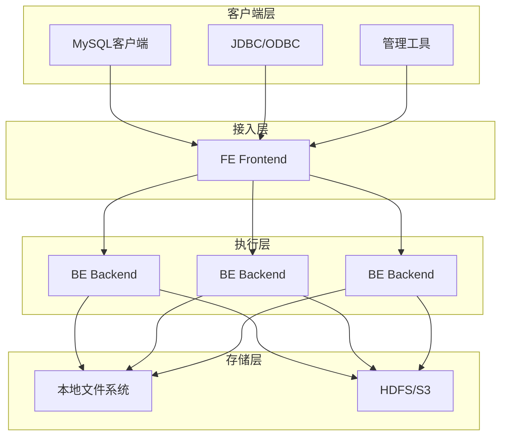

# 第1章：Apache Doris 基础入门

## 📚 章节概述

本章将介绍Apache Doris的基本概念、架构设计、应用场景和核心特性，帮助读者建立对Doris的全面认识。无论您是数据库新手还是经验丰富的数据工程师，本章都将为您提供坚实的基础知识。

## 🎯 学习目标

完成本章学习后，您将能够：

- 理解Apache Doris的定义和核心价值
- 掌握Doris的整体架构和组件功能
- 了解Doris的应用场景和优势
- 熟悉Doris与其他分析型数据库的区别
- 掌握Doris的基本概念和术语

---

## 1.1 什么是Apache Doris

### 1.1.1 定义与背景

Apache Doris是一个现代化的MPP(大规模并行处理)分析型数据库，最初由百度大数据部开发，后于2018年贡献给Apache基金会，成为顶级项目。Doris专为实时分析而设计，具有高性能、高可用、易扩展的特点。

### 1.1.2 核心价值

Doris的核心价值体现在以下几个方面：

1. **高性能查询**：基于MPP架构，支持PB级数据秒级响应
2. **实时分析**：支持实时数据导入和实时查询分析
3. **易用性**：兼容MySQL协议，降低使用门槛
4. **高可用**：支持多副本和故障自动转移
5. **易扩展**：支持在线水平扩展，无需停机

### 1.1.3 发展历程

- 2017年：百度内部孵化，用于解决实时分析需求
- 2018年：开源，项目命名为Doris
- 2019年：进入Apache孵化器
- 2022年：成为Apache顶级项目

---

## 1.2 Doris架构设计

### 1.2.1 整体架构

Doris采用典型的MPP架构，主要由以下组件构成：



### 1.2.2 核心组件详解

#### 1. Frontend (FE)

Frontend是Doris的前端节点，主要负责：

- **元数据管理**：存储和管理集群元数据、表结构、分片信息等
- **查询规划**：接收SQL请求，进行解析、优化并生成执行计划
- **集群管理**：管理集群节点状态、负载均衡、故障检测等
- **用户权限**：处理用户认证和权限控制

FE节点支持高可用部署，通常采用3个或5个节点组成集群，通过Raft协议保证数据一致性。

#### 2. Backend (BE)

Backend是Doris的后端节点，主要负责：

- **数据存储**：实际存储数据，支持本地存储和对象存储
- **查询执行**：执行FE下发的查询任务，返回结果
- **数据导入**：处理数据导入请求，写入数据
- **副本管理**：管理数据副本，保证数据可靠性

BE节点可以水平扩展，新增节点后自动进行数据重平衡。

### 1.2.3 数据存储模型

Doris采用列式存储引擎，支持多种数据模型：

1. **Duplicate模型**：明细模型，保留所有数据行
2. **Aggregate模型**：聚合模型，预聚合数据
3. **Unique模型**：唯一模型，保证主键唯一
4. **Primary Key模型**：主键模型，支持更新操作

---

## 1.3 应用场景

### 1.3.1 典型应用场景

Doris适用于以下场景：

1. **实时报表分析**：支持实时数据更新和查询，满足报表实时性需求
2. **用户行为分析**：分析用户行为数据，支持多维度分析
3. **日志分析**：处理和分析大量日志数据
4. **BI分析**：作为BI工具的数据源，支持即席查询
5. **A/B测试**：支持A/B测试结果分析
6. **监控告警**：实时监控系统指标，支持告警规则

### 1.3.2 行业应用案例

1. **电商行业**：用户行为分析、商品推荐、销售分析
2. **金融行业**：风险控制、交易分析、客户画像
3. **游戏行业**：玩家行为分析、游戏数据分析
4. **广告行业**：广告效果分析、投放优化
5. **物流行业**：物流数据分析、路径优化

---

## 1.4 Doris与其他数据库对比

### 1.4.1 与传统数据仓库对比

| 特性 | Apache Doris | 传统数据仓库 |
|------|--------------|--------------|
| 查询延迟 | 秒级 | 分钟级 |
| 数据更新 | 实时 | 批量 |
| 扩展性 | 在线水平扩展 | 垂直扩展为主 |
| 成本 | 开源免费 | 商业授权费用高 |
| 易用性 | MySQL协议 | 专用客户端 |

### 1.4.2 与其他OLAP数据库对比

| 特性 | Apache Doris | ClickHouse | Apache Druid | Apache Kylin |
|------|--------------|------------|--------------|--------------|
| 查询语言 | MySQL | ClickHouse SQL | Native SQL | SQL |
| 数据更新 | 支持 | 有限支持 | 支持 | 有限支持 |
| 实时性 | 高 | 高 | 高 | 中 |
| 易用性 | 高 | 中 | 中 | 中 |
| 社区活跃度 | 高 | 高 | 中 | 中 |

---

## 1.5 核心概念与术语

### 1.5.1 基本概念

1. **数据库(Database)**：逻辑上的数据集合，类似于MySQL中的数据库
2. **表(Table)**：数据的基本存储单元，由行和列组成
3. **分区(Partition)**：将表按照时间或其他维度进行水平分割
4. **分桶(Bucket)**：将分区内的数据按照哈希值进行分散存储
5. **副本(Replica)**：数据的冗余备份，提高数据可靠性

### 1.5.2 数据模型

1. **Duplicate模型**：明细模型，不进行预聚合，保留所有明细数据
2. **Aggregate模型**：聚合模型，导入时进行预聚合，提高查询性能
3. **Unique模型**：唯一模型，保证指定列的唯一性，支持更新
4. **Primary Key模型**：主键模型，支持更新和删除操作

### 1.5.3 索引类型

1. **前缀索引**：默认索引，对每列前36个字节建立索引
2. **Bitmap索引**：适用于低基数列，支持等值查询和IN查询
3. **Bloom Filter索引**：用于快速判断值是否存在
4. **倒排索引**：支持全文检索

---

## 1.6 快速体验

### 1.6.1 Docker快速部署

使用Docker快速体验Doris：

```bash
# 拉取Doris镜像
docker pull apache/doris:latest

# 启动FE节点
docker run -it --name doris-fe \
    -p 8030:8030 -p 9030:9030 \
    -e FE_SERVERS="fe1:127.0.0.1:9010" \
    --entrypoint /opt/apache-doris/fe/bin/start_fe.sh \
    apache/doris:latest

# 启动BE节点
docker run -it --name doris-be \
    -p 8040:8040 \
    -e FE_SERVERS="fe1:127.0.0.1:9010" \
    --entrypoint /opt/apache-doris/be/bin/start_be.sh \
    apache/doris:latest
```

### 1.6.2 连接Doris

使用MySQL客户端连接Doris：

```bash
mysql -h 127.0.0.1 -P 9030 -uroot
```

### 1.6.3 创建第一个表

```sql
-- 创建数据库
CREATE DATABASE demo;
USE demo;

-- 创建表
CREATE TABLE users (
    user_id BIGINT,
    user_name VARCHAR(50),
    age INT,
    city VARCHAR(20),
    register_date DATE
) DUPLICATE KEY(user_id)
DISTRIBUTED BY HASH(user_id) BUCKETS 10;

-- 插入数据
INSERT INTO users VALUES
(1, 'Alice', 25, 'Beijing', '2023-01-01'),
(2, 'Bob', 30, 'Shanghai', '2023-01-02'),
(3, 'Charlie', 35, 'Guangzhou', '2023-01-03');

-- 查询数据
SELECT * FROM users;
```

---

## 1.7 本章小结

本章介绍了Apache Doris的基本概念、架构设计、应用场景和核心特性。Doris作为一个现代化的MPP分析型数据库，具有高性能、实时性、易用性等优势，适用于多种实时分析场景。

通过本章学习，您应该对Doris有了初步的认识，为后续深入学习打下了基础。下一章将详细介绍如何安装和配置Doris环境。

## 📚 延伸阅读

- [Apache Doris官方文档](https://doris.apache.org/docs/)
- [Apache Doris架构设计](https://doris.apache.org/docs/administrator-guide/architecture/)
- [Apache Doris快速开始](https://doris.apache.org/docs/get-started/)

## 🧪 实践练习

1. 使用Docker部署一个单节点的Doris环境
2. 使用MySQL客户端连接Doris
3. 创建一个简单的表并插入数据
4. 尝试基本的数据查询操作

---

> 代码示例请参考：[第1章代码示例](code/chapter1/)