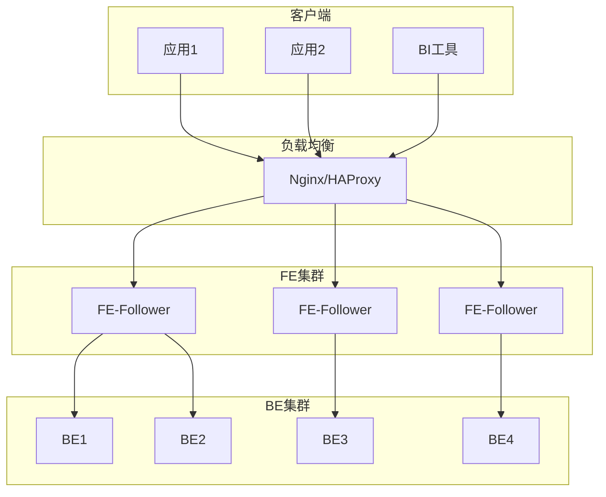

# 第2章：Apache Doris 安装与环境配置

## 📚 章节概述

本章将详细介绍Apache Doris的多种安装方式、环境配置要求以及集群部署方法。无论您是个人开发者还是企业用户，都能在本章找到适合的安装方案。我们将从最简单的Docker部署开始，逐步介绍二进制部署、源码编译以及生产环境的高可用集群部署。

## 🎯 学习目标

完成本章学习后，您将能够：

- 了解Doris的硬件和软件环境要求
- 掌握Docker方式快速部署Doris
- 学会二进制方式部署Doris集群
- 掌握源码编译安装Doris的方法
- 了解生产环境的高可用集群部署
- 掌握Doris的基本配置和优化
- 学会常见安装问题的排查方法

---

## 2.1 环境要求

### 2.1.1 硬件要求

#### 最低配置（测试环境）

| 组件 | CPU | 内存 | 磁盘 | 网络 |
|------|-----|------|------|------|
| FE | 2核 | 4GB | 10GB SSD | 1Gbps |
| BE | 4核 | 8GB | 50GB SSD | 1Gbps |

#### 推荐配置（生产环境）

| 组件 | CPU | 内存 | 磁盘 | 网络 |
|------|-----|------|------|------|
| FE | 8核 | 16GB | 100GB SSD | 10Gbps |
| BE | 16核 | 64GB | 1TB+ SSD | 10Gbps |

#### 磁盘要求

- **SSD推荐**：使用SSD存储可显著提高查询性能
- **RAID配置**：生产环境建议使用RAID 10
- **磁盘规划**：FE和BE建议使用独立磁盘
- **数据目录**：BE数据目录建议使用高性能磁盘

### 2.1.2 软件要求

#### 操作系统

- **Linux**：CentOS 7.x/8.x、Ubuntu 18.04/20.04、Debian 9/10
- **内核版本**：推荐3.10+，支持ext4/xfs文件系统
- **文件系统**：推荐使用xfs，支持大文件和高并发

#### 依赖软件

- **Java**：JDK 1.8或更高版本（FE节点需要）
- **Python**：Python 2.7+或3.6+（部分管理脚本需要）
- **GCC**：GCC 7.3+（源码编译需要）
- **CMake**：3.10+（源码编译需要）

#### 网络要求

- **端口开放**：确保FE和BE之间通信端口开放
- **防火墙**：关闭或配置防火墙规则
- **时间同步**：所有节点时间同步（NTP）

---

## 2.2 Docker方式安装

### 2.2.1 单节点Docker部署

Docker方式是最简单的部署方式，适合快速体验和开发测试。

```bash
# 拉取Doris镜像
docker pull apache/doris:2.1.0-fe-x86_64
docker pull apache/doris:2.1.0-be-x86_64

# 创建数据目录
mkdir -p /data/doris/fe/log /data/doris/fe/doris-meta
mkdir -p /data/doris/be/log /data/doris/be/storage

# 启动FE节点
docker run -itd \
    --name doris-fe \
    -p 8030:8030 \
    -p 9030:9030 \
    -v /data/doris/fe/log:/opt/apache-doris/fe/log \
    -v /data/doris/fe/doris-meta:/opt/apache-doris/fe/doris-meta \
    -e FE_SERVERS="fe1:127.0.0.1:9010" \
    --entrypoint /opt/apache-doris/fe/bin/start_fe.sh \
    apache/doris:2.1.0-fe-x86_64

# 启动BE节点
docker run -itd \
    --name doris-be \
    -p 8040:8040 \
    -p 9000:9000 \
    -p 9050:9050 \
    -v /data/doris/be/log:/opt/apache-doris/be/log \
    -v /data/doris/be/storage:/opt/apache-doris/be/storage \
    -e FE_SERVERS="fe1:127.0.0.1:9010" \
    --entrypoint /opt/apache-doris/be/bin/start_be.sh \
    apache/doris:2.1.0-be-x86_64
```

### 2.2.2 Docker Compose部署

使用Docker Compose可以更方便地管理多容器部署：

```yaml
version: '3.8'

services:
  fe:
    image: apache/doris:2.1.0-fe-x86_64
    container_name: doris-fe
    hostname: fe
    environment:
      - FE_SERVERS=fe1:127.0.0.1:9010
      - FE_ID=1
    ports:
      - "8030:8030"  # HTTP UI端口
      - "9030:9030"  # MySQL协议端口
      - "9010:9010"  # FE内部通信端口
    volumes:
      - fe_log:/opt/apache-doris/fe/log
      - fe_meta:/opt/apache-doris/fe/doris-meta
    networks:
      - doris-net
    command: /opt/apache-doris/fe/bin/start_fe.sh --daemon

  be:
    image: apache/doris:2.1.0-be-x86_64
    container_name: doris-be
    hostname: be
    environment:
      - FE_SERVERS=fe1:127.0.0.1:9010
      - BE_ADDR=127.0.0.1:9050
    ports:
      - "8040:8040"  # BE HTTP端口
      - "9000:9000"  # BE内部通信端口
      - "9050:9050"  # BE心跳端口
    volumes:
      - be_log:/opt/apache-doris/be/log
      - be_storage:/opt/apache-doris/be/storage
    networks:
      - doris-net
    depends_on:
      - fe
    command: /opt/apache-doris/be/bin/start_be.sh --daemon

volumes:
  fe_log:
  fe_meta:
  be_log:
  be_storage:

networks:
  doris-net:
    driver: bridge
```

### 2.2.3 连接Docker部署的Doris

```bash
# 使用MySQL客户端连接
mysql -h 127.0.0.1 -P 9030 -uroot

# 添加BE节点
ALTER SYSTEM ADD BACKEND "127.0.0.1:9050";

# 查看集群状态
SHOW BACKENDS;
SHOW FRONTENDS;
```

---

## 2.3 二进制方式安装

### 2.3.1 下载二进制包

```bash
# 下载Doris二进制包
wget https://dist.apache.org/repos/dist/release/doris/2.1/2.1.0/apache-doris-2.1.0-bin-x86_64.tar.gz

# 解压
tar -zxvf apache-doris-2.1.0-bin-x86_64.tar.gz
mv apache-doris-2.1.0-bin-x86_64 /opt/doris
```

### 2.3.2 FE节点配置与启动

#### 1. FE配置文件

编辑FE配置文件 `/opt/doris/fe/conf/fe.conf`：

```properties
# FE节点基本信息
priority_networks = 192.168.0.0/16  # 指定FE使用的IP
meta_dir = /opt/doris/fe/doris-meta  # 元数据存储目录
log_dir = /opt/doris/fe/log          # 日志目录

# 端口配置
http_port = 8030                     # HTTP UI端口
query_port = 9030                    # MySQL协议端口
rpc_port = 9010                      # FE内部通信端口
edit_log_port = 9011                 # 编辑日志端口

# 集群配置
cluster_name = doris_cluster         # 集群名称
node_num = 1                         # 节点数量

# 内存配置
JAVA_OPTS="-Xmx8192m -Xms8192m -XX:+UseMembar -XX:SurvivorRatio=8 -XX:MaxTenuringThreshold=7"

# 高可用配置（多节点部署时）
# frontend_address_base = 192.168.0.1
# edit_log_port = 9011
# query_port = 9030
# http_port = 8030
```

#### 2. 启动FE节点

```bash
# 创建元数据和日志目录
mkdir -p /opt/doris/fe/doris-meta /opt/doris/fe/log

# 启动FE节点
/opt/doris/fe/bin/start_fe.sh --daemon

# 查看FE状态
/opt/doris/fe/bin/show_fe_status.sh

# 查看日志
tail -f /opt/doris/fe/log/fe.log
```

### 2.3.3 BE节点配置与启动

#### 1. BE配置文件

编辑BE配置文件 `/opt/doris/be/conf/be.conf`：

```properties
# BE节点基本信息
priority_networks = 192.168.0.0/16  # 指定BE使用的IP
storage_root_path = /opt/doris/be/storage # 数据存储目录
log_dir = /opt/doris/be/log               # 日志目录

# 端口配置
be_port = 9060                     # BE内部通信端口
webserver_port = 8040              # BE HTTP端口
heartbeat_service_thread_count = 1
create_table_worker_count = 1
tablet_create_timeout_seconds = 60

# 存储配置
storage_flood_stage_usage_percent = 85
storage_flood_stage_left_capacity_bytes = 1073741824
storage_flood_stage_usage_percent = 95
storage_flood_stage_left_capacity_bytes = 1048576

# 内存配置
mem_limit = 80%                    # BE内存限制
buffer_pool_limit = 20%            # 缓冲池限制

# 性能配置
disable_storage_persistence = false
max_compaction_threads = 2
max_tablet_version_num = 1000
default_rowset_type = beta
```

#### 2. 启动BE节点

```bash
# 创建数据和日志目录
mkdir -p /opt/doris/be/storage /opt/doris/be/log

# 启动BE节点
/opt/doris/be/bin/start_be.sh --daemon

# 查看BE状态
/opt/doris/be/bin/show_be_status.sh

# 查看日志
tail -f /opt/doris/be/log/be.INFO
```

### 2.3.4 添加BE节点到集群

```bash
# 连接FE节点
mysql -h 127.0.0.1 -P 9030 -uroot

# 添加BE节点
ALTER SYSTEM ADD BACKEND "192.168.0.2:9050";

# 查看集群状态
SHOW BACKENDS;
SHOW FRONTENDS;
```

---

## 2.4 源码编译安装

### 2.4.1 准备编译环境

```bash
# 安装依赖
# CentOS/RHEL
yum install -y java-1.8.0-openjdk-devel maven cmake gcc-c++ python-devel byacc flex automake libtool bzip2 zip unzip ncurses-devel git

# Ubuntu/Debian
apt-get install -y openjdk-8-jdk maven cmake g++ python byacc flex automake libtool bzip2 zip unzip libncurses5-dev git

# 设置Java环境变量
export JAVA_HOME=/usr/lib/jvm/java-1.8.0-openjdk
export PATH=$PATH:$JAVA_HOME/bin
```

### 2.4.2 编译Doris

```bash
# 克隆源码
git clone https://github.com/apache/doris.git
cd doris

# 切换到指定版本
git checkout 2.1.0

# 编译FE
sh build.sh --fe --clean

# 编译BE
sh build.sh --be --clean

# 编译输出
# FE输出目录：output/fe/
# BE输出目录：output/be/
```

### 2.4.3 部署编译后的Doris

```bash
# 创建部署目录
mkdir -p /opt/doris/{fe,be}

# 复制编译产物
cp -r output/fe/* /opt/doris/fe/
cp -r output/be/* /opt/doris/be/

# 配置并启动（参考2.3节）
```

---

## 2.5 高可用集群部署

### 2.5.1 架构设计

高可用集群通常包含：
- **3个FE节点**：1个Follower+2个Observer或3个Follower
- **多个BE节点**：根据数据量和查询需求确定
- **负载均衡**：如Nginx或HAProxy



### 2.5.2 FE集群部署

#### 1. 第一个FE节点（Follower）

```bash
# 在192.168.0.1上部署
/opt/doris/fe/bin/start_fe.sh --helper 192.168.0.1:9010 --daemon
```

#### 2. 第二个FE节点（Follower）

```bash
# 在192.168.0.2上部署
/opt/doris/fe/bin/start_fe.sh --helper 192.168.0.1:9010 --daemon

# 在第一个FE节点上添加第二个FE节点
mysql -h 192.168.0.1 -P 9030 -uroot
ALTER SYSTEM ADD FOLLOWER "192.168.0.2:9011";
```

#### 3. 第三个FE节点（Follower）

```bash
# 在192.168.0.3上部署
/opt/doris/fe/bin/start_fe.sh --helper 192.168.0.1:9010 --daemon

# 在第一个FE节点上添加第三个FE节点
mysql -h 192.168.0.1 -P 9030 -uroot
ALTER SYSTEM ADD FOLLOWER "192.168.0.3:9011";
```

### 2.5.3 BE集群部署

```bash
# 在每个BE节点上启动BE
/opt/doris/be/bin/start_be.sh --daemon

# 在任意FE节点上添加所有BE节点
mysql -h 192.168.0.1 -P 9030 -uroot
ALTER SYSTEM ADD BACKEND "192.168.0.4:9050";
ALTER SYSTEM ADD BACKEND "192.168.0.5:9050";
ALTER SYSTEM ADD BACKEND "192.168.0.6:9050";
ALTER SYSTEM ADD BACKEND "192.168.0.7:9050";
```

### 2.5.4 负载均衡配置

#### Nginx配置示例

```nginx
upstream doris_fe {
    server 192.168.0.1:9030;
    server 192.168.0.2:9030;
    server 192.168.0.3:9030;
}

server {
    listen 9030;
    proxy_pass doris_fe;
    proxy_connect_timeout 1s;
    proxy_read_timeout 1h;
    proxy_send_timeout 1h;
}
```

---

## 2.6 配置优化

### 2.6.1 FE配置优化

```properties
# 内存配置
JAVA_OPTS="-Xmx16384m -Xms16384m -XX:+UseMembar -XX:SurvivorRatio=8 -XX:MaxTenuringThreshold=7"

# 元数据配置
meta_dir = /data/doris/fe/doris-meta
edit_log_port = 9011
edit_log_roll_num = 50000

# 查询配置
max_connection = 4096
query_timeout = 300
max_query_retry_time = 2
```

### 2.6.2 BE配置优化

```properties
# 内存配置
mem_limit = 80%
buffer_pool_limit = 20%
write_buffer_size = 104857600

# 存储配置
storage_flood_stage_usage_percent = 85
max_tablet_version_num = 1000
default_rowset_type = beta

# 并发配置
max_compaction_threads = 4
max_pushdown_concurrency_per_node = 2
```

---

## 2.7 常见问题与解决方案

### 2.7.1 FE启动失败

#### 问题：FE启动后立即退出

**可能原因**：
- Java环境未正确配置
- 元数据目录权限不足
- 端口被占用

**解决方案**：
```bash
# 检查Java环境
java -version

# 检查目录权限
ls -la /opt/doris/fe/doris-meta
chown -R doris:doris /opt/doris/fe/

# 检查端口占用
netstat -tunlp | grep 9030
```

#### 问题：FE元数据损坏

**解决方案**：
```bash
# 停止FE
/opt/doris/fe/bin/stop_fe.sh

# 备份元数据
cp -r /opt/doris/fe/doris-meta /opt/doris/fe/doris-meta.bak

# 使用元数据工具恢复
/opt/doris/fe/bin/meta_tool --help
```

### 2.7.2 BE启动失败

#### 问题：BE无法连接到FE

**可能原因**：
- 网络不通
- 防火墙阻止
- FE配置错误

**解决方案**：
```bash
# 检查网络连通性
telnet 192.168.0.1 9010

# 检查防火墙
systemctl status firewalld
firewall-cmd --list-ports

# 检查FE配置
grep priority_networks /opt/doris/fe/conf/fe.conf
```

#### 问题：BE磁盘空间不足

**解决方案**：
```bash
# 检查磁盘使用
df -h /opt/doris/be/storage

# 清理过期数据
# 1. 删除过期分区
ALTER TABLE table_name DROP PARTITION partition_name;

# 2. 调整数据保留策略
ALTER TABLE table_name SET ("dynamic_partition.history_partition_num" = "7");
```

### 2.7.3 集群状态异常

#### 问题：BE节点状态为dead

**可能原因**：
- BE进程停止
- 心跳超时
- 磁盘故障

**解决方案**：
```bash
# 检查BE进程
ps aux | grep be

# 查看BE日志
tail -f /opt/doris/be/log/be.INFO

# 重启BE
/opt/doris/be/bin/stop_be.sh
/opt/doris/be/bin/start_be.sh --daemon
```

#### 问题：FE节点状态为dead

**解决方案**：
```bash
# 检查FE进程
ps aux | grep fe

# 查看FE日志
tail -f /opt/doris/fe/log/fe.log

# 重启FE
/opt/doris/fe/bin/stop_fe.sh
/opt/doris/fe/bin/start_fe.sh --daemon
```

---

## 2.8 监控与维护

### 2.8.1 基础监控

```sql
-- 查看FE状态
SHOW FRONTENDS;

-- 查看BE状态
SHOW BACKENDS;

-- 查看集群信息
SHOW PROC '/backends';
SHOW PROC '/frontends';
```

### 2.8.2 日志管理

```bash
# FE日志轮转配置
vim /opt/doris/conf/log4j2.xml

# BE日志轮转配置
vim /opt/doris/be/conf/be.conf
# log_roll_size = 1073741824
```

### 2.8.3 备份与恢复

```bash
# 元数据备份
mysql -h 127.0.0.1 -P 9030 -uroot -e "BACKUP TO 'backup_label' FROM db_name;"

# 元数据恢复
mysql -h 127.0.0.1 -P 9030 -uroot -e "RESTORE FROM 'backup_label';"
```

---

## 2.9 本章小结

本章详细介绍了Apache Doris的多种安装方式和环境配置方法，包括Docker快速部署、二进制安装、源码编译以及高可用集群部署。通过本章学习，您应该能够根据实际需求选择合适的部署方式，并掌握基本的配置优化和问题排查方法。

下一章将深入介绍Doris的数据模型，帮助您理解Doris的存储原理和数据组织方式。

## 📚 延伸阅读

- [Apache Doris官方安装文档](https://doris.apache.org/docs/installing/)
- [Apache Doris集群部署指南](https://doris.apache.org/docs/administrator-guide/cluster-deployment/)
- [Apache Doris配置详解](https://doris.apache.org/docs/administrator-guide/config/)

## 🧪 实践练习

1. 使用Docker方式部署一个单节点Doris环境
2. 使用二进制方式部署一个3节点集群（1FE+2BE）
3. 配置Doris的高可用集群（3FE+3BE）
4. 尝试源码编译Doris
5. 配置Nginx作为Doris FE的负载均衡器

---

> 代码示例请参考：[第2章代码示例](code/chapter2/)