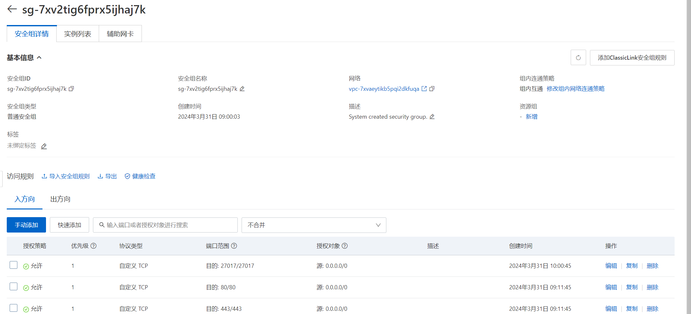

## 1. Setup in Alicloud
### 1.1 mongod.conf change
```yml
# to allow other servers to connect, bindIp: 0.0.0.0
net:
  port: 27017
  bindIp: 0.0.0.0

# enable security / only after admin user created
security:
  authorization: enabled

```

### 1.2 Create admin user 
```bash
mongosh
# must switch to admin db
use admin
db.createUser({
    user: "admin",
    pwd: passwordPrompt(),
    roles: [
        {role: "userAdminAnyDatabase", db: "admin"}
    ]
})
```
### 1.3 Restart service
```bash
systemctl restart mongod
```
### 1.4 Firewall rule open 27017 port


## 