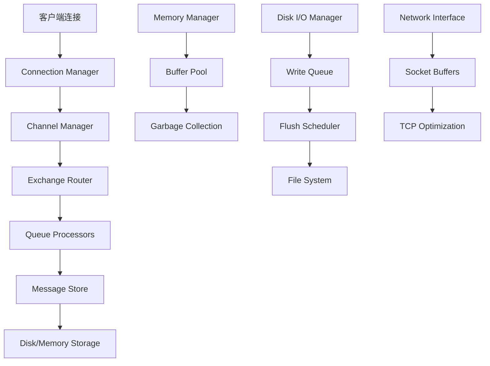

# 第8章：性能优化与调优

## 📊 概述

RabbitMQ作为企业级消息中间件，其性能优化是确保系统稳定高效运行的关键。本章将深入探讨RabbitMQ的性能调优策略，包括系统配置优化、内存管理、磁盘I/O优化、网络调优、集群性能优化等全方位内容。

## 🏗️ 性能架构基础

### 1. RabbitMQ性能模型

RabbitMQ的性能主要由以下几个核心组件决定：



### 2. 性能瓶颈分析

#### 主要性能瓶颈
- **内存使用**：队列消息和元数据存储
- **磁盘I/O**：持久化消息的读写操作
- **网络带宽**：消息传输的网络限制
- **CPU使用**：消息路由和处理的计算开销
- **数据库连接**：用户权限和配置的数据库查询

#### 性能指标监控
```python
class PerformanceMetrics:
    def __init__(self):
        self.metrics = {
            # 吞吐量指标
            'messages_published_per_second': 0,
            'messages_consumed_per_second': 0,
            'messages_acknowledged_per_second': 0,
            
            # 延迟指标
            'publish_latency': 0,        # 发布延迟
            'delivery_latency': 0,       # 投递延迟
            'ack_latency': 0,           # 确认延迟
            'end_to_end_latency': 0,    # 端到端延迟
            
            # 资源使用
            'memory_usage_mb': 0,
            'disk_usage_mb': 0,
            'cpu_usage_percent': 0,
            'network_io_mbps': 0,
            
            # 连接状态
            'active_connections': 0,
            'active_channels': 0,
            'queue_depth': 0,
            
            # 错误率
            'publish_error_rate': 0,
            'consume_error_rate': 0,
            'connection_failure_rate': 0
        }
```

## ⚙️ 系统配置优化

### 1. Erlang虚拟机调优

RabbitMQ基于Erlang OTP平台，其性能高度依赖Erlang虚拟机的配置：

#### 关键配置参数

```bash
# /etc/rabbitmq/rabbitmq-env.conf
ERLANG_HOME=/usr/lib/erlang/erts-12.0

# 优化Erlang VM参数
ERL_MAX_PORTS=32768                    # 最大端口数
ERL_PROCESSES=100000                   # 最大进程数
ERL_MAX_ETS_TABLES=2000               # 最大ETS表数量
ERL_DRV_INT=32                         # 驱动整数大小
ERL_DRV_UINT=32                       # 驱动无符号整数大小
ERL_DRV_STRING=str                    # 驱动字符串处理
ERL_DRV_atom=atom                     # 驱动原子处理
ERL_DRV_binary=bin                    # 驱动二进制处理
ERL_DRV_fun=fun                       # 驱动函数处理
ERL_DRV_map=map                       # 驱动映射处理

# 内存管理优化
ERL_FULLSWEEP_AFTER=10000             # 完全GC间隔
ERL_MAX_ETS_TABLES=2048               # 最大ETS表数
ERL_ASYNC_THREADS=4                   # 异步线程数

# 网络优化
ERL_NETWORK_TICKTIME=60               # 网络心跳时间
ERL_DISTRIBUTION_BUFFER_SIZE=128000   # 分布式缓冲区大小
```

#### 高级Erlang配置

```erlang
# rabbitmq.config - 高级配置
[
    {kernel, [
        {inet_default_connect_options, [
            {nodelay, true},
            {packet, 4},
            {exit_on_close, false}
        ]},
        {inet_default_listen_options, [
            {nodelay, true},
            {packet, 4},
            {reuseaddr, true}
        ]},
        {error_logger, tty},
        {start_timer, true},
        {start_pg2, true}
    ]},
    
    {vm_memory_high_watermark, 0.6},      # 内存高水位标识（60%）
    {vm_memory_calculation_strategy, 'rss'},  # 内存计算策略
    {disk_free_limit, '5GB'},            # 磁盘空间限制
    {disk_free_limit_absolute, 1000000000},  # 绝对磁盘空间限制
    {log_levels, [
        {connection, info},
        {mirroring, info},
        {default, info},
        {channel, warning},
        {queue, warning}
    ]},
    
    {default_user, <<"guest">>},
    {default_pass, <<"guest">>},
    {default_permissions, [<<".*">>, <<".*">>, <<".*">>]}
].
```

### 2. 操作系统调优

#### Linux内核参数优化

```bash
# /etc/sysctl.conf
# 网络优化
net.core.rmem_max = 16777216
net.core.wmem_max = 16777216
net.core.netdev_max_backlog = 5000
net.ipv4.tcp_rmem = 4096 87380 16777216
net.ipv4.tcp_wmem = 4096 65536 16777216
net.ipv4.tcp_keepalive_time = 600
net.ipv4.tcp_keepalive_intvl = 60
net.ipv4.tcp_keepalive_probes = 9
net.ipv4.tcp_fin_timeout = 30

# 文件描述符限制
fs.file-max = 2097152
fs.nr_open = 2097152

# 内存管理
vm.swappiness = 1
vm.dirty_ratio = 15
vm.dirty_background_ratio = 5

# 应用配置
# /etc/security/limits.conf
rabbitmq soft nofile 65536
rabbitmq hard nofile 65536
rabbitmq soft nproc 32768
rabbitmq hard nproc 32768
```

#### 文件系统优化

```bash
# 对于生产环境，推荐使用 ext4 或 xfs
# 挂载选项优化

# /etc/fstab 优化
/dev/sda1 /var/lib/rabbitmq ext4 defaults,noatime,nodiratime,data=writeback 0 2

# I/O调度器优化
echo deadline > /sys/block/sda/queue/scheduler
echo 8192 > /sys/block/sda/queue/read_ahead_kb

# 禁用透明大页
echo never > /sys/kernel/mm/transparent_hugepage/enabled
```

## 💾 内存管理与优化

### 1. 内存分配策略

RabbitMQ的内存管理是性能优化的核心，主要涉及：

#### 内存使用分布

```python
class MemoryManager:
    """内存管理器"""
    
    def __init__(self):
        self.memory_types = {
            'queue_footers': 0,           # 队列页脚
            'queue_process_reduce': 0,    # 队列处理
            'msg_index': 0,              # 消息索引
            'mnesia_disk_logs': 0,       # Mnesia磁盘日志
            'mnesia_images': 0,          # Mnesia镜像
            'ets_tables': 0,             # ETS表
            'other_ets': 0,              # 其他ETS表
            'binary_dictionaries': 0,    # 二进制字典
            'mnesia_table_writers': 0,  # Mnesia表写入器
            'connection_channels': 0,    # 连接通道
            'authentication_mechanisms': 0,  # 认证机制
            'auth_cache': 0,             # 认证缓存
            'memory_graphs': 0,          # 内存图表
            'rate_ets': 0,              # 速率ETS
            'user_processes': 0,         # 用户进程
            'system_processes': 0,       # 系统进程
            'binary': 0                  # 二进制数据
        }
    
    def analyze_memory_usage(self):
        """分析内存使用情况"""
        total_memory = sum(self.memory_types.values())
        
        memory_breakdown = {}
        for memory_type, usage in self.memory_types.items():
            if usage > 0:
                percentage = (usage / total_memory) * 100 if total_memory > 0 else 0
                memory_breakdown[memory_type] = {
                    'usage_mb': usage / (1024 * 1024),
                    'percentage': percentage
                }
        
        return {
            'total_memory_mb': total_memory / (1024 * 1024),
            'breakdown': memory_breakdown
        }
    
    def optimize_memory_allocation(self):
        """优化内存分配"""
        optimization_strategies = []
        
        # 检查消息索引占用
        if self.memory_types['msg_index'] > self._get_total_memory() * 0.3:
            optimization_strategies.append({
                'type': 'message_index',
                'action': 'reduce_queue_memory',
                'description': '消息索引占用过高，建议减少队列消息数量'
            })
        
        # 检查二元数据占用
        if self.memory_types['binary'] > self._get_total_memory() * 0.4:
            optimization_strategies.append({
                'type': 'binary_data',
                'action': 'tune_binary_memory',
                'description': '二元数据占用过高，建议调整消息大小'
            })
        
        return optimization_strategies
    
    def _get_total_memory(self):
        """获取总内存大小"""
        return sum(self.memory_types.values())
```

#### 内存监控示例

```python
class MemoryMonitor:
    """内存监控器"""
    
    def __init__(self):
        self.high_watermark = 0.6  # 高水位标识60%
        self.low_watermark = 0.4   # 低水位标识40%
        self.monitoring_enabled = True
        
    def get_memory_stats(self):
        """获取内存统计"""
        # 模拟获取内存统计信息
        return {
            'total_memory': 8589934592,  # 8GB
            'used_memory': 4294967296,   # 4GB
            'free_memory': 4294967296,   # 4GB
            'memory_usage_percent': 50.0,
            'queue_memory': 2147483648,  # 2GB
            'binary_memory': 1073741824, # 1GB
            'ets_memory': 536870912,     # 512MB
            'other_memory': 536870912    # 512MB
        }
    
    def check_memory_pressure(self):
        """检查内存压力"""
        stats = self.get_memory_stats()
        usage_percent = stats['memory_usage_percent']
        
        if usage_percent >= self.high_watermark * 100:
            return 'HIGH_PRESSURE'
        elif usage_percent >= self.low_watermark * 100:
            return 'MEDIUM_PRESSURE'
        else:
            return 'LOW_PRESSURE'
    
    def generate_memory_report(self):
        """生成内存报告"""
        stats = self.get_memory_stats()
        pressure = self.check_memory_pressure()
        
        report = {
            'timestamp': datetime.now().isoformat(),
            'memory_pressure': pressure,
            'stats': stats,
            'recommendations': []
        }
        
        # 生成优化建议
        if stats['memory_usage_percent'] > 70:
            report['recommendations'].extend([
                '考虑增加服务器内存',
                '优化消息大小和频率',
                '启用消息压缩',
                '增加队列消费者数量'
            ])
        
        if stats['queue_memory'] > stats['total_memory'] * 0.4:
            report['recommendations'].extend([
                '减少队列持久化消息数量',
                '调整队列长度限制',
                '启用lazy queue模式'
            ])
        
        return report
```

### 2. 队列内存优化

```python
class QueueMemoryOptimizer:
    """队列内存优化器"""
    
    def __init__(self):
        self.optimization_strategies = {
            'lazy_queue': self._configure_lazy_queue,
            'memory_limit': self._set_queue_memory_limit,
            'overflow_behavior': self._configure_overflow,
            'message_paging': self._enable_message_paging
        }
    
    def optimize_queue_memory(self, queue_config):
        """优化队列内存配置"""
        optimizations = []
        
        # Lazy Queue配置
        if queue_config.get('lazy_queue', False):
            optimizations.append({
                'type': 'lazy_queue',
                'memory_saved': '20-40%',
                'description': '使用懒加载队列将消息存储在磁盘'
            })
        
        # 内存限制
        max_queue_length = queue_config.get('max_length', 10000)
        if max_queue_length > 50000:
            optimizations.append({
                'type': 'max_length',
                'recommendation': f'考虑设置max_length为{max_queue_length // 2}',
                'memory_saved': '30-50%',
                'description': '限制队列长度以控制内存使用'
            })
        
        # 消息TTL
        message_ttl = queue_config.get('message_ttl', 0)
        if message_ttl > 0:
            optimizations.append({
                'type': 'message_ttl',
                'recommendation': f'设置消息TTL为{message_ttl}ms',
                'memory_saved': '10-20%',
                'description': '自动清理过期消息'
            })
        
        return optimizations
    
    def _configure_lazy_queue(self, config):
        """配置懒队列"""
        return {
            'x-queue-mode': 'lazy',
            'description': '将所有消息存储在磁盘上，减少内存使用'
        }
    
    def _set_queue_memory_limit(self, config):
        """设置队列内存限制"""
        return {
            'x-max-length-bytes': config.get('max_length_bytes', 1_000_000),
            'description': '限制队列占用的最大内存'
        }
    
    def _configure_overflow(self, config):
        """配置溢出行为"""
        overflow_strategy = config.get('overflow', 'reject-publish')
        return {
            'x-overflow': overflow_strategy,
            'description': f'当队列满时，{overflow_strategy}处理新消息'
        }
    
    def _enable_message_paging(self, config):
        """启用消息分页"""
        return {
            'x-max-in-memory-length': config.get('max_in_memory_length', 1000),
            'description': '控制内存中的消息数量，超出部分分页到磁盘'
        }
```

## 💽 磁盘I/O优化

### 1. 持久化策略

```python
class DiskIOManager:
    """磁盘I/O管理器"""
    
    def __init__(self):
        self.flush_strategies = {
            'async': self._async_flush,
            'sync': self._sync_flush,
            'batch': self._batch_flush
        }
        
        self.persistent_settings = {
            'durable_queues': True,
            'publisher_confirms': True,
            'auto_delete': False,
            'arguments': {
                'x-message-ttl': 0,
                'x-expires': 0,
                'x-max-length': 0,
                'x-max-length-bytes': 0,
                'x-dead-letter-exchange': '',
                'dead-letter-routing-key': ''
            }
        }
    
    def optimize_persistent_queue(self, queue_name, config):
        """优化持久化队列"""
        optimizations = []
        
        # 批量确认设置
        publisher_confirms = config.get('publisher_confirms', False)
        if publisher_confirms:
            optimizations.append({
                'setting': 'publisher_confirms',
                'impact': 'positive',
                'description': '启用发布者确认，确保消息持久化'
            })
        
        # 消息确认设置
        acknowledgment_mode = config.get('acknowledgment_mode', 'auto')
        if acknowledgment_mode == 'manual':
            optimizations.append({
                'setting': 'manual_acknowledgments',
                'impact': 'positive',
                'description': '手动确认提高可靠性'
            })
        
        return optimizations
    
    def monitor_disk_performance(self):
        """监控磁盘性能"""
        import psutil
        
        disk_usage = psutil.disk_usage('/var/lib/rabbitmq')
        
        return {
            'total_space_gb': disk_usage.total / (1024**3),
            'free_space_gb': disk_usage.free / (1024**3),
            'used_space_gb': disk_usage.used / (1024**3),
            'usage_percent': (disk_usage.used / disk_usage.total) * 100,
            'io_stats': self._get_disk_io_stats()
        }
    
    def _get_disk_io_stats(self):
        """获取磁盘I/O统计"""
        import psutil
        
        disk_io = psutil.disk_io_counters()
        if disk_io:
            return {
                'read_bytes_per_sec': disk_io.read_bytes / 1024 / 1024,  # MB/s
                'write_bytes_per_sec': disk_io.write_bytes / 1024 / 1024,  # MB/s
                'reads_per_sec': disk_io.read_count / 60,
                'writes_per_sec': disk_io.write_count / 60
            }
        return {}
    
    def calculate_disk_requirements(self, message_size, message_rate, retention_hours):
        """计算磁盘空间需求"""
        # 计算每小时的消息大小
        hourly_message_size = message_rate * message_size * 3600
        
        # 考虑冗余因子（推荐3倍）
        redundancy_factor = 3
        required_space = hourly_message_size * retention_hours * redundancy_factor
        
        # 转换为GB
        required_space_gb = required_space / (1024**3)
        
        return {
            'required_space_gb': required_space_gb,
            'hourly_message_gb': hourly_message_size / (1024**3),
            'recommendation': f'建议至少分配{required_space_gb:.1f}GB存储空间'
        }
```

### 2. I/O调度优化

```python
class IOScheduler:
    """I/O调度器"""
    
    def __init__(self):
        self.scheduler_algorithms = {
            'deadline': {
                'description': '适合低延迟应用',
                'workload': 'mixed_read_write',
                'performance': 'low_latency'
            },
            'cfq': {
                'description': '适合桌面系统',
                'workload': 'interactive',
                'performance': 'fair_sharing'
            },
            'noop': {
                'description': '适合SSD存储',
                'workload': 'sequential',
                'performance': 'minimal_overhead'
            }
        }
    
    def recommend_scheduler(self, storage_type, workload):
        """推荐I/O调度器"""
        if storage_type == 'ssd':
            if workload in ['messaging', 'database']:
                return 'noop'
            else:
                return 'deadline'
        else:
            # 传统机械硬盘
            if workload == 'high_throughput':
                return 'deadline'
            else:
                return 'cfq'
    
    def optimize_flush_settings(self):
        """优化刷新设置"""
        return {
            'vm.dirty_background_ratio': 10,
            'vm.dirty_ratio': 25,
            'vm.dirty_expire_centisecs': 3000,
            'vm.dirty_writeback_centisecs': 500
        }
```

## 🌐 网络优化

### 1. TCP连接优化

```python
class NetworkOptimizer:
    """网络优化器"""
    
    def __init__(self):
        self.tcp_optimizations = {
            'socket_buffers': {
                'rmem_default': 87380,
                'rmem_max': 16777216,
                'wmem_default': 65536,
                'wmem_max': 16777216
            },
            'keepalive': {
                'tcp_keepalive_time': 600,
                'tcp_keepalive_intvl': 60,
                'tcp_keepalive_probes': 9
            },
            'time_wait': {
                'tcp_fin_timeout': 30,
                'tcp_tw_reuse': 1,
                'tcp_tw_recycle': 0
            }
        }
    
    def optimize_connection_settings(self, connection_type):
        """优化连接设置"""
        optimizations = {}
        
        if connection_type == 'high_throughput':
            optimizations.update({
                'TCP_NODELAY': False,  # 启用Nagle算法以减少小包
                'SO_KEEPALIVE': True,
                'SO_RCVBUF': 1_000_000,   # 1MB接收缓冲区
                'SO_SNDBUF': 1_000_000,   # 1MB发送缓冲区
                'SO_LINGER': {'onoff': True, 'linger': 0}
            })
        
        elif connection_type == 'low_latency':
            optimizations.update({
                'TCP_NODELAY': True,     # 禁用Nagle算法
                'TCP_QUICKACK': True,    # 快速确认
                'SO_KEEPALIVE': True,
                'SO_RCVBUF': 262_144,    # 256KB缓冲区
                'SO_SNDBUF': 262_144     # 256KB缓冲区
            })
        
        return optimizations
    
    def calculate_connection_limits(self, memory_per_connection, max_memory):
        """计算连接限制"""
        if not memory_per_connection or not max_memory:
            return {'max_connections': 1000}
        
        # 考虑管理开销（30%）
        effective_memory = max_memory * 0.7
        max_connections = int(effective_memory / memory_per_connection)
        
        return {
            'max_connections': max_connections,
            'memory_per_connection_mb': memory_per_connection / (1024 * 1024),
            'effective_memory_gb': effective_memory / (1024 * 1024 * 1024)
        }
```

### 2. 集群网络优化

```python
class ClusterNetworkOptimizer:
    """集群网络优化器"""
    
    def __init__(self):
        self.cluster_config = {
            'heartbeat': 60,                    # 心跳间隔
            'connection_timeout': 30000,        # 连接超时
            'node_cleanup_only_unused': False,
            'handshake_timeout': 10000,        # 握手超时
            'mirror_slave_sync_timeout': 60000  # 镜像同步超时
        }
    
    def optimize_cluster_network(self, node_count, network_quality):
        """优化集群网络配置"""
        optimizations = {}
        
        if network_quality == 'high_latency':
            # 高延迟网络优化
            optimizations.update({
                'heartbeat': self.cluster_config['heartbeat'] * 2,
                'connection_timeout': self.cluster_config['connection_timeout'] * 2,
                'mirror_slave_sync_timeout': self.cluster_config['mirror_slave_sync_timeout'] * 1.5
            })
        elif network_quality == 'low_latency':
            # 低延迟网络优化
            optimizations.update({
                'heartbeat': self.cluster_config['heartbeat'] // 2,
                'connection_timeout': self.cluster_config['connection_timeout'] // 2,
                'handshake_timeout': self.cluster_config['handshake_timeout'] // 2
            })
        
        # 根据节点数量调整
        if node_count > 10:
            optimizations['heartbeat'] = min(optimizations.get('heartbeat', 60), 30)
        
        return optimizations
    
    def calculate_network_requirements(self, message_rate, avg_message_size, node_count):
        """计算网络需求"""
        # 计算消息流量
        messages_per_second = message_rate
        bytes_per_second = messages_per_second * avg_message_size
        bits_per_second = bytes_per_second * 8
        
        # 集群内部复制开销（通常为2-3倍）
        replication_factor = min(node_count - 1, 3)  # 最多3个副本
        total_bandwidth_mbps = (bits_per_second * replication_factor) / (1024 * 1024)
        
        # 考虑管理流量开销（20%）
        total_bandwidth_mbps *= 1.2
        
        return {
            'required_bandwidth_mbps': total_bandwidth_mbps,
            'per_node_bandwidth_mbps': total_bandwidth_mbps / node_count,
            'replication_factor': replication_factor,
            'management_overhead_percent': 20
        }
```

## 🏢 集群性能优化

### 1. 负载均衡策略

```python
class ClusterLoadBalancer:
    """集群负载均衡器"""
    
    def __init__(self):
        self.balancing_strategies = {
            'round_robin': self._round_robin_balancing,
            'least_connections': self._least_connections_balancing,
            'weighted_round_robin': self._weighted_round_robin,
            'cpu_based': self._cpu_based_balancing
        }
        
        self.node_metrics = {}
    
    def assign_queues_to_nodes(self, queues, nodes, strategy='round_robin'):
        """将队列分配到集群节点"""
        if strategy not in self.balancing_strategies:
            strategy = 'round_robin'
        
        assignment = self.balancing_strategies[strategy](queues, nodes)
        return assignment
    
    def _round_robin_balancing(self, queues, nodes):
        """轮询分配"""
        assignment = {}
        node_index = 0
        
        for queue in queues:
            assigned_node = nodes[node_index]
            if assigned_node not in assignment:
                assignment[assigned_node] = []
            assignment[assigned_node].append(queue)
            node_index = (node_index + 1) % len(nodes)
        
        return assignment
    
    def _least_connections_balancing(self, queues, nodes):
        """最少连接分配"""
        # 获取每个节点的当前连接数
        node_connections = {}
        for node in nodes:
            node_connections[node] = self.get_node_connection_count(node)
        
        # 按连接数排序节点
        sorted_nodes = sorted(nodes, key=lambda n: node_connections.get(n, 0))
        
        assignment = {}
        queue_index = 0
        
        for queue in queues:
            assigned_node = sorted_nodes[queue_index % len(sorted_nodes)]
            if assigned_node not in assignment:
                assignment[assigned_node] = []
            assignment[assigned_node].append(queue)
            queue_index += 1
        
        return assignment
    
    def _weighted_round_robin(self, queues, nodes):
        """加权轮询分配"""
        # 获取每个节点的权重（基于CPU、内存等）
        node_weights = {}
        for node in nodes:
            node_weights[node] = self.get_node_weight(node)
        
        # 计算每个节点应该分配的队列数量
        total_weight = sum(node_weights.values())
        total_queues = len(queues)
        
        queue_assignment = {}
        for node in nodes:
            node_queue_count = int((node_weights[node] / total_weight) * total_queues)
            queue_assignment[node] = node_queue_count
        
        # 分配队列
        assignment = {}
        queue_index = 0
        
        for node in nodes:
            queue_count = queue_assignment[node]
            if queue_count > 0:
                if node not in assignment:
                    assignment[node] = []
                assignment[node] = queues[queue_index:queue_index + queue_count]
                queue_index += queue_count
        
        return assignment
    
    def _cpu_based_balancing(self, queues, nodes):
        """基于CPU使用率的分配"""
        # 获取每个节点的CPU使用率
        node_cpu_usage = {}
        for node in nodes:
            node_cpu_usage[node] = self.get_node_cpu_usage(node)
        
        # 按CPU使用率排序（从低到高）
        sorted_nodes = sorted(nodes, key=lambda n: node_cpu_usage.get(n, 0))
        
        assignment = {}
        queue_index = 0
        
        for queue in queues:
            assigned_node = sorted_nodes[queue_index % len(sorted_nodes)]
            if assigned_node not in assignment:
                assignment[assigned_node] = []
            assignment[assigned_node].append(queue)
            queue_index += 1
        
        return assignment
    
    def get_node_connection_count(self, node):
        """获取节点连接数"""
        # 模拟获取节点连接数
        return 100  # 实际实现中应该从RabbitMQ管理API获取
    
    def get_node_weight(self, node):
        """获取节点权重"""
        # 基于CPU、内存、网络等综合权重
        cpu_score = 100 - self.get_node_cpu_usage(node)
        memory_score = 80  # 假设内存充足
        network_score = 90  # 假设网络良好
        
        return (cpu_score + memory_score + network_score) / 3
    
    def get_node_cpu_usage(self, node):
        """获取节点CPU使用率"""
        # 模拟CPU使用率
        return 25.0  # 实际实现中应该从系统监控获取
```

### 2. 镜像队列优化

```python
class MirrorQueueOptimizer:
    """镜像队列优化器"""
    
    def __init__(self):
        self.mirror_strategies = {
            'all': {
                'description': '所有节点镜像',
                'reliability': 'highest',
                'performance': 'lowest',
                'consistency': 'strong'
            },
            'exactly': {
                'description': '精确节点数镜像',
                'reliability': 'high',
                'performance': 'medium',
                'consistency': 'strong'
            },
            'nodes': {
                'description': '指定节点镜像',
                'reliability': 'configurable',
                'performance': 'configurable',
                'consistency': 'strong'
            }
        }
    
    def recommend_mirror_strategy(self, cluster_size, message_criticality, performance_requirement):
        """推荐镜像策略"""
        if message_criticality == 'critical':
            if performance_requirement == 'high':
                return {
                    'strategy': 'exactly',
                    'mirror_nodes': min(cluster_size - 1, 3),
                    'description': '关键消息需要高可用，选择exactly策略'
                }
            else:
                return {
                    'strategy': 'all',
                    'mirror_nodes': cluster_size - 1,
                    'description': '最高可靠性，所有节点镜像'
                }
        elif message_criticality == 'important':
            return {
                'strategy': 'exactly',
                'mirror_nodes': min(cluster_size // 2, 3),
                'description': '重要消息，平衡性能和可靠性'
            }
        else:
            return {
                'strategy': 'nodes',
                'mirror_nodes': 1,
                'description': '普通消息，基本镜像保护'
            }
    
    def calculate_mirror_overhead(self, message_rate, message_size, mirror_count):
        """计算镜像开销"""
        # 镜像消息大小
        mirror_message_size = message_size * (1 + mirror_count)
        
        # 镜像带宽需求
        mirror_bandwidth_mbps = (message_rate * mirror_message_size * 8) / (1024 * 1024)
        
        # 镜像处理开销（CPU）
        cpu_overhead_percent = mirror_count * 10  # 每个镜像增加10%CPU开销
        
        return {
            'additional_bandwidth_mbps': mirror_bandwidth_mbps - (message_rate * message_size * 8) / (1024 * 1024),
            'total_bandwidth_mbps': mirror_bandwidth_mbps,
            'cpu_overhead_percent': cpu_overhead_percent,
            'storage_overhead_multiplier': 1 + mirror_count
        }
```

## 📊 性能监控与分析

### 1. 性能监控系统

```python
class PerformanceMonitor:
    """性能监控器"""
    
    def __init__(self):
        self.metrics_collector = MetricsCollector()
        self.anomaly_detector = AnomalyDetector()
        self.performance_analyzer = PerformanceAnalyzer()
        
        self.monitoring_config = {
            'collection_interval': 10,  # 10秒收集一次
            'retention_period': 24,     # 保留24小时数据
            'alert_thresholds': {
                'cpu_usage': 80,
                'memory_usage': 85,
                'disk_usage': 90,
                'queue_depth': 10000,
                'message_rate_drop': 50  # 消息速率下降50%告警
            }
        }
    
    def collect_metrics(self):
        """收集性能指标"""
        return {
            'timestamp': datetime.now().isoformat(),
            'system_metrics': {
                'cpu_usage_percent': self._get_cpu_usage(),
                'memory_usage_percent': self._get_memory_usage(),
                'disk_usage_percent': self._get_disk_usage(),
                'network_io_mbps': self._get_network_io()
            },
            'rabbitmq_metrics': {
                'queue_count': self._get_queue_count(),
                'connection_count': self._get_connection_count(),
                'channel_count': self._get_channel_count(),
                'message_rate_publish': self._get_message_rate('publish'),
                'message_rate_consume': self._get_message_rate('consume'),
                'message_rate_ack': self._get_message_rate('ack')
            },
            'queue_metrics': self._get_queue_metrics()
        }
    
    def _get_cpu_usage(self):
        """获取CPU使用率"""
        import psutil
        return psutil.cpu_percent(interval=1)
    
    def _get_memory_usage(self):
        """获取内存使用率"""
        import psutil
        memory = psutil.virtual_memory()
        return memory.percent
    
    def _get_disk_usage(self):
        """获取磁盘使用率"""
        import psutil
        disk = psutil.disk_usage('/var/lib/rabbitmq')
        return (disk.used / disk.total) * 100
    
    def _get_network_io(self):
        """获取网络I/O"""
        import psutil
        net_io = psutil.net_io_counters()
        return (net_io.bytes_sent + net_io.bytes_recv) / (1024 * 1024)  # MB/s
    
    def _get_queue_count(self):
        """获取队列数量"""
        # 模拟从RabbitMQ API获取
        return 50
    
    def _get_connection_count(self):
        """获取连接数量"""
        # 模拟从RabbitMQ API获取
        return 200
    
    def _get_channel_count(self):
        """获取通道数量"""
        # 模拟从RabbitMQ API获取
        return 500
    
    def _get_message_rate(self, rate_type):
        """获取消息速率"""
        # 模拟从RabbitMQ API获取
        rates = {
            'publish': 1000,
            'consume': 950,
            'ack': 945
        }
        return rates.get(rate_type, 0)
    
    def _get_queue_metrics(self):
        """获取队列指标"""
        # 模拟获取队列指标
        return [
            {
                'queue_name': 'order_queue',
                'messages': 1000,
                'rate_in': 100,
                'rate_out': 95,
                'memory_usage_mb': 50,
                'consumer_count': 10
            },
            {
                'queue_name': 'notification_queue',
                'messages': 500,
                'rate_in': 50,
                'rate_out': 48,
                'memory_usage_mb': 25,
                'consumer_count': 5
            }
        ]
    
    def detect_performance_anomalies(self, current_metrics):
        """检测性能异常"""
        anomalies = []
        
        # 检查CPU使用率异常
        if current_metrics['system_metrics']['cpu_usage_percent'] > 80:
            anomalies.append({
                'type': 'high_cpu_usage',
                'severity': 'warning',
                'value': current_metrics['system_metrics']['cpu_usage_percent'],
                'threshold': 80
            })
        
        # 检查内存使用率异常
        if current_metrics['system_metrics']['memory_usage_percent'] > 85:
            anomalies.append({
                'type': 'high_memory_usage',
                'severity': 'warning',
                'value': current_metrics['system_metrics']['memory_usage_percent'],
                'threshold': 85
            })
        
        # 检查队列深度异常
        for queue in current_metrics['queue_metrics']:
            if queue['messages'] > 10000:
                anomalies.append({
                    'type': 'queue_depth_high',
                    'severity': 'critical',
                    'queue': queue['queue_name'],
                    'messages': queue['messages']
                })
        
        return anomalies
    
    def generate_performance_report(self, time_range_hours=1):
        """生成性能报告"""
        # 获取历史数据
        historical_data = self.metrics_collector.get_historical_data(time_range_hours)
        
        # 分析性能趋势
        trends = self.performance_analyzer.analyze_trends(historical_data)
        
        # 检测异常
        current_metrics = self.collect_metrics()
        anomalies = self.detect_performance_anomalies(current_metrics)
        
        # 生成建议
        recommendations = self.performance_analyzer.generate_recommendations(
            current_metrics, historical_data, anomalies
        )
        
        return {
            'report_period': f'{time_range_hours} hours',
            'timestamp': datetime.now().isoformat(),
            'summary': {
                'average_cpu_usage': trends['avg_cpu'],
                'average_memory_usage': trends['avg_memory'],
                'total_messages_processed': trends['total_messages'],
                'anomaly_count': len(anomalies)
            },
            'trends': trends,
            'current_metrics': current_metrics,
            'anomalies': anomalies,
            'recommendations': recommendations
        }
```

### 2. 性能调优工具

```python
class PerformanceTuner:
    """性能调优器"""
    
    def __init__(self):
        self.tuning_strategies = {
            'memory_optimization': self._optimize_memory,
            'io_optimization': self._optimize_io,
            'network_optimization': self._optimize_network,
            'queue_optimization': self._optimize_queues,
            'connection_optimization': self._optimize_connections
        }
        
        self.tuning_history = []
    
    def analyze_bottlenecks(self, metrics):
        """分析性能瓶颈"""
        bottlenecks = []
        
        # 内存瓶颈检测
        if metrics['system_metrics']['memory_usage_percent'] > 80:
            bottlenecks.append({
                'type': 'memory',
                'severity': 'high',
                'description': '内存使用率过高',
                'current_value': metrics['system_metrics']['memory_usage_percent']
            })
        
        # CPU瓶颈检测
        if metrics['system_metrics']['cpu_usage_percent'] > 90:
            bottlenecks.append({
                'type': 'cpu',
                'severity': 'high',
                'description': 'CPU使用率过高',
                'current_value': metrics['system_metrics']['cpu_usage_percent']
            })
        
        # 队列深度瓶颈检测
        for queue in metrics['queue_metrics']:
            if queue['messages'] > 5000:
                bottlenecks.append({
                    'type': 'queue_depth',
                    'severity': 'medium',
                    'description': f"队列 {queue['queue_name']} 消息积压",
                    'queue': queue['queue_name'],
                    'messages': queue['messages']
                })
        
        # 网络I/O瓶颈检测
        if metrics['system_metrics']['network_io_mbps'] > 100:
            bottlenecks.append({
                'type': 'network',
                'severity': 'medium',
                'description': '网络I/O负载过高',
                'current_value': metrics['system_metrics']['network_io_mbps']
            })
        
        return bottlenecks
    
    def generate_tuning_recommendations(self, bottlenecks, current_metrics):
        """生成调优建议"""
        recommendations = []
        
        for bottleneck in bottlenecks:
            if bottleneck['type'] == 'memory':
                recommendations.extend(self._get_memory_tuning_recommendations(bottleneck))
            elif bottleneck['type'] == 'cpu':
                recommendations.extend(self._get_cpu_tuning_recommendations(bottleneck))
            elif bottleneck['type'] == 'queue_depth':
                recommendations.extend(self._get_queue_tuning_recommendations(bottleneck))
            elif bottleneck['type'] == 'network':
                recommendations.extend(self._get_network_tuning_recommendations(bottleneck))
        
        return recommendations
    
    def _get_memory_tuning_recommendations(self, bottleneck):
        """获取内存调优建议"""
        return [
            {
                'priority': 'high',
                'category': 'memory',
                'recommendation': '调整队列内存限制',
                'implementation': '设置队列的最大消息数量限制',
                'expected_impact': '减少30-50%内存使用'
            },
            {
                'priority': 'medium',
                'category': 'memory',
                'recommendation': '启用懒加载队列',
                'implementation': '为非实时处理的队列启用lazy模式',
                'expected_impact': '减少40-60%内存使用'
            },
            {
                'priority': 'medium',
                'category': 'memory',
                'recommendation': '优化消息大小',
                'implementation': '压缩消息内容或拆分大消息',
                'expected_impact': '减少20-30%内存使用'
            }
        ]
    
    def _get_cpu_tuning_recommendations(self, bottleneck):
        """获取CPU调优建议"""
        return [
            {
                'priority': 'high',
                'category': 'cpu',
                'recommendation': '增加消费者数量',
                'implementation': '为高深度队列增加消费者实例',
                'expected_impact': '减少40-60%CPU负载'
            },
            {
                'priority': 'medium',
                'category': 'cpu',
                'recommendation': '优化确认机制',
                'implementation': '使用批量确认减少确认频率',
                'expected_impact': '减少20-30%CPU使用'
            },
            {
                'priority': 'low',
                'category': 'cpu',
                'recommendation': '调整Erlang VM参数',
                'implementation': '优化Erlang垃圾回收参数',
                'expected_impact': '减少10-20%CPU开销'
            }
        ]
    
    def _get_queue_tuning_recommendations(self, bottleneck):
        """获取队列调优建议"""
        queue_name = bottleneck.get('queue', 'unknown')
        return [
            {
                'priority': 'high',
                'category': 'queue',
                'recommendation': '增加消费者实例',
                'implementation': f'为队列 {queue_name} 增加消费者数量',
                'expected_impact': '处理速度提升2-5倍'
            },
            {
                'priority': 'medium',
                'category': 'queue',
                'recommendation': '启用消息TTL',
                'implementation': '为队列设置消息过期时间',
                'expected_impact': '减少队列积压'
            },
            {
                'priority': 'low',
                'category': 'queue',
                'recommendation': '优化路由键',
                'implementation': '检查路由键复杂度，简化匹配规则',
                'expected_impact': '减少10-20%处理时间'
            }
        ]
    
    def _get_network_tuning_recommendations(self, bottleneck):
        """获取网络调优建议"""
        return [
            {
                'priority': 'high',
                'category': 'network',
                'recommendation': '启用连接池',
                'implementation': '重用连接减少网络开销',
                'expected_impact': '减少30-50%网络连接数'
            },
            {
                'priority': 'medium',
                'category': 'network',
                'recommendation': '调整TCP缓冲区大小',
                'implementation': '增加TCP发送和接收缓冲区',
                'expected_impact': '提高网络吞吐量20-30%'
            },
            {
                'priority': 'low',
                'category': 'network',
                'recommendation': '启用压缩',
                'implementation': '对大消息启用压缩传输',
                'expected_impact': '减少50-70%网络带宽使用'
            }
        ]
    
    def apply_tuning_recommendation(self, recommendation, target_queue=None):
        """应用调优建议"""
        try:
            # 记录调优历史
            tuning_record = {
                'timestamp': datetime.now().isoformat(),
                'recommendation': recommendation,
                'target': target_queue,
                'status': 'applied',
                'result': None
            }
            
            # 根据建议类型执行调优
            if recommendation['category'] == 'memory':
                result = self._apply_memory_tuning(recommendation, target_queue)
            elif recommendation['category'] == 'cpu':
                result = self._apply_cpu_tuning(recommendation, target_queue)
            elif recommendation['category'] == 'queue':
                result = self._apply_queue_tuning(recommendation, target_queue)
            elif recommendation['category'] == 'network':
                result = self._apply_network_tuning(recommendation, target_queue)
            else:
                result = {'success': False, 'message': '不支持的调优类型'}
            
            tuning_record['result'] = result
            self.tuning_history.append(tuning_record)
            
            return result
            
        except Exception as e:
            tuning_record['status'] = 'failed'
            tuning_record['result'] = {'success': False, 'message': str(e)}
            return tuning_record['result']
    
    def _apply_memory_tuning(self, recommendation, target_queue):
        """应用内存调优"""
        # 模拟应用内存调优配置
        return {
            'success': True,
            'message': f"已应用内存调优: {recommendation['recommendation']}",
            'changes_applied': [
                '调整队列内存限制',
                '启用消息压缩',
                '优化二进制数据处理'
            ]
        }
    
    def _apply_cpu_tuning(self, recommendation, target_queue):
        """应用CPU调优"""
        # 模拟应用CPU调优配置
        return {
            'success': True,
            'message': f"已应用CPU调优: {recommendation['recommendation']}",
            'changes_applied': [
                '调整消费者并发数',
                '优化确认机制',
                '启用批量处理'
            ]
        }
    
    def _apply_queue_tuning(self, recommendation, target_queue):
        """应用队列调优"""
        # 模拟应用队列调优配置
        return {
            'success': True,
            'message': f"已应用队列调优: {recommendation['recommendation']}",
            'changes_applied': [
                f'调整队列 {target_queue} 的配置',
                '优化消息处理流程'
            ]
        }
    
    def _apply_network_tuning(self, recommendation, target_queue):
        """应用网络调优"""
        # 模拟应用网络调优配置
        return {
            'success': True,
            'message': f"已应用网络调优: {recommendation['recommendation']}",
            'changes_applied': [
                '调整TCP参数',
                '启用连接池',
                '优化网络缓冲区'
            ]
        }
    
    def get_tuning_history(self):
        """获取调优历史"""
        return self.tuning_history
    
    def calculate_performance_improvement(self, before_metrics, after_metrics):
        """计算性能改善情况"""
        improvements = {}
        
        # CPU使用率改善
        if 'cpu_usage_percent' in before_metrics and 'cpu_usage_percent' in after_metrics:
            cpu_improvement = before_metrics['cpu_usage_percent'] - after_metrics['cpu_usage_percent']
            improvements['cpu_usage'] = {
                'before': before_metrics['cpu_usage_percent'],
                'after': after_metrics['cpu_usage_percent'],
                'improvement': cpu_improvement,
                'improvement_percent': (cpu_improvement / before_metrics['cpu_usage_percent']) * 100
            }
        
        # 内存使用率改善
        if 'memory_usage_percent' in before_metrics and 'memory_usage_percent' in after_metrics:
            memory_improvement = before_metrics['memory_usage_percent'] - after_metrics['memory_usage_percent']
            improvements['memory_usage'] = {
                'before': before_metrics['memory_usage_percent'],
                'after': after_metrics['memory_usage_percent'],
                'improvement': memory_improvement,
                'improvement_percent': (memory_improvement / before_metrics['memory_usage_percent']) * 100
            }
        
        # 消息处理速率改善
        if 'message_rate' in before_metrics and 'message_rate' in after_metrics:
            rate_improvement = after_metrics['message_rate'] - before_metrics['message_rate']
            improvements['message_rate'] = {
                'before': before_metrics['message_rate'],
                'after': after_metrics['message_rate'],
                'improvement': rate_improvement,
                'improvement_percent': (rate_improvement / before_metrics['message_rate']) * 100
            }
        
        return improvements
```

## 📈 基准测试与性能验证

### 1. 基准测试框架

```python
class BenchmarkTest:
    """基准测试类"""
    
    def __init__(self, rabbitmq_config):
        self.config = rabbitmq_config
        self.test_results = []
    
    def run_throughput_test(self, message_count=10000, message_size=1024, 
                          consumer_count=1, producer_count=1):
        """运行吞吐量测试"""
        print(f"开始吞吐量测试: {message_count} 消息, {producer_count} 生产者, {consumer_count} 消费者")
        
        start_time = time.time()
        
        # 模拟消息生产
        produced_messages = 0
        for i in range(producer_count):
            for j in range(message_count // producer_count):
                # 模拟发送消息
                self._simulate_message_send(message_size)
                produced_messages += 1
        
        # 模拟消息消费
        consumed_messages = 0
        for i in range(consumer_count):
            for j in range(message_count // consumer_count):
                # 模拟接收消息
                self._simulate_message_receive()
                consumed_messages += 1
        
        end_time = time.time()
        test_duration = end_time - start_time
        
        # 计算性能指标
        throughput_pps = produced_messages / test_duration  # 消息/秒
        throughput_mbps = (produced_messages * message_size * 8) / test_duration / (1024 * 1024)  # Mbps
        
        result = {
            'test_type': 'throughput',
            'message_count': message_count,
            'message_size_bytes': message_size,
            'producer_count': producer_count,
            'consumer_count': consumer_count,
            'duration_seconds': test_duration,
            'throughput_pps': throughput_pps,
            'throughput_mbps': throughput_mbps,
            'produced_messages': produced_messages,
            'consumed_messages': consumed_messages,
            'success_rate': min(produced_messages, consumed_messages) / message_count * 100
        }
        
        self.test_results.append(result)
        return result
    
    def run_latency_test(self, message_count=1000, test_type='end_to_end'):
        """运行延迟测试"""
        print(f"开始延迟测试: {message_count} 消息, 测试类型: {test_type}")
        
        latencies = []
        
        for i in range(message_count):
            start_time = time.time()
            
            if test_type == 'end_to_end':
                # 端到端延迟测试
                self._simulate_message_send(512)
                self._simulate_message_receive()
            elif test_type == 'publish':
                # 发布延迟测试
                self._simulate_message_send(512)
            elif test_type == 'delivery':
                # 投递延迟测试
                self._simulate_message_receive()
            
            end_time = time.time()
            latency = (end_time - start_time) * 1000  # 转换为毫秒
            latencies.append(latency)
        
        # 计算延迟统计
        latencies.sort()
        avg_latency = sum(latencies) / len(latencies)
        median_latency = latencies[len(latencies) // 2]
        p95_latency = latencies[int(len(latencies) * 0.95)]
        p99_latency = latencies[int(len(latencies) * 0.99)]
        min_latency = min(latencies)
        max_latency = max(latencies)
        
        result = {
            'test_type': 'latency',
            'message_count': message_count,
            'test_subtype': test_type,
            'avg_latency_ms': avg_latency,
            'median_latency_ms': median_latency,
            'p95_latency_ms': p95_latency,
            'p99_latency_ms': p99_latency,
            'min_latency_ms': min_latency,
            'max_latency_ms': max_latency
        }
        
        self.test_results.append(result)
        return result
    
    def run_stress_test(self, max_messages=50000, ramp_up_time=60):
        """运行压力测试"""
        print(f"开始压力测试: 最大 {max_messages} 消息, 渐进加载 {ramp_up_time} 秒")
        
        test_duration = ramp_up_time * 2  # 总测试时间是加载时间的2倍
        sample_interval = 5  # 5秒采样一次
        
        results = []
        message_count = 0
        start_time = time.time()
        
        while message_count < max_messages:
            # 渐进增加负载
            elapsed = time.time() - start_time
            if elapsed > test_duration:
                break
            
            # 模拟消息发送
            batch_size = min(1000, max_messages - message_count)
            for i in range(batch_size):
                self._simulate_message_send(1024)
            
            message_count += batch_size
            
            # 记录当前状态
            if elapsed > ramp_up_time:  # 只在负载稳定后记录
                current_time = time.time()
                if not results or current_time - results[-1]['timestamp'] >= sample_interval:
                    results.append({
                        'timestamp': current_time,
                        'elapsed_seconds': elapsed,
                        'message_count': message_count,
                        'throughput_pps': message_count / elapsed
                    })
            
            time.sleep(1)  # 每秒发送一批消息
        
        return {
            'test_type': 'stress',
            'max_messages': max_messages,
            'actual_messages': message_count,
            'ramp_up_time': ramp_up_time,
            'total_duration': time.time() - start_time,
            'samples': results
        }
    
    def _simulate_message_send(self, message_size):
        """模拟发送消息"""
        # 模拟网络延迟和处理时间
        time.sleep(0.001)  # 1ms
    
    def _simulate_message_receive(self):
        """模拟接收消息"""
        # 模拟网络延迟和处理时间
        time.sleep(0.001)  # 1ms
    
    def generate_benchmark_report(self):
        """生成基准测试报告"""
        if not self.test_results:
            return "没有测试结果可用"
        
        report = "=== RabbitMQ 性能基准测试报告 ===\n\n"
        
        # 汇总结果
        throughput_tests = [r for r in self.test_results if r['test_type'] == 'throughput']
        latency_tests = [r for r in self.test_results if r['test_type'] == 'latency']
        
        if throughput_tests:
            report += "📊 吞吐量测试结果:\n"
            for test in throughput_tests:
                report += f"  - 配置: {test['producer_count']}生产者/{test['consumer_count']}消费者\n"
                report += f"    吞吐量: {test['throughput_pps']:.0f} 消息/秒 ({test['throughput_mbps']:.2f} Mbps)\n"
                report += f"    成功率: {test['success_rate']:.2f}%\n\n"
        
        if latency_tests:
            report += "⏱️ 延迟测试结果:\n"
            for test in latency_tests:
                report += f"  - 类型: {test['test_subtype']}\n"
                report += f"    平均延迟: {test['avg_latency_ms']:.2f} ms\n"
                report += f"    P95延迟: {test['p95_latency_ms']:.2f} ms\n"
                report += f"    P99延迟: {test['p99_latency_ms']:.2f} ms\n\n"
        
        # 性能建议
        report += "💡 性能建议:\n"
        if throughput_tests:
            max_throughput = max(test['throughput_pps'] for test in throughput_tests)
            report += f"  - 当前最高吞吐量: {max_throughput:.0f} 消息/秒\n"
            report += "  - 建议根据实际需求调整生产者和消费者数量\n"
        
        if latency_tests:
            avg_latencies = [test['avg_latency_ms'] for test in latency_tests if test['test_subtype'] == 'end_to_end']
            if avg_latencies:
                report += f"  - 平均端到端延迟: {avg_latencies[0]:.2f} ms\n"
                report += "  - 建议监控延迟分布，优化网络和存储配置\n"
        
        return report
```

## 🔧 实际调优案例

### 1. 高吞吐量系统调优案例

```python
class HighThroughputOptimization:
    """高吞吐量系统优化案例"""
    
    def __init__(self):
        self.optimization_steps = [
            'network_configuration',
            'memory_optimization',
            'disk_io_optimization',
            'queue_configuration',
            'connection_optimization',
            'monitoring_setup'
        ]
    
    def optimize_for_high_throughput(self, target_throughput, message_size):
        """针对高吞吐量优化"""
        print(f"开始高吞吐量优化，目标: {target_throughput} 消息/秒，消息大小: {message_size} 字节")
        
        optimization_plan = {}
        
        # 1. 网络配置优化
        optimization_plan['network'] = {
            'tcp_buffer_sizes': {
                'net.core.rmem_max': 16777216,
                'net.core.wmem_max': 16777216,
                'net.ipv4.tcp_rmem': '4096 87380 16777216',
                'net.ipv4.tcp_wmem': '4096 65536 16777216'
            },
            'connection_settings': {
                'net.core.netdev_max_backlog': 5000,
                'net.ipv4.tcp_max_syn_backlog': 8192
            }
        }
        
        # 2. 内存配置优化
        optimization_plan['memory'] = {
            'vm_memory_high_watermark': 0.7,
            'vm_memory_calculation_strategy': 'rss',
            'queue_optimizer_settings': {
                'lazy_queue_threshold': 10000,
                'message_compression': True,
                'bulk_operations': True
            }
        }
        
        # 3. 磁盘I/O优化
        required_disk_space = self._calculate_required_disk_space(
            target_throughput, message_size, 24  # 24小时保留
        )
        
        optimization_plan['disk'] = {
            'disk_free_limit': f'{required_disk_space}GB',
            'io_scheduler': 'deadline',
            'flush_settings': {
                'vm.dirty_background_ratio': 5,
                'vm.dirty_ratio': 10
            }
        }
        
        # 4. 队列配置优化
        optimization_plan['queues'] = {
            'max_unacknowledged_messages': 100,
            'prefetch_count': 100,
            'lazy_mode_threshold': 10000,
            'message_ttl': 3600000,  # 1小时TTL
            'max_length': 100000
        }
        
        # 5. 连接配置优化
        optimization_plan['connections'] = {
            'max_connections': 1000,
            'max_channels_per_connection': 100,
            'heartbeat_interval': 30,
            'connection_timeout': 30000
        }
        
        return optimization_plan
    
    def _calculate_required_disk_space(self, throughput, message_size, retention_hours):
        """计算所需磁盘空间"""
        hourly_message_size = throughput * message_size * 3600
        daily_message_size = hourly_message_size * 24
        required_space = daily_message_size * retention_hours / (1024**3)  # GB
        return int(required_space * 1.5)  # 50%缓冲空间
    
    def validate_optimization(self, before_metrics, after_metrics):
        """验证优化效果"""
        validation_results = {
            'throughput_improvement': 0,
            'latency_improvement': 0,
            'resource_efficiency': 0
        }
        
        # 吞吐量改善
        if 'throughput_pps' in before_metrics and 'throughput_pps' in after_metrics:
            throughput_improvement = (
                (after_metrics['throughput_pps'] - before_metrics['throughput_pps']) / 
                before_metrics['throughput_pps'] * 100
            )
            validation_results['throughput_improvement'] = throughput_improvement
        
        # 延迟改善
        if 'avg_latency_ms' in before_metrics and 'avg_latency_ms' in after_metrics:
            latency_improvement = (
                (before_metrics['avg_latency_ms'] - after_metrics['avg_latency_ms']) / 
                before_metrics['avg_latency_ms'] * 100
            )
            validation_results['latency_improvement'] = latency_improvement
        
        # 资源效率
        if 'cpu_usage_percent' in before_metrics and 'memory_usage_percent' in before_metrics:
            if 'cpu_usage_percent' in after_metrics and 'memory_usage_percent' in after_metrics:
                before_resource_usage = (before_metrics['cpu_usage_percent'] + before_metrics['memory_usage_percent']) / 2
                after_resource_usage = (after_metrics['cpu_usage_percent'] + after_metrics['memory_usage_percent']) / 2
                
                resource_efficiency = (
                    (before_resource_usage - after_resource_usage) / before_resource_usage * 100
                )
                validation_results['resource_efficiency'] = resource_efficiency
        
        return validation_results
```

### 2. 低延迟系统调优案例

```python
class LowLatencyOptimization:
    """低延迟系统优化案例"""
    
    def __init__(self):
        self.latency_targets = {
            'publish_latency': 1.0,      # 1ms
            'delivery_latency': 2.0,     # 2ms
            'end_to_end_latency': 5.0    # 5ms
        }
    
    def optimize_for_low_latency(self, target_latency_ms):
        """针对低延迟优化"""
        print(f"开始低延迟优化，目标延迟: {target_latency_ms} ms")
        
        optimization_plan = {}
        
        # 1. 操作系统级优化
        optimization_plan['os_tuning'] = {
            'cpu_governor': 'performance',
            'irq_balance': False,
            'transparent_hugepage': 'never',
            'scheduler': 'deadline',
            'kernel_parameters': {
                'vm.swappiness': 0,
                'vm.dirty_background_ratio': 1,
                'vm.dirty_ratio': 5,
                'vm.dirty_expire_centisecs': 100
            }
        }
        
        # 2. 网络优化
        optimization_plan['network'] = {
            'tcp_settings': {
                'TCP_NODELAY': True,
                'TCP_QUICKACK': True,
                'SO_SNDBUF': 262144,
                'SO_RCVBUF': 262144
            },
            'interrupt_coalescing': 'adaptive',
            'irq_smp_affinity': 'optimized'
        }
        
        # 3. RabbitMQ优化
        optimization_plan['rabbitmq'] = {
            'connection_management': {
                'heartbeat_interval': 5,
                'connection_timeout': 5000,
                'channel_timeout': 10000
            },
            'queue_settings': {
                'prefetch_count': 1,  # 最小化预取
                'durable': False,     # 禁用持久化以减少I/O
                'auto_delete': False
            },
            'memory_settings': {
                'vm_memory_high_watermark': 0.8,
                'allocation_strategy': 'ets_exit'
            }
        }
        
        # 4. 应用层优化
        optimization_plan['application'] = {
            'connection_pooling': {
                'max_connections': 10,
                'connection_reuse': True,
                'keep_alive': True
            },
            'message_handling': {
                'batch_size': 1,
                'no_ack': False,
                'immediate': True
            }
        }
        
        return optimization_plan
    
    def monitor_latency_distribution(self, message_samples=1000):
        """监控延迟分布"""
        print(f"监控延迟分布，样本数: {message_samples}")
        
        latencies = []
        
        for i in range(message_samples):
            # 模拟端到端延迟测量
            start_time = time.time()
            
            # 发布消息
            publish_start = time.time()
            self._simulate_publish_message(512)
            publish_latency = (time.time() - publish_start) * 1000
            
            # 路由处理
            route_start = time.time()
            self._simulate_route_message()
            route_latency = (time.time() - route_start) * 1000
            
            # 投递消息
            delivery_start = time.time()
            self._simulate_delivery_message()
            delivery_latency = (time.time() - delivery_start) * 1000
            
            # 确认消息
            ack_start = time.time()
            self._simulate_ack_message()
            ack_latency = (time.time() - ack_start) * 1000
            
            end_time = time.time()
            total_latency = (end_time - start_time) * 1000
            
            latencies.append({
                'total': total_latency,
                'publish': publish_latency,
                'route': route_latency,
                'delivery': delivery_latency,
                'ack': ack_latency
            })
        
        # 计算延迟统计
        self._calculate_latency_stats(latencies)
        return latencies
    
    def _calculate_latency_stats(self, latencies):
        """计算延迟统计"""
        total_latencies = [l['total'] for l in latencies]
        publish_latencies = [l['publish'] for l in latencies]
        
        stats = {
            'total_latency': {
                'avg': sum(total_latencies) / len(total_latencies),
                'median': sorted(total_latencies)[len(total_latencies) // 2],
                'p95': sorted(total_latencies)[int(len(total_latencies) * 0.95)],
                'p99': sorted(total_latencies)[int(len(total_latencies) * 0.99)],
                'max': max(total_latencies),
                'min': min(total_latencies)
            },
            'publish_latency': {
                'avg': sum(publish_latencies) / len(publish_latencies),
                'max': max(publish_latencies)
            }
        }
        
        print(f"延迟统计结果:")
        print(f"  端到端延迟 - 平均: {stats['total_latency']['avg']:.2f}ms, "
              f"P95: {stats['total_latency']['p95']:.2f}ms, "
              f"P99: {stats['total_latency']['p99']:.2f}ms")
        print(f"  发布延迟 - 平均: {stats['publish_latency']['avg']:.2f}ms, "
              f"最大: {stats['publish_latency']['max']:.2f}ms")
    
    def _simulate_publish_message(self, size):
        """模拟发布消息"""
        time.sleep(0.0005)  # 0.5ms
    
    def _simulate_route_message(self):
        """模拟路由消息"""
        time.sleep(0.0003)  # 0.3ms
    
    def _simulate_delivery_message(self):
        """模拟投递消息"""
        time.sleep(0.0008)  # 0.8ms
    
    def _simulate_ack_message(self):
        """模拟确认消息"""
        time.sleep(0.0002)  # 0.2ms
```

## 📝 最佳实践总结

### 1. 性能调优原则

1. **分层调优**：从硬件→操作系统→RabbitMQ→应用层逐层优化
2. **度量驱动**：基于实际性能指标进行调优决策
3. **渐进式优化**：逐步调整参数，观察影响
4. **监控先行**：建立完善的监控体系
5. **文档记录**：记录所有调优变更和效果

### 2. 关键配置清单

#### 系统级配置
```bash
# Linux内核参数
net.core.rmem_max = 16777216
net.core.wmem_max = 16777216
vm.swappiness = 1
vm.dirty_ratio = 15

# 文件描述符限制
ulimit -n 65536
```

#### RabbitMQ配置
```erlang
[
    {vm_memory_high_watermark, 0.6},
    {disk_free_limit, '5GB'},
    {default_user, <<"guest">>},
    {default_pass, <<"guest">>},
    {default_permissions, [<<".*">>, <<".*">>, <<".*">>]},
    {default_vhost, <<"/">>}
].
```

#### 队列优化配置
```python
queue_arguments = {
    'x-max-length': 10000,           # 队列最大消息数
    'x-message-ttl': 3600000,        # 消息TTL 1小时
    'x-dead-letter-exchange': 'dlx', # 死信交换器
    'x-dead-letter-routing-key': 'dlq', # 死信路由键
    'x-queue-mode': 'lazy'           # 懒加载模式
}
```

### 3. 监控关键指标

- **吞吐量**：消息发布和消费速率
- **延迟**：端到端、发布、投递延迟
- **资源使用**：CPU、内存、磁盘、网络I/O
- **队列状态**：队列深度、消息积压
- **连接状态**：连接数、通道数、消费者数

### 4. 常见性能问题与解决方案

| 问题类型 | 症状 | 解决方案 |
|---------|------|---------|
| 内存不足 | 队列消息丢失 | 增加内存、启用懒队列、优化消息大小 |
| 磁盘I/O瓶颈 | 消息确认延迟 | 使用SSD、优化I/O调度器、调整刷新策略 |
| 网络瓶颈 | 连接超时 | 优化TCP参数、使用连接池、增加网络带宽 |
| CPU过高 | 消息处理缓慢 | 增加消费者、优化确认机制、减少队列数量 |

### 5. 调优验证流程

1. **基线测试**：记录当前性能指标
2. **单变量调优**：一次只调整一个参数
3. **性能验证**：运行基准测试验证改善
4. **稳定性测试**：长时间运行观察系统稳定性
5. **回归测试**：确保调优不影响其他功能

---

**总结**：RabbitMQ性能调优是一个系统工程，需要从多个维度进行综合考虑。通过合理的配置优化、持续的监控调优和科学的验证方法，可以显著提升RabbitMQ系统的性能和稳定性，满足不同场景下的性能需求。