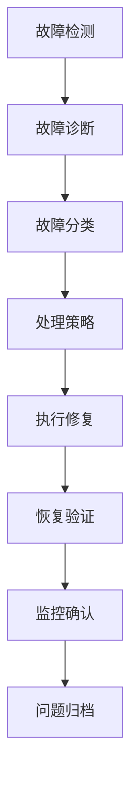

# 第10章：故障处理与恢复 - 代码示例

本章提供了故障处理与恢复相关的Python代码示例，涵盖健康检查、自动故障转移、故障注入和恢复验证等关键功能。

## 📁 文件列表

### 1. health_check.py - 健康检查系统
**功能特性：**
- 系统资源监控（CPU、内存、磁盘、网络）
- RabbitMQ服务健康检查
- 网络连通性诊断
- 实时健康监控
- 压力测试支持

**主要类：**
- `HealthChecker` - 基础健康检查器
- `RabbitMQHealthChecker` - RabbitMQ专用健康检查器
- `SystemHealthChecker` - 系统资源健康检查器
- `NetworkDiagnostics` - 网络诊断工具
- `ComprehensiveHealthChecker` - 综合健康检查器
- `HealthMonitor` - 健康监控器

**演示场景：**
- 基础健康检查
- 网络诊断
- 实时监控
- 压力测试

### 2. failover_manager.py - 自动故障转移管理器
**功能特性：**
- 多种故障转移策略（主动被动、主主、主备）
- 健康检查集成
- 熔断器模式
- 自动故障检测与转移
- 故障恢复管理

**主要类：**
- `FailoverStrategy` - 故障转移策略枚举
- `CircuitBreaker` - 熔断器实现
- `FailoverManager` - 故障转移管理器
- `BackupManager` - 备份管理器
- `DisasterRecoveryOrchestrator` - 灾难恢复编排器

**演示场景：**
- 端点管理
- 健康监控
- 故障转移模拟
- 备份操作
- 灾难恢复

### 3. fault_injection.py - 故障注入与演练
**功能特性：**
- 多种故障类型注入（CPU过载、内存压力、网络问题）
- 故障严重程度控制
- 系统资源故障注入
- 网络故障注入
- RabbitMQ特定故障注入

**主要类：**
- `FaultType` - 故障类型枚举
- `FaultInjector` - 故障注入编排器
- `SystemResourceInjector` - 系统资源故障注入器
- `NetworkFaultInjector` - 网络故障注入器
- `RabbitMQFaultInjector` - RabbitMQ故障注入器
- `FaultTestExecutor` - 故障测试执行器

**演示场景：**
- CPU过载测试
- 内存压力测试
- 网络延迟测试
- 队列溢出测试
- 复合故障测试

### 4. recovery_verification.py - 故障恢复验证
**功能特性：**
- 多级验证（基础、标准、综合、压力）
- 系统功能验证
- 性能恢复验证
- 实时恢复监控
- 趋势分析与建议

**主要类：**
- `VerificationLevel` - 验证级别枚举
- `RecoveryValidator` - 恢复验证器
- `ServiceHealthChecker` - 服务健康检查器
- `SystemResourceMonitor` - 系统资源监控器

**演示场景：**
- 基础验证
- 综合验证
- 恢复监控
- 趋势分析

## 🔧 环境要求

```bash
# 基础依赖
pip install requests
pip install psutil
pip install pika

# 选装依赖（用于高级功能）
pip install prometheus-client  # 监控指标
pip install matplotlib         # 趋势图表
```

## 📋 使用方法

### 1. 健康检查系统

```python
from health_check import ComprehensiveHealthChecker, HealthCheckDemo

# 创建检查器
checker = ComprehensiveHealthChecker({
    'rabbitmq': {'host': 'localhost', 'port': 5672}
})

# 执行检查
demo = HealthCheckDemo()
demo.demo_basic_check()
```

### 2. 故障转移管理

```python
from failover_manager import FailoverManager, FailoverStrategy

# 创建管理器
manager = FailoverManager({
    'primary': 'http://rabbitmq-1:15672',
    'secondary': 'http://rabbitmq-2:15672'
})

# 启动监控
manager.start_monitoring()
```

### 3. 故障注入演练

```python
from fault_injection import FaultTestExecutor, FaultType

# 创建执行器
executor = FaultTestExecutor()

# 注入CPU过载
executor.inject_fault(FaultType.CPU_OVERLOAD, 'high', 60)

# 执行故障测试
executor.execute_fault_scenario('basic_system_failure')
```

### 4. 恢复验证

```python
from recovery_verification import RecoveryValidator, VerificationLevel

# 创建验证器
validator = RecoveryValidator({
    'host': 'localhost',
    'port': 5672,
    'api_port': 15672
})

# 执行验证
report = validator.execute_verification(VerificationLevel.COMPREHENSIVE)
print(f"验证结果: {report.overall_status.value}")
```

## ⚙️ 配置参数

### 健康检查配置

```python
{
    'rabbitmq': {
        'host': 'localhost',          # RabbitMQ主机
        'port': 5672,                 # AMQP端口
        'api_port': 15672,            # 管理API端口
        'username': 'guest',          # 用户名
        'password': 'guest'           # 密码
    },
    'check_interval': 30,             # 检查间隔（秒）
    'timeout': 10                     # 超时时间（秒）
}
```

### 故障转移配置

```python
{
    'endpoints': {
        'primary': 'http://rabbitmq-1:15672',
        'secondary': 'http://rabbitmq-2:15672',
        'tertiary': 'http://rabbitmq-3:15672'
    },
    'strategy': 'active_passive',     # 故障转移策略
    'health_check_interval': 30,      # 健康检查间隔
    'failover_timeout': 60            # 故障转移超时
}
```

### 故障注入配置

```python
{
    'fault_types': ['cpu_overload', 'memory_pressure', 'network_delay'],
    'severity_levels': ['low', 'medium', 'high', 'critical'],
    'injection_duration': 300,        # 故障持续时间（秒）
    'cooldown_period': 60             # 冷却时间（秒）
}
```

## 📊 监控指标

### 系统级指标

| 指标名称 | 描述 | 阈值 |
|---------|------|------|
| CPU使用率 | 系统CPU使用百分比 | >90% 警告 |
| 内存使用率 | 系统内存使用百分比 | >80% 警告 |
| 磁盘使用率 | 磁盘空间使用百分比 | >85% 警告 |
| 网络IO | 网络输入输出字节数 | 异常检测 |

### RabbitMQ服务指标

| 指标名称 | 描述 | 正常范围 |
|---------|------|---------|
| 节点状态 | RabbitMQ节点运行状态 | 全部运行 |
| 队列状态 | 队列健康状况 | 无积压 |
| 连接数 | 活跃连接数量 | <1000 |
| 消息速率 | 消息发布/消费速率 | 稳定 |

## 🚨 告警级别

| 级别 | 描述 | 触发条件 |
|------|------|---------|
| INFO | 信息 | 一般状态变化 |
| WARNING | 警告 | 性能指标异常 |
| CRITICAL | 严重 | 服务不可用 |
| EMERGENCY | 紧急 | 系统完全故障 |

## 🔍 故障排查指南

### 1. 系统无响应
- 检查系统资源使用率
- 查看关键进程状态
- 验证网络连通性

### 2. RabbitMQ服务异常
- 检查RabbitMQ服务状态
- 验证端口可达性
- 查看管理API响应

### 3. 性能下降
- 分析资源使用趋势
- 检查队列积压情况
- 验证网络延迟

### 4. 故障转移失败
- 验证备份节点配置
- 检查健康检查逻辑
- 确认网络连通性

## 🛠️ 性能调优建议

### 健康检查优化
- 调整检查间隔平衡及时性和性能
- 优化检查项目避免不必要的开销
- 使用异步检查提高响应速度

### 故障转移优化
- 选择合适的故障转移策略
- 设置合理的健康检查超时
- 优化熔断器阈值

### 故障注入优化
- 逐步增加故障强度进行演练
- 控制故障注入时间避免系统损坏
- 配合恢复验证确保演练效果

## 📈 最佳实践

### 1. 健康检查最佳实践
- **定期检查**: 设置合理的检查频率
- **分级检查**: 根据重要程度分层检查
- **阈值设定**: 基于历史数据设定合理阈值
- **监控告警**: 集成告警系统及时响应

### 2. 故障转移最佳实践
- **策略选择**: 根据业务需求选择合适策略
- **演练测试**: 定期进行故障转移演练
- **监控验证**: 确保故障转移过程可监控
- **回滚机制**: 准备快速回滚方案

### 3. 故障注入最佳实践
- **渐进式演练**: 从简单故障开始逐步复杂化
- **环境隔离**: 在非生产环境进行演练
- **清理恢复**: 确保故障注入后完全恢复
- **文档记录**: 详细记录演练过程和结果

### 4. 恢复验证最佳实践
- **多级验证**: 使用不同验证级别全面检查
- **基线对比**: 与正常状态进行对比
- **趋势分析**: 持续监控系统趋势
- **自动化集成**: 集成到CI/CD流程

## 🔧 故障处理流程



## 📝 注意事项

1. **生产环境**: 在生产环境中谨慎使用故障注入功能
2. **数据备份**: 进行任何操作前确保有完整备份
3. **权限控制**: 确保有足够的系统权限执行相关操作
4. **监控准备**: 在操作前确保监控系统正常运行
5. **回滚准备**: 制定详细的回滚计划和预案

## 🔗 相关资源

- [RabbitMQ官方文档](https://www.rabbitmq.com/documentation.html)
- [RabbitMQ管理API文档](https://www.rabbitmq.com/management.html)
- [故障转移最佳实践](https://www.rabbitmq.com/ha.html)
- [监控和告警指南](https://www.rabbitmq.com/monitoring.html)

## 📞 支持与帮助

如果在使用过程中遇到问题，请：
1. 检查相关配置参数
2. 查看日志输出获取错误信息
3. 参考故障排查指南
4. 联系技术支持团队

---

**版本**: 1.0.0  
**最后更新**: 2024年12月  
**维护者**: 数据分析团队