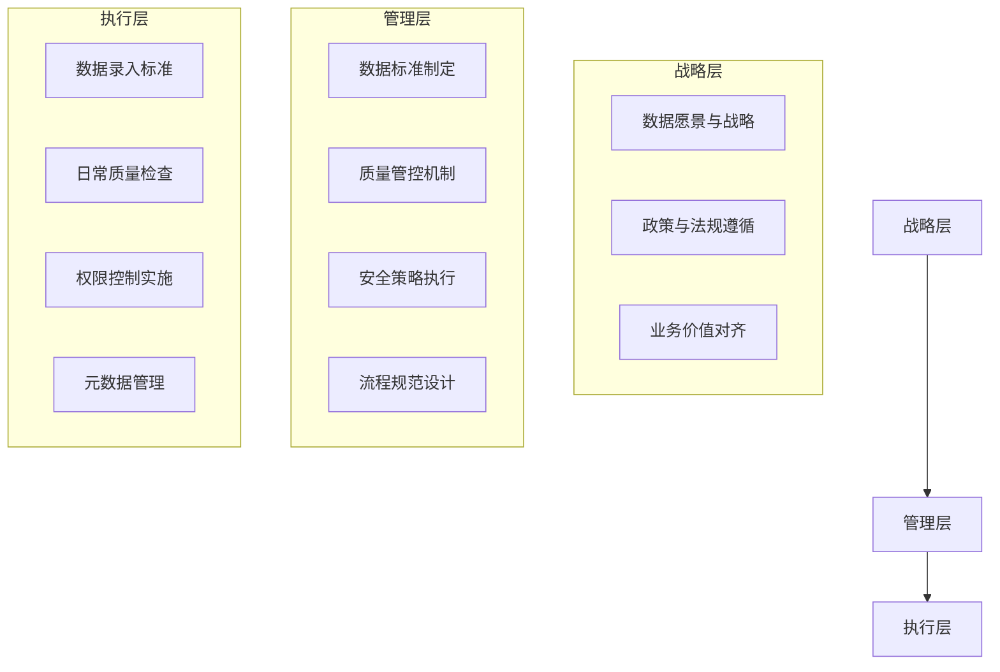
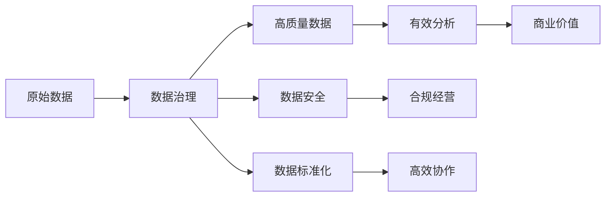
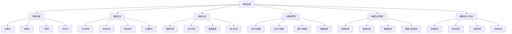
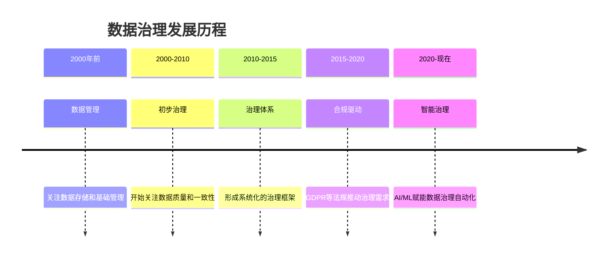
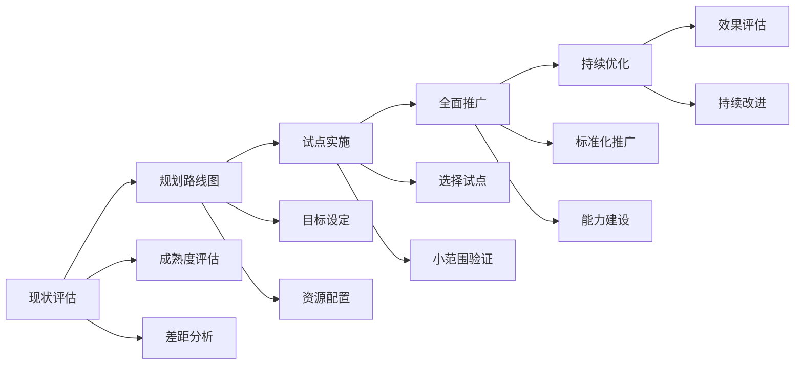

# 第1章：数据治理基础概念与入门

## 学习目标

通过本章学习，您将能够：
- 理解数据治理的定义和核心概念
- 了解数据治理的重要性和业务价值
- 掌握数据治理的核心组成要素
- 了解数据治理的发展历程和趋势
- 构建数据治理的基础认知框架

## 1.1 什么是数据治理

### 1.1.1 数据治理的定义

数据治理（Data Governance）是组织内部制定的一套制度、流程、标准和技术手段，用于管理企业数据资产，确保数据的质量、安全、合规和有效利用。

简单来说，数据治理就是"数据的宪法"，它回答了以下几个核心问题：
- 谁有权访问什么数据？
- 数据从哪里来？到哪里去？
- 数据的含义是什么？如何定义？
- 数据的质量如何？如何保证？
- 谁对数据负责？

### 1.1.2 数据治理的三个层面

从实施层面看，数据治理可以分为三个层次：



### 1.1.3 数据治理与相关概念的区别

| 概念 | 核心关注点 | 范围 | 主要活动 |
|------|------------|------|----------|
| **数据治理** | 规则、责任、流程 | 全企业范围 | 制定标准、规范流程、分配责任 |
| **数据管理** | 操作、执行、维护 | 特定数据领域 | 数据存储、备份、恢复、ETL |
| **数据工程** | 技术、架构、实现 | 技术实现层面 | 数据管道开发、数据架构设计 |
| **数据分析** | 价值、洞察、决策 | 业务价值提取 | 数据探索、建模、可视化 |

## 1.2 数据治理的重要性

### 1.2.1 数字化时代的数据价值

在数字化时代，数据已成为企业的核心资产之一。但原始数据本身并没有价值，只有经过有效管理和分析才能产生价值。数据治理是释放数据价值的基础保障。



### 1.2.2 业务价值与ROI

有效的数据治理可以带来显著的业务价值：

1. **提高决策质量**：基于高质量数据的决策更加可靠
2. **降低合规风险**：满足GDPR、等保等法规要求
3. **提升运营效率**：减少数据错误导致的工作重复
4. **增强客户信任**：保护客户隐私和数据安全
5. **促进数据创新**：标准化数据支持创新应用

### 1.2.3 案例分析：数据缺失的代价

某电商平台因数据治理不善导致的实际损失案例：

```python
# 示例1：用户地址信息不完整导致的物流损失
import pandas as pd

# 模拟数据
delivery_data = {
    'order_id': ['ORD001', 'ORD002', 'ORD003', 'ORD004'],
    'customer_address': ['北京市朝阳区', '', '上海市浦东新区新区大道1号', '广东省深圳市南山区'],
    'delivery_status': ['成功', '失败', '成功', '部分成功']
}

df = pd.DataFrame(delivery_data)

# 计算因地址不完整导致的失败率
failure_rate = df[df['customer_address'] == ''].shape[0] / df.shape[0] * 100
print(f"地址信息缺失导致的物流失败率: {failure_rate:.2f}%")

# 假设每个失败订单平均损失50元
average_loss_per_failed_order = 50
total_orders = 10000  # 每日订单量
daily_loss = total_orders * failure_rate / 100 * average_loss_per_failed_order

print(f"每日因地址不完整导致的损失: {daily_loss:.2f}元")
print(f"年度损失估算: {daily_loss * 365:.2f}元")
```

## 1.3 数据治理的核心组成要素

### 1.3.1 数据治理的六大支柱



### 1.3.2 数据质量 - 治理的基础

数据质量是数据治理最基础也是最核心的组成要素。高质量的数据应该具备以下特征：

1. **完整性**：数据没有缺失，覆盖业务所需的完整范围
2. **准确性**：数据与真实世界相符，没有错误
3. **一致性**：数据在不同系统间保持一致，没有矛盾
4. **及时性**：数据更新及时，反映最新状态
5. **可理解性**：数据含义清晰，容易被理解和使用

### 1.3.3 数据安全与隐私 - 治理的保障

数据安全与隐私保护是数据治理的重要组成部分，特别是在GDPR等法规环境下：

```python
# 示例2：个人敏感数据识别与保护
import re
import hashlib

def mask_sensitive_data(text):
    """模拟敏感数据脱敏处理"""
    # 识别手机号
    phone_pattern = r'(1[3-9]\d{9})'
    text = re.sub(phone_pattern, lambda m: f"{m.group(1)[:3]}****{m.group(1)[7:]}", text)
    
    # 识别身份证号
    id_pattern = r'(\d{17}[\dX])'
    text = re.sub(id_pattern, lambda m: f"{m.group(1)[:6]}********{m.group(1)[14:]}", text)
    
    # 识别邮箱
    email_pattern = r'([\w\.-]+@[\w\.-]+\.\w+)'
    text = re.sub(email_pattern, lambda m: f"{m.group(1)[:3]}***{m.group(1).split('@')[1]}", text)
    
    return text

# 测试数据
original_text = "用户张三（13812345678，身份证：110101199001011234）的邮箱是zhangsan@example.com，请联系他。"
masked_text = mask_sensitive_data(original_text)

print("原始文本:", original_text)
print("脱敏后文本:", masked_text)
```

### 1.3.4 元数据管理 - 治理的眼睛

元数据是"关于数据的数据"，是数据治理的重要工具。良好的元数据管理可以：

1. **提高数据发现效率**：帮助用户快速找到所需数据
2. **理解数据含义**：明确数据的业务含义和技术特征
3. **追踪数据血缘**：了解数据的来源、转换和去向
4. **评估数据质量**：监控数据质量指标和趋势

```python
# 示例3：简单的元数据管理系统
class MetadataManager:
    def __init__(self):
        self.metadata_store = {}
        self.data_lineage = {}
    
    def add_metadata(self, table_name, description, schema, owner, quality_score=None):
        """添加表元数据"""
        self.metadata_store[table_name] = {
            'description': description,
            'schema': schema,
            'owner': owner,
            'quality_score': quality_score,
            'created_at': pd.Timestamp.now(),
            'updated_at': pd.Timestamp.now()
        }
    
    def add_lineage(self, source_table, target_table, transformation):
        """添加数据血缘信息"""
        if source_table not in self.data_lineage:
            self.data_lineage[source_table] = []
        
        self.data_lineage[source_table].append({
            'target_table': target_table,
            'transformation': transformation,
            'created_at': pd.Timestamp.now()
        })
    
    def get_table_info(self, table_name):
        """获取表信息"""
        metadata = self.metadata_store.get(table_name, {})
        
        # 获取血缘信息
        sources = []
        for source, targets in self.data_lineage.items():
            for t in targets:
                if t['target_table'] == table_name:
                    sources.append({
                        'source_table': source,
                        'transformation': t['transformation']
                    })
        
        # 获取目标表信息
        targets = self.data_lineage.get(table_name, [])
        
        return {
            'metadata': metadata,
            'sources': sources,
            'targets': targets
        }

# 使用示例
manager = MetadataManager()

# 添加表元数据
manager.add_metadata(
    table_name="customers",
    description="客户基础信息表",
    schema=["customer_id", "name", "email", "phone", "address"],
    owner="customer_service_team",
    quality_score=95.5
)

manager.add_metadata(
    table_name="customer_orders",
    description="客户订单汇总表",
    schema=["customer_id", "order_id", "order_date", "amount"],
    owner="data_team",
    quality_score=98.2
)

# 添加血缘关系
manager.add_lineage(
    source_table="customers",
    target_table="customer_orders",
    transformation="左连接订单表，汇总客户订单信息"
)

# 查询表信息
customer_orders_info = manager.get_table_info("customer_orders")
print("customer_orders表信息:")
print(f"描述: {customer_orders_info['metadata']['description']}")
print(f"所有者: {customer_orders_info['metadata']['owner']}")
print(f"质量分数: {customer_orders_info['metadata']['quality_score']}")

print(f"\n数据来源:")
for source in customer_orders_info['sources']:
    print(f"- 来源表: {source['source_table']}, 转换: {source['transformation']}")
```

## 1.4 数据治理的发展历程

### 1.4.1 数据治理的演进

数据治理经历了从简单到复杂的发展过程：



### 1.4.2 当前数据治理面临的挑战

1. **数据量爆炸**：大数据时代数据量呈指数级增长
2. **数据类型多样化**：结构化、半结构化、非结构化数据并存
3. **数据源分散**：数据分布在本地、云端、边缘等多种环境
4. **法规要求严格**：GDPR、CCPA等法规要求越来越高
5. **技能缺口**：数据治理专业人才供不应求

### 1.4.3 未来发展趋势

1. **AI驱动的自动化治理**：使用机器学习自动发现数据问题
2. **数据治理即服务**：云平台提供的数据治理托管服务
3. **实时数据治理**：支持流式数据的实时治理能力
4. **联邦数据治理**：跨组织、跨地域的协同治理
5. **区块链赋能**：利用区块链技术增强数据可信度

## 1.5 构建数据治理思维模式

### 1.5.1 数据治理的思维方式

有效的数据治理需要培养以下思维模式：

1. **系统性思维**：从全局角度看待数据问题
2. **业务导向思维**：以业务价值为导向设计治理方案
3. **持续改进思维**：数据治理是持续优化的过程
4. **风险防控思维**：提前识别和防范数据风险
5. **标准化思维**：通过标准化提高治理效率

### 1.5.2 数据治理的实施路径

数据治理不是一蹴而就的，通常需要经历以下阶段：

1. **评估阶段**：评估当前数据治理现状和成熟度
2. **规划阶段**：制定数据治理路线图和实施计划
3. **试点阶段**：选择重点领域进行试点实施
4. **推广阶段**：将成功经验推广到整个组织
5. **优化阶段**：持续优化治理体系和流程



## 1.6 实践练习：评估组织数据治理成熟度

### 1.6.1 数据治理成熟度模型

```python
# 示例4：数据治理成熟度评估工具
class DataGovernanceMaturityModel:
    """数据治理成熟度评估模型"""
    
    def __init__(self):
        # 定义评估维度和问题
        self.dimensions = {
            "数据质量": [
                "是否有明确的数据质量标准？",
                "是否有数据质量监控机制？",
                "是否有数据质量改进流程？",
                "是否有数据质量责任人？"
            ],
            "数据安全": [
                "是否有数据分类分级标准？",
                "是否有访问控制策略？",
                "是否有数据加密机制？",
                "是否有安全审计流程？"
            ],
            "数据标准": [
                "是否有统一的数据字典？",
                "是否有数据命名规范？",
                "是否有数据模型标准？",
                "是否有数据接口规范？"
            ],
            "元数据管理": [
                "是否有元数据管理平台？",
                "是否有数据血缘追踪？",
                "是否有业务元数据？",
                "是否有技术元数据？"
            ],
            "组织与责任": [
                "是否有数据治理委员会？",
                "是否有明确的数据责任人？",
                "是否有数据治理流程？",
                "是否有数据治理培训？"
            ]
        }
        
        # 定义成熟度等级
        self.maturity_levels = {
            1: "初始级：无明确流程，无计划性",
            2: "可重复级：有基本流程，但不可预测",
            3: "已定义级：有标准流程并文档化",
            4: "已管理级：有度量和控制的流程",
            5: "优化级：持续改进和创新"
        }
    
    def assess_maturity(self):
        """评估数据治理成熟度"""
        results = {}
        
        for dimension, questions in self.dimensions.items():
            dimension_score = 0
            print(f"\n评估维度: {dimension}")
            print("="*50)
            
            for i, question in enumerate(questions):
                print(f"{i+1}. {question}")
                while True:
                    try:
                        score = int(input("请评分 (1-5): "))
                        if 1 <= score <= 5:
                            break
                        else:
                            print("请输入1-5之间的数字")
                    except ValueError:
                        print("请输入有效的数字")
                
                dimension_score += score
                print(f"评分: {score}\n")
            
            # 计算维度平均分
            avg_score = dimension_score / len(questions)
            results[dimension] = avg_score
            print(f"{dimension}维度平均分: {avg_score:.2f}")
        
        # 计算总体成熟度
        overall_score = sum(results.values()) / len(results)
        results["总体成熟度"] = overall_score
        
        return results
    
    def generate_report(self, results):
        """生成评估报告"""
        print("\n" + "="*60)
        print("数据治理成熟度评估报告")
        print("="*60)
        
        # 显示各维度得分
        for dimension, score in results.items():
            if dimension == "总体成熟度":
                continue
                
            level = int(score)
            print(f"\n{dimension}: {score:.2f} ({self.maturity_levels[level]})")
        
        # 总体评估
        overall_score = results["总体成熟度"]
        level = int(overall_score)
        print(f"\n总体成熟度: {overall_score:.2f} ({self.maturity_levels[level]})")
        
        # 改进建议
        print("\n改进建议:")
        weakest_dimension = min((k, v) for k, v in results.items() if k != "总体成熟度")[0]
        print(f"- 优先改进领域: {weakest_dimension}")
        
        if overall_score < 2:
            print("- 建议建立基本的数据治理框架和流程")
        elif overall_score < 3:
            print("- 建议完善数据治理流程并文档化")
        elif overall_score < 4:
            print("- 建议建立度量指标和控制机制")
        else:
            print("- 建议建立持续改进和创新机制")

# 运行评估
print("数据治理成熟度评估工具")
print("评分说明：")
print("1=完全没有实施")
print("2=初步实施但不完整")
print("3=基本实施并文档化")
print("4=全面实施并有控制")
print("5=全面实施并持续优化")

# 如果你想运行这个评估，请取消下面的注释
# assessor = DataGovernanceMaturityModel()
# results = assessor.assess_maturity()
# assessor.generate_report(results)
```

### 1.6.2 小型组织数据治理启动计划

对于小型组织，可以从以下简单步骤开始实施数据治理：

```python
# 示例5：小型组织数据治理启动计划
class SmallOrgGovernanceInitiative:
    """小型组织数据治理启动方案"""
    
    def __init__(self):
        self.action_items = {
            "第1周": [
                "识别关键业务数据资产",
                "任命数据治理负责人",
                "组建跨职能数据治理小组"
            ],
            "第2-4周": [
                "评估当前数据质量问题",
                "识别最紧急的数据风险",
                "制定数据治理政策框架"
            ],
            "第2个月": [
                "实施基础数据质量检查",
                "建立关键数据目录",
                "制定数据安全基础策略"
            ],
            "第3-6个月": [
                "实施元数据管理工具",
                "建立数据质量监控机制",
                "开展数据治理培训"
            ],
            "第6-12个月": [
                "评估治理效果",
                "完善治理流程",
                "扩展治理范围"
            ]
        }
    
    def generate_implementation_plan(self):
        """生成实施计划"""
        print("小型组织数据治理启动计划")
        print("="*50)
        
        for period, items in self.action_items.items():
            print(f"\n{period}:")
            for item in items:
                print(f"- {item}")
    
    def calculate_roi(self, employees=50, annual_revenue=10000000):
        """估算数据治理投资回报率"""
        # 估算成本
        governance_cost = {
            "人员成本": 200000,  # 兼职数据治理负责人
            "工具成本": 50000,   # 基础工具和培训
            "机会成本": 50000,   # 员工时间投入
        }
        
        total_cost = sum(governance_cost.values())
        
        # 估算收益
        benefits = {
            "减少数据错误导致的工作重复": 200000,
            "提高决策质量": 300000,
            "降低合规风险": 150000,
            "提高客户满意度": 100000,
        }
        
        total_benefit = sum(benefits.values())
        
        roi = (total_benefit - total_cost) / total_cost * 100
        
        print("\n数据治理ROI估算")
        print("="*50)
        print("\n成本分析:")
        for item, cost in governance_cost.items():
            print(f"- {item}: ¥{cost:,}")
        print(f"\n总成本: ¥{total_cost:,}")
        
        print("\n收益分析:")
        for item, benefit in benefits.items():
            print(f"- {item}: ¥{benefit:,}")
        print(f"\n总收益: ¥{total_benefit:,}")
        
        print(f"\n投资回报率(ROI): {roi:.1f}%")
        
        return roi

# 生成实施计划
initiative = SmallOrgGovernanceInitiative()
initiative.generate_implementation_plan()

# 计算ROI
roi = initiative.calculate_roi(employees=50, annual_revenue=10000000)
```

## 本章小结

本章介绍了数据治理的基础概念，包括数据治理的定义、重要性、核心组成要素和发展历程。通过学习本章，您应该：

1. 理解数据治理的定义和核心概念
2. 了解数据治理的重要性和业务价值
3. 掌握数据治理的核心组成要素
4. 了解数据治理的发展历程和趋势
5. 构建数据治理的基础认知框架

数据治理是一个系统性的工程，需要组织层面的支持和持续的投入。下一章我们将深入探讨数据治理的框架与方法论，为您提供更具体的实施指导。

## 思考题

1. 在您的组织中，数据治理面临的最大挑战是什么？如何应对？
2. 数据治理与数据管理有何区别？为什么这种区别很重要？
3. 如何评估您所在组织的数据治理成熟度？最需要改进的方面是什么？
4. 对于小型组织，如何平衡数据治理的成本与收益？

## 实践作业

1. 使用本章提供的数据治理成熟度评估工具，评估您所在组织的当前状态
2. 基于评估结果，制定一个适合您组织的数据治理改进计划
3. 尝试使用Python代码示例，构建一个简单的元数据管理系统
4. 分析一个真实的数据质量问题，估算其业务影响，并提出改进建议