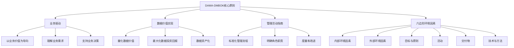
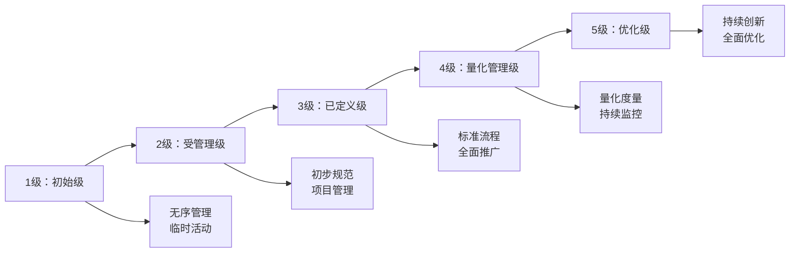
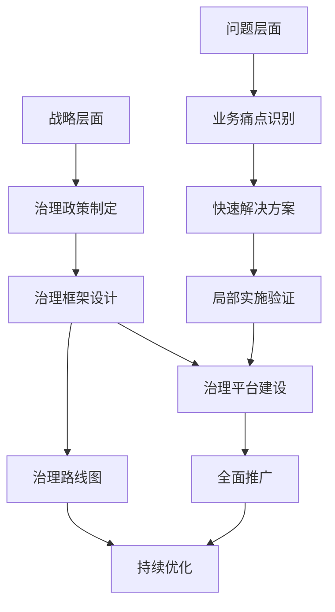

# 第2章：数据治理框架与方法论

## 学习目标

通过本章学习，您将能够：
- 了解主流数据治理框架及其特点
- 掌握数据治理方法论的选择与应用
- 学会构建适合组织的数据治理框架
- 了解数据治理成熟度模型及其应用
- 掌握数据治理实施路径和关键步骤

## 2.1 数据治理框架概述

### 2.1.1 什么是数据治理框架

数据治理框架是一套系统化的方法、原则、流程和工具，用于指导组织实施和管理数据治理活动。它为组织提供了实施治理的蓝图和路径，确保数据治理活动能够系统化、标准化地进行。

**框架的核心作用**：
- 提供结构化的实施指导
- 确保治理活动的全面性和一致性
- 明确角色职责和流程步骤
- 提供评估和持续改进的基础

### 2.1.2 主流数据治理框架对比

| 框架名称 | 发布组织 | 核心特点 | 适用场景 | 复杂度 |
|----------|----------|----------|----------|----------|
| **DAMA-DMBOK** | DAMA国际 | 全面的数据管理知识体系 | 大型组织、数据治理成熟度较高 | 高 |
| **DCMM** | 中国电子技术标准化研究院 | 中国特色的数据管理能力成熟度模型 | 国内企业、政府机构 | 中 |
| **CMMI-DMM** | CMMI研究所 | 过程改进导向的数据管理 | 注重流程改进的企业 | 中高 |
| **EDM Council** | EDM委员会 | 金融机构数据治理最佳实践 | 金融机构 | 中高 |
| **IBM数据治理框架** | IBM公司 | 技术实施导向 | 使用IBM技术栈的企业 | 中 |

### 2.1.3 框架选择考虑因素

选择适合的数据治理框架时，应考虑以下因素：

1. **组织规模与复杂度**
   - 小型组织：选择轻量级框架
   - 大型组织：选择全面框架
   - 跨国企业：考虑多地区、多法规要求

2. **行业特点**
   - 金融行业：侧重合规与风险管理
   - 制造业：侧重产品数据与供应链数据
   - 零售业：侧重客户数据与营销数据

3. **技术环境**
   - 云原生环境：选择支持云数据治理的框架
   - 混合云环境：需要跨环境治理能力
   - 传统IT环境：需要考虑集成现有系统

4. **成熟度水平**
   - 初级阶段：选择注重基础建设的框架
   - 中级阶段：选择标准化和流程化框架
   - 高级阶段：选择支持持续优化的框架

## 2.2 DAMA-DMBOK框架详解

### 2.2.1 DAMA-DMBOK概述

数据管理知识体系（Data Management Body of Knowledge, DMBOK）是由DAMA国际发布的数据管理权威指南，是目前最全面、最系统的数据治理框架。

**DMBOK 2.0十大知识领域**：
1. 数据治理
2. 数据架构
3. 数据建模与设计
4. 数据存储与操作
5. 数据安全
6. 数据集成与互操作性
7. 数据质量
8. 主数据管理
9. 参考数据管理
10. 数据生命周期管理

### 2.2.2 DAMA-DMBOK核心原则



### 2.2.3 DAMA-DMBOK实施方法

**实施步骤**：

1. **评估阶段**
   - 评估当前数据管理成熟度
   - 识别业务需求与期望
   - 分析差距和挑战

2. **规划阶段**
   - 制定数据管理战略
   - 设计数据管理组织架构
   - 规划实施路线图

3. **实施阶段**
   - 建立数据管理组织
   - 实施数据管理流程
   - 部署数据管理工具

4. **优化阶段**
   - 监控数据管理效果
   - 持续优化流程和工具
   - 扩展数据管理范围

## 2.3 DCMM框架详解

### 2.3.1 DCMM概述

数据管理能力成熟度评估模型（Data Management Capability Maturity Model, DCMM）是中国电子技术标准化研究院发布的数据管理评估标准，是国内权威的数据管理能力评估框架。

**DCMM八大能力域**：
1. 数据战略
2. 数据治理
3. 数据架构
4. 数据标准
5. 数据质量
6. 数据安全
7. 数据应用
8. 数据生存周期

### 2.3.2 DCMM成熟度等级



### 2.3.3 DCMM评估过程

```python
# 示例：DCMM成熟度评估工具
class DCMMAssessmentTool:
    """DCMM成熟度评估工具"""
    
    def __init__(self):
        # DCMM八大能力域
        self.capability_domains = {
            "数据战略": {
                "description": "制定和执行组织数据战略，确保数据管理与业务战略一致",
                "practices": {
                    "1级": [
                        "有基本的数据需求",
                        "有初步的数据应用"
                    ],
                    "2级": [
                        "有数据战略规划",
                        "有数据战略执行计划",
                        "有基本的资源配置"
                    ],
                    "3级": [
                        "有完整的数据战略体系",
                        "有战略评估机制",
                        "有战略优化流程"
                    ],
                    "4级": [
                        "有战略量化指标",
                        "有战略监控机制",
                        "有战略改进措施"
                    ],
                    "5级": [
                        "有战略创新能力",
                        "有战略引领作用",
                        "有最佳实践推广"
                    ]
                }
            },
            "数据治理": {
                "description": "建立数据治理组织、流程和制度，确保数据有序管理",
                "practices": {
                    "1级": [
                        "有基本的数据管理活动",
                        "有数据责任划分"
                    ],
                    "2级": [
                        "有数据治理组织",
                        "有数据治理制度",
                        "有数据治理流程"
                    ],
                    "3级": [
                        "有完善的治理体系",
                        "有制度执行监督",
                        "有治理效果评估"
                    ],
                    "4级": [
                        "有治理量化指标",
                        "有治理监控机制",
                        "有治理改进措施"
                    ],
                    "5级": [
                        "有治理创新能力",
                        "有治理最佳实践",
                        "有治理行业标准"
                    ]
                }
            },
            "数据架构": {
                "description": "设计和管理数据架构，确保数据结构合理和流转高效",
                "practices": {
                    "1级": [
                        "有基本的数据存储",
                        "有简单的数据应用"
                    ],
                    "2级": [
                        "有数据架构设计",
                        "有数据架构管理",
                        "有架构评估机制"
                    ],
                    "3级": [
                        "有完善的架构体系",
                        "有架构标准规范",
                        "有架构治理机制"
                    ],
                    "4级": [
                        "有架构量化指标",
                        "有架构监控机制",
                        "有架构优化措施"
                    ],
                    "5级": [
                        "有架构创新能力",
                        "有架构最佳实践",
                        "有架构行业标准"
                    ]
                }
            },
            "数据标准": {
                "description": "制定和实施数据标准，确保数据一致性和互操作性",
                "practices": {
                    "1级": [
                        "有基本的数据定义",
                        "有简单的数据规范"
                    ],
                    "2级": [
                        "有数据标准体系",
                        "有标准制定流程",
                        "有标准实施机制"
                    ],
                    "3级": [
                        "有完善的标准体系",
                        "有标准管理平台",
                        "有标准执行监督"
                    ],
                    "4级": [
                        "有标准量化指标",
                        "有标准监控机制",
                        "有标准改进措施"
                    ],
                    "5级": [
                        "有标准创新能力",
                        "有标准最佳实践",
                        "有标准行业标准"
                    ]
                }
            },
            "数据质量": {
                "description": "建立数据质量管理体系，确保数据满足业务需求",
                "practices": {
                    "1级": [
                        "有基本的数据检查",
                        "有简单的质量问题识别"
                    ],
                    "2级": [
                        "有数据质量标准",
                        "有质量检查流程",
                        "有质量改进措施"
                    ],
                    "3级": [
                        "有完善的质量体系",
                        "有质量监控机制",
                        "有质量评估机制"
                    ],
                    "4级": [
                        "有质量量化指标",
                        "有质量预测能力",
                        "有质量优化措施"
                    ],
                    "5级": [
                        "有质量创新能力",
                        "有质量最佳实践",
                        "有质量行业标准"
                    ]
                }
            },
            "数据安全": {
                "description": "建立数据安全管理体系，确保数据保密性、完整性和可用性",
                "practices": {
                    "1级": [
                        "有基本的安全措施",
                        "有简单的访问控制"
                    ],
                    "2级": [
                        "有数据安全策略",
                        "有安全管理制度",
                        "有安全技术措施"
                    ],
                    "3级": [
                        "有完善的安全体系",
                        "有安全管理平台",
                        "有安全监督机制"
                    ],
                    "4级": [
                        "有安全量化指标",
                        "有安全监控机制",
                        "有安全改进措施"
                    ],
                    "5级": [
                        "有安全创新能力",
                        "有安全最佳实践",
                        "有安全行业标准"
                    ]
                }
            },
            "数据应用": {
                "description": "开发和应用数据产品，发挥数据价值",
                "practices": {
                    "1级": [
                        "有基本的数据使用",
                        "有简单的数据分析"
                    ],
                    "2级": [
                        "有数据应用策略",
                        "有应用开发流程",
                        "有应用管理机制"
                    ],
                    "3级": [
                        "有完善的应用体系",
                        "有应用平台支撑",
                        "有应用评估机制"
                    ],
                    "4级": [
                        "有应用量化指标",
                        "有应用监控机制",
                        "有应用优化措施"
                    ],
                    "5级": [
                        "有应用创新能力",
                        "有应用最佳实践",
                        "有应用行业标准"
                    ]
                }
            },
            "数据生存周期": {
                "description": "管理数据全生命周期，确保数据有序流转和有效利用",
                "practices": {
                    "1级": [
                        "有基本的数据存储",
                        "有简单的数据使用"
                    ],
                    "2级": [
                        "有生命周期规划",
                        "有生命周期管理",
                        "有生命周期制度"
                    ],
                    "3级": [
                        "有完善的生命周期体系",
                        "有生命周期平台",
                        "有生命周期监督"
                    ],
                    "4级": [
                        "有生命周期量化指标",
                        "有生命周期监控",
                        "有生命周期优化"
                    ],
                    "5级": [
                        "有生命周期创新",
                        "有生命周期最佳实践",
                        "有生命周期行业标准"
                    ]
                }
            }
        }
    
    def assess_maturity_level(self, domain_scores):
        """
        根据各能力域得分计算整体成熟度等级
        
        Args:
            domain_scores: 各能力域得分字典 {domain: score}
            
        Returns:
            整体成熟度等级和各能力域等级
        """
        # 计算各能力域的成熟度等级
        domain_levels = {}
        for domain, score in domain_scores.items():
            if score <= 20:
                level = 1
            elif score <= 40:
                level = 2
            elif score <= 60:
                level = 3
            elif score <= 80:
                level = 4
            else:
                level = 5
            domain_levels[domain] = level
        
        # 计算整体成熟度等级
        overall_score = sum(domain_scores.values()) / len(domain_scores)
        if overall_score <= 20:
            overall_level = 1
        elif overall_score <= 40:
            overall_level = 2
        elif overall_score <= 60:
            overall_level = 3
        elif overall_score <= 80:
            overall_level = 4
        else:
            overall_level = 5
        
        return overall_level, domain_levels
    
    def generate_improvement_plan(self, domain_levels):
        """
        根据成熟度评估结果生成改进计划
        
        Args:
            domain_levels: 各能力域等级字典 {domain: level}
            
        Returns:
            改进计划字典
        """
        improvement_plan = {}
        
        for domain, current_level in domain_levels.items():
            target_level = min(current_level + 1, 5)  # 目标为下一级
            domain_info = self.capability_domains[domain]
            
            # 获取当前级别已实施和下一级别待实施的最佳实践
            current_practices = domain_info["practices"][f"{current_level}级"]
            target_practices = domain_info["practices"][f"{target_level}级"]
            
            improvement_plan[domain] = {
                "current_level": current_level,
                "target_level": target_level,
                "description": domain_info["description"],
                "current_practices": current_practices,
                "target_practices": target_practices,
                "improvement_actions": self._generate_improvement_actions(domain, current_level, target_level)
            }
        
        return improvement_plan
    
    def _generate_improvement_actions(self, domain, current_level, target_level):
        """生成改进行动计划"""
        actions = []
        
        if domain == "数据战略":
            if current_level <= 2 and target_level >= 3:
                actions.extend([
                    "制定完整的数据战略规划文档",
                    "建立数据战略执行监督机制",
                    "设立数据战略评估指标体系"
                ])
        
        elif domain == "数据治理":
            if current_level <= 2 and target_level >= 3:
                actions.extend([
                    "完善数据治理组织架构",
                    "建立数据治理制度和流程",
                    "实施数据治理监督和评估机制"
                ])
        
        elif domain == "数据质量":
            if current_level <= 2 and target_level >= 3:
                actions.extend([
                    "建立完善的数据质量管理体系",
                    "实施数据质量监控平台",
                    "制定数据质量评估机制"
                ])
        
        # 其他域的改进行动...
        
        return actions
    
    def generate_report(self, domain_scores, improvement_plan):
        """生成DCMM评估报告"""
        overall_level, domain_levels = self.assess_maturity_level(domain_scores)
        
        report = {
            "overall_level": overall_level,
            "domain_levels": domain_levels,
            "domain_scores": domain_scores,
            "improvement_plan": improvement_plan,
            "level_description": self._get_level_description(overall_level)
        }
        
        return report
    
    def _get_level_description(self, level):
        """获取成熟度等级描述"""
        descriptions = {
            1: "初始级：数据管理活动无序，依赖于个人经验，缺乏统一的标准和流程。",
            2: "受管理级：开始有计划地进行数据管理，但实施不系统，效果不稳定。",
            3: "已定义级：有标准化的流程和制度，数据管理活动得到有效推广。",
            4: "量化管理级：有量化的指标和监控机制，数据管理效果可度量和控制。",
            5: "优化级：持续创新和优化，数据管理达到行业领先水平。"
        }
        return descriptions.get(level, "未知级别")

# 使用示例
def dcmm_assessment_example():
    """DCMM评估示例"""
    # 模拟各能力域得分
    domain_scores = {
        "数据战略": 45,
        "数据治理": 35,
        "数据架构": 40,
        "数据标准": 30,
        "数据质量": 55,
        "数据安全": 50,
        "数据应用": 45,
        "数据生存周期": 40
    }
    
    # 创建评估工具
    tool = DCMMAssessmentTool()
    
    # 评估成熟度
    overall_level, domain_levels = tool.assess_maturity_level(domain_scores)
    
    # 生成改进计划
    improvement_plan = tool.generate_improvement_plan(domain_levels)
    
    # 生成报告
    report = tool.generate_report(domain_scores, improvement_plan)
    
    # 打印报告
    print("="*60)
    print("DCMM数据管理能力成熟度评估报告")
    print("="*60)
    
    print(f"\n整体成熟度等级: {overall_level}级")
    print(f"等级描述: {report['level_description']}")
    
    print("\n各能力域成熟度:")
    for domain, level in domain_levels.items():
        score = domain_scores[domain]
        print(f"  {domain}: {level}级 ({score}分)")
    
    print("\n改进计划:")
    for domain, plan in improvement_plan.items():
        print(f"\n{domain} (从{plan['current_level']}级提升到{plan['target_level']}级):")
        print(f"  描述: {plan['description']}")
        print(f"  待实施的最佳实践:")
        for practice in plan['target_practices']:
            print(f"    - {practice}")
        print(f"  改进行动:")
        for action in plan['improvement_actions']:
            print(f"    - {action}")
    
    return report

# 运行示例
# dcmm_assessment_example()
```

## 2.4 数据治理方法论选择与应用

### 2.4.1 自顶向下 vs 自底向上方法

**自顶向下方法**：
- 从战略和政策出发，逐步分解到实施细节
- 优点：整体性强，确保与业务战略一致
- 缺点：实施周期长，见效慢
- 适合：大型企业、成熟度高

**自底向上方法**：
- 从具体问题出发，逐步构建治理体系
- 优点：见效快，灵活性强
- 缺点：整体性不足，容易形成信息孤岛
- 适合：中小型企业、快速响应需求

### 2.4.2 混合式实施方法

结合自顶向下和自底向上的优点，采用"战略指导、问题驱动"的混合方法：



### 2.4.3 方法论选择决策矩阵

| 组织因素 | 自顶向下 | 混合式 | 自底向上 |
|----------|----------|---------|----------|
| **大型企业 (>5000人)** | 推荐 | 最推荐 | 不推荐 |
| **中型企业 (500-5000人)** | 可考虑 | 最推荐 | 可考虑 |
| **小型企业 (<500人)** | 不推荐 | 最推荐 | 推荐 |
| **高合规要求行业** | 最推荐 | 推荐 | 不推荐 |
| **快速变化业务环境** | 不推荐 | 最推荐 | 推荐 |
| **现有IT基础设施复杂** | 推荐 | 最推荐 | 不推荐 |
| **数据治理成熟度高** | 最推荐 | 推荐 | 不推荐 |
| **数据治理成熟度低** | 不推荐 | 最推荐 | 推荐 |

## 2.5 构建自定义数据治理框架

### 2.5.1 框架构建步骤

1. **需求分析阶段**
   - 识别业务需求和挑战
   - 分析现有数据管理现状
   - 明确治理目标和范围

2. **框架设计阶段**
   - 选择参考框架（DMBOK、DCMM等）
   - 设计治理组织架构
   - 定义治理流程和标准

3. **实施规划阶段**
   - 制定实施路线图
   - 分配资源和责任
   - 确定优先级和时间表

4. **试点实施阶段**
   - 选择试点领域
   - 实施治理机制
   - 评估试点效果

5. **全面推广阶段**
   - 推广成功经验
   - 完善治理体系
   - 建立持续改进机制

### 2.5.2 框架核心组件设计

```python
# 示例：自定义数据治理框架设计器
class CustomGovernanceFramework:
    """自定义数据治理框架设计器"""
    
    def __init__(self, org_name, industry, size):
        """初始化框架设计器
        
        Args:
            org_name: 组织名称
            industry: 行业
            size: 组织规模 (小型/中型/大型)
        """
        self.org_name = org_name
        self.industry = industry
        self.size = size
        self.framework_components = {}
    
    def design_governance_structure(self):
        """设计治理组织结构"""
        # 基于组织规模设计不同层次的治理组织
        if self.size == "小型":
            governance_structure = {
                "决策层": ["数据治理负责人"],
                "管理层": ["业务代表", "IT代表"],
                "执行层": ["数据管理员", "数据开发人员"]
            }
        elif self.size == "中型":
            governance_structure = {
                "决策层": ["数据治理委员会", "首席数据官"],
                "管理层": ["业务数据负责人", "技术数据负责人", "数据治理办公室"],
                "执行层": ["数据管理员", "数据质量专员", "数据安全专员"]
            }
        else:  # 大型
            governance_structure = {
                "决策层": ["数据治理委员会", "首席数据官", "业务部门主管"],
                "管理层": ["业务数据负责人", "技术数据负责人", "数据治理办公室", 
                           "数据安全委员会", "数据架构委员会"],
                "执行层": ["领域数据管家", "数据质量分析师", "数据安全专家", 
                           "元数据管理专家", "数据开发工程师"]
            }
        
        self.framework_components["治理组织结构"] = governance_structure
        return governance_structure
    
    def define_governance_domains(self):
        """定义治理域"""
        # 基于行业特点确定重点治理域
        base_domains = [
            "数据质量管理",
            "数据安全管理",
            "元数据管理",
            "主数据管理"
        ]
        
        # 根据行业添加特定治理域
        if self.industry in ["金融", "保险", "证券"]:
            industry_specific_domains = [
                "数据合规管理",
                "数据隐私保护",
                "数据风险评估"
            ]
        elif self.industry in ["制造", "能源", "交通"]:
            industry_specific_domains = [
                "产品数据管理",
                "供应链数据管理",
                "设备数据管理"
            ]
        elif self.industry in ["零售", "电商", "消费"]:
            industry_specific_domains = [
                "客户数据管理",
                "营销数据管理",
                "用户体验数据管理"
            ]
        else:  # 通用
            industry_specific_domains = [
                "业务数据管理",
                "分析数据管理",
                "数据生命周期管理"
            ]
        
        governance_domains = base_domains + industry_specific_domains
        self.framework_components["治理域"] = governance_domains
        return governance_domains
    
    def establish_governance_processes(self):
        """建立治理流程"""
        governance_processes = {
            "决策流程": {
                "治理政策制定": ["需求分析", "草案编写", "评审", "发布"],
                "标准制定": ["调研", "编写", "评审", "批准", "发布"],
                "冲突解决": ["问题识别", "影响分析", "解决方案", "实施"]
            },
            "管理流程": {
                "数据质量监控": ["检查", "报告", "分析", "改进"],
                "数据安全审计": ["评估", "整改", "验证", "报告"],
                "元数据管理": ["收集", "整合", "更新", "发布"]
            },
            "执行流程": {
                "数据访问控制": ["申请", "审批", "授权", "审计"],
                "数据问题处理": "报告, 分析, 解决, 验证",
                "数据变更管理": ["需求", "影响分析", "实施", "验证"]
            }
        }
        
        self.framework_components["治理流程"] = governance_processes
        return governance_processes
    
    def define_governance_policies(self):
        """定义治理政策"""
        governance_policies = {
            "数据质量管理政策": {
                "目的": "确保数据满足业务需求",
                "范围": "组织内所有数据",
                "责任": "数据质量专员负责",
                "措施": [
                    "建立数据质量标准",
                    "实施数据质量监控",
                    "定期评估数据质量"
                ]
            },
            "数据安全管理政策": {
                "目的": "保护数据资产安全",
                "范围": "所有敏感和关键数据",
                "责任": "数据安全专员负责",
                "措施": [
                    "数据分类分级",
                    "访问控制机制",
                    "安全审计机制"
                ]
            },
            "元数据管理政策": {
                "目的": "确保数据可发现、可理解",
                "范围": "所有数据资产",
                "责任": "元数据管理员负责",
                "措施": [
                    "建立元数据标准",
                    "实施元数据管理平台",
                    "维护元数据完整性"
                ]
            },
            "数据访问政策": {
                "目的": "规范数据访问行为",
                "范围": "所有数据访问活动",
                "责任": "数据管理员负责",
                "措施": [
                    "权限申请流程",
                    "访问审计机制",
                    "违规处罚措施"
                ]
            }
        }
        
        # 根据行业添加特定政策
        if self.industry in ["金融", "保险", "证券"]:
            governance_policies["数据合规政策"] = {
                "目的": "满足监管合规要求",
                "范围": "所有业务数据",
                "责任": "合规专员负责",
                "措施": [
                    "合规性评估",
                    "监管报告生成",
                    "合规审计执行"
                ]
            }
        
        self.framework_components["治理政策"] = governance_policies
        return governance_policies
    
    def define_metrics_and_kpis(self):
        """定义度量指标和KPI"""
        metrics_kpis = {
            "数据质量指标": {
                "完整性": "非空值比例",
                "准确性": "错误记录比例",
                "一致性": "跨系统一致率",
                "及时性": "数据更新延迟"
            },
            "数据安全指标": {
                "安全事件数量": "季度内安全事件总数",
                "违规访问次数": "季度内违规访问次数",
                "权限合规率": "权限设置合规比例",
                "加密覆盖率": "敏感数据加密比例"
            },
            "数据使用效率指标": {
                "数据查找时间": "平均数据发现时间",
                "数据申请处理时间": "平均申请处理时间",
                "数据重复率": "重复数据资产比例",
                "数据使用率": "数据资产使用频率"
            },
            "治理效果指标": {
                "治理覆盖率": "纳入治理的数据资产比例",
                "问题解决时间": "平均问题解决时间",
                "用户满意度": "治理服务满意度",
                "治理ROI": "治理投资回报率"
            }
        }
        
        self.framework_components["度量指标"] = metrics_kpis
        return metrics_kpis
    
    def generate_framework_document(self):
        """生成框架文档"""
        # 设计各组件
        governance_structure = self.design_governance_structure()
        governance_domains = self.define_governance_domains()
        governance_processes = self.establish_governance_processes()
        governance_policies = self.define_governance_policies()
        metrics_kpis = self.define_metrics_and_kpis()
        
        # 生成文档
        framework_document = {
            "组织名称": self.org_name,
            "行业": self.industry,
            "组织规模": self.size,
            "框架版本": "1.0",
            "创建时间": pd.Timestamp.now().strftime('%Y-%m-%d'),
            "组件": self.framework_components
        }
        
        return framework_document
    
    def export_framework(self, filename):
        """导出框架文档"""
        framework_document = self.generate_framework_document()
        
        with open(filename, 'w', encoding='utf-8') as f:
            json.dump(framework_document, f, ensure_ascii=False, indent=2)
        
        print(f"数据治理框架文档已导出到: {filename}")


# 使用示例
def custom_framework_example():
    """自定义框架示例"""
    print("="*60)
    print("自定义数据治理框架设计器")
    print("="*60)
    
    # 创建框架设计器
    framework = CustomGovernanceFramework(
        org_name="示例科技公司",
        industry="金融",
        size="中型"
    )
    
    # 生成框架文档
    framework_document = framework.generate_framework_document()
    
    # 打印关键组件
    print("\n1. 治理组织结构:")
    structure = framework_document["组件"]["治理组织结构"]
    for level, roles in structure.items():
        print(f"  {level}: {', '.join(roles)}")
    
    print("\n2. 治理域:")
    domains = framework_document["组件"]["治理域"]
    for domain in domains:
        print(f"  - {domain}")
    
    print("\n3. 治理政策概览:")
    policies = framework_document["组件"]["治理政策"]
    for policy, details in policies.items():
        print(f"  - {policy}: {details['目的']}")
    
    print("\n4. 关键指标:")
    metrics = framework_document["组件"]["度量指标"]
    for category, kpis in metrics.items():
        print(f"  {category}: {list(kpis.keys())}")
    
    # 导出框架文档
    framework.export_framework("custom_governance_framework.json")
    
    return framework

# 运行示例
# custom_framework_example()
```

## 2.6 数据治理成熟度评估与提升

### 2.6.1 成熟度评估模型

基于DCMM和DAMA-DMBOK，我们可以设计一个综合的成熟度评估模型：

```python
# 示例：综合数据治理成熟度评估模型
class ComprehensiveMaturityAssessment:
    """综合数据治理成熟度评估模型"""
    
    def __init__(self):
        # 定义评估维度
        self.dimensions = {
            "组织与文化": {
                "description": "评估数据治理组织架构和文化建设水平",
                "indicators": {
                    "治理组织建设": {
                        "1级": "无专门的数据治理组织",
                        "2级": "有初步的治理组织，但职责不清",
                        "3级": "有明确的治理组织和职责",
                        "4级": "治理组织运行有效，职责明确",
                        "5级": "治理组织引领数据文化建设"
                    },
                    "治理文化": {
                        "1级": "无数据治理意识",
                        "2级": "初步形成数据治理概念",
                        "3级": "数据治理得到普遍认同",
                        "4级": "数据成为组织战略资产",
                        "5级": "数据驱动成为组织DNA"
                    }
                }
            },
            "制度与流程": {
                "description": "评估数据治理制度和流程建设水平",
                "indicators": {
                    "治理制度": {
                        "1级": "无明确的治理制度",
                        "2级": "有基本的制度框架",
                        "3级": "有完整的制度体系",
                        "4级": "制度执行有效，监督到位",
                        "5级": "制度持续优化，引领行业"
                    },
                    "治理流程": {
                        "1级": "无标准化流程",
                        "2级": "有初步的流程规范",
                        "3级": "有标准化流程体系",
                        "4级": "流程高效运行，持续改进",
                        "5级": "流程创新，成为最佳实践"
                    }
                }
            },
            "技术与工具": {
                "description": "评估数据治理技术和工具应用水平",
                "indicators": {
                    "技术平台": {
                        "1级": "无专门的技术平台",
                        "2级": "有基本的治理工具",
                        "3级": "有完整的治理平台",
                        "4级": "平台智能化程度高",
                        "5级": "平台引领行业技术发展"
                    },
                    "工具应用": {
                        "1级": "无专用工具",
                        "2级": "使用通用工具",
                        "3级": "使用专业治理工具",
                        "4级": "工具集成度高，智能强",
                        "5级": "工具创新，形成标准"
                    }
                }
            },
            "数据质量": {
                "description": "评估数据质量管理水平",
                "indicators": {
                    "质量标准": {
                        "1级": "无质量标准",
                        "2级": "有基本的质量要求",
                        "3级": "有完整的质量标准体系",
                        "4级": "标准执行有效，量化管理",
                        "5级": "标准引领行业，持续创新"
                    },
                    "质量控制": {
                        "1级": "无质量控制措施",
                        "2级": "有基本的质量检查",
                        "3级": "有系统的质量控制流程",
                        "4级": "质量控制自动化，预测性强",
                        "5级": "质量控制创新，最佳实践"
                    }
                }
            },
            "数据安全": {
                "description": "评估数据安全管理水平",
                "indicators": {
                    "安全策略": {
                        "1级": "无安全策略",
                        "2级": "有基本的安全要求",
                        "3级": "有完整的安全策略体系",
                        "4级": "策略执行有效，主动防御",
                        "5级": "策略创新，引领行业"
                    },
                    "安全控制": {
                        "1级": "无安全控制措施",
                        "2级": "有基本的安全控制",
                        "3级": "有完善的安全控制体系",
                        "4级": "控制智能化，响应快",
                        "5级": "控制创新，最佳实践"
                    }
                }
            }
        }
        
        # 定义等级权重
        self.level_weights = {
            1: 0.1,  # 初始级
            2: 0.3,  # 受管理级
            3: 0.5,  # 已定义级
            4: 0.8,  # 量化管理级
            5: 1.0   # 优化级
        }
        
        # 定义改进路径
        self.improvement_paths = {
            "从1级到2级": [
                "成立数据治理小组",
                "制定基本的数据管理制度",
                "建立关键数据质量标准",
                "实施数据安全基本措施"
            ],
            "从2级到3级": [
                "完善数据治理组织架构",
                "建立完整的治理制度体系",
                "实施系统的数据质量控制",
                "构建全面的数据安全防护"
            ],
            "从3级到4级": [
                "量化治理效果指标",
                "实施智能化治理工具",
                "建立预测性质量监控",
                "构建主动式安全防御"
            ],
            "从4级到5级": [
                "推动治理持续创新",
                "引领行业标准制定",
                "推广最佳实践",
                "建立治理生态系统"
            ]
        }
    
    def assess_maturity(self, assessment_results):
        """
        评估组织数据治理成熟度
        
        Args:
            assessment_results: 评估结果，格式为 {维度: {指标: 评分(1-5)}}
            
        Returns:
            成熟度评估结果
        """
        dimension_scores = {}
        overall_scores = []
        
        for dimension, indicators in assessment_results.items():
            # 计算维度得分
            indicator_scores = []
            for indicator, score in indicators.items():
                indicator_scores.append(score * self.level_weights[score])
            
            dimension_score = sum(indicator_scores) / len(indicator_scores)
            dimension_scores[dimension] = dimension_score
            overall_scores.append(dimension_score)
        
        # 计算总体得分
        overall_score = sum(overall_scores) / len(overall_scores)
        
        # 确定成熟度等级
        if overall_score < 0.2:
            maturity_level = 1
        elif overall_score < 0.4:
            maturity_level = 2
        elif overall_score < 0.6:
            maturity_level = 3
        elif overall_score < 0.8:
            maturity_level = 4
        else:
            maturity_level = 5
        
        # 生成评估报告
        assessment_report = {
            "maturity_level": maturity_level,
            "overall_score": overall_score,
            "dimension_scores": dimension_scores,
            "assessment_results": assessment_results,
            "level_description": self._get_level_description(maturity_level),
            "improvement_recommendations": self._generate_improvement_recommendations(assessment_results)
        }
        
        return assessment_report
    
    def _get_level_description(self, level):
        """获取成熟度等级描述"""
        descriptions = {
            1: "初始级：数据治理处于起步阶段，缺乏系统的管理机制，主要依赖个人经验和临时措施。",
            2: "受管理级：开始有计划地进行数据治理，建立了基本的组织和制度，但执行不够系统化。",
            3: "已定义级：有完整的治理体系，标准和流程已全面实施，治理活动规范化、标准化。",
            4: "量化管理级：有完善的度量指标和监控机制，治理效果可量化、可预测、可控制。",
            5: "优化级：持续创新和优化治理体系，达到行业领先水平，引领行业发展方向。"
        }
        return descriptions.get(level, "未知级别")
    
    def _generate_improvement_recommendations(self, assessment_results):
        """生成改进建议"""
        recommendations = []
        
        # 分析各维度得分，识别弱项
        weak_dimensions = []
        for dimension, indicators in assessment_results.items():
            avg_score = sum(indicators.values()) / len(indicators)
            if avg_score < 3:
                weak_dimensions.append((dimension, avg_score))
        
        # 按得分排序，优先改进得分最低的维度
        weak_dimensions.sort(key=lambda x: x[1])
        
        for dimension, score in weak_dimensions:
            recommendations.append({
                "dimension": dimension,
                "current_level": score,
                "recommendations": self._get_dimension_improvements(dimension, score)
            })
        
        return recommendations
    
    def _get_dimension_improvements(self, dimension, score):
        """获取特定维度的改进建议"""
        improvements = []
        
        if dimension == "组织与文化":
            if score < 2:
                improvements.extend([
                    "成立数据治理专项小组",
                    "制定数据治理章程",
                    "明确数据治理负责人"
                ])
            elif score < 3:
                improvements.extend([
                    "建立数据治理委员会",
                    "明确各角色职责",
                    "开展数据治理培训"
                ])
            elif score < 4:
                improvements.extend([
                    "量化治理效果指标",
                    "建立激励机制",
                    "推广数据文化"
                ])
        
        elif dimension == "制度与流程":
            if score < 2:
                improvements.extend([
                    "制定基本的数据管理制度",
                    "建立简单的数据治理流程",
                    "明确关键数据管理要求"
                ])
            elif score < 3:
                improvements.extend([
                    "完善制度体系",
                    "标准化治理流程",
                    "建立监督机制"
                ])
            elif score < 4:
                improvements.extend([
                    "优化流程效率",
                    "实施流程监控",
                    "建立持续改进机制"
                ])
        
        elif dimension == "技术与工具":
            if score < 2:
                improvements.extend([
                    "引入基础数据管理工具",
                    "建立数据目录",
                    "实施基本的质量检查"
                ])
            elif score < 3:
                improvements.extend([
                    "建设数据治理平台",
                    "集成现有数据工具",
                    "实施元数据管理"
                ])
            elif score < 4:
                improvements.extend([
                    "引入智能化工具",
                    "实现自动化治理",
                    "构建统一平台"
                ])
        
        elif dimension == "数据质量":
            if score < 2:
                improvements.extend([
                    "定义关键数据质量标准",
                    "实施基本质量检查",
                    "建立质量问题反馈机制"
                ])
            elif score < 3:
                improvements.extend([
                    "完善质量标准体系",
                    "建立质量监控机制",
                    "实施质量改进流程"
                ])
            elif score < 4:
                improvements.extend([
                    "实现质量自动化监控",
                    "建立质量预测模型",
                    "实施主动式质量控制"
                ])
        
        elif dimension == "数据安全":
            if score < 2:
                improvements.extend([
                    "制定基本安全策略",
                    "实施访问控制",
                    "建立基本审计机制"
                ])
            elif score < 3:
                improvements.extend([
                    "完善安全策略体系",
                    "实施分类分级",
                    "建立全面审计机制"
                ])
            elif score < 4:
                improvements.extend([
                    "实施主动式安全防御",
                    "建立安全风险预测",
                    "实现安全自动化响应"
                ])
        
        return improvements
    
    def create_roadmap(self, current_assessment, target_level, timeframe_months=12):
        """创建成熟度提升路线图
        
        Args:
            current_assessment: 当前评估结果
            target_level: 目标成熟度等级
            timeframe_months: 实施时间范围（月）
            
        Returns:
            成熟度提升路线图
        """
        current_level = current_assessment["maturity_level"]
        
        if target_level <= current_level:
            return {"error": "目标等级应高于当前等级"}
        
        # 计算阶段数
        phase_count = target_level - current_level
        months_per_phase = timeframe_months // phase_count
        
        # 创建路线图
        roadmap = {
            "current_level": current_level,
            "target_level": target_level,
            "timeframe_months": timeframe_months,
            "phases": []
        }
        
        # 为每个阶段创建计划
        for i in range(current_level, target_level):
            phase_num = i + 1
            phase = {
                "phase_number": phase_num,
                "target_level": phase_num,
                "start_month": (i - current_level) * months_per_phase + 1,
                "end_month": (i + 1 - current_level) * months_per_phase,
                "improvement_paths": self.improvement_paths[f"从{phase_num-1}级到{phase_num}级"],
                "priority_focus": self._get_phase_priority_focus(current_assessment, phase_num)
            }
            roadmap["phases"].append(phase)
        
        return roadmap
    
    def _get_phase_priority_focus(self, assessment, target_level):
        """获取特定阶段的重点改进领域"""
        # 基于当前评估结果确定优先改进领域
        dimension_scores = assessment["dimension_scores"]
        sorted_dimensions = sorted(dimension_scores.items(), key=lambda x: x[1])
        
        # 根据不同阶段确定优先级
        if target_level == 2:
            # 第一阶段重点：基础建设
            return ["组织与文化", "制度与流程", "数据安全"]
        elif target_level == 3:
            # 第二阶段重点：标准化
            return ["数据质量", "技术与工具"]
        elif target_level == 4:
            # 第三阶段重点：量化管理
            return ["技术与工具", "数据质量"]
        else:  # target_level == 5
            # 第四阶段重点：持续优化
            # 优先改进得分最低的维度
            return [dim[0] for dim in sorted_dimensions[:2]]
    
    def visualize_maturity(self, assessment_results):
        """可视化成熟度评估结果"""
        # 计算各维度得分
        dimensions = []
        scores = []
        
        for dimension, indicators in assessment_results.items():
            avg_score = sum(indicators.values()) / len(indicators)
            dimensions.append(dimension)
            scores.append(avg_score)
        
        # 创建雷达图
        angles = np.linspace(0, 2*np.pi, len(dimensions), endpoint=False).tolist()
        scores.append(scores[0])  # 闭合图形
        angles.append(angles[0])  # 闭合图形
        
        fig, ax = plt.subplots(figsize=(10, 8), subplot_kw=dict(polar=True))
        ax.plot(angles, scores, 'o-', linewidth=2)
        ax.fill(angles, scores, alpha=0.25)
        ax.set_thetagrids(np.degrees(angles[:-1]), dimensions)
        ax.set_ylim(0, 5)
        ax.grid(True)
        
        plt.title('数据治理成熟度评估结果', size=15)
        plt.tight_layout()
        plt.savefig('maturity_assessment_radar.png', dpi=300)
        plt.show()


# 使用示例
def maturity_assessment_example():
    """成熟度评估示例"""
    print("="*60)
    print("综合数据治理成熟度评估")
    print("="*60)
    
    # 创建评估器
    assessor = ComprehensiveMaturityAssessment()
    
    # 模拟评估结果
    assessment_results = {
        "组织与文化": {
            "治理组织建设": 2,
            "治理文化": 2
        },
        "制度与流程": {
            "治理制度": 2,
            "治理流程": 1
        },
        "技术与工具": {
            "技术平台": 2,
            "工具应用": 1
        },
        "数据质量": {
            "质量标准": 2,
            "质量控制": 1
        },
        "数据安全": {
            "安全策略": 2,
            "安全控制": 1
        }
    }
    
    # 评估成熟度
    assessment_report = assessor.assess_maturity(assessment_results)
    
    # 打印评估结果
    print("\n评估结果:")
    print(f"成熟度等级: {assessment_report['maturity_level']}级")
    print(f"总体得分: {assessment_report['overall_score']:.2f}")
    print(f"等级描述: {assessment_report['level_description']}")
    
    print("\n各维度得分:")
    for dimension, score in assessment_report['dimension_scores'].items():
        print(f"  {dimension}: {score:.2f}")
    
    # 创建改进路线图
    print("\n创建改进路线图:")
    roadmap = assessor.create_roadmap(
        current_assessment=assessment_report,
        target_level=4,
        timeframe_months=18
    )
    
    print(f"从{roadmap['current_level']}级提升到{roadmap['target_level']}级，计划时间: {roadmap['timeframe_months']}个月")
    
    for phase in roadmap['phases']:
        print(f"\n阶段{phase['phase_number']}: 从{phase['phase_number']-1}级提升到{phase['target_level']}级")
        print(f"时间: 第{phase['start_month']}-{phase['end_month']}月")
        print(f"重点改进领域: {', '.join(phase['priority_focus'])}")
        print("改进路径:")
        for item in phase['improvement_paths']:
            print(f"  - {item}")
    
    # 可视化评估结果
    assessor.visualize_maturity(assessment_results)
    
    return assessment_report, roadmap


# 运行示例
# maturity_assessment_example()
```

## 本章小结

本章详细介绍了数据治理的框架与方法论，主要包括：

1. **数据治理框架概述**：了解了什么是数据治理框架及其核心作用
2. **主流框架对比**：比较了DAMA-DMBOK、DCMM、CMMI-DMM等框架的特点
3. **DAMA-DMBOK详解**：学习了数据管理知识体系的核心内容
4. **DCMM详解**：了解了数据管理能力成熟度评估模型
5. **方法论选择**：掌握了自顶向下、自底向上和混合式方法的特点
6. **自定义框架构建**：学会了设计适合组织的数据治理框架
7. **成熟度评估与提升**：掌握了评估和提升数据治理成熟度的方法

通过本章学习，您应该能够：
- 理解数据治理框架的核心作用和构成要素
- 选择适合组织的数据治理框架和方法论
- 设计和构建自定义的数据治理框架
- 评估组织的数据治理成熟度并制定提升计划

下一章将深入探讨数据质量管理与治理，这是数据治理的核心组成部分。

## 思考题

1. 您所在组织更适合哪种数据治理框架？为什么？
2. 在实施数据治理时，您认为应该采用自顶向下、自底向上还是混合式方法？为什么？
3. 如何评估您所在组织的数据治理成熟度？最需要改进的方面是什么？
4. 设计一个适合您所在组织的数据治理框架应该考虑哪些关键因素？

## 实践作业

1. 使用本章提供的DCMM评估工具，评估您所在组织的数据管理能力
2. 使用自定义框架设计器，为您所在组织设计一个数据治理框架
3. 使用成熟度评估工具，评估您所在组织的数据治理成熟度，并制定提升路线图
4. 比较分析DAMA-DMBOK和DCMM框架的异同，并选择适合您所在组织的框架