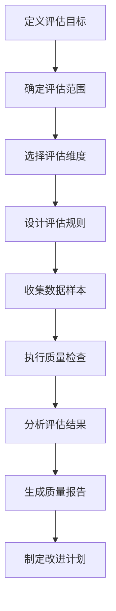
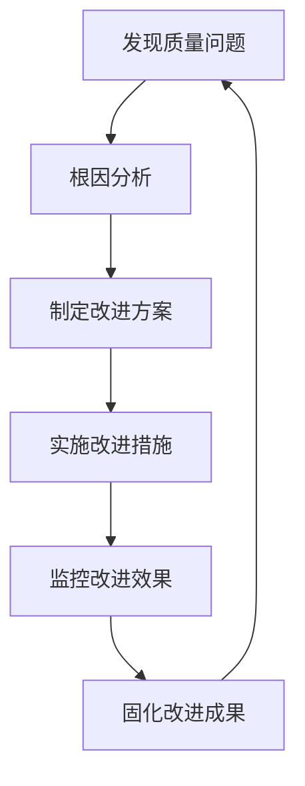
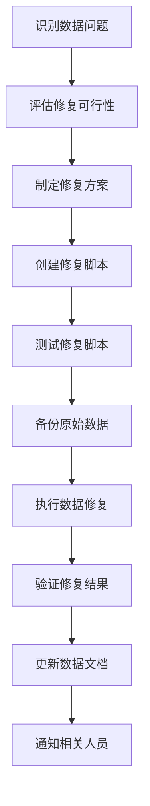
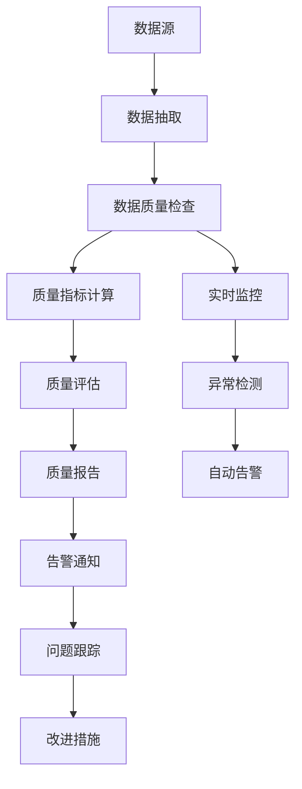

# 第3章：数据质量管理与治理

## 章节概述

本章将深入探讨数据质量管理与治理的核心概念、方法和实践。数据质量是数据治理的基石，高质量的数据是企业数字化转型成功的关键。我们将从零开始，系统学习如何评估、改进和监控数据质量，并掌握实际应用中的各种工具和技术。

## 学习目标

完成本章学习后，您将能够：

1. 理解数据质量的六大维度及其重要性
2. 掌握数据质量评估的方法和工具
3. 学会设计和实施数据质量改进计划
4. 掌握数据质量监控和报告的实践方法
5. 理解数据质量与业务价值之间的关系
6. 能够构建组织级的数据质量管理框架

---

## 3.1 数据质量基础概念

### 3.1.1 什么是数据质量？

数据质量是指数据对其预期用途的适合程度。高质量的数据能够准确、完整、及时地支持业务决策和运营活动，而低质量的数据则可能导致错误的决策、运营效率低下甚至业务风险。

> **思考题**：为什么说数据质量是相对的，而不是绝对的？请举例说明。

#### 数据质量的相对性

数据质量的评估标准因业务场景和数据用途的不同而有所差异。例如：

- **营销分析**：可能需要高度准确的客户 demographic 数据
- **财务报告**：对数据的精确性和一致性要求极高
- **趋势分析**：可能允许一定程度的数据噪音，但需要足够大的数据量

### 3.1.2 数据质量的六大维度

数据质量通常从以下六个维度进行评估：

#### 1. 准确性（Accuracy）
准确性是指数据值与其所代表的现实世界实体或事件的真实值的符合程度。

**实例**：
- 客户地址"北京市朝阳区建国路88号"是否真实存在
- 产品价格￥199.99是否与实际售价一致
- 员工年龄"32岁"是否与身份证信息一致

#### 2. 完整性（Completeness）
完整性是指数据记录中所有必要字段都有值，没有缺失。

**实例**：
- 客户记录中必填字段（姓名、联系方式）是否都有值
- 订单记录中金额、日期、商品信息是否完整
- 产品信息中规格、描述、图片是否存在缺失

#### 3. 一致性（Consistency）
一致性是指数据在不同系统、不同时间或不同记录之间保持一致。

**实例**：
- 同一客户在CRM系统和订单系统中的联系方式是否一致
- 同一产品在不同渠道的价格信息是否一致
- 跨时间维度的统计口径是否保持一致

#### 4. 时效性（Timeliness）
时效性是指数据在需要时是否可用的及时程度。

**实例**：
- 库存数据是否实时更新，能否反映当前库存状态
- 客户信息变更后是否及时同步到所有相关系统
- 财务报表数据是否在规定时间内完成归集

#### 5. 唯一性（Uniqueness）
唯一性是指数据记录没有重复，每个实体有唯一的标识。

**实例**：
- 客户ID是否唯一，是否存在同一客户的多个记录
- 产品编码是否唯一，是否存在一物多码
- 订单号是否唯一，是否存在重复订单

#### 6. 有效性（Validity）
有效性是指数据符合预定义的格式、范围和规则。

**实例**：
- 邮箱地址是否符合标准格式（如：name@example.com）
- 年龄是否在合理范围内（如：0-120岁）
- 电话号码是否为有效的手机号码格式

### 3.1.3 数据质量问题的类型与影响

#### 常见数据质量问题类型

1. **数据输入错误**
   - 拼写错误：如"Beijing"写成"Beiing"
   - 格式错误：如日期格式不统一
   - 重复录入：同一数据被多次录入

2. **数据集成问题**
   - 系统间数据不一致
   - 数据映射错误
   - 主数据不统一

3. **数据转换问题**
   - 数据清洗不彻底
   - 数据类型转换错误
   - 业务规则应用不当

4. **数据时效问题**
   - 数据更新不及时
   - 历史数据与实时数据混合
   - 批处理延迟

#### 数据质量问题的业务影响

| 业务领域 | 具体影响 | 经济损失估算 |
|----------|----------|--------------|
| **客户管理** | 客户画像不准确、营销效率低下 | 错失20-30%营销机会 |
| **供应链** | 库存不准确、补货不及时 | 缺货损失5-15%销售额 |
| **财务报告** | 报表错误、决策失误 | 平均损失营收的2-5% |
| **合规风险** | 监管处罚、声誉损失 | 单次罚款可达营收的1-10% |

---

## 3.2 数据质量评估方法

### 3.2.1 数据质量评估框架

数据质量评估应遵循系统化的方法，确保评估结果的全面性和可靠性。

#### 数据质量评估流程



#### 数据质量评估矩阵

| 数据集 | 准确性 | 完整性 | 一致性 | 时效性 | 唯一性 | 有效性 | 综合得分 |
|--------|--------|--------|--------|--------|--------|--------|----------|
| 客户主数据 | 85% | 92% | 78% | 88% | 90% | 95% | 87.2% |
| 产品数据 | 90% | 88% | 85% | 92% | 95% | 90% | 90.0% |
| 订单数据 | 95% | 98% | 92% | 96% | 99% | 97% | 96.2% |
| 库存数据 | 88% | 85% | 90% | 94% | 92% | 93% | 90.3% |

### 3.2.2 数据质量规则设计

#### 规则设计原则

1. **业务驱动**：规则设计应基于业务需求和风险点
2. **可操作性**：规则应明确、可验证、可执行
3. **可扩展性**：规则体系应易于扩展和维护
4. **自动化**：尽可能实现规则的自动检查

#### 常用数据质量规则类型

1. **格式规则**
   ```sql
   -- 邮箱格式验证
   SELECT * FROM customers 
   WHERE email NOT LIKE '%_@__%.__%';
   
   -- 电话号码格式验证（中国大陆）
   SELECT * FROM customers 
   WHERE phone NOT REGEXP '^1[3-9][0-9]{9}$';
   ```

2. **范围规则**
   ```sql
   -- 年龄范围验证（0-120岁）
   SELECT * FROM employees 
   WHERE age < 0 OR age > 120;
   
   -- 价格范围验证（非负数）
   SELECT * FROM products 
   WHERE price < 0;
   ```

3. **完整性规则**
   ```sql
   -- 必填字段检查
   SELECT * FROM orders 
   WHERE customer_id IS NULL 
      OR order_date IS NULL 
      OR total_amount IS NULL;
   ```

4. **唯一性规则**
   ```sql
   -- 检查重复邮箱
   SELECT email, COUNT(*) as count
   FROM customers
   GROUP BY email
   HAVING COUNT(*) > 1;
   ```

5. **一致性规则**
   ```sql
   -- 跨系统一致性检查
   SELECT c.customer_id, c.name, o.customer_id, o.order_count
   FROM customers c
   LEFT JOIN (
       SELECT customer_id, COUNT(*) as order_count
       FROM orders
       GROUP BY customer_id
   ) o ON c.customer_id = o.customer_id
   WHERE o.customer_id IS NULL;
   ```

### 3.2.3 数据质量指标计算

#### 单一维度指标计算

**准确性指标**：
```
准确性 = (1 - 错误记录数 / 总记录数) × 100%
```

**完整性指标**：
```
完整性 = (已填写字段数 / 总字段数) × 100%
```

**唯一性指标**：
```
唯一性 = (1 - 重复记录数 / 总记录数) × 100%
```

#### 综合质量指标

加权综合评分：
```
综合质量得分 = Σ(维度权重 × 维度得分)
```

示例权重分配：
- 准确性：30%
- 完整性：25%
- 一致性：20%
- 时效性：15%
- 唯一性：5%
- 有效性：5%

---

## 3.3 数据质量改进策略

### 3.3.1 数据质量改进框架

#### 数据质量改进循环



### 3.3.2 预防性改进措施

预防性改进措施是从源头控制数据质量，避免问题数据产生。

#### 1. 数据输入控制

**前端验证**：
```javascript
// 邮箱格式前端验证
function validateEmail(email) {
    const emailRegex = /^[^\s@]+@[^\s@]+\.[^\s@]+$/;
    return emailRegex.test(email);
}

// 手机号格式前端验证
function validatePhone(phone) {
    const phoneRegex = /^1[3-9]\d{9}$/;
    return phoneRegex.test(phone);
}

// 提交表单验证
function validateForm(formData) {
    const errors = [];
    
    if (!validateEmail(formData.email)) {
        errors.push("邮箱格式不正确");
    }
    
    if (!validatePhone(formData.phone)) {
        errors.push("手机号格式不正确");
    }
    
    if (formData.age < 0 || formData.age > 120) {
        errors.push("年龄必须在0-120之间");
    }
    
    return errors;
}
```

**后端验证**：
```python
from pydantic import BaseModel, EmailStr, validator
from typing import Optional
from datetime import datetime

class CustomerModel(BaseModel):
    name: str
    email: EmailStr
    phone: str
    age: int
    address: Optional[str] = None
    
    @validator('phone')
    def validate_phone(cls, v):
        if not re.match(r'^1[3-9]\d{9}$', v):
            raise ValueError('手机号格式不正确')
        return v
    
    @validator('age')
    def validate_age(cls, v):
        if v < 0 or v > 120:
            raise ValueError('年龄必须在0-120之间')
        return v
```

#### 2. 数据标准化

**数据标准化流程**：
1. **格式标准化**：统一日期格式、编码格式等
2. **内容标准化**：统一术语、缩写、度量单位等
3. **结构标准化**：统一表结构、字段定义、关系等

```sql
-- 创建数据标准化函数
CREATE OR REPLACE FUNCTION standardize_email(email TEXT) 
RETURNS TEXT AS $$
BEGIN
    -- 转换为小写
    email := LOWER(email);
    
    -- 去除前后空格
    email := TRIM(email);
    
    -- 标准化域名（如将gmail.cn转换为gmail.com）
    IF email LIKE '%@gmail.cn' THEN
        email := REPLACE(email, '@gmail.cn', '@gmail.com');
    END IF;
    
    RETURN email;
END;
$$ LANGUAGE plpgsql;

-- 应用标准化
UPDATE customers 
SET email = standardize_email(email)
WHERE email IS NOT NULL;
```

#### 3. 数据字典与元数据管理

建立完整的数据字典，明确定义每个数据元素的：

- **业务含义**：数据代表的业务概念
- **数据类型**：数据的存储类型和格式
- **取值范围**：有效值的范围和枚举值
- **业务规则**：数据应满足的业务约束
- **质量标准**：数据质量的期望水平

### 3.3.3 修正性改进措施

修正性改进措施是对已存在的数据质量问题进行修复。

#### 1. 数据清洗

**重复数据处理**：
```python
import pandas as pd
from fuzzywuzzy import fuzz

def find_duplicate_customers(customers_df, threshold=80):
    """查找可能的重复客户"""
    duplicates = []
    
    for i, row1 in customers_df.iterrows():
        for j, row2 in customers_df.iterrows():
            if i >= j:  # 避免重复比较和自比较
                continue
                
            # 计算相似度
            name_similarity = fuzz.ratio(row1['name'], row2['name'])
            email_similarity = fuzz.ratio(row1['email'], row2['email'])
            phone_similarity = fuzz.ratio(row1['phone'], row2['phone'])
            
            # 综合相似度
            overall_similarity = max(name_similarity, email_similarity, phone_similarity)
            
            if overall_similarity >= threshold:
                duplicates.append({
                    'customer_id_1': row1['customer_id'],
                    'customer_id_2': row2['customer_id'],
                    'similarity': overall_similarity,
                    'match_type': 'name' if name_similarity == overall_similarity else 
                                'email' if email_similarity == overall_similarity else 'phone'
                })
    
    return pd.DataFrame(duplicates)

# 使用示例
duplicates = find_duplicate_customers(customers_df)
print(f"发现 {len(duplicates)} 组可能的重复客户")
```

**缺失数据处理**：
```python
def handle_missing_values(data, strategy='mean'):
    """
    处理缺失值
    
    Args:
        data: DataFrame - 包含缺失值的数据
        strategy: str - 处理策略 ('mean', 'median', 'mode', 'drop', 'forward_fill')
    
    Returns:
        DataFrame - 处理后的数据
    """
    result = data.copy()
    
    for column in data.columns:
        if data[column].isnull().sum() > 0:
            if strategy == 'mean' and data[column].dtype in ['int64', 'float64']:
                result[column].fillna(data[column].mean(), inplace=True)
            elif strategy == 'median' and data[column].dtype in ['int64', 'float64']:
                result[column].fillna(data[column].median(), inplace=True)
            elif strategy == 'mode':
                result[column].fillna(data[column].mode()[0], inplace=True)
            elif strategy == 'drop':
                result.dropna(subset=[column], inplace=True)
            elif strategy == 'forward_fill':
                result[column].fillna(method='ffill', inplace=True)
    
    return result

# 使用示例
customers_clean = handle_missing_values(customers_df, strategy='mode')
```

#### 2. 数据修复工作流

建立标准化的数据修复工作流，确保修复过程的一致性和可追溯性。



---

## 3.4 数据质量监控与报告

### 3.4.1 数据质量监控体系

#### 监控架构



#### 监控指标设计

1. **核心质量指标**
   - 数据完整率
   - 数据准确率
   - 数据一致性得分
   - 数据时效性指标
   - 重复率

2. **过程质量指标**
   - 数据错误率
   - 修复成功率
   - 监控覆盖率
   - 问题响应时间

3. **业务影响指标**
   - 业务流程中断次数
   - 决策错误率
   - 客户投诉率
   - 经济损失金额

### 3.4.2 实时数据质量监控

#### 实时监控架构

```python
import asyncio
import time
from datetime import datetime
import pandas as pd
from typing import Dict, List
import smtplib
from email.mime.text import MIMEText

class DataQualityMonitor:
    """实时数据质量监控器"""
    
    def __init__(self, config):
        self.config = config
        self.thresholds = config['thresholds']
        self.alert_recipients = config['alert_recipients']
        self.quality_history = []
        
    async def monitor_data_quality(self, connection_params, check_interval=300):
        """持续监控数据质量"""
        while True:
            try:
                # 获取质量指标
                quality_metrics = await self._collect_quality_metrics(connection_params)
                
                # 评估质量状况
                quality_status = self._evaluate_quality(quality_metrics)
                
                # 记录质量历史
                self._record_quality_history(quality_metrics, quality_status)
                
                # 检查告警条件
                if self._should_alert(quality_status):
                    await self._send_alert(quality_status)
                
                # 生成实时报告
                self._generate_realtime_report(quality_metrics, quality_status)
                
            except Exception as e:
                print(f"监控过程中发生错误: {str(e)}")
            
            # 等待下一次检查
            await asyncio.sleep(check_interval)
    
    async def _collect_quality_metrics(self, connection_params):
        """收集数据质量指标"""
        # 这里实现具体的质量指标收集逻辑
        # 返回包含各维度质量指标的字典
        pass
    
    def _evaluate_quality(self, metrics):
        """评估数据质量状况"""
        status = {
            'overall_score': 0,
            'dimension_scores': {},
            'issues': [],
            'timestamp': datetime.now()
        }
        
        # 计算各维度得分
        for dimension, score in metrics.items():
            status['dimension_scores'][dimension] = score
            
            # 检查是否低于阈值
            if dimension in self.thresholds and score < self.thresholds[dimension]:
                status['issues'].append({
                    'dimension': dimension,
                    'score': score,
                    'threshold': self.thresholds[dimension],
                    'severity': 'high' if score < self.thresholds[dimension] * 0.8 else 'medium'
                })
        
        # 计算综合得分
        status['overall_score'] = sum(status['dimension_scores'].values()) / len(status['dimension_scores'])
        
        return status
    
    def _should_alert(self, quality_status):
        """判断是否需要发送告警"""
        # 综合得分过低
        if quality_status['overall_score'] < self.thresholds.get('overall', 80):
            return True
        
        # 存在高级别问题
        for issue in quality_status['issues']:
            if issue['severity'] == 'high':
                return True
        
        return False
    
    async def _send_alert(self, quality_status):
        """发送告警通知"""
        subject = f"数据质量告警 - {quality_status['timestamp'].strftime('%Y-%m-%d %H:%M:%S')}"
        
        message = f"""
        数据质量监控告警：
        
        时间: {quality_status['timestamp']}
        综合得分: {quality_status['overall_score']:.2f}
        
        发现问题:
        {self._format_issues(quality_status['issues'])}
        
        请及时处理。
        """
        
        # 发送邮件告警
        await self._send_email(subject, message, self.alert_recipients)
    
    def _format_issues(self, issues):
        """格式化问题描述"""
        formatted = ""
        for issue in issues:
            formatted += f"- {issue['dimension']}: 得分 {issue['score']:.2f} (阈值: {issue['threshold']})\n"
        return formatted

# 监控配置示例
monitor_config = {
    'thresholds': {
        'completeness': 95,
        'accuracy': 90,
        'consistency': 85,
        'timeliness': 90,
        'uniqueness': 95,
        'validity': 98,
        'overall': 90
    },
    'alert_recipients': [
        'data.steward@company.com',
        'quality.team@company.com'
    ]
}

# 启动监控
monitor = DataQualityMonitor(monitor_config)
asyncio.run(monitor.monitor_data_quality(connection_params))
```

### 3.4.3 数据质量报告

#### 报告框架设计

数据质量报告应包含以下关键部分：

1. **执行摘要**
   - 关键质量指标概览
   - 质量趋势分析
   - 主要发现和建议

2. **详细分析**
   - 各维度质量评分
   - 质量问题分布
   - 根因分析

3. **改进计划**
   - 优先问题清单
   - 改进措施建议
   - 资源需求评估

#### 自动化报告生成

```python
class DataQualityReporter:
    """数据质量报告生成器"""
    
    def __init__(self, output_dir):
        self.output_dir = output_dir
    
    def generate_weekly_report(self, quality_data, trends_data):
        """生成周报"""
        report = {
            'period': self._get_week_period(),
            'summary': self._generate_summary(quality_data),
            'trends': self._analyze_trends(trends_data),
            'details': self._generate_detailed_analysis(quality_data),
            'recommendations': self._generate_recommendations(quality_data)
        }
        
        # 生成HTML报告
        html_report = self._render_html_report(report)
        
        # 保存报告
        report_path = f"{self.output_dir}/quality_report_{report['period']}.html"
        with open(report_path, 'w', encoding='utf-8') as f:
            f.write(html_report)
        
        # 发送邮件通知
        self._send_report_notification(report_path)
        
        return report_path
    
    def _generate_summary(self, quality_data):
        """生成执行摘要"""
        latest_metrics = quality_data[-1]  # 最新数据
        previous_metrics = quality_data[-2] if len(quality_data) > 1 else None
        
        summary = {
            'current_score': latest_metrics['overall_score'],
            'score_change': None,
            'key_issues': [],
            'improvements': []
        }
        
        # 计算得分变化
        if previous_metrics:
            summary['score_change'] = latest_metrics['overall_score'] - previous_metrics['overall_score']
        
        # 识别关键问题
        for dimension, score in latest_metrics['dimension_scores'].items():
            if score < 80:
                summary['key_issues'].append({
                    'dimension': dimension,
                    'score': score
                })
        
        # 识别改进领域
        if previous_metrics:
            for dimension, score in latest_metrics['dimension_scores'].items():
                prev_score = previous_metrics['dimension_scores'].get(dimension, score)
                if score > prev_score:
                    summary['improvements'].append({
                        'dimension': dimension,
                        'improvement': score - prev_score
                    })
        
        return summary
    
    def _analyze_trends(self, trends_data):
        """分析质量趋势"""
        trends = {}
        
        for dimension in trends_data.columns:
            if dimension != 'date':
                # 计算趋势方向
                recent_data = trends_data[dimension].tail(4)  # 最近4个周期
                trend = 'stable'
                
                if recent_data.is_monotonic_increasing:
                    trend = 'improving'
                elif recent_data.is_monotonic_decreasing:
                    trend = 'declining'
                
                # 计算变化率
                if len(recent_data) >= 2:
                    change_rate = (recent_data.iloc[-1] - recent_data.iloc[0]) / recent_data.iloc[0] * 100
                else:
                    change_rate = 0
                
                trends[dimension] = {
                    'direction': trend,
                    'change_rate': change_rate,
                    'latest_value': recent_data.iloc[-1],
                    'target': 95  # 目标值
                }
        
        return trends
    
    def _generate_detailed_analysis(self, quality_data):
        """生成详细分析"""
        analysis = {
            'dimension_breakdown': {},
            'quality_distribution': self._calculate_quality_distribution(quality_data),
            'issue_patterns': self._identify_issue_patterns(quality_data)
        }
        
        # 计算各维度详细统计
        all_dimensions = set()
        for data in quality_data:
            all_dimensions.update(data['dimension_scores'].keys())
        
        for dimension in all_dimensions:
            scores = [data['dimension_scores'].get(dimension, 0) for data in quality_data]
            analysis['dimension_breakdown'][dimension] = {
                'current': scores[-1] if scores else 0,
                'average': sum(scores) / len(scores) if scores else 0,
                'min': min(scores) if scores else 0,
                'max': max(scores) if scores else 0,
                'trend': self._calculate_trend(scores)
            }
        
        return analysis
    
    def _render_html_report(self, report):
        """渲染HTML报告"""
        template = """
        <!DOCTYPE html>
        <html>
        <head>
            <title>数据质量周报 - {period}</title>
            <meta charset="utf-8">
            <style>
                body {{ font-family: Arial, sans-serif; margin: 20px; }}
                .header {{ background-color: #f5f5f5; padding: 20px; border-radius: 5px; }}
                .section {{ margin: 20px 0; }}
                .metric {{ display: inline-block; margin: 10px; padding: 10px; border: 1px solid #ddd; border-radius: 5px; }}
                .score {{ font-size: 24px; font-weight: bold; }}
                .good {{ color: green; }}
                .warning {{ color: orange; }}
                .bad {{ color: red; }}
                table {{ border-collapse: collapse; width: 100%; }}
                th, td {{ border: 1px solid #ddd; padding: 8px; text-align: left; }}
                th {{ background-color: #f2f2f2; }}
            </style>
            <script src="https://cdn.jsdelivr.net/npm/chart.js"></script>
        </head>
        <body>
            <div class="header">
                <h1>数据质量周报</h1>
                <p>报告周期: {period}</p>
                <p>生成时间: {generation_time}</p>
            </div>
            
            <div class="section">
                <h2>执行摘要</h2>
                <div class="metric">
                    <div>当前综合得分</div>
                    <div class="score {score_class}">{current_score:.1f}</div>
                    {score_change}
                </div>
                
                <h3>关键问题</h3>
                {key_issues}
                
                <h3>改进领域</h3>
                {improvements}
            </div>
            
            <div class="section">
                <h2>质量趋势</h2>
                <div style="height: 300px;">
                    <canvas id="trendsChart"></canvas>
                </div>
            </div>
            
            <div class="section">
                <h2>维度详细分析</h2>
                {dimension_details}
            </div>
            
            <div class="section">
                <h2>改进建议</h2>
                {recommendations}
            </div>
            
            <script>
                // 质量趋势图表
                const ctx = document.getElementById('trendsChart').getContext('2d');
                new Chart(ctx, {{
                    type: 'line',
                    data: {{
                        labels: {labels},
                        datasets: {datasets}
                    }},
                    options: {{
                        responsive: true,
                        maintainAspectRatio: false,
                        scales: {{
                            y: {{
                                beginAtZero: false,
                                min: 70,
                                max: 100
                            }}
                        }}
                    }}
                }});
            </script>
        </body>
        </html>
        """
        
        # 准备模板变量
        score_class = "good" if report['summary']['current_score'] >= 90 else "warning" if report['summary']['current_score'] >= 80 else "bad"
        score_change = ""
        if report['summary']['score_change'] is not None:
            change = report['summary']['score_change']
            if change > 0:
                score_change = f'<div class="good">↑ +{change:.1f}</div>'
            elif change < 0:
                score_change = f'<div class="bad">↓ {change:.1f}</div>'
            else:
                score_change = '<div>→ 0.0</div>'
        
        key_issues = ""
        for issue in report['summary']['key_issues']:
            key_issues += f'<div class="metric bad"><div>{issue["dimension"]}</div><div>{issue["score"]:.1f}</div></div>'
        
        improvements = ""
        for improvement in report['summary']['improvements']:
            improvements += f'<div class="metric good"><div>{improvement["dimension"]}</div><div>+{improvement["improvement"]:.1f}</div></div>'
        
        # 维度详细表格
        dimension_details = "<table><tr><th>维度</th><th>当前得分</th><th>平均得分</th><th>最高得分</th><th>最低得分</th><th>趋势</th></tr>"
        for dimension, stats in report['details']['dimension_breakdown'].items():
            trend_icon = "→" if stats['trend'] == 'stable' else "↑" if stats['trend'] == 'improving' else "↓"
            dimension_details += f"<tr><td>{dimension}</td><td>{stats['current']:.1f}</td><td>{stats['average']:.1f}</td><td>{stats['max']:.1f}</td><td>{stats['min']:.1f}</td><td>{trend_icon}</td></tr>"
        dimension_details += "</table>"
        
        # 改进建议
        recommendations = "<ol>"
        for recommendation in report['recommendations']:
            recommendations += f"<li>{recommendation}</li>"
        recommendations += "</ol>"
        
        # 返回渲染后的HTML
        return template.format(
            period=report['period'],
            generation_time=datetime.now().strftime('%Y-%m-%d %H:%M:%S'),
            current_score=report['summary']['current_score'],
            score_class=score_class,
            score_change=score_change,
            key_issues=key_issues,
            improvements=improvements,
            dimension_details=dimension_details,
            recommendations=recommendations,
            labels='["Mon", "Tue", "Wed", "Thu", "Fri"]',
            datasets='[]'
        )
```

---

## 3.5 数据质量工具与平台

### 3.5.1 开源数据质量工具

#### 1. Great Expectations

Great Expectations是一个开源的数据质量验证工具，支持多种数据源。

```python
import great_expectations as ge
import pandas as pd

# 创建数据上下文
context = ge.data_context.DataContext()

# 加载数据
df = pd.read_csv('customers.csv')

# 创建数据集
ge_df = ge.dataset.PandasDataset(df)

# 定义期望
expectation_suite = ge.core.ExpectationSuite(
    expectation_suite_name="customer_quality_suite"
)

# 添加期望规则
expectation_suite.add_expectation(
    ge.core.ExpectationConfiguration(
        expectation_type="expect_table_row_count_to_be_between",
        kwargs={"min_value": 1000, "max_value": 100000}
    )
)

expectation_suite.add_expectation(
    ge.core.ExpectationConfiguration(
        expectation_type="expect_column_values_to_not_be_null",
        kwargs={"column": "customer_id"}
    )
)

expectation_suite.add_expectation(
    ge.core.ExpectationConfiguration(
        expectation_type="expect_column_values_to_match_regex",
        kwargs={"column": "email", "regex": "^[^@]+@[^@]+\\.[^@]+$"}
    )
)

# 运行验证
validation_result = ge_df.validate(expectation_suite)

# 生成报告
context.save_expectation_suite(expectation_suite, "customer_quality_suite.json")
```

#### 2. Deequ

Deequ是Amazon开源的数据质量库，基于Apache Spark。

```python
from pydeequ.checks import *
from pydeequ.verification import *
from pyspark.sql import SparkSession

# 创建Spark会话
spark = SparkSession.builder.getOrCreate()

# 加载数据
df = spark.read.csv("customers.csv", header=True, inferSchema=True)

# 定义检查规则
check = Check(spark, CheckLevel.Error, "Customer data quality check") \
    .isComplete("customer_id") \
    .isUnique("customer_id") \
    .hasDataType("customer_id", StringType()) \
    .isComplete("email") \
    .matchesPattern("email", "^([a-zA-Z0-9_\\-\\.]+)@([a-zA-Z0-9_\\-\\.]+)\\.([a-zA-Z]{2,5})$") \
    .hasDataType("age", IntegerType()) \
    .isNonNegative("age") \
    .hasMin("age", lambda x: x == 0) \
    .hasMax("age", lambda x: x == 120)

# 运行检查
verification_result = VerificationSuite(spark) \
    .onData(df) \
    .addCheck(check) \
    .run()

# 打印结果
verification_result.checkResults.foreach(lambda check_result: print(check_result))
```

### 3.5.2 商业数据质量平台

#### 1. Informatica Data Quality

Informatica Data Quality是企业级数据质量解决方案，提供：
- 数据探查和分析
- 数据清洗和标准化
- 数据质量监控和报告
- 数据治理集成

#### 2. Talend Data Quality

Talend提供开源和商业版本的数据质量工具：
- 数据探查
- 数据清洗和标准化
- 数据质量规则引擎
- 数据质量监控

#### 3. Ataccama

Ataccama是AI驱动的数据质量平台：
- 自动数据质量评估
- 智能数据清洗
- 数据质量监控
- 主数据管理

### 3.5.3 构建自定义数据质量平台

```python
from flask import Flask, request, jsonify, render_template
from sqlalchemy import create_engine
import pandas as pd
import json
from datetime import datetime

app = Flask(__name__)

class DataQualityPlatform:
    """自定义数据质量平台"""
    
    def __init__(self, db_connection_string):
        self.engine = create_engine(db_connection_string)
        self.quality_rules = {}
        self.quality_results = {}
    
    def register_rule(self, rule_id, rule_definition):
        """注册质量规则"""
        self.quality_rules[rule_id] = rule_definition
    
    def evaluate_data_quality(self, dataset_name, data_source):
        """评估数据质量"""
        # 加载数据
        df = pd.read_sql_table(dataset_name, self.engine)
        
        # 初始化结果
        results = {
            'dataset': dataset_name,
            'evaluation_time': datetime.now().isoformat(),
            'total_records': len(df),
            'dimensions': {},
            'overall_score': 0
        }
        
        # 应用质量规则
        for dimension, rules in self.quality_rules.items():
            dimension_score = 0
            dimension_results = []
            
            for rule in rules:
                rule_result = self._apply_rule(df, rule)
                dimension_results.append(rule_result)
            
            # 计算维度得分
            if dimension_results:
                dimension_score = sum(r['score'] for r in dimension_results) / len(dimension_results)
            
            results['dimensions'][dimension] = {
                'score': dimension_score,
                'rules': dimension_results
            }
        
        # 计算综合得分
        if results['dimensions']:
            results['overall_score'] = sum(
                d['score'] for d in results['dimensions'].values()
            ) / len(results['dimensions'])
        
        # 保存结果
        self.quality_results[dataset_name] = results
        
        return results
    
    def _apply_rule(self, df, rule):
        """应用单个质量规则"""
        rule_type = rule['type']
        column = rule.get('column')
        
        if rule_type == 'completeness':
            # 完整性检查
            missing_count = df[column].isnull().sum()
            score = (1 - missing_count / len(df)) * 100
            
            return {
                'rule_id': rule.get('id', f'{rule_type}_{column}'),
                'rule_type': rule_type,
                'column': column,
                'score': score,
                'issues': missing_count,
                'description': f"完整性检查 - {missing_count}条记录缺失"
            }
        
        elif rule_type == 'uniqueness':
            # 唯一性检查
            duplicate_count = df[column].duplicated().sum()
            score = (1 - duplicate_count / len(df)) * 100
            
            return {
                'rule_id': rule.get('id', f'{rule_type}_{column}'),
                'rule_type': rule_type,
                'column': column,
                'score': score,
                'issues': duplicate_count,
                'description': f"唯一性检查 - {duplicate_count}条记录重复"
            }
        
        elif rule_type == 'validity':
            # 有效性检查
            pattern = rule.get('pattern')
            if pattern:
                valid_count = df[column].str.match(pattern).sum()
                score = (valid_count / len(df)) * 100
                
                return {
                    'rule_id': rule.get('id', f'{rule_type}_{column}'),
                    'rule_type': rule_type,
                    'column': column,
                    'score': score,
                    'issues': len(df) - valid_count,
                    'description': f"有效性检查 - {len(df) - valid_count}条记录格式无效"
                }
        
        elif rule_type == 'range':
            # 范围检查
            min_value = rule.get('min')
            max_value = rule.get('max')
            
            if min_value is not None and max_value is not None:
                valid_count = ((df[column] >= min_value) & (df[column] <= max_value)).sum()
                score = (valid_count / len(df)) * 100
                
                return {
                    'rule_id': rule.get('id', f'{rule_type}_{column}'),
                    'rule_type': rule_type,
                    'column': column,
                    'score': score,
                    'issues': len(df) - valid_count,
                    'description': f"范围检查 - {len(df) - valid_count}条记录超出范围[{min_value}, {max_value}]"
                }
        
        return {
            'rule_id': rule.get('id', f'{rule_type}_{column}'),
            'rule_type': rule_type,
            'column': column,
            'score': 0,
            'issues': 0,
            'description': f"规则执行失败"
        }

# 创建平台实例
platform = DataQualityPlatform('sqlite:///data_quality.db')

# 注册质量规则
platform.register_rule('completeness', [
    {'id': 'customer_id_completeness', 'type': 'completeness', 'column': 'customer_id'},
    {'id': 'name_completeness', 'type': 'completeness', 'column': 'name'},
    {'id': 'email_completeness', 'type': 'completeness', 'column': 'email'}
])

platform.register_rule('uniqueness', [
    {'id': 'customer_id_uniqueness', 'type': 'uniqueness', 'column': 'customer_id'},
    {'id': 'email_uniqueness', 'type': 'uniqueness', 'column': 'email'}
])

platform.register_rule('validity', [
    {'id': 'email_validity', 'type': 'validity', 'column': 'email', 
     'pattern': '^([a-zA-Z0-9_\\-\\.]+)@([a-zA-Z0-9_\\-\\.]+)\\.([a-zA-Z]{2,5})$'},
    {'id': 'phone_validity', 'type': 'validity', 'column': 'phone', 
     'pattern': '^1[3-9][0-9]{9}$'}
])

platform.register_rule('range', [
    {'id': 'age_range', 'type': 'range', 'column': 'age', 'min': 0, 'max': 120}
])

# API端点
@app.route('/')
def index():
    """首页"""
    return render_template('index.html')

@app.route('/evaluate/<dataset_name>', methods=['POST'])
def evaluate_dataset(dataset_name):
    """评估数据集质量"""
    try:
        results = platform.evaluate_data_quality(dataset_name, request.json.get('data_source'))
        return jsonify(results)
    except Exception as e:
        return jsonify({'error': str(e)}), 500

@app.route('/results/<dataset_name>')
def get_results(dataset_name):
    """获取数据集质量评估结果"""
    if dataset_name in platform.quality_results:
        return jsonify(platform.quality_results[dataset_name])
    else:
        return jsonify({'error': 'Dataset not found'}), 404

@app.route('/rules')
def get_rules():
    """获取已注册的质量规则"""
    return jsonify(platform.quality_rules)

@app.route('/datasets')
def get_datasets():
    """获取所有数据集列表"""
    # 这里应该返回实际的数据集列表
    return jsonify(['customers', 'products', 'orders'])

if __name__ == '__main__':
    app.run(debug=True, port=5000)
```

---

## 3.6 实践案例

### 3.6.1 电商平台数据质量改进

#### 背景介绍

某大型电商平台发现用户数据质量下降，导致：
- 营销邮件打开率下降30%
- 客服工单增加25%
- 个性化推荐准确率降低15%

#### 数据质量评估

1. **问题识别**
   ```sql
   -- 检查客户邮箱格式
   SELECT COUNT(*) as total_customers,
          SUM(CASE WHEN email NOT LIKE '%_@__%.__%' THEN 1 ELSE 0 END) as invalid_emails,
          SUM(CASE WHEN email IS NULL THEN 1 ELSE 0 END) as missing_emails
   FROM customers;
   
   -- 检查重复客户
   SELECT email, COUNT(*) as duplicate_count
   FROM customers
   GROUP BY email
   HAVING COUNT(*) > 1;
   
   -- 检查地址完整性
   SELECT COUNT(*) as total_customers,
          SUM(CASE WHEN address IS NULL OR address = '' THEN 1 ELSE 0 END) as missing_addresses,
          SUM(CASE WHEN city IS NULL OR city = '' THEN 1 ELSE 0 END) as missing_cities
   FROM customers;
   ```

2. **评估结果**
   - 邮箱格式错误率：12%
   - 重复客户记录：8%
   - 地址信息缺失：23%
   - 手机号格式错误：15%

#### 改进措施

1. **数据清洗**
   ```python
   import pandas as pd
   import re
   from fuzzywuzzy import fuzz
   
   def clean_email(email):
       """清洗邮箱格式"""
       if pd.isna(email) or email == '':
           return None
       
       # 去除空格
       email = str(email).strip()
       
       # 标准化常见拼写错误
       email = re.sub(r'@gmail\.cn', '@gmail.com', email)
       email = re.sub(r'@qq\.cn', '@qq.com', email)
       
       # 验证格式
       if re.match(r'^[a-zA-Z0-9._%+-]+@[a-zA-Z0-9.-]+\.[a-zA-Z]{2,}$', email):
           return email
       else:
           return None
   
   def find_duplicate_customers(df, threshold=80):
       """查找重复客户"""
       duplicates = []
       
       for i, row1 in df.iterrows():
           for j, row2 in df.iterrows():
               if i >= j:
                   continue
               
               # 计算相似度
               name_similarity = fuzz.ratio(row1['name'], row2['name'])
               email_similarity = fuzz.ratio(row1['email'], row2['email'])
               phone_similarity = fuzz.ratio(row1['phone'], row2['phone'])
               
               # 综合判断
               max_similarity = max(name_similarity, email_similarity, phone_similarity)
               
               if max_similarity >= threshold:
                   duplicates.append({
                       'customer_id_1': row1['customer_id'],
                       'customer_id_2': row2['customer_id'],
                       'similarity': max_similarity
                   })
       
       return pd.DataFrame(duplicates)
   
   # 应用清洗
   customers_df['email'] = customers_df['email'].apply(clean_email)
   
   # 查找重复客户
   duplicates = find_duplicate_customers(customers_df)
   ```

2. **建立预防机制**
   - 在用户注册页面增加实时格式验证
   - 定期运行重复数据检测脚本
   - 建立数据质量监控仪表板

3. **结果评估**
   - 邮箱格式错误率降至2%
   - 重复客户记录减少至1%
   - 地址信息完整率提升至95%
   - 营销邮件打开率提升25%

### 3.6.2 金融机构数据质量监控

#### 背景介绍

某银行发现客户数据不一致导致：
- 客户KYC审核延迟
- 合规风险增加
- 客户投诉率上升

#### 数据质量监控实施

1. **监控指标设计**
   - 客户信息一致性得分
   - 跨系统数据同步延迟
   - 必填字段完整率
   - 敏感信息准确性

2. **监控系统架构**
   ```mermaid
   graph TD
       A[核心业务系统] --> B[数据抽取层]
       C[CRM系统] --> B
       D[风控系统] --> B
       B --> E[数据质量检查引擎]
       E --> F[质量指标计算]
       F --> G[质量评分模型]
       G --> H[实时监控仪表板]
       G --> I[告警系统]
       G --> J[质量报告生成]
   ```

3. **关键质量规则**
   ```sql
   -- 跨系统一致性检查
   SELECT a.customer_id, a.name as crm_name, b.name as core_name
   FROM crm_customers a
   JOIN core_customers b ON a.customer_id = b.customer_id
   WHERE a.name != b.name;
   
   -- 敏感信息准确性检查
   SELECT customer_id, id_number
   FROM customers
   WHERE id_number NOT LIKE '^[1-9][0-9]{5}(19|20)[0-9]{2}(0[1-9]|1[0-2])(0[1-9]|[12][0-9]|3[01])[0-9]{3}[0-9X]$';
   
   -- 数据同步延迟检查
   SELECT 'crm_sync_delay' as metric,
          EXTRACT(EPOCH FROM (NOW() - MAX(last_update))) as delay_seconds
   FROM crm_customers;
   ```

#### 实施效果

- 数据同步延迟从平均30分钟降低到5分钟
- 跨系统数据不一致率从15%降低到2%
- 客户KYC审核平均时间缩短40%
- 合规检查通过率提升20%

---

## 3.7 本章总结

### 3.7.1 关键要点回顾

1. **数据质量的六大维度**：准确性、完整性、一致性、时效性、唯一性、有效性
2. **数据质量管理框架**：评估 → 改进 → 监控 → 报告的循环过程
3. **质量评估方法**：基于规则的评估、统计分析、业务影响评估
4. **质量改进策略**：预防性措施、修正性措施、持续改进机制
5. **质量监控体系**：实时监控、定期评估、自动化报告
6. **工具与平台选择**：开源工具、商业平台、自建解决方案

### 3.7.2 实践建议

1. **从业务需求出发**：明确数据质量对业务的影响，优先解决关键问题
2. **建立质量文化**：培养全员数据质量意识，建立数据责任制
3. **循序渐进实施**：从关键数据集开始，逐步扩展到全企业范围
4. **自动化优先**：尽可能实现质量检查和改进的自动化
5. **持续监控改进**：建立持续改进机制，不断优化质量水平

### 3.7.3 进阶学习路径

1. **深入学习数据质量管理框架**：如DAMA-DMBOK、DCMM等
2. **掌握数据质量工具**：如Great Expectations、Informatica Data Quality等
3. **了解行业最佳实践**：研究同行业数据质量案例
4. **参与数据质量社区**：加入专业组织，交流经验
5. **实践项目经验**：在实际项目中应用所学知识

### 3.7.4 实践作业

1. **评估现有数据质量**
   - 选择一个关键数据集（如客户数据）
   - 设计评估规则
   - 计算各维度质量得分
   - 生成质量评估报告

2. **实施数据质量改进**
   - 识别主要质量问题
   - 设计改进方案
   - 实施改进措施
   - 评估改进效果

3. **构建质量监控系统**
   - 设计监控指标
   - 实现自动化检查
   - 创建监控仪表板
   - 建立告警机制

---

## 附录：代码示例

本章提供的代码示例涵盖了数据质量管理的各个方面，包括：

1. **数据质量评估工具**（见`code/chapter3/data_quality_assessment.py`）
2. **数据清洗工具**（见`code/chapter3/data_cleaning.py`）
3. **质量监控系统**（见`code/chapter3/quality_monitor.py`）
4. **报告生成工具**（见`code/chapter3/quality_reporter.py`）
5. **Web质量平台**（见`code/chapter3/quality_platform.py`）

请参考代码目录中的完整示例，根据实际需求进行调整和使用。