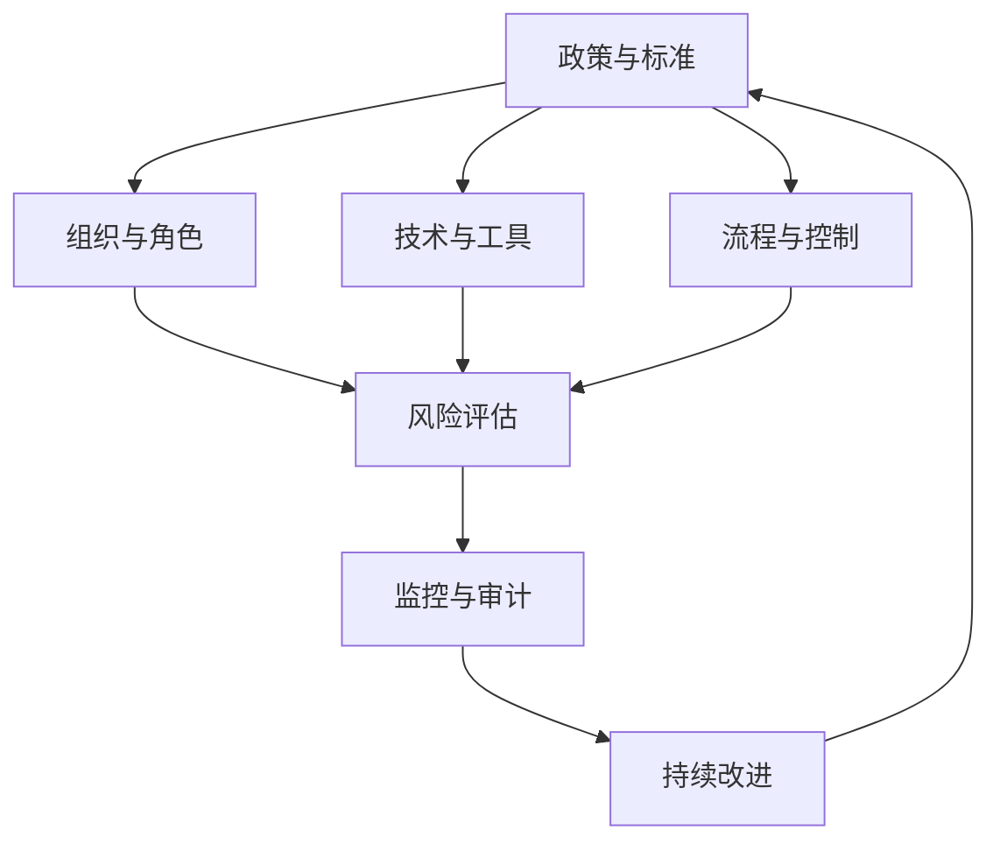
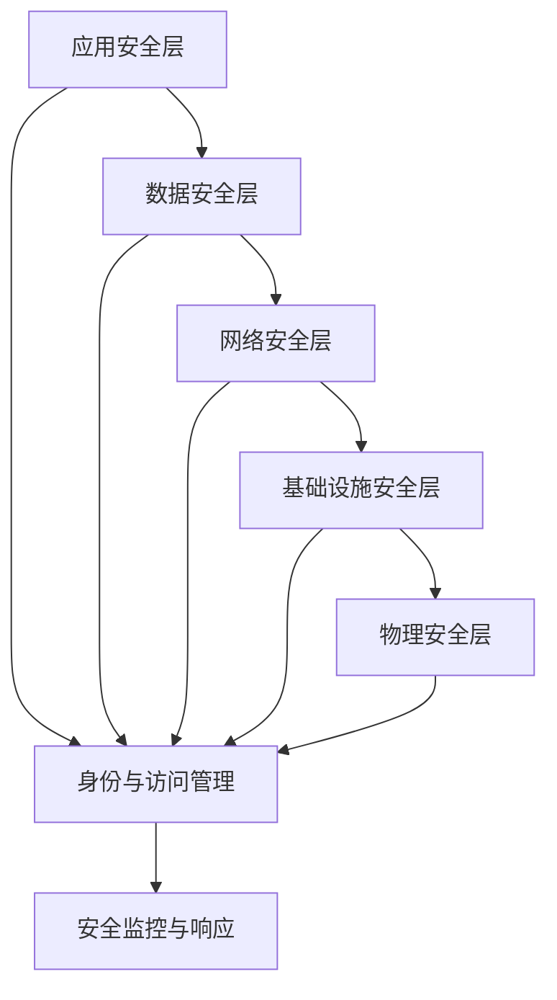
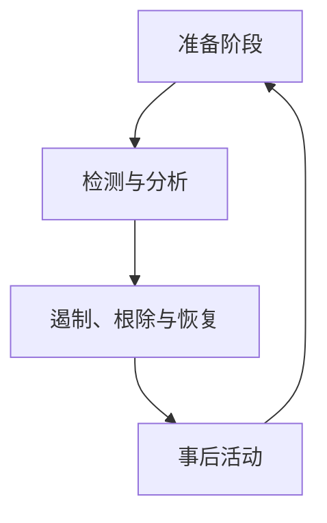

# 第4章：数据安全与隐私治理

## 章节概述

本章将深入探讨数据安全与隐私治理的核心概念、方法和实践。在数据驱动的时代，数据安全和隐私保护已成为企业和组织的核心关切。我们将从零开始，系统学习如何构建全面的数据安全和隐私保护体系，确保数据资产的安全性和合规性。

## 学习目标

完成本章学习后，您将能够：

1. 理解数据安全与隐私治理的核心概念和重要性
2. 掌握数据安全架构设计和风险评估方法
3. 学会实施隐私保护技术和隐私增强技术
4. 理解数据合规要求与法规框架
5. 掌握数据访问控制和身份认证机制
6. 能够设计和实施数据安全事件响应计划

---

## 4.1 数据安全与隐私治理基础

### 4.1.1 数据安全与隐私的定义

#### 数据安全的定义

数据安全是指保护数据免受未经授权的访问、使用、披露、修改、破坏或泄露。数据安全涵盖三个核心要素：

1. **机密性（Confidentiality）**：确保数据仅被授权人员访问
2. **完整性（Integrity）**：确保数据在传输和存储过程中不被篡改
3. **可用性（Availability）**：确保授权用户在需要时能够访问数据

> **思考题**：为什么说数据安全是一个持续的过程，而不是一次性的项目？

#### 隐私的定义与特点

隐私是指个人对其个人信息的控制权。隐私保护具有以下特点：

1. **个人权利导向**：强调个人对其信息的控制
2. **情境相关性**：隐私期望因情境而异
3. **动态演进性**：隐私概念随技术和文化发展而变化
4. **合规驱动性**：受法律法规和行业标准约束

### 4.1.2 数据安全与隐私治理的重要性

#### 法律合规要求

全球范围内数据保护法规日益严格：

| 地区/法规 | 关键要求 | 违规处罚 |
|-----------|----------|----------|
| **GDPR（欧盟）** | 数据最小化、目的限制、知情同意 | 最高2000万欧元或全球营收4% |
| **CCPA/CPRA（加州）** | 消费者权利、数据分类、选择退出 | 最高7500美元/违规 |
| **PIPL（中国）** | 知情同意、必要原则、安全保障 | 最高5000万元或上年度营业额5% |
| **PDPA（新加坡）** | 通知义务、使用限制、安全保障 | 最高100万新元 |

#### 业务风险与损失

数据安全事件可能导致：

- **财务损失**：罚款、赔偿、安全投入增加
- **声誉损害**：客户信任度下降、品牌形象受损
- **业务中断**：系统停机、运营受阻
- **竞争优势丧失**：核心数据泄露、知识产权损失

### 4.1.3 数据安全与隐私治理框架

#### 治理框架要素

一个完整的数据安全与隐私治理框架应包含：



#### 关键治理原则

1. **责任明确**：明确各角色和职责
2. **风险管理**：基于风险评估确定优先级
3. **合规导向**：满足法律法规要求
4. **技术实现**：通过技术手段落实控制措施
5. **持续改进**：定期评估和优化治理体系

---

## 4.2 数据安全架构与风险评估

### 4.2.1 数据安全架构设计

#### 分层安全架构



#### 数据分类与分级

数据分类是安全的基础，通常按以下维度进行：

1. **敏感性分类**
   - **公开数据**：可自由公开的信息
   - **内部数据**：仅限组织内部使用
   - **机密数据**：需要特殊授权访问
   - **高度机密数据**：最敏感的信息

2. **生命周期阶段分类**
   - **创建阶段**：新生成的数据
   - **使用阶段**：正在处理和分析的数据
   - **归档阶段**：不经常使用但需保留的数据
   - **销毁阶段**：需要安全删除的数据

3. **业务影响分类**
   - **关键数据**：影响核心业务运营
   - **重要数据**：影响业务效率
   - **一般数据**：日常业务数据
   - **非关键数据**：影响较小的数据

### 4.2.2 数据安全风险评估

#### 风险评估框架

```python
class DataSecurityRiskAssessment:
    """数据安全风险评估工具"""
    
    def __init__(self):
        self.risk_matrix = {
            'high_high': ['无法接受', '立即处理'],
            'high_medium': ['高风险', '尽快处理'],
            'high_low': ['中风险', '计划处理'],
            'medium_high': ['高风险', '尽快处理'],
            'medium_medium': ['中风险', '计划处理'],
            'medium_low': ['低风险', '定期检查'],
            'low_high': ['中风险', '计划处理'],
            'low_medium': ['低风险', '定期检查'],
            'low_low': ['可接受', '持续监控']
        }
    
    def assess_threat_likelihood(self, threat_factors):
        """评估威胁发生可能性"""
        # 威胁因素评分（1-5分）
        threat_score = 0
        weights = {
            'threat_source_capability': 0.3,  # 威胁源能力
            'motivation': 0.2,               # 动机强度
            'vulnerability_exposure': 0.3,   # 漏洞暴露程度
            'control_effectiveness': 0.2     # 控制措施有效性
        }
        
        for factor, score in threat_factors.items():
            threat_score += score * weights.get(factor, 0)
        
        # 转换为可能性等级
        if threat_score >= 4.0:
            return 'high'
        elif threat_score >= 2.5:
            return 'medium'
        else:
            return 'low'
    
    def assess_impact(self, impact_factors):
        """评估影响程度"""
        # 影响因素评分（1-5分）
        impact_score = 0
        weights = {
            'data_sensitivity': 0.3,      # 数据敏感性
            'business_criticality': 0.3,   # 业务关键性
            'scope_of_impact': 0.2,       # 影响范围
            'recovery_complexity': 0.2    # 恢复复杂性
        }
        
        for factor, score in impact_factors.items():
            impact_score += score * weights.get(factor, 0)
        
        # 转换为影响等级
        if impact_score >= 4.0:
            return 'high'
        elif impact_score >= 2.5:
            return 'medium'
        else:
            return 'low'
    
    def calculate_risk(self, likelihood, impact):
        """计算风险等级"""
        risk_key = f"{likelihood}_{impact}"
        risk_info = self.risk_matrix.get(risk_key, ['未知', '未定义'])
        
        return {
            'likelihood': likelihood,
            'impact': impact,
            'risk_level': risk_info[0],
            'recommended_action': risk_info[1]
        }
    
    def generate_risk_report(self, data_assets):
        """生成风险评估报告"""
        risk_assessments = []
        
        for asset in data_assets:
            # 评估威胁可能性
            likelihood = self.assess_threat_likelihood(asset.get('threat_factors', {}))
            
            # 评估影响程度
            impact = self.assess_impact(asset.get('impact_factors', {}))
            
            # 计算风险等级
            risk = self.calculate_risk(likelihood, impact)
            
            risk_assessments.append({
                'asset_name': asset['name'],
                'asset_type': asset['type'],
                'risk_level': risk['risk_level'],
                'recommended_action': risk['recommended_action'],
                'details': risk
            })
        
        return risk_assessments

# 使用示例
assessor = DataSecurityRiskAssessment()

# 定义数据资产
data_assets = [
    {
        'name': '客户个人信息',
        'type': '个人敏感数据',
        'threat_factors': {
            'threat_source_capability': 4,  # 高级攻击者
            'motivation': 4,                # 经济利益驱动
            'vulnerability_exposure': 3,  # 中等暴露
            'control_effectiveness': 2    # 控制措施较弱
        },
        'impact_factors': {
            'data_sensitivity': 5,          # 高度敏感
            'business_criticality': 4,     # 业务关键
            'scope_of_impact': 4,          # 广泛影响
            'recovery_complexity': 3        # 恢复较复杂
        }
    },
    {
        'name': '财务报表数据',
        'type': '企业机密数据',
        'threat_factors': {
            'threat_source_capability': 3,
            'motivation': 4,
            'vulnerability_exposure': 2,
            'control_effectiveness': 4
        },
        'impact_factors': {
            'data_sensitivity': 4,
            'business_criticality': 5,
            'scope_of_impact': 3,
            'recovery_complexity': 2
        }
    }
]

# 生成风险评估报告
risk_report = assessor.generate_risk_report(data_assets)
print(risk_report)
```

### 4.2.3 数据安全控制措施

#### 技术控制措施

1. **访问控制**
   - 基于角色的访问控制（RBAC）
   - 基于属性的访问控制（ABAC）
   - 多因素认证（MFA）
   - 特权账号管理（PAM）

2. **加密技术**
   - 传输加密（TLS/SSL）
   - 存储加密（静态加密）
   - 字段级加密
   - 密钥管理

3. **数据脱敏**
   - 数据屏蔽
   - 令牌化
   - 匿名化
   - 假名化

#### 管理控制措施

1. **策略与标准**
   - 数据分类策略
   - 访问控制策略
   - 数据处理标准
   - 安全培训要求

2. **流程控制**
   - 数据处理流程
   - 变更管理流程
   - 事件响应流程
   - 审计流程

---

## 4.3 隐私保护技术与隐私增强技术

### 4.3.1 隐私保护基础技术

#### 数据匿名化

数据匿名化是指移除或模糊个人标识符，使数据无法关联到特定个人。

```python
import hashlib
import random
import pandas as pd
from faker import Faker

class DataAnonymizer:
    """数据匿名化工具"""
    
    def __init__(self):
        self.fake = Faker('zh_CN')
    
    def hash_anonymization(self, data, salt=""):
        """哈希匿名化"""
        if pd.isna(data):
            return data
        return hashlib.sha256(f"{data}{salt}".encode()).hexdigest()
    
    def tokenization(self, data):
        """令牌化"""
        if pd.isna(data):
            return data
        
        # 生成随机令牌并存储映射
        token = f"TOKEN_{random.randint(100000, 999999)}"
        
        # 在实际应用中，应将原始值和令牌的映射关系安全存储
        return token
    
    def masking(self, data, mask_type="partial"):
        """数据屏蔽"""
        if pd.isna(data):
            return data
        
        data_str = str(data)
        
        if mask_type == "partial":
            # 部分屏蔽，保留前后几位
            if len(data_str) <= 4:
                return "*" * len(data_str)
            return data_str[:2] + "*" * (len(data_str) - 4) + data_str[-2:]
        
        elif mask_type == "full":
            # 完全屏蔽
            return "*" * len(data_str)
        
        elif mask_type == "email":
            # 邮箱屏蔽
            if "@" not in data_str:
                return data_str
            
            username, domain = data_str.split("@", 1)
            if len(username) <= 2:
                username_mask = "*" * len(username)
            else:
                username_mask = username[0] + "*" * (len(username) - 2) + username[-1]
            
            return f"{username_mask}@{domain}"
        
        elif mask_type == "phone":
            # 手机号屏蔽
            if len(data_str) < 7:
                return "*" * len(data_str)
            
            return data_str[:3] + "*" * (len(data_str) - 6) + data_str[-3:]
        
        return data_str
    
    def fake_data_generation(self, data_type="name"):
        """生成虚假数据"""
        if data_type == "name":
            return self.fake.name()
        elif data_type == "email":
            return self.fake.email()
        elif data_type == "phone":
            return self.fake.phone_number()
        elif data_type == "address":
            return self.fake.address()
        elif data_type == "company":
            return self.fake.company()
        else:
            return self.fake.text(max_nb_chars=20)
    
    def k_anonymity(self, df, quasi_identifiers, k=3):
        """K-匿名化"""
        # 对准标识符进行泛化
        anonymized_df = df.copy()
        
        for column in quasi_identifiers:
            if column not in anonymized_df.columns:
                continue
            
            # 简单泛化示例：数值型数据按区间分组
            if anonymized_df[column].dtype in ['int64', 'float64']:
                min_val = anonymized_df[column].min()
                max_val = anonymized_df[column].max()
                num_bins = max(5, len(anonymized_df) // k)
                
                # 创建分组标签
                anonymized_df[column] = pd.cut(
                    anonymized_df[column],
                    bins=num_bins,
                    labels=[f"Bin_{i}" for i in range(num_bins)]
                )
            
            # 文本型数据进行泛化
            else:
                # 这里可以实现更复杂的泛化逻辑
                # 示例：保留前N个字符
                anonymized_df[column] = anonymized_df[column].astype(str).str[:3] + "*"
        
        # 检查K-匿名化是否满足
        value_counts = anonymized_df[quasi_identifiers].value_counts()
        violating_records = value_counts[value_counts < k].sum()
        
        print(f"K-匿名化结果：{len(anonymized_df)} 条记录中，{violating_records} 条违反 {k}-匿名性")
        
        return anonymized_df

# 使用示例
anonymizer = DataAnonymizer()

# 示例数据
data = {
    'name': ['张三', '李四', '王五', '赵六', '钱七'],
    'id_card': ['110101199001011234', '110101199002022345', '110101199003033456', 
                '110101199004044567', '110101199005055678'],
    'phone': ['13812345678', '13912345678', '13612345678', '13712345678', '13512345678'],
    'email': ['zhangsan@example.com', 'lisi@example.com', 'wangwu@example.com', 
              'zhaoliu@example.com', 'qianqi@example.com'],
    'address': ['北京市朝阳区建国路1号', '北京市海淀区中关村大街2号', '上海市浦东新区陆家嘴环路3号', 
                '广州市天河区珠江新城4号', '深圳市南山区科技园5号'],
    'age': [25, 30, 35, 40, 45]
}

df = pd.DataFrame(data)

# 应用不同的匿名化技术
anonymized_data = pd.DataFrame()
anonymized_data['name_hash'] = df['name'].apply(anonymizer.hash_anonymization)
anonymized_data['id_card_token'] = df['id_card'].apply(anonymizer.tokenization)
anonymized_data['phone_masked'] = df['phone'].apply(lambda x: anonymizer.masking(x, 'phone'))
anonymized_data['email_masked'] = df['email'].apply(lambda x: anonymizer.masking(x, 'email'))
anonymized_data['fake_address'] = df['address'].apply(lambda x: anonymizer.fake_data_generation('address'))

print("原始数据:")
print(df.head())
print("\n匿名化后数据:")
print(anonymized_data.head())

# K-匿名化示例
quasi_identifiers = ['age']
k_anonymized_df = anonymizer.k_anonymity(df, quasi_identifiers, k=2)
print("\nK-匿名化数据:")
print(k_anonymized_df.head())
```

#### 差分隐私

差分隐私通过在查询结果中添加精心计算的噪声来保护个人隐私。

```python
import numpy as np
import pandas as pd
import matplotlib.pyplot as plt

class DifferentialPrivacy:
    """差分隐私工具"""
    
    def __init__(self, epsilon=1.0, sensitivity=1.0):
        """
        初始化差分隐私
        
        Args:
            epsilon (float): 隐私预算，越小隐私保护越强
            sensitivity (float): 查询敏感性
        """
        self.epsilon = epsilon
        self.sensitivity = sensitivity
    
    def laplace_mechanism(self, true_value):
        """
        拉普拉斯机制实现差分隐私
        
        Args:
            true_value: 真实查询结果
            
        Returns:
            添加噪声后的值
        """
        # 计算噪声规模
        scale = self.sensitivity / self.epsilon
        
        # 从拉普拉斯分布中添加噪声
        noise = np.random.laplace(0, scale, 1)[0]
        
        return true_value + noise
    
    def count_query_dp(self, data):
        """
        带差分隐私的计数查询
        
        Args:
            data: 数据集
            
        Returns:
            带噪声的计数结果
        """
        true_count = len(data)
        return self.laplace_mechanism(true_count)
    
    def mean_query_dp(self, data, column):
        """
        带差分隐私的平均值查询
        
        Args:
            data: 数据集
            column: 计算平均值的列
            
        Returns:
            带噪声的平均值
        """
        true_mean = data[column].mean()
        
        # 平均值查询的敏感性为数据范围/数据量
        sensitivity = (data[column].max() - data[column].min()) / len(data)
        
        # 临时更新敏感性
        original_sensitivity = self.sensitivity
        self.sensitivity = sensitivity
        
        result = self.laplace_mechanism(true_mean)
        
        # 恢复原始敏感性
        self.sensitivity = original_sensitivity
        
        return result
    
    def histogram_query_dp(self, data, column):
        """
        带差分隐私的直方图查询
        
        Args:
            data: 数据集
            column: 绘制直方图的列
            
        Returns:
            带噪声的直方图数据
        """
        # 获取值计数
        true_counts = data[column].value_counts()
        
        # 对每个计数添加噪声
        dp_counts = {key: self.laplace_mechanism(count) 
                    for key, count in true_counts.items()}
        
        return dp_counts
    
    def composition_experiment(self, data, num_queries=10):
        """
        差分隐私组合实验
        
        Args:
            data: 数据集
            num_queries: 查询次数
            
        Returns:
            查询结果和隐私预算消耗
        """
        # 初始化查询结果
        results = []
        
        # 记录隐私预算
        total_epsilon = 0
        
        # 执行多次查询
        for i in range(num_queries):
            # 每次查询使用相同的隐私预算
            query_epsilon = self.epsilon / num_queries
            
            # 临时更新隐私预算
            original_epsilon = self.epsilon
            self.epsilon = query_epsilon
            
            # 执行计数查询
            result = self.count_query_dp(data)
            results.append(result)
            
            # 更新隐私预算消耗
            total_epsilon += query_epsilon
            
            # 恢复原始隐私预算
            self.epsilon = original_epsilon
        
        return results, total_epsilon

# 使用示例
dp = DifferentialPrivacy(epsilon=1.0, sensitivity=1.0)

# 生成示例数据
np.random.seed(42)
n = 1000
data = pd.DataFrame({
    'age': np.random.randint(18, 65, n),
    'income': np.random.normal(50000, 15000, n),
    'region': np.random.choice(['North', 'South', 'East', 'West'], n)
})

# 比较真实查询结果和差分隐私查询结果
true_age_mean = data['age'].mean()
dp_age_mean = dp.mean_query_dp(data, 'age')

print(f"真实年龄平均值: {true_age_mean:.2f}")
print(f"差分隐私年龄平均值: {dp_age_mean:.2f}")
print(f"绝对误差: {abs(true_age_mean - dp_age_mean):.2f}")

# 直方图查询
true_region_counts = data['region'].value_counts()
dp_region_counts = dp.histogram_query_dp(data, 'region')

print("\n真实区域分布:")
print(true_region_counts)
print("\n差分隐私区域分布:")
dp_region_series = pd.Series(dp_region_counts)
print(dp_region_series)

# 隐私预算消耗实验
results, total_epsilon = dp.composition_experiment(data, num_queries=10)
print(f"\n执行10次查询后的总隐私预算消耗: {total_epsilon:.2f}")

# 可视化隐私预算与准确性的权衡
epsilons = [0.1, 0.5, 1.0, 2.0, 5.0]
errors = []

for eps in epsilons:
    dp_test = DifferentialPrivacy(epsilon=eps, sensitivity=1.0)
    dp_mean = dp_test.mean_query_dp(data, 'age')
    error = abs(dp_mean - true_age_mean)
    errors.append(error)

# 绘制误差与隐私预算的关系
plt.figure(figsize=(10, 6))
plt.plot(epsilons, errors, 'bo-', linewidth=2, markersize=8)
plt.xlabel('隐私预算 (ε)')
plt.ylabel('绝对误差')
plt.title('隐私预算与查询准确性的权衡')
plt.grid(True)
plt.show()
```

### 4.3.2 隐私增强技术（PETs）

#### 同态加密

同态加密允许在加密数据上直接进行计算，而不需要解密。

```python
import numpy as np
from typing import Tuple

class HomomorphicEncryption:
    """简化的同态加密实现（仅用于演示）"""
    
    def __init__(self, key_size=1024):
        """初始化密钥"""
        # 在实际应用中，应使用专业的同态加密库如HElib或PALISADE
        # 这里仅用于概念演示
        self.key_size = key_size
        self.public_key, self.private_key = self._generate_keypair()
    
    def _generate_keypair(self) -> Tuple[dict, dict]:
        """生成密钥对（简化实现）"""
        # 实际应用中应使用安全的随机数生成器和复杂的数学运算
        public_key = {
            'n': 1000003,  # 大素数
            'g': 5         # 生成元
        }
        
        private_key = {
            'lambda': 500001,  # 私有参数
            'mu': 400007       # 解密参数
        }
        
        return public_key, private_key
    
    def encrypt(self, message: int) -> int:
        """加密消息"""
        # 简化的Paillier加密实现
        m = message
        n = self.public_key['n']
        g = self.public_key['g']
        
        # 随机数
        r = np.random.randint(1, n)
        
        # 加密：c = g^m * r^n mod n^2
        cipher = (pow(g, m, n**2) * pow(r, n, n**2)) % (n**2)
        
        return cipher
    
    def decrypt(self, cipher: int) -> int:
        """解密消息"""
        # 简化的Paillier解密实现
        c = cipher
        n = self.public_key['n']
        lambda_ = self.private_key['lambda']
        mu = self.private_key['mu']
        
        # 解密：m = L(c^λ mod n^2) * μ mod n
        # L函数：L(u) = (u-1)/n
        l_function = lambda u: (u - 1) // n
        
        message = (l_function(pow(c, lambda_, n**2)) * mu) % n
        
        return message
    
    def add_encrypted(self, cipher1: int, cipher2: int) -> int:
        """加密值加法"""
        n = self.public_key['n']
        # 同态加法：Enc(m1) * Enc(m2) = Enc(m1 + m2) mod n^2
        return (cipher1 * cipher2) % (n**2)
    
    def multiply_encrypted(self, cipher: int, constant: int) -> int:
        """加密值与常数乘法"""
        n = self.public_key['n']
        g = self.public_key['g']
        # 同态乘法：Enc(m)^k = Enc(k*m) mod n^2
        return pow(cipher, constant, n**2)
    
    def secure_aggregation_example(self):
        """安全聚合示例"""
        print("同态加密安全聚合示例")
        print("=" * 50)
        
        # 模拟三个客户端的私有数据
        client1_data = 15
        client2_data = 25
        client3_data = 30
        
        print(f"客户端1的真实数据: {client1_data}")
        print(f"客户端2的真实数据: {client2_data}")
        print(f"客户端3的真实数据: {client3_data}")
        
        # 客户端加密数据
        cipher1 = self.encrypt(client1_data)
        cipher2 = self.encrypt(client2_data)
        cipher3 = self.encrypt(client3_data)
        
        print(f"\n客户端1加密数据: {cipher1}")
        print(f"客户端2加密数据: {cipher2}")
        print(f"客户端3加密数据: {cipher3}")
        
        # 服务器聚合加密数据（无需解密）
        aggregated_cipher = self.add_encrypted(
            self.add_encrypted(cipher1, cipher2), 
            cipher3
        )
        
        print(f"\n服务器聚合加密数据: {aggregated_cipher}")
        
        # 服务器解密聚合结果
        aggregated_result = self.decrypt(aggregated_cipher)
        true_sum = client1_data + client2_data + client3_data
        
        print(f"\n解密后的聚合结果: {aggregated_result}")
        print(f"真实总和: {true_sum}")
        print(f"验证结果: {'✓ 正确' if aggregated_result == true_sum else '✗ 错误'}")

# 使用示例
he = HomomorphicEncryption()
he.secure_aggregation_example()
```

#### 安全多方计算（SMPC）

安全多方计算允许多个参与方在不泄露各自私有数据的情况下共同计算一个函数。

```python
import random
import hashlib
from typing import List, Dict, Any

class SecureMultiPartyComputation:
    """安全多方计算简化实现"""
    
    def __init__(self):
        """初始化"""
        self.participants = {}
        self.shares = {}
    
    def add_participant(self, participant_id: str, participant_data: Any):
        """添加参与方"""
        self.participants[participant_id] = participant_data
    
    def shamir_secret_sharing(self, secret: int, num_shares: int, threshold: int) -> List[Dict]:
        """
        Shamir秘密共享
        
        Args:
            secret: 要共享的秘密
            num_shares: 秘密分片数量
            threshold: 重构秘密所需的最小分片数
            
        Returns:
            秘密分片列表
        """
        # 选择一个大素数
        prime = 1000003
        
        # 生成随机多项式系数
        # f(x) = secret + a1*x + a2*x^2 + ... + a_{t-1}*x^{t-1}
        coefficients = [secret] + [random.randint(0, prime-1) for _ in range(threshold-1)]
        
        # 生成分片
        shares = []
        for i in range(1, num_shares + 1):
            x = i
            # 计算f(x)
            y = 0
            for j, coeff in enumerate(coefficients):
                y = (y + coeff * pow(x, j, prime)) % prime
            
            shares.append({
                'x': x,
                'y': y,
                'participant': f'Participant_{i}'
            })
        
        return shares
    
    def reconstruct_secret(self, shares: List[Dict], threshold: int) -> int:
        """
        使用拉格朗日插值重构秘密
        
        Args:
            shares: 秘密分片
            threshold: 阈值
            
        Returns:
            重构的秘密
        """
        prime = 1000003
        
        # 选择前threshold个分片
        selected_shares = shares[:threshold]
        
        # 拉格朗日插值计算f(0)
        secret = 0
        for i, share in enumerate(selected_shares):
            xi, yi = share['x'], share['y']
            
            # 计算拉格朗日基函数
            li = 1
            for j, other_share in enumerate(selected_shares):
                if i != j:
                    xj = other_share['x']
                    li = (li * (-xj) * pow(xi - xj, -1, prime)) % prime
            
            # 累加贡献
            secret = (secret + yi * li) % prime
        
        return secret
    
    def secure_sum_example(self):
        """安全求和示例"""
        print("安全多方计算 - 安全求和示例")
        print("=" * 50)
        
        # 模拟三个参与方
        participants_data = {
            'Alice': 15,
            'Bob': 25,
            'Charlie': 30
        }
        
        print("参与方私有数据:")
        for participant, value in participants_data.items():
            print(f"  {participant}: {value}")
        
        # 每个参与方将秘密分成多个分片
        num_participants = len(participants_data)
        threshold = num_participants  # 需要所有分片才能重构
        
        # 为每个参与方创建分片
        all_shares = {}
        for participant, secret_value in participants_data.items():
            shares = self.shamir_secret_sharing(secret_value, num_participants, threshold)
            all_shares[participant] = shares
            
            print(f"\n{participant}的秘密分片:")
            for share in shares:
                print(f"  分片 {share['participant']}: (x={share['x']}, y={share['y']})")
        
        # 参与方交换分片
        exchanged_shares = {}
        for participant in participants_data:
            exchanged_shares[participant] = []
        
        # 每个参与方收到来自其他参与方的对应分片
        for participant, shares in all_shares.items():
            for i, share in enumerate(shares):
                recipient = list(participants_data.keys())[i]
                exchanged_shares[recipient].append(share)
        
        # 每个参与方计算自己的部分和
        partial_sums = {}
        for participant, shares in exchanged_shares.items():
            participant_sum = 0
            for share in shares:
                participant_sum += share['y']
            
            # 使用拉格朗日插值计算部分和
            partial_sums[participant] = self.reconstruct_secret(shares, threshold)
            
            print(f"\n{participant}计算的部分和: {partial_sums[participant]}")
        
        # 计算总和
        total_sum = sum(partial_sums.values())
        true_sum = sum(participants_data.values())
        
        print(f"\n最终总和: {total_sum}")
        print(f"真实总和: {true_sum}")
        print(f"验证结果: {'✓ 正确' if total_sum == true_sum else '✗ 错误'}")
    
    def secure_average_example(self):
        """安全平均值计算示例"""
        print("\n安全多方计算 - 安全平均值示例")
        print("=" * 50)
        
        # 模拟三个参与方
        participants_data = {
            'Alice': 80,
            'Bob': 90,
            'Charlie': 85
        }
        
        print("参与方私有数据:")
        for participant, value in participants_data.items():
            print(f"  {participant}: {value}")
        
        # 计算平均值（不泄露单个值）
        num_participants = len(participants_data)
        threshold = num_participants
        
        # 每个参与方将秘密分成多个分片
        all_shares = {}
        for participant, secret_value in participants_data.items():
            shares = self.shamir_secret_sharing(secret_value, num_participants, threshold)
            all_shares[participant] = shares
        
        # 参与方交换分片
        exchanged_shares = {}
        for participant in participants_data:
            exchanged_shares[participant] = []
        
        for participant, shares in all_shares.items():
            for i, share in enumerate(shares):
                recipient = list(participants_data.keys())[i]
                exchanged_shares[recipient].append(share)
        
        # 每个参与方计算自己的部分和
        partial_sums = {}
        for participant, shares in exchanged_shares.items():
            partial_sums[participant] = self.reconstruct_secret(shares, threshold)
        
        # 计算总和和平均值
        total_sum = sum(partial_sums.values())
        average = total_sum / num_participants
        true_average = sum(participants_data.values()) / num_participants
        
        print(f"\n计算的平均值: {average:.2f}")
        print(f"真实平均值: {true_average:.2f}")
        print(f"验证结果: {'✓ 正确' if abs(average - true_average) < 0.01 else '✗ 错误'}")
        
        print("\n注意：在此简化实现中，参与方可能能够推断其他方的信息。")
        print("实际应用中需要使用更复杂的技术和加密协议。")

# 使用示例
smpc = SecureMultiPartyComputation()
smpc.secure_sum_example()
smpc.secure_average_example()
```

---

## 4.4 数据合规要求与法规框架

### 4.4.1 全球主要数据保护法规

#### 欧盟GDPR（通用数据保护条例）

GDPR是欧盟制定的数据保护法规，对处理欧盟居民数据的组织具有全球影响。

**核心原则**：

1. **合法性、公平性、透明性**：数据处理必须合法、公平，并对数据主体透明
2. **目的限制**：只能为特定、明确和合法的目的收集数据
3. **数据最小化**：只收集和处理必要的最少数据
4. **准确性**：确保数据准确并保持更新
5. **存储限制**：仅在必要期间保留数据
6. **完整性与保密性**：确保数据安全
7. **问责制**：数据控制者负责并能够证明合规

**数据主体权利**：

```python
class GDPRCompliance:
    """GDPR合规检查工具"""
    
    def __init__(self):
        self.compliance_matrix = {
            'lawfulness': {
                'description': '合法性、公平性和透明性原则',
                'requirements': [
                    '有合法的处理依据（同意、合同履行、法律义务等）',
                    '向数据主体提供透明信息',
                    '数据处理方式公平'
                ]
            },
            'purpose_limitation': {
                'description': '目的限制原则',
                'requirements': [
                    '仅为特定、明确和合法的目的收集数据',
                    '不处理与目的不符的数据',
                    '对超出原始目的的处理需要新的法律依据'
                ]
            },
            'data_minimization': {
                'description': '数据最小化原则',
                'requirements': [
                    '只收集和处理必要的最少数据',
                    '定期审查和删除不必要的数据',
                    '避免收集和处理过度数据'
                ]
            },
            'accuracy': {
                'description': '准确性原则',
                'requirements': [
                    '采取合理措施确保数据准确',
                    '及时更新不准确的数据',
                    '提供纠正错误数据的机制'
                ]
            },
            'storage_limitation': {
                'description': '存储限制原则',
                'requirements': [
                    '仅在必要期间保留数据',
                    '实施合适的数据保留政策',
                    '安全删除不再需要的数据'
                ]
            },
            'security': {
                'description': '完整性与保密性原则',
                'requirements': [
                    '实施适当的技术和组织措施',
                    '确保数据处理安全',
                    '建立数据泄露应对机制'
                ]
            },
            'accountability': {
                'description': '问责制原则',
                'requirements': [
                    '数据控制者负责合规',
                    '能够证明合规性',
                    '建立数据治理框架'
                ]
            }
        }
        
        self.data_subject_rights = {
            'right_to_be_informed': {
                'description': '知情权',
                'details': '数据主体有权了解其数据如何被收集、使用和处理'
            },
            'right_of_access': {
                'description': '访问权',
                'details': '数据主体有权访问其个人数据'
            },
            'right_to_rectification': {
                'description': '更正权',
                'details': '数据主体有权更正不准确的个人数据'
            },
            'right_to_erasure': {
                'description': '删除权（被遗忘权）',
                'details': '在特定情况下，数据主体有权要求删除其个人数据'
            },
            'right_to_restrict_processing': {
                'description': '限制处理权',
                'details': '在特定情况下，数据主体有权限制其数据的处理'
            },
            'right_to_data_portability': {
                'description': '数据可携带权',
                'details': '数据主体有权以结构化、常用和机器可读的格式获取其数据'
            },
            'right_to_object': {
                'description': '反对权',
                'details': '数据主体有权反对其数据的处理'
            },
            'rights_related_to_automated_decision_making_and_profiling': {
                'description': '与自动化决策和画像分析相关的权利',
                'details': '数据主体有权不接受纯基于自动化处理的决策'
            }
        }
    
    def check_gdpr_compliance(self, data_processing_activities):
        """
        检查GDPR合规性
        
        Args:
            data_processing_activities: 数据处理活动列表
            
        Returns:
            合规性评估结果
        """
        compliance_results = {}
        
        for principle, details in self.compliance_matrix.items():
            principle_score = 0
            principle_issues = []
            
            for requirement in details['requirements']:
                # 检查每个要求是否满足（简化评估）
                requirement_met = False
                
                # 在实际应用中，这里应该有更复杂的逻辑
                for activity in data_processing_activities:
                    if principle in activity.get('compliance_measures', []):
                        requirement_met = True
                        break
                
                if requirement_met:
                    principle_score += 1
                else:
                    principle_issues.append(requirement)
            
            # 计算合规百分比
            total_requirements = len(details['requirements'])
            compliance_percentage = (principle_score / total_requirements) * 100
            
            compliance_results[principle] = {
                'description': details['description'],
                'compliance_score': compliance_percentage,
                'requirements_met': principle_score,
                'total_requirements': total_requirements,
                'issues': principle_issues
            }
        
        return compliance_results
    
    def generate_gdpr_report(self, compliance_results):
        """生成GDPR合规报告"""
        # 计算总体合规得分
        total_score = sum(result['compliance_score'] for result in compliance_results.values())
        overall_compliance = total_score / len(compliance_results)
        
        # 确定合规等级
        if overall_compliance >= 90:
            compliance_level = "高度合规"
        elif overall_compliance >= 70:
            compliance_level = "基本合规"
        elif overall_compliance >= 50:
            compliance_level = "部分合规"
        else:
            compliance_level = "不合规"
        
        # 生成报告
        report = {
            'overall_compliance': overall_compliance,
            'compliance_level': compliance_level,
            'principle_results': compliance_results,
            'recommendations': self._generate_gdpr_recommendations(compliance_results)
        }
        
        return report
    
    def _generate_gdpr_recommendations(self, compliance_results):
        """生成GDPR合规改进建议"""
        recommendations = []
        
        for principle, result in compliance_results.items():
            if result['compliance_score'] < 80:
                recommendations.append({
                    'principle': principle,
                    'priority': '高' if result['compliance_score'] < 50 else '中',
                    'description': f"改进{result['description']}的合规性",
                    'issues': result['issues']
                })
        
        return recommendations

# 使用示例
gdpr = GDPRCompliance()

# 定义数据处理活动
data_processing_activities = [
    {
        'activity': '客户数据收集',
        'purpose': '提供产品和服务',
        'compliance_measures': ['lawfulness', 'purpose_limitation', 'data_minimization']
    },
    {
        'activity': '营销活动',
        'purpose': '推广产品',
        'compliance_measures': ['lawfulness', 'purpose_limitation']
    },
    {
        'activity': '数据分析',
        'purpose': '改进服务',
        'compliance_measures': ['security', 'accountability']
    }
]

# 检查GDPR合规性
compliance_results = gdpr.check_gdpr_compliance(data_processing_activities)

# 生成合规报告
gdpr_report = gdpr.generate_gdpr_report(compliance_results)

print("GDPR合规性评估报告")
print("=" * 50)
print(f"总体合规得分: {gdpr_report['overall_compliance']:.1f}%")
print(f"合规等级: {gdpr_report['compliance_level']}")

print("\n各项原则合规情况:")
for principle, result in gdpr_report['principle_results'].items():
    status = "✓" if result['compliance_score'] >= 80 else "✗"
    print(f"  {status} {principle}: {result['compliance_score']:.1f}%")
    print(f"    {result['description']}")

print("\n改进建议:")
for recommendation in gdpr_report['recommendations']:
    priority_emoji = "🔴" if recommendation['priority'] == '高' else "🟡"
    print(f"  {priority_emoji} {recommendation['description']} (优先级: {recommendation['priority']})")
    for issue in recommendation['issues'][:2]:  # 只显示前两个问题
        print(f"    - {issue}")
```

#### 中国个人信息保护法（PIPL）

中国个人信息保护法于2021年11月1日生效，是中国首部全面的数据保护法。

**核心概念**：

1. **个人信息**：以电子或者其他方式记录的与已识别或者可识别的自然人有关的各种信息
2. **敏感个人信息**：一旦泄露或者非法使用，容易导致自然人的人格尊严受到侵害或者人身、财产安全受到危害的个人信息

```python
class PIPLCompliance:
    """个人信息保护法合规检查工具"""
    
    def __init__(self):
        self.core_principles = {
            'legitimate_lawful_necessary': {
                'description': '合法、正当、必要和诚信原则',
                'requirements': [
                    '处理个人信息应当具有合法、正当的目的',
                    '应当限于实现处理目的的最小范围',
                    '不得过度收集个人信息',
                    '应当遵循诚信原则'
                ]
            },
            'purpose_limitation': {
                'description': '目的明确原则',
                'requirements': [
                    '处理个人信息应当具有明确、合理的目的',
                    '应当与处理目的直接相关',
                    '采取对个人权益影响最小的方式',
                    '不得用于与处理目的无关的其他用途'
                ]
            },
            'informed_consent': {
                'description': '知情同意原则',
                'requirements': [
                    '处理个人信息应当取得个人同意',
                    '应当充分告知处理事项',
                    '同意应当由个人在充分知情的前提下自愿、明确作出',
                    '对于敏感个人信息应当取得个人的单独同意'
                ]
            },
            'data_security': {
                'description': '安全保障原则',
                'requirements': [
                    '采取必要措施保障个人信息安全',
                    '防止个人信息泄露、篡改、丢失',
                    '发生或者可能发生个人信息泄露的，应当立即采取补救措施',
                    '建立个人信息安全事件应急机制'
                ]
            }
        }
        
        self.sensitive_data_types = [
            '生物识别信息',
            '宗教信仰',
            '特定身份',
            '医疗健康',
            '金融账户',
            '行踪轨迹',
            '敏感个人信息'
        ]
    
    def check_personal_info_processing(self, processing_activity):
        """
        检查个人信息处理活动合规性
        
        Args:
            processing_activity: 个人信息处理活动描述
            
        Returns:
            合规性检查结果
        """
        compliance_results = {}
        
        for principle, details in self.core_principles.items():
            compliance_score = 0
            issues = []
            
            for requirement in details['requirements']:
                # 简化的合规检查逻辑
                is_compliant = False
                
                # 检查处理活动是否符合要求
                if principle in processing_activity.get('compliance_measures', []):
                    is_compliant = True
                
                # 特殊检查：敏感个人信息需要单独同意
                if principle == 'informed_consent' and processing_activity.get('is_sensitive', False):
                    if processing_activity.get('separate_consent', False):
                        is_compliant = True
                    else:
                        is_compliant = False
                        issues.append("处理敏感个人信息未取得单独同意")
                
                if is_compliant:
                    compliance_score += 1
                else:
                    issues.append(requirement)
            
            total_requirements = len(details['requirements'])
            compliance_percentage = (compliance_score / total_requirements) * 100
            
            compliance_results[principle] = {
                'description': details['description'],
                'compliance_score': compliance_percentage,
                'requirements_met': compliance_score,
                'total_requirements': total_requirements,
                'issues': issues
            }
        
        return compliance_results
    
    def identify_sensitive_info(self, data_fields):
        """
        识别敏感个人信息
        
        Args:
            data_fields: 数据字段列表
            
        Returns:
            敏感信息识别结果
        """
        sensitive_fields = []
        
        # 敏感信息关键词映射
        sensitive_keywords = {
            'biometric': ['指纹', '人脸', '虹膜', '声纹', '掌纹', '步态'],
            'religious': ['宗教', '信仰', '宗教信仰'],
            'identity': ['身份证号', '护照号', '民族', '种族'],
            'health': ['病史', '病历', '体检', '健康', '医疗', '病情'],
            'financial': ['银行卡号', '银行账号', '金融账户', '财产信息', '收入'],
            'location': ['位置', '轨迹', '行踪', '定位', 'GPS'],
            'other': ['政治观点', '性取向', '婚姻状况']
        }
        
        for field in data_fields:
            field_lower = field.lower()
            field_type = None
            
            for category, keywords in sensitive_keywords.items():
                for keyword in keywords:
                    if keyword in field_lower:
                        field_type = category
                        break
                
                if field_type:
                    break
            
            if field_type:
                sensitive_fields.append({
                    'field_name': field,
                    'sensitive_type': field_type,
                    'category': next((cat for cat, keywords in sensitive_keywords.items() 
                                     if any(kw in field_lower for kw in keywords)), None)
                })
        
        return sensitive_fields
    
    def generate_compliance_report(self, processing_activities):
        """
        生成PIPL合规报告
        
        Args:
            processing_activities: 个人信息处理活动列表
            
        Returns:
            合规报告
        """
        overall_results = {}
        all_sensitive_fields = []
        
        for activity in processing_activities:
            activity_name = activity['name']
            
            # 检查合规性
            compliance_results = self.check_personal_info_processing(activity)
            
            # 识别敏感信息
            sensitive_fields = self.identify_sensitive_info(activity.get('data_fields', []))
            all_sensitive_fields.extend(sensitive_fields)
            
            overall_results[activity_name] = {
                'compliance_results': compliance_results,
                'sensitive_fields': sensitive_fields,
                'is_sensitive_processing': len(sensitive_fields) > 0
            }
        
        # 计算总体合规得分
        total_score = 0
        total_principles = 0
        
        for activity_result in overall_results.values():
            for principle_result in activity_result['compliance_results'].values():
                total_score += principle_result['compliance_score']
                total_principles += 1
        
        overall_compliance = total_score / total_principles if total_principles > 0 else 0
        
        # 生成报告
        report = {
            'overall_compliance': overall_compliance,
            'processing_activities': overall_results,
            'sensitive_fields': all_sensitive_fields,
            'recommendations': self._generate_pipl_recommendations(overall_results)
        }
        
        return report
    
    def _generate_pipl_recommendations(self, overall_results):
        """生成PIPL合规改进建议"""
        recommendations = []
        
        for activity_name, activity_result in overall_results.items():
            for principle, result in activity_result['compliance_results'].items():
                if result['compliance_score'] < 80:
                    recommendations.append({
                        'activity': activity_name,
                        'principle': principle,
                        'description': result['description'],
                        'issues': result['issues']
                    })
        
        # 检查敏感信息处理
        has_sensitive_processing = any(
            result['is_sensitive_processing'] 
            for result in overall_results.values()
        )
        
        if has_sensitive_processing:
            recommendations.append({
                'activity': '全部活动',
                'principle': '敏感信息处理',
                'description': '敏感个人信息需要特殊保护措施',
                'issues': [
                    '确保取得单独同意',
                    '实施更严格的保护措施',
                    '进行个人信息保护影响评估'
                ]
            })
        
        return recommendations

# 使用示例
pipl = PIPLCompliance()

# 定义个人信息处理活动
processing_activities = [
    {
        'name': '用户注册',
        'purpose': '创建用户账户',
        'data_fields': ['用户名', '密码', '手机号', '邮箱'],
        'compliance_measures': ['legitimate_lawful_necessary', 'purpose_limitation', 'informed_consent'],
        'is_sensitive': False,
        'separate_consent': False
    },
    {
        'name': '身份验证',
        'purpose': '验证用户身份',
        'data_fields': ['身份证号', '人脸识别', '指纹信息'],
        'compliance_measures': ['legitimate_lawful_necessary', 'informed_consent'],
        'is_sensitive': True,
        'separate_consent': True
    },
    {
        'name': '健康数据收集',
        'purpose': '健康监测',
        'data_fields': ['身高', '体重', '血压', '心率', '健康档案'],
        'compliance_measures': ['legitimate_lawful_necessary'],
        'is_sensitive': True,
        'separate_consent': False  # 问题：敏感信息未取得单独同意
    }
]

# 生成合规报告
pipl_report = pipl.generate_compliance_report(processing_activities)

print("个人信息保护法合规性评估报告")
print("=" * 50)
print(f"总体合规得分: {pipl_report['overall_compliance']:.1f}%")

print("\n处理活动合规情况:")
for activity_name, activity_result in pipl_report['processing_activities'].items():
    print(f"\n活动: {activity_name}")
    
    if activity_result['is_sensitive_processing']:
        print(f"  ⚠️ 处理敏感个人信息: {len(activity_result['sensitive_fields'])}个字段")
        for field in activity_result['sensitive_fields']:
            print(f"    - {field['field_name']} ({field['sensitive_type']})")
    
    for principle, result in activity_result['compliance_results'].items():
        status = "✓" if result['compliance_score'] >= 80 else "✗"
        print(f"  {status} {principle}: {result['compliance_score']:.1f}%")

print("\n改进建议:")
for recommendation in pipl_report['recommendations']:
    print(f"  🔴 活动: {recommendation['activity']}")
    print(f"     原则: {recommendation['description']}")
    for issue in recommendation['issues'][:2]:  # 只显示前两个问题
        print(f"       - {issue}")
```

---

## 4.5 数据访问控制与身份认证

### 4.5.1 身份与访问管理（IAM）

#### 基于角色的访问控制（RBAC）

RBAC是一种广泛使用的访问控制模型，通过角色将权限与用户分离。

```python
from enum import Enum
from typing import Dict, List, Set, Optional
import json
from datetime import datetime

class Permission(Enum):
    """权限枚举"""
    READ = "read"
    WRITE = "write"
    DELETE = "delete"
    EXECUTE = "execute"
    ADMIN = "admin"

class Role:
    """角色类"""
    
    def __init__(self, name: str, description: str = ""):
        self.name = name
        self.description = description
        self.permissions: Set[Permission] = set()
        self.created_at = datetime.now()
    
    def add_permission(self, permission: Permission):
        """添加权限"""
        self.permissions.add(permission)
    
    def remove_permission(self, permission: Permission):
        """移除权限"""
        self.permissions.discard(permission)
    
    def has_permission(self, permission: Permission) -> bool:
        """检查是否有权限"""
        return permission in self.permissions

class User:
    """用户类"""
    
    def __init__(self, user_id: str, name: str, email: str):
        self.user_id = user_id
        self.name = name
        self.email = email
        self.roles: List[Role] = []
        self.created_at = datetime.now()
        self.last_login = None
        self.is_active = True
    
    def assign_role(self, role: Role):
        """分配角色"""
        if role not in self.roles:
            self.roles.append(role)
    
    def revoke_role(self, role: Role):
        """撤销角色"""
        if role in self.roles:
            self.roles.remove(role)
    
    def has_permission(self, permission: Permission) -> bool:
        """检查用户是否有权限"""
        if not self.is_active:
            return False
            
        for role in self.roles:
            if role.has_permission(permission):
                return True
        
        return False
    
    def get_effective_permissions(self) -> Set[Permission]:
        """获取用户有效权限"""
        effective_permissions = set()
        
        for role in self.roles:
            effective_permissions.update(role.permissions)
        
        return effective_permissions

class Resource:
    """资源类"""
    
    def __init__(self, resource_id: str, name: str, resource_type: str):
        self.resource_id = resource_id
        self.name = name
        self.resource_type = resource_type
        self.required_permissions: Dict[str, Permission] = {}  # 操作名 -> 权限
        self.created_at = datetime.now()
    
    def set_required_permission(self, action: str, permission: Permission):
        """设置操作所需的权限"""
        self.required_permissions[action] = permission
    
    def check_access(self, user: User, action: str) -> bool:
        """检查用户是否可以访问资源"""
        if action not in self.required_permissions:
            return False  # 未定义的操作
        
        required_permission = self.required_permissions[action]
        return user.has_permission(required_permission)

class RBACSystem:
    """基于角色的访问控制系统"""
    
    def __init__(self):
        self.users: Dict[str, User] = {}
        self.roles: Dict[str, Role] = {}
        self.resources: Dict[str, Resource] = {}
        self.audit_log: List[Dict] = []
    
    def create_user(self, user_id: str, name: str, email: str) -> User:
        """创建用户"""
        if user_id in self.users:
            raise ValueError(f"用户ID {user_id} 已存在")
        
        user = User(user_id, name, email)
        self.users[user_id] = user
        
        self._log_action("create_user", {"user_id": user_id})
        return user
    
    def create_role(self, role_name: str, description: str = "") -> Role:
        """创建角色"""
        if role_name in self.roles:
            raise ValueError(f"角色 {role_name} 已存在")
        
        role = Role(role_name, description)
        self.roles[role_name] = role
        
        self._log_action("create_role", {"role_name": role_name})
        return role
    
    def create_resource(self, resource_id: str, name: str, resource_type: str) -> Resource:
        """创建资源"""
        if resource_id in self.resources:
            raise ValueError(f"资源ID {resource_id} 已存在")
        
        resource = Resource(resource_id, name, resource_type)
        self.resources[resource_id] = resource
        
        self._log_action("create_resource", {"resource_id": resource_id})
        return resource
    
    def assign_role_to_user(self, user_id: str, role_name: str):
        """为用户分配角色"""
        if user_id not in self.users:
            raise ValueError(f"用户ID {user_id} 不存在")
        
        if role_name not in self.roles:
            raise ValueError(f"角色 {role_name} 不存在")
        
        user = self.users[user_id]
        role = self.roles[role_name]
        
        user.assign_role(role)
        
        self._log_action("assign_role", {
            "user_id": user_id,
            "role_name": role_name
        })
    
    def check_access(self, user_id: str, resource_id: str, action: str) -> bool:
        """检查访问权限"""
        if user_id not in self.users:
            self._log_action("access_denied", {
                "user_id": user_id,
                "resource_id": resource_id,
                "action": action,
                "reason": "用户不存在"
            })
            return False
        
        if resource_id not in self.resources:
            self._log_action("access_denied", {
                "user_id": user_id,
                "resource_id": resource_id,
                "action": action,
                "reason": "资源不存在"
            })
            return False
        
        user = self.users[user_id]
        resource = self.resources[resource_id]
        
        access_granted = resource.check_access(user, action)
        
        self._log_action("access_check", {
            "user_id": user_id,
            "resource_id": resource_id,
            "action": action,
            "access_granted": access_granted
        })
        
        return access_granted
    
    def get_user_permissions(self, user_id: str) -> Dict:
        """获取用户权限"""
        if user_id not in self.users:
            return {}
        
        user = self.users[user_id]
        permissions = user.get_effective_permissions()
        
        return {
            "user_id": user_id,
            "user_name": user.name,
            "roles": [role.name for role in user.roles],
            "permissions": [perm.value for perm in permissions]
        }
    
    def _log_action(self, action: str, details: Dict):
        """记录审计日志"""
        log_entry = {
            "timestamp": datetime.now().isoformat(),
            "action": action,
            "details": details
        }
        
        self.audit_log.append(log_entry)
    
    def get_audit_log(self, action_filter: Optional[str] = None) -> List[Dict]:
        """获取审计日志"""
        if action_filter:
            return [log for log in self.audit_log if log["action"] == action_filter]
        
        return self.audit_log

# 使用示例
rbac = RBACSystem()

# 创建角色
admin_role = rbac.create_role("admin", "系统管理员")
admin_role.add_permission(Permission.READ)
admin_role.add_permission(Permission.WRITE)
admin_role.add_permission(Permission.DELETE)
admin_role.add_permission(Permission.EXECUTE)
admin_role.add_permission(Permission.ADMIN)

analyst_role = rbac.create_role("analyst", "数据分析师")
analyst_role.add_permission(Permission.READ)
analyst_role.add_permission(Permission.EXECUTE)

viewer_role = rbac.create_role("viewer", "只读用户")
viewer_role.add_permission(Permission.READ)

# 创建用户
admin_user = rbac.create_user("admin01", "张三", "zhangsan@example.com")
analyst_user = rbac.create_user("analyst01", "李四", "lisi@example.com")
viewer_user = rbac.create_user("viewer01", "王五", "wangwu@example.com")

# 为用户分配角色
rbac.assign_role_to_user("admin01", "admin")
rbac.assign_role_to_user("analyst01", "analyst")
rbac.assign_role_to_user("viewer01", "viewer")

# 创建资源
customer_data = rbac.create_resource("customer_data", "客户数据", "database")
customer_data.set_required_permission("read", Permission.READ)
customer_data.set_required_permission("write", Permission.WRITE)
customer_data.set_required_permission("delete", Permission.DELETE)

report_system = rbac.create_resource("report_system", "报表系统", "application")
report_system.set_required_permission("view", Permission.READ)
report_system.set_required_permission("generate", Permission.EXECUTE)

# 测试访问权限
print("访问权限测试:")
print(f"管理员读取客户数据: {rbac.check_access('admin01', 'customer_data', 'read')}")
print(f"分析师写入客户数据: {rbac.check_access('analyst01', 'customer_data', 'write')}")
print(f"只读用户删除客户数据: {rbac.check_access('viewer01', 'customer_data', 'delete')}")
print(f"分析师生成报表: {rbac.check_access('analyst01', 'report_system', 'generate')}")
print(f"只读用户查看报表: {rbac.check_access('viewer01', 'report_system', 'view')}")

# 查看用户权限
print("\n用户权限:")
for user_id in rbac.users:
    permissions = rbac.get_user_permissions(user_id)
    print(f"{permissions['user_name']} ({permissions['user_id']}):")
    print(f"  角色: {', '.join(permissions['roles'])}")
    print(f"  权限: {', '.join(permissions['permissions'])}")

# 查看审计日志
print("\n审计日志:")
for log_entry in rbac.get_audit_log():
    timestamp = log_entry['timestamp']
    action = log_entry['action']
    details = log_entry['details']
    
    print(f"{timestamp}: {action}")
    for key, value in details.items():
        print(f"  {key}: {value}")
```

#### 基于属性的访问控制（ABAC）

ABAC是一种更灵活的访问控制模型，基于属性（用户、资源、环境属性）来决策。

```python
from abc import ABC, abstractmethod
from typing import Any, Dict, List
from enum import Enum
import json
from datetime import datetime

class AttributeType(Enum):
    """属性类型"""
    USER = "user"
    RESOURCE = "resource"
    ENVIRONMENT = "environment"
    ACTION = "action"

class ComparisonOperator(Enum):
    """比较操作符"""
    EQUAL = "=="
    NOT_EQUAL = "!="
    GREATER_THAN = ">"
    GREATER_EQUAL = ">="
    LESS_THAN = "<"
    LESS_EQUAL = "<="
    IN = "in"
    NOT_IN = "not_in"
    CONTAINS = "contains"
    STARTS_WITH = "starts_with"
    ENDS_WITH = "ends_with"

class Attribute:
    """属性类"""
    
    def __init__(self, name: str, value: Any, attribute_type: AttributeType):
        self.name = name
        self.value = value
        self.attribute_type = attribute_type

class PolicyCondition:
    """策略条件"""
    
    def __init__(self, 
                 attribute_type: AttributeType, 
                 attribute_name: str, 
                 operator: ComparisonOperator, 
                 expected_value: Any):
        self.attribute_type = attribute_type
        self.attribute_name = attribute_name
        self.operator = operator
        self.expected_value = expected_value
    
    def evaluate(self, attributes: Dict[AttributeType, Dict[str, Any]]) -> bool:
        """评估条件是否满足"""
        # 获取属性值
        if self.attribute_type not in attributes:
            return False
        
        if self.attribute_name not in attributes[self.attribute_type]:
            return False
        
        actual_value = attributes[self.attribute_type][self.attribute_name]
        
        # 根据操作符进行比较
        if self.operator == ComparisonOperator.EQUAL:
            return actual_value == self.expected_value
        elif self.operator == ComparisonOperator.NOT_EQUAL:
            return actual_value != self.expected_value
        elif self.operator == ComparisonOperator.GREATER_THAN:
            return actual_value > self.expected_value
        elif self.operator == ComparisonOperator.GREATER_EQUAL:
            return actual_value >= self.expected_value
        elif self.operator == ComparisonOperator.LESS_THAN:
            return actual_value < self.expected_value
        elif self.operator == ComparisonOperator.LESS_EQUAL:
            return actual_value <= self.expected_value
        elif self.operator == ComparisonOperator.IN:
            return actual_value in self.expected_value
        elif self.operator == ComparisonOperator.NOT_IN:
            return actual_value not in self.expected_value
        elif self.operator == ComparisonOperator.CONTAINS:
            return self.expected_value in actual_value
        elif self.operator == ComparisonOperator.STARTS_WITH:
            return actual_value.startswith(self.expected_value)
        elif self.operator == ComparisonOperator.ENDS_WITH:
            return actual_value.endswith(self.expected_value)
        
        return False

class AccessPolicy:
    """访问策略"""
    
    def __init__(self, policy_id: str, name: str, description: str = ""):
        self.policy_id = policy_id
        self.name = name
        self.description = description
        self.conditions: List[PolicyCondition] = []
        self.effect = "allow"  # "allow" 或 "deny"
        self.priority = 0  # 优先级，数字越小优先级越高
        self.created_at = datetime.now()
    
    def add_condition(self, condition: PolicyCondition):
        """添加条件"""
        self.conditions.append(condition)
    
    def evaluate(self, 
                 user_attributes: Dict[str, Any],
                 resource_attributes: Dict[str, Any],
                 action_attributes: Dict[str, Any],
                 environment_attributes: Dict[str, Any]) -> bool:
        """评估策略"""
        # 构建属性字典
        attributes = {
            AttributeType.USER: user_attributes,
            AttributeType.RESOURCE: resource_attributes,
            AttributeType.ACTION: action_attributes,
            AttributeType.ENVIRONMENT: environment_attributes
        }
        
        # 所有条件都必须满足
        for condition in self.conditions:
            if not condition.evaluate(attributes):
                return False
        
        return True

class ABACSystem:
    """基于属性的访问控制系统"""
    
    def __init__(self):
        self.policies: Dict[str, AccessPolicy] = {}
        self.audit_log: List[Dict] = []
    
    def add_policy(self, policy: AccessPolicy):
        """添加策略"""
        self.policies[policy.policy_id] = policy
        self._log_action("add_policy", {
            "policy_id": policy.policy_id,
            "policy_name": policy.name
        })
    
    def check_access(self,
                    user_id: str,
                    user_attributes: Dict[str, Any],
                    resource_id: str,
                    resource_attributes: Dict[str, Any],
                    action: str,
                    action_attributes: Dict[str, Any],
                    environment_attributes: Dict[str, Any] = None) -> Dict:
        """检查访问权限"""
        if environment_attributes is None:
            environment_attributes = {}
        
        # 准备决策结果
        decision = {
            "access_granted": False,
            "applied_policy": None,
            "reason": "",
            "timestamp": datetime.now().isoformat()
        }
        
        # 按优先级排序策略
        sorted_policies = sorted(
            self.policies.values(),
            key=lambda p: p.priority
        )
        
        # 评估策略
        for policy in sorted_policies:
            if policy.evaluate(
                user_attributes,
                resource_attributes,
                {"action": action, **action_attributes},
                environment_attributes
            ):
                decision["applied_policy"] = policy.policy_id
                decision["access_granted"] = policy.effect == "allow"
                decision["reason"] = f"策略 {policy.name} ({policy.effect})"
                break
        
        # 记录审计日志
        self._log_action("access_check", {
            "user_id": user_id,
            "resource_id": resource_id,
            "action": action,
            "access_granted": decision["access_granted"],
            "applied_policy": decision["applied_policy"],
            "reason": decision["reason"]
        })
        
        return decision
    
    def _log_action(self, action: str, details: Dict):
        """记录审计日志"""
        log_entry = {
            "timestamp": datetime.now().isoformat(),
            "action": action,
            "details": details
        }
        
        self.audit_log.append(log_entry)
    
    def get_audit_log(self, action_filter: str = None) -> List[Dict]:
        """获取审计日志"""
        if action_filter:
            return [log for log in self.audit_log if log["action"] == action_filter]
        
        return self.audit_log

# 使用示例
abac = ABACSystem()

# 创建策略1：数据科学家只能在工作时间访问生产数据
scientist_policy = AccessPolicy(
    "scientist_prod_access",
    "数据科学家生产数据访问",
    "允许数据科学家在工作时间访问生产数据"
)
scientist_policy.effect = "allow"
scientist_policy.priority = 1

# 添加条件
scientist_policy.add_condition(PolicyCondition(
    AttributeType.USER, "role", ComparisonOperator.EQUAL, "data_scientist"
))
scientist_policy.add_condition(PolicyCondition(
    AttributeType.RESOURCE, "environment", ComparisonOperator.EQUAL, "production"
))
scientist_policy.add_condition(PolicyCondition(
    AttributeType.ENVIRONMENT, "hour", ComparisonOperator.IN, list(range(9, 18))  # 9:00-17:59
))

# 创建策略2：拒绝所有外部用户访问敏感数据
external_user_policy = AccessPolicy(
    "deny_external_sensitive",
    "拒绝外部用户访问敏感数据",
    "拒绝外部用户访问敏感数据"
)
external_user_policy.effect = "deny"
external_user_policy.priority = 0  # 高优先级

# 添加条件
external_user_policy.add_condition(PolicyCondition(
    AttributeType.USER, "location", ComparisonOperator.NOT_IN, ["internal", "VPN"]
))
external_user_policy.add_condition(PolicyCondition(
    AttributeType.RESOURCE, "sensitivity", ComparisonOperator.EQUAL, "high"
))

# 创建策略3：默认允许内部用户读取非敏感数据
default_access_policy = AccessPolicy(
    "default_internal_access",
    "默认内部访问",
    "允许内部用户读取非敏感数据"
)
default_access_policy.effect = "allow"
default_access_policy.priority = 10  # 低优先级

# 添加条件
default_access_policy.add_condition(PolicyCondition(
    AttributeType.USER, "location", ComparisonOperator.IN, ["internal", "VPN"]
))
default_access_policy.add_condition(PolicyCondition(
    AttributeType.ACTION, "action", ComparisonOperator.EQUAL, "read"
))
default_access_policy.add_condition(PolicyCondition(
    AttributeType.RESOURCE, "sensitivity", ComparisonOperator.IN, ["low", "medium"]
))

# 添加策略到系统
abac.add_policy(scientist_policy)
abac.add_policy(external_user_policy)
abac.add_policy(default_access_policy)

# 测试场景
def test_scenario(name, user_id, user_attrs, resource_id, resource_attrs, action, env_attrs):
    print(f"\n场景: {name}")
    decision = abac.check_access(
        user_id=user_id,
        user_attributes=user_attrs,
        resource_id=resource_id,
        resource_attributes=resource_attrs,
        action=action,
        action_attributes={"action": action},
        environment_attributes=env_attrs
    )
    
    status = "✓ 允许" if decision["access_granted"] else "✗ 拒绝"
    print(f"  结果: {status}")
    print(f"  原因: {decision['reason']}")
    if decision["applied_policy"]:
        print(f"  应用策略: {decision['applied_policy']}")

# 测试场景1：数据科学家在工作时间访问生产数据
test_scenario(
    "数据科学家在工作时间访问生产数据",
    "scientist01",
    {"role": "data_scientist", "location": "internal"},
    "customer_data_prod",
    {"environment": "production", "sensitivity": "high"},
    "read",
    {"hour": 14}  # 下午2点
)

# 测试场景2：数据科学家在非工作时间访问生产数据
test_scenario(
    "数据科学家在非工作时间访问生产数据",
    "scientist01",
    {"role": "data_scientist", "location": "internal"},
    "customer_data_prod",
    {"environment": "production", "sensitivity": "high"},
    "read",
    {"hour": 20}  # 晚上8点
)

# 测试场景3：外部用户访问敏感数据
test_scenario(
    "外部用户访问敏感数据",
    "external01",
    {"role": "analyst", "location": "external"},
    "customer_data_prod",
    {"environment": "production", "sensitivity": "high"},
    "read",
    {"hour": 14}  # 下午2点
)

# 测试场景4：内部用户读取非敏感数据
test_scenario(
    "内部用户读取非敏感数据",
    "analyst01",
    {"role": "analyst", "location": "internal"},
    "product_catalog",
    {"environment": "production", "sensitivity": "low"},
    "read",
    {"hour": 14}  # 下午2点
)

# 查看审计日志
print("\n审计日志:")
for log_entry in abac.get_audit_log("access_check"):
    timestamp = log_entry['timestamp']
    details = log_entry['details']
    access_result = "允许" if details['access_granted'] else "拒绝"
    
    print(f"{timestamp}: {details['user_id']} 访问 {details['resource_id']} ({details['action']}) - {access_result}")
```

---

## 4.6 数据安全事件响应

### 4.6.1 事件响应框架

#### 事件响应生命周期



#### 数据安全事件分类

| 事件类型 | 严重性 | 描述 | 响应时间要求 |
|----------|--------|------|--------------|
| **数据泄露** | 高 | 敏感数据被未经授权的个人访问或获取 | 1小时内 |
| **数据篡改** | 高 | 数据被未经授权修改 | 1小时内 |
| **勒索软件** | 高 | 数据被加密并被勒索赎金 | 1小时内 |
| **系统入侵** | 中高 | 系统被未经授权访问 | 4小时内 |
| **恶意软件** | 中 | 恶意软件感染系统 | 12小时内 |
| **访问异常** | 中 | 异常访问模式检测 | 24小时内 |
| **配置错误** | 低 | 安全配置不当 | 72小时内 |

### 4.6.2 事件响应实施

```python
import json
import hashlib
import random
from datetime import datetime, timedelta
from enum import Enum
from typing import Dict, List, Optional, Any
import pandas as pd

class IncidentSeverity(Enum):
    """事件严重性"""
    CRITICAL = "critical"
    HIGH = "high"
    MEDIUM = "medium"
    LOW = "low"

class IncidentStatus(Enum):
    """事件状态"""
    NEW = "new"
    IN_PROGRESS = "in_progress"
    RESOLVED = "resolved"
    CLOSED = "closed"

class IncidentType(Enum):
    """事件类型"""
    DATA_BREACH = "data_breach"
    DATA_TAMPERING = "data_tampering"
    RANSOMWARE = "ransomware"
    SYSTEM_COMPROMISE = "system_compromise"
    MALWARE = "malware"
    ACCESS_ANOMALY = "access_anomaly"
    MISCONFIGURATION = "misconfiguration"

class DataSecurityIncident:
    """数据安全事件"""
    
    def __init__(self, incident_id: str, title: str):
        self.incident_id = incident_id
        self.title = title
        self.description = ""
        self.incident_type: Optional[IncidentType] = None
        self.severity: Optional[IncidentSeverity] = None
        self.status = IncidentStatus.NEW
        self.detected_at = datetime.now()
        self.affected_assets: List[str] = []
        self.data_categories: List[str] = []
        self.affected_records_count = 0
        self.root_cause = ""
        self.containment_actions: List[str] = []
        self.eradication_actions: List[str] = []
        self.recovery_actions: List[str] = []
        self.reported_to_authorities = False
        self.reported_to_individuals = False
        self.resolution_time = None
        self.assigned_to = ""
        self.timeline: List[Dict] = []
        
        # 记录初始状态
        self.add_timeline_entry("事件创建", "事件被创建和记录")
    
    def add_timeline_entry(self, action: str, description: str, actor: str = "系统"):
        """添加时间线条目"""
        entry = {
            "timestamp": datetime.now().isoformat(),
            "action": action,
            "description": description,
            "actor": actor
        }
        self.timeline.append(entry)
    
    def update_status(self, status: IncidentStatus, actor: str = "系统"):
        """更新事件状态"""
        old_status = self.status.value
        self.status = status
        self.add_timeline_entry("状态更新", f"状态从 {old_status} 更新为 {status.value}", actor)
        
        if status == IncidentStatus.RESOLVED:
            self.resolution_time = datetime.now()
    
    def assign_to(self, assignee: str):
        """分配事件给处理人员"""
        self.assigned_to = assignee
        self.add_timeline_entry("分配处理", f"事件分配给 {assignee}", "系统")
    
    def calculate_severity(self, data_sensitivity: List[str], affected_users: int, business_impact: str):
        """计算事件严重性"""
        # 数据敏感性评分
        sensitivity_score = 0
        if "highly_sensitive" in data_sensitivity:
            sensitivity_score = 3
        elif "sensitive" in data_sensitivity:
            sensitivity_score = 2
        elif "internal" in data_sensitivity:
            sensitivity_score = 1
        
        # 影响用户数评分
        impact_score = 0
        if affected_users > 10000:
            impact_score = 3
        elif affected_users > 1000:
            impact_score = 2
        elif affected_users > 100:
            impact_score = 1
        
        # 业务影响评分
        business_score = 0
        if business_impact == "critical":
            business_score = 3
        elif business_impact == "high":
            business_score = 2
        elif business_impact == "medium":
            business_score = 1
        
        # 计算总体严重性
        total_score = sensitivity_score + impact_score + business_score
        
        if total_score >= 7:
            self.severity = IncidentSeverity.CRITICAL
        elif total_score >= 5:
            self.severity = IncidentSeverity.HIGH
        elif total_score >= 3:
            self.severity = IncidentSeverity.MEDIUM
        else:
            self.severity = IncidentSeverity.LOW
        
        self.add_timeline_entry(
            "严重性评估", 
            f"事件严重性评估为 {self.severity.value} (评分: {total_score})"
        )
    
    def check_notification_requirements(self):
        """检查通知要求"""
        requirements = {
            "notify_management": False,
            "notify_authorities": False,
            "notify_individuals": False,
            "notify_time_limit": None
        }
        
        # GDPR和其他法规要求的时间限制
        if self.incident_type == IncidentType.DATA_BREACH:
            if self.severity in [IncidentSeverity.CRITICAL, IncidentSeverity.HIGH]:
                requirements["notify_management"] = True
                requirements["notify_authorities"] = True
                requirements["notify_individuals"] = True
                requirements["notify_time_limit"] = 72  # 72小时内
            
            elif self.severity == IncidentSeverity.MEDIUM:
                requirements["notify_management"] = True
                requirements["notify_authorities"] = True
                requirements["notify_time_limit"] = 72
        
        return requirements

class IncidentResponseSystem:
    """事件响应系统"""
    
    def __init__(self):
        self.incidents: Dict[str, DataSecurityIncident] = {}
        self.templates: Dict[str, Dict] = self._load_response_templates()
        self.notification_channels = []
        self.response_team: Dict[str, Dict] = {}
        self.audit_log: List[Dict] = []
        
        # 生成事件ID计数器
        self.incident_counter = 1000
    
    def _load_response_templates(self):
        """加载响应模板"""
        return {
            IncidentType.DATA_BREACH.value: {
                "containment": [
                    "隔离受影响的系统",
                    "重置所有相关账户密码",
                    "阻止受攻击的IP地址"
                ],
                "eradication": [
                    "识别并修复漏洞",
                    "清除恶意软件",
                    "加强访问控制"
                ],
                "recovery": [
                    "从备份恢复系统",
                    "验证数据完整性",
                    "监控系统异常活动"
                ]
            },
            IncidentType.RANSOMWARE.value: {
                "containment": [
                    "隔离受感染系统",
                    "断开网络连接",
                    "保存内存镜像"
                ],
                "eradication": [
                    "分析勒索软件变种",
                    "寻找解密工具",
                    "清除恶意软件"
                ],
                "recovery": [
                    "从干净备份恢复",
                    "重建系统",
                    "加强安全防护"
                ]
            }
        }
    
    def create_incident(self, title: str, description: str) -> DataSecurityIncident:
        """创建新事件"""
        incident_id = f"INC-{self.incident_counter}"
        self.incident_counter += 1
        
        incident = DataSecurityIncident(incident_id, title)
        incident.description = description
        
        self.incidents[incident_id] = incident
        
        self._log_action("create_incident", {
            "incident_id": incident_id,
            "title": title
        })
        
        return incident
    
    def update_incident(self, incident_id: str, update_data: Dict):
        """更新事件信息"""
        if incident_id not in self.incidents:
            raise ValueError(f"事件ID {incident_id} 不存在")
        
        incident = self.incidents[incident_id]
        
        for key, value in update_data.items():
            if hasattr(incident, key):
                setattr(incident, key, value)
        
        self._log_action("update_incident", {
            "incident_id": incident_id,
            "update_fields": list(update_data.keys())
        })
    
    def assign_incident(self, incident_id: str, assignee: str):
        """分配事件"""
        if incident_id not in self.incidents:
            raise ValueError(f"事件ID {incident_id} 不存在")
        
        incident = self.incidents[incident_id]
        incident.assign_to(assignee)
        
        self._log_action("assign_incident", {
            "incident_id": incident_id,
            "assignee": assignee
        })
    
    def generate_response_plan(self, incident_id: str) -> Dict:
        """生成响应计划"""
        if incident_id not in self.incidents:
            raise ValueError(f"事件ID {incident_id} 不存在")
        
        incident = self.incidents[incident_id]
        
        # 获取模板
        template = self.templates.get(
            incident.incident_type.value, 
            {
                "containment": ["分析事件范围", "限制进一步损害"],
                "eradication": ["识别根本原因", "消除威胁"],
                "recovery": ["恢复系统", "验证功能"]
            }
        )
        
        # 根据严重性调整响应计划
        if incident.severity == IncidentSeverity.CRITICAL:
            # 关键事件需要额外措施
            template["containment"].insert(0, "立即通知管理层")
            template["containment"].insert(1, "激活应急响应团队")
            template["eradication"].append("联系外部安全专家")
            template["recovery"].append("实施额外监控")
        
        response_plan = {
            "incident_id": incident_id,
            "severity": incident.severity.value if incident.severity else "unknown",
            "incident_type": incident.incident_type.value if incident.incident_type else "unknown",
            "containment_actions": template["containment"],
            "eradication_actions": template["eradication"],
            "recovery_actions": template["recovery"],
            "created_at": datetime.now().isoformat()
        }
        
        # 更新事件
        incident.containment_actions = response_plan["containment_actions"]
        incident.eradication_actions = response_plan["eradication_actions"]
        incident.recovery_actions = response_plan["recovery_actions"]
        
        incident.add_timeline_entry("生成响应计划", f"为事件生成了响应计划")
        
        return response_plan
    
    def assess_notification_requirements(self, incident_id: str) -> Dict:
        """评估通知要求"""
        if incident_id not in self.incidents:
            raise ValueError(f"事件ID {incident_id} 不存在")
        
        incident = self.incidents[incident_id]
        requirements = incident.check_notification_requirements()
        
        # 计算通知截止时间
        if requirements["notify_time_limit"]:
            detected_at = incident.detected_at
            notification_deadline = detected_at + timedelta(hours=requirements["notify_time_limit"])
            requirements["notification_deadline"] = notification_deadline.isoformat()
            
            # 检查是否已超过期限
            now = datetime.now()
            if now > notification_deadline:
                requirements["deadline_exceeded"] = True
            else:
                time_remaining = notification_deadline - now
                requirements["time_remaining"] = str(time_remaining)
                requirements["deadline_exceeded"] = False
        
        return requirements
    
    def generate_incident_report(self, incident_id: str) -> Dict:
        """生成事件报告"""
        if incident_id not in self.incidents:
            raise ValueError(f"事件ID {incident_id} 不存在")
        
        incident = self.incidents[incident_id]
        
        # 计算持续时间
        if incident.resolution_time:
            duration = incident.resolution_time - incident.detected_at
            duration_hours = duration.total_seconds() / 3600
        else:
            duration = datetime.now() - incident.detected_at
            duration_hours = duration.total_seconds() / 3600
        
        report = {
            "incident_id": incident.incident_id,
            "title": incident.title,
            "description": incident.description,
            "incident_type": incident.incident_type.value if incident.incident_type else "unknown",
            "severity": incident.severity.value if incident.severity else "unknown",
            "status": incident.status.value,
            "detected_at": incident.detected_at.isoformat(),
            "resolution_time": incident.resolution_time.isoformat() if incident.resolution_time else None,
            "duration_hours": round(duration_hours, 2),
            "affected_assets": incident.affected_assets,
            "data_categories": incident.data_categories,
            "affected_records_count": incident.affected_records_count,
            "root_cause": incident.root_cause,
            "assigned_to": incident.assigned_to,
            "timeline": incident.timeline,
            "notification_requirements": self.assess_notification_requirements(incident_id),
            "generated_at": datetime.now().isoformat()
        }
        
        return report
    
    def get_incident_metrics(self) -> Dict:
        """获取事件指标"""
        if not self.incidents:
            return {
                "total_incidents": 0,
                "resolved_incidents": 0,
                "open_incidents": 0,
                "severity_distribution": {},
                "type_distribution": {},
                "average_resolution_time": 0
            }
        
        total_incidents = len(self.incidents)
        resolved_incidents = len([
            inc for inc in self.incidents.values() 
            if inc.status in [IncidentStatus.RESOLVED, IncidentStatus.CLOSED]
        ])
        
        open_incidents = total_incidents - resolved_incidents
        
        # 严重性分布
        severity_counts = {}
        for incident in self.incidents.values():
            if incident.severity:
                severity = incident.severity.value
                severity_counts[severity] = severity_counts.get(severity, 0) + 1
        
        # 事件类型分布
        type_counts = {}
        for incident in self.incidents.values():
            if incident.incident_type:
                inc_type = incident.incident_type.value
                type_counts[inc_type] = type_counts.get(inc_type, 0) + 1
        
        # 平均解决时间
        resolved_incident_list = [
            inc for inc in self.incidents.values() 
            if inc.status in [IncidentStatus.RESOLVED, IncidentStatus.CLOSED] and inc.resolution_time
        ]
        
        if resolved_incident_list:
            total_resolution_time = sum([
                (inc.resolution_time - inc.detected_at).total_seconds() / 3600
                for inc in resolved_incident_list
            ])
            average_resolution_time = total_resolution_time / len(resolved_incident_list)
        else:
            average_resolution_time = 0
        
        return {
            "total_incidents": total_incidents,
            "resolved_incidents": resolved_incidents,
            "open_incidents": open_incidents,
            "severity_distribution": severity_counts,
            "type_distribution": type_counts,
            "average_resolution_time": round(average_resolution_time, 2)
        }
    
    def _log_action(self, action: str, details: Dict):
        """记录审计日志"""
        log_entry = {
            "timestamp": datetime.now().isoformat(),
            "action": action,
            "details": details
        }
        
        self.audit_log.append(log_entry)

# 使用示例
irs = IncidentResponseSystem()

# 创建一个数据泄露事件
data_breach_incident = irs.create_incident(
    "客户数据泄露",
    "检测到客户数据库未经授权访问，可能涉及个人身份信息泄露"
)

# 更新事件详情
irs.update_incident(data_breach_incident.incident_id, {
    "incident_type": IncidentType.DATA_BREACH,
    "affected_assets": ["customer_database", "web_server"],
    "data_categories": ["personal_identifiable", "financial"],
    "affected_records_count": 15000
})

# 计算严重性
irs.update_incident(data_breach_incident.incident_id, {
    "data_categories": ["sensitive", "financial"],
    "affected_records_count": 15000
})

# 重新获取事件并计算严重性
incident = irs.incidents[data_breach_incident.incident_id]
incident.calculate_severity(
    data_categories=incident.data_categories,
    affected_users=incident.affected_records_count,
    business_impact="high"
)

# 分配事件
irs.assign_incident(data_breach_incident.incident_id, "安全响应团队")

# 生成响应计划
response_plan = irs.generate_response_plan(data_breach_incident.incident_id)

# 评估通知要求
notification_requirements = irs.assess_notification_requirements(data_breach_incident.incident_id)

# 生成事件报告
incident_report = irs.generate_incident_report(data_breach_incident.incident_id)

# 输出结果
print("数据安全事件响应示例")
print("=" * 50)
print(f"事件ID: {incident_report['incident_id']}")
print(f"标题: {incident_report['title']}")
print(f"类型: {incident_report['incident_type']}")
print(f"严重性: {incident_report['severity']}")
print(f"状态: {incident_report['status']}")
print(f"受影响记录数: {incident_report['affected_records_count']:,}")
print(f"持续时间: {incident_report['duration_hours']} 小时")

print("\n通知要求:")
if notification_requirements["notify_management"]:
    print("  ✓ 需要通知管理层")
else:
    print("  ✗ 不需要通知管理层")

if notification_requirements["notify_authorities"]:
    print("  ✓ 需要通知监管机构")
else:
    print("  ✗ 不需要通知监管机构")

if notification_requirements["notify_individuals"]:
    print("  ✓ 需要通知受影响个人")
else:
    print("  ✗ 不需要通知受影响个人")

if "notification_deadline" in notification_requirements:
    print(f"  通知截止时间: {notification_requirements['notification_deadline']}")
    
    if notification_requirements.get("deadline_exceeded"):
        print("  ⚠️ 已超过通知截止时间!")
    else:
        print(f"  剩余时间: {notification_requirements.get('time_remaining', '未知')}")

print("\n遏制措施:")
for action in incident.containment_actions:
    print(f"  - {action}")

print("\n根除措施:")
for action in incident.eradication_actions:
    print(f"  - {action}")

print("\n恢复措施:")
for action in incident.recovery_actions:
    print(f"  - {action}")

# 获取事件指标
metrics = irs.get_incident_metrics()
print("\n事件指标:")
print(f"  总事件数: {metrics['total_incidents']}")
print(f"  已解决事件: {metrics['resolved_incidents']}")
print(f"  未解决事件: {metrics['open_incidents']}")
print(f"  平均解决时间: {metrics['average_resolution_time']} 小时")
```

---

## 4.7 本章总结

### 4.7.1 关键要点回顾

1. **数据安全与隐私治理基础**
   - 数据安全三要素：机密性、完整性、可用性
   - 隐私保护的核心原则：个人控制权、情境相关性、合规驱动
   - 治理框架五要素：政策与标准、组织与角色、技术与工具、流程与控制、监控与审计

2. **数据安全架构与风险评估**
   - 分层安全架构：应用安全层、数据安全层、网络安全层、基础设施层、物理安全层
   - 数据分类分级：敏感性分类、生命周期分类、业务影响分类
   - 风险评估方法：威胁可能性评估、影响程度评估、风险等级计算

3. **隐私保护技术与隐私增强技术**
   - 数据匿名化：哈希匿名化、令牌化、数据屏蔽、K-匿名化
   - 差分隐私：拉普拉斯机制、隐私预算、组合性
   - 隐私增强技术：同态加密、安全多方计算

4. **数据合规要求与法规框架**
   - GDPR：核心原则、数据主体权利、违规处罚
   - PIPL：处理原则、敏感信息保护、合规要求
   - 其他重要法规：CCPA/CPRA、PDPA等

5. **数据访问控制与身份认证**
   - IAM模型：RBAC、ABAC
   - 访问控制实现：策略设计、条件评估、审计记录
   - 身份认证机制：多因素认证、单点登录、零信任架构

6. **数据安全事件响应**
   - 事件响应生命周期：准备、检测与分析、遏制、根除与恢复、事后活动
   - 事件分类与严重性评估
   - 响应计划生成与执行

### 4.7.2 实践建议

1. **建立全面的安全治理体系**
   - 从业务需求出发，设计合适的安全架构
   - 明确安全责任和角色，建立问责机制
   - 定期进行安全评估和风险分析

2. **实施纵深防御策略**
   - 在多个层次部署安全控制措施
   - 结合技术控制和管理控制
   - 重点保护关键数据资产

3. **平衡安全与业务需求**
   - 避免过度安全影响业务效率
   - 根据数据敏感性实施差异化保护
   - 定期评估安全措施的有效性

4. **加强隐私保护能力**
   - 了解并遵守相关法律法规
   - 采用隐私保护技术（如差分隐私）
   - 建立隐私影响评估机制

5. **建立有效的事件响应能力**
   - 制定详细的事件响应计划
   - 定期进行事件响应演练
   - 建立事件学习机制，持续改进

### 4.7.3 进阶学习路径

1. **深入学习安全架构**
   - 零信任架构设计原则
   - 云安全架构最佳实践
   - 微服务安全设计模式

2. **掌握高级隐私技术**
   - 深入研究同态加密算法
   - 学习联邦学习等隐私计算技术
   - 了解最新的隐私法规和合规要求

3. **了解行业最佳实践**
   - 研究同行业的安全案例
   - 参加安全会议和培训
   - 获取专业安全认证（如CISSP、CISM）

4. **实践安全项目**
   - 参与实际的安全项目
   - 建立个人安全实验环境
   - 参与开源安全项目

### 4.7.4 实践作业

1. **安全风险评估**
   - 选择一个关键数据资产
   - 完成完整的安全风险评估
   - 提出改进建议和实施计划

2. **隐私保护实现**
   - 选择一种隐私保护技术
   - 实现一个简单的原型系统
   - 测试其性能和隐私保护效果

3. **访问控制系统设计**
   - 为特定场景设计访问控制系统
   - 实现RBAC或ABAC模型
   - 测试系统的安全性和可用性

4. **安全事件响应演练**
   - 设计一个安全事件场景
   - 制定详细的事件响应计划
   - 执行演练并总结经验

---

## 附录：代码示例

本章提供了多个完整的代码示例，涵盖了数据安全与隐私治理的各个方面：

1. **数据安全风险评估工具**（见`code/chapter4/risk_assessment.py`）
2. **数据匿名化工具**（见`code/chapter4/data_anonymization.py`）
3. **差分隐私实现**（见`code/chapter4/differential_privacy.py`）
4. **同态加密演示**（见`code/chapter4/homomorphic_encryption.py`）
5. **安全多方计算实现**（见`code/chapter4/secure_multiparty_computation.py`）
6. **RBAC访问控制系统**（见`code/chapter4/rbac_system.py`）
7. **ABAC访问控制系统**（见`code/chapter4/abac_system.py`）
8. **事件响应系统**（见`code/chapter4/incident_response.py`）

请参考代码目录中的完整示例，根据实际需求进行调整和使用。这些代码不仅可以帮助理解理论概念，还可以作为实际项目的基础。