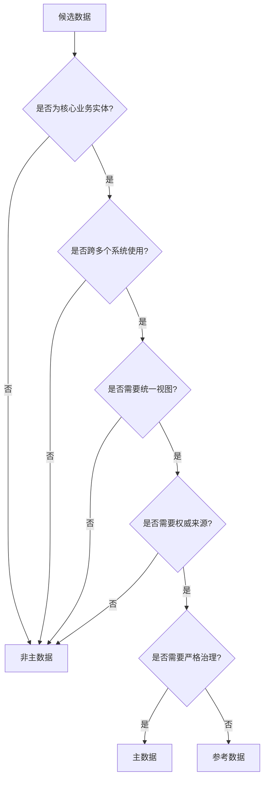

# 第9章 主数据管理

## 目录

1. [主数据管理概述](#主数据管理概述)
2. [主数据类型与识别](#主数据类型与识别)
3. [主数据管理体系架构](#主数据管理体系架构)
4. [主数据整合与治理](#主数据整合与治理)
5. [主数据质量管理](#主数据质量管理)
6. [主数据同步与分发](#主数据同步与分发)
7. [主数据管理最佳实践](#主数据管理最佳实践)
8. [主数据管理工具与平台](#主数据管理工具与平台)
9. [案例研究：企业主数据管理实施](#案例研究企业主数据管理实施)
10. [未来趋势：智能主数据管理](#未来趋势智能主数据管理)
11. [实践指南：主数据管理项目实施](#实践指南主数据管理项目实施)

---

## 主数据管理概述

### 主数据定义

主数据(Master Data)是关于核心业务实体的高价值、低冗余、共享的数据，被多个业务流程和系统共同使用。主数据描述了企业的关键业务实体，如客户、产品、供应商、员工等。

### 主数据管理定义

主数据管理(Master Data Management, MDM)是一套结合了技术、工具和流程的规程，旨在创建和维护企业主数据的可信、单一视图。主数据管理确保主数据的一致性、准确性和完整性，支持企业的业务运营和决策制定。

### 主数据管理的价值

1. **提高数据一致性**：消除不同系统中的数据冲突和不一致
2. **提升运营效率**：减少数据冗余和重复工作
3. **支持合规性**：满足法规对数据准确性和完整性的要求
4. **增强决策质量**：基于可靠、一致的数据进行业务决策
5. **降低运营成本**：减少数据维护成本和数据错误导致的损失
6. **改善客户体验**：提供360度客户视图，支持个性化服务

### 主数据 vs 其他数据

| 特征 | 主数据 | 交易数据 | 参考数据 | 分析数据 |
|------|--------|----------|----------|----------|
| 变化频率 | 低 | 高 | 中等 | 中等 |
| 生命周期 | 长 | 短 | 长 | 中等 |
| 更新方式 | 受控 | 事务性 | 计划性 | 批处理 |
| 共享范围 | 全企业 | 特定流程 | 多系统 | 特定领域 |
| 业务影响 | 战略性 | 操作性 | 战略性 | 战术性 |

---

## 主数据类型与识别

### 常见主数据类型

1. **客户主数据**
   - 个人客户：姓名、联系方式、人口统计信息
   - 组织客户：公司名称、行业、规模、联系人
   - 客户关系：家庭关系、企业关联、客户分组

2. **产品主数据**
   - 基础产品：产品名称、描述、分类、规格
   - 产品层次：产品系列、产品线、产品族
   - 产品关系：替代品、互补品、配件

3. **供应商主数据**
   - 基础信息：供应商名称、类型、状态
   - 联系信息：地址、联系人、沟通渠道
   - 业务信息：合同条款、供应能力、评级

4. **员工主数据**
   - 人力资源：姓名、职位、部门、薪资等级
   - 工作关系：汇报线、团队结构、权限范围
   - 能力信息：技能、资质、认证、培训记录

5. **资产主数据**
   - 固定资产：设备、设施、IT资产
   - 金融资产：账户、投资、保险
   - 知识资产：专利、商标、版权

6. **地点主数据**
   - 地理位置：地址、坐标、行政区划
   - 业务地点：门店、仓库、生产基地
   - 虚拟地点：网站、应用、数字渠道

### 主数据识别方法

1. **业务影响分析**
   - 评估数据对核心业务流程的影响程度
   - 识别跨多个业务系统使用的关键数据
   - 分析数据错误对业务决策和运营的影响

2. **数据共享分析**
   - 识别在多个系统间共享的数据
   - 分析数据在不同业务场景中的使用
   - 确定需要统一视图的数据实体

3. **数据价值评估**
   - 评估数据对业务价值和战略目标的支持
   - 识别高价值、高风险的数据资产
   - 分析数据对企业竞争力的影响

4. **技术依赖分析**
   - 分析系统间的数据依赖关系
   - 识别作为其他数据基础的关键数据
   - 评估数据变更的技术影响范围

### 主数据选择框架



---

## 主数据管理体系架构

### 主数据管理架构模式

#### 1. 集中式架构


**特点**：
- 单一权威主数据源
- 集中式数据管理
- 强数据控制和质量
- 适合中小型企业

#### 2. 分布式架构


**特点**：
- 多个权威源系统
- 分布式数据所有权
- 联邦式数据管理
- 适合大型复杂企业

#### 3. 混合架构


**特点**：
- 结合集中式和分布式优点
- 核心数据集中管理
- 特定数据分布式管理
- 灵活适应企业需求

### 主数据管理技术架构


### 主数据管理组件

1. **数据采集组件**
   - 批量采集：定时批量导入数据
   - 实时采集：通过消息队列实时接收变更
   - 文件采集：处理结构化和非结构化文件
   - API采集：通过REST API获取数据

2. **数据整合组件**
   - 数据标准化：统一数据格式和编码
   - 数据清洗：识别和修正数据错误
   - 数据丰富：补充缺失数据和信息
   - 数据验证：确保数据符合业务规则

3. **数据匹配组件**
   - 确定性匹配：基于唯一键的精确匹配
   - 概率性匹配：基于相似度的模糊匹配
   - 规则匹配：基于业务规则的匹配逻辑
   - 机器学习匹配：基于算法的智能匹配

4. **数据合并组件**
   - 冲突解决：处理数据冲突的策略
   - 黄金记录：创建权威的合并记录
   - 来源标记：记录数据来源和变更历史
   - 关系维护：管理实体间的关联关系

5. **数据分发组件**
   - 实时分发：立即推送数据变更
   - 批量分发：按计划批量分发数据
   - 按需分发：根据请求提供数据
   - 事件驱动：基于事件触发数据分发

---

## 主数据整合与治理

### 主数据整合策略

1. **数据整合方法**

| 方法 | 描述 | 适用场景 | 优点 | 缺点 |
|------|------|----------|------|------|
| 批量整合 | 定期批量处理数据 | 数据量大、实时性要求低 | 实现简单、资源消耗可控 | 数据延迟高 |
| 实时整合 | 实时处理数据变更 | 实时性要求高 | 数据及时性好 | 技术复杂、成本高 |
| 混合整合 | 结合批量和实时 | 综合性需求 | 平衡性能和及时性 | 架构复杂 |
| 增量整合 | 只处理变更数据 | 变更频繁、数据量大 | 效率高、负载低 | 变更检测复杂 |

2. **数据整合模式**


### 主数据治理框架

1. **治理组织结构**


2. **角色与职责**

| 角色 | 主要职责 | 典型人员 |
|------|----------|----------|
| 数据治理委员会 | 制定战略、审批重大决策 | 高管、业务负责人 |
| 主数据管理负责人 | 领导主数据管理工作、协调资源 | 数据管理总监 |
| 数据所有者 | 拥有特定主数据域、制定业务规则 | 业务部门负责人 |
| 数据管家 | 日常数据管理、质量控制 | 业务分析师、数据专员 |
| 数据架构师 | 设计主数据架构、制定标准 | 技术架构师 |
| 数据工程师 | 实现技术方案、开发工具 | 开发工程师 |

3. **主数据治理流程**


### 主数据治理最佳实践

1. **战略层面**
   - 与业务战略对齐，明确主数据管理的业务价值
   - 获得高层支持，确保足够的资源和授权
   - 制定分阶段实施计划，从小规模试点开始
   - 建立明确的投资回报预期和评估机制

2. **组织层面**
   - 建立跨部门协作机制，打破数据孤岛
   - 明确数据所有权和责任分工
   - 培养数据驱动的文化，提升数据素养
   - 建立有效的沟通和培训机制

3. **流程层面**
   - 标准化数据创建和变更流程
   - 建立数据质量监控和改进机制
   - 实施数据生命周期管理
   - 建立数据访问控制和审计机制

4. **技术层面**
   - 选择适合的主数据管理架构
   - 实现自动化的数据整合和分发
   - 建立灵活的数据建模和管理机制
   - 确保系统的可扩展性和性能

---

## 主数据质量管理

### 主数据质量评估维度

1. **完整性(Completeness)**
   - 必需字段的完整率
   - 记录的完整率
   - 关联关系的完整率
   - 历史数据的完整率

2. **准确性(Accuracy)**
   - 数据与真实世界的符合程度
   - 业务规则的一致性
   - 外部参考数据的验证
   - 数据输入的准确性

3. **一致性(Consistency)**
   - 跨系统数据的一致性
   - 内部逻辑一致性
   - 时间序列一致性
   - 关联数据一致性

4. **唯一性(Uniqueness)**
   - 记录的唯一性
   - 重复记录的识别
   - 合并记录的质量
   - 关键标识的唯一性

5. **及时性(Timeliness)**
   - 数据更新的及时性
   - 数据分发的时效性
   - 变更响应的时间
   - 批处理的时间窗口

6. **有效性(Validity)**
   - 数据格式的有效性
   - 取值范围的有效性
   - 业务规则的有效性
   - 引用完整性

### 主数据质量评估方法

1. **自动质量评估**

```python
class MasterDataQualityAssessor:
    def __init__(self, config):
        self.config = config
        self.assessments = []
    
    def assess_completeness(self, data, required_fields):
        """评估数据完整性"""
        total_records = len(data)
        field_completeness = {}
        
        for field in required_fields:
            complete_count = sum(1 for record in data 
                                if record.get(field) is not None and record.get(field) != '')
            completeness_ratio = complete_count / total_records
            field_completeness[field] = {
                'complete_count': complete_count,
                'total_count': total_records,
                'completeness_ratio': completeness_ratio,
                'score': completeness_ratio * 100
            }
        
        overall_completeness = sum(info['score'] for info in field_completeness.values()) / len(field_completeness)
        
        return {
            'field_completeness': field_completeness,
            'overall_completeness': overall_completeness,
            'assessment_level': self._get_quality_level(overall_completeness)
        }
    
    def assess_uniqueness(self, data, key_fields):
        """评估数据唯一性"""
        from collections import defaultdict
        
        # 基于关键字段识别重复记录
        key_counts = defaultdict(int)
        for record in data:
            key = tuple(record.get(field, '') for field in key_fields)
            key_counts[key] += 1
        
        duplicates = {k: v for k, v in key_counts.items() if v > 1}
        duplicate_count = sum(v - 1 for v in duplicates.values())
        unique_ratio = (len(data) - duplicate_count) / len(data)
        
        return {
            'total_records': len(data),
            'duplicate_keys': len(duplicates),
            'duplicate_records': duplicate_count,
            'unique_ratio': unique_ratio,
            'score': unique_ratio * 100,
            'assessment_level': self._get_quality_level(unique_ratio * 100)
        }
    
    def assess_validity(self, data, validation_rules):
        """评估数据有效性"""
        field_validity = {}
        total_fields = len(validation_rules)
        
        for field, rules in validation_rules.items():
            valid_count = 0
            total_count = 0
            
            for record in data:
                if field in record:
                    total_count += 1
                    value = record[field]
                    if self._validate_field(value, rules):
                        valid_count += 1
            
            if total_count > 0:
                validity_ratio = valid_count / total_count
                field_validity[field] = {
                    'valid_count': valid_count,
                    'total_count': total_count,
                    'validity_ratio': validity_ratio,
                    'score': validity_ratio * 100
                }
        
        overall_validity = sum(info['score'] for info in field_validity.values()) / len(field_validity) if field_validity else 0
        
        return {
            'field_validity': field_validity,
            'overall_validity': overall_validity,
            'assessment_level': self._get_quality_level(overall_validity)
        }
    
    def _validate_field(self, value, rules):
        """验证字段值是否符合规则"""
        if 'type' in rules:
            if rules['type'] == 'numeric' and not isinstance(value, (int, float)):
                return False
            elif rules['type'] == 'string' and not isinstance(value, str):
                return False
        
        if 'min_length' in rules and len(value) < rules['min_length']:
            return False
        
        if 'max_length' in rules and len(value) > rules['max_length']:
            return False
        
        if 'pattern' in rules:
            import re
            if not re.match(rules['pattern'], value):
                return False
        
        if 'values' in rules and value not in rules['values']:
            return False
        
        return True
    
    def _get_quality_level(self, score):
        """根据得分获取质量等级"""
        if score >= 90:
            return 'excellent'
        elif score >= 80:
            return 'good'
        elif score >= 70:
            return 'fair'
        elif score >= 60:
            return 'poor'
        else:
            return 'critical'
```

2. **手动质量评估**

```python
class ManualQualityAssessment:
    def __init__(self, config):
        self.config = config
        self.assessments = []
    
    def create_assessment(self, master_data_type, assessment_criteria):
        """创建手动质量评估"""
        assessment = {
            'id': f"qa_{len(self.assessments) + 1}",
            'master_data_type': master_data_type,
            'created_date': datetime.now(),
            'status': 'active',
            'criteria': assessment_criteria,
            'results': {}
        }
        
        self.assessments.append(assessment)
        return assessment['id']
    
    def record_assessment_result(self, assessment_id, sample_data, reviewer, scores):
        """记录评估结果"""
        assessment = self.get_assessment(assessment_id)
        if not assessment:
            raise ValueError(f"Assessment {assessment_id} not found")
        
        result = {
            'reviewer': reviewer,
            'sample_size': len(sample_data),
            'assessment_date': datetime.now(),
            'scores': scores,
            'comments': []
        }
        
        assessment['results'][reviewer] = result
        return result
    
    def calculate_consensus_score(self, assessment_id):
        """计算一致性评分"""
        assessment = self.get_assessment(assessment_id)
        if not assessment or not assessment['results']:
            return None
        
        reviewers = list(assessment['results'].keys())
        criteria = list(assessment['criteria'].keys())
        
        consensus_scores = {}
        
        for criterion in criteria:
            scores = []
            for reviewer in reviewers:
                scores.append(assessment['results'][reviewer]['scores'].get(criterion, 0))
            
            # 计算平均分和标准差
            avg_score = sum(scores) / len(scores)
            variance = sum((score - avg_score) ** 2 for score in scores) / len(scores)
            std_dev = variance ** 0.5
            
            consensus_scores[criterion] = {
                'average_score': avg_score,
                'standard_deviation': std_dev,
                'consensus_level': 'high' if std_dev < 10 else 
                                  'medium' if std_dev < 20 else 'low'
            }
        
        return consensus_scores
```

### 主数据质量改进策略

1. **预防性措施**
   - 设计合理的数据模型和约束
   - 实施数据输入验证和清理
   - 培训用户提高数据输入质量
   - 建立数据质量标准和规范

2. **检测性措施**
   - 实施自动化数据质量检查
   - 定期进行数据质量审计
   - 监控数据质量指标趋势
   - 建立数据质量报告机制

3. **纠正性措施**
   - 实施数据清洗和标准化
   - 建立数据修正工作流
   - 提供数据修正工具和界面
   - 跟踪数据修正效果

4. **持续性措施**
   - 持续监控数据质量变化
   - 定期评估和优化质量规则
   - 收集用户反馈和改进建议
   - 建立数据质量文化

---

## 主数据同步与分发

### 主数据同步模式

1. **实时同步**


**特点**：
- 变更实时传播
- 数据一致性好
- 技术复杂度高
- 系统依赖性强

2. **批量同步**


**特点**：
- 按计划批量处理
- 实现简单
- 资源利用效率高
- 数据存在延迟

3. **按需同步**


**特点**：
- 根据需求触发
- 减少不必要的数据传输
- 响应时间可变
- 适合低频访问场景

### 主数据分发策略

1. **推送式分发**
   - 主数据平台主动推送变更到订阅系统
   - 基于事件驱动的分发机制
   - 适合实时性要求高的场景
   - 需要处理目标系统不可用的情况

2. **拉取式分发**
   - 目标系统主动从主数据平台拉取数据
   - 基于轮询或定期检查的分发机制
   - 实现简单，容错性好
   - 适合实时性要求不高的场景

3. **混合式分发**
   - 结合推送和拉取两种方式
   - 关键数据采用推送，普通数据采用拉取
   - 平衡实时性和资源消耗
   - 适合复杂的企业环境

### 主数据同步冲突处理

1. **冲突检测机制**

```python
class ConflictDetector:
    def __init__(self, config):
        self.config = config
        self.conflict_rules = []
    
    def add_conflict_rule(self, rule):
        """添加冲突检测规则"""
        self.conflict_rules.append(rule)
    
    def detect_conflicts(self, source_data, target_data, merge_strategy='last_update_wins'):
        """检测数据冲突"""
        conflicts = []
        
        for source_record in source_data:
            source_id = source_record.get('id')
            target_record = next((r for r in target_data if r.get('id') == source_id), None)
            
            if target_record:
                # 检测字段级冲突
                field_conflicts = self._detect_field_conflicts(source_record, target_record)
                
                if field_conflicts:
                    conflicts.append({
                        'record_id': source_id,
                        'conflict_type': 'field_conflict',
                        'conflicts': field_conflicts,
                        'source_last_update': source_record.get('last_update'),
                        'target_last_update': target_record.get('last_update')
                    })
        
        return conflicts
    
    def _detect_field_conflicts(self, source_record, target_record):
        """检测字段级冲突"""
        conflicts = []
        
        for field in source_record:
            if field in target_record and source_record[field] != target_record[field]:
                for rule in self.conflict_rules:
                    if rule['field'] == field and rule['condition'](source_record, target_record):
                        conflicts.append({
                            'field': field,
                            'source_value': source_record[field],
                            'target_value': target_record[field],
                            'rule': rule['name']
                        })
                        break
        
        return conflicts
```

2. **冲突解决策略**

```python
class ConflictResolver:
    def __init__(self, config):
        self.config = config
        self.resolution_strategies = {}
    
    def register_strategy(self, name, strategy):
        """注册冲突解决策略"""
        self.resolution_strategies[name] = strategy
    
    def resolve_conflicts(self, conflicts, strategy_name):
        """解决数据冲突"""
        if strategy_name not in self.resolution_strategies:
            raise ValueError(f"Unknown resolution strategy: {strategy_name}")
        
        strategy = self.resolution_strategies[strategy_name]
        resolved_records = []
        
        for conflict in conflicts:
            resolved_record = strategy.resolve(conflict)
            resolved_records.append(resolved_record)
        
        return resolved_records
    
    def default_last_update_wins_strategy(self, conflict):
        """最后更新时间获胜策略"""
        source_update = conflict.get('source_last_update')
        target_update = conflict.get('target_last_update')
        
        if source_update > target_update:
            return {
                'record_id': conflict['record_id'],
                'resolution': 'source_wins',
                'timestamp': datetime.now(),
                'reason': 'Source record was updated more recently'
            }
        else:
            return {
                'record_id': conflict['record_id'],
                'resolution': 'target_wins',
                'timestamp': datetime.now(),
                'reason': 'Target record was updated more recently'
            }
    
    def manual_review_strategy(self, conflict):
        """人工审核策略"""
        return {
            'record_id': conflict['record_id'],
            'resolution': 'manual_review',
            'timestamp': datetime.now(),
            'reason': 'Conflict requires manual review',
            'details': conflict
        }
```

---

## 主数据管理最佳实践

### 主数据管理实施策略

1. **分阶段实施方法**


2. **快速验证方法**
   - 选择边界清晰、价值明显的主数据域作为试点
   - 使用轻量级工具快速实现原型
   - 设定明确的成功指标和评估标准
   - 快速迭代，及时调整方向

3. **渐进式扩展策略**
   - 从单个主数据域开始，逐步扩展到其他域
   - 先处理内部系统，再扩展到外部系统
   - 先解决批量集成，再支持实时集成
   - 先实现基本功能，再增强高级特性

### 主数据管理成功因素

1. **高层支持**
   - 获得管理层对主数据管理的认可和支持
   - 确保足够的预算和资源投入
   - 建立清晰的决策和审批机制
   - 将主数据管理纳入企业战略规划

2. **明确的价值主张**
   - 定义清晰、可量化的业务价值
   - 与关键业务指标建立关联
   - 定期评估和展示价值实现情况
   - 基于价值优先级排序实施计划

3. **跨部门协作**
   - 建立跨部门的主数据管理团队
   - 明确各部门的角色和责任
   - 建立有效的沟通和协调机制
   - 共享成功经验和最佳实践

4. **技术架构灵活性**
   - 选择可扩展的技术架构
   - 支持多种数据源和集成方式
   - 提供灵活的数据建模能力
   - 确保系统的性能和可靠性

### 主数据管理常见挑战

1. **技术挑战**
   - 复杂的系统集成和数据整合
   - 海量数据的处理和性能优化
   - 多样化数据格式和标准的统一
   - 实时数据处理的技术复杂性

2. **组织挑战**
   - 部门间数据所有权和使用权的冲突
   - 变革管理和用户抵触情绪
   - 数据治理责任的明确和执行
   - 跨部门协作和沟通障碍

3. **数据挑战**
   - 历史数据的质量和完整性问题
   - 数据标准化和语义统一
   - 主数据识别和范围的界定
   - 数据生命周期管理的复杂性

4. **实施挑战**
   - 投资回报评估和预算限制
   - 实施周期长和见效慢
   - 技术复杂度和技能要求高
   - 与现有系统和流程的整合

---

## 主数据管理工具与平台

### 开源主数据管理工具

1. **Pimcore**
   - 功能全面的开源MDM解决方案
   - 支持产品、客户、数字资产管理
   - 提供灵活的数据建模和工作流
   - 适合中小企业和特定行业

2. **Ataccama ONE**
   - 现代化的数据质量和主数据管理平台
   - 提供数据目录、血缘和质量管理
   - 支持云端和本地部署
   - 适合中型到大型企业

3. **OpenMDM**
   - 轻量级开源主数据管理框架
   - 提供基础的MDM功能和服务
   - 高度可定制和可扩展
   - 适合技术团队和定制需求

### 商业主数据管理平台

1. **Informatica MDM**
   - 行业领先的主数据管理解决方案
   - 支持多域主数据管理
   - 提供全面的数据质量功能
   - 适合大型复杂企业

2. **SAP Master Data Governance**
   - 集成在SAP生态系统中的MDM解决方案
   - 与SAP应用无缝集成
   - 提供行业特定的数据模型
   - 适合SAP用户和特定行业

3. **IBM InfoSphere MDM**
   - 企业级主数据管理平台
   - 支持复杂的数据模型和业务规则
   - 提供强大的数据处理能力
   - 适合大型企业和复杂环境

4. **Tibco EBX**
   - 灵活的主数据和参考数据管理平台
   - 提供直观的数据建模界面
   - 支持多语言和多地区
   - 适合全球化和多行业企业

### 主数据管理平台选择标准

1. **功能匹配度**
   - 支持的主数据域和实体
   - 数据质量和治理功能
   - 数据建模和定制能力
   - 工作流和审批机制

2. **技术适配性**
   - 与现有系统的集成能力
   - 部署架构和技术栈要求
   - 性能和可扩展性指标
   - 安全性和合规性特性

3. **总拥有成本**
   - 许可证费用和订阅成本
   - 实施和定制开发成本
   - 运维和升级成本
   - 培训和支持成本

4. **供应商能力**
   - 产品发展路线图和创新能力
   - 技术支持和售后服务质量
   - 行业经验和成功案例
   - 长期合作和可持续发展

---

## 案例研究：企业主数据管理实施

### 案例背景

某跨国零售企业面临以下主数据管理挑战：
- 多个业务系统存在重复和不一致的客户数据
- 产品信息在不同渠道不统一
- 供应商数据分散在多个采购系统
- 缺乏统一的数据标准和治理机制

### 解决方案设计

1. **主数据范围界定**
   - 客户主数据：个人客户和企业客户
   - 产品主数据：商品、分类、属性
   - 供应商主数据：基础信息、合同、评级
   - 门店主数据：位置、属性、配置

2. **技术架构选择**
   - 采用混合式MDM架构
   - 核心主数据集中管理
   - 特定领域数据分布式管理
   - 基于云原生技术实现

3. **实施计划**
   - 第一阶段：客户主数据管理（6个月）
   - 第二阶段：产品主数据管理（8个月）
   - 第三阶段：供应商主数据管理（6个月）
   - 第四阶段：门店主数据管理（4个月）

### 实施过程与挑战

1. **组织挑战**
   - 跨部门数据所有权冲突
   - 数据标准制定过程中的分歧
   - 用户培训和变更管理困难

2. **技术挑战**
   - 复杂的系统集成和数据迁移
   - 大规模数据处理性能问题
   - 实时同步的技术实现难度

3. **解决方案**
   - 建立跨部门数据治理委员会
   - 采用分阶段实施和迭代优化
   - 优先解决高价值问题
   - 加强用户培训和沟通

### 实施成果

1. **数据质量提升**
   - 客户数据重复率从35%降至5%
   - 产品信息完整率从70%提升至95%
   - 供应商数据准确性提升30%

2. **业务效率提升**
   - 客户数据维护工作量减少60%
   - 新产品上架时间缩短40%
   - 供应商管理效率提升50%

3. **业务价值实现**
   - 营销活动响应率提高25%
   - 库存准确率提升20%
   - 采购成本降低15%

---

## 未来趋势：智能主数据管理

### 人工智能与主数据管理

1. **AI驱动的数据匹配**
   - 基于深度学习的实体解析
   - 上下文感知的相似度计算
   - 自适应的匹配策略优化
   - 半监督学习的模型训练

2. **智能数据质量改进**
   - 自动异常检测和修正
   - 智能数据补全和丰富
   - 预测性质量维护
   - 自适应质量规则学习

3. **自然语言数据处理**
   - 非结构化数据的主数据提取
   - 文本语义理解和标准化
   - 多语言数据处理
   - 上下文相关的数据理解

### 实时主数据管理

1. **流式主数据管理**
   - 基于事件流的实时数据处理
   - 低延迟的主数据同步和分发
   - 实时冲突检测和解决
   - 流式数据质量监控

2. **边缘计算与主数据**
   - 分布式边缘节点的主数据缓存
   - 边缘设备的主数据管理
   - 离线模式下的数据一致性
   - 中心-边缘协同的数据管理

### 主数据管理生态系统

1. **MDM即服务(MDMaaS)**
   - 云原生主数据管理平台
   - 弹性扩展和按需付费
   - 低代码/无代码配置
   - API驱动的服务集成

2. **数据网格与主数据**
   - 去中心化的主数据管理
   - 领域驱动的主数据架构
   - 自服务平台模式
   - 联邦式数据治理

3. **区块链与主数据**
   - 不可篡改的主数据记录
   - 分布式数据一致性
   - 智能合约驱动的数据治理
   - 去中心化数据所有权

### 未来主数据管理能力


---

## 实践指南：主数据管理项目实施

### 项目准备阶段

1. **现状评估**
   - 数据资产盘点和分类
   - 主数据使用情况分析
   - 现有系统和流程梳理
   - 主数据问题识别和影响评估

2. **需求分析**
   - 业务需求收集和分析
   - 主数据范围界定
   - 功能性和非功能性需求定义
   - 成功指标和评估标准制定

3. **可行性分析**
   - 技术可行性评估
   - 投资回报分析
   - 风险识别和评估
   - 实施方案比较和选择

### 项目规划阶段

1. **项目组织架构**
   - 项目团队组建和角色定义
   - 指导委员会和工作组成立
   - 沟通机制和决策流程建立
   - 培训计划和变更管理设计

2. **技术方案设计**
   - 主数据管理架构设计
   - 数据模型和标准设计
   - 系统集成方案设计
   - 技术选型和平台搭建

3. **实施计划制定**
   - 里程碑和交付物定义
   - 资源需求和时间计划
   - 风险管理和应对计划
   - 质量保证和测试计划

### 项目实施阶段

1. **系统开发和配置**
   - 主数据管理平台搭建
   - 数据模型配置和测试
   - 集成接口开发和测试
   - 工作流和规则配置

2. **数据迁移和整合**
   - 历史数据清洗和标准化
   - 数据迁移脚本开发和测试
   - 数据质量检查和问题修复
   - 切换计划和执行

3. **用户培训和上线**
   - 用户手册和培训材料准备
   - 用户培训和认证
   - 系统切换和上线
   - 上线支持和问题处理

### 项目运维阶段

1. **系统运维**
   - 系统监控和性能优化
   - 问题处理和故障恢复
   - 系统升级和功能增强
   - 安全管理和备份恢复

2. **持续改进**
   - 用户反馈收集和分析
   - 系统使用情况评估
   - 业务价值持续跟踪
   - 优化方案制定和实施

3. **知识管理**
   - 文档更新和维护
   - 经验总结和分享
   - 最佳实践提炼和推广
   - 能力建设和人才培养

### 主数据管理项目成功指标

1. **技术指标**
   - 数据质量提升：重复率降低、完整性提高
   - 系统性能：响应时间、处理能力、可用性
   - 数据一致性：跨系统一致性水平
   - 系统集成度：集成系统数量和质量

2. **业务指标**
   - 运营效率：流程耗时减少、人工成本降低
   - 决策质量：决策准确性、时效性提升
   - 客户满意度：服务质量、响应速度改进
   - 合规性：监管要求满足程度、风险降低

3. **财务指标**
   - 直接成本节省：数据维护成本、错误处理成本
   - 间接收益：业务机会增加、风险损失减少
   - 投资回报率：ROI计算和分析
   - 总拥有成本：TCO优化和控制

---

## 总结

主数据管理是数据治理体系的核心组成部分，通过创建和维护关键业务实体的权威、单一视图，为企业提供可靠的数据基础。本章全面介绍了主数据管理的理论基础、技术实现和最佳实践，包括：

1. **主数据管理基础**：定义了主数据的概念、类型和识别方法
2. **主数据管理体系架构**：介绍了不同的架构模式和技术实现
3. **主数据整合与治理**：阐述了数据整合方法和治理框架
4. **主数据质量管理**：提供了质量评估方法和改进策略
5. **主数据同步与分发**：分析了同步模式和冲突处理
6. **主数据管理最佳实践**：总结了实施策略和成功因素
7. **主数据管理工具与平台**：比较了开源和商业解决方案
8. **案例研究**：展示了实际企业的实施经验和成果
9. **未来趋势**：探讨了智能主数据管理的发展方向

通过本章的学习，读者应该能够：
- 理解主数据管理的价值和应用场景
- 掌握主数据识别和分类的方法
- 设计适合企业需求的主数据管理架构
- 实施主数据质量管理和改进措施
- 处理主数据同步和分发中的技术挑战
- 规划和执行主数据管理项目

主数据管理不是一次性的技术项目，而是持续的改进过程。企业需要根据自身情况和业务需求，选择合适的实施策略和技术方案，建立完善的主数据治理体系，从而充分发挥主数据的战略价值，支撑企业的数字化转型和业务创新。

未来，随着人工智能、云计算和边缘计算等技术的发展，主数据管理将变得更加智能、实时和自动化，企业需要关注这些技术趋势，及时调整和优化主数据管理策略，以保持竞争优势和业务敏捷性。