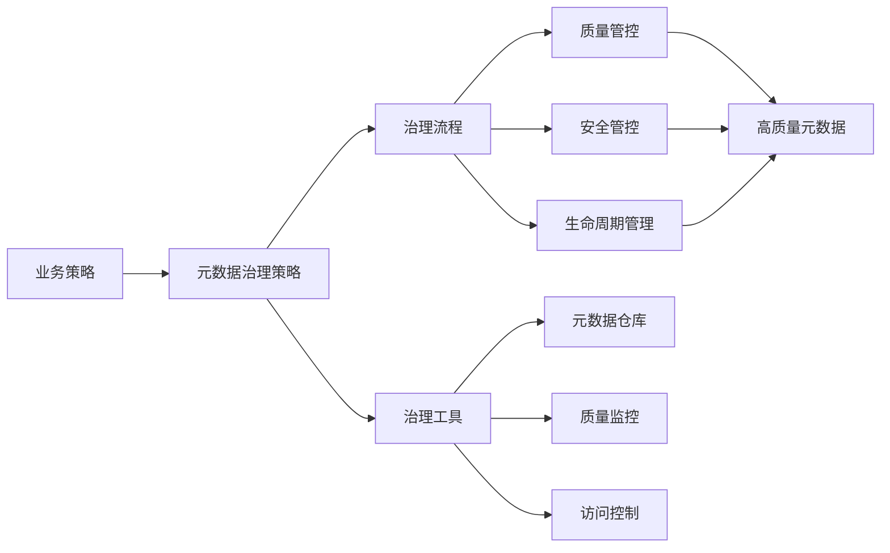
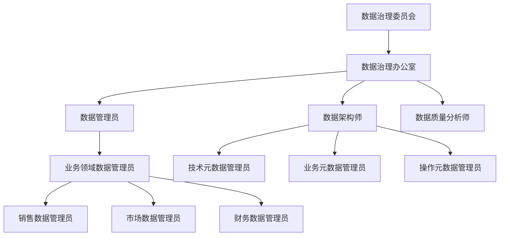
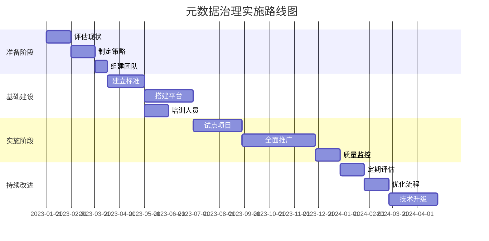

# 第5章：元数据治理与管理

## 5.1 元数据治理概述

### 5.1.1 什么是元数据治理

元数据治理是指对组织中元数据的创建、存储、维护、使用和处置进行系统性管理的过程。它确保元数据的质量、一致性、安全性和可用性，支持数据驱动的决策制定和业务运营。



### 5.1.2 元数据治理的重要性

1. **提升数据质量**：通过标准化和验证机制确保元数据准确、完整
2. **增强数据信任**：建立可靠的数据源，提高业务用户对数据的信心
3. **提高运营效率**：减少数据冗余和不一致性，优化数据资产利用
4. **确保合规性**：满足法规要求，降低合规风险
5. **支持数字化转型**：为数据驱动决策提供可靠基础

### 5.1.3 元数据治理框架

元数据治理框架包括以下核心组件：

1. **策略与规范**：定义元数据管理的原则、标准和流程
2. **组织结构**：明确角色、职责和权限
3. **流程管理**：建立元数据创建、审批、维护和退役流程
4. **技术支持**：提供工具和平台支持治理活动
5. **质量保证**：监控、评估和改进元数据质量

## 5.2 元数据治理策略与规范

### 5.2.1 治理策略设计

#### 基本原则

1. **业务驱动**：以业务需求为导向，确保治理价值
2. **渐进实施**：分阶段推进，从关键领域开始
3. **标准化**：建立统一的元数据标准和规范
4. **自动化**：利用技术手段提高治理效率
5. **持续改进**：定期评估和优化治理策略

#### 治理策略示例

```python
class MetadataGovernanceStrategy:
    """
    元数据治理策略定义
    """
    def __init__(self):
        self.policies = {
            "naming": {
                "convention": "snake_case",
                "prefix": {
                    "table": "tbl_",
                    "view": "vw_",
                    "procedure": "sp_"
                }
            },
            "ownership": {
                "data_steward_required": True,
                "technical_owner_required": True,
                "business_owner_required": True
            },
            "classification": {
                "sensitivity_levels": ["public", "internal", "confidential", "restricted"],
                "data_categories": ["PII", "Financial", "Health", "Operational"]
            },
            "retention": {
                "default_retention_days": 2555,  # 7年
                "archive_after_days": 1095,     # 3年
                "delete_after_days": 3650       # 10年
            },
            "access_control": {
                "rbac_enabled": True,
                "default_permissions": "read",
                "approval_required_for_write": True
            }
        }
    
    def validate_naming(self, metadata_type, name):
        """验证命名是否符合规范"""
        policy = self.policies["naming"]
        expected_prefix = policy["prefix"].get(metadata_type, "")
        
        if expected_prefix and not name.startswith(expected_prefix):
            return False, f"{metadata_type}名称应以'{expected_prefix}'为前缀"
            
        if policy["convention"] == "snake_case" and "_" not in name:
            return False, "名称应使用snake_case命名规范"
            
        return True, "命名符合规范"
    
    def check_ownership(self, owners):
        """检查所有权信息是否完整"""
        policy = self.policies["ownership"]
        missing = []
        
        if policy.get("data_steward_required") and "data_steward" not in owners:
            missing.append("数据管理员")
        if policy.get("technical_owner_required") and "technical_owner" not in owners:
            missing.append("技术负责人")
        if policy.get("business_owner_required") and "business_owner" not in owners:
            missing.append("业务负责人")
            
        return len(missing) == 0, missing
    
    def classify_data(self, sensitivity, categories):
        """数据分类验证"""
        valid_sensitivity = sensitivity in self.policies["classification"]["sensitivity_levels"]
        valid_categories = all(cat in self.policies["classification"]["data_categories"] for cat in categories)
        
        return valid_sensitivity and valid_categories

# 使用示例
strategy = MetadataGovernanceStrategy()

# 验证命名
is_valid, message = strategy.validate_naming("table", "customer_data")
print(f"命名验证: {is_valid}, {message}")

# 检查所有权
owners = {"data_steward": "张三", "technical_owner": "李四"}
has_complete_ownership, missing = strategy.check_ownership(owners)
print(f"所有权完整: {has_complete_ownership}, 缺失: {missing}")

# 数据分类
is_classified = strategy.classify_data("internal", ["Operational"])
print(f"数据分类有效: {is_classified}")
```

### 5.2.2 元数据标准规范

#### 命名标准

1. **表命名规范**：`tbl_业务域_实体名`，例如 `tbl_sales_customer`
2. **列命名规范**：`属性名_单位`，例如 `price_rmb`, `weight_kg`
3. **视图命名规范**：`vw_用途描述`，例如 `vw_monthly_sales_summary`
4. **索引命名规范**：`idx_表名_列名`，例如 `idx_tbl_customer_customer_id`

#### 文档标准

1. **业务定义**：简明描述数据项的业务含义
2. **技术定义**：描述数据类型、格式、约束等技术特性
3. **质量标准**：定义完整性、准确性、一致性等质量要求
4. **使用说明**：数据使用方法和注意事项

## 5.3 元数据组织与角色

### 5.3.1 治理组织结构



### 5.3.2 关键角色与职责

#### 数据治理委员会
- **职责**：制定治理策略，审批重要决策，监督治理执行
- **组成**：高级管理层，各业务领域负责人
- **会议频率**：每季度一次

#### 数据管理员
- **职责**：负责特定数据域的元数据质量、标准和文档
- **技能要求**：业务领域知识、数据管理知识、沟通能力
- **日常活动**：元数据审查、质量监控、变更协调

#### 数据架构师
- **职责**：设计元数据架构，制定技术标准，管理数据模型
- **技能要求**：数据建模、系统设计、技术架构
- **日常活动**：模型设计、标准评审、架构优化

```python
class DataGovernanceOrganization:
    """
    数据治理组织结构管理
    """
    def __init__(self):
        self.roles = {
            "committee": {
                "name": "数据治理委员会",
                "responsibilities": [
                    "制定数据治理策略和方向",
                    "审批重要数据资产决策",
                    "监督治理执行情况",
                    "解决跨部门数据争议"
                ],
                "meeting_frequency": "季度"
            },
            "steward": {
                "name": "数据管理员",
                "responsibilities": [
                    "定义业务术语和数据标准",
                    "维护数据质量和完整性",
                    "监控数据使用情况",
                    "处理数据相关问题"
                ],
                "skills": ["业务领域知识", "数据管理", "沟通能力", "问题解决"]
            },
            "architect": {
                "name": "数据架构师",
                "responsibilities": [
                    "设计数据架构和模型",
                    "制定技术标准和规范",
                    "评估新技术和工具",
                    "优化数据性能"
                ],
                "skills": ["数据建模", "系统设计", "技术架构", "性能优化"]
            },
            "analyst": {
                "name": "数据质量分析师",
                "responsibilities": [
                    "定义数据质量规则",
                    "监控数据质量指标",
                    "识别和分析数据问题",
                    "报告质量改进建议"
                ],
                "skills": ["数据分析", "质量评估", "规则设计", "报告生成"]
            }
        }
    
    def get_role_responsibilities(self, role):
        """获取角色职责"""
        return self.roles.get(role, {}).get("responsibilities", [])
    
    def get_required_skills(self, role):
        """获取角色所需技能"""
        return self.roles.get(role, {}).get("skills", [])
    
    def assign_steward(self, data_domain, steward_name, contact_info):
        """分配数据管理员"""
        assignment = {
            "data_domain": data_domain,
            "steward_name": steward_name,
            "contact_info": contact_info,
            "assignment_date": datetime.now().isoformat(),
            "status": "active"
        }
        return assignment
    
    def define_role_permissions(self, role):
        """定义角色权限"""
        permissions = {
            "committee": ["approve_policies", "resolve_disputes", "oversight"],
            "steward": ["define_standards", "manage_metadata", "approve_changes"],
            "architect": ["design_models", "set_technical_standards", "approve_technical_changes"],
            "analyst": ["monitor_quality", "define_rules", "report_issues"]
        }
        return permissions.get(role, [])

# 使用示例
org = DataGovernanceOrganization()

# 查看数据管理员职责
steward_responsibilities = org.get_role_responsibilities("steward")
print("数据管理员职责:")
for resp in steward_responsibilities:
    print(f"- {resp}")

# 分配数据管理员
assignment = org.assign_steward("客户数据", "王五", "wangwu@company.com")
print(f"\n数据管理员分配: {assignment}")

# 查看角色权限
permissions = org.define_role_permissions("steward")
print(f"\n数据管理员权限: {permissions}")
```

## 5.4 元数据生命周期管理

### 5.4.1 元数据生命周期阶段

元数据生命周期包括以下关键阶段：

1. **创建阶段**：新元数据项的生成和初始定义
2. **审批阶段**：元数据内容和质量的审核与批准
3. **发布阶段**：元数据正式发布，可供使用
4. **维护阶段**：持续更新和改进元数据内容
5. **归档阶段**：不再活跃使用的元数据归档保存
6. **废弃阶段**：永久删除不再需要的元数据

```python
from datetime import datetime, timedelta
from enum import Enum

class MetadataLifecycleStatus(Enum):
    """元数据生命周期状态"""
    DRAFT = "草稿"
    PENDING_APPROVAL = "待审批"
    ACTIVE = "活跃"
    UNDER_REVIEW = "审查中"
    ARCHIVED = "已归档"
    DEPRECATED = "已废弃"
    DELETED = "已删除"

class MetadataLifecycleManager:
    """元数据生命周期管理"""
    
    def __init__(self):
        self.lifecycle_rules = {
            "draft_max_days": 30,         # 草稿状态最长天数
            "approval_max_days": 14,      # 审批最长天数
            "review_interval_days": 180,  # 审查间隔天数
            "archive_inactive_days": 365, # 不活跃数据归档天数
            "delete_after_archive_days": 1825  # 归档后删除天数
        }
    
    def create_metadata(self, metadata_id, creator):
        """创建元数据"""
        metadata = {
            "id": metadata_id,
            "creator": creator,
            "created_at": datetime.now(),
            "status": MetadataLifecycleStatus.DRAFT,
            "status_history": [{
                "status": MetadataLifecycleStatus.DRAFT,
                "changed_at": datetime.now(),
                "changed_by": creator,
                "comment": "元数据创建"
            }],
            "last_reviewed": None,
            "next_review_date": None
        }
        return metadata
    
    def submit_for_approval(self, metadata, submitter, comment="提交审批"):
        """提交审批"""
        if metadata["status"] != MetadataLifecycleStatus.DRAFT:
            raise ValueError("只有草稿状态的元数据可以提交审批")
        
        metadata["status"] = MetadataLifecycleStatus.PENDING_APPROVAL
        metadata["status_history"].append({
            "status": MetadataLifecycleStatus.PENDING_APPROVAL,
            "changed_at": datetime.now(),
            "changed_by": submitter,
            "comment": comment
        })
        return metadata
    
    def approve_metadata(self, metadata, approver, comment="审批通过"):
        """审批通过"""
        if metadata["status"] != MetadataLifecycleStatus.PENDING_APPROVAL:
            raise ValueError("只有待审批状态的元数据可以审批")
        
        metadata["status"] = MetadataLifecycleStatus.ACTIVE
        metadata["status_history"].append({
            "status": MetadataLifecycleStatus.ACTIVE,
            "changed_at": datetime.now(),
            "changed_by": approver,
            "comment": comment
        })
        
        # 设置下次审查日期
        review_interval = timedelta(days=self.lifecycle_rules["review_interval_days"])
        metadata["last_reviewed"] = datetime.now()
        metadata["next_review_date"] = datetime.now() + review_interval
        
        return metadata
    
    def reject_metadata(self, metadata, approver, reason):
        """审批拒绝"""
        if metadata["status"] != MetadataLifecycleStatus.PENDING_APPROVAL:
            raise ValueError("只有待审批状态的元数据可以拒绝")
        
        metadata["status"] = MetadataLifecycleStatus.DRAFT
        metadata["status_history"].append({
            "status": MetadataLifecycleStatus.DRAFT,
            "changed_at": datetime.now(),
            "changed_by": approver,
            "comment": f"审批拒绝: {reason}"
        })
        return metadata
    
    def initiate_review(self, metadata, reviewer):
        """发起审查"""
        if metadata["status"] != MetadataLifecycleStatus.ACTIVE:
            raise ValueError("只有活跃状态的元数据可以审查")
        
        metadata["status"] = MetadataLifecycleStatus.UNDER_REVIEW
        metadata["status_history"].append({
            "status": MetadataLifecycleStatus.UNDER_REVIEW,
            "changed_at": datetime.now(),
            "changed_by": reviewer,
            "comment": "发起定期审查"
        })
        return metadata
    
    def complete_review(self, metadata, reviewer, approved, comment="审查完成"):
        """完成审查"""
        if metadata["status"] != MetadataLifecycleStatus.UNDER_REVIEW:
            raise ValueError("只有审查中的元数据可以完成审查")
        
        if approved:
            metadata["status"] = MetadataLifecycleStatus.ACTIVE
            # 更新下次审查日期
            review_interval = timedelta(days=self.lifecycle_rules["review_interval_days"])
            metadata["last_reviewed"] = datetime.now()
            metadata["next_review_date"] = datetime.now() + review_interval
            action = "审查通过"
        else:
            metadata["status"] = MetadataLifecycleStatus.DEPRECATED
            action = "审查不通过，标记为废弃"
        
        metadata["status_history"].append({
            "status": metadata["status"],
            "changed_at": datetime.now(),
            "changed_by": reviewer,
            "comment": f"{action}: {comment}"
        })
        
        return metadata
    
    def archive_metadata(self, metadata, archiver):
        """归档元数据"""
        if metadata["status"] not in [MetadataLifecycleStatus.DEPRECATED, MetadataLifecycleStatus.ACTIVE]:
            raise ValueError("只有活跃或废弃状态的元数据可以归档")
        
        metadata["status"] = MetadataLifecycleStatus.ARCHIVED
        metadata["status_history"].append({
            "status": MetadataLifecycleStatus.ARCHIVED,
            "changed_at": datetime.now(),
            "changed_by": archiver,
            "comment": "元数据归档"
        })
        return metadata
    
    def get_overdue_items(self, metadata_list):
        """获取过期项目"""
        overdue_items = []
        now = datetime.now()
        
        for metadata in metadata_list:
            # 检查草稿是否过期
            if metadata["status"] == MetadataLifecycleStatus.DRAFT:
                draft_days = (now - metadata["created_at"]).days
                if draft_days > self.lifecycle_rules["draft_max_days"]:
                    overdue_items.append({
                        "metadata_id": metadata["id"],
                        "status": metadata["status"],
                        "overdue_type": "草稿超期",
                        "overdue_days": draft_days - self.lifecycle_rules["draft_max_days"]
                    })
            
            # 检查是否需要审查
            elif metadata["status"] == MetadataLifecycleStatus.ACTIVE:
                if metadata["next_review_date"] and now > metadata["next_review_date"]:
                    overdue_days = (now - metadata["next_review_date"]).days
                    overdue_items.append({
                        "metadata_id": metadata["id"],
                        "status": metadata["status"],
                        "overdue_type": "审查超期",
                        "overdue_days": overdue_days
                    })
        
        return overdue_items

# 使用示例
lifecycle_manager = MetadataLifecycleManager()

# 创建元数据
metadata = lifecycle_manager.create_metadata("customer_metadata", "张三")
print(f"创建元数据: 状态={metadata['status'].value}")

# 提交审批
metadata = lifecycle_manager.submit_for_approval(metadata, "张三")
print(f"提交审批: 状态={metadata['status'].value}")

# 审批通过
metadata = lifecycle_manager.approve_metadata(metadata, "李四", "元数据定义清晰")
print(f"审批通过: 状态={metadata['status'].value}, 下次审查={metadata['next_review_date'].strftime('%Y-%m-%d')}")

# 模拟一些时间流逝，然后检查过期项目
from datetime import datetime, timedelta
now = datetime.now()

# 创建一个过期的草稿
old_draft = lifecycle_manager.create_metadata("old_metadata", "王五")
old_draft["created_at"] = now - timedelta(days=35)  # 35天前创建

# 检查过期项目
overdue = lifecycle_manager.get_overdue_items([metadata, old_draft])
print("\n过期项目:")
for item in overdue:
    print(f"- {item['metadata_id']}: {item['overdue_type']}, 超期{item['overdue_days']}天")
```

### 5.4.2 版本控制与变更管理

```python
class MetadataVersionManager:
    """元数据版本管理"""
    
    def __init__(self):
        self.versions = {}  # metadata_id -> list of versions
        self.current_versions = {}  # metadata_id -> current version id
    
    def create_version(self, metadata_id, content, changed_by, change_description=""):
        """创建新版本"""
        version_id = f"{metadata_id}_v{len(self.versions.get(metadata_id, [])) + 1}"
        version = {
            "version_id": version_id,
            "metadata_id": metadata_id,
            "content": content,
            "changed_by": changed_by,
            "changed_at": datetime.now(),
            "change_description": change_description,
            "version_number": len(self.versions.get(metadata_id, [])) + 1
        }
        
        if metadata_id not in self.versions:
            self.versions[metadata_id] = []
        
        self.versions[metadata_id].append(version)
        self.current_versions[metadata_id] = version_id
        
        return version
    
    def get_version(self, metadata_id, version_number=None):
        """获取指定版本"""
        if metadata_id not in self.versions:
            return None
        
        if version_number is None:
            # 返回当前版本
            current_version_id = self.current_versions[metadata_id]
            for version in self.versions[metadata_id]:
                if version["version_id"] == current_version_id:
                    return version
        else:
            # 返回指定版本号
            for version in self.versions[metadata_id]:
                if version["version_number"] == version_number:
                    return version
        
        return None
    
    def get_version_history(self, metadata_id):
        """获取版本历史"""
        return self.versions.get(metadata_id, [])
    
    def compare_versions(self, metadata_id, version1, version2):
        """比较两个版本"""
        v1 = self.get_version(metadata_id, version1)
        v2 = self.get_version(metadata_id, version2)
        
        if not v1 or not v2:
            return None
        
        # 这里可以实现更复杂的差异比较逻辑
        differences = {
            "metadata_id": metadata_id,
            "version1": {
                "number": v1["version_number"],
                "changed_at": v1["changed_at"],
                "changed_by": v1["changed_by"]
            },
            "version2": {
                "number": v2["version_number"],
                "changed_at": v2["changed_at"],
                "changed_by": v2["changed_by"]
            }
        }
        
        # 简单的内容差异比较
        if v1["content"] != v2["content"]:
            differences["content_changed"] = True
        else:
            differences["content_changed"] = False
        
        return differences
    
    def rollback_to_version(self, metadata_id, version_number, changed_by, reason=""):
        """回滚到指定版本"""
        target_version = self.get_version(metadata_id, version_number)
        if not target_version:
            raise ValueError(f"版本 {version_number} 不存在")
        
        # 创建基于旧版本的新版本
        new_version = self.create_version(
            metadata_id, 
            target_version["content"], 
            changed_by, 
            f"回滚到版本 {version_number}: {reason}"
        )
        
        return new_version

# 使用示例
version_manager = MetadataVersionManager()

# 创建几个版本
v1 = version_manager.create_version("product_metadata", {"name": "产品", "description": "产品描述"}, "张三", "初始版本")
v2 = version_manager.create_version("product_metadata", {"name": "产品", "description": "产品详细描述"}, "李四", "更新描述")
v3 = version_manager.create_version("product_metadata", {"name": "产品", "description": "产品详细描述", "category": "电子产品"}, "王五", "添加分类")

# 获取当前版本
current = version_manager.get_version("product_metadata")
print(f"当前版本: {current['version_id']}, 描述: {current['content']['description']}")

# 查看版本历史
history = version_manager.get_version_history("product_metadata")
print("\n版本历史:")
for version in history:
    print(f"- {version['version_id']}: {version['change_description']} ({version['changed_by']}, {version['changed_at'].strftime('%Y-%m-%d')})")

# 比较版本
diff = version_manager.compare_versions("product_metadata", 1, 3)
print(f"\n版本比较: {diff}")

# 回滚到版本2
rollback = version_manager.rollback_to_version("product_metadata", 2, "赵六", "回滚测试")
print(f"\n回滚后: {rollback['version_id']}, 内容: {rollback['content']}")
```

## 5.5 元数据安全与合规

### 5.5.1 元数据安全管理

元数据安全管理包括以下关键方面：

1. **访问控制**：基于角色的访问控制(RBAC)确保只有授权用户可以访问元数据
2. **数据分类**：根据敏感性和重要性对元数据进行分类
3. **加密保护**：对敏感元数据进行加密存储和传输
4. **审计日志**：记录所有元数据访问和修改操作
5. **隐私保护**：确保个人隐私信息符合相关法规要求

```python
from enum import Enum
import hashlib
import json
from datetime import datetime

class SensitivityLevel(Enum):
    """敏感度级别"""
    PUBLIC = "公开"
    INTERNAL = "内部"
    CONFIDENTIAL = "机密"
    RESTRICTED = "限制"

class MetadataSecurityManager:
    """元数据安全管理"""
    
    def __init__(self):
        self.user_roles = {}  # user_id -> [roles]
        self.role_permissions = {  # role -> [permissions]
            "admin": ["read", "write", "delete", "approve", "manage_users"],
            "steward": ["read", "write", "approve"],
            "analyst": ["read", "write"],
            "viewer": ["read"]
        }
        self.metadata_sensitivity = {}  # metadata_id -> sensitivity_level
        self.access_log = []  # 访问日志
    
    def assign_role(self, user_id, role):
        """分配用户角色"""
        if user_id not in self.user_roles:
            self.user_roles[user_id] = []
        
        if role not in self.user_roles[user_id]:
            self.user_roles[user_id].append(role)
        
        return True
    
    def check_permission(self, user_id, action, metadata_id=None):
        """检查用户权限"""
        if user_id not in self.user_roles:
            return False
        
        user_roles = self.user_roles[user_id]
        
        # 管理员拥有所有权限
        if "admin" in user_roles:
            return True
        
        # 检查角色权限
        for role in user_roles:
            if role in self.role_permissions:
                if action in self.role_permissions[role]:
                    # 如果涉及特定元数据，检查敏感度限制
                    if metadata_id and metadata_id in self.metadata_sensitivity:
                        sensitivity = self.metadata_sensitivity[metadata_id]
                        # 只有管理员可以访问RESTRICTED级别
                        if sensitivity == SensitivityLevel.RESTRICTED and role != "admin":
                            return False
                        # 只有管理员和管理员可以访问CONFIDENTIAL级别
                        if sensitivity == SensitivityLevel.CONFIDENTIAL and role not in ["admin", "steward"]:
                            return False
                    return True
        
        return False
    
    def set_sensitivity(self, metadata_id, sensitivity_level, changed_by):
        """设置元数据敏感度"""
        if not self.check_permission(changed_by, "write", metadata_id):
            raise PermissionError("无权限设置敏感度")
        
        self.metadata_sensitivity[metadata_id] = sensitivity_level
        
        # 记录操作
        self._log_access(changed_by, "set_sensitivity", metadata_id, 
                        f"设置敏感度为 {sensitivity_level.value}")
        
        return True
    
    def access_metadata(self, user_id, metadata_id, action="read"):
        """访问元数据"""
        if not self.check_permission(user_id, action, metadata_id):
            raise PermissionError(f"用户 {user_id} 无权限对元数据 {metadata_id} 执行 {action} 操作")
        
        # 记录访问日志
        self._log_access(user_id, action, metadata_id, "访问成功")
        
        return True
    
    def _log_access(self, user_id, action, metadata_id, result):
        """记录访问日志"""
        log_entry = {
            "timestamp": datetime.now().isoformat(),
            "user_id": user_id,
            "action": action,
            "metadata_id": metadata_id,
            "result": result,
            "ip_address": "127.0.0.1"  # 在实际应用中应获取真实IP
        }
        self.access_log.append(log_entry)
        
        # 在实际应用中，这里应该将日志写入持久化存储
        # 如数据库或日志文件
    
    def get_access_log(self, user_id=None, metadata_id=None, start_time=None, end_time=None):
        """查询访问日志"""
        filtered_log = self.access_log
        
        if user_id:
            filtered_log = [entry for entry in filtered_log if entry["user_id"] == user_id]
        
        if metadata_id:
            filtered_log = [entry for entry in filtered_log if entry["metadata_id"] == metadata_id]
        
        # 在实际应用中，还应添加时间范围过滤
        
        return filtered_log
    
    def encrypt_sensitive_data(self, data, key):
        """加密敏感数据（简化示例）"""
        # 在实际应用中，应使用更安全的加密算法如AES
        data_str = json.dumps(data)
        encrypted_data = hashlib.sha256((data_str + key).encode()).hexdigest()
        return encrypted_data

# 使用示例
security = MetadataSecurityManager()

# 分配角色
security.assign_role("user1", "analyst")
security.assign_role("user2", "steward")
security.assign_role("admin1", "admin")

# 设置元数据敏感度
security.set_sensitivity("customer_data", SensitivityLevel.CONFIDENTIAL, "admin1")
security.set_sensitivity("product_data", SensitivityLevel.INTERNAL, "admin1")

# 测试访问权限
try:
    security.access_metadata("user1", "customer_data", "read")  # 应该失败
except PermissionError as e:
    print(f"访问失败: {e}")

try:
    security.access_metadata("user2", "customer_data", "read")  # 应该成功
    print("user2 访问 customer_data 成功")
except PermissionError as e:
    print(f"访问失败: {e}")

# 查看访问日志
logs = security.get_access_log()
print(f"\n访问日志 ({len(logs)} 条):")
for log in logs[-3:]:  # 显示最近3条
    print(f"- {log['timestamp']}: {log['user_id']} {log['action']} {log['metadata_id']} - {log['result']}")
```

### 5.5.2 合规性管理

元数据合规性管理确保元数据处理符合相关法规和标准，如GDPR、CCPA、HIPAA等。

```python
class ComplianceManager:
    """合规性管理"""
    
    def __init__(self):
        self.regulations = {
            "GDPR": {
                "name": "通用数据保护条例",
                "requirements": [
                    "数据最小化",
                    "目的限制",
                    "存储限制",
                    "准确性",
                    "完整性",
                    "问责制"
                ],
                "data_subject_rights": [
                    "访问权",
                    "更正权",
                    "删除权（被遗忘权）",
                    "限制处理权",
                    "数据可携带权",
                    "反对权"
                ]
            },
            "CCPA": {
                "name": "加州消费者隐私法案",
                "requirements": [
                    "透明度",
                    "消费者控制",
                    "数据安全",
                    "企业问责"
                ],
                "data_subject_rights": [
                    "知情权",
                    "删除权",
                    "选择退出权",
                    "非歧视权"
                ]
            }
        }
        
        self.compliance_checks = {
            "data_retention": self._check_retention_policy,
            "data_classification": self._check_classification,
            "access_control": self._check_access_control,
            "audit_trail": self._check_audit_trail
        }
    
    def get_regulation_info(self, regulation_code):
        """获取法规信息"""
        return self.regulations.get(regulation_code, {})
    
    def check_compliance(self, metadata, regulations=["GDPR"]):
        """检查合规性"""
        compliance_results = {}
        
        for regulation in regulations:
            if regulation in self.regulations:
                # 执行合规性检查
                results = self._run_compliance_checks(metadata, regulation)
                compliance_results[regulation] = results
        
        return compliance_results
    
    def _run_compliance_checks(self, metadata, regulation):
        """执行合规性检查"""
        checks = {}
        
        for check_name, check_func in self.compliance_checks.items():
            try:
                result = check_func(metadata, regulation)
                checks[check_name] = {
                    "passed": result["passed"],
                    "message": result["message"],
                    "details": result.get("details", {})
                }
            except Exception as e:
                checks[check_name] = {
                    "passed": False,
                    "message": f"检查失败: {str(e)}",
                    "details": {}
                }
        
        return checks
    
    def _check_retention_policy(self, metadata, regulation):
        """检查数据保留策略"""
        # 简化的检查逻辑
        if "retention_policy" in metadata and "retention_days" in metadata["retention_policy"]:
            retention_days = metadata["retention_policy"]["retention_days"]
            if retention_days <= 0:
                return {"passed": False, "message": "保留天数必须大于0"}
            
            # 对于GDPR，检查保留期限是否合理
            if regulation == "GDPR" and retention_days > 365 * 7:  # 7年
                return {
                    "passed": False, 
                    "message": "GDPR要求数据保留期限不超过必要时间",
                    "details": {"retention_days": retention_days, "max_recommended": 365 * 7}
                }
            
            return {"passed": True, "message": "数据保留策略符合要求"}
        
        return {"passed": False, "message": "缺少数据保留策略"}
    
    def _check_classification(self, metadata, regulation):
        """检查数据分类"""
        if "classification" not in metadata:
            return {"passed": False, "message": "缺少数据分类"}
        
        classification = metadata["classification"]
        if "sensitivity" not in classification:
            return {"passed": False, "message": "缺少敏感度分类"}
        
        # 对于GDPR，检查是否标识了个人数据
        if regulation == "GDPR":
            if "personal_data" not in classification:
                return {"passed": False, "message": "GDPR要求标识个人数据"}
        
        return {"passed": True, "message": "数据分类符合要求"}
    
    def _check_access_control(self, metadata, regulation):
        """检查访问控制"""
        if "access_control" not in metadata:
            return {"passed": False, "message": "缺少访问控制配置"}
        
        access_control = metadata["access_control"]
        if "allowed_roles" not in access_control:
            return {"passed": False, "message": "未定义允许的角色"}
        
        # 对于敏感数据，检查是否有适当的限制
        if metadata.get("classification", {}).get("sensitivity") in ["confidential", "restricted"]:
            if "approval_required" not in access_control or not access_control["approval_required"]:
                return {"passed": False, "message": "敏感数据需要审批流程"}
        
        return {"passed": True, "message": "访问控制配置合理"}
    
    def _check_audit_trail(self, metadata, regulation):
        """检查审计跟踪"""
        # 在实际应用中，这里会检查实际的审计日志
        # 这里只是检查元数据中是否定义了审计要求
        if "audit_requirements" not in metadata:
            return {"passed": False, "message": "缺少审计要求定义"}
        
        return {"passed": True, "message": "审计要求已定义"}
    
    def generate_compliance_report(self, compliance_results):
        """生成合规报告"""
        report = {
            "generated_at": datetime.now().isoformat(),
            "summary": {
                "total_regulations": len(compliance_results),
                "overall_status": "compliant"
            },
            "details": {}
        }
        
        for regulation, checks in compliance_results.items():
            passed_checks = sum(1 for check in checks.values() if check["passed"])
            total_checks = len(checks)
            status = "compliant" if passed_checks == total_checks else "non_compliant"
            
            if status == "non_compliant" and report["summary"]["overall_status"] == "compliant":
                report["summary"]["overall_status"] = "non_compliant"
            
            report["details"][regulation] = {
                "status": status,
                "passed_checks": passed_checks,
                "total_checks": total_checks,
                "checks": checks
            }
        
        return report

# 使用示例
compliance_manager = ComplianceManager()

# 获取GDPR信息
gdpr_info = compliance_manager.get_regulation_info("GDPR")
print(f"GDPR: {gdpr_info['name']}")
print(f"要求数量: {len(gdpr_info['requirements'])}")

# 测试元数据
test_metadata = {
    "retention_policy": {"retention_days": 1825},  # 5年
    "classification": {
        "sensitivity": "confidential",
        "personal_data": True,
        "category": "customer_pii"
    },
    "access_control": {
        "allowed_roles": ["steward", "admin"],
        "approval_required": True
    },
    "audit_requirements": {
        "log_access": True,
        "log_changes": True,
        "retention_days": 2555
    }
}

# 检查合规性
compliance_results = compliance_manager.check_compliance(test_metadata, ["GDPR", "CCPA"])

# 生成合规报告
report = compliance_manager.generate_compliance_report(compliance_results)
print(f"\n合规状态: {report['summary']['overall_status']}")
print(f"检查的法规数量: {report['summary']['total_regulations']}")

for regulation, details in report["details"].items():
    print(f"\n{regulation}: {details['status']}")
    print(f"通过检查: {details['passed_checks']}/{details['total_checks']}")
    
    for check_name, result in details["checks"].items():
        status_icon = "✓" if result["passed"] else "✗"
        print(f"  {status_icon} {check_name}: {result['message']}")
```

## 5.6 元数据治理最佳实践

### 5.6.1 治理实施路线图



### 5.6.2 成功因素与挑战

#### 成功因素

1. **高层支持**：获得管理层的坚定支持和资源投入
2. **业务驱动**：以业务价值为导向，解决实际业务问题
3. **分阶段实施**：从关键领域开始，逐步扩大覆盖范围
4. **人才培养**：培养专业的元数据管理团队
5. **技术支撑**：选择合适的工具和平台
6. **持续改进**：建立反馈机制，不断优化治理策略

#### 常见挑战与解决方案

| 挑战 | 解决方案 |
|------|----------|
| 缺乏业务参与 | 建立业务价值案例，展示元数据管理的具体收益 |
| 数据质量问题严重 | 从关键数据开始，逐步扩大质量管理范围 |
| 技术平台不完善 | 评估现有工具，构建适合的元数据管理平台 |
| 人员技能不足 | 提供系统培训，建立专业认证体系 |
| 跨部门协调困难 | 建立跨部门协作机制，明确各方职责 |

```python
class GovernanceImplementationPlan:
    """元数据治理实施计划"""
    
    def __init__(self):
        self.phases = {
            "assessment": {
                "name": "评估与规划阶段",
                "duration_weeks": 8,
                "activities": [
                    "评估当前元数据成熟度",
                    "识别业务需求和痛点",
                    "分析现有工具和流程",
                    "制定治理策略和路线图"
                ],
                "deliverables": [
                    "元数据成熟度评估报告",
                    "业务需求文档",
                    "治理策略文档",
                    "实施路线图"
                ],
                "success_criteria": [
                    "获得管理层批准",
                    "明确治理范围和目标",
                    "组建核心团队"
                ]
            },
            "foundation": {
                "name": "基础建设阶段",
                "duration_weeks": 12,
                "activities": [
                    "设计元数据模型和标准",
                    "搭建元数据管理平台",
                    "制定工作流程和规范",
                    "培训核心团队"
                ],
                "deliverables": [
                    "元数据模型设计",
                    "技术平台部署",
                    "工作流程文档",
                    "培训材料"
                ],
                "success_criteria": [
                    "平台正常运行",
                    "核心流程验证通过",
                    "团队掌握基本技能"
                ]
            },
            "implementation": {
                "name": "实施阶段",
                "duration_weeks": 16,
                "activities": [
                    "选择试点领域",
                    "实施试点项目",
                    "收集反馈并优化",
                    "扩展到其他领域"
                ],
                "deliverables": [
                    "试点项目报告",
                    "优化后的流程",
                    "扩展计划",
                    "最佳实践文档"
                ],
                "success_criteria": [
                    "试点项目成功",
                    "用户满意度达标",
                    "可扩展性验证"
                ]
            },
            "optimization": {
                "name": "优化与持续改进阶段",
                "duration_weeks": 24,
                "activities": [
                    "建立度量指标体系",
                    "定期评估治理效果",
                    "优化流程和技术",
                    "推广最佳实践"
                ],
                "deliverables": [
                    "度量指标报告",
                    "治理效果评估",
                    "优化建议",
                    "最佳实践案例集"
                ],
                "success_criteria": [
                    "关键指标持续改善",
                    "用户满意度提升",
                    "ROI达到预期"
                ]
            }
        }
        
        self.risk_mitigation = {
            "resistance_to_change": {
                "risk": "员工抵制变革",
                "probability": "高",
                "impact": "中",
                "mitigation": [
                    "加强沟通，明确变革价值",
                    "让关键用户参与设计",
                    "提供充分培训和支持",
                    "设置激励机制"
                ]
            },
            "technical_challenges": {
                "risk": "技术实现困难",
                "probability": "中",
                "impact": "高",
                "mitigation": [
                    "充分评估技术可行性",
                    "采用成熟可靠的技术方案",
                    "分阶段实施，降低复杂度",
                    "建立技术专家支持团队"
                ]
            },
            "resource_constraints": {
                "risk": "资源不足",
                "probability": "中",
                "impact": "高",
                "mitigation": [
                    "争取高层支持和资源承诺",
                    "分阶段投入，控制成本",
                    "优先级排序，聚焦高价值项目",
                    "考虑外部专业支持"
                ]
            }
        }
    
    def get_phase_details(self, phase_name):
        """获取阶段详情"""
        return self.phases.get(phase_name, {})
    
    def get_total_duration(self):
        """获取总实施周期"""
        total_weeks = sum(phase["duration_weeks"] for phase in self.phases.values())
        return total_weeks
    
    def calculate_timeline(self, start_date):
        """计算实施时间线"""
        from datetime import timedelta
        
        timeline = {}
        current_date = start_date
        
        for phase_name, phase_info in self.phases.items():
            end_date = current_date + timedelta(weeks=phase_info["duration_weeks"])
            timeline[phase_name] = {
                "name": phase_info["name"],
                "start_date": current_date,
                "end_date": end_date,
                "duration_weeks": phase_info["duration_weeks"]
            }
            current_date = end_date + timedelta(weeks=1)  # 阶段间间隔1周
        
        return timeline
    
    def get_risk_assessment(self):
        """获取风险评估"""
        risk_matrix = []
        
        for risk_name, risk_info in self.risk_mitigation.items():
            # 计算风险等级（概率×影响）
            probability_score = {"低": 1, "中": 2, "高": 3}[risk_info["probability"]]
            impact_score = {"低": 1, "中": 2, "高": 3}[risk_info["impact"]]
            risk_score = probability_score * impact_score
            
            risk_level = "低" if risk_score <= 3 else "中" if risk_score <= 6 else "高"
            
            risk_matrix.append({
                "risk": risk_info["risk"],
                "probability": risk_info["probability"],
                "impact": risk_info["impact"],
                "risk_score": risk_score,
                "risk_level": risk_level,
                "mitigation": risk_info["mitigation"]
            })
        
        # 按风险分数排序
        risk_matrix.sort(key=lambda x: x["risk_score"], reverse=True)
        
        return risk_matrix

# 使用示例
implementation = GovernanceImplementationPlan()

# 查看阶段详情
foundation_phase = implementation.get_phase_details("foundation")
print(f"基础建设阶段:")
print(f"- 持续时间: {foundation_phase['duration_weeks']}周")
print(f"- 主要活动: {', '.join(foundation_phase['activities'][:2])}...")

# 计算时间线
from datetime import datetime
start_date = datetime(2023, 1, 1)
timeline = implementation.calculate_timeline(start_date)

print(f"\n实施时间线 (总时长: {implementation.get_total_duration()}周):")
for phase_name, phase_info in timeline.items():
    start_str = phase_info["start_date"].strftime("%Y-%m-%d")
    end_str = phase_info["end_date"].strftime("%Y-%m-%d")
    print(f"- {phase_info['name']}: {start_str} 至 {end_str}")

# 风险评估
risk_matrix = implementation.get_risk_assessment()
print(f"\n风险评估:")
for risk in risk_matrix:
    print(f"- {risk['risk']} ({risk['risk_level']}风险): 概率{risk['probability']}, 影响{risk['impact']}")
    print(f"  缓解措施: {', '.join(risk['mitigation'][:2])}...")
```

## 5.7 本章总结

元数据治理与管理是确保数据资产质量和价值的关键过程。本章介绍了：

1. **元数据治理概述**：定义了元数据治理的概念、重要性和框架
2. **治理策略与规范**：介绍了治理策略设计原则和元数据标准规范
3. **组织与角色**：明确了治理组织结构和关键角色职责
4. **生命周期管理**：详细说明了元数据的版本控制和变更管理流程
5. **安全与合规**：强调了元数据安全管理和合规性要求
6. **最佳实践**：提供了实施路线图、成功因素和风险应对策略

通过有效的元数据治理，组织可以：
- 提高数据质量和一致性
- 降低数据管理风险
- 支持数据驱动的决策制定
- 促进组织数据文化的形成

下一章将探讨元数据管理的实际应用场景，展示元数据如何在不同业务领域中创造价值。