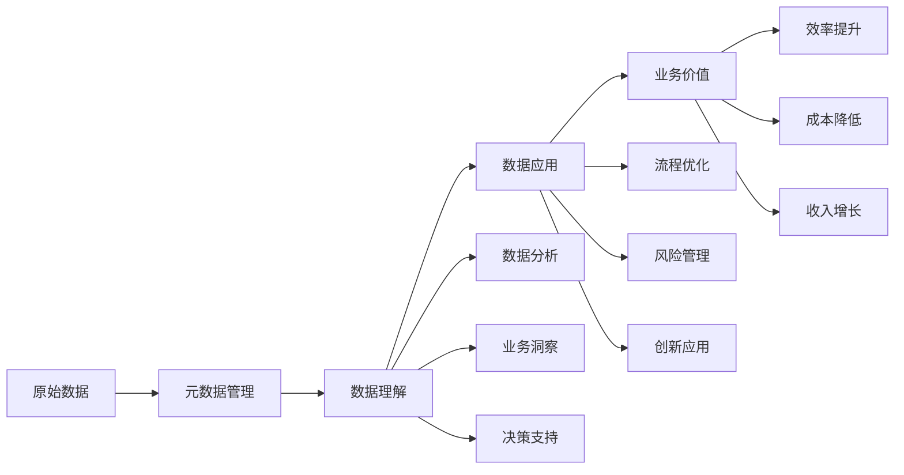

# 第6章：元数据应用场景

## 6.1 元数据应用概述

元数据不仅仅是一种技术概念，更是实现数据价值的关键支撑。通过有效的元数据应用，组织可以在多个业务领域获得显著价值，包括数据分析、决策支持、合规管理、业务流程优化等。

### 6.1.1 元数据应用价值模型



### 6.1.2 元数据应用分类

| 应用领域 | 主要价值 | 典型场景 |
|----------|----------|----------|
| 数据发现与探索 | 快速找到相关数据 | 业务自助分析、数据科学研究 |
| 数据质量提升 | 确保数据可靠性 | 报表准确性、客户数据管理 |
| 数据治理 | 遵守规范与标准 | 合规报告、数据安全 |
| 业务流程优化 | 提高业务效率 | 客户旅程分析、供应链优化 |
| 决策支持 | 提供决策依据 | 战略规划、运营决策 |
| 创新应用 | 创造新的数据产品 | 推荐系统、预测分析 |

## 6.2 数据发现与探索

### 6.2.1 数据目录与搜索

数据目录是元数据最直观的应用，它允许用户发现、理解和组织数据资产。一个有效的数据目录应该包含以下关键功能：

1. **数据资产浏览**：按业务域、数据类型、使用频率等方式浏览数据
2. **智能搜索**：支持关键词、业务术语、数据属性等多维度搜索
3. **数据血缘**：展示数据的来源、转换过程和最终去向
4. **用户评价**：允许用户对数据质量、可用性进行评价
5. **使用统计**：显示数据访问频率、使用趋势等指标

```python
class DataCatalog:
    """
    数据目录实现
    支持数据发现、搜索和理解
    """
    
    def __init__(self):
        self.data_assets = {}  # 数据资产存储
        self.search_index = {}  # 搜索索引
        self.user_ratings = {}  # 用户评价
        self.usage_stats = {}  # 使用统计
        self.tags = {}  # 标签系统
    
    def register_data_asset(self, asset_id, metadata):
        """注册数据资产"""
        # 存储元数据
        self.data_assets[asset_id] = {
            "id": asset_id,
            "name": metadata.get("name"),
            "description": metadata.get("description"),
            "domain": metadata.get("domain"),
            "owner": metadata.get("owner"),
            "created_at": datetime.now(),
            "schema": metadata.get("schema", {}),
            "sample_data": metadata.get("sample_data", []),
            "tags": metadata.get("tags", []),
            "quality_score": metadata.get("quality_score", 0.0)
        }
        
        # 构建搜索索引
        self._build_search_index(asset_id)
        
        # 初始化使用统计
        self.usage_stats[asset_id] = {
            "views": 0,
            "downloads": 0,
            "last_accessed": None
        }
        
        return True
    
    def _build_search_index(self, asset_id):
        """构建搜索索引"""
        asset = self.data_assets[asset_id]
        
        # 提取可搜索的术语
        searchable_terms = [
            asset["name"].lower(),
            asset["description"].lower(),
            asset["domain"].lower()
        ]
        
        # 添加标签
        for tag in asset["tags"]:
            searchable_terms.append(tag.lower())
        
        # 添加字段名（从schema中提取）
        for field_name, field_info in asset["schema"].items():
            searchable_terms.append(field_name.lower())
            if "description" in field_info:
                searchable_terms.append(field_info["description"].lower())
        
        # 构建倒排索引
        for term in searchable_terms:
            if term not in self.search_index:
                self.search_index[term] = []
            if asset_id not in self.search_index[term]:
                self.search_index[term].append(asset_id)
    
    def search(self, query, filters=None, sort_by="relevance"):
        """搜索数据资产"""
        query_terms = query.lower().split()
        matching_assets = {}
        
        # 找到包含所有查询词的资产
        for term in query_terms:
            if term in self.search_index:
                for asset_id in self.search_index[term]:
                    if asset_id in matching_assets:
                        matching_assets[asset_id] += 1
                    else:
                        matching_assets[asset_id] = 1
        
        # 应用过滤条件
        if filters:
            filtered_assets = {}
            for asset_id, score in matching_assets.items():
                asset = self.data_assets[asset_id]
                match = True
                
                # 域过滤
                if "domain" in filters and asset["domain"] != filters["domain"]:
                    match = False
                
                # 所有者过滤
                if "owner" in filters and asset["owner"] != filters["owner"]:
                    match = False
                
                # 标签过滤
                if "tags" in filters:
                    required_tags = set(filters["tags"])
                    asset_tags = set(asset["tags"])
                    if not required_tags.issubset(asset_tags):
                        match = False
                
                # 质量分数过滤
                if "min_quality" in filters and asset["quality_score"] < filters["min_quality"]:
                    match = False
                
                if match:
                    filtered_assets[asset_id] = score
            
            matching_assets = filtered_assets
        
        # 排序
        if sort_by == "relevance":
            sorted_assets = sorted(
                matching_assets.items(), 
                key=lambda x: x[1], 
                reverse=True
            )
        elif sort_by == "quality":
            sorted_assets = sorted(
                matching_assets.items(),
                key=lambda x: self.data_assets[x[0]]["quality_score"],
                reverse=True
            )
        elif sort_by == "usage":
            sorted_assets = sorted(
                matching_assets.items(),
                key=lambda x: self.usage_stats[x[0]]["views"],
                reverse=True
            )
        elif sort_by == "recent":
            sorted_assets = sorted(
                matching_assets.items(),
                key=lambda x: self.data_assets[x[0]]["created_at"],
                reverse=True
            )
        else:
            sorted_assets = list(matching_assets.items())
        
        # 返回结果
        results = []
        for asset_id, score in sorted_assets:
            asset = self.data_assets[asset_id]
            results.append({
                "id": asset_id,
                "name": asset["name"],
                "description": asset["description"],
                "domain": asset["domain"],
                "owner": asset["owner"],
                "quality_score": asset["quality_score"],
                "relevance_score": score,
                "tags": asset["tags"]
            })
        
        return results
    
    def get_data_asset(self, asset_id):
        """获取数据资产详情"""
        if asset_id not in self.data_assets:
            return None
        
        # 更新访问统计
        self.usage_stats[asset_id]["views"] += 1
        self.usage_stats[asset_id]["last_accessed"] = datetime.now()
        
        # 获取用户评价
        ratings = self.user_ratings.get(asset_id, [])
        avg_rating = sum(r["rating"] for r in ratings) / len(ratings) if ratings else 0
        
        # 返回详细信息
        asset = self.data_assets[asset_id].copy()
        asset["usage_stats"] = self.usage_stats[asset_id]
        asset["average_rating"] = avg_rating
        asset["rating_count"] = len(ratings)
        
        return asset
    
    def rate_data_asset(self, asset_id, user_id, rating, comment=""):
        """评价数据资产"""
        if asset_id not in self.data_assets:
            return False
        
        if asset_id not in self.user_ratings:
            self.user_ratings[asset_id] = []
        
        # 检查用户是否已经评价过
        user_rating = None
        for i, r in enumerate(self.user_ratings[asset_id]):
            if r["user_id"] == user_id:
                user_rating = i
                break
        
        if user_rating is not None:
            # 更新现有评价
            self.user_ratings[asset_id][user_rating] = {
                "user_id": user_id,
                "rating": rating,
                "comment": comment,
                "rated_at": datetime.now()
            }
        else:
            # 添加新评价
            self.user_ratings[asset_id].append({
                "user_id": user_id,
                "rating": rating,
                "comment": comment,
                "rated_at": datetime.now()
            })
        
        # 更新资产质量分数（简单实现：使用平均评价）
        all_ratings = self.user_ratings[asset_id]
        new_quality = sum(r["rating"] for r in all_ratings) / len(all_ratings)
        self.data_assets[asset_id]["quality_score"] = new_quality
        
        return True
    
    def get_popular_assets(self, limit=10, period_days=30):
        """获取热门数据资产"""
        cutoff_date = datetime.now() - timedelta(days=period_days)
        
        popular_assets = []
        for asset_id, stats in self.usage_stats.items():
            if stats["last_accessed"] and stats["last_accessed"] > cutoff_date:
                asset = self.data_assets[asset_id]
                popular_assets.append({
                    "id": asset_id,
                    "name": asset["name"],
                    "views": stats["views"],
                    "downloads": stats["downloads"],
                    "domain": asset["domain"],
                    "quality_score": asset["quality_score"]
                })
        
        # 按访问量排序
        popular_assets.sort(key=lambda x: x["views"], reverse=True)
        
        return popular_assets[:limit]
    
    def get_related_assets(self, asset_id, limit=5):
        """获取相关数据资产"""
        if asset_id not in self.data_assets:
            return []
        
        # 基于标签和域找相关资产
        target_asset = self.data_assets[asset_id]
        target_tags = set(target_asset["tags"])
        target_domain = target_asset["domain"]
        
        related_assets = []
        for other_id, other_asset in self.data_assets.items():
            if other_id == asset_id:
                continue
            
            # 计算相关性分数
            score = 0
            
            # 相同域加分
            if other_asset["domain"] == target_domain:
                score += 2
            
            # 共同标签加分
            other_tags = set(other_asset["tags"])
            common_tags = target_tags.intersection(other_tags)
            score += len(common_tags) * 3
            
            if score > 0:
                related_assets.append({
                    "id": other_id,
                    "name": other_asset["name"],
                    "description": other_asset["description"],
                    "relevance_score": score,
                    "shared_tags": list(common_tags)
                })
        
        # 按相关性分数排序
        related_assets.sort(key=lambda x: x["relevance_score"], reverse=True)
        
        return related_assets[:limit]

# 使用示例
catalog = DataCatalog()

# 注册一些数据资产
catalog.register_data_asset("customer_data", {
    "name": "客户基本信息",
    "description": "包含客户的基本个人信息、联系方式和会员状态",
    "domain": "销售",
    "owner": "销售部门",
    "tags": ["客户", "个人信息", "CRM"],
    "schema": {
        "customer_id": {"type": "string", "description": "客户唯一标识"},
        "name": {"type": "string", "description": "客户姓名"},
        "email": {"type": "string", "description": "电子邮箱"},
        "phone": {"type": "string", "description": "联系电话"},
        "membership_level": {"type": "string", "description": "会员等级"}
    }
})

catalog.register_data_asset("order_data", {
    "name": "订单交易数据",
    "description": "记录客户的所有订单交易信息",
    "domain": "销售",
    "owner": "销售部门",
    "tags": ["订单", "交易", "客户"],
    "schema": {
        "order_id": {"type": "string", "description": "订单唯一标识"},
        "customer_id": {"type": "string", "description": "客户唯一标识"},
        "order_date": {"type": "date", "description": "订单日期"},
        "amount": {"type": "decimal", "description": "订单金额"},
        "status": {"type": "string", "description": "订单状态"}
    }
})

# 搜索数据资产
results = catalog.search("客户信息", sort_by="relevance")
print("搜索结果:")
for result in results:
    print(f"- {result['name']}: {result['description']} (相关性: {result['relevance_score']})")

# 获取资产详情
asset = catalog.get_data_asset("customer_data")
if asset:
    print(f"\n数据资产详情:")
    print(f"名称: {asset['name']}")
    print(f"描述: {asset['description']}")
    print(f"域: {asset['domain']}")
    print(f"所有者: {asset['owner']}")
    print(f"质量分数: {asset['quality_score']:.2f}")
    print(f"访问次数: {asset['usage_stats']['views']}")

# 添加评价
catalog.rate_data_asset("customer_data", "user1", 4.5, "数据很完整，但缺少历史记录")
catalog.rate_data_asset("customer_data", "user2", 5.0, "非常有用的客户数据")

# 获取热门资产
popular = catalog.get_popular_assets(limit=5)
print("\n热门数据资产:")
for asset in popular:
    print(f"- {asset['name']}: {asset['views']} 次访问")

# 获取相关资产
related = catalog.get_related_assets("customer_data")
print("\n相关数据资产:")
for asset in related:
    print(f"- {asset['name']}: 相关性分数 {asset['relevance_score']}")
```

### 6.2.2 数据血缘分析

数据血缘是指数据从源头到最终消费的全过程中所经历的转换、移动和处理路径。通过数据血缘分析，用户可以：

1. **理解数据来源**：了解数据的原始来源和可信度
2. **追踪影响范围**：当上游数据发生变化时，评估对下游的影响
3. **排查问题**：快速定位数据质量问题的根源
4. **合规验证**：验证数据处理是否符合法规要求

```python
class DataLineageTracker:
    """
    数据血缘追踪器
    跟踪数据从源头到最终消费者的完整路径
    """
    
    def __init__(self):
        self.nodes = {}  # 数据节点
        self.edges = []  # 数据流（边）
    
    def add_data_node(self, node_id, node_type, metadata=None):
        """添加数据节点"""
        if node_id not in self.nodes:
            self.nodes[node_id] = {
                "id": node_id,
                "type": node_type,  # source, transform, storage, consumption
                "metadata": metadata or {},
                "incoming_edges": [],  # 输入边
                "outgoing_edges": []   # 输出边
            }
        return self.nodes[node_id]
    
    def add_data_flow(self, source_id, target_id, flow_type, metadata=None):
        """添加数据流"""
        if source_id not in self.nodes or target_id not in self.nodes:
            raise ValueError("源或目标节点不存在")
        
        edge_id = f"{source_id}_{target_id}"
        
        # 检查是否已存在相同的流
        for edge in self.edges:
            if edge["source"] == source_id and edge["target"] == target_id:
                # 更新现有流
                edge.update({
                    "type": flow_type,
                    "metadata": metadata or {}
                })
                return edge
        
        # 创建新流
        edge = {
            "id": edge_id,
            "source": source_id,
            "target": target_id,
            "type": flow_type,  # etl, copy, transform, aggregate
            "metadata": metadata or {}
        }
        
        self.edges.append(edge)
        
        # 更新节点的边信息
        self.nodes[source_id]["outgoing_edges"].append(edge_id)
        self.nodes[target_id]["incoming_edges"].append(edge_id)
        
        return edge
    
    def get_upstream_nodes(self, node_id, max_depth=None):
        """获取上游节点"""
        if node_id not in self.nodes:
            return []
        
        visited = set()
        result = []
        
        def _dfs(current_id, depth):
            if max_depth is not None and depth >= max_depth:
                return
            
            if current_id in visited:
                return
            
            visited.add(current_id)
            
            for edge_id in self.nodes[current_id]["incoming_edges"]:
                edge = next(e for e in self.edges if e["id"] == edge_id)
                upstream_id = edge["source"]
                
                if upstream_id not in visited:
                    result.append({
                        "node_id": upstream_id,
                        "node": self.nodes[upstream_id],
                        "edge": edge,
                        "depth": depth
                    })
                    
                    _dfs(upstream_id, depth + 1)
        
        _dfs(node_id, 0)
        return result
    
    def get_downstream_nodes(self, node_id, max_depth=None):
        """获取下游节点"""
        if node_id not in self.nodes:
            return []
        
        visited = set()
        result = []
        
        def _dfs(current_id, depth):
            if max_depth is not None and depth >= max_depth:
                return
            
            if current_id in visited:
                return
            
            visited.add(current_id)
            
            for edge_id in self.nodes[current_id]["outgoing_edges"]:
                edge = next(e for e in self.edges if e["id"] == edge_id)
                downstream_id = edge["target"]
                
                if downstream_id not in visited:
                    result.append({
                        "node_id": downstream_id,
                        "node": self.nodes[downstream_id],
                        "edge": edge,
                        "depth": depth
                    })
                    
                    _dfs(downstream_id, depth + 1)
        
        _dfs(node_id, 0)
        return result
    
    def get_lineage_graph(self, node_id, max_depth=2):
        """获取以指定节点为中心的血缘图"""
        if node_id not in self.nodes:
            return None
        
        # 获取上游和下游节点
        upstream = self.get_upstream_nodes(node_id, max_depth)
        downstream = self.get_downstream_nodes(node_id, max_depth)
        
        # 构建图节点列表
        nodes = {node_id: self.nodes[node_id]}
        
        for item in upstream:
            nodes[item["node_id"]] = item["node"]
        
        for item in downstream:
            nodes[item["node_id"]] = item["node"]
        
        # 构建图边列表
        edges = []
        
        # 从当前节点出发的边
        for edge_id in self.nodes[node_id]["outgoing_edges"]:
            edge = next(e for e in self.edges if e["id"] == edge_id)
            if edge["target"] in nodes:
                edges.append(edge)
        
        # 指向当前节点的边
        for edge_id in self.nodes[node_id]["incoming_edges"]:
            edge = next(e for e in self.edges if e["id"] == edge_id)
            if edge["source"] in nodes:
                edges.append(edge)
        
        # 上游节点之间的边
        for item in upstream:
            for edge_id in self.nodes[item["node_id"]]["incoming_edges"]:
                edge = next(e for e in self.edges if e["id"] == edge_id)
                if edge["source"] in nodes and edge["target"] in nodes:
                    edges.append(edge)
        
        # 下游节点之间的边
        for item in downstream:
            for edge_id in self.nodes[item["node_id"]]["outgoing_edges"]:
                edge = next(e for e in self.edges if e["id"] == edge_id)
                if edge["source"] in nodes and edge["target"] in nodes:
                    edges.append(edge)
        
        return {
            "center_node": node_id,
            "nodes": nodes,
            "edges": edges
        }
    
    def analyze_impact(self, node_id, change_type):
        """分析节点变更的影响"""
        if node_id not in self.nodes:
            return None
        
        # 获取下游节点
        downstream = self.get_downstream_nodes(node_id)
        
        # 分析不同类型的变更影响
        impact_analysis = {
            "change_type": change_type,
            "affected_nodes": [],
            "critical_paths": [],
            "recommendations": []
        }
        
        # 根据变更类型分析影响
        if change_type == "schema_change":
            # 模式变更可能影响所有下游处理
            for item in downstream:
                impact_analysis["affected_nodes"].append({
                    "node_id": item["node_id"],
                    "impact_level": "high",
                    "reason": "下游处理可能无法适应新的数据模式"
                })
            
            impact_analysis["recommendations"] = [
                "通知所有下游处理团队",
                "考虑使用向后兼容的变更",
                "提供数据适配层"
            ]
            
        elif change_type == "quality_degradation":
            # 质量下降可能影响依赖该数据的分析和决策
            for item in downstream:
                node_type = item["node"]["type"]
                if node_type == "consumption":
                    impact_analysis["affected_nodes"].append({
                        "node_id": item["node_id"],
                        "impact_level": "critical",
                        "reason": "直接影响业务决策和报告准确性"
                    })
                elif node_type == "transform":
                    impact_analysis["affected_nodes"].append({
                        "node_id": item["node_id"],
                        "impact_level": "high",
                        "reason": "可能导致转换结果不准确"
                    })
            
            impact_analysis["recommendations"] = [
                "立即通知数据消费者",
                "标记受影响的数据产品",
                "尽快修复质量问题"
            ]
        
        elif change_type == "availability_change":
            # 可用性变更（如下线）影响所有下游
            for item in downstream:
                impact_analysis["affected_nodes"].append({
                    "node_id": item["node_id"],
                    "impact_level": "critical",
                    "reason": "下游处理将无法获取数据"
                })
            
            impact_analysis["recommendations"] = [
                "提供替代数据源",
                "制定数据迁移计划",
                "预留充分的过渡期"
            ]
        
        return impact_analysis
    
    def get_data_origin(self, node_id):
        """获取数据源头"""
        if node_id not in self.nodes:
            return []
        
        # 找到所有最上游的源节点
        origins = []
        
        def _find_sources(current_id, path):
            node = self.nodes[current_id]
            
            # 如果是源节点（没有输入）或者是循环，添加到结果
            if not node["incoming_edges"] or current_id in path:
                origins.append({
                    "source_id": current_id,
                    "path": path + [current_id],
                    "source_node": node
                })
                return
            
            # 继续向上查找
            for edge_id in node["incoming_edges"]:
                edge = next(e for e in self.edges if e["id"] == edge_id)
                upstream_id = edge["source"]
                _find_sources(upstream_id, path + [current_id])
        
        _find_sources(node_id, [])
        return origins

# 使用示例
lineage = DataLineageTracker()

# 添加数据节点
source1 = lineage.add_data_node("raw_customer", "source", {"system": "CRM", "format": "JSON"})
source2 = lineage.add_data_node("raw_transaction", "source", {"system": "POS", "format": "CSV"})

transform1 = lineage.add_data_node("clean_customer", "transform", {"process": "数据清洗"})
transform2 = lineage.add_data_node("enriched_transaction", "transform", {"process": "数据增强"})

storage1 = lineage.add_data_node("customer_dw", "storage", {"system": "数据仓库", "table": "dim_customer"})
storage2 = lineage.add_data_node("transaction_dw", "storage", {"system": "数据仓库", "table": "fact_transaction"})

agg1 = lineage.add_data_node("customer_metrics", "transform", {"process": "聚合计算"})

consumption1 = lineage.add_data_node("customer_report", "consumption", {"type": "报表"})
consumption2 = lineage.add_data_node("recommendation_model", "consumption", {"type": "ML模型"})

# 添加数据流
lineage.add_data_flow("raw_customer", "clean_customer", "etl", {"frequency": "每日"})
lineage.add_data_flow("clean_customer", "customer_dw", "load", {"frequency": "每日"})
lineage.add_data_flow("raw_transaction", "enriched_transaction", "etl", {"frequency": "实时"})
lineage.add_data_flow("enriched_transaction", "transaction_dw", "load", {"frequency": "实时"})
lineage.add_data_flow("customer_dw", "customer_metrics", "transform", {"frequency": "每日"})
lineage.add_data_flow("customer_dw", "customer_report", "consume", {"frequency": "按需"})
lineage.add_data_flow("customer_metrics", "customer_report", "consume", {"frequency": "按需"})
lineage.add_data_flow("customer_metrics", "recommendation_model", "consume", {"frequency": "每周"})

# 获取血缘图
graph = lineage.get_lineage_graph("customer_metrics", max_depth=2)
print(f"中心节点: {graph['center_node']}")
print(f"节点数量: {len(graph['nodes'])}")
print(f"边数量: {len(graph['edges'])}")

# 分析影响
impact = lineage.analyze_impact("clean_customer", "schema_change")
print(f"\n影响分析 - 变更类型: {impact['change_type']}")
print(f"受影响节点数: {len(impact['affected_nodes'])}")
print(f"建议:")
for rec in impact['recommendations']:
    print(f"- {rec}")

# 获取数据源头
origins = lineage.get_data_origin("customer_report")
print(f"\n数据源头:")
for origin in origins:
    path = " -> ".join(origin["path"])
    source_type = origin["source_node"]["type"]
    print(f"- 路径: {path}")
    print(f"  源头类型: {source_type}")
```

## 6.3 数据质量应用

### 6.3.1 数据质量评估

元数据可以用于全面的数据质量评估，通过定义质量规则、监控质量指标和生成质量报告，帮助组织识别和解决数据质量问题。

```python
class DataQualityManager:
    """
    数据质量管理器
    使用元数据进行数据质量评估和监控
    """
    
    def __init__(self):
        self.quality_rules = {}  # 质量规则定义
        self.quality_metrics = {}  # 质量指标历史
        self.metadata_registry = {}  # 元数据注册表
    
    def register_data_asset(self, asset_id, metadata):
        """注册数据资产元数据"""
        self.metadata_registry[asset_id] = {
            "id": asset_id,
            "name": metadata.get("name"),
            "schema": metadata.get("schema", {}),
            "business_rules": metadata.get("business_rules", []),
            "sla": metadata.get("sla", {}),
            "updated_at": datetime.now()
        }
    
    def define_quality_rule(self, rule_id, rule_definition):
        """定义质量规则"""
        self.quality_rules[rule_id] = {
            "id": rule_id,
            "name": rule_definition.get("name"),
            "description": rule_definition.get("description"),
            "dimension": rule_definition.get("dimension"),  # completeness, accuracy, consistency, etc.
            "type": rule_definition.get("type"),  # validation, profiling, comparison
            "condition": rule_definition.get("condition"),  # 规则条件
            "threshold": rule_definition.get("threshold"),  # 质量阈值
            "severity": rule_definition.get("severity", "medium")  # high, medium, low
        }
    
    def assign_rule_to_asset(self, asset_id, rule_id, params=None):
        """为数据资产分配质量规则"""
        if asset_id not in self.metadata_registry:
            raise ValueError(f"数据资产 {asset_id} 不存在")
        
        if rule_id not in self.quality_rules:
            raise ValueError(f"质量规则 {rule_id} 不存在")
        
        # 初始化资产的质量规则列表
        if "quality_rules" not in self.metadata_registry[asset_id]:
            self.metadata_registry[asset_id]["quality_rules"] = {}
        
        self.metadata_registry[asset_id]["quality_rules"][rule_id] = params or {}
    
    def evaluate_quality(self, asset_id, data_sample=None):
        """评估数据质量"""
        if asset_id not in self.metadata_registry:
            raise ValueError(f"数据资产 {asset_id} 不存在")
        
        asset = self.metadata_registry[asset_id]
        asset_rules = asset.get("quality_rules", {})
        
        # 初始化质量评估结果
        quality_result = {
            "asset_id": asset_id,
            "asset_name": asset["name"],
            "evaluation_time": datetime.now(),
            "overall_score": 0,
            "dimension_scores": {},
            "rule_results": {},
            "issues": [],
            "recommendations": []
        }
        
        dimension_scores = {}
        rule_results = {}
        all_issues = []
        
        # 执行每个质量规则
        for rule_id in asset_rules:
            rule = self.quality_rules[rule_id]
            rule_params = asset_rules[rule_id]
            result = self._execute_quality_rule(asset_id, rule, rule_params, data_sample)
            
            rule_results[rule_id] = result
            
            # 收集维度分数
            dimension = rule["dimension"]
            if dimension not in dimension_scores:
                dimension_scores[dimension] = []
            dimension_scores[dimension].append(result["score"])
            
            # 收集问题
            if result["issues"]:
                all_issues.extend(result["issues"])
        
        # 计算维度平均分数
        for dimension, scores in dimension_scores.items():
            dimension_avg = sum(scores) / len(scores) if scores else 0
            quality_result["dimension_scores"][dimension] = dimension_avg
        
        # 计算总体分数
        if dimension_scores:
            overall_score = sum(dimension_scores.values()) / len(dimension_scores)
            quality_result["overall_score"] = overall_score
        
        quality_result["rule_results"] = rule_results
        quality_result["issues"] = all_issues
        
        # 生成建议
        quality_result["recommendations"] = self._generate_recommendations(quality_result)
        
        # 保存质量评估结果
        if asset_id not in self.quality_metrics:
            self.quality_metrics[asset_id] = []
        
        self.quality_metrics[asset_id].append(quality_result)
        
        return quality_result
    
    def _execute_quality_rule(self, asset_id, rule, rule_params, data_sample):
        """执行单个质量规则"""
        # 这里简化实现，实际应用中应该根据规则类型执行具体检查
        rule_type = rule["type"]
        threshold = rule.get("threshold", 0.9)
        
        result = {
            "rule_id": rule["id"],
            "rule_name": rule["name"],
            "score": 0,  # 0-1之间的分数
            "status": "pass",  # pass, warning, fail
            "issues": [],
            "details": {}
        }
        
        if rule_type == "validation":
            # 验证规则：检查数据是否符合特定条件
            validation_result = self._execute_validation_rule(asset_id, rule, data_sample)
            result.update(validation_result)
        
        elif rule_type == "profiling":
            # 分析规则：分析数据分布、模式等
            profiling_result = self._execute_profiling_rule(asset_id, rule, data_sample)
            result.update(profiling_result)
        
        elif rule_type == "comparison":
            # 比较规则：与其他数据源比较
            comparison_result = self._execute_comparison_rule(asset_id, rule, rule_params)
            result.update(comparison_result)
        
        # 根据分数确定状态
        score = result["score"]
        if score >= threshold:
            result["status"] = "pass"
        elif score >= threshold * 0.8:
            result["status"] = "warning"
        else:
            result["status"] = "fail"
        
        return result
    
    def _execute_validation_rule(self, asset_id, rule, data_sample):
        """执行验证规则"""
        # 简化实现
        condition = rule["condition"]
        
        # 模拟执行验证
        # 在实际应用中，这里应该根据条件执行具体的数据验证逻辑
        
        # 模拟结果
        score = 0.85  # 85%通过率
        issues = []
        
        if score < 1.0:
            issues.append({
                "type": "validation_error",
                "description": f"不符合条件: {condition}",
                "affected_records": 15,
                "severity": rule["severity"]
            })
        
        return {
            "score": score,
            "issues": issues,
            "details": {
                "condition": condition,
                "checked_records": 100,
                "failed_records": 15
            }
        }
    
    def _execute_profiling_rule(self, asset_id, rule, data_sample):
        """执行分析规则"""
        # 简化实现
        # 在实际应用中，这里应该执行数据分析和统计
        
        # 模拟结果
        score = 0.92  # 92%质量分数
        issues = []
        
        if score < 1.0:
            issues.append({
                "type": "profiling_issue",
                "description": "数据分布异常",
                "severity": rule["severity"]
            })
        
        return {
            "score": score,
            "issues": issues,
            "details": {
                "null_percentage": 3.2,
                "duplicate_percentage": 1.8,
                "format_consistency": 95.0
            }
        }
    
    def _execute_comparison_rule(self, asset_id, rule, rule_params):
        """执行比较规则"""
        # 简化实现
        # 在实际应用中，这里应该与其他数据源进行比较
        
        # 模拟结果
        score = 0.78  # 78%一致性
        issues = []
        
        if score < 0.8:
            issues.append({
                "type": "consistency_issue",
                "description": "与其他数据源不一致",
                "severity": rule["severity"]
            })
        
        return {
            "score": score,
            "issues": issues,
            "details": {
                "compared_with": rule_params.get("reference_asset"),
                "consistency_rate": score * 100,
                "differences_found": 23
            }
        }
    
    def _generate_recommendations(self, quality_result):
        """基于质量评估结果生成改进建议"""
        recommendations = []
        overall_score = quality_result["overall_score"]
        dimension_scores = quality_result["dimension_scores"]
        
        # 基于总体分数生成建议
        if overall_score < 0.6:
            recommendations.append({
                "priority": "high",
                "description": "数据质量严重低于标准，建议立即进行数据清洗和修复"
            })
        elif overall_score < 0.8:
            recommendations.append({
                "priority": "medium",
                "description": "数据质量有改进空间，建议制定并执行质量改进计划"
            })
        
        # 基于维度分数生成建议
        for dimension, score in dimension_scores.items():
            if score < 0.7:
                if dimension == "completeness":
                    recommendations.append({
                        "priority": "medium",
                        "description": "数据完整性不足，建议完善数据采集流程，填补缺失值"
                    })
                elif dimension == "accuracy":
                    recommendations.append({
                        "priority": "high",
                        "description": "数据准确性低，建议加强数据验证和清洗流程"
                    })
                elif dimension == "consistency":
                    recommendations.append({
                        "priority": "medium",
                        "description": "数据一致性不足，建议统一数据标准和格式"
                    })
                elif dimension == "timeliness":
                    recommendations.append({
                        "priority": "medium",
                        "description": "数据时效性不足，建议优化数据更新频率和流程"
                    })
        
        return recommendations
    
    def get_quality_trend(self, asset_id, days=30):
        """获取质量趋势"""
        if asset_id not in self.quality_metrics:
            return None
        
        cutoff_date = datetime.now() - timedelta(days=days)
        recent_metrics = [
            m for m in self.quality_metrics[asset_id]
            if m["evaluation_time"] > cutoff_date
        ]
        
        if not recent_metrics:
            return None
        
        # 按时间排序
        recent_metrics.sort(key=lambda x: x["evaluation_time"])
        
        # 计算趋势
        if len(recent_metrics) < 2:
            return {
                "trend": "stable",
                "change_percentage": 0,
                "data_points": len(recent_metrics)
            }
        
        first_score = recent_metrics[0]["overall_score"]
        last_score = recent_metrics[-1]["overall_score"]
        change_percentage = ((last_score - first_score) / first_score) * 100 if first_score > 0 else 0
        
        # 确定趋势
        if abs(change_percentage) < 2:
            trend = "stable"
        elif change_percentage > 0:
            trend = "improving"
        else:
            trend = "declining"
        
        return {
            "trend": trend,
            "change_percentage": change_percentage,
            "data_points": len(recent_metrics),
            "time_range": {
                "start": recent_metrics[0]["evaluation_time"],
                "end": recent_metrics[-1]["evaluation_time"]
            }
        }

# 使用示例
quality_manager = DataQualityManager()

# 注册数据资产
quality_manager.register_data_asset("customer_data", {
    "name": "客户基本信息",
    "schema": {
        "customer_id": {"type": "string", "nullable": False},
        "name": {"type": "string", "nullable": False},
        "email": {"type": "string", "nullable": True},
        "phone": {"type": "string", "nullable": True}
    },
    "sla": {
        "completeness": 0.95,
        "accuracy": 0.98,
        "timeliness": "daily"
    }
})

# 定义质量规则
quality_manager.define_quality_rule("completeness_check", {
    "name": "完整性检查",
    "description": "检查关键字段是否完整",
    "dimension": "completeness",
    "type": "validation",
    "condition": "customer_id AND name IS NOT NULL",
    "threshold": 0.95,
    "severity": "high"
})

quality_manager.define_quality_rule("format_check", {
    "name": "格式检查",
    "description": "检查邮件格式是否正确",
    "dimension": "accuracy",
    "type": "profiling",
    "condition": "email matches regex",
    "threshold": 0.9,
    "severity": "medium"
})

# 为资产分配规则
quality_manager.assign_rule_to_asset("customer_data", "completeness_check")
quality_manager.assign_rule_to_asset("customer_data", "format_check")

# 评估质量
quality_result = quality_manager.evaluate_quality("customer_data")
print(f"数据质量评估结果:")
print(f"资产名称: {quality_result['asset_name']}")
print(f"总体分数: {quality_result['overall_score']:.2f}")
print(f"维度分数:")
for dimension, score in quality_result["dimension_scores"].items():
    print(f"  {dimension}: {score:.2f}")

print(f"\n发现的问题:")
for issue in quality_result["issues"]:
    print(f"- {issue['type']}: {issue['description']} (严重程度: {issue['severity']})")

print(f"\n改进建议:")
for rec in quality_result["recommendations"]:
    print(f"- {rec['priority']}: {rec['description']}")

# 获取质量趋势
trend = quality_manager.get_quality_trend("customer_data")
if trend:
    print(f"\n质量趋势:")
    print(f"- 趋势: {trend['trend']}")
    print(f"- 变化百分比: {trend['change_percentage']:.2f}%")
```

## 6.4 业务洞察与决策支持

### 6.4.1 业务指标监控

元数据可以帮助构建全面的业务指标监控体系，通过对指标定义、计算逻辑和业务含义的标准化管理，提供一致的决策支持。

```python
class BusinessMetricsManager:
    """
    业务指标管理器
    使用元数据管理业务指标的定义、计算和监控
    """
    
    def __init__(self):
        self.metrics_registry = {}  # 指标注册表
        self.metric_values = {}  # 指标值历史
        self.alert_rules = {}  # 告警规则
    
    def define_metric(self, metric_id, metric_definition):
        """定义业务指标"""
        self.metrics_registry[metric_id] = {
            "id": metric_id,
            "name": metric_definition.get("name"),
            "description": metric_definition.get("description"),
            "business_domain": metric_definition.get("business_domain"),
            "owner": metric_definition.get("owner"),
            "calculation": metric_definition.get("calculation"),  # 计算逻辑
            "data_sources": metric_definition.get("data_sources", []),  # 数据源
            "frequency": metric_definition.get("frequency", "daily"),  # 更新频率
            "unit": metric_definition.get("unit"),  # 单位
            "target": metric_definition.get("target"),  # 目标值
            "thresholds": metric_definition.get("thresholds", {}),  # 阈值
            "metadata": metric_definition.get("metadata", {}),
            "created_at": datetime.now()
        }
    
    def record_metric_value(self, metric_id, value, timestamp=None, context=None):
        """记录指标值"""
        if metric_id not in self.metrics_registry:
            raise ValueError(f"指标 {metric_id} 不存在")
        
        if timestamp is None:
            timestamp = datetime.now()
        
        # 记录指标值
        if metric_id not in self.metric_values:
            self.metric_values[metric_id] = []
        
        self.metric_values[metric_id].append({
            "value": value,
            "timestamp": timestamp,
            "context": context or {}
        })
    
    def get_metric_info(self, metric_id):
        """获取指标信息"""
        if metric_id not in self.metrics_registry:
            return None
        
        metric = self.metrics_registry[metric_id].copy()
        
        # 添加最近值
        recent_values = self.metric_values.get(metric_id, [])
        if recent_values:
            metric["latest_value"] = recent_values[-1]["value"]
            metric["latest_timestamp"] = recent_values[-1]["timestamp"]
        
        # 添加趋势分析
        if len(recent_values) >= 2:
            metric["trend"] = self._calculate_trend(metric_id, recent_values)
        
        return metric
    
    def _calculate_trend(self, metric_id, values, lookback=7):
        """计算指标趋势"""
        if len(values) < lookback + 1:
            return "insufficient_data"
        
        # 获取最近几个周期的值
        recent_period = values[-lookback:]
        previous_period = values[-(lookback*2):-lookback]
        
        # 计算平均值
        recent_avg = sum(v["value"] for v in recent_period) / len(recent_period)
        previous_avg = sum(v["value"] for v in previous_period) / len(previous_period)
        
        # 计算变化百分比
        if previous_avg != 0:
            change_pct = ((recent_avg - previous_avg) / abs(previous_avg)) * 100
        else:
            change_pct = 0
        
        # 确定趋势
        if abs(change_pct) < 2:
            return "stable"
        elif change_pct > 0:
            return "increasing"
        else:
            return "decreasing"
    
    def get_dashboard_metrics(self, domain=None, limit=20):
        """获取仪表板指标"""
        metrics = []
        
        for metric_id, metric_info in self.metrics_registry.items():
            # 过滤域
            if domain and metric_info.get("business_domain") != domain:
                continue
            
            # 获取指标信息（包括最新值和趋势）
            detailed_metric = self.get_metric_info(metric_id)
            if detailed_metric:
                metrics.append(detailed_metric)
        
        # 按最近更新时间排序
        metrics.sort(key=lambda x: x.get("latest_timestamp", datetime.min), reverse=True)
        
        return metrics[:limit]
    
    def analyze_metric_drivers(self, metric_id, start_date=None, end_date=None):
        """分析指标驱动因素"""
        if metric_id not in self.metrics_registry:
            return None
        
        metric = self.metrics_registry[metric_id]
        data_sources = metric.get("data_sources", [])
        
        # 简化实现：分析相关指标和外部因素
        # 在实际应用中，这里应该使用更复杂的分析技术
        
        # 获取指标值
        if metric_id not in self.metric_values:
            return None
        
        values = self.metric_values[metric_id]
        if not values:
            return None
        
        # 过滤时间范围
        if start_date:
            values = [v for v in values if v["timestamp"] >= start_date]
        if end_date:
            values = [v for v in values if v["timestamp"] <= end_date]
        
        if not values:
            return None
        
        # 分析结果
        analysis = {
            "metric_id": metric_id,
            "metric_name": metric["name"],
            "analysis_period": {
                "start": values[0]["timestamp"] if values else None,
                "end": values[-1]["timestamp"] if values else None
            },
            "key_drivers": [],
            "correlations": [],
            "recommendations": []
        }
        
        # 简化的驱动因素分析（实际应用中应该使用统计分析、机器学习等方法）
        latest_value = values[-1]["value"]
        previous_value = values[-2]["value"] if len(values) > 1 else None
        
        if previous_value is not None:
            change = latest_value - previous_value
            change_pct = (change / previous_value) * 100 if previous_value != 0 else 0
            
            # 模拟识别驱动因素
            if abs(change_pct) > 10:  # 显著变化
                if change_pct > 0:
                    analysis["key_drivers"].append({
                        "factor": "季节性增长",
                        "impact": "positive",
                        "confidence": 0.75
                    })
                else:
                    analysis["key_drivers"].append({
                        "factor": "市场下滑",
                        "impact": "negative",
                        "confidence": 0.65
                    })
            
            # 生成建议
            if change_pct < -5:
                analysis["recommendations"].append({
                    "priority": "high",
                    "action": "调查下降原因",
                    "description": "指标显著下降，需要深入分析相关因素"
                })
            elif change_pct > 10:
                analysis["recommendations"].append({
                    "priority": "medium",
                    "action": "分析增长机会",
                    "description": "指标显著增长，评估是否可以复制成功因素"
                })
        
        return analysis
    
    def define_alert_rule(self, rule_id, metric_id, conditions, actions):
        """定义告警规则"""
        if metric_id not in self.metrics_registry:
            raise ValueError(f"指标 {metric_id} 不存在")
        
        self.alert_rules[rule_id] = {
            "id": rule_id,
            "metric_id": metric_id,
            "conditions": conditions,  # 告警条件
            "actions": actions,        # 告警动作
            "enabled": True,
            "last_triggered": None,
            "trigger_count": 0
        }
    
    def check_alerts(self):
        """检查告警条件"""
        triggered_alerts = []
        
        for rule_id, rule in self.alert_rules.items():
            if not rule["enabled"]:
                continue
            
            metric_id = rule["metric_id"]
            
            # 获取最新指标值
            if metric_id not in self.metric_values or not self.metric_values[metric_id]:
                continue
            
            latest_value = self.metric_values[metric_id][-1]["value"]
            conditions = rule["conditions"]
            
            # 检查条件
            triggered = False
            
            if conditions["type"] == "threshold":
                threshold = conditions["threshold"]
                operator = conditions.get("operator", ">")
                
                if operator == ">" and latest_value > threshold:
                    triggered = True
                elif operator == "<" and latest_value < threshold:
                    triggered = True
                elif operator == "=" and latest_value == threshold:
                    triggered = True
            
            elif conditions["type"] == "change":
                # 检查变化率
                if len(self.metric_values[metric_id]) >= 2:
                    prev_value = self.metric_values[metric_id][-2]["value"]
                    change_pct = ((latest_value - prev_value) / prev_value) * 100 if prev_value != 0 else 0
                    
                    operator = conditions.get("operator", ">")
                    threshold = conditions.get("threshold", 0)
                    
                    if operator == ">" and change_pct > threshold:
                        triggered = True
                    elif operator == "<" and change_pct < threshold:
                        triggered = True
            
            # 如果触发告警
            if triggered:
                rule["last_triggered"] = datetime.now()
                rule["trigger_count"] += 1
                
                alert = {
                    "rule_id": rule_id,
                    "metric_id": metric_id,
                    "metric_name": self.metrics_registry[metric_id]["name"],
                    "triggered_at": rule["last_triggered"],
                    "value": latest_value,
                    "actions": rule["actions"]
                }
                triggered_alerts.append(alert)
        
        return triggered_alerts

# 使用示例
metrics_manager = BusinessMetricsManager()

# 定义业务指标
metrics_manager.define_metric("revenue", {
    "name": "总收入",
    "description": "公司所有产品和服务产生的总收入",
    "business_domain": "财务",
    "owner": "财务部门",
    "unit": "万元",
    "target": 10000,
    "thresholds": {
        "warning": 8000,
        "critical": 6000
    }
})

metrics_manager.define_metric("customer_count", {
    "name": "客户数量",
    "description": "活跃客户总数",
    "business_domain": "销售",
    "owner": "销售部门",
    "unit": "个",
    "target": 50000,
    "thresholds": {
        "warning": 40000,
        "critical": 30000
    }
})

metrics_manager.define_metric("customer_satisfaction", {
    "name": "客户满意度",
    "description": "基于调查的客户满意度评分",
    "business_domain": "客户服务",
    "owner": "客户服务部门",
    "unit": "分",
    "target": 4.5,
    "thresholds": {
        "warning": 4.0,
        "critical": 3.5
    }
})

# 模拟记录指标值
import random
from datetime import datetime, timedelta

# 生成过去30天的模拟数据
base_date = datetime.now() - timedelta(days=30)
for i in range(30):
    date = base_date + timedelta(days=i)
    
    # 收入数据（有一定趋势和随机波动）
    revenue = 8000 + i * 50 + random.uniform(-500, 500)
    metrics_manager.record_metric_value("revenue", revenue, date)
    
    # 客户数量数据
    customer_count = 45000 + i * 200 + random.uniform(-1000, 1000)
    metrics_manager.record_metric_value("customer_count", customer_count, date)
    
    # 客户满意度数据（相对稳定）
    satisfaction = 4.2 + random.uniform(-0.3, 0.3)
    metrics_manager.record_metric_value("customer_satisfaction", satisfaction, date)

# 获取仪表板指标
dashboard_metrics = metrics_manager.get_dashboard_metrics()
print("仪表板指标:")
for metric in dashboard_metrics:
    print(f"- {metric['name']}: {metric.get('latest_value', 'N/A')} {metric.get('unit', '')}")
    print(f"  趋势: {metric.get('trend', 'N/A')}")
    print(f"  目标: {metric.get('target', 'N/A')} {metric.get('unit', '')}")

# 分析指标驱动因素
analysis = metrics_manager.analyze_metric_drivers("revenue")
if analysis:
    print(f"\n{analysis['metric_name']} 驱动因素分析:")
    print(f"分析周期: {analysis['analysis_period']['start'].strftime('%Y-%m-%d')} 至 {analysis['analysis_period']['end'].strftime('%Y-%m-%d')}")
    
    print("\n关键驱动因素:")
    for driver in analysis["key_drivers"]:
        print(f"- {driver['factor']}: {driver['impact']} (置信度: {driver['confidence']:.2f})")
    
    print("\n建议:")
    for rec in analysis["recommendations"]:
        print(f"- {rec['priority']}: {rec['action']}")
        print(f"  {rec['description']}")

# 定义告警规则
metrics_manager.define_alert_rule("revenue_warning", "revenue", {
    "type": "threshold",
    "operator": "<",
    "threshold": 7000
}, [
    {"type": "email", "recipient": "finance@company.com"},
    {"type": "dashboard_notification", "severity": "warning"}
])

# 检查告警
alerts = metrics_manager.check_alerts()
if alerts:
    print("\n触发告警:")
    for alert in alerts:
        print(f"- {alert['metric_name']}: {alert['value']} ({alert['triggered_at'].strftime('%Y-%m-%d %H:%M')})")
        for action in alert["actions"]:
            print(f"  动作: {action['type']} -> {action.get('recipient', action.get('severity'))}")
else:
    print("\n无告警触发")
```

## 6.5 本章总结

元数据在数据应用场景中发挥着至关重要的作用，本章介绍了几个主要应用领域：

1. **数据发现与探索**：
   - 数据目录使业务用户能够快速发现和理解数据资产
   - 数据血缘分析帮助用户理解数据来源和影响范围

2. **数据质量应用**：
   - 基于元数据的全面质量评估体系
   - 自动化的质量规则执行和问题识别
   - 趋势分析和改进建议

3. **业务洞察与决策支持**：
   - 标准化的业务指标定义和计算
   - 指标驱动因素分析和趋势预测
   - 智能告警和异常检测

通过这些应用场景，组织可以实现：
- 提高数据资产的可发现性和可理解性
- 增强数据质量和可信度
- 支持数据驱动的决策制定
- 促进数据文化和业务创新

在下一章中，我们将探讨元数据工具与平台，介绍支持这些应用场景的技术实现方案。