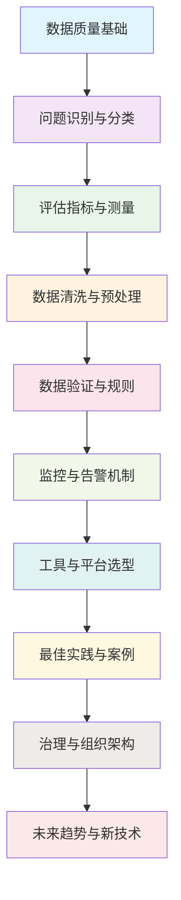
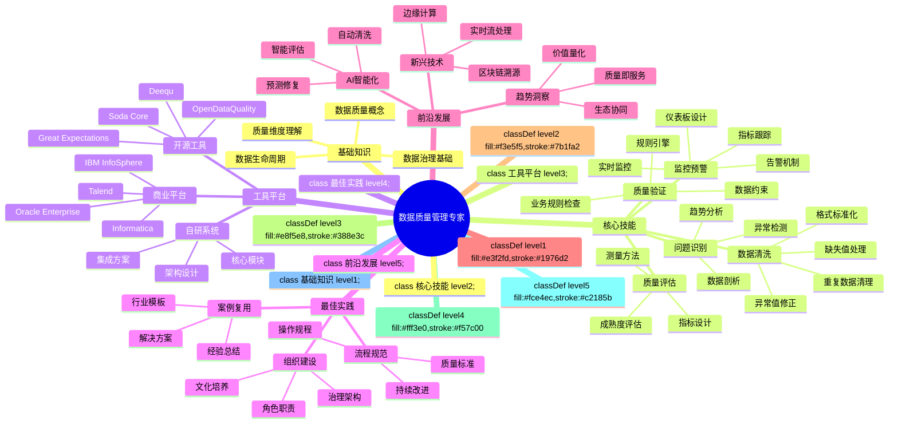

# 数据质量管理学习路径图与技能树

## 学习路径图

## 技能树

## 学习进度跟踪表

| 章节 | 主要内容 | 关键技能 | 预估学习时间 | 掌握程度 |
|------|---------|---------|------------|---------|
| 第1章 | 数据质量基础概念与重要性 | 理解数据质量价值和维度 | 2小时 | ⭐⭐⭐⭐⭐ |
| 第2章 | 数据质量问题识别与分类 | 识别各类数据质量问题 | 3小时 | ⭐⭐⭐⭐⭐ |
| 第3章 | 数据质量评估指标与测量方法 | 设计评估体系和计算方法 | 4小时 | ⭐⭐⭐⭐⭐ |
| 第4章 | 数据清洗与预处理技术 | 清洗各种类型的数据问题 | 5小时 | ⭐⭐⭐⭐⭐ |
| 第5章 | 数据验证与质量规则 | 建立数据验证规则体系 | 4小时 | ⭐⭐⭐⭐⭐ |
| 第6章 | 数据质量监控与告警机制 | 实施实时监控和预警 | 5小时 | ⭐⭐⭐⭐⭐ |
| 第7章 | 数据质量工具与平台选型 | 选择合适的工具和平台 | 3小时 | ⭐⭐⭐⭐⭐ |
| 第8章 | 数据质量最佳实践与案例研究 | 应用行业最佳实践 | 4小时 | ⭐⭐⭐⭐⭐ |
| 第9章 | 数据质量治理与组织架构 | 建立治理框架和组织体系 | 4小时 | ⭐⭐⭐⭐⭐ |
| 第10章 | 数据质量未来趋势与新技术 | 把握前沿技术和趋势 | 3小时 | ⭐⭐⭐⭐⭐ |

## 学习建议

1. **循序渐进**：按照章节顺序学习，打好基础后再进入高级主题
2. **动手实践**：每个章节都配有代码示例，务必亲自运行和修改
3. **案例分析**：结合实际工作中的数据问题，思考如何应用所学知识
4. **定期回顾**：每月回顾已学内容，巩固知识点
5. **交流分享**：加入数据质量相关的社群，与其他学习者交流心得