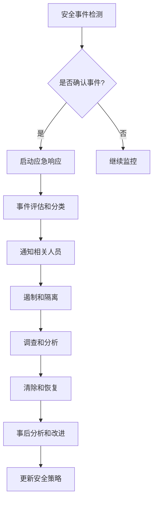

# Apache Airflow 安全加固指南

## 1. 概述

### 1.1 目的
本文档旨在为Apache Airflow生产环境提供全面的安全加固指南，确保系统在面对各种安全威胁时能够保持稳定、可靠和安全的运行。

### 1.2 适用范围
本指南适用于所有运行Apache Airflow的环境，包括开发、测试、预生产和生产环境。

### 1.3 安全原则
- **最小权限原则**: 用户和系统组件只应拥有完成其任务所需的最小权限
- **纵深防御**: 采用多层安全防护机制
- **安全默认配置**: 系统默认配置应优先考虑安全性
- **持续监控**: 实施持续的安全监控和告警机制
- **定期审计**: 定期进行安全审计和漏洞扫描

## 2. 身份认证和授权

### 2.1 身份认证配置
```yaml
# 身份认证配置示例
auth_config:
  # OAuth2配置
  oauth2:
    enabled: true
    provider: auth0
    domain: airflow.company.com
    client_id: airflow-client-id
    client_secret_secret: airflow/oauth2-client-secret
    
    # 用户映射
    user_mapping:
      - email_domain: company.com
        role: User
      - email: admin@company.com
        role: Admin
      - email: ops@company.com
        role: Op
        
  # LDAP配置
  ldap:
    enabled: true
    uri: ldaps://ldap.company.com:636
    bind_user: cn=airflow,ou=services,dc=company,dc=com
    bind_password_secret: airflow/ldap-bind-password
    
    # 用户搜索配置
    user_search:
      base: ou=people,dc=company,dc=com
      filter: (memberOf=cn=airflow-users,ou=groups,dc=company,dc=com)
      
    # 组搜索配置
    group_search:
      base: ou=groups,dc=company,dc=com
      filter: (member=cn={0},ou=people,dc=company,dc=com)
      
    # 角色映射
    role_mapping:
      admin: cn=airflow-admins,ou=groups,dc=company,dc=com
      user: cn=airflow-users,ou=groups,dc=company,dc=com
      viewer: cn=airflow-viewers,ou=groups,dc=company,dc=com
      
  # SAML配置
  saml:
    enabled: false
    metadata_url: https://sso.company.com/saml/metadata
    entity_id: airflow.company.com
    acs_url: https://airflow.company.com/complete/saml/
    
    # 属性映射
    attributes:
      username: email
      email: email
      firstname: givenName
      lastname: surname
      role: role
```

### 2.2 基于角色的访问控制(RBAC)
```python
# rbac_config.py
from airflow.models import DagBag
from airflow.security import permissions
from airflow.www.security import AirflowSecurityManager

class CustomSecurityManager(AirflowSecurityManager):
    def init_role(self, role_name, perms):
        """初始化角色权限"""
        role = self.find_role(role_name)
        if not role:
            role = self.add_role(role_name)
            
        role.permissions = perms
        self.update_role(role_name, role)
        
    def init_roles(self):
        """初始化所有角色"""
        # 管理员角色 - 拥有所有权限
        admin_perms = [
            permissions.ACTION_CAN_READ,
            permissions.ACTION_CAN_EDIT,
            permissions.ACTION_CAN_DELETE,
            permissions.RESOURCE_DAG,
            permissions.RESOURCE_TASK_INSTANCE,
            permissions.RESOURCE_USER,
            permissions.RESOURCE_CONNECTION,
            permissions.RESOURCE_VARIABLE,
            permissions.RESOURCE_POOL,
            permissions.RESOURCE_DAG_RUN,
            permissions.RESOURCE_IMPORT_ERROR,
            permissions.RESOURCE_JOB,
            permissions.RESOURCE_AUDIT_LOG,
            permissions.RESOURCE_TASK_RESCHEDULE,
            permissions.RESOURCE_TRIGGER,
            permissions.RESOURCE_XCOM,
        ]
        
        # 开发者角色 - 可以读写自己的DAG
        developer_perms = [
            permissions.ACTION_CAN_READ,
            permissions.ACTION_CAN_EDIT,
            permissions.RESOURCE_DAG,
            permissions.RESOURCE_TASK_INSTANCE,
            permissions.RESOURCE_DAG_RUN,
            permissions.RESOURCE_XCOM,
        ]
        
        # 运维角色 - 可以管理任务实例和连接
        ops_perms = [
            permissions.ACTION_CAN_READ,
            permissions.ACTION_CAN_EDIT,
            permissions.RESOURCE_TASK_INSTANCE,
            permissions.RESOURCE_CONNECTION,
            permissions.RESOURCE_VARIABLE,
            permissions.RESOURCE_POOL,
            permissions.RESOURCE_DAG_RUN,
            permissions.RESOURCE_JOB,
        ]
        
        # 查看者角色 - 只读权限
        viewer_perms = [
            permissions.ACTION_CAN_READ,
            permissions.RESOURCE_DAG,
            permissions.RESOURCE_TASK_INSTANCE,
            permissions.RESOURCE_DAG_RUN,
            permissions.RESOURCE_JOB,
        ]
        
        # 初始化角色
        self.init_role("Admin", admin_perms)
        self.init_role("Developer", developer_perms)
        self.init_role("Ops", ops_perms)
        self.init_role("Viewer", viewer_perms)
        
    def is_user_dag_owner(self, user, dag_id):
        """检查用户是否为DAG所有者"""
        # 从用户属性或外部系统获取DAG所有权信息
        user_dags = self.get_user_dags(user)
        return dag_id in user_dags
        
    def get_user_dags(self, user):
        """获取用户拥有的DAG列表"""
        # 这里可以集成外部系统如LDAP或数据库来获取DAG所有权
        # 示例实现
        if hasattr(user, 'dag_ownerships'):
            return user.dag_ownerships
        return []

# 自定义权限检查
def check_dag_permission(user, dag_id, action):
    """检查用户对特定DAG的权限"""
    # 获取DAG所有者
    dag_bag = DagBag()
    dag = dag_bag.get_dag(dag_id)
    
    if not dag:
        return False
        
    # 检查用户角色
    user_roles = [role.name for role in user.roles]
    
    # 管理员拥有所有权限
    if "Admin" in user_roles:
        return True
        
    # 开发者只能操作自己拥有的DAG
    if "Developer" in user_roles:
        if action in [permissions.ACTION_CAN_READ, permissions.ACTION_CAN_EDIT]:
            return is_user_dag_owner(user, dag_id)
        return False
        
    # 运维可以操作所有任务实例
    if "Ops" in user_roles:
        if action in [permissions.ACTION_CAN_READ, permissions.ACTION_CAN_EDIT]:
            return True
        return False
        
    # 查看者只能读取
    if "Viewer" in user_roles:
        return action == permissions.ACTION_CAN_READ
        
    return False
```

### 2.3 用户和组管理
```bash
#!/bin/bash
# user_management.sh

# 创建Airflow用户组
create_airflow_groups() {
    echo "Creating Airflow user groups..."
    
    # 创建管理员组
    ldapadd -x -D "cn=admin,dc=company,dc=com" -W << EOF
dn: cn=airflow-admins,ou=groups,dc=company,dc=com
objectClass: groupOfNames
cn: airflow-admins
member: cn=admin,ou=people,dc=company,dc=com
EOF

    # 创建开发者组
    ldapadd -x -D "cn=admin,dc=company,dc=com" -W << EOF
dn: cn=airflow-developers,ou=groups,dc=company,dc=com
objectClass: groupOfNames
cn: airflow-developers
member: cn=dev1,ou=people,dc=company,dc=com
member: cn=dev2,ou=people,dc=company,dc=com
EOF

    # 创建运维组
    ldapadd -x -D "cn=admin,dc=company,dc=com" -W << EOF
dn: cn=airflow-ops,ou=groups,dc=company,dc=com
objectClass: groupOfNames
cn: airflow-ops
member: cn=ops1,ou=people,dc=company,dc=com
EOF

    # 创建查看者组
    ldapadd -x -D "cn=admin,dc=company,dc=com" -W << EOF
dn: cn=airflow-viewers,ou=groups,dc=company,dc=com
objectClass: groupOfNames
cn: airflow-viewers
member: cn=viewer1,ou=people,dc=company,dc=com
EOF
}

# 管理用户权限
manage_user_permissions() {
    local username=$1
    local role=$2
    
    echo "Managing permissions for user: $username, role: $role"
    
    case $role in
        "admin")
            ldapmodify -x -D "cn=admin,dc=company,dc=com" -W << EOF
dn: cn=airflow-admins,ou=groups,dc=company,dc=com
changetype: modify
add: member
member: cn=$username,ou=people,dc=company,dc=com
EOF
            ;;
        "developer")
            ldapmodify -x -D "cn=admin,dc=company,dc=com" -W << EOF
dn: cn=airflow-developers,ou=groups,dc=company,dc=com
changetype: modify
add: member
member: cn=$username,ou=people,dc=company,dc=com
EOF
            ;;
        "ops")
            ldapmodify -x -D "cn=admin,dc=company,dc=com" -W << EOF
dn: cn=airflow-ops,ou=groups,dc=company,dc=com
changetype: modify
add: member
member: cn=$username,ou=people,dc=company,dc=com
EOF
            ;;
        "viewer")
            ldapmodify -x -D "cn=admin,dc=company,dc=com" -W << EOF
dn: cn=airflow-viewers,ou=groups,dc=company,dc=com
changetype: modify
add: member
member: cn=$username,ou=people,dc=company,dc=com
EOF
            ;;
        *)
            echo "Unknown role: $role"
            return 1
            ;;
    esac
}
```

## 3. 数据保护

### 3.1 数据加密
```yaml
# 数据加密配置
data_encryption:
  # 静态数据加密
  at_rest_encryption:
    # 数据库加密
    database_encryption:
      enabled: true
      method: TDE  # Transparent Data Encryption
      key_management: vault
      
    # 文件系统加密
    filesystem_encryption:
      enabled: true
      method: LUKS
      key_management: vault
      
    # 对象存储加密
    object_storage_encryption:
      enabled: true
      method: SSE  # Server-Side Encryption
      key_management: kms
      
  # 传输数据加密
  in_transit_encryption:
    # TLS配置
    tls:
      enabled: true
      protocol: TLSv1.3
      cipher_suites:
        - TLS_AES_256_GCM_SHA384
        - TLS_CHACHA20_POLY1305_SHA256
        - TLS_AES_128_GCM_SHA256
        
      # 证书管理
      certificate_management:
        provider: vault
        certificate_secret: airflow/tls-certificate
        private_key_secret: airflow/tls-private-key
        ca_certificate_secret: airflow/ca-certificate
        
  # 应用层加密
  application_encryption:
    # Fernet密钥配置
    fernet_key:
      enabled: true
      key_rotation_interval: 90  # 天
      key_storage: vault
      key_secret: airflow/fernet-key
      
    # 连接信息加密
    connection_encryption:
      enabled: true
      method: fernet
      sensitive_fields:
        - password
        - extra
        - schema
```

### 3.2 密钥管理
```python
# key_management.py
import os
import base64
import hashlib
from cryptography.fernet import Fernet
from cryptography.hazmat.primitives import hashes
from cryptography.hazmat.primitives.kdf.pbkdf2 import PBKDF2HMAC
import hvac  # HashiCorp Vault客户端

class KeyManager:
    def __init__(self, vault_url, vault_token):
        self.vault_client = hvac.Client(url=vault_url, token=vault_token)
        
    def generate_fernet_key(self):
        """生成Fernet密钥"""
        return Fernet.generate_key()
        
    def rotate_fernet_key(self, current_key_secret_path):
        """轮换Fernet密钥"""
        # 获取当前密钥
        current_key = self.get_secret(current_key_secret_path)
        
        # 生成新密钥
        new_key = self.generate_fernet_key()
        
        # 将新密钥存储到Vault
        self.store_secret(current_key_secret_path, new_key.decode())
        
        # 可选：将旧密钥存储到历史记录中
        self.store_secret(f"{current_key_secret_path}/history/{int(time.time())}", 
                         current_key)
        
        return new_key
        
    def get_secret(self, secret_path):
        """从Vault获取密钥"""
        try:
            secret = self.vault_client.secrets.kv.v2.read_secret_version(
                path=secret_path
            )
            return secret['data']['data']['value']
        except Exception as e:
            raise Exception(f"Failed to get secret from Vault: {str(e)}")
            
    def store_secret(self, secret_path, secret_value):
        """将密钥存储到Vault"""
        try:
            self.vault_client.secrets.kv.v2.create_or_update_secret(
                path=secret_path,
                secret=dict(value=secret_value)
            )
        except Exception as e:
            raise Exception(f"Failed to store secret to Vault: {str(e)}")
            
    def encrypt_data(self, data, key_secret_path):
        """使用Vault中的密钥加密数据"""
        key = self.get_secret(key_secret_path)
        fernet = Fernet(key.encode())
        return fernet.encrypt(data.encode())
        
    def decrypt_data(self, encrypted_data, key_secret_path):
        """使用Vault中的密钥解密数据"""
        key = self.get_secret(key_secret_path)
        fernet = Fernet(key.encode())
        return fernet.decrypt(encrypted_data).decode()

# 使用示例
def secure_connection_config(connection_config):
    """安全地处理连接配置"""
    key_manager = KeyManager(
        vault_url=os.environ.get('VAULT_ADDR'),
        vault_token=os.environ.get('VAULT_TOKEN')
    )
    
    # 加密敏感字段
    encrypted_password = key_manager.encrypt_data(
        connection_config['password'],
        'airflow/connection-password'
    )
    
    # 存储加密后的配置
    secure_config = connection_config.copy()
    secure_config['password'] = encrypted_password.decode()
    
    return secure_config
```

### 3.3 敏感信息保护
```bash
#!/bin/bash
# sensitive_data_protection.sh

# 保护环境变量
protect_environment_variables() {
    echo "Protecting environment variables..."
    
    # 使用envsubst替换敏感变量
    envsubst < airflow-template.cfg > airflow.cfg
    
    # 设置文件权限
    chmod 600 airflow.cfg
    
    # 验证敏感信息已被替换
    if grep -q "\${" airflow.cfg; then
        echo "Warning: Unresolved environment variables found in config"
        return 1
    fi
}

# 保护配置文件
protect_config_files() {
    local config_dir="/opt/airflow/config"
    
    echo "Protecting configuration files..."
    
    # 设置目录权限
    chown -R airflow:airflow $config_dir
    chmod 700 $config_dir
    
    # 设置文件权限
    find $config_dir -type f -exec chmod 600 {} \;
    
    # 验证权限设置
    for file in $(find $config_dir -type f); do
        perms=$(stat -c %a $file)
        if [ "$perms" != "600" ]; then
            echo "Warning: Incorrect permissions on $file: $perms"
        fi
    done
}

# 保护日志文件
protect_log_files() {
    local log_dir="/opt/airflow/logs"
    
    echo "Protecting log files..."
    
    # 设置日志目录权限
    chown -R airflow:airflow $log_dir
    chmod 750 $log_dir
    
    # 设置日志文件权限
    find $log_dir -type f -name "*.log" -exec chmod 640 {} \;
    
    # 配置日志轮转
    cat > /etc/logrotate.d/airflow << EOF
/opt/airflow/logs/*.log {
    daily
    rotate 30
    compress
    delaycompress
    missingok
    notifempty
    create 640 airflow airflow
    postrotate
        systemctl reload airflow-webserver > /dev/null 2>&1 || true
    endscript
}
EOF
}
```

## 4. 网络安全

### 4.1 网络隔离
```yaml
# 网络隔离配置
network_isolation:
  # 网络分段
  network_segmentation:
    # 管理网络
    management_network:
      cidr: 10.0.1.0/24
      allowed_services:
        - ssh
        - https
      ingress_rules:
        - source: 10.0.0.0/16
          protocol: tcp
          port: 22
        - source: 0.0.0.0/0
          protocol: tcp
          port: 443
          
    # 数据网络
    data_network:
      cidr: 10.0.2.0/24
      allowed_services:
        - postgresql
        - redis
      ingress_rules:
        - source: 10.0.1.0/24
          protocol: tcp
          port: 5432
        - source: 10.0.1.0/24
          protocol: tcp
          port: 6379
          
    # 应用网络
    application_network:
      cidr: 10.0.3.0/24
      allowed_services:
        - http
        - https
      ingress_rules:
        - source: 0.0.0.0/0
          protocol: tcp
          port: 8080
        - source: 10.0.1.0/24
          protocol: tcp
          ports: [8080, 8793]
          
  # 防火墙规则
  firewall_rules:
    # Webserver防火墙
    webserver_firewall:
      enabled: true
      rules:
        - name: allow_https
          direction: ingress
          action: allow
          protocol: tcp
          port: 443
          source: 0.0.0.0/0
          
        - name: allow_internal
          direction: ingress
          action: allow
          protocol: tcp
          ports: [8080, 8793]
          source: 10.0.0.0/16
          
        - name: deny_all_other
          direction: ingress
          action: deny
          protocol: any
          port: any
          source: 0.0.0.0/0
          
    # 数据库防火墙
    database_firewall:
      enabled: true
      rules:
        - name: allow_postgresql
          direction: ingress
          action: allow
          protocol: tcp
          port: 5432
          source: 10.0.0.0/16
          
        - name: allow_redis
          direction: ingress
          action: allow
          protocol: tcp
          port: 6379
          source: 10.0.0.0/16
          
        - name: deny_all_other
          direction: ingress
          action: deny
          protocol: any
          port: any
          source: 0.0.0.0/0
```

### 4.2 入侵检测和防护
```python
# intrusion_detection.py
import logging
import re
import time
from datetime import datetime, timedelta
import requests
from elasticsearch import Elasticsearch

class IntrusionDetector:
    def __init__(self, es_host, es_port):
        self.es = Elasticsearch([{'host': es_host, 'port': es_port}])
        self.logger = logging.getLogger(__name__)
        self.suspicious_patterns = [
            r"DROP\s+TABLE",
            r"DELETE\s+FROM",
            r"INSERT\s+INTO",
            r"UPDATE\s+\w+\s+SET",
            r"UNION\s+SELECT",
            r"1=1",
            r"OR\s+1=1",
            r"';\s*--",
            r"';\s*DROP",
            r"';\s*DELETE",
        ]
        
    def analyze_logs(self, log_file):
        """分析日志文件中的可疑活动"""
        suspicious_activities = []
        
        with open(log_file, 'r') as f:
            for line_num, line in enumerate(f, 1):
                # 检查可疑模式
                for pattern in self.suspicious_patterns:
                    if re.search(pattern, line, re.IGNORECASE):
                        suspicious_activities.append({
                            'line_number': line_num,
                            'content': line.strip(),
                            'pattern': pattern,
                            'timestamp': datetime.now().isoformat()
                        })
                        
                # 检查异常访问频率
                if self.check_access_frequency(line):
                    suspicious_activities.append({
                        'line_number': line_num,
                        'content': line.strip(),
                        'pattern': 'high_frequency_access',
                        'timestamp': datetime.now().isoformat()
                    })
                    
        return suspicious_activities
        
    def check_access_frequency(self, log_line):
        """检查访问频率是否异常"""
        # 解析日志行中的IP地址和时间戳
        ip_match = re.search(r'(\d+\.\d+\.\d+\.\d+)', log_line)
        if not ip_match:
            return False
            
        ip = ip_match.group(1)
        
        # 查询最近1分钟内该IP的访问次数
        query = {
            "query": {
                "bool": {
                    "must": [
                        {"term": {"ip": ip}},
                        {"range": {
                            "@timestamp": {
                                "gte": "now-1m",
                                "lt": "now"
                            }
                        }}
                    ]
                }
            }
        }
        
        try:
            result = self.es.search(index="airflow-logs-*", body=query)
            hit_count = result['hits']['total']['value']
            
            # 如果1分钟内访问超过100次，认为是异常
            return hit_count > 100
        except Exception as e:
            self.logger.error(f"Failed to check access frequency: {str(e)}")
            return False
            
    def block_ip(self, ip_address):
        """阻止可疑IP地址"""
        try:
            # 使用iptables阻止IP
            result = subprocess.run([
                'iptables', '-A', 'INPUT', '-s', ip_address, '-j', 'DROP'
            ], capture_output=True, text=True)
            
            if result.returncode == 0:
                self.logger.info(f"Successfully blocked IP: {ip_address}")
                return True
            else:
                self.logger.error(f"Failed to block IP {ip_address}: {result.stderr}")
                return False
        except Exception as e:
            self.logger.error(f"Error blocking IP {ip_address}: {str(e)}")
            return False
            
    def generate_alert(self, activities):
        """生成安全告警"""
        if not activities:
            return
            
        alert_message = f"""
Security Alert: Suspicious Activities Detected

Time: {datetime.now().isoformat()}
Activities:
"""
        
        for activity in activities[:10]:  # 限制显示前10个活动
            alert_message += f"""
- Line {activity['line_number']}: {activity['content']}
  Pattern: {activity['pattern']}
  Time: {activity['timestamp']}
"""
            
        # 发送告警到Slack
        self.send_slack_alert(alert_message)
        
        # 发送告警邮件
        self.send_email_alert(alert_message)
        
    def send_slack_alert(self, message):
        """发送Slack告警"""
        try:
            webhook_url = os.environ.get('SLACK_WEBHOOK_URL')
            if not webhook_url:
                return
                
            payload = {
                "channel": "#security-alerts",
                "username": "Airflow Security Monitor",
                "text": f"🚨 *Security Alert*\n\n{message}",
                "icon_emoji": ":rotating_light:"
            }
            
            requests.post(webhook_url, json=payload)
        except Exception as e:
            self.logger.error(f"Failed to send Slack alert: {str(e)}")
            
    def send_email_alert(self, message):
        """发送邮件告警"""
        try:
            import smtplib
            from email.mime.text import MIMEText
            
            smtp_server = os.environ.get('SMTP_SERVER')
            smtp_port = int(os.environ.get('SMTP_PORT', 587))
            sender_email = os.environ.get('SENDER_EMAIL')
            receiver_emails = os.environ.get('RECEIVER_EMAILS', '').split(',')
            
            if not all([smtp_server, sender_email, receiver_emails]):
                return
                
            msg = MIMEText(message)
            msg['Subject'] = 'Airflow Security Alert'
            msg['From'] = sender_email
            msg['To'] = ', '.join(receiver_emails)
            
            server = smtplib.SMTP(smtp_server, smtp_port)
            server.starttls()
            server.login(sender_email, os.environ.get('EMAIL_PASSWORD'))
            server.send_message(msg)
            server.quit()
            
        except Exception as e:
            self.logger.error(f"Failed to send email alert: {str(e)}")

# 使用示例
def monitor_airflow_security():
    """监控Airflow安全"""
    detector = IntrusionDetector('elasticsearch.company.com', 9200)
    
    # 分析Webserver日志
    webserver_activities = detector.analyze_logs('/var/log/airflow/webserver.log')
    
    # 分析Scheduler日志
    scheduler_activities = detector.analyze_logs('/var/log/airflow/scheduler.log')
    
    # 合并所有可疑活动
    all_activities = webserver_activities + scheduler_activities
    
    # 生成告警
    if all_activities:
        detector.generate_alert(all_activities)
        
        # 阻止恶意IP
        for activity in all_activities:
            ip_match = re.search(r'(\d+\.\d+\.\d+\.\d+)', activity['content'])
            if ip_match:
                detector.block_ip(ip_match.group(1))
```

### 4.3 DDoS防护
```yaml
# DDoS防护配置
ddos_protection:
  # AWS Shield配置
  aws_shield:
    enabled: true
    protection_level: advanced
    protected_resources:
      - load_balancer: airflow-web-lb
      - cloudfront_distribution: airflow-cdn
      
    # 防护规则
    protection_rules:
      - name: rate_limiting
        type: rate_based
        limit: 1000  # 每5分钟请求数
        period: 300  # 5分钟
        action: block
        
      - name: geographic_blocking
        type: geographic
        blocked_countries:
          - CN
          - RU
          - KP
        action: block
        
      - name: ip_reputation
        type: ip_reputation
        reputation_lists:
          - spamhaus
          - abusech
        action: block
        
  # Cloudflare配置
  cloudflare:
    enabled: true
    zone: airflow.company.com
    security_level: high
    challenge_ttl: 1800  # 30分钟
    
    # 防火墙规则
    firewall_rules:
      - name: block_known_bad_ips
        expression: ip.src in $known_bad_ips
        action: block
        description: "Block known malicious IP addresses"
        
      - name: rate_limit_api
        expression: http.request.uri.path contains "/api/" and cf.bot_management.score < 30
        action: challenge
        description: "Rate limit API requests from low reputation clients"
        
      - name: block_sql_injection
        expression: http.request.body contains "union select" or http.request.body contains "drop table"
        action: block
        description: "Block SQL injection attempts"
        
    # WAF规则
    waf_rules:
      - name: owasp_top_10
        enabled: true
        ruleset: owasp_core_ruleset
        
      - name: custom_rules
        enabled: true
        rules:
          - id: 1001
            description: "Block excessive requests"
            expression: cf.rate_limiting.requests_per_minute > 1000
            action: block
            
          - id: 1002
            description: "Challenge suspicious user agents"
            expression: http.user_agent contains "bot" or http.user_agent contains "crawler"
            action: challenge
```

## 5. 应用安全

### 5.1 DAG安全
```python
# dag_security.py
import os
import ast
import hashlib
from datetime import datetime
import yaml
from airflow.models import DagBag, DagModel
from airflow.utils.db import provide_session
from sqlalchemy.orm import Session

class DAGSecurityScanner:
    def __init__(self):
        self.dangerous_modules = {
            'os', 'subprocess', 'sys', 'importlib', 'exec', 'eval'
        }
        self.dangerous_functions = {
            'os.system', 'os.popen', 'subprocess.call', 'subprocess.run',
            'exec', 'eval', 'compile', 'open', 'file'
        }
        
    def scan_dag_file(self, file_path):
        """扫描DAG文件的安全问题"""
        issues = []
        
        try:
            with open(file_path, 'r', encoding='utf-8') as f:
                content = f.read()
                
            # 解析Python代码
            tree = ast.parse(content)
            
            # 检查导入语句
            issues.extend(self._check_imports(tree, file_path))
            
            # 检查函数调用
            issues.extend(self._check_function_calls(tree, file_path))
            
            # 检查字符串执行
            issues.extend(self._check_string_execution(tree, file_path))
            
            # 计算文件哈希值用于完整性检查
            file_hash = hashlib.sha256(content.encode()).hexdigest()
            issues.append({
                'type': 'file_hash',
                'file': file_path,
                'hash': file_hash,
                'severity': 'info'
            })
            
        except SyntaxError as e:
            issues.append({
                'type': 'syntax_error',
                'file': file_path,
                'line': e.lineno,
                'message': str(e),
                'severity': 'critical'
            })
        except Exception as e:
            issues.append({
                'type': 'scan_error',
                'file': file_path,
                'message': str(e),
                'severity': 'high'
            })
            
        return issues
        
    def _check_imports(self, tree, file_path):
        """检查导入语句"""
        issues = []
        
        for node in ast.walk(tree):
            if isinstance(node, ast.Import):
                for alias in node.names:
                    if alias.name in self.dangerous_modules:
                        issues.append({
                            'type': 'dangerous_import',
                            'file': file_path,
                            'line': node.lineno,
                            'module': alias.name,
                            'severity': 'high'
                        })
            elif isinstance(node, ast.ImportFrom):
                if node.module in self.dangerous_modules:
                    issues.append({
                        'type': 'dangerous_import',
                        'file': file_path,
                        'line': node.lineno,
                        'module': node.module,
                        'severity': 'high'
                    })
                    
        return issues
        
    def _check_function_calls(self, tree, file_path):
        """检查函数调用"""
        issues = []
        
        for node in ast.walk(tree):
            if isinstance(node, ast.Call):
                # 检查函数调用
                if isinstance(node.func, ast.Name):
                    func_name = node.func.id
                    if func_name in self.dangerous_functions:
                        issues.append({
                            'type': 'dangerous_function',
                            'file': file_path,
                            'line': node.lineno,
                            'function': func_name,
                            'severity': 'high'
                        })
                elif isinstance(node.func, ast.Attribute):
                    # 检查方法调用
                    attr_name = self._get_attribute_name(node.func)
                    if attr_name in self.dangerous_functions:
                        issues.append({
                            'type': 'dangerous_function',
                            'file': file_path,
                            'line': node.lineno,
                            'function': attr_name,
                            'severity': 'high'
                        })
                        
        return issues
        
    def _get_attribute_name(self, node):
        """获取属性名称"""
        if isinstance(node, ast.Attribute):
            return f"{self._get_attribute_name(node.value)}.{node.attr}"
        elif isinstance(node, ast.Name):
            return node.id
        else:
            return str(node)
            
    def _check_string_execution(self, tree, file_path):
        """检查字符串执行"""
        issues = []
        
        for node in ast.walk(tree):
            if isinstance(node, ast.Call):
                if isinstance(node.func, ast.Name) and node.func.id in ['exec', 'eval']:
                    # 检查exec/eval调用
                    issues.append({
                        'type': 'string_execution',
                        'file': file_path,
                        'line': node.lineno,
                        'function': node.func.id,
                        'severity': 'critical'
                    })
                    
        return issues
        
    def scan_all_dags(self, dag_directory):
        """扫描所有DAG文件"""
        all_issues = []
        
        for root, dirs, files in os.walk(dag_directory):
            for file in files:
                if file.endswith('.py') and file.startswith('dag'):
                    file_path = os.path.join(root, file)
                    issues = self.scan_dag_file(file_path)
                    all_issues.extend(issues)
                    
        return all_issues
        
    def generate_security_report(self, issues):
        """生成安全报告"""
        report = {
            'scan_time': datetime.now().isoformat(),
            'total_files_scanned': len(set([issue['file'] for issue in issues])),
            'total_issues': len(issues),
            'critical_issues': len([i for i in issues if i['severity'] == 'critical']),
            'high_issues': len([i for i in issues if i['severity'] == 'high']),
            'medium_issues': len([i for i in issues if i['severity'] == 'medium']),
            'low_issues': len([i for i in issues if i['severity'] == 'low']),
            'issues_by_file': {},
            'issues_by_type': {}
        }
        
        # 按文件分组问题
        for issue in issues:
            file = issue['file']
            if file not in report['issues_by_file']:
                report['issues_by_file'][file] = []
            report['issues_by_file'][file].append(issue)
            
            # 按类型分组问题
            issue_type = issue['type']
            if issue_type not in report['issues_by_type']:
                report['issues_by_type'][issue_type] = 0
            report['issues_by_type'][issue_type] += 1
            
        return report

# DAG权限验证装饰器
def dag_owner_required(func):
    """DAG所有者权限验证装饰器"""
    def wrapper(*args, **kwargs):
        from flask_login import current_user
        from airflow.models import DagModel
        
        # 获取DAG ID
        dag_id = kwargs.get('dag_id') or args[0] if args else None
        if not dag_id:
            raise PermissionError("DAG ID is required")
            
        # 检查用户是否为DAG所有者
        dag = DagModel.get_dagmodel(dag_id)
        if not dag:
            raise ValueError(f"DAG {dag_id} not found")
            
        # 这里应该集成实际的所有权检查逻辑
        # 例如从数据库或LDAP获取DAG所有权信息
        if not is_dag_owner(current_user, dag_id):
            raise PermissionError(f"User {current_user.username} is not owner of DAG {dag_id}")
            
        return func(*args, **kwargs)
    return wrapper

def is_dag_owner(user, dag_id):
    """检查用户是否为DAG所有者"""
    # 实际实现应该查询数据库或外部系统
    # 这里是示例实现
    dag_owners = {
        'example_dag': ['admin', 'dev1'],
        'finance_dag': ['finance_team'],
        'hr_dag': ['hr_team']
    }
    
    owners = dag_owners.get(dag_id, [])
    return user.username in owners or 'admin' in [role.name for role in user.roles]
```

### 5.2 代码审查流程
```yaml
# 代码审查流程配置
code_review_process:
  # 预提交检查
  pre_commit_hooks:
    - name: security_scan
      command: python dag_security.py scan --file {file}
      stages: [commit]
      
    - name: syntax_check
      command: python -m py_compile {file}
      stages: [commit]
      
    - name: style_check
      command: flake8 {file}
      stages: [commit]
      
  # 合并请求检查
  merge_request_checks:
    - name: full_security_scan
      command: python dag_security.py scan-all --directory dags/
      required: true
      
    - name: dependency_check
      command: safety check
      required: true
      
    - name: unit_tests
      command: pytest tests/
      required: true
      
    - name: integration_tests
      command: pytest tests/integration/
      required: false
      
  # 自动化安全扫描
  automated_scanning:
    # 定期扫描
    scheduled_scans:
      - name: daily_security_scan
        schedule: "0 2 * * *"  # 每天凌晨2点
        command: python dag_security.py scan-all --directory dags/ --report security_report.json
        
      - name: weekly_dependency_check
        schedule: "0 3 * * 1"  # 每周一凌晨3点
        command: safety check --full-report > dependency_report.txt
        
    # 实时监控
    real_time_monitoring:
      - name: file_integrity_monitoring
        command: python fim_monitor.py --directory dags/
        description: "监控DAG文件完整性变化"
        
      - name: suspicious_activity_detection
        command: python intrusion_detection.py --log-dir /var/log/airflow/
        description: "检测可疑活动"
```

### 5.3 安全测试
```python
# security_testing.py
import unittest
import tempfile
import os
from airflow.models import DagBag
from dag_security import DAGSecurityScanner

class SecurityTestCase(unittest.TestCase):
    def setUp(self):
        self.scanner = DAGSecurityScanner()
        self.test_dag_dir = tempfile.mkdtemp()
        
    def tearDown(self):
        import shutil
        shutil.rmtree(self.test_dag_dir)
        
    def test_dangerous_import_detection(self):
        """测试危险导入检测"""
        # 创建包含危险导入的测试DAG
        test_dag_content = '''
from airflow import DAG
from datetime import datetime
import os  # 危险导入

dag = DAG('test_dag', start_date=datetime(2023, 1, 1))

def dangerous_task():
    os.system('ls -la')  # 危险函数调用
'''
        
        test_file = os.path.join(self.test_dag_dir, 'dangerous_dag.py')
        with open(test_file, 'w') as f:
            f.write(test_dag_content)
            
        # 扫描文件
        issues = self.scanner.scan_dag_file(test_file)
        
        # 验证检测到的问题
        dangerous_imports = [i for i in issues if i['type'] == 'dangerous_import']
        self.assertEqual(len(dangerous_imports), 1)
        self.assertEqual(dangerous_imports[0]['module'], 'os')
        
        dangerous_functions = [i for i in issues if i['type'] == 'dangerous_function']
        self.assertEqual(len(dangerous_functions), 1)
        self.assertEqual(dangerous_functions[0]['function'], 'os.system')
        
    def test_string_execution_detection(self):
        """测试字符串执行检测"""
        # 创建包含exec/eval的测试DAG
        test_dag_content = '''
from airflow import DAG
from datetime import datetime

dag = DAG('test_dag', start_date=datetime(2023, 1, 1))

def unsafe_task():
    user_input = "print('hello')"
    exec(user_input)  # 危险函数调用
    
    eval("1+1")  # 危险函数调用
'''
        
        test_file = os.path.join(self.test_dag_dir, 'unsafe_dag.py')
        with open(test_file, 'w') as f:
            f.write(test_dag_content)
            
        # 扫描文件
        issues = self.scanner.scan_dag_file(test_file)
        
        # 验证检测到的问题
        string_executions = [i for i in issues if i['type'] == 'string_execution']
        self.assertEqual(len(string_executions), 2)
        
        functions = [i['function'] for i in string_executions]
        self.assertIn('exec', functions)
        self.assertIn('eval', functions)
        
    def test_safe_dag_validation(self):
        """测试安全DAG验证"""
        # 创建安全的测试DAG
        test_dag_content = '''
from airflow import DAG
from airflow.operators.bash import BashOperator
from datetime import datetime

dag = DAG('safe_dag', start_date=datetime(2023, 1, 1))

task1 = BashOperator(
    task_id='print_date',
    bash_command='date',
    dag=dag
)
'''
        
        test_file = os.path.join(self.test_dag_dir, 'safe_dag.py')
        with open(test_file, 'w') as f:
            f.write(test_dag_content)
            
        # 扫描文件
        issues = self.scanner.scan_dag_file(test_file)
        
        # 验证没有检测到安全问题
        security_issues = [i for i in issues 
                          if i['type'] in ['dangerous_import', 'dangerous_function', 'string_execution']]
        self.assertEqual(len(security_issues), 0)
        
    def test_dag_loading_security(self):
        """测试DAG加载安全性"""
        # 创建测试DAG包
        dagbag = DagBag(dag_folder=self.test_dag_dir, include_examples=False)
        
        # 验证DAG包加载成功
        self.assertFalse(dagbag.import_errors)
        
        # 验证DAG数量
        self.assertGreaterEqual(len(dagbag.dags), 0)

if __name__ == '__main__':
    unittest.main()
```

## 6. 监控和审计

### 6.1 安全监控
```yaml
# 安全监控配置
security_monitoring:
  # 日志监控
  log_monitoring:
    # 文件完整性监控
    file_integrity_monitoring:
      enabled: true
      directories:
        - /opt/airflow/dags/
        - /opt/airflow/config/
        - /opt/airflow/plugins/
      ignore_patterns:
        - "*.log"
        - "*.tmp"
      alert_threshold: 1  # 任何变化都告警
      
    # 安全日志监控
    security_log_monitoring:
      enabled: true
      log_files:
        - /var/log/airflow/webserver.log
        - /var/log/airflow/scheduler.log
        - /var/log/airflow/worker.log
      patterns:
        - "ERROR"
        - "WARNING"
        - "FAILED"
        - "denied"
        - "blocked"
      alert_threshold: 10  # 10次匹配告警
      
  # 行为监控
  behavior_monitoring:
    # 用户行为监控
    user_behavior_monitoring:
      enabled: true
      metrics:
        - login_attempts
        - failed_logins
        - privilege_escalations
        - unusual_access_patterns
      baseline_period: 30  # 天
      
    # 系统行为监控
    system_behavior_monitoring:
      enabled: true
      metrics:
        - cpu_usage
        - memory_usage
        - disk_io
        - network_traffic
      anomaly_threshold: 2.0  # 2倍标准差
      
  # 告警配置
  alerting:
    # 告警级别
    alert_levels:
      critical:
        response_time: 5  # 分钟
        notification_channels:
          - sms
          - phone
          - email
          
      high:
        response_time: 30  # 分钟
        notification_channels:
          - email
          - slack
          
      medium:
        response_time: 2  # 小时
        notification_channels:
          - email
          
      low:
        response_time: 24  # 小时
        notification_channels:
          - email
          
    # 告警抑制
    alert_suppression:
      enabled: true
      suppression_rules:
        - name: maintenance_window
          condition: time between 02:00-04:00
          suppress_alerts: true
          
        - name: known_patterns
          condition: alert_pattern in known_false_positives
          suppress_alerts: true
```

### 6.2 审计日志
```python
# audit_logging.py
import logging
import json
from datetime import datetime
from functools import wraps
from flask import request, session
from airflow.models import Log
from airflow.utils.db import provide_session
from sqlalchemy.orm import Session

class AuditLogger:
    def __init__(self, log_level=logging.INFO):
        self.logger = logging.getLogger('airflow.audit')
        self.logger.setLevel(log_level)
        
        # 配置审计日志处理器
        handler = logging.FileHandler('/var/log/airflow/audit.log')
        formatter = logging.Formatter(
            '%(asctime)s - %(name)s - %(levelname)s - %(message)s'
        )
        handler.setFormatter(formatter)
        self.logger.addHandler(handler)
        
    def log_event(self, event_type, user=None, resource=None, details=None):
        """记录审计事件"""
        audit_event = {
            'timestamp': datetime.now().isoformat(),
            'event_type': event_type,
            'user': user or self._get_current_user(),
            'resource': resource,
            'details': details or {},
            'ip_address': self._get_client_ip(),
            'user_agent': request.headers.get('User-Agent') if request else None
        }
        
        self.logger.info(json.dumps(audit_event))
        
        # 同时记录到数据库
        self._log_to_database(audit_event)
        
    def _get_current_user(self):
        """获取当前用户"""
        try:
            if 'user' in session:
                return session['user'].username
            elif hasattr(request, 'user') and request.user:
                return request.user.username
        except:
            pass
        return 'anonymous'
        
    def _get_client_ip(self):
        """获取客户端IP"""
        if request:
            return request.environ.get('HTTP_X_REAL_IP', request.remote_addr)
        return 'unknown'
        
    @provide_session
    def _log_to_database(self, event, session: Session = None):
        """记录到数据库"""
        try:
            log_entry = Log(
                event=event['event_type'],
                task_instance=None,
                owner=event['user'],
                extra=json.dumps({
                    'resource': event['resource'],
                    'details': event['details'],
                    'ip_address': event['ip_address'],
                    'user_agent': event['user_agent']
                }),
                timestamp=datetime.fromisoformat(event['timestamp'])
            )
            session.add(log_entry)
            session.commit()
        except Exception as e:
            self.logger.error(f"Failed to log to database: {str(e)}")

# 审计装饰器
def audit_log(event_type, resource_extractor=None):
    """审计日志装饰器"""
    def decorator(func):
        @wraps(func)
        def wrapper(*args, **kwargs):
            audit_logger = AuditLogger()
            
            # 提取资源信息
            resource = None
            if resource_extractor:
                try:
                    resource = resource_extractor(*args, **kwargs)
                except Exception as e:
                    audit_logger.logger.warning(f"Failed to extract resource: {str(e)}")
                    
            # 记录函数调用前事件
            audit_logger.log_event(
                event_type=f"{event_type}_start",
                resource=resource,
                details={
                    'function': func.__name__,
                    'args': str(args)[:100],  # 限制长度
                    'kwargs': str(kwargs)[:100]  # 限制长度
                }
            )
            
            try:
                # 执行函数
                result = func(*args, **kwargs)
                
                # 记录成功事件
                audit_logger.log_event(
                    event_type=f"{event_type}_success",
                    resource=resource,
                    details={
                        'function': func.__name__,
                        'result': str(result)[:100]  # 限制长度
                    }
                )
                
                return result
            except Exception as e:
                # 记录失败事件
                audit_logger.log_event(
                    event_type=f"{event_type}_failure",
                    resource=resource,
                    details={
                        'function': func.__name__,
                        'error': str(e)
                    }
                )
                raise
                
        return wrapper
    return decorator

# 使用示例
@audit_log('dag_deployment', lambda dag_id, *args, **kwargs: dag_id)
def deploy_dag(dag_id, dag_content):
    """部署DAG"""
    # DAG部署逻辑
    pass

@audit_log('user_login', lambda username, *args, **kwargs: username)
def user_login(username, password):
    """用户登录"""
    # 用户登录逻辑
    pass
```

### 6.3 合规性检查
```python
# compliance_check.py
import json
import yaml
from datetime import datetime, timedelta
from airflow.models import DagRun, TaskInstance, Log
from airflow.utils.state import State

class ComplianceChecker:
    def __init__(self, config_file):
        with open(config_file, 'r') as f:
            self.config = yaml.safe_load(f)
            
    def run_compliance_check(self):
        """运行合规性检查"""
        report = {
            'check_time': datetime.now().isoformat(),
            'checks': {}
        }
        
        # 运行各项检查
        report['checks']['access_control'] = self._check_access_control()
        report['checks']['data_protection'] = self._check_data_protection()
        report['checks']['audit_logging'] = self._check_audit_logging()
        report['checks']['vulnerability_management'] = self._check_vulnerability_management()
        report['checks']['incident_response'] = self._check_incident_response()
        
        return report
        
    def _check_access_control(self):
        """检查访问控制合规性"""
        findings = []
        
        # 检查是否启用了RBAC
        if not self.config.get('rbac_enabled', False):
            findings.append({
                'issue': 'RBAC not enabled',
                'severity': 'high',
                'recommendation': 'Enable Role-Based Access Control'
            })
            
        # 检查默认账户
        default_accounts = self._find_default_accounts()
        if default_accounts:
            findings.append({
                'issue': f'Default accounts found: {default_accounts}',
                'severity': 'critical',
                'recommendation': 'Remove or secure default accounts'
            })
            
        return {
            'status': 'fail' if findings else 'pass',
            'findings': findings
        }
        
    def _check_data_protection(self):
        """检查数据保护合规性"""
        findings = []
        
        # 检查静态数据加密
        if not self.config.get('encryption_at_rest', False):
            findings.append({
                'issue': 'Data at rest not encrypted',
                'severity': 'high',
                'recommendation': 'Enable encryption for data at rest'
            })
            
        # 检查传输数据加密
        if not self.config.get('encryption_in_transit', False):
            findings.append({
                'issue': 'Data in transit not encrypted',
                'severity': 'high',
                'recommendation': 'Enable TLS encryption for all communications'
            })
            
        return {
            'status': 'fail' if findings else 'pass',
            'findings': findings
        }
        
    def _check_audit_logging(self):
        """检查审计日志合规性"""
        findings = []
        
        # 检查审计日志是否启用
        if not self.config.get('audit_logging_enabled', False):
            findings.append({
                'issue': 'Audit logging not enabled',
                'severity': 'high',
                'recommendation': 'Enable comprehensive audit logging'
            })
            
        # 检查日志保留期
        retention_days = self.config.get('log_retention_days', 0)
        if retention_days < 90:
            findings.append({
                'issue': f'Log retention period too short: {retention_days} days',
                'severity': 'medium',
                'recommendation': 'Set log retention to at least 90 days'
            })
            
        return {
            'status': 'fail' if findings else 'pass',
            'findings': findings
        }
        
    def _check_vulnerability_management(self):
        """检查漏洞管理合规性"""
        findings = []
        
        # 检查上次安全扫描时间
        last_scan = self.config.get('last_security_scan')
        if last_scan:
            scan_date = datetime.fromisoformat(last_scan)
            if datetime.now() - scan_date > timedelta(days=30):
                findings.append({
                    'issue': 'Security scan overdue',
                    'severity': 'medium',
                    'recommendation': 'Run security scan'
                })
                
        return {
            'status': 'fail' if findings else 'pass',
            'findings': findings
        }
        
    def _check_incident_response(self):
        """检查事件响应合规性"""
        findings = []
        
        # 检查是否有事件响应计划
        if not self.config.get('incident_response_plan', False):
            findings.append({
                'issue': 'No incident response plan',
                'severity': 'high',
                'recommendation': 'Create and maintain incident response plan'
            })
            
        return {
            'status': 'fail' if findings else 'pass',
            'findings': findings
        }
        
    def _find_default_accounts(self):
        """查找默认账户"""
        # 这里应该查询实际的用户数据库
        # 示例实现
        default_accounts = []
        # 实际实现会查询用户表
        return default_accounts

# 合规性配置示例
compliance_config = {
    'rbac_enabled': True,
    'encryption_at_rest': True,
    'encryption_in_transit': True,
    'audit_logging_enabled': True,
    'log_retention_days': 365,
    'last_security_scan': '2023-06-15T10:30:00',
    'incident_response_plan': True
}

# 保存配置
with open('compliance_config.yaml', 'w') as f:
    yaml.dump(compliance_config, f)
```

## 7. 应急响应

### 7.1 安全事件响应流程


### 7.2 应急响应脚本
```bash
#!/bin/bash
# incident_response.sh

# 安全事件响应脚本

# 事件检测函数
detect_security_incident() {
    local log_file=$1
    local pattern=$2
    
    echo "Detecting security incident in $log_file with pattern: $pattern"
    
    # 搜索日志中的安全事件
    grep -i "$pattern" $log_file | while read line; do
        echo "Security incident detected: $line"
        # 触发告警
        trigger_alert "Security incident detected: $line"
    done
}

# 触发告警函数
trigger_alert() {
    local message=$1
    
    echo "Triggering security alert: $message"
    
    # 发送Slack告警
    curl -X POST -H 'Content-type: application/json' \
         --data "{\"text\":\"🚨 Security Alert: $message\"}" \
         $SLACK_WEBHOOK_URL
         
    # 发送邮件告警
    echo "$message" | mail -s "Security Alert" $ALERT_EMAIL
}

# 隔离受感染系统
isolate_system() {
    local system_ip=$1
    
    echo "Isolating system: $system_ip"
    
    # 使用iptables隔离系统
    iptables -A INPUT -s $system_ip -j DROP
    iptables -A OUTPUT -d $system_ip -j DROP
    
    echo "System $system_ip isolated"
}

# 收集证据
collect_evidence() {
    local system_ip=$1
    local evidence_dir="/var/evidence/$(date +%Y%m%d_%H%M%S)"
    
    echo "Collecting evidence from system: $system_ip"
    
    # 创建证据目录
    mkdir -p $evidence_dir
    
    # 收集系统信息
    ssh $system_ip "ps aux" > $evidence_dir/processes.txt
    ssh $system_ip "netstat -tulpn" > $evidence_dir/network_connections.txt
    ssh $system_ip "ls -la /tmp" > $evidence_dir/temp_files.txt
    
    # 收集日志文件
    scp $system_ip:/var/log/airflow/*.log $evidence_dir/
    
    echo "Evidence collected in $evidence_dir"
}

# 清除恶意软件
cleanup_malware() {
    local system_ip=$1
    
    echo "Cleaning up malware on system: $system_ip"
    
    # 停止Airflow服务
    ssh $system_ip "systemctl stop airflow-webserver airflow-scheduler"
    
    # 删除可疑文件
    ssh $system_ip "find /tmp -name '*.sh' -mtime -7 -delete"
    ssh $system_ip "find /opt/airflow/dags -name '*.py' -mtime -7 -exec grep -l 'os.system\|subprocess' {} \; | xargs rm -f"
    
    # 重启服务
    ssh $system_ip "systemctl start airflow-webserver airflow-scheduler"
    
    echo "Malware cleanup completed on $system_ip"
}
```

通过实施本安全加固指南，您可以显著提高Apache Airflow环境的安全性，保护系统免受各种安全威胁。记住安全是一个持续的过程，需要定期审查和更新安全措施。