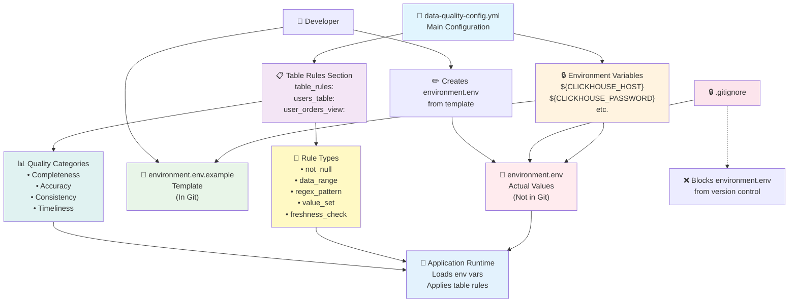

# Data Quality Framework v2.0

A comprehensive, modular data quality testing framework that supports multiple databases, table-specific rules, and generates automated testing-style reports with enhanced security.

## Features

- **Multi-Database Support**: ClickHouse, MySQL, PostgreSQL, SQL Server
- **Table/View-Based Rules**: Define specific validation rules for individual tables and views
- **Enhanced Security**: Environment variable configuration for sensitive data
- **Rule Type Library**: Built-in support for not_null, data_range, regex_pattern, value_set, freshness_check, uniqueness, and referential_integrity
- **Automated Reports**: HTML, JSON, and text format reports
- **Parallel Execution**: Multi-threaded rule execution
- **Configuration Management**: Environment and scenario isolation
- **Virtual Environment**: Python virtual environment support

## Architecture Overview

The framework follows a security-first, table-centric approach for data quality validation:



## Quick Start

### 1. Setup Virtual Environment

```bash
# Windows
setup_venv.bat

# Or manually:
python -m venv venv
venv\Scripts\activate.bat
pip install -r requirements-v2.txt
```

### 2. Configure Environment

```bash
# Copy the environment template
cp environment.env.example environment.env

# Edit environment.env with your database credentials
# Update CLICKHOUSE_HOST, CLICKHOUSE_USER, CLICKHOUSE_PASSWORD, etc.
```

### 3. Load Environment Variables

```bash
# Windows
for /f "delims=" %i in (environment.env) do set %i

# Linux/Mac
source environment.env
```

### 4. Run Basic Test

```bash
python run_test.py
```

### 5. Available Commands

```bash
# List available scenarios
python data_quality_runner.py --list-scenarios

# List supported databases
python data_quality_runner.py --list-databases

# Test database connection
python data_quality_runner.py --test-connection

# Validate configuration
python data_quality_runner.py --validate-config

# Run specific scenario
python data_quality_runner.py --scenario basic_test
```

## Project Structure

```
data-quality/
├── core/                           # Core framework modules
│   ├── engine.py                   # Main execution engine
│   ├── rule_engine.py              # Rule loading and validation
│   ├── template_engine.py          # SQL template rendering
│   ├── database_adapters.py        # Database connection adapters
│   ├── config_manager.py           # Configuration management
│   └── report_generator.py         # Report generation
├── configs/                        # Configuration files
│   ├── test-config.yml            # Test configuration
│   └── data-quality-config-v2.yml # Main configuration
├── scenarios/                      # Test scenarios
│   ├── basic_test.yml             # Basic test scenario
│   └── basic_test/                # Scenario-specific rules
├── templates/                      # SQL templates
├── reports/                        # Generated reports
├── requirements-v2.txt             # Python dependencies
├── setup_venv.bat                  # Virtual environment setup
├── data_quality_runner.py          # Main runner script
└── run_test.py                     # Simple test runner
```

## Configuration

### Environment Setup

1. **Create Environment File**:
   ```bash
   cp environment.env.example environment.env
   ```

2. **Configure Environment Variables**:
   ```bash
   # environment.env
   CLICKHOUSE_HOST=localhost
   CLICKHOUSE_PORT=8123
   CLICKHOUSE_DATABASE=default
   CLICKHOUSE_USER=your_username
   CLICKHOUSE_PASSWORD=your_password
   CLICKHOUSE_SECURE=false
   CLICKHOUSE_TIMEOUT=30
   
   RESULTS_DATABASE=data_quality
   RESULTS_TABLE=quality_results
   METRICS_PORT=9090
   GRAFANA_DASHBOARD_URL=http://localhost:3000
   REPORT_LOCATION=./reports/
   LOG_FILE=./logs/data-quality.log
   ```

3. **Load Environment Variables**:
   ```bash
   # Windows
   for /f "delims=" %i in (environment.env) do set %i
   
   # Linux/Mac
   source environment.env
   ```

### Database Configuration (Updated)

```yaml
# ClickHouse Connection Settings
# Note: Values are now loaded from environment variables for security
clickhouse:
  host: "${CLICKHOUSE_HOST}"
  port: ${CLICKHOUSE_PORT}
  database: "${CLICKHOUSE_DATABASE}"
  user: "${CLICKHOUSE_USER}"
  password: "${CLICKHOUSE_PASSWORD}"
  secure: ${CLICKHOUSE_SECURE}
  timeout: ${CLICKHOUSE_TIMEOUT}
```

### Table/View-Based Rules Configuration

```yaml
table_rules:
  users_table:
    table_name: "users"
    schema: "default"
    rules:
      - name: "user_id_not_null"
        type: "not_null"
        column: "user_id"
        category: "completeness"
        description: "User ID must not be null"
        
      - name: "age_range_validation"
        type: "data_range"
        column: "age"
        min_value: 0
        max_value: 150
        category: "accuracy"
        description: "Age must be between 0 and 150"
```

### Quality Checks Configuration

```yaml
quality_checks:
  enabled: true
  parallel_execution: true
  max_parallel_jobs: 5
  timeout_minutes: 30
  generate_reports: true
  report_format: ["html", "json", "csv"]
  report_location: "${REPORT_LOCATION}"
```

## Rule Definition

Rules are defined in YAML format with the following structure:

```yaml
- rule_type: "connectivity"
  version: "1.0"
  description: "Database connection test"
  scenarios: ["basic_test", "connectivity", "all"]
  
  rule:
    name: "connection_test"
    description: "Test database connection"
    category: "connectivity"
    priority: "high"
    enabled: true
    
    target:
      database: "default"
      table: "system.databases"
      
    template: |
      SELECT
        'connection_test' as test_name,
        count(*) as database_count,
        version() as version,
        'PASS' as check_result
      FROM system.databases
```

## Supported Rule Types

### Built-in Rule Types

- **not_null**: Check that column values are not null
- **data_range**: Check that numeric values fall within specified range (min/max values)
- **regex_pattern**: Validate column values against regular expression patterns
- **value_set**: Check that column values are within a predefined set of valid values
- **freshness_check**: Check that timestamp values are within acceptable age limit
- **uniqueness**: Check that column values are unique
- **referential_integrity**: Check foreign key relationships between tables

### Rule Categories

- **completeness**: Data completeness and null value checks
- **accuracy**: Data accuracy and validation checks
- **consistency**: Data consistency and integrity checks
- **timeliness**: Data freshness and latency checks

### Example Rule Definitions

```yaml
# Not null validation
- name: "user_id_not_null"
  type: "not_null"
  column: "user_id"
  category: "completeness"
  description: "User ID must not be null"

# Data range validation
- name: "age_range_validation"
  type: "data_range"
  column: "age"
  min_value: 0
  max_value: 150
  category: "accuracy"
  description: "Age must be between 0 and 150"

# Pattern validation
- name: "email_format_validation"
  type: "regex_pattern"
  column: "email"
  pattern: "^[a-zA-Z0-9._%+-]+@[a-zA-Z0-9.-]+\\.[a-zA-Z]{2,}$"
  category: "accuracy"
  description: "Email must be in valid format"

# Value set validation
- name: "status_validation"
  type: "value_set"
  column: "status"
  valid_values: ["active", "inactive", "pending", "deleted"]
  category: "accuracy"
  description: "Status must be one of the valid values"

# Freshness check
- name: "created_at_timeliness"
  type: "freshness_check"
  column: "created_at"
  max_age_hours: 24
  category: "timeliness"
  description: "Records should be created within last 24 hours"
```

## Database Support

### ClickHouse
- HTTP interface support
- Native driver support
- System table queries
- Function testing

### MySQL
- PyMySQL driver
- Connection pooling
- Transaction support

### PostgreSQL
- psycopg2 driver
- Advanced data types
- JSON support

### SQL Server
- pyodbc driver
- Windows authentication
- Stored procedure support

## Report Generation

The framework generates comprehensive reports in multiple formats:

### HTML Reports
- Modern, responsive design
- Interactive charts and graphs
- Detailed rule execution results
- Sample data display
- Export functionality

### JSON Reports
- Machine-readable format
- API integration support
- Detailed metadata

### Text Reports
- Console-friendly format
- Summary statistics
- Error details

## Security Features

### Environment Variable Configuration
- **Credential Protection**: Database passwords and sensitive URLs are stored in environment variables
- **Version Control Safety**: Environment files are excluded from git commits via `.gitignore`
- **Environment Isolation**: Different environments (dev, staging, prod) can use different credentials without code changes
- **Compliance**: Meets security best practices for credential management

### Configuration Files
- `environment.env` - Contains actual environment variables (excluded from git)
- `environment.env.example` - Template file for setting up new environments (included in git)
- Configuration automatically loads environment variables using `${VARIABLE_NAME}` syntax

## Table-Based Rule Management

### Benefits
- **Table-Specific Validation**: Define rules that apply only to specific tables or views
- **Flexible Rule Types**: Support for various validation scenarios (null checks, ranges, patterns, etc.)
- **Categorized Organization**: Rules organized by quality dimensions (completeness, accuracy, consistency, timeliness)
- **Simplified Configuration**: No complex scheduling or priority management - focus on data validation

### Rule Configuration Structure
```yaml
table_rules:
  table_identifier:
    table_name: "actual_table_name"
    schema: "schema_name"
    rules:
      - name: "rule_name"
        type: "rule_type"
        column: "column_name"
        category: "quality_category"
        description: "What this rule validates"
        # Additional parameters based on rule type
```

### Removed Complexity
- **No Priority Management**: Rules execute based on category, not artificial priorities
- **No Scheduling**: Focus on validation logic, not when to run rules
- **No Complex Monitoring**: Simplified reporting and logging
- **Streamlined Configuration**: Removed unused sections for better maintainability

## Development

### Adding New Database Support

1. Create adapter in `core/database_adapters.py`
2. Add requirements to `requirements-v2.txt`
3. Update `DatabaseAdapterFactory`
4. Add test scenarios

### Adding New Rule Types

1. Define schema in `core/rule_engine.py`
2. Add validation logic
3. Create template examples
4. Update documentation

### Creating Custom Rules

1. Create YAML rule file in `examples/` directory
2. Define rule structure with appropriate type
3. Write SQL template with required output columns
4. Add to configuration and run tests

See `examples/CUSTOM_RULES_GUIDE.md` for detailed instructions and examples.

### Adding New Scenarios

1. Create scenario YAML file
2. Define rules directory
3. Add scenario configuration
4. Test with sample data

## Troubleshooting

### Common Issues

1. **Database Connection Failed**
   - Check connection parameters
   - Verify network connectivity
   - Confirm user permissions

2. **Rule Validation Errors**
   - Check YAML syntax
   - Verify required fields
   - Review rule schema

3. **Template Rendering Issues**
   - Check Jinja2 syntax
   - Verify variable names
   - Review SQL dialect

### Debug Mode

Enable debug logging for detailed information:

```bash
python data_quality_runner.py --log-level DEBUG --scenario basic_test
```

## Contributing

1. Fork the repository
2. Create feature branch
3. Add tests for new functionality
4. Update documentation
5. Submit pull request

## License

This project is licensed under the MIT License - see the LICENSE file for details.

## Support

For issues and questions:
1. Check the troubleshooting section
2. Review existing issues
3. Create new issue with detailed information
4. Include configuration and error logs 