# Day 5: ClickHouse 表引擎深度解析

## 学习目标 🎯
- 理解ClickHouse表引擎的作用和分类
- 掌握MergeTree系列引擎的核心特性
- 学会选择适合业务场景的表引擎
- 理解分区、索引和数据组织原理
- 掌握表引擎的配置和优化技巧

## 为什么Day 5学表引擎？ 🤔

经过前4天的学习：
- ✅ Day 1: 环境搭建 - 工具准备完毕
- ✅ Day 2: 理论基础 - 概念理解清晰  
- ✅ Day 3: 云端部署 - 生产环境就绪
- ✅ Day 4: SQL语法 - 基本操作掌握

现在深入学习**表引擎**，这是ClickHouse性能的核心所在！

### 学习路径回顾
```
Day 1: 环境搭建 ✅ → Day 2: 理论基础 ✅ → Day 3: 云端部署 ✅ → Day 4: SQL语法 ✅ → Day 5: 表引擎
```

## 知识要点 📚

### 1. 表引擎概述

#### 什么是表引擎？
表引擎决定了：
- **数据存储方式**: 文件格式、压缩算法
- **查询处理机制**: 索引策略、并行度
- **数据维护方式**: 合并策略、分区管理
- **功能特性**: 去重、版本管理、数据同步

#### 表引擎分类

```mermaid
graph TD
    A[ClickHouse表引擎] --> B[MergeTree系列]
    A --> C[日志系列]
    A --> D[集成系列]
    A --> E[特殊用途]
    
    B --> B1[MergeTree - 基础引擎]
    B --> B2[ReplacingMergeTree - 去重]
    B --> B3[SummingMergeTree - 聚合]
    B --> B4[AggregatingMergeTree - 预聚合]
    B --> B5[CollapsingMergeTree - 状态折叠]
    B --> B6[VersionedCollapsingMergeTree - 版本折叠]
    B --> B7[GraphiteMergeTree - 时序数据]
    
    C --> C1[TinyLog - 小文件]
    C --> C2[Log - 基础日志]
    C --> C3[StripeLog - 条带日志]
    
    D --> D1[Kafka - 消息队列]
    D --> D2[MySQL - 数据库]
    D --> D3[PostgreSQL - 数据库]
    D --> D4[HDFS - 大数据]
    D --> D5[S3 - 对象存储]
    
    E --> E1[Memory - 内存]
    E --> E2[Buffer - 缓冲]
    E --> E3[Null - 空表]
    E --> E4[View - 视图]
```



### 2. MergeTree引擎系列

MergeTree是ClickHouse的核心引擎，专为大数据OLAP场景设计。

#### 2.1 MergeTree - 基础表引擎

**基本语法**
```sql
CREATE TABLE table_name (
    column1 Type1,
    column2 Type2,
    ...
) ENGINE = MergeTree()
ORDER BY (column1, column2, ...)
[PARTITION BY expression]
[PRIMARY KEY (columns)]
[SAMPLE BY expression]
[TTL expression]
[SETTINGS setting = value, ...];
```

**核心概念**

```sql
-- 创建基础MergeTree表
CREATE TABLE web_analytics (
    user_id UInt32,
    event_time DateTime,
    event_type LowCardinality(String),
    page_url String,
    session_id String,
    country LowCardinality(String),
    device_type LowCardinality(String)
) ENGINE = MergeTree()
ORDER BY (user_id, event_time)        -- 排序键
PARTITION BY toYYYYMM(event_time)      -- 分区键
PRIMARY KEY (user_id)                  -- 主键（稀疏索引）
SAMPLE BY user_id                      -- 采样键
TTL event_time + INTERVAL 1 YEAR;     -- 数据过期时间
```

**关键参数解析**

| 参数 | 说明 | 示例 | 影响 |
|------|------|------|------|
| ORDER BY | 数据排序方式 | `(user_id, event_time)` | 查询性能、压缩率 |
| PARTITION BY | 数据分区策略 | `toYYYYMM(event_time)` | 查询裁剪、数据管理 |
| PRIMARY KEY | 稀疏索引键 | `(user_id)` | 索引大小、查询性能 |
| SAMPLE BY | 数据采样 | `user_id` | 近似查询、性能测试 |
| TTL | 数据生命周期 | `event_time + INTERVAL 1 YEAR` | 存储管理、合规要求 |

#### 2.2 ReplacingMergeTree - 去重引擎

用于处理重复数据，基于ORDER BY列进行去重。

```sql
-- 创建去重表
CREATE TABLE user_profiles (
    user_id UInt32,
    name String,
    email String,
    last_login DateTime,
    version UInt64  -- 版本号，用于选择最新记录
) ENGINE = ReplacingMergeTree(version)  -- 指定版本列
ORDER BY user_id
PARTITION BY user_id % 10;

-- 插入重复数据测试
INSERT INTO user_profiles VALUES
(1, '张三', 'zhang@old.com', '2024-01-01 10:00:00', 1),
(1, '张三', 'zhang@new.com', '2024-01-02 11:00:00', 2),  -- 更新版本
(2, '李四', 'li@example.com', '2024-01-01 12:00:00', 1);

-- 强制合并以触发去重
OPTIMIZE TABLE user_profiles FINAL;

-- 查询去重后的结果
SELECT * FROM user_profiles FINAL;  -- FINAL确保看到去重结果
```

**去重机制**
- **时机**: 在后台合并时进行
- **策略**: 保留ORDER BY相同的最后一条记录
- **版本**: 如果指定版本列，保留版本号最大的记录
- **注意**: 需要FINAL查询或等待合并完成

#### 2.3 SummingMergeTree - 聚合引擎

自动对数值列进行求和聚合。

```sql
-- 创建求和聚合表
CREATE TABLE daily_metrics (
    date Date,
    country LowCardinality(String),
    event_type LowCardinality(String),
    page_views UInt64,
    unique_users UInt64,
    total_duration UInt64
) ENGINE = SummingMergeTree((page_views, unique_users, total_duration))  -- 指定求和列
ORDER BY (date, country, event_type)
PARTITION BY toYYYYMM(date);

-- 插入测试数据
INSERT INTO daily_metrics VALUES
('2024-01-01', 'CN', 'page_view', 1000, 800, 3600000),
('2024-01-01', 'CN', 'page_view', 500, 400, 1800000),   -- 会与上一条聚合
('2024-01-01', 'US', 'page_view', 800, 600, 2400000),
('2024-01-01', 'CN', 'click', 200, 150, 300000);

-- 触发聚合
OPTIMIZE TABLE daily_metrics FINAL;

-- 查询聚合结果
SELECT * FROM daily_metrics FINAL;
```

**聚合规则**
- **条件**: ORDER BY列完全相同的行
- **操作**: 对指定的数值列求和
- **非聚合列**: 选择任意一个值（通常是第一个）

#### 2.4 AggregatingMergeTree - 预聚合引擎

使用聚合函数状态进行预计算。

```sql
-- 创建预聚合表
CREATE TABLE user_analytics_agg (
    date Date,
    country LowCardinality(String),
    unique_users AggregateFunction(uniq, UInt32),        -- 去重状态
    avg_session_time AggregateFunction(avg, UInt32),     -- 平均值状态
    page_views SimpleAggregateFunction(sum, UInt64)      -- 简单聚合
) ENGINE = AggregatingMergeTree()
ORDER BY (date, country)
PARTITION BY toYYYYMM(date);

-- 使用聚合状态插入数据
INSERT INTO user_analytics_agg 
SELECT 
    toDate(event_time) as date,
    country,
    uniqState(user_id) as unique_users,
    avgState(session_duration) as avg_session_time,
    sum(page_views) as page_views
FROM raw_events 
GROUP BY date, country;

-- 查询聚合结果
SELECT 
    date,
    country,
    uniqMerge(unique_users) as unique_users,
    avgMerge(avg_session_time) as avg_session_time,
    sum(page_views) as page_views
FROM user_analytics_agg 
GROUP BY date, country;
```

#### 2.5 CollapsingMergeTree - 状态折叠引擎

处理状态变更，支持"删除"操作。

```sql
-- 创建状态折叠表
CREATE TABLE user_balance (
    user_id UInt32,
    balance Decimal(10, 2),
    update_time DateTime,
    sign Int8  -- 符号列：1表示插入，-1表示删除
) ENGINE = CollapsingMergeTree(sign)
ORDER BY (user_id, update_time)
PARTITION BY toYYYYMM(update_time);

-- 模拟账户余额变更
-- 1. 初始余额
INSERT INTO user_balance VALUES
(1001, 1000.00, '2024-01-01 10:00:00', 1);

-- 2. 余额变更（先删除旧记录，再插入新记录）
INSERT INTO user_balance VALUES
(1001, 1000.00, '2024-01-01 10:00:00', -1),  -- 删除旧记录
(1001, 1500.00, '2024-01-01 11:00:00', 1);   -- 插入新记录

-- 查询最终状态
SELECT 
    user_id,
    sum(balance * sign) as current_balance
FROM user_balance 
WHERE user_id = 1001
GROUP BY user_id
HAVING sum(sign) > 0;  -- 确保记录没有被完全删除
```

#### 2.6 VersionedCollapsingMergeTree - 版本折叠引擎

改进的状态折叠，解决乱序写入问题。

```sql
-- 创建版本折叠表
CREATE TABLE user_balance_v2 (
    user_id UInt32,
    balance Decimal(10, 2),
    update_time DateTime,
    version UInt64,  -- 版本列
    sign Int8        -- 符号列
) ENGINE = VersionedCollapsingMergeTree(sign, version)
ORDER BY (user_id, version)
PARTITION BY toYYYYMM(update_time);

-- 版本化的状态变更
INSERT INTO user_balance_v2 VALUES
(1001, 1000.00, '2024-01-01 10:00:00', 1, 1),   -- 版本1，余额1000
(1001, 1000.00, '2024-01-01 10:00:00', 1, -1),  -- 删除版本1
(1001, 1500.00, '2024-01-01 11:00:00', 2, 1);   -- 版本2，余额1500

-- 查询当前状态
SELECT 
    user_id,
    argMax(balance, version) as current_balance
FROM user_balance_v2 
WHERE user_id = 1001
GROUP BY user_id;
```

### 3. 日志系列引擎

适用于小数据量、简单查询场景。

#### 3.1 Log引擎系列对比

| 引擎 | 特点 | 适用场景 | 限制 |
|------|------|----------|------|
| TinyLog | 最简单，无索引 | 临时数据、测试 | 无并发读取 |
| Log | 支持并发读取 | 日志分析、简单查询 | 无索引，查询慢 |
| StripeLog | 数据条带化存储 | 中等数据量查询 | 写入性能一般 |

```sql
-- TinyLog示例 - 测试数据
CREATE TABLE test_log (
    id UInt32,
    message String,
    timestamp DateTime
) ENGINE = TinyLog;

-- StripeLog示例 - 访问日志
CREATE TABLE access_log (
    ip String,
    timestamp DateTime,
    method String,
    url String,
    status UInt16,
    response_size UInt64
) ENGINE = StripeLog;
```

### 4. 集成系列引擎

连接外部数据源，实现数据集成。

#### 4.1 Kafka引擎

```sql
-- 创建Kafka表
CREATE TABLE kafka_events (
    user_id UInt32,
    event_type String,
    event_time DateTime,
    properties String
) ENGINE = Kafka()
SETTINGS 
    kafka_broker_list = 'localhost:9092',
    kafka_topic_list = 'user_events',
    kafka_group_name = 'clickhouse_consumer',
    kafka_format = 'JSONEachRow';

-- 创建物化视图实现实时ETL
CREATE MATERIALIZED VIEW events_mv TO events_table AS
SELECT 
    user_id,
    event_type,
    event_time,
    JSONExtractString(properties, 'page_url') as page_url
FROM kafka_events;
```

#### 4.2 MySQL引擎

```sql
-- 连接MySQL数据库
CREATE TABLE mysql_users (
    id UInt32,
    name String,
    email String,
    created_at DateTime
) ENGINE = MySQL('localhost:3306', 'database', 'users', 'username', 'password');

-- 实时查询MySQL数据
SELECT * FROM mysql_users WHERE created_at >= today();
```

### 5. 特殊用途引擎

#### 5.1 Memory引擎

```sql
-- 内存表 - 重启后数据丢失
CREATE TABLE session_cache (
    session_id String,
    user_id UInt32,
    last_activity DateTime,
    data String
) ENGINE = Memory;
```

#### 5.2 Buffer引擎

```sql
-- 缓冲表 - 批量写入优化
CREATE TABLE events_buffer AS events_table 
ENGINE = Buffer(default, events_table, 16, 10, 100, 10000, 1000000, 10000000, 100000000);
```

### 6. 表引擎选择指南

#### 6.1 场景选择矩阵

| 场景 | 推荐引擎 | 理由 | 配置建议 |
|------|----------|------|----------|
| 大数据分析 | MergeTree | 高压缩、快查询 | 按时间分区，合理ORDER BY |
| 实时去重 | ReplacingMergeTree | 自动去重 | 选择合适的版本列 |
| 指标聚合 | SummingMergeTree | 自动求和 | 明确指定聚合列 |
| 预聚合 | AggregatingMergeTree | 预计算加速 | 使用聚合函数状态 |
| 状态跟踪 | CollapsingMergeTree | 支持删除语义 | 正确使用符号列 |
| 日志分析 | Log/StripeLog | 简单高效 | 小数据量场景 |
| 实时流处理 | Kafka + 物化视图 | 流式处理 | 配合MergeTree存储 |
| 缓存表 | Memory | 高速访问 | 数据量小且允许丢失 |

#### 6.2 性能优化建议

**ORDER BY优化**
```sql
-- ❌ 错误：过多排序列
ORDER BY (col1, col2, col3, col4, col5, col6)

-- ✅ 正确：3-4个主要列
ORDER BY (user_id, event_time, event_type)
```

**分区策略**
```sql
-- ❌ 错误：分区过细
PARTITION BY toYYYYMMDD(event_time)  -- 每天一个分区

-- ✅ 正确：合理分区
PARTITION BY toYYYYMM(event_time)    -- 每月一个分区
```

**主键选择**
```sql
-- ✅ 主键通常是ORDER BY的前缀
ORDER BY (user_id, event_time, event_type)
PRIMARY KEY (user_id, event_time)  -- 前两列作为主键
```

## 实践练习 🛠️

### 练习1：多引擎对比测试

```sql
-- 创建不同引擎的相同结构表
CREATE TABLE events_mergetree (
    user_id UInt32,
    event_time DateTime,
    event_type String,
    page_url String
) ENGINE = MergeTree()
ORDER BY (user_id, event_time)
PARTITION BY toYYYYMM(event_time);

CREATE TABLE events_replacing (
    user_id UInt32,
    event_time DateTime,
    event_type String,
    page_url String,
    version UInt64
) ENGINE = ReplacingMergeTree(version)
ORDER BY (user_id, event_time);

CREATE TABLE events_summing (
    date Date,
    user_id UInt32,
    event_type String,
    event_count UInt64
) ENGINE = SummingMergeTree(event_count)
ORDER BY (date, user_id, event_type);

-- 插入相同的测试数据进行对比分析
```

### 练习2：构建实时分析系统

```sql
-- 1. 原始事件表 (MergeTree)
CREATE TABLE raw_events (
    event_id UInt64,
    user_id UInt32,
    event_time DateTime,
    event_type LowCardinality(String),
    properties Map(String, String)
) ENGINE = MergeTree()
ORDER BY (event_time, user_id)
PARTITION BY toYYYYMM(event_time);

-- 2. 实时聚合表 (SummingMergeTree)
CREATE TABLE hourly_stats (
    hour DateTime,
    event_type LowCardinality(String),
    event_count UInt64,
    unique_users UInt64
) ENGINE = SummingMergeTree(event_count)
ORDER BY (hour, event_type);

-- 3. 物化视图实现实时聚合
CREATE MATERIALIZED VIEW hourly_stats_mv TO hourly_stats AS
SELECT 
    toStartOfHour(event_time) as hour,
    event_type,
    count() as event_count,
    uniq(user_id) as unique_users
FROM raw_events
GROUP BY hour, event_type;
```

### 练习3：数据生命周期管理

```sql
-- 带TTL的表设计
CREATE TABLE events_with_ttl (
    user_id UInt32,
    event_time DateTime,
    event_data String
) ENGINE = MergeTree()
ORDER BY (user_id, event_time)
PARTITION BY toYYYYMM(event_time)
TTL event_time + INTERVAL 6 MONTH DELETE,     -- 6个月后删除
    event_time + INTERVAL 1 MONTH TO DISK 'cold',  -- 1个月后移到冷存储
    event_time + INTERVAL 1 WEEK TO VOLUME 'ssd';  -- 1周后移到SSD
```

## 最佳实践 💡

### 1. 引擎选择原则
- **数据量大**: 优先选择MergeTree系列
- **需要去重**: 使用ReplacingMergeTree
- **预聚合场景**: 选择SummingMergeTree或AggregatingMergeTree
- **状态跟踪**: 使用CollapsingMergeTree系列
- **简单日志**: Log系列引擎足够

### 2. 性能优化
- **ORDER BY设计**: 根据查询模式优化排序键
- **分区策略**: 避免过度分区，通常按月分区
- **主键选择**: ORDER BY的前几列作为主键
- **TTL配置**: 合理设置数据生命周期

### 3. 运维管理
- **监控合并**: 关注后台合并性能
- **分区管理**: 定期清理过期分区
- **存储分层**: 利用TTL实现冷热数据分离
- **查询优化**: 了解各引擎的查询特性

## 常见问题 ❓

### Q1: MergeTree和ReplacingMergeTree选择？
**A**: 
- 如果不需要去重，选择MergeTree（性能更好）
- 如果数据有重复且需要去重，选择ReplacingMergeTree
- 注意ReplacingMergeTree去重是异步的

### Q2: 为什么我的SummingMergeTree没有聚合？
**A**: 可能原因：
- ORDER BY列不完全相同
- 后台合并还未完成
- 没有指定求和列或列类型不对
- 需要手动OPTIMIZE或等待自动合并

### Q3: 如何选择分区键？
**A**: 分区选择原则：
- 通常按时间分区（按月或按天）
- 分区数量不要太多（建议<1000个）
- 避免按高基数字段分区
- 考虑查询模式和数据管理需求

### Q4: CollapsingMergeTree乱序写入怎么处理？
**A**: 
- 使用VersionedCollapsingMergeTree
- 或者在应用层保证写入顺序
- 或者使用更适合的引擎如ReplacingMergeTree

## 今日总结 📋

今天我们深入学习了：
- ✅ ClickHouse表引擎分类和特性
- ✅ MergeTree系列引擎详解
- ✅ 日志和集成系列引擎
- ✅ 表引擎选择指南和优化策略
- ✅ 实际案例练习和最佳实践

**下一步**: Day 6 - 查询优化与索引，深入理解ClickHouse的查询性能优化

---
*学习进度: Day 5/14 完成* 🎉 