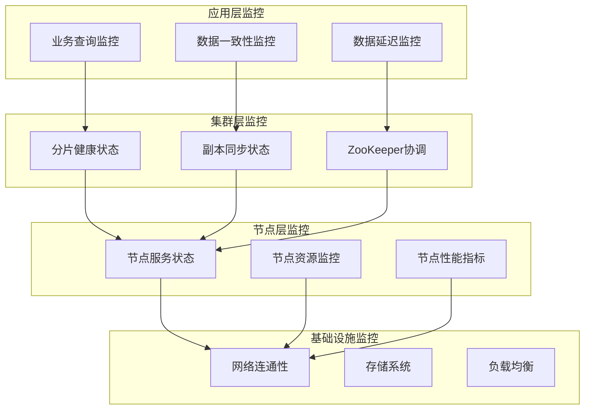
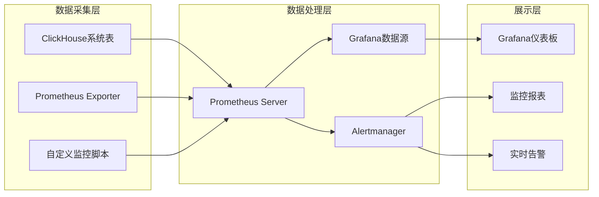
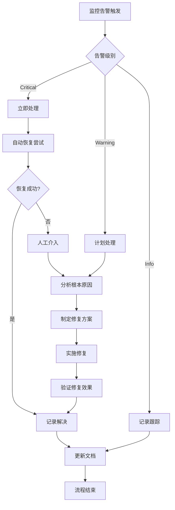

# ClickHouse集群监控专题

## 1. 集群监控体系架构

### 1.1 集群监控层次结构



### 1.2 监控组件架构



## 2. 集群健康状态监控

### 2.1 分片健康监控

```sql
-- 分片健康状态检查
SELECT 
    shard_num,
    host_name,
    is_active,
    errors_count,
    slowdowns_count,
    estimated_recovery_time,
    replica_is_readonly,
    replica_is_session_expired,
    queue_size,
    inserts_in_queue,
    merges_in_queue,
    last_queue_update,
    log_max_index,
    log_pointer,
    total_replicas,
    active_replicas
FROM system.clusters
WHERE cluster = 'your_cluster_name'
ORDER BY shard_num, host_name;

-- 分片数据分布分析
SELECT 
    shard_num,
    count() as table_count,
    sum(rows) as total_rows,
    formatReadableSize(sum(bytes)) as total_size,
    avg(compression_ratio) as avg_compression,
    min(creation_time) as oldest_data,
    max(modification_time) as latest_update
FROM system.parts 
WHERE active = 1
GROUP BY shard_num
ORDER BY shard_num;
```

### 2.2 副本同步监控

```sql
-- 副本同步状态监控
SELECT 
    database,
    table,
    replica_name,
    is_leader,
    is_readonly,
    is_session_expired,
    future_parts,
    parts_to_check,
    queue_size,
    inserts_in_queue,
    merges_in_queue,
    log_max_index,
    log_pointer,
    total_replicas,
    active_replicas,
    replica_delay
FROM system.replicas
ORDER BY database, table, replica_name;

-- 副本延迟分析
SELECT 
    database,
    table,
    replica_name,
    replica_delay,
    CASE 
        WHEN replica_delay = 0 THEN 'SYNCED'
        WHEN replica_delay < 60 THEN 'MINOR_DELAY'
        WHEN replica_delay < 300 THEN 'MODERATE_DELAY'
        ELSE 'MAJOR_DELAY'
    END as delay_status,
    last_queue_update
FROM system.replicas
WHERE is_active = 1
ORDER BY replica_delay DESC
LIMIT 20;

-- 副本同步时间线分析
SELECT 
    toStartOfHour(event_time) as hour,
    database,
    table,
    replica_name,
    avg(replica_delay) as avg_delay,
    max(replica_delay) as max_delay,
    countIf(replica_delay > 300) as high_delay_count
FROM system.replica_queue
WHERE event_date >= today() - 7
GROUP BY hour, database, table, replica_name
ORDER BY max_delay DESC
LIMIT 100;
```

### 2.3 ZooKeeper协调监控

```sql
-- ZooKeeper会话状态
SELECT 
    name,
    value,
    description
FROM system.zookeeper
WHERE path = '/'
LIMIT 50;

-- ZooKeeper节点统计
SELECT 
    count() as total_nodes,
    sum(data_length) as total_data_size,
    avg(data_length) as avg_node_size,
    max(data_length) as max_node_size
FROM system.zookeeper
WHERE path LIKE '/clickhouse%';

-- 分布式表状态检查
SELECT 
    name as table_name,
    engine,
    metadata_modification_time,
    data_paths,
    metadata_path
FROM system.tables 
WHERE engine LIKE '%Distributed%'
  AND database != 'system';
```

## 3. 集群性能监控

### 3.1 查询性能监控

```sql
-- 集群查询性能统计
SELECT 
    toStartOfMinute(query_start_time) as time_window,
    shard_num,
    count() as query_count,
    avg(query_duration_ms) as avg_duration,
    quantile(0.95)(query_duration_ms) as p95_duration,
    quantile(0.99)(query_duration_ms) as p99_duration,
    sum(read_rows) as total_rows_read,
    sum(read_bytes) as total_bytes_read,
    sum(result_rows) as total_rows_returned,
    sum(memory_usage) as total_memory_used
FROM clusterAllReplicas('your_cluster_name', system.query_log)
WHERE event_date = today()
  AND type = 'QueryFinish'
GROUP BY time_window, shard_num
ORDER BY time_window DESC, shard_num;

-- 跨分片查询性能分析
SELECT 
    normalizeQuery(query) as normalized_query,
    count() as execution_count,
    avg(query_duration_ms) as avg_duration,
    max(query_duration_ms) as max_duration,
    sum(read_rows) as total_rows_read,
    sum(read_bytes) as total_bytes_read,
    uniq(shard_num) as affected_shards,
    groupArray(DISTINCT shard_num) as shard_list
FROM clusterAllReplicas('your_cluster_name', system.query_log)
WHERE event_date >= today() - 1
  AND type = 'QueryFinish'
  AND query_duration_ms > 5000
GROUP BY normalized_query
ORDER BY avg_duration DESC
LIMIT 20;
```

### 3.2 数据分布和负载均衡

```sql
-- 数据分布均匀性分析
SELECT 
    shard_num,
    count() as table_count,
    sum(rows) as total_rows,
    formatReadableSize(sum(bytes)) as total_size,
    round(sum(rows) * 100.0 / (SELECT sum(rows) FROM system.parts WHERE active = 1), 2) as row_percentage,
    round(sum(bytes) * 100.0 / (SELECT sum(bytes) FROM system.parts WHERE active = 1), 2) as size_percentage
FROM system.parts 
WHERE active = 1
GROUP BY shard_num
ORDER BY total_rows DESC;

-- 查询负载分布分析
SELECT 
    shard_num,
    toStartOfHour(event_time) as hour,
    count() as query_count,
    avg(query_duration_ms) as avg_duration,
    sum(read_rows) as total_rows_read,
    round(count() * 100.0 / sum(count()) OVER (PARTITION BY hour), 2) as query_percentage
FROM clusterAllReplicas('your_cluster_name', system.query_log)
WHERE event_date >= today() - 1
  AND type = 'QueryFinish'
GROUP BY shard_num, hour
ORDER BY hour DESC, query_count DESC;
```

### 3.3 资源使用监控

```sql
-- 集群资源使用统计
SELECT 
    shard_num,
    hostName() as host_name,
    formatReadableSize(total_memory) as total_memory,
    formatReadableSize(free_memory) as free_memory,
    round((total_memory - free_memory) * 100.0 / total_memory, 2) as memory_usage_percent,
    formatReadableSize(total_disk_space) as total_disk,
    formatReadableSize(free_disk_space) as free_disk,
    round((total_disk_space - free_disk_space) * 100.0 / total_disk_space, 2) as disk_usage_percent
FROM clusterAllReplicas('your_cluster_name', system.asynchronous_metrics)
WHERE metric IN ('MemoryTotal', 'MemoryAvailable', 'MemoryTracking', 
                'DiskSpaceTotal', 'DiskSpaceAvailable')
ORDER BY shard_num, metric;

-- 实时资源监控视图
CREATE VIEW cluster_resource_monitor AS
SELECT 
    shard_num,
    host_name,
    metric,
    value,
    event_time
FROM (
    SELECT 
        shardNum() as shard_num,
        hostName() as host_name,
        metric,
        value,
        event_time
    FROM clusterAllReplicas('your_cluster_name', system.metric_log)
    WHERE event_date = today()
      AND metric IN ('CPUUsage', 'MemoryUsage', 'DiskUsage', 'NetworkBytes')
)
ORDER BY event_time DESC, shard_num;
```

## 4. 高级监控配置

### 4.1 Prometheus集群监控配置

```yaml
# prometheus-cluster.yml
global:
  scrape_interval: 15s
  evaluation_interval: 15s
  external_labels:
    cluster: 'clickhouse-cluster'
    environment: 'production'

rule_files:
  - "cluster_alert_rules.yml"

scrape_configs:
  # ClickHouse集群监控
  - job_name: 'clickhouse-cluster'
    consul_sd_configs:
      - server: 'consul:8500'
        services: ['clickhouse']
    metrics_path: '/metrics'
    scrape_interval: 30s
    scrape_timeout: 10s
    relabel_configs:
      - source_labels: [__meta_consul_service]
        target_label: service
      - source_labels: [__meta_consul_tags]
        regex: 'shard-(\d+)'
        target_label: shard
      - source_labels: [__meta_consul_tags]
        regex: 'replica-(\d+)'
        target_label: replica

  # 集群级指标采集
  - job_name: 'clickhouse-cluster-aggregate'
    static_configs:
      - targets: ['clickhouse-coordinator:8123']
    metrics_path: '/query'
    scrape_interval: 60s
    params:
      query:
        - |
          SELECT 
            'clickhouse_cluster_queries_total' as __name__,
            count() as value,
            'cluster=production' as cluster
          FROM clusterAllReplicas('production', system.query_log)
          WHERE event_time >= now() - INTERVAL 1 MINUTE
            AND type = 'QueryFinish'
        - |
          SELECT 
            'clickhouse_cluster_memory_usage_bytes' as __name__,
            sum(value) as value,
            'cluster=production' as cluster
          FROM clusterAllReplicas('production', system.asynchronous_metrics)
          WHERE metric = 'MemoryTracking'
        - |
          SELECT 
            'clickhouse_cluster_disk_usage_bytes' as __name__,
            sum(bytes_on_disk) as value,
            'cluster=production' as cluster
          FROM clusterAllReplicas('production', system.parts)
          WHERE active = 1

  # 副本延迟监控
  - job_name: 'clickhouse-replica-lag'
    static_configs:
      - targets: ['clickhouse-coordinator:8123']
    metrics_path: '/query'
    scrape_interval: 30s
    params:
      query:
        - |
          SELECT 
            'clickhouse_replica_lag_seconds' as __name__,
            replica_delay as value,
            concat('database=', database) as database,
            concat('table=', table) as table,
            concat('replica=', replica_name) as replica
          FROM clusterAllReplicas('production', system.replicas)
          WHERE is_active = 1
```

### 4.2 集群告警规则

```yaml
# cluster_alert_rules.yml
groups:
- name: clickhouse-cluster
  rules:
  
  # 集群可用性告警
  - alert: ClickHouseClusterDown
    expr: count(up{job=~"clickhouse.*"}) < 3
    for: 2m
    labels:
      severity: critical
      cluster: '{{ $labels.cluster }}'
    annotations:
      summary: "ClickHouse集群节点宕机"
      description: "集群 {{ $labels.cluster }} 有 {{ $value }} 个节点不可用"

  # 副本同步延迟告警
  - alert: ClickHouseReplicaLagHigh
    expr: clickhouse_replica_lag_seconds > 300
    for: 5m
    labels:
      severity: warning
      cluster: '{{ $labels.cluster }}'
    annotations:
      summary: "ClickHouse副本同步延迟"
      description: "表 {{ $labels.database }}.{{ $labels.table }} 的副本 {{ $labels.replica }} 延迟 {{ $value }} 秒"

  # 集群内存使用告警
  - alert: ClickHouseClusterMemoryHigh
    expr: clickhouse_cluster_memory_usage_bytes / clickhouse_cluster_memory_total_bytes > 0.85
    for: 5m
    labels:
      severity: warning
      cluster: '{{ $labels.cluster }}'
    annotations:
      summary: "ClickHouse集群内存使用过高"
      description: "集群内存使用率 {{ $value | humanizePercentage }}"

  # 数据分布不均告警
  - alert: ClickHouseDataDistributionImbalanced
    expr: |
      (
        max by (shard) (clickhouse_shard_table_size_bytes) / 
        min by (shard) (clickhouse_shard_table_size_bytes)
      ) > 3
    for: 10m
    labels:
      severity: warning
      cluster: '{{ $labels.cluster }}'
    annotations:
      summary: "ClickHouse数据分布不均"
      description: "分片间数据量差异过大，最大/最小比例为 {{ $value }}"

  # 查询性能下降告警
  - alert: ClickHouseQueryPerformanceDegraded
    expr: |
      (
        quantile_over_time(0.95, clickhouse_query_duration_seconds[5m]) / 
        quantile_over_time(0.95, clickhouse_query_duration_seconds[1h] offset 1h)
      ) > 2
    for: 5m
    labels:
      severity: warning
      cluster: '{{ $labels.cluster }}'
    annotations:
      summary: "ClickHouse查询性能下降"
      description: "查询P95响应时间相比1小时前增长 {{ $value | humanize }} 倍"

  # ZooKeeper连接问题告警
  - alert: ClickHouseZooKeeperIssues
    expr: clickhouse_zookeeper_exceptions_total > 10
    for: 2m
    labels:
      severity: critical
      cluster: '{{ $labels.cluster }}'
    annotations:
      summary: "ClickHouse ZooKeeper连接异常"
      description: "ZooKeeper异常次数: {{ $value }}"
```

### 4.3 Grafana集群监控仪表板

```json
{
  "dashboard": {
    "title": "ClickHouse集群监控",
    "panels": [
      {
        "title": "集群健康状态",
        "type": "stat",
        "targets": [
          {
            "expr": "count(up{job=~\"clickhouse.*\"})",
            "legend": "活跃节点"
          },
          {
            "expr": "count(clickhouse_replica_lag_seconds > 300)",
            "legend": "高延迟副本"
          }
        ]
      },
      {
        "title": "集群查询性能",
        "type": "graph",
        "targets": [
          {
            "expr": "sum(rate(clickhouse_query_total[5m]))",
            "legend": "集群QPS"
          },
          {
            "expr": "avg(clickhouse_query_duration_seconds)",
            "legend": "平均响应时间"
          }
        ]
      },
      {
        "title": "数据分布",
        "type": "heatmap",
        "targets": [
          {
            "expr": "clickhouse_shard_table_size_bytes",
            "legend": "分片数据量"
          }
        ]
      },
      {
        "title": "副本同步状态",
        "type": "table",
        "targets": [
          {
            "expr": "clickhouse_replica_lag_seconds",
            "format": "table"
          }
        ]
      }
    ]
  }
}
```

## 5. 自动化运维和故障处理

### 5.1 自动化健康检查脚本

```bash
#!/bin/bash
# ClickHouse集群健康检查脚本

CLUSTER_NAME="production"
ALERT_WEBHOOK="https://hooks.slack.com/your-webhook"

# 检查集群节点状态
check_cluster_nodes() {
    echo "检查集群节点状态..."
    
    # 获取活跃节点数量
    active_nodes=$(clickhouse-client --query="
        SELECT count() 
        FROM system.clusters 
        WHERE cluster = '$CLUSTER_NAME' AND is_active = 1")
    
    total_nodes=$(clickhouse-client --query="
        SELECT count() 
        FROM system.clusters 
        WHERE cluster = '$CLUSTER_NAME'")
    
    if [ "$active_nodes" -lt "$total_nodes" ]; then
        send_alert "WARNING" "集群节点异常" "活跃节点: $active_nodes/$total_nodes"
        return 1
    fi
    
    echo "✓ 集群节点状态正常 ($active_nodes/$total_nodes)"
    return 0
}

# 检查副本同步状态
check_replica_sync() {
    echo "检查副本同步状态..."
    
    lag_count=$(clickhouse-client --query="
        SELECT count() 
        FROM system.replicas 
        WHERE replica_delay > 300 AND is_active = 1")
    
    if [ "$lag_count" -gt 0 ]; then
        send_alert "WARNING" "副本同步延迟" "有 $lag_count 个副本延迟超过5分钟"
        return 1
    fi
    
    echo "✓ 副本同步状态正常"
    return 0
}

# 检查数据分布均衡性
check_data_distribution() {
    echo "检查数据分布均衡性..."
    
    # 计算分片间数据量差异
    distribution_ratio=$(clickhouse-client --query="
        SELECT 
            max(total_rows) / min(total_rows) as ratio
        FROM (
            SELECT shard_num, sum(rows) as total_rows
            FROM system.parts 
            WHERE active = 1
            GROUP BY shard_num
        )")
    
    if (( $(echo "$distribution_ratio > 3" | bc -l) )); then
        send_alert "WARNING" "数据分布不均" "分片数据量差异比: $distribution_ratio"
        return 1
    fi
    
    echo "✓ 数据分布均衡性正常"
    return 0
}

# 发送告警
send_alert() {
    local severity=$1
    local title=$2
    local message=$3
    
    curl -X POST -H 'Content-type: application/json' \
        --data "{\"text\":\"[$severity] $title: $message\"}" \
        $ALERT_WEBHOOK
}

# 主程序
main() {
    echo "$(date): 开始ClickHouse集群健康检查"
    
    check_cluster_nodes
    check_replica_sync
    check_data_distribution
    
    echo "$(date): 集群健康检查完成"
}

main "$@"
```

### 5.2 故障自动恢复脚本

```bash
#!/bin/bash
# ClickHouse集群故障恢复脚本

# 重启故障节点
restart_failed_node() {
    local node=$1
    echo "重启故障节点: $node"
    
    # 停止服务
    ssh $node "systemctl stop clickhouse-server"
    
    # 等待服务停止
    sleep 10
    
    # 启动服务
    ssh $node "systemctl start clickhouse-server"
    
    # 等待服务启动
    sleep 30
    
    # 检查服务状态
    if ssh $node "systemctl is-active clickhouse-server" | grep -q "active"; then
        echo "✓ 节点 $node 重启成功"
        return 0
    else
        echo "✗ 节点 $node 重启失败"
        return 1
    fi
}

# 修复副本同步
fix_replica_sync() {
    local database=$1
    local table=$2
    local replica=$3
    
    echo "修复副本同步: $database.$table on $replica"
    
    # 检查副本状态
    status=$(clickhouse-client --query="
        SELECT is_readonly, is_session_expired, replica_delay
        FROM system.replicas 
        WHERE database = '$database' AND table = '$table' AND replica_name = '$replica'")
    
    # 如果副本只读，尝试恢复
    if echo "$status" | grep -q "1"; then
        echo "副本 $replica 处于只读状态，尝试恢复..."
        
        # 重新同步副本
        clickhouse-client --query="
            SYSTEM SYNC REPLICA $database.$table"
        
        sleep 10
        
        # 检查恢复状态
        new_status=$(clickhouse-client --query="
            SELECT is_readonly, replica_delay
            FROM system.replicas 
            WHERE database = '$database' AND table = '$table' AND replica_name = '$replica'")
        
        if echo "$new_status" | grep -q "0"; then
            echo "✓ 副本 $replica 恢复成功"
            return 0
        else
            echo "✗ 副本 $replica 恢复失败"
            return 1
        fi
    fi
    
    return 0
}

# 重新平衡数据分布
rebalance_data() {
    echo "开始数据重新平衡..."
    
    # 获取数据分布不均衡的表
    imbalanced_tables=$(clickhouse-client --query="
        SELECT 
            database, table, 
            max(total_rows) / min(total_rows) as ratio
        FROM (
            SELECT 
                database, table, shard_num, 
                sum(rows) as total_rows
            FROM system.parts 
            WHERE active = 1
            GROUP BY database, table, shard_num
        ) 
        GROUP BY database, table
        HAVING ratio > 3")
    
    # 对不均衡的表进行优化
    while IFS=$'\t' read -r database table ratio; do
        echo "优化表 $database.$table (不均衡比: $ratio)"
        
        # 执行表优化
        clickhouse-client --query="
            OPTIMIZE TABLE $database.$table FINAL"
        
        sleep 5
    done <<< "$imbalanced_tables"
    
    echo "✓ 数据重新平衡完成"
}

# 主恢复程序
main() {
    echo "$(date): 开始ClickHouse集群故障恢复"
    
    # 检查并重启故障节点
    failed_nodes=$(clickhouse-client --query="
        SELECT host_address
        FROM system.clusters 
        WHERE cluster = 'production' AND is_active = 0")
    
    while IFS= read -r node; do
        if [ -n "$node" ]; then
            restart_failed_node "$node"
        fi
    done <<< "$failed_nodes"
    
    # 修复副本同步问题
    lagging_replicas=$(clickhouse-client --query="
        SELECT database, table, replica_name
        FROM system.replicas 
        WHERE replica_delay > 300 AND is_active = 1")
    
    while IFS=$'\t' read -r database table replica; do
        if [ -n "$database" ]; then
            fix_replica_sync "$database" "$table" "$replica"
        fi
    done <<< "$lagging_replicas"
    
    # 重新平衡数据
    rebalance_data
    
    echo "$(date): 集群故障恢复完成"
}

main "$@"
```

## 6. 最佳实践和总结

### 6.1 监控最佳实践

1. **分层监控策略**
   - 基础设施层：服务器、网络、存储
   - 服务层：ClickHouse进程、端口监听
   - 应用层：查询性能、数据一致性
   - 业务层：SLA指标、用户体验

2. **告警分级管理**
   - Critical：服务不可用、数据丢失
   - Warning：性能下降、资源紧张
   - Info：配置变更、维护通知

3. **容量规划**
   - 定期评估数据增长趋势
   - 监控存储空间使用率
   - 预测未来资源需求

### 6.2 故障处理流程



### 6.3 持续改进

1. **定期审查监控指标**
   - 评估监控指标的有效性
   - 优化告警阈值
   - 更新监控仪表板

2. **性能基准测试**
   - 建立性能基线
   - 定期进行性能测试
   - 对比历史性能数据

3. **自动化运维**
   - 自动化健康检查
   - 自动化故障恢复
   - 自动化容量规划

通过实施这套完整的ClickHouse集群监控体系，可以确保集群的高可用性、高性能和可维护性，为业务提供稳定可靠的数据服务。