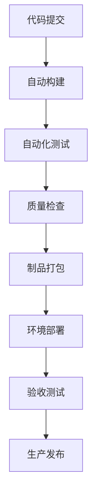
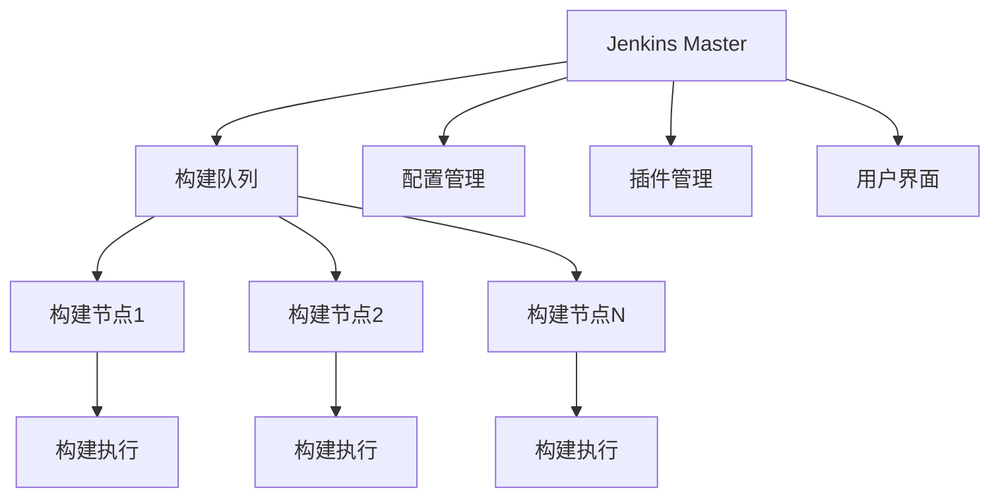

# 第1章：Jenkins介绍和基础概念

## 📖 章节概述

本章将从零开始介绍Jenkins，包括CI/CD基本概念、Jenkins的核心特性、以及它如何帮助开发团队实现自动化。

## 1.1 什么是CI/CD？

### 1.1.1 持续集成 (Continuous Integration)

**持续集成**是一种软件开发实践，开发人员频繁地将代码变更集成到主干（通常是每天多次）。每次集成都通过自动化的构建和测试来验证，从而尽早发现集成错误。

**核心原则：**
- 频繁提交代码到主干
- 自动化构建过程
- 自动化测试执行
- 快速反馈机制

**实际案例：**
```
开发团队A有10名开发人员，每天提交50次代码变更
→ 每次提交触发自动化构建和测试
→ 构建失败时立即通知相关开发人员
→ 确保代码库始终处于可部署状态
```

### 1.1.2 持续交付 (Continuous Delivery)

**持续交付**是在持续集成的基础上，将代码变更自动部署到测试或生产环境。其目标是让软件产品在短时间内具备可发布的条件。

**关键特征：**
- 自动化部署流程
- 一键式发布能力
- 环境一致性管理
- 回滚机制保障

**持续交付 vs 持续部署：**
- **持续交付**：自动化部署到准生产环境，需要人工审批才能发布到生产
- **持续部署**：完全自动化，代码变更通过测试后自动部署到生产环境

### 1.1.3 CI/CD的价值链



## 1.2 Jenkins介绍

### 1.2.1 Jenkins的起源和发展

**历史背景：**
- 2004年：Hudson项目诞生（Sun Microsystems）
- 2011年：Oracle与社区分歧，Hudson分叉为Jenkins
- 2014年：Jenkins成为独立的开源项目
- 2020年：Jenkins X发布，专注于云原生CI/CD

**版本演进：**
- Jenkins 1.x：经典版本，插件生态丰富
- Jenkins 2.x：引入Pipeline as Code，现代化改进
- Jenkins X：云原生版本，Kubernetes原生支持

### 1.2.2 Jenkins的核心特性

#### 1. 插件生态系统
```
Jenkins本身是一个框架，通过插件扩展功能
目前有超过1800个官方插件
覆盖构建、测试、部署、监控等各个领域
```

#### 2. Pipeline as Code
```groovy
// 示例：声明式Pipeline
pipeline {
    agent any
    stages {
        stage('Build') {
            steps {
                sh 'mvn clean compile'
            }
        }
    }
}
```

#### 3. 分布式构建
```
支持在主从架构下分布构建任务
可以跨多个服务器和云平台执行构建
提高构建效率和资源利用率
```

#### 4. 丰富的集成能力
```
版本控制：Git、SVN、Mercurial
构建工具：Maven、Gradle、Ant、Make
测试框架：JUnit、TestNG、Selenium
部署工具：Docker、Kubernetes、Ansible
通知系统：邮件、Slack、微信、钉钉
```

### 1.2.3 Jenkins在DevOps中的定位

**DevOps工具链中的核心角色：**

```
代码管理 (Git) → 持续集成 (Jenkins) → 制品管理 (Nexus/Artifactory)
    ↓
配置管理 (Ansible) → 容器编排 (Kubernetes) → 监控告警 (Prometheus)
```

**Jenkins的价值体现：**
- **自动化桥梁**：连接开发、测试、运维各个环节
- **质量门禁**：确保代码变更符合质量标准
- **效率提升**：减少人工操作，提高交付速度
- **可视化反馈**：提供构建状态的可视化展示

## 1.3 Jenkins架构深度解析

### 1.3.1 核心组件架构



#### Master节点职责
1. **调度构建**：接收构建请求并分配到合适的节点
2. **管理配置**：存储任务配置和系统设置
3. **提供UI**：Web界面和API接口
4. **插件管理**：加载和管理所有插件

#### Agent节点职责
1. **执行构建**：实际运行构建任务
2. **环境隔离**：提供独立的构建环境
3. **资源管理**：管理构建所需的计算资源

### 1.3.2 构建执行流程

**详细构建流程：**

```
1. 触发事件（代码提交、定时、手动）
   ↓
2. 创建构建任务并加入队列
   ↓
3. Master选择可用Agent
   ↓
4. Agent下载源码和依赖
   ↓
5. 执行构建步骤
   ↓
6. 收集构建结果和产物
   ↓
7. 发送通知和报告
   ↓
8. 更新构建历史
```

### 1.3.3 数据存储架构

#### 配置文件存储
```
JENKINS_HOME/
├── config.xml          # 主配置文件
├── jobs/               # 任务配置目录
│   ├── job1/
│   │   ├── config.xml
│   │   └── builds/     # 构建历史
├── plugins/            # 插件目录
├── users/              # 用户配置
└── workspace/          # 工作空间
```

#### 构建产物管理
```
构建产物包括：
- 编译后的二进制文件
- 测试报告和覆盖率
- 代码质量分析报告
- 部署包和镜像
- 日志文件和元数据
```

## 1.4 Jenkins与其他CI/CD工具对比

### 1.4.1 主流CI/CD工具特性对比

| 特性 | Jenkins | GitLab CI | GitHub Actions | CircleCI |
|------|---------|-----------|----------------|----------|
| 开源程度 | 完全开源 | 社区版开源 | 部分开源 | 商业软件 |
| 插件生态 | ★★★★★ | ★★★★ | ★★★ | ★★★★ |
| 学习曲线 | 中等 | 简单 | 简单 | 简单 |
| 分布式构建 | 强大 | 有限 | 有限 | 强大 |
| 云原生支持 | 良好 | 优秀 | 优秀 | 优秀 |
| 社区支持 | 强大 | 强大 | 强大 | 良好 |

### 1.4.2 Jenkins的优势场景

#### 适合使用Jenkins的场景：
1. **企业级复杂场景**：需要高度定制化的CI/CD流程
2. **混合云环境**：需要在多种基础设施上运行构建
3. **遗留系统集成**：需要与各种传统系统集成
4. **大规模分布式**：需要管理数百个构建节点
5. **特殊需求定制**：需要开发自定义插件和扩展

#### 不适合使用Jenkins的场景：
1. **小型简单项目**：GitHub Actions或GitLab CI更合适
2. **纯云原生项目**：Jenkins X或Tekton可能更优
3. **快速原型开发**：需要快速搭建CI/CD环境

## 1.5 Jenkins生态系统

### 1.5.1 核心插件分类

#### 源码管理插件
```
Git Plugin：Git集成
Subversion Plugin：SVN集成
GitHub Plugin：GitHub深度集成
Bitbucket Plugin：Bitbucket集成
```

#### 构建工具插件
```
Maven Integration Plugin：Maven构建
Gradle Plugin：Gradle构建
Ant Plugin：Ant构建
MSBuild Plugin：.NET构建
```

#### 测试和报告插件
```
JUnit Plugin：单元测试报告
HTML Publisher Plugin：HTML报告
Cobertura Plugin：代码覆盖率
JaCoCo Plugin：Java代码覆盖率
```

#### 部署和发布插件
```
Deploy to container Plugin：容器部署
Kubernetes Plugin：K8s部署
Docker Pipeline Plugin：Docker集成
Ansible Plugin：Ansible集成
```

### 1.5.2 社区和资源

#### 官方资源
- **官方网站**：https://www.jenkins.io
- **文档中心**：https://www.jenkins.io/doc/
- **插件索引**：https://plugins.jenkins.io
- **GitHub仓库**：https://github.com/jenkinsci

#### 社区资源
- **Jenkins中文社区**：活跃的中文技术社区
- **Stack Overflow**：技术问答平台
- **Jenkins User Conference**：年度用户大会

## 1.6 本章小结

### 关键知识点回顾
1. **CI/CD基本概念**：理解持续集成和持续交付的价值
2. **Jenkins核心特性**：插件生态、Pipeline as Code、分布式构建
3. **Jenkins架构**：Master-Agent架构、构建执行流程
4. **工具对比**：了解Jenkins在CI/CD工具链中的定位
5. **生态系统**：熟悉核心插件和社区资源

### 实践建议
- 开始思考如何将现有项目接入CI/CD流程
- 了解团队的技术栈和Jenkins的集成可能性
- 准备学习环境：安装Java、Docker等基础软件

### 下一章预告
第2章将深入讲解Jenkins的安装和配置，包括各种安装方式、系统配置、以及插件管理的最佳实践。

---

**思考题：**
1. 你的项目目前是如何进行构建和测试的？
2. 如果引入Jenkins，你觉得最大的挑战是什么？
3. 你希望Jenkins解决哪些具体的痛点？

在下一章中，我们将通过实际操作来安装和配置Jenkins，开始真正的动手实践。