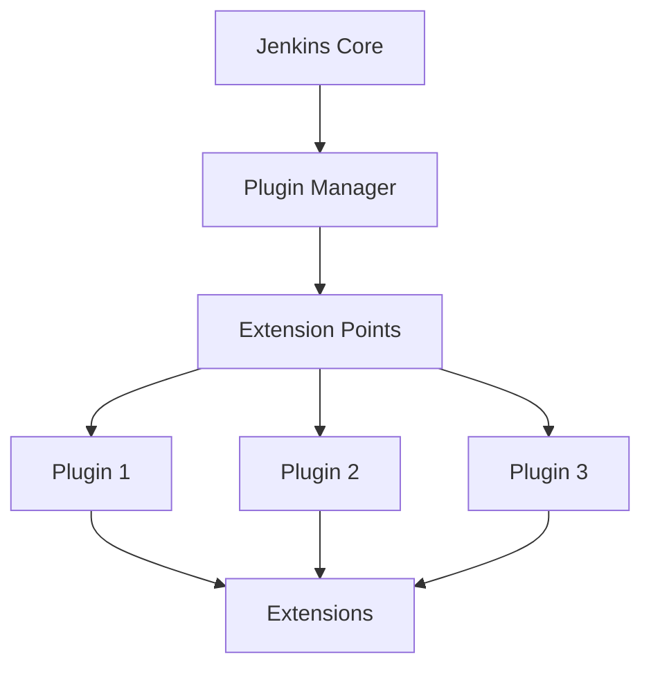

# 第4章：Jenkins插件生态系统

## 本章概述
Jenkins的强大之处在于其丰富的插件生态系统。本章将深入探讨Jenkins插件的原理、使用和管理，包括核心插件的使用、自定义插件开发、插件安全等重要内容。

## 4.1 Jenkins插件基础

### 4.1.1 插件架构和原理

#### 插件系统架构
Jenkins采用微内核架构，核心功能通过插件实现：



#### 插件核心概念
- **Extension Point**：插件扩展点，插件可以实现的接口
- **Extension**：插件的具体实现
- **Plugin Manager**：插件生命周期管理
- **Update Center**：插件更新源

#### 插件依赖关系
插件之间存在复杂的依赖关系：

```java
// 插件依赖示例
@Extension
public class MyBuildStep extends Builder {
    // 依赖其他插件的功能
    @Inject
    private transient CredentialsProvider credentialsProvider;
    
    @DataBoundConstructor
    public MyBuildStep(String param1, String param2) {
        // 构造函数
    }
}
```

### 4.1.2 插件安装和配置

#### 图形界面安装
1. 访问Jenkins管理界面
2. 进入"管理插件"页面
3. 选择"可用插件"标签页
4. 搜索并安装所需插件

#### 命令行安装
```bash
# 使用Jenkins CLI安装插件
java -jar jenkins-cli.jar -s http://localhost:8080/ install-plugin plugin-name

# 批量安装插件
java -jar jenkins-cli.jar -s http://localhost:8080/ install-plugin \
    git:4.0.0 \
    pipeline:2.6 \
    credentials:2.1.10
```

#### 插件配置文件
```xml
<!-- 插件配置示例 -->
<com.cloudbees.plugins.credentials.SystemCredentialsProvider plugin="credentials@2.1.10">
  <domainCredentialsMap class="hudson.util.CopyOnWriteMap$Hash">
    <entry>
      <com.cloudbees.plugins.credentials.domains.Domain>
        <name>example.com</name>
        <specifications/>
      </com.cloudbees.plugins.credentials.domains.Domain>
      <java.util.concurrent.CopyOnWriteArrayList>
        <com.cloudbees.plugins.credentials.impl.UsernamePasswordCredentialsImpl>
          <scope>GLOBAL</scope>
          <id>git-credentials</id>
          <description>Git credentials for example.com</description>
          <username>user</username>
          <password>{AQAAABAAAAAQ7zS2k3U7KZQ4X2V5qG4=}</password>
        </com.cloudbees.plugins.credentials.impl.UsernamePasswordCredentialsImpl>
      </java.util.concurrent.CopyOnWriteArrayList>
    </entry>
  </domainCredentialsMap>
</com.cloudbees.plugins.credentials.SystemCredentialsProvider>
```

## 4.2 核心插件详解

### 4.2.1 Git插件深度使用

#### Git插件配置
```groovy
// Jenkinsfile中的Git配置
pipeline {
    agent any
    
    triggers {
        pollSCM('H/5 * * * *') // 每5分钟轮询SCM
    }
    
    options {
        gitConnection('git@github.com:example/repo.git')
        gitCredentials('github-ssh-key')
    }
    
    stages {
        stage('Checkout') {
            steps {
                checkout([
                    $class: 'GitSCM',
                    branches: [[name: '*/main']],
                    extensions: [
                        [$class: 'CloneOption', depth: 1, timeout: 10],
                        [$class: 'CleanBeforeCheckout'],
                        [$class: 'LocalBranch', localBranch: 'main']
                    ],
                    userRemoteConfigs: [[
                        credentialsId: 'github-credentials',
                        url: 'https://github.com/example/repo.git'
                    ]]
                ])
            }
        }
    }
}
```

#### 高级Git操作
```groovy
// 复杂Git操作示例
stage('Git Operations') {
    steps {
        script {
            // 获取Git信息
            def gitCommit = checkout(scm)
            def commitHash = gitCommit.GIT_COMMIT
            def branch = gitCommit.GIT_BRANCH
            
            // 创建标签
            sh '''
                git config user.email "jenkins@example.com"
                git config user.name "Jenkins"
                git tag -a "build-${env.BUILD_NUMBER}" -m "Automated build ${env.BUILD_NUMBER}"
                git push origin "build-${env.BUILD_NUMBER}"
            '''
            
            // 多分支支持
            if (branch == 'develop') {
                // 开发分支特定操作
                sh 'git merge --no-ff main'
            }
        }
    }
}
```

### 4.2.2 Pipeline插件深入

#### 声明式Pipeline高级特性
```groovy
// 复杂的声明式Pipeline
pipeline {
    agent {
        kubernetes {
            label 'jenkins-agent'
            yaml '''
                apiVersion: v1
                kind: Pod
                spec:
                  containers:
                  - name: jnlp
                    image: jenkins/jnlp-slave:alpine
                    volumeMounts:
                    - name: workspace-volume
                      mountPath: /home/jenkins/agent
                  - name: maven
                    image: maven:3.8.1-openjdk-11
                    command: ['cat']
                    tty: true
                    volumeMounts:
                    - name: workspace-volume
                      mountPath: /home/jenkins/agent
                  volumes:
                  - name: workspace-volume
                    emptyDir: {}
            '''
        }
    }
    
    environment {
        MAVEN_OPTS = '-Dmaven.repo.local=/home/jenkins/agent/.m2/repository'
        JAVA_HOME = '/usr/lib/jvm/java-11-openjdk'
    }
    
    parameters {
        choice(name: 'DEPLOY_ENV', choices: ['dev', 'staging', 'prod'], description: '部署环境')
        booleanParam(name: 'RUN_TESTS', defaultValue: true, description: '是否运行测试')
        string(name: 'IMAGE_TAG', defaultValue: 'latest', description: '镜像标签')
    }
    
    stages {
        stage('Build') {
            parallel {
                stage('Build Application') {
                    steps {
                        container('maven') {
                            sh 'mvn clean compile -DskipTests'
                        }
                    }
                }
                stage('Build Docker Image') {
                    steps {
                        script {
                            def customImage = docker.build("myapp:${params.IMAGE_TAG}")
                            // 保存镜像信息供后续使用
                            env.BUILT_IMAGE = customImage.id
                        }
                    }
                }
            }
        }
        
        stage('Test') {
            when {
                expression { params.RUN_TESTS.toBoolean() }
            }
            steps {
                container('maven') {
                    sh 'mvn test'
                }
            }
            post {
                always {
                    junit 'target/surefire-reports/*.xml'
                }
                failure {
                    emailext (
                        subject: "构建 ${env.JOB_NAME} - ${env.BUILD_NUMBER} 测试失败",
                        body: "测试阶段失败，请检查日志",
                        to: 'dev-team@example.com'
                    )
                }
            }
        }
    }
    
    post {
        always {
            // 清理资源
            cleanWs()
        }
        success {
            script {
                // 发送成功通知
                slackSend(
                    channel: '#builds',
                    message: "构建 ${env.JOB_NAME} #${env.BUILD_NUMBER} 成功"
                )
            }
        }
    }
}
```

#### 脚本式Pipeline高级用法
```groovy
// 复杂的脚本式Pipeline
node('master') {
    try {
        stage('Setup') {
            // 环境设置
            env.NODE_ENV = 'production'
            
            // 加载外部配置
            def config = load 'config/deploy.groovy'
            
            // 动态参数处理
            properties([
                parameters([
                    string(name: 'BRANCH', defaultValue: 'main'),
                    booleanParam(name: 'DEPLOY', defaultValue: false)
                ])
            ])
        }
        
        stage('Checkout') {
            checkout scm
            
            // 获取Git信息
            def gitCommit = sh(script: 'git rev-parse --short HEAD', returnStdout: true).trim()
            currentBuild.displayName = "#${env.BUILD_NUMBER}-${gitCommit}"
        }
        
        stage('Build') {
            // 并行构建
            def builds = [:]
            
            builds['Frontend'] = {
                node('frontend') {
                    sh 'npm install'
                    sh 'npm run build'
                    stash name: 'frontend-build', includes: 'dist/**'
                }
            }
            
            builds['Backend'] = {
                node('backend') {
                    sh 'mvn clean package -DskipTests'
                    stash name: 'backend-build', includes: 'target/*.jar'
                }
            }
            
            parallel builds
        }
        
        stage('Integration') {
            // 集成测试
            node('integration') {
                unstash 'frontend-build'
                unstash 'backend-build'
                
                // 启动服务并测试
                sh './scripts/start-services.sh'
                sh './scripts/run-integration-tests.sh'
            }
        }
        
        stage('Deploy') {
            when {
                expression { params.DEPLOY }
            }
            
            // 蓝绿部署
            def deployment = load 'scripts/deployment.groovy'
            deployment.deploy(params.BRANCH)
        }
        
    } catch (Exception e) {
        currentBuild.result = 'FAILURE'
        error "构建失败: ${e.message}"
    } finally {
        // 清理资源
        step([$class: 'WsCleanup'])
    }
}
```

## 4.3 自定义插件开发

### 4.3.1 插件开发环境搭建

#### Maven项目配置
```xml
<?xml version="1.0" encoding="UTF-8"?>
<project xmlns="http://maven.apache.org/POM/4.0.0"
         xmlns:xsi="http://www.w3.org/2001/XMLSchema-instance"
         xsi:schemaLocation="http://maven.apache.org/POM/4.0.0 
         http://maven.apache.org/xsd/maven-4.0.0.xsd">
    <modelVersion>4.0.0</modelVersion>
    
    <parent>
        <groupId>org.jenkins-ci.plugins</groupId>
        <artifactId>plugin</artifactId>
        <version>4.40</version>
        <relativePath />
    </parent>
    
    <groupId>com.example.jenkins</groupId>
    <artifactId>my-custom-plugin</artifactId>
    <version>1.0.0</version>
    <packaging>hpi</packaging>
    
    <properties>
        <jenkins.version>2.303.1</jenkins.version>
        <java.level>8</java.level>
        <hpi.compatibleSinceVersion>2.0</hpi.compatibleSinceVersion>
    </properties>
    
    <dependencies>
        <dependency>
            <groupId>org.jenkins-ci.plugins.workflow</groupId>
            <artifactId>workflow-step-api</artifactId>
            <version>2.23</version>
        </dependency>
        <dependency>
            <groupId>org.jenkins-ci.plugins</groupId>
            <artifactId>credentials</artifactId>
            <version>2.1.10</version>
        </dependency>
    </dependencies>
    
    <repositories>
        <repository>
            <id>repo.jenkins-ci.org</id>
            <url>https://repo.jenkins-ci.org/public/</url>
        </repository>
    </repositories>
</project>
```

#### 开发工具配置
```groovy
// build.gradle (替代Maven)
plugins {
    id 'org.jenkins-ci.jpi' version '0.43.0'
}

jenkinsPlugin {
    coreVersion = '2.303.1'
    displayName = 'My Custom Plugin'
    url = 'https://github.com/example/my-custom-plugin'
    compatibleSinceVersion = '2.0'
    
    developers {
        developer {
            id 'developer'
            name 'Developer Name'
            email 'developer@example.com'
        }
    }
}

dependencies {
    compile 'org.jenkins-ci.plugins:credentials:2.1.10'
    compile 'org.jenkins-ci.plugins.workflow:workflow-step-api:2.23'
}
```

### 4.3.2 构建步骤插件开发

#### 基础构建步骤
```java
package com.example.jenkins.plugin;

import hudson.Extension;
import hudson.FilePath;
import hudson.Launcher;
import hudson.model.AbstractProject;
import hudson.model.Run;
import hudson.model.TaskListener;
import hudson.tasks.BuildStepDescriptor;
import hudson.tasks.Builder;
import hudson.tasks.BuildStepMonitor;
import hudson.util.FormValidation;
import jenkins.tasks.SimpleBuildStep;
import org.kohsuke.stapler.DataBoundConstructor;
import org.kohsuke.stapler.DataBoundSetter;
import org.kohsuke.stapler.QueryParameter;

import javax.annotation.Nonnull;
import java.io.IOException;
import java.io.PrintStream;

/**
 * 自定义构建步骤插件
 */
public class CustomBuildStep extends Builder implements SimpleBuildStep {
    
    private final String scriptPath;
    private String environment;
    private boolean verbose;
    
    @DataBoundConstructor
    public CustomBuildStep(String scriptPath) {
        this.scriptPath = scriptPath;
    }
    
    @DataBoundSetter
    public void setEnvironment(String environment) {
        this.environment = environment;
    }
    
    @DataBoundSetter
    public void setVerbose(boolean verbose) {
        this.verbose = verbose;
    }
    
    public String getScriptPath() {
        return scriptPath;
    }
    
    public String getEnvironment() {
        return environment;
    }
    
    public boolean isVerbose() {
        return verbose;
    }
    
    @Override
    public void perform(@Nonnull Run<?, ?> run, 
                       @Nonnull FilePath workspace, 
                       @Nonnull Launcher launcher, 
                       @Nonnull TaskListener listener) throws InterruptedException, IOException {
        
        PrintStream logger = listener.getLogger();
        logger.println("开始执行自定义构建步骤...");
        
        // 验证脚本路径
        FilePath scriptFile = workspace.child(scriptPath);
        if (!scriptFile.exists()) {
            throw new IOException("脚本文件不存在: " + scriptPath);
        }
        
        // 设置环境变量
        if (environment != null && !environment.trim().isEmpty()) {
            logger.println("设置环境: " + environment);
        }
        
        // 执行脚本
        int exitCode = launcher.launch()
                .cmds("bash", scriptFile.getRemote())
                .envs("CUSTOM_ENV", environment)
                .stdout(logger)
                .stderr(logger)
                .pwd(workspace)
                .join();
        
        if (exitCode != 0) {
            throw new RuntimeException("脚本执行失败，退出码: " + exitCode);
        }
        
        logger.println("自定义构建步骤执行完成");
    }
    
    @Override
    public BuildStepMonitor getRequiredMonitorService() {
        return BuildStepMonitor.NONE;
    }
    
    @Extension
    public static final class DescriptorImpl extends BuildStepDescriptor<Builder> {
        
        @Override
        public boolean isApplicable(Class<? extends AbstractProject> jobType) {
            return true;
        }
        
        @Override
        public String getDisplayName() {
            return "自定义构建步骤";
        }
        
        public FormValidation doCheckScriptPath(@QueryParameter String value) {
            if (value.trim().isEmpty()) {
                return FormValidation.error("脚本路径不能为空");
            }
            if (!value.endsWith(".sh") && !value.endsWith(".bash")) {
                return FormValidation.warning("建议使用.sh或.bash后缀的脚本文件");
            }
            return FormValidation.ok();
        }
    }
}
```

#### Pipeline步骤插件
```java
package com.example.jenkins.plugin;

import org.jenkinsci.plugins.workflow.steps.Step;
import org.jenkinsci.plugins.workflow.steps.StepContext;
import org.jenkinsci.plugins.workflow.steps.StepDescriptor;
import org.jenkinsci.plugins.workflow.steps.StepExecution;
import org.kohsuke.stapler.DataBoundConstructor;

import javax.annotation.Nonnull;
import java.util.Collections;
import java.util.Set;

/**
 * Pipeline步骤插件
 */
public class CustomPipelineStep extends Step {
    
    private final String message;
    private String level;
    
    @DataBoundConstructor
    public CustomPipelineStep(String message) {
        this.message = message;
    }
    
    public String getMessage() {
        return message;
    }
    
    public String getLevel() {
        return level;
    }
    
    public void setLevel(String level) {
        this.level = level;
    }
    
    @Override
    public StepExecution start(StepContext context) throws Exception {
        return new CustomPipelineStepExecution(this, context);
    }
    
    private static class CustomPipelineStepExecution extends StepExecution {
        
        private final CustomPipelineStep step;
        
        CustomPipelineStepExecution(CustomPipelineStep step, StepContext context) {
            super(context);
            this.step = step;
        }
        
        @Override
        public boolean start() throws Exception {
            // 获取上下文
            TaskListener listener = getContext().get(TaskListener.class);
            
            // 记录日志
            String level = step.getLevel() != null ? step.getLevel() : "INFO";
            listener.getLogger().println("[" + level + "] " + step.getMessage());
            
            getContext().onSuccess(null);
            return true;
        }
    }
    
    @Extension
    public static class DescriptorImpl extends StepDescriptor {
        
        @Override
        public String getFunctionName() {
            return "customStep";
        }
        
        @Override
        public String getDisplayName() {
            return "自定义Pipeline步骤";
        }
        
        @Override
        public Set<? extends Class<?>> getRequiredContext() {
            return Collections.singleton(TaskListener.class);
        }
    }
}
```

## 4.4 插件管理和维护

### 4.4.1 插件生命周期管理

#### 插件版本控制
```groovy
// Jenkinsfile中的插件版本管理
properties([
    parameters([
        choice(name: 'PLUGIN_VERSION', 
               choices: ['2.0.0', '2.1.0', '2.2.0'], 
               description: '插件版本')
    ])
])

pipeline {
    agent any
    
    stages {
        stage('Plugin Management') {
            steps {
                script {
                    // 检查插件依赖
                    def pluginManager = Jenkins.instance.pluginManager
                    def installedPlugins = pluginManager.getPlugins()
                    
                    // 验证插件版本兼容性
                    def requiredPlugins = [
                        'git': '4.0.0',
                        'pipeline': '2.6',
                        'credentials': '2.1.10'
                    ]
                    
                    requiredPlugins.each { pluginName, requiredVersion ->
                        def plugin = installedPlugins.find { it.getShortName() == pluginName }
                        if (!plugin) {
                            error("缺少必需插件: ${pluginName}")
                        }
                        if (plugin.getVersion() < requiredVersion) {
                            error("插件 ${pluginName} 版本过低，需要 ${requiredVersion}")
                        }
                    }
                }
            }
        }
    }
}
```

#### 插件更新策略
```bash
#!/bin/bash
# 插件更新脚本

JENKINS_URL="http://localhost:8080"
JENKINS_CLI_JAR="/var/jenkins_home/jenkins-cli.jar"
JENKINS_AUTH="admin:password"

# 备份当前插件配置
cp /var/jenkins_home/plugins.txt /var/jenkins_home/plugins.txt.backup

# 获取可更新插件列表
UPDATABLE_PLUGINS=$(curl -s "${JENKINS_URL}/pluginManager/api/json?depth=1" | \
    jq -r '.plugins[] | select(.hasUpdate) | .shortName')

echo "可更新插件:"
echo "$UPDATABLE_PLUGINS"

# 逐个更新插件
for PLUGIN in $UPDATABLE_PLUGINS; do
    echo "正在更新插件: $PLUGIN"
    java -jar $JENKINS_CLI_JAR -s $JENKINS_URL -auth $JENKINS_AUTH \
        install-plugin $PLUGIN -deploy -restart
    
    # 等待Jenkins重启
    sleep 30
    
    # 验证Jenkins是否就绪
    until curl -s "$JENKINS_URL" > /dev/null; do
        echo "等待Jenkins启动..."
        sleep 10
    done
    
    echo "插件 $PLUGIN 更新完成"
done

# 更新插件列表文件
java -jar $JENKINS_CLI_JAR -s $JENKINS_URL -auth $JENKINS_AUTH \
    list-plugins | sed 's/).*//' | sed 's/(/:/' > /var/jenkins_home/plugins.txt

echo "所有插件更新完成"
```

### 4.4.2 插件安全实践

#### 安全配置检查
```groovy
// 插件安全检查脚本
@NonCPS
def checkPluginSecurity() {
    def securityWarnings = []
    
    // 检查已知漏洞插件
    def vulnerablePlugins = [
        'script-security': ['1.0', '1.1'],  // 已知漏洞版本
        'matrix-auth': ['1.0', '1.1']
    ]
    
    Jenkins.instance.pluginManager.plugins.each { plugin ->
        def pluginName = plugin.getShortName()
        def currentVersion = plugin.getVersion()
        
        // 检查已知漏洞
        if (vulnerablePlugins.containsKey(pluginName)) {
            def badVersions = vulnerablePlugins[pluginName]
            if (badVersions.contains(currentVersion)) {
                securityWarnings.add("插件 ${pluginName} 版本 ${currentVersion} 存在已知安全漏洞")
            }
        }
        
        // 检查插件权限
        if (plugin.hasPermissions()) {
            // 检查敏感权限
            def sensitivePermissions = ['ADMINISTER', 'RUN_SCRIPTS']
            sensitivePermissions.each { perm ->
                if (plugin.hasPermission(perm)) {
                    securityWarnings.add("插件 ${pluginName} 拥有敏感权限: ${perm}")
                }
            }
        }
    }
    
    return securityWarnings
}

// 在Pipeline中使用
pipeline {
    agent any
    
    stages {
        stage('Security Check') {
            steps {
                script {
                    def warnings = checkPluginSecurity()
                    if (warnings) {
                        echo "安全警告:"
                        warnings.each { warning ->
                            echo "- ${warning}"
                        }
                        // 可以配置为失败或只是警告
                        if (env.BRANCH_NAME == 'main') {
                            error("主分支存在安全风险，停止构建")
                        }
                    }
                }
            }
        }
    }
}
```

#### 插件安全策略
```xml
<!-- 插件安全配置示例 -->
<configurations>
    <plugin-security-configuration>
        <!-- 禁用不安全的插件 -->
        <disabled-plugins>
            <string>unsafe-plugin</string>
            <string>legacy-plugin</string>
        </disabled-plugins>
        
        <!-- 插件白名单 -->
        <approved-plugins>
            <string>git</string>
            <string>pipeline</string>
            <string>credentials</string>
            <string>docker</string>
        </approved-plugins>
        
        <!-- 更新策略 -->
        <update-strategy>SECURITY_UPDATES_ONLY</update-strategy>
        
        <!-- 签名验证 -->
        <verify-plugin-signatures>true</verify-plugin-signatures>
    </plugin-security-configuration>
</configurations>
```

## 4.5 实验验证

### 实验4.1：插件开发实战

#### 实验目标
开发一个完整的自定义插件，包括构建步骤和Pipeline支持。

#### 实验步骤
1. 创建插件项目结构
2. 实现构建步骤功能
3. 添加Pipeline支持
4. 测试插件功能
5. 打包和部署

#### 实验代码
创建代码示例目录：
```
devops/jenkins/code/04-plugins-ecosystem/custom-plugin/
├── src/main/java/com/example/
├── Jenkinsfile
├── test/
└── README.md
```

### 实验4.2：插件安全审计

#### 实验目标
对现有Jenkins实例进行插件安全审计。

#### 实验步骤
1. 扫描已安装插件
2. 检查已知漏洞
3. 验证权限配置
4. 生成安全报告

#### 实验代码
```groovy
// 安全审计脚本
pipeline {
    agent any
    
    stages {
        stage('Plugin Audit') {
            steps {
                script {
                    // 执行安全审计
                    def auditReport = auditPlugins()
                    
                    // 生成报告
                    writeFile file: 'plugin-audit-report.json', 
                             text: groovy.json.JsonOutput.toJson(auditReport)
                    
                    // 发布报告
                    publishHTML([
                        allowMissing: false,
                        alwaysLinkToLastBuild: true,
                        keepAll: true,
                        reportDir: '.',
                        reportFiles: 'plugin-audit-report.json',
                        reportName: 'Plugin Security Audit Report'
                    ])
                }
            }
        }
    }
}

@NonCPS
def auditPlugins() {
    def report = [
        timestamp: new Date().format('yyyy-MM-dd HH:mm:ss'),
        jenkinsVersion: Jenkins.getVersion().toString(),
        plugins: []
    ]
    
    Jenkins.instance.pluginManager.plugins.each { plugin ->
        def pluginInfo = [
            name: plugin.getShortName(),
            displayName: plugin.getDisplayName(),
            version: plugin.getVersion(),
            enabled: plugin.isEnabled(),
            securityIssues: []
        ]
        
        // 安全检查逻辑
        // ...
        
        report.plugins.add(pluginInfo)
    }
    
    return report
}
```

## 本章总结

本章深入探讨了Jenkins插件生态系统的各个方面：

1. **插件基础架构** - 理解了插件系统的核心原理
2. **核心插件使用** - 掌握了Git和Pipeline插件的深度使用
3. **自定义插件开发** - 学会了开发自己的Jenkins插件
4. **插件管理和维护** - 掌握了插件的生命周期管理
5. **插件安全实践** - 了解了插件安全的重要性和实践方法

通过本章的学习，您应该能够：
- 熟练使用Jenkins核心插件
- 开发和维护自定义插件
- 管理复杂的插件依赖关系
- 实施插件安全最佳实践
- 解决插件相关的各种问题

下一章将深入探讨Jenkins的分布式构建能力，这是实现大规模CI/CD的关键技术。