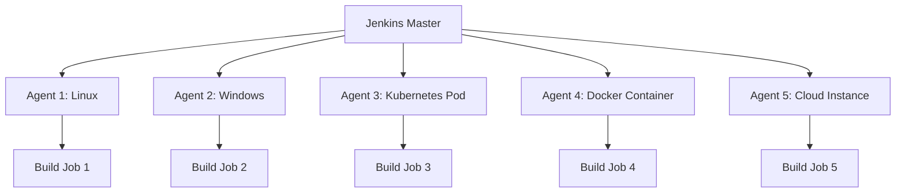

# 第5章：Jenkins分布式构建

## 本章概述
本章将深入探讨Jenkins的分布式构建能力，这是实现大规模CI/CD的关键技术。我们将学习如何配置和管理构建节点、实现负载均衡、优化构建性能，以及处理分布式环境中的各种挑战。

## 5.1 分布式构建基础

### 5.1.1 分布式架构原理

#### Jenkins分布式架构
Jenkins采用主从架构实现分布式构建：



#### 核心组件
- **Master节点**：Jenkins主服务器，负责调度和管理
- **Agent节点**：构建执行节点，执行具体的构建任务
- **连接协议**：JNLP、SSH、Docker、Kubernetes等
- **资源管理**：CPU、内存、磁盘、网络资源分配

#### 分布式构建优势
1. **横向扩展**：通过添加节点提升构建能力
2. **环境隔离**：不同项目使用不同构建环境
3. **负载均衡**：智能分配构建任务到可用节点
4. **高可用性**：节点故障不影响整体构建能力

### 5.1.2 节点配置和管理

#### 静态节点配置
```groovy
// 通过Groovy脚本配置节点
import jenkins.model.*
import hudson.model.*
import hudson.slaves.*

// 创建Linux节点
DumbSlave linuxNode = new DumbSlave(
    "linux-build-node",
    "/home/jenkins/workspace",
    new JNLPLauncher()
)

linuxNode.setNumExecutors(4)
linuxNode.setLabelString("linux docker maven")
linuxNode.setMode(Node.Mode.EXCLUSIVE)
linuxNode.setRetentionStrategy(new RetentionStrategy.Always())

// 创建Windows节点
DumbSlave windowsNode = new DumbSlave(
    "windows-build-node",
    "C:\\jenkins\\workspace",
    new JNLPLauncher()
)

windowsNode.setNumExecutors(2)
windowsNode.setLabelString("windows dotnet")
windowsNode.setMode(Node.Mode.NORMAL)

// 添加到Jenkins
Jenkins.instance.addNode(linuxNode)
Jenkins.instance.addNode(windowsNode)
```

#### 动态节点管理
```groovy
// 动态节点管理脚本
@NonCPS
def manageNodes() {
    def jenkins = Jenkins.instance
    
    // 获取所有节点
    def nodes = jenkins.nodes
    
    // 检查节点状态
    nodes.each { node ->
        def computer = node.toComputer()
        
        if (computer.isOnline()) {
            println "节点 ${node.displayName} 在线"
            
            // 检查资源使用情况
            def load = computer.getMonitor(hudson.node_monitors.SwapSpaceMonitor.class)
            if (load != null && load.availablePhysicalMemory < 1024 * 1024 * 1024) {
                println "警告: 节点 ${node.displayName} 内存不足"
            }
        } else {
            println "节点 ${node.displayName} 离线"
            
            // 尝试重新连接
            if (computer.getLaunchSupported()) {
                computer.doLaunch()
                println "正在启动节点 ${node.displayName}"
            }
        }
    }
    
    // 统计信息
    def onlineNodes = nodes.findAll { it.toComputer().isOnline() }
    def totalExecutors = onlineNodes.sum { it.numExecutors }
    
    println "在线节点: ${onlineNodes.size()}/${nodes.size()}"
    println "总执行器数: ${totalExecutors}"
}

// 在Pipeline中使用
pipeline {
    agent any
    
    stages {
        stage('Node Management') {
            steps {
                script {
                    manageNodes()
                }
            }
        }
    }
}
```

## 5.2 节点类型和连接方式

### 5.2.1 持久化节点

#### SSH节点配置
```groovy
// SSH节点配置示例
import jenkins.model.*
import hudson.plugins.sshslaves.*
import hudson.slaves.*

// 创建SSH连接配置
SSHLauncher sshLauncher = new SSHLauncher(
    "build-server.example.com", // 主机名
    22,                          // SSH端口
    "jenkins",                   // 用户名
    "",                          // 密码（建议使用密钥）
    "/home/jenkins/.ssh/id_rsa", // 私钥路径
    "",                          // 密钥密码
    "",                          // JVM选项
    "",                          // Java路径
    60,                          // 启动超时时间
    3,                           // 重试次数
    30                           // 重试等待时间
)

// 创建节点
DumbSlave sshNode = new DumbSlave(
    "ssh-build-node",
    "/home/jenkins/workspace",
    sshLauncher
)

sshNode.setNumExecutors(4)
sshNode.setLabelString("linux production")
sshNode.setMode(Node.Mode.NORMAL)

Jenkins.instance.addNode(sshNode)
```

#### JNLP节点配置
```bash
#!/bin/bash
# JNLP节点启动脚本

JENKINS_URL="http://jenkins.example.com:8080"
SECRET="your-agent-secret"
NODE_NAME="jnlp-build-node"
WORKSPACE="/home/jenkins/workspace"

# 下载agent.jar
wget "${JENKINS_URL}/jnlpJars/agent.jar" -O agent.jar

# 启动JNLP agent
java -jar agent.jar \
    -jnlpUrl "${JENKINS_URL}/computer/${NODE_NAME}/slave-agent.jnlp" \
    -secret "${SECRET}" \
    -workDir "${WORKSPACE}" \
    -noReconnect

# 或者使用Docker方式运行
# docker run -d \
#   --name jenkins-agent \
#   -v /var/run/docker.sock:/var/run/docker.sock \
#   -v /home/jenkins/workspace:/home/jenkins/workspace \
#   jenkins/inbound-agent \
#   -url "${JENKINS_URL}" \
#   -secret "${SECRET}" \
#   -name "${NODE_NAME}"
```

### 5.2.2 动态节点

#### Docker节点
```groovy
// Docker节点配置
pipeline {
    agent {
        docker {
            image 'maven:3.8.1-openjdk-11'
            label 'docker'
            args '-v /home/jenkins/.m2:/root/.m2'
            reuseNode true
        }
    }
    
    stages {
        stage('Build in Docker') {
            steps {
                sh 'mvn clean compile'
            }
        }
    }
}

// 多容器Docker节点
pipeline {
    agent {
        docker {
            image 'node:14-alpine'
            label 'docker'
            args '--network host'
        }
    }
    
    stages {
        stage('Frontend Build') {
            steps {
                sh 'npm install'
                sh 'npm run build'
            }
        }
        
        stage('Backend Build') {
            agent {
                docker {
                    image 'maven:3.8.1-openjdk-11'
                    label 'docker'
                    args '-v /home/jenkins/.m2:/root/.m2'
                    reuseNode true
                }
            }
            steps {
                sh 'mvn clean package'
            }
        }
    }
}
```

#### Kubernetes节点
```groovy
// Kubernetes节点配置
pipeline {
    agent {
        kubernetes {
            label 'kubernetes'
            yaml '''
apiVersion: v1
kind: Pod
metadata:
  labels:
    app: jenkins-agent
spec:
  containers:
  - name: jnlp
    image: jenkins/inbound-agent:alpine
    env:
    - name: JAVA_OPTS
      value: -Xmx512m -Xms256m
    resources:
      requests:
        memory: "512Mi"
        cpu: "500m"
      limits:
        memory: "1Gi"
        cpu: "1000m"
    volumeMounts:
    - name: workspace-volume
      mountPath: /home/jenkins/agent
  - name: maven
    image: maven:3.8.1-openjdk-11
    command: ['cat']
    tty: true
    resources:
      requests:
        memory: "1Gi"
        cpu: "500m"
      limits:
        memory: "2Gi"
        cpu: "1000m"
    volumeMounts:
    - name: workspace-volume
      mountPath: /home/jenkins/agent
    - name: maven-cache
      mountPath: /root/.m2
  volumes:
  - name: workspace-volume
    emptyDir: {}
  - name: maven-cache
    persistentVolumeClaim:
      claimName: maven-cache-pvc
'''
        }
    }
    
    stages {
        stage('Build') {
            steps {
                container('maven') {
                    sh 'mvn clean compile'
                }
            }
        }
    }
}
```

## 5.3 负载均衡和调度策略

### 5.3.1 标签和表达式

#### 标签使用策略
```groovy
// 基于标签的节点选择
pipeline {
    agent {
        label 'linux && docker && 4cpu'
    }
    
    stages {
        stage('Build') {
            steps {
                script {
                    // 获取当前节点信息
                    def currentNode = currentBuild.rawBuild.getBuiltOn()
                    def computer = currentNode.toComputer()
                    
                    echo "构建节点: ${currentNode.displayName}"
                    echo "节点标签: ${currentNode.labelString}"
                    echo "执行器数: ${currentNode.numExecutors}"
                    echo "在线状态: ${computer.online}"
                }
            }
        }
    }
}

// 动态标签选择
pipeline {
    parameters {
        choice(name: 'BUILD_ENV', choices: ['dev', 'staging', 'prod'], description: '构建环境')
    }
    
    agent {
        node {
            label getBuildNodeLabel(params.BUILD_ENV)
            customWorkspace "/home/jenkins/workspace/${env.JOB_NAME}"
        }
    }
    
    stages {
        stage('Environment Setup') {
            steps {
                script {
                    echo "使用环境: ${params.BUILD_ENV}"
                    echo "节点标签: ${getBuildNodeLabel(params.BUILD_ENV)}"
                }
            }
        }
    }
}

// 获取节点标签的函数
@NonCPS
def getBuildNodeLabel(String env) {
    switch(env) {
        case 'dev':
            return 'linux docker'
        case 'staging':
            return 'linux docker staging'
        case 'prod':
            return 'linux docker production'
        default:
            return 'linux'
    }
}
```

#### 表达式调度
```groovy
// 复杂的节点选择逻辑
pipeline {
    agent none
    
    stages {
        stage('Select Node') {
            steps {
                script {
                    // 根据条件选择节点
                    def selectedNode = selectOptimalNode()
                    
                    echo "选择的节点: ${selectedNode}"
                    
                    // 在选定的节点上执行构建
                    node(selectedNode) {
                        stage('Build on Selected Node') {
                            steps {
                                sh 'mvn clean compile'
                            }
                        }
                    }
                }
            }
        }
    }
}

@NonCPS
def selectOptimalNode() {
    def jenkins = Jenkins.instance
    def availableNodes = jenkins.nodes.findAll { node ->
        def computer = node.toComputer()
        computer != null && computer.online && computer.acceptingTasks
    }
    
    if (availableNodes.isEmpty()) {
        return 'built-in' // 使用内置节点
    }
    
    // 选择负载最低的节点
    def optimalNode = availableNodes.min { node ->
        def computer = node.toComputer()
        computer.countBusy()
    }
    
    return optimalNode.displayName
}
```

### 5.3.2 高级调度策略

#### 负载感知调度
```groovy
// 负载感知调度器
@NonCPS
def scheduleBuild(String jobName, Map requirements) {
    def jenkins = Jenkins.instance
    
    // 获取所有可用节点
    def suitableNodes = jenkins.nodes.findAll { node ->
        def computer = node.toComputer()
        
        // 检查节点是否可用
        if (computer == null || !computer.online || !computer.acceptingTasks) {
            return false
        }
        
        // 检查标签匹配
        if (requirements.labels && !node.labelString.contains(requirements.labels)) {
            return false
        }
        
        // 检查资源可用性
        if (requirements.memory) {
            def memoryMonitor = computer.getMonitor(hudson.node_monitors.SwapSpaceMonitor.class)
            if (memoryMonitor && memoryMonitor.availablePhysicalMemory < requirements.memory * 1024 * 1024) {
                return false
            }
        }
        
        return true
    }
    
    if (suitableNodes.isEmpty()) {
        throw new Exception("没有合适的节点可用")
    }
    
    // 选择最优节点（基于负载和资源）
    def selectedNode = suitableNodes.min { node ->
        def computer = node.toComputer()
        
        // 计算负载分数（忙碌执行器比例 + 内存使用率）
        def loadScore = computer.countBusy() / node.numExecutors
        
        def memoryMonitor = computer.getMonitor(hudson.node_monitors.SwapSpaceMonitor.class)
        if (memoryMonitor) {
            def memoryUsage = 1 - (memoryMonitor.availablePhysicalMemory / memoryMonitor.totalPhysicalMemory)
            loadScore += memoryUsage
        }
        
        return loadScore
    }
    
    return selectedNode.displayName
}

// 使用负载感知调度
pipeline {
    agent none
    
    stages {
        stage('Schedule Build') {
            steps {
                script {
                    def requirements = [
                        labels: 'linux docker',
                        memory: 2048 // 需要2GB内存
                    ]
                    
                    def selectedNode = scheduleBuild(env.JOB_NAME, requirements)
                    
                    echo "调度构建到节点: ${selectedNode}"
                    
                    node(selectedNode) {
                        stage('Build') {
                            steps {
                                sh 'mvn clean compile'
                            }
                        }
                    }
                }
            }
        }
    }
}
```

#### 基于优先级的调度
```groovy
// 优先级调度系统
class PriorityScheduler {
    
    @NonCPS
    static String scheduleWithPriority(String jobName, int priority) {
        def jenkins = Jenkins.instance
        
        // 根据优先级选择节点类型
        def nodeLabel = getNodeLabelByPriority(priority)
        
        // 获取合适的节点
        def suitableNodes = jenkins.nodes.findAll { node ->
            def computer = node.toComputer()
            computer != null && computer.online && 
            computer.acceptingTasks && 
            node.labelString.contains(nodeLabel)
        }
        
        if (suitableNodes.isEmpty()) {
            // 降级处理
            return scheduleWithPriority(jobName, priority - 1)
        }
        
        // 选择负载最低的节点
        return suitableNodes.min { node ->
            node.toComputer().countBusy()
        }.displayName
    }
    
    @NonCPS
    static String getNodeLabelByPriority(int priority) {
        switch(priority) {
            case 1: // 最高优先级
                return 'high-performance'
            case 2: // 高优先级
                return 'production'
            case 3: // 中等优先级
                return 'staging'
            case 4: // 低优先级
                return 'development'
            default: // 最低优先级
                return 'built-in'
        }
    }
}

// 使用优先级调度
pipeline {
    parameters {
        choice(name: 'PRIORITY', choices: ['1', '2', '3', '4'], description: '构建优先级')
    }
    
    agent none
    
    stages {
        stage('Priority Scheduling') {
            steps {
                script {
                    def priority = params.PRIORITY.toInteger()
                    def selectedNode = PriorityScheduler.scheduleWithPriority(env.JOB_NAME, priority)
                    
                    echo "优先级: ${priority}"
                    echo "调度到节点: ${selectedNode}"
                    
                    node(selectedNode) {
                        stage('Build') {
                            steps {
                                sh 'mvn clean compile'
                            }
                        }
                    }
                }
            }
        }
    }
}
```

## 5.4 性能优化和监控

### 5.4.1 构建性能优化

#### 并行构建优化
```groovy
// 最大化并行构建
pipeline {
    agent none
    
    stages {
        stage('Parallel Builds') {
            parallel {
                stage('Unit Tests') {
                    agent {
                        label 'test-node-1'
                    }
                    steps {
                        sh 'mvn test'
                    }
                }
                
                stage('Integration Tests') {
                    agent {
                        label 'test-node-2'
                    }
                    steps {
                        sh 'mvn verify -P integration'
                    }
                }
                
                stage('Static Analysis') {
                    agent {
                        label 'analysis-node'
                    }
                    steps {
                        sh 'mvn checkstyle:checkstyle pmd:pmd'
                    }
                }
            }
        }
        
        stage('Performance Tests') {
            agent {
                label 'performance-node'
            }
            steps {
                sh 'mvn test -P performance'
            }
        }
    }
}
```

#### 缓存优化策略
```groovy
// 分布式缓存优化
pipeline {
    agent {
        docker {
            image 'maven:3.8.1-openjdk-11'
            label 'docker'
            args '-v /shared/maven-cache:/root/.m2'
            reuseNode true
        }
    }
    
    environment {
        MAVEN_OPTS = '-Dmaven.repo.local=/shared/maven-cache'
    }
    
    stages {
        stage('Cache Setup') {
            steps {
                sh '''
                    # 确保缓存目录存在
                    mkdir -p /shared/maven-cache
                    
                    # 设置正确的权限
                    chmod 755 /shared/maven-cache
                '''
            }
        }
        
        stage('Build with Cache') {
            steps {
                sh 'mvn clean compile -Dmaven.test.skip=true'
            }
        }
    }
    
    post {
        always {
            // 清理缓存（可选）
            sh 'mvn dependency:purge-local-repository -DmanualInclude="*:*"'
        }
    }
}
```

### 5.4.2 监控和告警

#### 节点监控
```groovy
// 节点健康监控
pipeline {
    agent any
    
    stages {
        stage('Node Health Check') {
            steps {
                script {
                    def healthReport = monitorNodeHealth()
                    
                    // 生成健康报告
                    writeFile file: 'node-health-report.json', 
                             text: groovy.json.JsonOutput.toJson(healthReport)
                    
                    // 检查健康状态
                    if (healthReport.unhealthyNodes > 0) {
                        echo "警告: 发现 ${healthReport.unhealthyNodes} 个不健康节点"
                        
                        // 发送告警
                        if (env.BRANCH_NAME == 'main') {
                            slackSend(
                                channel: '#jenkins-alerts',
                                message: "⚠️ Jenkins节点健康告警: ${healthReport.unhealthyNodes} 个节点异常"
                            )
                        }
                    }
                }
            }
        }
    }
}

@NonCPS
def monitorNodeHealth() {
    def jenkins = Jenkins.instance
    def report = [
        timestamp: new Date().format('yyyy-MM-dd HH:mm:ss'),
        totalNodes: jenkins.nodes.size(),
        onlineNodes: 0,
        offlineNodes: 0,
        unhealthyNodes: 0,
        nodes: []
    ]
    
    jenkins.nodes.each { node ->
        def computer = node.toComputer()
        def nodeInfo = [
            name: node.displayName,
            online: computer?.online ?: false,
            acceptingTasks: computer?.acceptingTasks ?: false,
            busyExecutors: computer?.countBusy() ?: 0,
            totalExecutors: node.numExecutors,
            healthIndicators: []
        ]
        
        if (computer?.online) {
            report.onlineNodes++
            
            // 检查各种监控指标
            def monitors = computer.monitors
            monitors.each { monitor ->
                if (monitor instanceof hudson.node_monitors.ResponseTimeMonitor) {
                    def responseTime = monitor.getResponseTime(node)
                    if (responseTime > 5000) { // 5秒响应时间阈值
                        nodeInfo.healthIndicators.add("响应时间慢: ${responseTime}ms")
                        report.unhealthyNodes++
                    }
                }
                
                if (monitor instanceof hudson.node_monitors.SwapSpaceMonitor) {
                    def availableMemory = monitor.availablePhysicalMemory
                    def totalMemory = monitor.totalPhysicalMemory
                    def memoryUsage = 1 - (availableMemory / totalMemory)
                    
                    if (memoryUsage > 0.9) { // 90%内存使用率阈值
                        nodeInfo.healthIndicators.add("内存使用率高: ${String.format('%.1f', memoryUsage * 100)}%")
                        report.unhealthyNodes++
                    }
                }
            }
        } else {
            report.offlineNodes++
            nodeInfo.healthIndicators.add("节点离线")
            report.unhealthyNodes++
        }
        
        report.nodes.add(nodeInfo)
    }
    
    return report
}
```

#### 性能指标收集
```groovy
// 构建性能指标收集
pipeline {
    agent any
    
    options {
        timestamps()
    }
    
    stages {
        stage('Build') {
            steps {
                sh 'mvn clean compile'
            }
        }
    }
    
    post {
        always {
            script {
                // 收集性能指标
                def metrics = collectBuildMetrics()
                
                // 存储指标
                currentBuild.description = "构建时间: ${metrics.buildTime}s, 节点: ${metrics.nodeName}"
                
                // 发送到监控系统
                sendMetricsToMonitoring(metrics)
            }
        }
    }
}

@NonCPS
def collectBuildMetrics() {
    def build = currentBuild.rawBuild
    def metrics = [
        buildNumber: env.BUILD_NUMBER,
        jobName: env.JOB_NAME,
        nodeName: currentBuild.rawBuild.builtOn?.displayName ?: 'master',
        startTime: build.startTimeInMillis,
        duration: build.duration,
        buildTime: build.duration / 1000, // 转换为秒
        result: currentBuild.result
    ]
    
    return metrics
}

@NonCPS
def sendMetricsToMonitoring(Map metrics) {
    // 发送到Prometheus
    def prometheusData = """
jenkins_build_duration_seconds{job="${metrics.jobName}",node="${metrics.nodeName}",result="${metrics.result}"} ${metrics.buildTime}
jenkins_build_total{job="${metrics.jobName}",result="${metrics.result}"} 1
"""
    
    // 实际发送逻辑（需要配置Prometheus pushgateway）
    // sh "echo '${prometheusData}' | curl -X POST --data-binary @- http://prometheus:9091/metrics/job/jenkins"
    
    echo "监控指标已收集: ${metrics}"
}
```

## 5.5 实验验证

### 实验5.1：分布式构建环境搭建

#### 实验目标
搭建一个完整的分布式Jenkins构建环境，包含多种类型的构建节点。

#### 实验步骤
1. 配置静态SSH节点
2. 设置Docker动态节点
3. 配置Kubernetes集群节点
4. 验证节点连接和负载均衡
5. 测试构建性能

#### 实验代码
创建代码示例目录：
```
devops/jenkins/code/05-distributed-builds/
├── ssh-node-setup/
├── docker-agent-config/
├── kubernetes-pod-templates/
└── load-testing/
```

### 实验5.2：高级调度策略实现

#### 实验目标
实现基于负载和优先级的智能调度系统。

#### 实验步骤
1. 开发负载感知调度器
2. 实现优先级调度算法
3. 测试调度性能
4. 优化调度策略

#### 实验代码
```groovy
// 高级调度实验
pipeline {
    agent none
    
    parameters {
        choice(name: 'SCHEDULING_STRATEGY', 
               choices: ['load-based', 'priority-based', 'round-robin'], 
               description: '调度策略')
        choice(name: 'PRIORITY', choices: ['1', '2', '3', '4'], description: '构建优先级')
    }
    
    stages {
        stage('Scheduling Test') {
            steps {
                script {
                    def schedulingResults = []
                    
                    // 测试不同调度策略
                    (1..10).each { i ->
                        def startTime = System.currentTimeMillis()
                        
                        // 使用指定策略调度
                        def nodeName = scheduleBuild(params.SCHEDULING_STRATEGY, params.PRIORITY.toInteger())
                        
                        def endTime = System.currentTimeMillis()
                        def schedulingTime = endTime - startTime
                        
                        schedulingResults.add([
                            iteration: i,
                            strategy: params.SCHEDULING_STRATEGY,
                            node: nodeName,
                            schedulingTime: schedulingTime
                        ])
                    }
                    
                    // 分析调度性能
                    analyzeSchedulingPerformance(schedulingResults)
                }
            }
        }
    }
}
```

## 本章总结

本章深入探讨了Jenkins分布式构建的各个方面：

1. **分布式架构原理** - 理解了主从架构和工作原理
2. **节点类型和连接** - 掌握了多种节点配置方式
3. **负载均衡策略** - 学会了智能调度和负载分配
4. **性能优化技术** - 掌握了构建性能优化方法
5. **监控和告警** - 了解了分布式环境监控

通过本章的学习，您应该能够：
- 配置和管理各种类型的构建节点
- 实现智能的负载均衡和调度策略
- 优化分布式构建性能
- 监控分布式环境的健康状况
- 解决分布式构建中的各种问题

下一章将深入探讨Jenkins的安全实践，包括认证授权、凭据管理和安全加固。