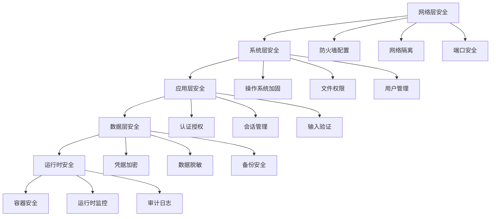

# 第6章：Jenkins安全实践

## 6.1 Jenkins安全架构概述

### 6.1.1 安全威胁模型
在Jenkins环境中，安全威胁主要来自以下几个方面：

1. **未授权访问**
   - 匿名用户执行敏感操作
   - 权限配置不当导致越权访问
   - 弱密码攻击

2. **代码注入攻击**
   - 恶意脚本注入Pipeline
   - 环境变量篡改
   - 参数注入攻击

3. **凭据泄露**
   - 密码、API密钥泄露
   - SSH密钥管理不当
   - 配置文件泄露

4. **供应链攻击**
   - 恶意插件安装
   - 依赖库漏洞
   - 镜像篡改

### 6.1.2 安全防御深度


## 6.2 认证和授权系统

### 6.2.1 认证机制深度解析

#### 内置数据库认证
```groovy
// 配置示例：用户密码策略
import jenkins.model.*
import hudson.security.*

def instance = Jenkins.getInstance()

def strategy = new hudson.security.SecurityRealm() {
    @Override
    SecurityComponents createSecurityComponents() {
        def dao = new hudson.security.HudsonPrivateSecurityRealm(false)
        // 设置密码策略
        dao.setPasswordEncoder(new hudson.security.PasswordEncoder() {
            String encodePassword(String rawPass, Object salt) {
                // 使用BCrypt加密
                return BCrypt.hashpw(rawPass, BCrypt.gensalt(12))
            }
            boolean isPasswordValid(String encPass, String rawPass, Object salt) {
                return BCrypt.checkpw(rawPass, encPass)
            }
        })
        return new SecurityComponents(dao)
    }
}

instance.setSecurityRealm(strategy)
```

#### LDAP集成配置
```yaml
# LDAP配置详细参数
security:
  realm: ldap
  ldap:
    server: ldap://ldap.example.com:389
    rootDN: dc=example,dc=com
    userSearchBase: ou=users
    userSearch: uid={0}
    groupSearchBase: ou=groups
    managerDN: cn=admin,dc=example,dc=com
    managerPassword: ${LDAP_MANAGER_PASSWORD}
    # 连接池配置
    pool:
      maxSize: 20
      timeout: 30000
    # 缓存配置
    cache:
      size: 1000
      ttl: 3600
```

#### OAuth 2.0集成
```groovy
// GitHub OAuth配置
import org.jenkinsci.plugins.GithubSecurityRealm

def githubRealm = new GithubSecurityRealm(
    "https://github.com",
    "${GITHUB_CLIENT_ID}",
    "${GITHUB_CLIENT_SECRET}",
    "https://jenkins.example.com/securityRealm/finishLogin",
    "user:email,read:org"
)

Jenkins.instance.setSecurityRealm(githubRealm)
```

### 6.2.2 授权策略深度分析

#### 基于矩阵的授权策略
```groovy
// 精细化权限控制
import jenkins.model.*
import hudson.security.*

def instance = Jenkins.getInstance()

def strategy = new GlobalMatrixAuthorizationStrategy()

// 管理员权限
strategy.add(Jenkins.ADMINISTER, "admin-group")
strategy.add(Jenkins.READ, "authenticated")

// 项目级权限
strategy.add(Item.READ, "developer-group")
strategy.add(Item.BUILD, "developer-group")
strategy.add(Item.CONFIGURE, "senior-developer-group")

// 系统级权限控制
strategy.add(Jenkins.RUN_SCRIPTS, "script-runner-group")
strategy.add(Jenkins.MANAGE, "manager-group")

instance.setAuthorizationStrategy(strategy)
```

#### 基于角色的授权（Role Strategy Plugin）
```groovy
// 角色定义和分配
import com.michelin.cio.hudson.plugins.rolestrategy.RoleBasedAuthorizationStrategy
import com.michelin.cio.hudson.plugins.rolestrategy.Role
import com.synopsys.arc.jenkins.plugins.rolestrategy.RoleType

// 创建角色策略
def strategy = new RoleBasedAuthorizationStrategy()

// 定义全局角色
Role adminRole = new Role("admin", "hudson.model.Hudson.Administer", "hudson.model.Hudson.Read")
Role developerRole = new Role("developer", "hudson.model.Item.Build", "hudson.model.Item.Read")

// 分配角色到用户/组
strategy.addRole(RoleType.Global, adminRole)
strategy.addRole(RoleType.Global, developerRole)
strategy.assignRole(RoleType.Global, adminRole, "admin-user")
strategy.assignRole(RoleType.Global, developerRole, "developer-group")

Jenkins.instance.setAuthorizationStrategy(strategy)
```

## 6.3 凭据管理系统

### 6.3.1 凭据类型和存储

#### 凭据存储架构
```groovy
// 凭据存储配置示例
import com.cloudbees.plugins.credentials.*
import com.cloudbees.plugins.credentials.impl.*
import com.cloudbees.plugins.credentials.domains.*

// 获取凭据存储
def store = Jenkins.instance.getExtensionList(
    'com.cloudbees.plugins.credentials.SystemCredentialsProvider'
)[0].getStore()

// 定义域名
def domain = new Domain(
    "production",
    "生产环境凭据",
    Collections.<DomainSpecification>emptyList()
)

// 添加用户名密码凭据
def usernamePassword = new UsernamePasswordCredentialsImpl(
    CredentialsScope.GLOBAL,
    "prod-db-credentials",
    "生产数据库凭据",
    "dbuser",
    "${DB_PASSWORD}"
)

store.addDomain(domain, usernamePassword)
```

#### 加密凭据管理
```groovy
// 安全凭据处理
import org.jenkinsci.plugins.plaincredentials.impl.StringCredentialsImpl
import com.cloudbees.plugins.credentials.CredentialsProvider

// 创建加密字符串凭据
def secretCredential = new StringCredentialsImpl(
    CredentialsScope.GLOBAL,
    "api-secret-key",
    "API密钥",
    new hudson.util.Secret("${API_SECRET}")
)

// 安全使用凭据
node {
    withCredentials([string(credentialsId: 'api-secret-key', variable: 'API_KEY')]) {
        sh '''
            # 安全使用API密钥
            curl -H "Authorization: Bearer $API_KEY" \
                 https://api.example.com/data
            
            # 清理敏感数据
            unset API_KEY
        '''
    }
}
```

### 6.3.2 凭据安全最佳实践

#### 凭据轮换策略
```groovy
// 自动化凭据轮换
pipeline {
    agent any
    
    triggers {
        cron('0 2 * * 0')  // 每周日凌晨2点执行轮换
    }
    
    stages {
        stage('凭证轮换') {
            steps {
                script {
                    // 生成新密钥
                    def newSecret = generateNewSecret()
                    
                    // 更新应用程序配置
                    updateAppConfig(newSecret)
                    
                    // 验证新凭据
                    validateNewCredentials(newSecret)
                    
                    // 更新Jenkins凭据存储
                    updateCredentialsStore(newSecret)
                    
                    // 清理旧凭据
                    cleanupOldCredentials()
                }
            }
        }
    }
}
```

#### 凭据访问审计
```groovy
// 凭据访问监控
import jenkins.model.Jenkins
import com.cloudbees.plugins.credentials.CredentialsProvider
import com.cloudbees.plugins.credentials.CredentialsStore

// 审计凭据访问
def auditCredentialAccess = { credentialId, userName, action ->
    def timestamp = new Date().format("yyyy-MM-dd HH:mm:ss")
    def logEntry = "${timestamp} | User: ${userName} | Action: ${action} | Credential: ${credentialId}"
    
    // 写入审计日志
    new File("/var/log/jenkins/credential-audit.log").append("${logEntry}\n")
    
    // 发送安全告警（如果异常）
    if (isSuspiciousAction(action, userName)) {
        sendSecurityAlert(logEntry)
    }
}

// 凭据使用示例
node {
    withCredentials([usernamePassword(
        credentialsId: 'prod-db-credentials', 
        passwordVariable: 'DB_PASSWORD', 
        usernameVariable: 'DB_USER'
    )]) {
        // 记录凭据使用
        auditCredentialAccess('prod-db-credentials', env.USER, 'Database connection')
        
        // 安全使用凭据
        sh '''
            # 使用环境变量，避免在日志中暴露
            mysql -h db.example.com -u $DB_USER -p$DB_PASSWORD -e "SHOW DATABASES;"
        '''
    }
}
```

## 6.4 网络安全配置

### 6.4.1 网络隔离策略

#### 网络分段架构
```yaml
# Docker Compose网络配置
version: '3.8'
services:
  jenkins:
    image: jenkins/jenkins:lts
    networks:
      - frontend
      - backend
    
  nginx:
    image: nginx:alpine
    networks:
      - frontend
    ports:
      - "80:80"
      - "443:443"
    
  database:
    image: postgres:13
    networks:
      - backend
    environment:
      POSTGRES_DB: jenkins
      POSTGRES_USER: jenkins
      POSTGRES_PASSWORD: ${DB_PASSWORD}

networks:
  frontend:
    driver: bridge
    internal: false
  backend:
    driver: bridge
    internal: true  # 内部网络，不对外暴露
```

#### 防火墙规则配置
```bash
#!/bin/bash
# Jenkins服务器防火墙配置

# 清空现有规则
iptables -F
iptables -X

# 设置默认策略
iptables -P INPUT DROP
iptables -P FORWARD DROP
iptables -P OUTPUT ACCEPT

# 允许本地回环
iptables -A INPUT -i lo -j ACCEPT

# 允许已建立的连接
iptables -A INPUT -m state --state ESTABLISHED,RELATED -j ACCEPT

# Jenkins Web界面端口（通过反向代理）
iptables -A INPUT -p tcp --dport 8080 -s 10.0.0.0/8 -j ACCEPT

# SSH访问（仅限管理网络）
iptables -A INPUT -p tcp --dport 22 -s 10.0.1.0/24 -j ACCEPT

# 保存规则
iptables-save > /etc/sysconfig/iptables

# 启用IP转发（如果需要）
echo 'net.ipv4.ip_forward = 1' >> /etc/sysctl.conf
sysctl -p
```

### 6.4.2 TLS/SSL配置

#### 证书管理
```groovy
// Jenkins SSL配置
import jenkins.model.Jenkins
import hudson.util.

// 配置HTTPS
System.setProperty("javax.net.ssl.trustStore", "/etc/ssl/certs/java/cacerts")
System.setProperty("javax.net.ssl.trustStorePassword", "changeit")

// 配置反向代理
jenkins.model.JenkinsLocationConfiguration.get().setUrl("https://jenkins.example.com")

// 安全头配置
System.setProperty("hudson.model.DirectoryBrowserSupport.CSP", 
    "default-src 'self'; script-src 'self' 'unsafe-inline'; style-src 'self' 'unsafe-inline';")
```

#### Nginx SSL配置
```nginx
# Nginx SSL反向代理配置
server {
    listen 443 ssl http2;
    server_name jenkins.example.com;
    
    # SSL证书配置
    ssl_certificate /etc/ssl/certs/jenkins.example.com.crt;
    ssl_certificate_key /etc/ssl/private/jenkins.example.com.key;
    
    # 安全协议配置
    ssl_protocols TLSv1.2 TLSv1.3;
    ssl_ciphers ECDHE-RSA-AES128-GCM-SHA256:ECDHE-RSA-AES256-GCM-SHA384;
    ssl_prefer_server_ciphers on;
    
    # HSTS头
    add_header Strict-Transport-Security "max-age=31536000; includeSubDomains" always;
    
    # 安全头
    add_header X-Frame-Options DENY;
    add_header X-Content-Type-Options nosniff;
    add_header X-XSS-Protection "1; mode=block";
    
    location / {
        proxy_pass http://jenkins:8080;
        proxy_set_header Host $host;
        proxy_set_header X-Real-IP $remote_addr;
        proxy_set_header X-Forwarded-For $proxy_add_x_forwarded_for;
        proxy_set_header X-Forwarded-Proto $scheme;
        
        # 连接超时设置
        proxy_connect_timeout 60s;
        proxy_send_timeout 60s;
        proxy_read_timeout 60s;
    }
}
```

## 6.5 安全审计和监控

### 6.5.1 安全事件监控

#### 审计日志配置
```groovy
// 详细审计日志配置
import java.util.logging.*

// 配置安全审计日志
def auditLogger = Logger.getLogger("jenkins.security.AuditLogger")

auditLogger.setLevel(Level.ALL)

def fileHandler = new FileHandler("/var/log/jenkins/security-audit.log", 1000000, 5, true)
fileHandler.setFormatter(new SimpleFormatter())
auditLogger.addHandler(fileHandler)

// 自定义审计事件
jenkins.security.AuditLogger.registerListener(new jenkins.security.AuditListener() {
    void onLoggedIn(String username) {
        auditLogger.info("用户登录: ${username} - IP: ${getClientIP()}")
    }
    
    void onFailedToLogIn(String username) {
        auditLogger.warning("登录失败: ${username} - IP: ${getClientIP()}")
    }
    
    void onLoggedOut(String username) {
        auditLogger.info("用户登出: ${username}")
    }
})
```

#### 实时安全监控
```groovy
// 安全事件实时监控
pipeline {
    agent any
    
    triggers {
        pollSCM('* * * * *')  // 每分钟检查
    }
    
    stages {
        stage('安全扫描') {
            steps {
                script {
                    // 检查异常登录
                    checkFailedLogins()
                    
                    // 扫描恶意插件
                    scanMaliciousPlugins()
                    
                    // 检查凭据泄露
                    checkCredentialLeaks()
                    
                    // 监控系统资源
                    monitorSystemResources()
                }
            }
        }
        
        stage('安全报告') {
            steps {
                script {
                    // 生成安全报告
                    generateSecurityReport()
                    
                    // 发送告警（如果需要）
                    if (hasSecurityIssues()) {
                        sendSecurityAlert()
                    }
                }
            }
        }
    }
}
```

### 6.5.2 合规性检查

#### CIS基准检查
```groovy
// Jenkins CIS基准检查脚本
pipeline {
    agent any
    
    stages {
        stage('CIS基准检查') {
            steps {
                script {
                    // 1. 认证和授权检查
                    checkAuthenticationConfig()
                    checkAuthorizationConfig()
                    
                    // 2. 网络和安全配置检查
                    checkNetworkSecurity()
                    checkSSLConfig()
                    
                    // 3. 系统配置检查
                    checkSystemSettings()
                    checkPluginSecurity()
                    
                    // 4. 日志和审计检查
                    checkAuditLogging()
                    checkMonitoringConfig()
                }
            }
        }
        
        stage('生成合规报告') {
            steps {
                script {
                    // 生成CIS合规报告
                    generateCISReport()
                    
                    // 修复发现的漏洞
                    fixSecurityIssues()
                }
            }
        }
    }
}
```

## 6.6 实战：完整的安全加固Pipeline

### 6.6.1 安全加固自动化脚本

```groovy
// 完整的Jenkins安全加固Pipeline
pipeline {
    agent any
    
    parameters {
        choice(
            name: 'SECURITY_LEVEL',
            choices: ['BASIC', 'STANDARD', 'STRICT'],
            description: '安全加固级别'
        )
        booleanParam(
            name: 'ENABLE_AUDIT',
            defaultValue: true,
            description: '是否启用审计功能'
        )
    }
    
    stages {
        stage('环境检查') {
            steps {
                script {
                    // 检查当前安全状态
                    def currentSecurityStatus = assessCurrentSecurity()
                    echo "当前安全评分: ${currentSecurityStatus.score}/100"
                    
                    // 验证系统兼容性
                    validateSystemCompatibility()
                }
            }
        }
        
        stage('认证加固') {
            steps {
                script {
                    // 配置认证策略
                    configureAuthentication(params.SECURITY_LEVEL)
                    
                    // 设置密码策略
                    setPasswordPolicy()
                    
                    // 配置会话管理
                    configureSessionManagement()
                }
            }
        }
        
        stage('授权加固') {
            steps {
                script {
                    // 配置基于角色的访问控制
                    configureRBAC()
                    
                    // 设置最小权限原则
                    applyLeastPrivilege()
                    
                    // 配置项目级权限
                    configureProjectPermissions()
                }
            }
        }
        
        stage('网络加固') {
            steps {
                script {
                    // 配置防火墙规则
                    configureFirewall()
                    
                    // 设置网络隔离
                    setupNetworkSegmentation()
                    
                    // 配置TLS/SSL
                    configureSSL()
                }
            }
        }
        
        stage('监控配置') {
            when {
                expression { params.ENABLE_AUDIT }
            }
            steps {
                script {
                    // 配置审计日志
                    configureAuditLogging()
                    
                    // 设置安全监控
                    setupSecurityMonitoring()
                    
                    // 配置告警规则
                    configureAlertRules()
                }
            }
        }
        
        stage('验证测试') {
            steps {
                script {
                    // 运行安全测试
                    runSecurityTests()
                    
                    // 验证配置有效性
                    validateSecurityConfig()
                    
                    // 生成安全报告
                    generateFinalSecurityReport()
                }
            }
        }
    }
    
    post {
        always {
            // 清理临时文件
            cleanTempFiles()
        }
        success {
            // 发送成功通知
            sendSuccessNotification()
        }
        failure {
            // 发送失败告警
            sendFailureAlert()
        }
    }
}
```

### 6.6.2 安全测试和验证

```groovy
// 安全测试套件
pipeline {
    agent any
    
    stages {
        stage('漏洞扫描') {
            parallel {
                stage('Web漏洞扫描') {
                    steps {
                        script {
                            // 使用OWASP ZAP进行扫描
                            runZAPScan()
                        }
                    }
                }
                stage('配置漏洞扫描') {
                    steps {
                        script {
                            // 扫描配置漏洞
                            scanConfigurationVulnerabilities()
                        }
                    }
                }
            }
        }
        
        stage('渗透测试') {
            steps {
                script {
                    // 模拟攻击测试
                    runPenetrationTest()
                    
                    // 测试权限提升
                    testPrivilegeEscalation()
                    
                    // 测试数据泄露
                    testDataLeakage()
                }
            }
        }
        
        stage('合规性验证') {
            steps {
                script {
                    // 验证CIS合规性
                    validateCISCompliance()
                    
                    // 验证企业安全标准
                    validateEnterpriseSecurityStandards()
                }
            }
        }
    }
}
```

## 6.7 本章总结

本章深入探讨了Jenkins安全实践的各个方面，从基础的安全架构到高级的加固技术。通过本章学习，您应该能够：

1. **理解Jenkins安全威胁模型**和防御策略
2. **配置完善的认证授权系统**，支持多种认证方式
3. **安全管理凭据**，实现安全的凭据存储和使用
4. **实施网络隔离和TLS/SSL加密**
5. **建立完善的安全审计和监控体系**
6. **自动化安全加固和测试流程**

这些安全实践将帮助您构建一个安全、可靠的Jenkins环境，满足企业级的安全要求。