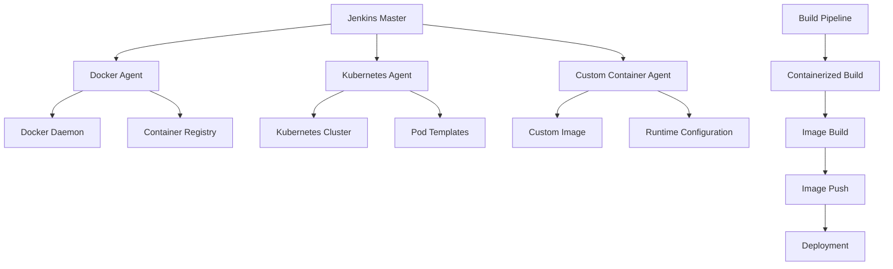

# 第7章：Jenkins与容器化集成

## 7.1 容器化技术概述

### 7.1.1 容器化技术栈

容器化技术已经成为了现代CI/CD流水线的核心组件。Jenkins与容器化技术的集成能够提供：

1. **环境一致性**：开发、测试、生产环境完全一致
2. **资源隔离**：每个构建任务在独立环境中运行
3. **快速启动**：容器启动速度快，提高构建效率
4. **资源利用**：更好的资源利用率和弹性伸缩

### 7.1.2 Jenkins容器化架构



## 7.2 Docker与Jenkins集成

### 7.2.1 Docker Agent配置

#### 基础Docker Agent配置
```groovy
// 使用Docker Agent的基础Pipeline
pipeline {
    agent {
        docker {
            image 'maven:3.8.1-openjdk-17'
            args '-v /var/jenkins_home/m2:/root/.m2'
            reuseNode true
        }
    }
    
    stages {
        stage('Build') {
            steps {
                sh 'mvn clean compile'
            }
        }
        
        stage('Test') {
            steps {
                sh 'mvn test'
            }
        }
        
        stage('Package') {
            steps {
                sh 'mvn package -DskipTests'
            }
        }
    }
}
```

#### 高级Docker配置
```groovy
// 高级Docker Agent配置
pipeline {
    agent {
        docker {
            image 'custom-java-builder:latest'
            label 'docker-build'
            registryUrl 'https://registry.example.com'
            registryCredentialsId 'docker-registry-creds'
            
            // 容器配置
            args '''
                -v /var/jenkins_home/m2:/root/.m2
                -v /var/jenkins_home/npm:/root/.npm
                --memory=2g
                --cpus=2
                --network=host
            '''
            
            // 环境变量
            environment {
                MAVEN_OPTS = '-Xmx1g -XX:MaxPermSize=512m'
                NODE_ENV = 'production'
            }
            
            // 自定义命令
            command 'sleep infinity'
            
            reuseNode true
            alwaysPull true
        }
    }
    
    stages {
        // 构建阶段
    }
}
```

### 7.2.2 Dockerfile最佳实践

#### 多阶段构建Dockerfile
```dockerfile
# 多阶段构建示例：Java应用
FROM maven:3.8.1-openjdk-17 AS builder

# 设置工作目录
WORKDIR /app

# 复制依赖文件
COPY pom.xml .

# 下载依赖（利用Docker缓存）
RUN mvn dependency:go-offline

# 复制源代码
COPY src ./src

# 构建应用
RUN mvn clean package -DskipTests

# 运行时阶段
FROM openjdk:17-jre-slim

# 安装必要的工具
RUN apt-get update && apt-get install -y \
    curl \
    && rm -rf /var/lib/apt/lists/*

# 创建非root用户
RUN groupadd -r appuser && useradd -r -g appuser appuser

# 设置工作目录
WORKDIR /app

# 从构建阶段复制jar包
COPY --from=builder /app/target/*.jar app.jar

# 复制配置文件和脚本
COPY scripts/entrypoint.sh /entrypoint.sh
RUN chmod +x /entrypoint.sh

# 设置文件权限
RUN chown -R appuser:appuser /app

# 切换到非root用户
USER appuser

# 暴露端口
EXPOSE 8080

# 健康检查
HEALTHCHECK --interval=30s --timeout=10s --start-period=5s --retries=3 \
    CMD curl -f http://localhost:8080/health || exit 1

# 启动命令
ENTRYPOINT ["/entrypoint.sh"]
CMD ["java", "-jar", "app.jar"]
```

#### 多架构构建支持
```dockerfile
# 多架构构建Dockerfile
FROM --platform=$BUILDPLATFORM maven:3.8.1-openjdk-17 AS builder

ARG TARGETARCH
ARG TARGETOS

# 根据目标架构设置构建参数
RUN echo "Building for architecture: $TARGETARCH on OS: $TARGETOS"

WORKDIR /app
COPY . .

# 根据架构调整构建参数
RUN if [ "$TARGETARCH" = "arm64" ]; then \
        mvn clean package -DskipTests -Djavac.target=11; \
    else \
        mvn clean package -DskipTests; \
    fi

FROM openjdk:17-jre-slim

# 根据架构安装必要的包
RUN if [ "$(uname -m)" = "aarch64" ]; then \
        apt-get update && apt-get install -y libatomic1; \
    fi

COPY --from=builder /app/target/*.jar app.jar

EXPOSE 8080
ENTRYPOINT ["java", "-jar", "app.jar"]
```

## 7.3 Kubernetes与Jenkins集成

### 7.3.1 Kubernetes Plugin配置

#### Kubernetes集群配置
```yaml
# Jenkins Kubernetes配置
apiVersion: v1
kind: ConfigMap
metadata:
  name: jenkins-kubernetes-config
  namespace: jenkins
data:
  config.xml: |
    <?xml version='1.1' encoding='UTF-8'?>
    <org.csanchez.jenkins.plugins.kubernetes.KubernetesCloud>
      <name>kubernetes</name>
      <serverUrl>https://kubernetes.default.svc.cluster.local</serverUrl>
      <namespace>jenkins-build</namespace>
      <jenkinsUrl>http://jenkins.jenkins.svc.cluster.local:8080</jenkinsUrl>
      <containerCap>10</containerCap>
      <retentionTimeout>5</retentionTimeout>
      <connectTimeout>0</connectTimeout>
      <readTimeout>0</readTimeout>
      <podLabels>
        <org.csanchez.jenkins.plugins.kubernetes.PodLabel>
          <key>jenkins</key>
          <value>agent</value>
        </org.csanchez.jenkins.plugins.kubernetes.PodLabel>
      </podLabels>
      <podTemplates>
        <!-- Pod模板配置 -->
      </podTemplates>
    </org.csanchez.jenkins.plugins.kubernetes.KubernetesCloud>
```

#### Pod模板配置
```yaml
# Pod模板配置
apiVersion: v1
kind: Pod
metadata:
  labels:
    jenkins: agent
spec:
  serviceAccountName: jenkins-agent
  containers:
  - name: jnlp
    image: jenkins/inbound-agent:4.11.2-4
    args: ['$(JENKINS_SECRET)', '$(JENKINS_NAME)']
    resources:
      requests:
        memory: "512Mi"
        cpu: "500m"
      limits:
        memory: "1Gi"
        cpu: "1"
    env:
    - name: JAVA_OPTS
      value: "-Xmx512m"
    
  - name: maven
    image: maven:3.8.1-openjdk-17
    command:
    - cat
    tty: true
    resources:
      requests:
        memory: "1Gi"
        cpu: "500m"
      limits:
        memory: "2Gi"
        cpu: "1"
    volumeMounts:
    - name: maven-cache
      mountPath: /root/.m2
      
  - name: nodejs
    image: node:16-alpine
    command:
    - cat
    tty: true
    resources:
      requests:
        memory: "512Mi"
        cpu: "250m"
      limits:
        memory: "1Gi"
        cpu: "500m"
    volumeMounts:
    - name: npm-cache
      mountPath: /root/.npm
  
  volumes:
  - name: maven-cache
    persistentVolumeClaim:
      claimName: maven-cache-pvc
  - name: npm-cache
    persistentVolumeClaim:
      claimName: npm-cache-pvc
```

### 7.3.2 Kubernetes Pipeline

#### 动态Pod模板Pipeline
```groovy
// 使用Kubernetes动态Pod模板的Pipeline
pipeline {
    agent {
        kubernetes {
            label 'kubernetes-build'
            yaml '''
apiVersion: v1
kind: Pod
metadata:
  labels:
    app: java-build
spec:
  containers:
  - name: maven
    image: maven:3.8.1-openjdk-17
    command:
    - cat
    tty: true
    resources:
      requests:
        memory: "2Gi"
        cpu: "1"
      limits:
        memory: "4Gi"
        cpu: "2"
    env:
    - name: MAVEN_OPTS
      value: "-Xmx1g"
    volumeMounts:
    - name: workspace
      mountPath: /home/jenkins/agent
    - name: maven-cache
      mountPath: /root/.m2
  
  - name: docker
    image: docker:20.10.7
    command:
    - cat
    tty: true
    volumeMounts:
    - name: docker-sock
      mountPath: /var/run/docker.sock
    - name: workspace
      mountPath: /home/jenkins/agent
  
  volumes:
  - name: workspace
    emptyDir: {}
  - name: maven-cache
    persistentVolumeClaim:
      claimName: maven-cache-pvc
  - name: docker-sock
    hostPath:
      path: /var/run/docker.sock
'''
        }
    }
    
    stages {
        stage('Checkout') {
            steps {
                container('maven') {
                    checkout scm
                }
            }
        }
        
        stage('Build') {
            steps {
                container('maven') {
                    sh 'mvn clean compile'
                }
            }
        }
        
        stage('Test') {
            steps {
                container('maven') {
                    sh 'mvn test'
                }
            }
        }
        
        stage('Build Image') {
            steps {
                container('docker') {
                    script {
                        def customImage = docker.build("myapp:${env.BUILD_ID}")
                        customImage.push()
                    }
                }
            }
        }
    }
}
```

#### 多容器协作Pipeline
```groovy
// 多容器协作的复杂Pipeline
pipeline {
    agent {
        kubernetes {
            label 'multi-container-build'
            yaml '''
apiVersion: v1
kind: Pod
spec:
  containers:
  - name: java
    image: openjdk:17-jdk-slim
    command: ['cat']
    tty: true
  
  - name: nodejs
    image: node:16-alpine
    command: ['cat']
    tty: true
  
  - name: python
    image: python:3.9-slim
    command: ['cat']
    tty: true
  
  - name: docker
    image: docker:20.10.7
    command: ['cat']
    tty: true
    securityContext:
      privileged: true
    volumeMounts:
    - name: docker-sock
      mountPath: /var/run/docker.sock
  
  volumes:
  - name: docker-sock
    hostPath:
      path: /var/run/docker.sock
'''
        }
    }
    
    stages {
        stage('Frontend Build') {
            steps {
                container('nodejs') {
                    sh '''
                        npm install
                        npm run build
                        npm run test
                    '''
                }
            }
        }
        
        stage('Backend Build') {
            steps {
                container('java') {
                    sh '''
                        ./gradlew clean build
                        ./gradlew test
                    '''
                }
            }
        }
        
        stage('API Tests') {
            steps {
                container('python') {
                    sh '''
                        pip install -r requirements.txt
                        python -m pytest tests/
                    '''
                }
            }
        }
        
        stage('Docker Build') {
            steps {
                container('docker') {
                    script {
                        // 构建前端镜像
                        sh 'docker build -t frontend:latest -f Dockerfile.frontend .'
                        
                        // 构建后端镜像
                        sh 'docker build -t backend:latest -f Dockerfile.backend .'
                        
                        // 推送镜像
                        withCredentials([usernamePassword(
                            credentialsId: 'docker-registry',
                            usernameVariable: 'REGISTRY_USER',
                            passwordVariable: 'REGISTRY_PASSWORD'
                        )]) {
                            sh '''
                                docker login -u $REGISTRY_USER -p $REGISTRY_PASSWORD registry.example.com
                                docker tag frontend:latest registry.example.com/frontend:${BUILD_ID}
                                docker tag backend:latest registry.example.com/backend:${BUILD_ID}
                                docker push registry.example.com/frontend:${BUILD_ID}
                                docker push registry.example.com/backend:${BUILD_ID}
                            '''
                        }
                    }
                }
            }
        }
    }
}
```

## 7.4 容器镜像管理

### 7.4.1 镜像构建策略

#### 智能镜像构建
```groovy
// 智能镜像构建Pipeline
pipeline {
    agent any
    
    parameters {
        choice(
            name: 'BUILD_STRATEGY',
            choices: ['standard', 'optimized', 'minimal'],
            description: '镜像构建策略'
        )
        booleanParam(
            name: 'PUSH_TO_PROD',
            defaultValue: false,
            description: '是否推送到生产环境'
        )
    }
    
    stages {
        stage('Analyze Dependencies') {
            steps {
                script {
                    // 分析依赖变更
                    def changedFiles = getChangedFiles()
                    def dependencies = analyzeDependencies(changedFiles)
                    
                    // 决定构建策略
                    if (dependencies.contains('major')) {
                        env.BUILD_STRATEGY = 'standard'
                    } else if (dependencies.contains('minor')) {
                        env.BUILD_STRATEGY = 'optimized'
                    } else {
                        env.BUILD_STRATEGY = 'minimal'
                    }
                }
            }
        }
        
        stage('Build Image') {
            steps {
                script {
                    // 根据策略选择Dockerfile
                    def dockerfile = "Dockerfile.${env.BUILD_STRATEGY}"
                    
                    // 构建镜像
                    def image = docker.build("app:${env.BUILD_ID}", "-f ${dockerfile} .")
                    
                    // 安全扫描
                    def scanResults = securityScan(image)
                    if (scanResults.vulnerabilities > 0) {
                        error("镜像包含安全漏洞，构建失败")
                    }
                }
            }
        }
        
        stage('Optimize Image') {
            when {
                expression { env.BUILD_STRATEGY == 'optimized' }
            }
            steps {
                script {
                    // 镜像优化
                    sh 'docker-slim build --target app:${BUILD_ID} --http-probe'
                    
                    // 清理临时镜像
                    sh 'docker image prune -f'
                }
            }
        }
        
        stage('Push Image') {
            steps {
                script {
                    withCredentials([usernamePassword(
                        credentialsId: 'registry-creds',
                        usernameVariable: 'REGISTRY_USER',
                        passwordVariable: 'REGISTRY_PASSWORD'
                    )]) {
                        // 推送到开发环境
                        sh '''
                            docker login -u $REGISTRY_USER -p $REGISTRY_PASSWORD registry.dev.example.com
                            docker tag app:${BUILD_ID} registry.dev.example.com/app:${BUILD_ID}
                            docker push registry.dev.example.com/app:${BUILD_ID}
                        '''
                        
                        // 条件推送到生产环境
                        if (params.PUSH_TO_PROD) {
                            sh '''
                                docker tag app:${BUILD_ID} registry.prod.example.com/app:${BUILD_ID}
                                docker push registry.prod.example.com/app:${BUILD_ID}
                            '''
                        }
                    }
                }
            }
        }
    }
}
```

### 7.4.2 镜像安全扫描

#### 集成安全扫描
```groovy
// 镜像安全扫描Pipeline
pipeline {
    agent any
    
    stages {
        stage('Build Image') {
            steps {
                script {
                    def image = docker.build("app:${env.BUILD_ID}")
                }
            }
        }
        
        stage('Security Scan') {
            parallel {
                stage('Trivy Scan') {
                    steps {
                        script {
                            // 使用Trivy进行漏洞扫描
                            sh '''
                                trivy image --exit-code 1 --severity HIGH,CRITICAL app:${BUILD_ID}
                                trivy image --format template --template "@/contrib/html.tpl" -o trivy-report.html app:${BUILD_ID}
                            '''
                        }
                    }
                    post {
                        always {
                            // 发布安全报告
                            publishHTML([
                                allowMissing: false,
                                alwaysLinkToLastBuild: true,
                                keepAll: true,
                                reportDir: '.',
                                reportFiles: 'trivy-report.html',
                                reportName: 'Trivy Security Report'
                            ])
                        }
                    }
                }
                
                stage('Clair Scan') {
                    steps {
                        script {
                            // 使用Clair进行扫描
                            sh '''
                                docker run --rm \
                                    -v /var/run/docker.sock:/var/run/docker.sock \
                                    -v $(pwd):/report \
                                    quay.io/clair-scanner \
                                    --ip $(hostname -i) \
                                    --report /report/clair-report.json \
                                    app:${BUILD_ID}
                            '''
                        }
                    }
                }
                
                stage('Docker Bench Security') {
                    steps {
                        script {
                            // Docker安全基准测试
                            sh '''
                                docker run --rm --net host --pid host --userns host --cap-add audit_control \
                                    -e DOCKER_CONTENT_TRUST=$DOCKER_CONTENT_TRUST \
                                    -v /etc:/etc:ro \
                                    -v /usr/bin/docker-containerd:/usr/bin/docker-containerd:ro \
                                    -v /usr/bin/docker-runc:/usr/bin/docker-runc:ro \
                                    -v /usr/lib/systemd:/usr/lib/systemd:ro \
                                    -v /var/lib:/var/lib:ro \
                                    -v /var/run/docker.sock:/var/run/docker.sock:ro \
                                    --label docker_bench_security \
                                    docker/docker-bench-security
                            '''
                        }
                    }
                }
            }
        }
        
        stage('Image Signing') {
            steps {
                script {
                    // 镜像签名
                    withCredentials([string(credentialsId: 'cosign-key', variable: 'COSIGN_KEY')]) {
                        sh '''
                            cosign sign --key env://COSIGN_KEY registry.example.com/app:${BUILD_ID}
                        '''
                    }
                }
            }
        }
    }
}
```

## 7.5 容器编排部署

### 7.5.1 Kubernetes部署策略

#### 蓝绿部署
```groovy
// Kubernetes蓝绿部署Pipeline
pipeline {
    agent any
    
    environment {
        KUBECONFIG = credentials('kubeconfig')
        NAMESPACE = 'production'
    }
    
    stages {
        stage('Prepare Deployment') {
            steps {
                script {
                    // 生成部署配置
                    def deploymentYaml = """
apiVersion: apps/v1
kind: Deployment
metadata:
  name: app-green-${env.BUILD_ID}
  labels:
    app: app
    version: ${env.BUILD_ID}
    color: green
spec:
  replicas: 3
  selector:
    matchLabels:
      app: app
      color: green
  template:
    metadata:
      labels:
        app: app
        version: ${env.BUILD_ID}
        color: green
    spec:
      containers:
      - name: app
        image: registry.example.com/app:${env.BUILD_ID}
        ports:
        - containerPort: 8080
        env:
        - name: APP_VERSION
          value: "${env.BUILD_ID}"
        livenessProbe:
          httpGet:
            path: /health
            port: 8080
          initialDelaySeconds: 30
          periodSeconds: 10
        readinessProbe:
          httpGet:
            path: /ready
            port: 8080
          initialDelaySeconds: 5
          periodSeconds: 5
      """
                    
                    writeFile file: 'deployment-green.yaml', text: deploymentYaml
                }
            }
        }
        
        stage('Deploy Green') {
            steps {
                script {
                    // 部署绿色版本
                    sh "kubectl apply -f deployment-green.yaml -n ${env.NAMESPACE}"
                    
                    // 等待绿色版本就绪
                    sh "kubectl rollout status deployment/app-green-${env.BUILD_ID} -n ${env.NAMESPACE} --timeout=300s"
                }
            }
        }
        
        stage('Switch Traffic') {
            steps {
                script {
                    // 更新Service指向绿色版本
                    sh """
                        kubectl patch service app-service -n ${env.NAMESPACE} -p '
                        {
                            "spec": {
                                "selector": {
                                    "color": "green"
                                }
                            }
                        }'
                    """
                    
                    // 验证流量切换
                    def response = sh(script: "curl -s http://app-service.${env.NAMESPACE}/version", returnStdout: true).trim()
                    assert response == env.BUILD_ID : "流量切换失败"
                }
            }
        }
        
        stage('Cleanup Blue') {
            steps {
                script {
                    // 清理蓝色版本
                    sh "kubectl delete deployment -l app=app,color=blue -n ${env.NAMESPACE}"
                }
            }
        }
    }
}
```

### 7.5.2 Helm部署

#### Helm Chart管理
```groovy
// Helm部署Pipeline
pipeline {
    agent {
        kubernetes {
            label 'helm-deploy'
            yaml '''
apiVersion: v1
kind: Pod
spec:
  containers:
  - name: helm
    image: alpine/helm:3.7.1
    command: ['cat']
    tty: true
  
  - name: kubectl
    image: bitnami/kubectl:1.22.0
    command: ['cat']
    tty: true
'''
        }
    }
    
    environment {
        HELM_EXPERIMENTAL_OCI = '1'
    }
    
    stages {
        stage('Lint Chart') {
            steps {
                container('helm') {
                    sh 'helm lint charts/app'
                }
            }
        }
        
        stage('Package Chart') {
            steps {
                container('helm') {
                    sh 'helm package charts/app --version ${BUILD_ID}'
                    
                    // 推送Chart到仓库
                    withCredentials([usernamePassword(
                        credentialsId: 'chartmuseum',
                        usernameVariable: 'CHARTMUSEUM_USER',
                        passwordVariable: 'CHARTMUSEUM_PASSWORD'
                    )]) {
                        sh '''
                            curl -u $CHARTMUSEUM_USER:$CHARTMUSEUM_PASSWORD \
                                --data-binary "@app-${BUILD_ID}.tgz" \
                                http://chartmuseum.example.com/api/charts
                        '''
                    }
                }
            }
        }
        
        stage('Deploy to Staging') {
            steps {
                container('helm') {
                    script {
                        // 部署到预发布环境
                        sh '''
                            helm upgrade --install app-staging \
                                --namespace staging \
                                --set image.tag=${BUILD_ID} \
                                --set replicaCount=2 \
                                --wait \
                                --timeout 5m \
                                oci://chartmuseum.example.com/app
                        '''
                        
                        // 运行测试
                        sh 'helm test app-staging --namespace staging --timeout 5m'
                    }
                }
            }
        }
        
        stage('Promote to Production') {
            when {
                expression { env.BRANCH_NAME == 'main' }
            }
            steps {
                container('helm') {
                    script {
                        // 部署到生产环境
                        sh '''
                            helm upgrade --install app-production \
                                --namespace production \
                                --set image.tag=${BUILD_ID} \
                                --set replicaCount=5 \
                                --wait \
                                --timeout 10m \
                                oci://chartmuseum.example.com/app
                        '''
                    }
                }
            }
        }
    }
}
```

## 7.6 监控和日志

### 7.6.1 容器监控

#### 集成Prometheus监控
```groovy
// 容器监控Pipeline
pipeline {
    agent any
    
    stages {
        stage('Deploy Monitoring') {
            steps {
                script {
                    // 部署监控配置
                    sh '''
                        kubectl apply -f monitoring/prometheus-config.yaml
                        kubectl apply -f monitoring/grafana-dashboard.yaml
                    '''
                }
            }
        }
        
        stage('Monitor Build') {
            steps {
                script {
                    // 监控构建指标
                    def metrics = getBuildMetrics()
                    
                    // 推送指标到Prometheus
                    pushMetricsToPrometheus(metrics)
                    
                    // 检查性能指标
                    if (metrics.buildTime > 300) {
                        echo "警告：构建时间过长"
                    }
                }
            }
        }
        
        stage('Generate Report') {
            steps {
                script {
                    // 生成监控报告
                    generateMonitoringReport()
                    
                    // 发送告警（如果需要）
                    if (hasPerformanceIssues()) {
                        sendPerformanceAlert()
                    }
                }
            }
        }
    }
}
```

### 7.6.2 集中式日志

#### ELK Stack集成
```groovy
// 日志收集Pipeline
pipeline {
    agent any
    
    stages {
        stage('Configure Logging') {
            steps {
                script {
                    // 配置Fluentd日志收集
                    sh '''
                        kubectl apply -f logging/fluentd-config.yaml
                        kubectl apply -f logging/elasticsearch.yaml
                        kubectl apply -f logging/kibana.yaml
                    '''
                }
            }
        }
        
        stage('Collect Build Logs') {
            steps {
                script {
                    // 收集构建日志
                    def buildLogs = collectBuildLogs()
                    
                    // 发送到Elasticsearch
                    sendLogsToElasticsearch(buildLogs)
                    
                    // 分析日志模式
                    analyzeLogPatterns(buildLogs)
                }
            }
        }
        
        stage('Log Analysis') {
            steps {
                script {
                    // 日志分析
                    def analysisResults = analyzeLogs()
                    
                    // 生成分析报告
                    generateLogAnalysisReport(analysisResults)
                    
                    // 检测异常模式
                    if (detectAnomalies(analysisResults)) {
                        sendLogAlert()
                    }
                }
            }
        }
    }
}
```

## 7.7 本章总结

本章深入探讨了Jenkins与容器化技术的集成，涵盖了从基础Docker集成到高级Kubernetes编排的完整技术栈。通过本章学习，您应该能够：

1. **理解容器化技术栈**及其在CI/CD中的价值
2. **配置和管理Docker Agent**，实现高效的容器化构建
3. **集成Kubernetes**，实现动态资源管理和弹性伸缩
4. **实施智能镜像管理**，包括构建、安全扫描和签名
5. **掌握容器编排部署**策略，支持蓝绿部署和Helm管理
6. **建立完善的监控和日志体系**，确保系统可靠性

这些容器化集成技术将帮助您构建现代化、可扩展的CI/CD流水线，满足企业级应用交付的需求。