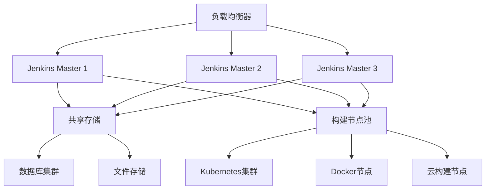

# 第8章：Jenkins企业级最佳实践

## 8.1 企业级Jenkins架构设计

### 8.1.1 高可用架构设计

企业级Jenkins需要保证高可用性和容错能力。以下是推荐的高可用架构：



#### 高可用配置示例
```yaml
# Jenkins高可用配置
apiVersion: apps/v1
kind: StatefulSet
metadata:
  name: jenkins-ha
  namespace: jenkins
spec:
  replicas: 3
  serviceName: jenkins-ha
  selector:
    matchLabels:
      app: jenkins-master
  template:
    metadata:
      labels:
        app: jenkins-master
    spec:
      containers:
      - name: jenkins
        image: jenkins/jenkins:lts
        ports:
        - containerPort: 8080
        - containerPort: 50000
        env:
        - name: JAVA_OPTS
          value: "-Djava.awt.headless=true -Xmx2g -Xms1g -XX:MaxMetaspaceSize=512m"
        - name: JENKINS_OPTS
          value: "--httpPort=8080 --ajp13Port=-1"
        volumeMounts:
        - name: jenkins-home
          mountPath: /var/jenkins_home
        - name: jenkins-config
          mountPath: /usr/share/jenkins/ref/
        livenessProbe:
          httpGet:
            path: /login
            port: 8080
          initialDelaySeconds: 90
          periodSeconds: 10
          timeoutSeconds: 5
          failureThreshold: 5
        readinessProbe:
          httpGet:
            path: /login
            port: 8080
          initialDelaySeconds: 60
          periodSeconds: 10
          timeoutSeconds: 5
          failureThreshold: 3
        resources:
          requests:
            memory: "2Gi"
            cpu: "1"
          limits:
            memory: "4Gi"
            cpu: "2"
  volumeClaimTemplates:
  - metadata:
      name: jenkins-home
    spec:
      accessModes: [ "ReadWriteMany" ]
      storageClassName: "nfs-client"
      resources:
        requests:
          storage: 100Gi
```

### 8.1.2 多环境管理策略

企业通常需要管理多个环境（开发、测试、预发布、生产）。以下是推荐的多环境管理策略：

#### 环境分类配置
```groovy
// 多环境配置管理
class EnvironmentConfig {
    static Map getConfig(String env) {
        def configs = [
            'dev': [
                url: 'https://jenkins-dev.example.com',
                credentialId: 'dev-kubeconfig',
                namespace: 'dev',
                replicaCount: 1,
                resourceLimits: [memory: '1Gi', cpu: '500m']
            ],
            'test': [
                url: 'https://jenkins-test.example.com',
                credentialId: 'test-kubeconfig',
                namespace: 'test',
                replicaCount: 2,
                resourceLimits: [memory: '2Gi', cpu: '1']
            ],
            'staging': [
                url: 'https://jenkins-staging.example.com',
                credentialId: 'staging-kubeconfig',
                namespace: 'staging',
                replicaCount: 3,
                resourceLimits: [memory: '4Gi', cpu: '2']
            ],
            'production': [
                url: 'https://jenkins-prod.example.com',
                credentialId: 'prod-kubeconfig',
                namespace: 'production',
                replicaCount: 5,
                resourceLimits: [memory: '8Gi', cpu: '4']
            ]
        ]
        return configs[env] ?: configs['dev']
    }
}

// 使用示例
pipeline {
    agent any
    
    parameters {
        choice(
            name: 'TARGET_ENV',
            choices: ['dev', 'test', 'staging', 'production'],
            description: '目标部署环境'
        )
    }
    
    stages {
        stage('环境配置') {
            steps {
                script {
                    def envConfig = EnvironmentConfig.getConfig(params.TARGET_ENV)
                    
                    // 设置环境变量
                    env.JENKINS_URL = envConfig.url
                    env.KUBECONFIG_CREDENTIAL_ID = envConfig.credentialId
                    env.NAMESPACE = envConfig.namespace
                    
                    echo "目标环境: ${params.TARGET_ENV}"
                    echo "Jenkins URL: ${env.JENKINS_URL}"
                    echo "命名空间: ${env.NAMESPACE}"
                }
            }
        }
        
        stage('部署验证') {
            steps {
                script {
                    // 验证环境配置
                    validateEnvironmentConfig(envConfig)
                }
            }
        }
    }
}
```

## 8.2 流水线模板和共享库

### 8.2.1 共享库设计

企业级Jenkins应该使用共享库来标准化流水线模板和工具函数。

#### 共享库结构
```
jenkins-shared-library/
├── src
│   └── com
│       └── company
│           ├── pipelines
│           │   ├── MicroservicePipeline.groovy
│           │   ├── FrontendPipeline.groovy
│           │   └── DatabasePipeline.groovy
│           ├── utils
│           │   ├── SecurityUtils.groovy
│           │   ├── DeploymentUtils.groovy
│           │   └── MonitoringUtils.groovy
│           └── models
│               ├── Environment.groovy
│               ├── Application.groovy
│               └── Deployment.groovy
├── vars
│   ├── buildApp.groovy
│   ├── deployToK8s.groovy
│   └── runTests.groovy
└── resources
    ├── deployment-templates
    │   ├── k8s-deployment.yaml
    │   └── k8s-service.yaml
    └── security
        ├── security-scan.sh
        └── compliance-check.yaml
```

#### 共享库配置
```groovy
// Jenkins共享库配置
library identifier: 'company-jenkins-library@main', 
        retriever: modernSCM([
            $class: 'GitSCMSource',
            remote: 'https://github.com/company/jenkins-shared-library.git',
            credentialsId: 'github-token'
        ])

// 使用共享库中的流水线模板
@Library('company-jenkins-library') _

// 调用共享库中的函数
buildApp(
    appName: 'user-service',
    environment: 'staging',
    testType: 'integration'
)

deployToK8s(
    namespace: 'production',
    imageTag: 'latest',
    replicas: 3
)
```

### 8.2.2 标准化流水线模板

#### 微服务流水线模板
```groovy
// MicroservicePipeline.groovy
package com.company.pipelines

class MicroservicePipeline implements Serializable {
    def script
    def config
    
    MicroservicePipeline(script, Map config = [:]) {
        this.script = script
        this.config = config
        validateConfig()
    }
    
    def validateConfig() {
        def required = ['appName', 'gitUrl', 'dockerfile']
        required.each { key ->
            if (!config.containsKey(key)) {
                script.error("Missing required configuration: ${key}")
            }
        }
    }
    
    def run() {
        script.pipeline {
            agent {
                kubernetes {
                    label "microservice-${config.appName}"
                    yaml '''
apiVersion: v1
kind: Pod
spec:
  containers:
  - name: maven
    image: maven:3.8.1-openjdk-17
    command: ["cat"]
    tty: true
  - name: docker
    image: docker:20.10.7
    command: ["cat"]
    tty: true
    securityContext:
      privileged: true
'''
                }
            }
            
            options {
                buildDiscarder(logRotator(numToKeepStr: '20'))
                timeout(time: 30, unit: 'MINUTES')
            }
            
            stages {
                stage('代码检查') {
                    steps {
                        script.container('maven') {
                            script.sh '''
                                mvn checkstyle:checkstyle
                                mvn spotbugs:spotbugs
                            '''
                        }
                    }
                }
                
                stage('单元测试') {
                    steps {
                        script.container('maven') {
                            script.sh 'mvn test'
                        }
                    }
                    post {
                        always {
                            script.junit 'target/surefire-reports/*.xml'
                        }
                    }
                }
                
                stage('构建镜像') {
                    steps {
                        script.container('docker') {
                            script.sh "docker build -t ${config.appName}:${script.env.BUILD_ID} ."
                        }
                    }
                }
                
                stage('安全扫描') {
                    steps {
                        script.container('docker') {
                            script.sh "trivy image --exit-code 0 ${config.appName}:${script.env.BUILD_ID}"
                        }
                    }
                }
                
                stage('部署到测试环境') {
                    when {
                        expression { script.env.BRANCH_NAME == 'develop' }
                    }
                    steps {
                        script.deployToEnvironment('test')
                    }
                }
                
                stage('部署到生产环境') {
                    when {
                        expression { script.env.BRANCH_NAME == 'main' }
                    }
                    steps {
                        input message: '确认部署到生产环境？', ok: '部署'
                        script.deployToEnvironment('production')
                    }
                }
            }
            
            post {
                always {
                    script.cleanWs()
                }
                success {
                    script.slackSend(
                        channel: '#build-notifications',
                        message: "✅ ${config.appName} 构建成功 (#${script.env.BUILD_NUMBER})"
                    )
                }
                failure {
                    script.slackSend(
                        channel: '#build-notifications',
                        message: "❌ ${config.appName} 构建失败 (#${script.env.BUILD_NUMBER})"
                    )
                }
            }
        }
    }
}
```

## 8.3 企业级监控和告警

### 8.3.1 全面的监控体系

企业级Jenkins需要建立完整的监控体系，包括系统监控、构建监控和业务监控。

#### Prometheus监控配置
```yaml
# Jenkins Prometheus监控配置
apiVersion: v1
kind: ConfigMap
metadata:
  name: jenkins-prometheus-config
  namespace: jenkins
data:
  prometheus.yml: |
    global:
      scrape_interval: 15s
      evaluation_interval: 15s
    
    rule_files:
      - "alert_rules.yml"
    
    scrape_configs:
      - job_name: 'jenkins'
        static_configs:
          - targets: ['jenkins:8080']
        metrics_path: '/prometheus'
        scrape_interval: 30s
        
      - job_name: 'jenkins-agents'
        kubernetes_sd_configs:
          - role: pod
            namespaces:
              names: ['jenkins-build']
        relabel_configs:
          - source_labels: [__meta_kubernetes_pod_label_jenkins]
            action: keep
            regex: agent
          - source_labels: [__meta_kubernetes_pod_container_port_number]
            action: keep
            regex: 8080
```

#### 告警规则配置
```yaml
# 告警规则配置
groups:
- name: jenkins_alerts
  rules:
  - alert: JenkinsMasterDown
    expr: up{job="jenkins"} == 0
    for: 2m
    labels:
      severity: critical
    annotations:
      summary: "Jenkins Master 服务宕机"
      description: "Jenkins Master 服务已经宕机超过2分钟"
  
  - alert: HighBuildQueue
    expr: jenkins_queue_buildable_total > 10
    for: 5m
    labels:
      severity: warning
    annotations:
      summary: "构建队列过长"
      description: "构建队列中有超过10个等待执行的构建任务"
  
  - alert: BuildFailureRateHigh
    expr: rate(jenkins_builds_failed_total[5m]) > 0.1
    for: 10m
    labels:
      severity: warning
    annotations:
      summary: "构建失败率过高"
      description: "过去5分钟内构建失败率超过10%"
  
  - alert: HighMemoryUsage
    expr: process_resident_memory_bytes{job="jenkins"} / 1024 / 1024 / 1024 > 6
    for: 5m
    labels:
      severity: warning
    annotations:
      summary: "Jenkins内存使用过高"
      description: "Jenkins内存使用超过6GB"
```

### 8.3.2 自定义指标收集

#### 构建指标收集
```groovy
// 构建指标收集Pipeline
pipeline {
    agent any
    
    stages {
        stage('构建') {
            steps {
                script {
                    // 记录构建开始时间
                    env.BUILD_START_TIME = System.currentTimeMillis()
                    
                    // 执行构建
                    sh 'mvn clean package'
                }
            }
        }
        
        stage('测试') {
            steps {
                script {
                    // 执行测试
                    sh 'mvn test'
                    
                    // 收集测试指标
                    def testResults = readJSON file: 'target/test-results/testng-results.xml'
                    pushMetrics('tests_total', testResults.total)
                    pushMetrics('tests_passed', testResults.passed)
                    pushMetrics('tests_failed', testResults.failed)
                }
            }
        }
        
        stage('部署') {
            steps {
                script {
                    // 执行部署
                    sh './deploy.sh'
                    
                    // 记录构建完成时间
                    env.BUILD_END_TIME = System.currentTimeMillis()
                    def buildDuration = (env.BUILD_END_TIME - env.BUILD_START_TIME) / 1000
                    
                    // 推送构建时长指标
                    pushMetrics('build_duration_seconds', buildDuration)
                    pushMetrics('build_success_total', 1)
                }
            }
        }
    }
    
    post {
        always {
            script {
                // 推送构建状态指标
                def status = currentBuild.result ?: 'SUCCESS'
                pushMetrics('build_status', status == 'SUCCESS' ? 1 : 0)
                
                // 收集代码质量指标
                def qualityMetrics = collectCodeQualityMetrics()
                qualityMetrics.each { metric, value ->
                    pushMetrics(metric, value)
                }
            }
        }
    }
}

// 指标推送函数
def pushMetrics(String metricName, Number value, Map labels = [:]) {
    def defaultLabels = [
        job: env.JOB_NAME,
        branch: env.BRANCH_NAME,
        build: env.BUILD_NUMBER
    ]
    
    def allLabels = defaultLabels + labels
    def labelString = allLabels.collect { k, v -> "${k}=\"${v}\"" }.join(',')
    
    sh """
        echo "${metricName}{${labelString}} ${value}" >> /metrics/jenkins_metrics.prom
    """
}
```

## 8.4 安全合规和审计

### 8.4.1 安全合规配置

企业级Jenkins需要满足各种安全合规要求，包括SOC2、ISO27001等。

#### 安全配置检查
```groovy
// 安全合规检查Pipeline
pipeline {
    agent any
    
    parameters {
        booleanParam(
            name: 'RUN_COMPLIANCE_CHECK',
            defaultValue: true,
            description: '是否运行安全合规检查'
        )
    }
    
    stages {
        stage('安全配置检查') {
            when {
                expression { params.RUN_COMPLIANCE_CHECK }
            }
            steps {
                script {
                    // 检查Jenkins安全配置
                    runSecurityComplianceCheck()
                    
                    // 检查插件安全
                    checkPluginSecurity()
                    
                    // 检查凭据安全
                    checkCredentialSecurity()
                }
            }
        }
        
        stage('生成合规报告') {
            when {
                expression { params.RUN_COMPLIANCE_CHECK }
            }
            steps {
                script {
                    // 生成SOC2合规报告
                    generateSOC2ComplianceReport()
                    
                    // 生成ISO27001合规报告
                    generateISO27001ComplianceReport()
                }
            }
            post {
                always {
                    // 发布合规报告
                    publishHTML([
                        allowMissing: false,
                        alwaysLinkToLastBuild: true,
                        keepAll: true,
                        reportDir: 'reports',
                        reportFiles: 'compliance-report.html',
                        reportName: '安全合规报告'
                    ])
                }
            }
        }
    }
}

// 安全合规检查函数
def runSecurityComplianceCheck() {
    def checks = [
        '认证和授权配置': checkAuthenticationConfig(),
        '网络访问控制': checkNetworkAccessControl(),
        '日志审计配置': checkAuditLoggingConfig(),
        '数据加密配置': checkDataEncryptionConfig(),
        '备份和恢复配置': checkBackupRecoveryConfig()
    ]
    
    def results = [:]
    checks.each { checkName, checkFunction ->
        try {
            results[checkName] = checkFunction.call()
        } catch (Exception e) {
            results[checkName] = 'FAILED'
            echo "检查 ${checkName} 失败: ${e.message}"
        }
    }
    
    return results
}
```

### 8.4.2 审计日志配置

#### 完整的审计配置
```groovy
// 审计日志配置
import jenkins.audit.*
import java.util.logging.*

// 配置审计日志记录器
def auditLogger = Logger.getLogger('jenkins.audit')
auditLogger.setLevel(Level.ALL)

// 文件处理器
FileHandler fileHandler = new FileHandler('/var/log/jenkins/audit.log', 10000000, 10, true)
fileHandler.setFormatter(new SimpleFormatter())
auditLogger.addHandler(fileHandler)

// Syslog处理器（用于集中式日志收集）
SyslogHandler syslogHandler = new SyslogHandler('logserver.example.com:514')
syslogHandler.setFacility(SyslogHandler.Facility.LOCAL0)
auditLogger.addHandler(syslogHandler)

// 自定义审计监听器
jenkins.audit.AuditLogger.registerListener(new jenkins.audit.AuditListener() {
    void onUserAction(String userName, String action, Map details) {
        def logEntry = [
            timestamp: new Date().format("yyyy-MM-dd HH:mm:ss.SSS"),
            user: userName,
            action: action,
            details: details,
            source: 'jenkins',
            level: 'INFO'
        ]
        
        auditLogger.info(JsonOutput.toJson(logEntry))
        
        // 发送到安全信息事件管理系统
        sendToSIEM(logEntry)
    }
    
    void onSecurityEvent(String eventType, Map eventData) {
        def securityEvent = [
            timestamp: new Date().format("yyyy-MM-dd HH:mm:ss.SSS"),
            eventType: eventType,
            eventData: eventData,
            source: 'jenkins',
            level: 'WARNING'
        ]
        
        auditLogger.warning(JsonOutput.toJson(securityEvent))
        
        // 发送安全告警
        if (eventType in ['failed_login', 'privilege_escalation']) {
            sendSecurityAlert(securityEvent)
        }
    }
})
```

## 8.5 灾备和业务连续性

### 8.5.1 备份和恢复策略

企业级Jenkins需要完善的备份和恢复策略来保证业务连续性。

#### 自动化备份Pipeline
```groovy
// Jenkins备份和恢复Pipeline
pipeline {
    agent any
    
    parameters {
        choice(
            name: 'BACKUP_TYPE',
            choices: ['full', 'incremental', 'config-only'],
            description: '备份类型'
        )
        booleanParam(
            name: 'VERIFY_BACKUP',
            defaultValue: true,
            description: '是否验证备份'
        )
    }
    
    triggers {
        cron('0 2 * * *')  // 每天凌晨2点执行备份
    }
    
    stages {
        stage('准备备份') {
            steps {
                script {
                    // 检查备份目录
                    checkBackupDirectory()
                    
                    // 停止部分服务以减少数据不一致
                    stopNonCriticalServices()
                }
            }
        }
        
        stage('执行备份') {
            steps {
                script {
                    switch(params.BACKUP_TYPE) {
                        case 'full':
                            executeFullBackup()
                            break
                        case 'incremental':
                            executeIncrementalBackup()
                            break
                        case 'config-only':
                            executeConfigBackup()
                            break
                    }
                }
            }
        }
        
        stage('验证备份') {
            when {
                expression { params.VERIFY_BACKUP }
            }
            steps {
                script {
                    // 验证备份完整性
                    verifyBackupIntegrity()
                    
                    // 测试恢复
                    testBackupRestore()
                }
            }
        }
        
        stage('上传到云存储') {
            steps {
                script {
                    // 上传到云存储
                    uploadToCloudStorage()
                    
                    // 设置备份保留策略
                    applyRetentionPolicy()
                }
            }
        }
    }
    
    post {
        always {
            script {
                // 恢复服务
                startStoppedServices()
                
                // 清理临时文件
                cleanTempFiles()
            }
        }
        success {
            script {
                // 发送备份成功通知
                sendBackupSuccessNotification()
                
                // 更新备份状态
                updateBackupStatus('SUCCESS')
            }
        }
        failure {
            script {
                // 发送备份失败告警
                sendBackupFailureAlert()
                
                // 更新备份状态
                updateBackupStatus('FAILED')
            }
        }
    }
}

// 完整备份函数
def executeFullBackup() {
    def timestamp = new Date().format('yyyyMMdd_HHmmss')
    def backupFile = "/backup/jenkins_full_backup_${timestamp}.tar.gz"
    
    sh """
        # 备份Jenkins home目录
        tar -czf ${backupFile} \
            --exclude='workspace/*' \
            --exclude='logs/*' \
            --exclude='tmp/*' \
            /var/jenkins_home
        
        # 备份数据库
        mysqldump -u root -p${DB_PASSWORD} jenkins > /backup/jenkins_db_${timestamp}.sql
        
        # 计算校验和
        md5sum ${backupFile} > ${backupFile}.md5
    """
    
    return backupFile
}
```

### 8.5.2 灾难恢复计划

#### 灾难恢复Pipeline
```groovy
// 灾难恢复Pipeline
pipeline {
    agent any
    
    parameters {
        choice(
            name: 'RECOVERY_TYPE',
            choices: ['full', 'partial', 'test'],
            description: '恢复类型'
        )
        string(
            name: 'BACKUP_TIMESTAMP',
            defaultValue: '',
            description: '要恢复的备份时间戳（格式: yyyyMMdd_HHmmss）'
        )
    }
    
    stages {
        stage('验证恢复环境') {
            steps {
                script {
                    // 检查恢复环境
                    validateRecoveryEnvironment()
                    
                    // 确认备份文件存在
                    verifyBackupFileExists(params.BACKUP_TIMESTAMP)
                }
            }
        }
        
        stage('执行恢复') {
            steps {
                script {
                    switch(params.RECOVERY_TYPE) {
                        case 'full':
                            executeFullRecovery()
                            break
                        case 'partial':
                            executePartialRecovery()
                            break
                        case 'test':
                            executeTestRecovery()
                            break
                    }
                }
            }
        }
        
        stage('验证恢复') {
            steps {
                script {
                    // 验证恢复结果
                    verifyRecoveryResult()
                    
                    // 运行健康检查
                    runHealthChecks()
                }
            }
        }
        
        stage('业务切换') {
            when {
                expression { params.RECOVERY_TYPE == 'full' }
            }
            steps {
                script {
                    // 确认业务切换
                    input message: '确认切换到恢复环境？', ok: '切换'
                    
                    // 执行业务切换
                    executeBusinessSwitchover()
                }
            }
        }
    }
    
    post {
        always {
            // 生成恢复报告
            generateRecoveryReport()
        }
        success {
            // 发送恢复成功通知
            sendRecoverySuccessNotification()
        }
        failure {
            // 发送恢复失败告警
            sendRecoveryFailureAlert()
        }
    }
}
```

## 8.6 本章总结

本章深入探讨了Jenkins在企业级环境中的最佳实践，涵盖了从架构设计到运维管理的各个方面。通过本章学习，您应该能够：

1. **设计高可用的Jenkins架构**，确保系统稳定性和容错能力
2. **实施多环境管理策略**，支持复杂的开发、测试和生产环境
3. **建立标准化的流水线模板和共享库**，提高开发效率和代码质量
4. **构建全面的监控和告警体系**，实时掌握系统运行状态
5. **满足安全合规要求**，通过审计和检查确保系统安全性
6. **制定完善的灾备和业务连续性计划**，保证业务稳定运行

这些企业级最佳实践将帮助您构建和维护一个可靠、安全、高效的Jenkins环境，满足大型企业的复杂需求。