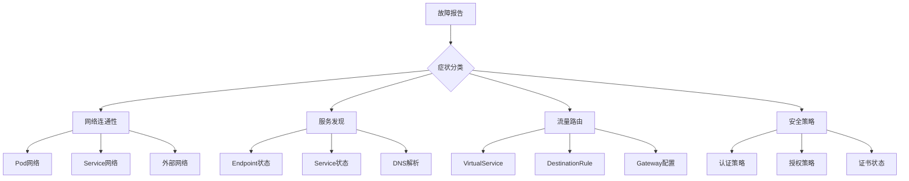

# 第15章：Service Mesh 故障排查与诊断技巧

## 1. 故障排查方法论

### 1.1 系统化排查流程

#### 1.1.1 分层排查策略


#### 1.1.2 故障树分析
```yaml
# 故障树分析模板
故障现象: "服务间通信失败"
可能原因:
  - 网络层面:
    - Pod 网络不通
    - Service IP 不可达
    - 防火墙规则阻止
    
  - Service Mesh 层面:
    - Sidecar 未注入
    - Envoy 配置错误
    - Pilot 配置同步失败
    
  - 应用层面:
    - 应用端口未监听
    - 应用健康检查失败
    - 应用资源不足
```

## 2. 网络连通性排查

### 2.1 基础网络检查

#### 2.1.1 Pod 网络连通性测试
```bash
# 检查 Pod 网络连通性
kubectl exec -it product-pod -c debug -- ping -c 3 user-service
kubectl exec -it product-pod -c debug -- nslookup user-service
kubectl exec -it product-pod -c debug -- curl -v http://user-service:8080/health

# 检查 Service IP 连通性
kubectl get svc user-service -o wide
kubectl exec -it product-pod -c debug -- ping -c 3 <SERVICE_CLUSTER_IP>
```

#### 2.1.2 网络策略检查
```bash
# 检查网络策略
kubectl get networkpolicies --all-namespaces
kubectl describe networkpolicy my-network-policy

# 检查 Calico/Flannel 状态
kubectl get pods -n kube-system | grep -E "(calico|flannel)"
kubectl logs -n kube-system <network-plugin-pod>
```

### 2.2 Service Mesh 网络检查

#### 2.2.1 Sidecar 状态检查
```bash
# 检查 Sidecar 注入状态
kubectl get pods -l app=product-service -o jsonpath='{.items[*].spec.containers[*].name}'

# 检查 Sidecar 运行状态
kubectl logs product-pod -c istio-proxy
kubectl exec -it product-pod -c istio-proxy -- ps aux

# 检查 Envoy 配置
kubectl exec -it product-pod -c istio-proxy -- curl localhost:15000/config_dump
```

#### 2.2.2 服务发现检查
```bash
# 检查 Endpoint 状态
kubectl get endpoints user-service
kubectl describe endpoints user-service

# 检查 Istio 服务发现
kubectl exec -it istiod-pod -n istio-system -- pilot-discovery request GET /debug/endpointz
kubectl exec -it istiod-pod -n istio-system -- pilot-discovery request GET /debug/configz
```

## 3. 配置问题排查

### 3.1 Istio 配置验证

#### 3.1.1 配置同步检查
```bash
# 检查配置同步状态
kubectl get virtualservices,destinationrules,gateways --all-namespaces

# 检查配置同步延迟
kubectl logs -n istio-system -l app=istiod | grep -E "(push|sync)"

# 验证配置有效性
istioctl analyze
istioctl validate -f my-virtualservice.yaml
```

#### 3.1.2 配置冲突检测
```bash
# 检测配置冲突
istioctl x describe pod product-pod
istioctl proxy-status

# 检查配置生效情况
kubectl exec -it product-pod -c istio-proxy -- curl localhost:15000/clusters | grep user-service
```

### 3.2 应用配置检查

#### 3.2.1 应用健康检查
```bash
# 检查应用健康状态
kubectl describe pod product-pod
kubectl logs product-pod -c product-service

# 检查应用资源使用
kubectl top pod product-pod
kubectl describe node <node-name>
```

## 4. 安全策略排查

### 4.1 认证授权检查

#### 4.1.1 mTLS 配置检查
```bash
# 检查 mTLS 配置
kubectl get peerauthentication --all-namespaces
kubectl get destinationrules --all-namespaces -o yaml | grep -A5 -B5 "mtls"

# 验证证书状态
kubectl exec -it product-pod -c istio-proxy -- cat /etc/certs/cert-chain.pem | openssl x509 -text -noout
kubectl exec -it product-pod -c istio-proxy -- cat /etc/certs/root-cert.pem | openssl x509 -text -noout
```

#### 4.1.2 授权策略检查
```bash
# 检查授权策略
kubectl get authorizationpolicies --all-namespaces
kubectl describe authorizationpolicy my-auth-policy

# 验证策略生效
kubectl exec -it test-pod -- curl -v -H "Authorization: Bearer invalid-token" http://product-service:8080/api/products
```

### 4.2 网络安全检查

#### 4.2.1 网络策略验证
```bash
# 测试网络策略
kubectl run test-pod --image=alpine --rm -it -- sh
# 在测试 Pod 中尝试访问目标服务
ping user-service
curl http://user-service:8080

# 检查安全组规则
kubectl get networkpolicies -o yaml
```

## 5. 性能问题排查

### 5.1 性能指标分析

#### 5.1.1 关键性能指标检查
```bash
# 检查 Envoy 统计信息
kubectl exec -it product-pod -c istio-proxy -- curl -s localhost:15000/stats | grep -E "(upstream_rq_time|upstream_cx_|cluster)"

# 检查 Pilot 性能
kubectl logs -n istio-system -l app=istiod | grep -E "(duration|latency|timeout)"

# 检查资源使用
kubectl top pods -n istio-system
kubectl describe nodes | grep -A10 "Allocated resources"
```

#### 5.1.2 连接池状态检查
```bash
# 检查连接池状态
kubectl exec -it product-pod -c istio-proxy -- curl -s localhost:15000/clusters | grep -A10 user-service

# 检查连接泄漏
kubectl exec -it product-pod -c istio-proxy -- curl -s localhost:15000/stats | grep -E "(upstream_cx_destroy|upstream_cx_overflow)"
```

### 5.2 延迟分析工具

#### 5.2.1 分布式追踪分析
```bash
# 检查 Jaeger 追踪数据
kubectl port-forward -n istio-system svc/jaeger-query 16686:16686
# 访问 http://localhost:16686 查看追踪数据

# 分析追踪数据
curl -s "http://jaeger-query:16686/api/traces?service=product-service&limit=10" | jq '.data[] | {traceID, duration, spans: .spans | length}'
```

#### 5.2.2 性能 profiling
```bash
# Envoy CPU profiling
kubectl exec -it product-pod -c istio-proxy -- curl -s localhost:15000/cpuprofiler?enable=y
sleep 30
kubectl exec -it product-pod -c istio-proxy -- curl -s localhost:15000/cpuprofiler?enable=n

# 内存分析
kubectl exec -it product-pod -c istio-proxy -- curl -s localhost:15000/memory
```

## 6. 自动化诊断工具

### 6.1 诊断脚本开发

#### 6.1.1 综合诊断脚本
```python
#!/usr/bin/env python3
import subprocess
import json
import yaml
import sys

def check_pod_health(pod_name, namespace="default"):
    """检查 Pod 健康状态"""
    try:
        # 检查 Pod 状态
        cmd = f"kubectl get pod {pod_name} -n {namespace} -o json"
        result = subprocess.run(cmd.split(), capture_output=True, text=True)
        
        if result.returncode != 0:
            return {"status": "error", "message": f"无法获取 Pod 信息: {result.stderr}"}
        
        pod_info = json.loads(result.stdout)
        
        # 分析 Pod 状态
        status = pod_info["status"]
        conditions = status.get("conditions", [])
        
        health_report = {
            "pod_name": pod_name,
            "namespace": namespace,
            "phase": status.get("phase"),
            "conditions": {}
        }
        
        for condition in conditions:
            health_report["conditions"][condition["type"]] = condition["status"]
        
        return {"status": "success", "data": health_report}
        
    except Exception as e:
        return {"status": "error", "message": str(e)}

def check_service_mesh_config(service_name, namespace="default"):
    """检查 Service Mesh 配置"""
    config_checks = {}
    
    # 检查 VirtualService
    try:
        cmd = f"kubectl get virtualservice {service_name} -n {namespace} -o yaml"
        result = subprocess.run(cmd.split(), capture_output=True, text=True)
        
        if result.returncode == 0:
            vs_config = yaml.safe_load(result.stdout)
            config_checks["virtualservice"] = {"exists": True, "spec": vs_config.get("spec", {})}
        else:
            config_checks["virtualservice"] = {"exists": False}
    except Exception as e:
        config_checks["virtualservice"] = {"exists": False, "error": str(e)}
    
    # 检查 DestinationRule
    try:
        cmd = f"kubectl get destinationrule {service_name} -n {namespace} -o yaml"
        result = subprocess.run(cmd.split(), capture_output=True, text=True)
        
        if result.returncode == 0:
            dr_config = yaml.safe_load(result.stdout)
            config_checks["destinationrule"] = {"exists": True, "spec": dr_config.get("spec", {})}
        else:
            config_checks["destinationrule"] = {"exists": False}
    except Exception as e:
        config_checks["destinationrule"] = {"exists": False, "error": str(e)}
    
    return config_checks

def main():
    if len(sys.argv) < 2:
        print("Usage: python diagnose.py <pod_name> [namespace]")
        sys.exit(1)
    
    pod_name = sys.argv[1]
    namespace = sys.argv[2] if len(sys.argv) > 2 else "default"
    
    print(f"诊断 Pod: {pod_name} (命名空间: {namespace})")
    print("=" * 50)
    
    # 执行健康检查
    health_result = check_pod_health(pod_name, namespace)
    if health_result["status"] == "success":
        print("✓ Pod 健康状态检查完成")
        print(json.dumps(health_result["data"], indent=2))
    else:
        print("✗ Pod 健康状态检查失败:", health_result["message"])
    
    # 检查 Service Mesh 配置
    service_name = pod_name.rsplit("-", 1)[0]  # 从 Pod 名提取服务名
    config_checks = check_service_mesh_config(service_name, namespace)
    print("\n✓ Service Mesh 配置检查完成")
    print(json.dumps(config_checks, indent=2))

if __name__ == "__main__":
    main()
```

### 6.2 监控告警配置

#### 6.2.1 关键告警规则
```yaml
# Prometheus 告警规则
apiVersion: monitoring.coreos.com/v1
kind: PrometheusRule
metadata:
  name: service-mesh-alerts
  namespace: monitoring
spec:
  groups:
  - name: service-mesh
    rules:
    - alert: ServiceMeshHighErrorRate
      expr: rate(istio_requests_total{response_code=~"5.."}[5m]) / rate(istio_requests_total[5m]) > 0.05
      for: 2m
      labels:
        severity: critical
      annotations:
        summary: "服务网格错误率过高"
        description: "服务 {{ $labels.destination_service }} 的错误率超过 5%"
    
    - alert: ServiceMeshHighLatency
      expr: histogram_quantile(0.95, rate(istio_request_duration_milliseconds_bucket[5m])) > 1000
      for: 2m
      labels:
        severity: warning
      annotations:
        summary: "服务网格延迟过高"
        description: "服务 {{ $labels.destination_service }} 的 P95 延迟超过 1 秒"
    
    - alert: ServiceMeshConfigSyncFailed
      expr: rate(pilot_xds_push_errors[5m]) > 0
      for: 1m
      labels:
        severity: critical
      annotations:
        summary: "Service Mesh 配置同步失败"
        description: "Pilot 配置同步出现错误"
```

## 7. 故障恢复策略

### 7.1 快速恢复措施

#### 7.1.1 服务降级策略
```yaml
# 故障时服务降级配置
apiVersion: networking.istio.io/v1beta1
kind: VirtualService
metadata:
  name: product-service-fallback
spec:
  hosts:
  - product-service
  http:
  - match:
    - headers:
        x-fallback-mode:
          exact: "true"
    route:
    - destination:
        host: product-service-fallback
        port:
          number: 8080
      weight: 100
  
  - route:
    - destination:
        host: product-service
        port:
          number: 8080
      weight: 100
    
    # 故障转移配置
    fault:
      abort:
        percentage:
          value: 0
        httpStatus: 503
    
    retries:
      attempts: 3
      perTryTimeout: 2s
```

### 7.2 事后分析流程

#### 7.2.1 故障复盘模板
```markdown
# 故障复盘报告模板

## 故障概述
- **故障时间**: 
- **影响范围**: 
- **恢复时间**: 
- **故障等级**: 

## 故障现象描述

## 根本原因分析

## 处理过程记录

## 改进措施
- 短期措施（24小时内）:
- 中期措施（1周内）:
- 长期措施（1月内）:

## 经验教训
```

通过系统化的故障排查方法和工具，可以快速定位和解决 Service Mesh 中的各种问题，确保系统的稳定性和可靠性。