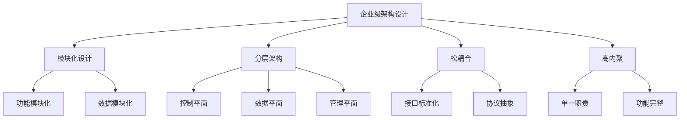

# 第16章：企业级 Service Mesh 架构设计

## 1. 企业级架构设计原则

### 1.1 设计目标与约束

#### 1.1.1 企业级需求分析
```yaml
# 企业级 Service Mesh 需求矩阵
设计维度:
  可用性:
    - 99.99% 服务可用性
    - 多地域容灾
    - 快速故障恢复
  
  可扩展性:
    - 支持千级服务规模
    - 线性扩展能力
    - 资源弹性伸缩
  
  安全性:
    - 零信任网络架构
    - 端到端加密
    - 合规性要求
  
  可观测性:
    - 全链路追踪
    - 实时监控告警
    - 性能分析能力
  
  运维性:
    - 自动化部署
    - 配置管理
    - 版本控制
```

#### 1.1.2 架构设计原则


## 2. 多集群架构设计

### 2.1 多集群拓扑模式

#### 2.1.1 主从集群架构
```yaml
# 主从集群配置
clusterTopology:
  primaryCluster:
    name: "prod-primary"
    region: "us-east-1"
    role: "primary"
    services:
      - "core-api"
      - "user-service"
      - "payment-service"
  
  secondaryClusters:
    - name: "prod-secondary"
      region: "us-west-2"
      role: "secondary"
      services:
        - "core-api"
        - "user-service"
    
    - name: "dr-cluster"
      region: "eu-west-1"
      role: "disaster-recovery"
      services:
        - "core-api"
        - "user-service"
```

#### 2.1.2 联邦集群架构
```yaml
# 联邦集群配置
apiVersion: networking.istio.io/v1alpha3
kind: ServiceMeshPeer
metadata:
  name: cluster-federation
  namespace: istio-system
spec:
  remote:
    addresses:
    - "192.168.1.100"
    - "192.168.1.101"
  
  # 安全配置
  security:
    trustDomain: "cluster.local"
    clientID: "cluster-federation"
  
  # 网络配置
  gateways:
  - address: 192.168.1.100
    port: 15443
  - address: 192.168.1.101
    port: 15443
```

### 2.2 跨集群服务发现

#### 2.2.1 全局服务注册
```yaml
# 全局服务注册配置
apiVersion: networking.istio.io/v1beta1
kind: ServiceEntry
metadata:
  name: global-user-service
  namespace: istio-system
spec:
  hosts:
  - user-service.global
  location: MESH_INTERNAL
  resolution: STATIC
  endpoints:
  - address: 10.0.1.10
    locality: us-east-1
    labels:
      cluster: primary
      version: v1.2.3
  - address: 10.0.2.10
    locality: us-west-2
    labels:
      cluster: secondary
      version: v1.2.3
  - address: 10.0.3.10
    locality: eu-west-1
    labels:
      cluster: dr
      version: v1.2.3
  
  ports:
  - number: 8080
    name: http
    protocol: HTTP
```

#### 2.2.2 智能路由策略
```yaml
# 跨集群路由策略
apiVersion: networking.istio.io/v1beta1
kind: DestinationRule
metadata:
  name: global-user-service-dr
  namespace: istio-system
spec:
  host: user-service.global
  trafficPolicy:
    # 基于位置的负载均衡
    loadBalancer:
      localityLbSetting:
        enabled: true
        distribute:
        - from: us-east-1/*
          to:
            "us-east-1/*": 70
            "us-west-2/*": 20
            "eu-west-1/*": 10
    
    # 连接池优化
    connectionPool:
      tcp:
        maxConnections: 1000
        connectTimeout: 30s
      http:
        http2MaxRequests: 1000
        maxRequestsPerConnection: 10
```

## 3. 安全架构设计

### 3.1 零信任安全模型

#### 3.1.1 身份认证体系
```yaml
# 零信任身份认证配置
apiVersion: security.istio.io/v1beta1
kind: PeerAuthentication
metadata:
  name: zero-trust-auth
  namespace: istio-system
spec:
  mtls:
    mode: STRICT
  
  # 按命名空间配置
  selector:
    matchLabels:
      security-zone: internal

---
apiVersion: security.istio.io/v1beta1
kind: RequestAuthentication
metadata:
  name: jwt-auth
  namespace: istio-system
spec:
  selector:
    matchLabels:
      app: api-gateway
  
  jwtRules:
  - issuer: "https://auth.company.com"
    jwksUri: "https://auth.company.com/.well-known/jwks.json"
    audiences:
    - "api.company.com"
```

#### 3.1.2 授权策略体系
```yaml
# 细粒度授权策略
apiVersion: security.istio.io/v1beta1
kind: AuthorizationPolicy
metadata:
  name: api-access-control
  namespace: default
spec:
  selector:
    matchLabels:
      app: user-service
  
  rules:
  - from:
    - source:
        principals: ["cluster.local/ns/backend/sa/api-service"]
    
    to:
    - operation:
        methods: ["GET", "POST"]
        paths: ["/api/v1/users/*"]
    
    when:
    - key: request.auth.claims[role]
      values: ["admin", "user"]

---
# 网络分段策略
apiVersion: security.istio.io/v1beta1
kind: AuthorizationPolicy
metadata:
  name: network-segmentation
  namespace: default
spec:
  action: DENY
  rules:
  - from:
    - source:
        notNamespaces: ["backend", "frontend"]
    to:
    - operation:
        hosts: ["*.internal.company.com"]
```

### 3.2 证书管理体系

#### 3.2.1 证书生命周期管理
```yaml
# 证书管理配置
apiVersion: cert-manager.io/v1
kind: ClusterIssuer
metadata:
  name: istio-ca-issuer
spec:
  ca:
    secretName: istio-ca-secret

---
apiVersion: cert-manager.io/v1
kind: Certificate
metadata:
  name: istio-gateway-cert
  namespace: istio-system
spec:
  secretName: istio-gateway-tls
  issuerRef:
    name: istio-ca-issuer
    kind: ClusterIssuer
  
  commonName: "*.company.com"
  dnsNames:
  - "api.company.com"
  - "app.company.com"
  - "internal.company.com"
  
  # 证书轮换配置
  duration: 2160h # 90天
  renewBefore: 720h # 30天前开始续期
```

## 4. 可观测性架构

### 4.1 全链路追踪体系

#### 4.1.1 分布式追踪配置
```yaml
# Jaeger 配置优化
apiVersion: jaegertracing.io/v1
kind: Jaeger
metadata:
  name: enterprise-jaeger
  namespace: observability
spec:
  strategy: production
  
  storage:
    type: elasticsearch
    options:
      es:
        server-urls: http://elasticsearch.observability:9200
        index-prefix: jaeger
        username: jaeger
        password: ${ES_PASSWORD}
  
  ingress:
    enabled: true
    annotations:
      kubernetes.io/ingress.class: nginx
    hosts:
    - jaeger.company.com
  
  # 采样策略
  sampling:
    options:
      default_strategy:
        type: probabilistic
        param: 0.01
```

#### 4.1.2 自定义追踪配置
```yaml
# 自定义追踪头配置
apiVersion: networking.istio.io/v1beta1
kind: EnvoyFilter
metadata:
  name: custom-tracing
  namespace: istio-system
spec:
  configPatches:
  - applyTo: HTTP_FILTER
    match:
      context: SIDECAR_INBOUND
      listener:
        filterChain:
          filter:
            name: "envoy.filters.network.http_connection_manager"
    
    patch:
      operation: MERGE
      value:
        name: envoy.filters.network.http_connection_manager
        typed_config:
          "@type": type.googleapis.com/envoy.extensions.filters.network.http_connection_manager.v3.HttpConnectionManager
          tracing:
            custom_tags:
            - tag: business_id
              request_header:
                name: x-business-id
                default_value: unknown
            - tag: user_agent
              request_header:
                name: user-agent
            - tag: environment
              literal:
                value: production
```

### 4.2 指标监控体系

#### 4.2.1 多维度监控配置
```yaml
# Prometheus 监控配置
apiVersion: monitoring.coreos.com/v1
kind: Prometheus
metadata:
  name: enterprise-prometheus
  namespace: observability
spec:
  replicas: 3
  retention: 30d
  
  resources:
    requests:
      memory: 16Gi
      cpu: 4
    limits:
      memory: 32Gi
      cpu: 8
  
  # 服务发现配置
  serviceMonitorSelector: {}
  podMonitorSelector: {}
  
  # 远程写入配置
  remoteWrite:
  - url: "http://thanos-receive.observability:10908/api/v1/receive"
    queue_config:
      capacity: 5000
      max_shards: 200
      min_shards: 50
```

#### 4.2.2 自定义指标收集
```yaml
# 自定义业务指标
apiVersion: networking.istio.io/v1beta1
kind: EnvoyFilter
metadata:
  name: business-metrics
  namespace: istio-system
spec:
  configPatches:
  - applyTo: HTTP_FILTER
    match:
      context: SIDECAR_INBOUND
      listener:
        filterChain:
          filter:
            name: "envoy.filters.network.http_connection_manager"
    
    patch:
      operation: INSERT_BEFORE
      value:
        name: envoy.filters.http.wasm
        typed_config:
          "@type": type.googleapis.com/udpa.type.v1.TypedStruct
          type_url: type.googleapis.com/envoy.extensions.filters.http.wasm.v3.Wasm
          value:
            config:
              vm_config:
                runtime: envoy.wasm.runtime.v8
                code:
                  local:
                    inline_string: |
                      // WASM 代码实现自定义指标收集
```

## 5. 运维管理架构

### 5.1 GitOps 工作流

#### 5.1.1 配置版本管理
```yaml
# ArgoCD 应用配置
apiVersion: argoproj.io/v1alpha1
kind: Application
metadata:
  name: service-mesh-config
  namespace: argocd
spec:
  project: default
  
  source:
    repoURL: https://git.company.com/infrastructure/service-mesh.git
    targetRevision: main
    path: config/production
    
    # 配置同步策略
    syncPolicy:
      automated:
        prune: true
        selfHeal: true
      
      syncOptions:
      - CreateNamespace=true
      - PruneLast=true
  
  destination:
    server: https://kubernetes.default.svc
    namespace: istio-system
  
  # 健康检查
  healthChecks:
  - type: healthCheck
    name: istiod-health
    spec:
      group: networking.istio.io
      version: v1alpha3
      kind: IstioOperator
      name: istio-control-plane
```

#### 5.1.2 配置验证流程
```yaml
# 配置验证流水线
apiVersion: tekton.dev/v1beta1
kind: Pipeline
metadata:
  name: service-mesh-validation
spec:
  workspaces:
  - name: source
  
  tasks:
  - name: syntax-check
    taskRef:
      name: yaml-validator
    workspaces:
    - name: source
      workspace: source
  
  - name: istio-validation
    taskRef:
      name: istioctl-validate
    workspaces:
    - name: source
      workspace: source
    runAfter:
    - syntax-check
  
  - name: security-scan
    taskRef:
      name: security-scanner
    workspaces:
    - name: source
      workspace: source
    runAfter:
    - istio-validation
```

### 5.2 容量规划与弹性

#### 5.2.1 自动扩缩容策略
```yaml
# HPA 配置
apiVersion: autoscaling/v2beta2
kind: HorizontalPodAutoscaler
metadata:
  name: istiod-hpa
  namespace: istio-system
spec:
  scaleTargetRef:
    apiVersion: apps/v1
    kind: Deployment
    name: istiod
  
  minReplicas: 3
  maxReplicas: 10
  
  metrics:
  - type: Resource
    resource:
      name: cpu
      target:
        type: Utilization
        averageUtilization: 70
  
  - type: Resource
    resource:
      name: memory
      target:
        type: Utilization
        averageUtilization: 80
  
  # 自定义指标
  - type: Pods
    pods:
      metric:
        name: istio_config_updates_per_second
      target:
        type: AverageValue
        averageValue: "50"
```

#### 5.2.2 资源配额管理
```yaml
# 命名空间资源配额
apiVersion: v1
kind: ResourceQuota
metadata:
  name: service-mesh-quota
  namespace: istio-system
spec:
  hard:
    requests.cpu: "10"
    requests.memory: 20Gi
    limits.cpu: "20"
    limits.memory: 40Gi
    
    # 对象数量限制
    pods: "100"
    services: "50"
    configmaps: "100"
    secrets: "100"
```

## 6. 灾难恢复架构

### 6.1 多地域容灾设计

#### 6.1.1 数据同步策略
```yaml
# 跨地域数据同步
apiVersion: v1
kind: ConfigMap
metadata:
  name: cross-region-sync
  namespace: istio-system
data:
  sync-config.yaml: |
    regions:
      primary:
        name: us-east-1
        weight: 70
        services:
          - user-service
          - payment-service
      
      secondary:
        name: us-west-2
        weight: 20
        services:
          - user-service
          - payment-service
      
      dr:
        name: eu-west-1
        weight: 10
        services:
          - user-service
    
    # 故障转移策略
    failover:
      enabled: true
      detection_timeout: 30s
      recovery_timeout: 5m
```

#### 6.1.2 备份恢复策略
```yaml
# 配置备份策略
apiVersion: batch/v1
kind: CronJob
metadata:
  name: istio-config-backup
  namespace: istio-system
spec:
  schedule: "0 2 * * *"
  
  jobTemplate:
    spec:
      template:
        spec:
          containers:
          - name: backup
            image: bitnami/kubectl:latest
            command:
            - /bin/sh
            - -c
            - |
              # 备份 Istio 配置
              kubectl get virtualservices,destinationrules,gateways -A -o yaml > /backup/istio-config-$(date +%Y%m%d).yaml
              
              # 备份证书
              kubectl get secrets -n istio-system -l istio.io/cert-manager -o yaml > /backup/certs-$(date +%Y%m%d).yaml
              
              # 上传到对象存储
              aws s3 cp /backup/ s3://backup-bucket/istio/ --recursive
            
            volumeMounts:
            - name: backup-volume
              mountPath: /backup
          
          volumes:
          - name: backup-volume
            persistentVolumeClaim:
              claimName: backup-pvc
          
          restartPolicy: OnFailure
```

通过这种企业级架构设计，可以构建出高可用、高安全、易维护的 Service Mesh 基础设施，支撑大规模微服务系统的稳定运行。